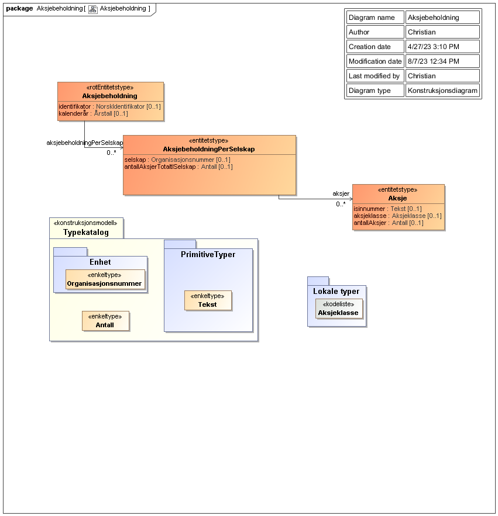

<summary>Tjenesten leverer informasjon en person eller en virksomhet sin aksjebeholdning pr. 31.12 sist kalenderår.</summary>

<Tabs underline={true}>
<TabItem headerText="Om tjenesten" itemKey="itemKey-1" default>

For generell informasjon om tjenestene se egne sider om:

* [Bruk av tjenestene](../om/bruk.md)
* [Sikkerhetsmekansimer](../om/sikkerhet.md)
* [Rettighetspakker](../om/rettighetspakker.md)
* [Feilhåndtering](../om/feil.md)
* [Versjonering](../om/versjoner.md)
* [Teknisk spesifikasjon](../om/tekniskspesifikasjon.md)

## Scope

Følgende scope skal benyttes ved autentisering i Maskinporten: `skatteetaten:aksjebeholdning`

## Delegering

Tilgang til dette api'et kan delegeres i Altinn, f.eks. dersom leverandør benyttes for den tekniske oppkoblingen. Søk
opp følgende tjeneste i Altinn for å delegere tilgangen: `Aksjebeholdning API - På vegne av`

## Teknisk spesifikasjon

Url’er til api'et, beskrivelsen av parameterne, endepunkter og respons ligger
i [Open API spesifikasjonen](https://app.swaggerhub.com/apis/Skatteetaten_Deling/aksjebeholdning-api)
på SwaggerHub.

## Rettighetspakker

| Navn på rettighetspakke |	
|-------------------------|
| offentligmedhjemmel     |

## Datakatalog

Dette api'et er pt. ikke dokumentert i felles datakatalog.

</TabItem>
<TabItem headerText="Eksempler" itemKey="itemKey-2"> 

## JSON

```json
{
  "aksjebeholdningPerSelskap": [
    {
      "selskap": "210842632",
      "antallAksjerTotaltISelskap": 8200,
      "aksjer": [
        {
          "isinnummer": "NO0000000000",
          "aksjeklasse": "ordinaer",
          "antallAksjer": 20
        }
      ]
    },
    {
      "selskap": "312850311",
      "antallAksjerTotaltISelskap": 100000,
      "aksjer": [
        {
          "isinnummer": "NO0000000000",
          "aksjeklasse": "ordinaer",
          "antallAksjer": 30
        }
      ]
    },
    {
      "selskap": "310459402",
      "antallAksjerTotaltISelskap": 1000,
      "aksjer": [
        {
          "isinnummer": "NO0000000000",
          "aksjeklasse": "ordinaer",
          "antallAksjer": 10
        }
      ]
    },
    {
      "selskap": "312417596",
      "antallAksjerTotaltISelskap": 400,
      "aksjer": [
        {
          "isinnummer": "NO0000000000",
          "aksjeklasse": "ordinaer",
          "antallAksjer": 10
        }
      ]
    }
  ],
  "identifikator": "06854699537",
  "kalenderaar": "2022"
}
```

</TabItem>
<TabItem headerText="Feilkoder" itemKey="itemKey-3">

Se egen side for generell info om [feilhåndtering i tjenestene](../om/feil.md).

Tabellen under viser en oversikt over hvilke spesifikke feilkoder denne applikasjonen kan gi.

| Feilkode | HTTP Statuskode | Feilområde                                                                  |
|----------|-----------------|-----------------------------------------------------------------------------|
| ABE-001  | 500             | Uventet feil på tjenesten.                                                  |
| ABE-002  | 500             | Uventet feil i et bakenforliggende system.                                  |
| ABE-003  | 404             | Ukjent url benyttet.                                                        |
| ABE-004  | 401             | Feil i forbindelse med autentisering.                                       |
| ABE-005  | 403             | Feil i forbindelse med autorisering.                                        |
| ABE-006  | 400             | Feil i forbindelse med validering av inputdata.                             |
| ABE-007  | 404             | Ingen treff på aksjebeholdning for gitt organisasjosnsnummer og kalenderår. |
| ABE-008  | 406             | Feil tilknyttet dataformat. Kun json eller xml er støttet.                  |

</TabItem>
<TabItem headerText="Informasjonsmodell" itemKey="itemKey-4">

[](../../static/download/Informasjonsmodell_Aksjebeholdning.png)

</TabItem>
<TabItem headerText="Test" itemKey="itemKey-5">

## Tenor testdatasøk

Det finnes pt. ikke søk i [Tenor](../test/tenor.md) for denne tjenesten, og testdata er derfor listet her.

## Testdata

Under har vi listet noen testdata som er tilgjengelige for denne tjenesten i Skatteetatens testmiljø for eksterne:

| personidentifikator | Kalenderår |
|---------------------|------------|
| 06854699537         | 2022       |

</TabItem>
</Tabs>
