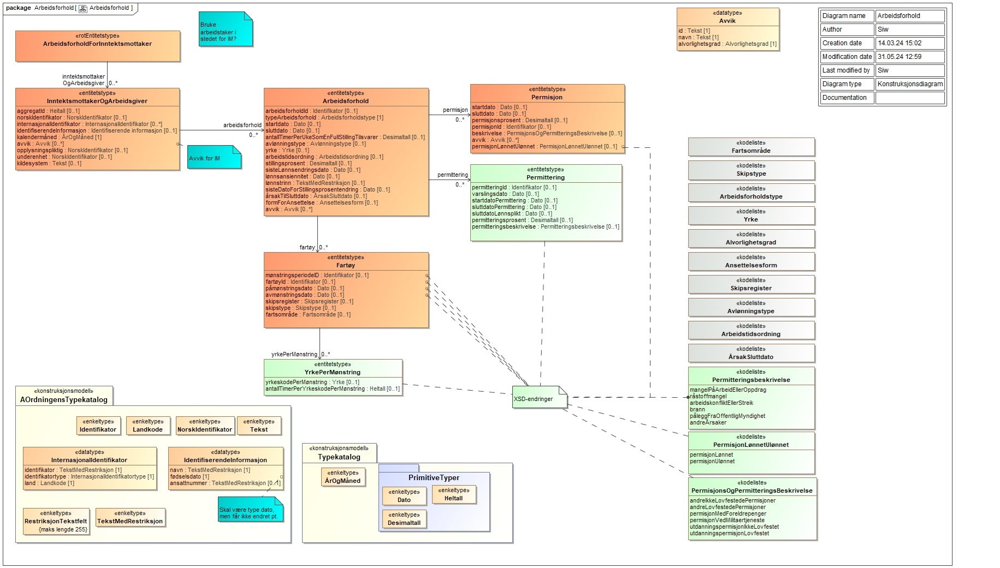

<Summary>Tjenesten leverer informasjon om arbeidsgivers (opplysningspliktiges) innrapporterte
arbeidsforholdsopplysninger for en inntektsmottaker for en gitt periode.</Summary>

<Tabs underline={true}>
<TabItem headerText="Om tjenesten" itemKey="itemKey-1" default>

For generell informasjon om tjenestene se egne sider om:

* [Bruk av tjenestene](../om/bruk.md)
* [Sikkerhetsmekansimer](../om/sikkerhet.md)
* [Rettighetspakker](../om/rettighetspakker.md)
* [Feilhåndtering](../om/feil.md)
* [Versjonering](../om/versjoner.md)
* [Teknisk spesifikasjon](../om/tekniskspesifikasjon.md)

## Scope

Følgende scope skal benyttes ved autentisering i Maskinporten: `skatteetaten:arbeidsforhold`

## Delegering

Tilgang til dette API-et kan delegeres i Altinn, f.eks. dersom leverandør benyttes for den tekniske oppkoblingen. Søk
opp følgende tjeneste i Altinn for å delegere tilgangen: `Arbeidsforhold API - På vegne av`

## Teknisk spesifikasjon

URL-er til API-et, beskrivelsen av parameterne, endepunkter og respons ligger
i [Open API spesifikasjonen](https://app.swaggerhub.com/apis/skatteetaten/arbeidsforhold-api) på SwaggerHub.

## Rettighetspakker

| Navn på rettighetspakke |
|-------------------------|
| nav                     |
| ssb                     |

## Datakatalog

[Datatjenestebeskrivelse](https://data.norge.no/data-services/b1bbd381-423f-3752-9a94-0f72cf372df7) i Felles datakatalog.

</TabItem>
<TabItem headerText="Eksempler" itemKey="itemKey-2">

## JSON

```json
{
  "inntektsmottakerOgArbeidsgiver": [
    {
      "kalendermaaned": "2023-01",
      "aggregatId": 85,
      "norskIdentifikator": "12916399977",
      "opplysningspliktig": "310525723",
      "underenhet": "215165132",
      "kildesystem": "testdatagenerator-rst-ekstern-deling",
      "arbeidsforhold": [
        {
          "typeArbeidsforhold": "ordinaertArbeidsforhold",
          "arbeidsforholdId": "e2ea2885-7ea6-49bd-8196-1032ef934a71",
          "startdato": "2023-01-01",
          "antallTimerPerUkeSomEnFullStillingTilsvarer": 37.5,
          "yrke": "1142114",
          "arbeidstidsordning": "ikkeSkift",
          "stillingsprosent": 100.0,
          "sisteLoennsendringsdato": "2023-01-01",
          "sisteDatoForStillingsprosentendring": "2023-01-01",
          "formForAnsettelse": "fast"
        }
      ]
    },
    {
      "kalendermaaned": "2023-02",
      "aggregatId": 86,
      "norskIdentifikator": "12916399977",
      "opplysningspliktig": "310525723",
      "underenhet": "215165132",
      "kildesystem": "testdatagenerator-rst-ekstern-deling",
      "arbeidsforhold": [
        {
          "typeArbeidsforhold": "ordinaertArbeidsforhold",
          "arbeidsforholdId": "e2ea2885-7ea6-49bd-8196-1032ef934a71",
          "startdato": "2023-01-01",
          "antallTimerPerUkeSomEnFullStillingTilsvarer": 37.5,
          "yrke": "1142114",
          "arbeidstidsordning": "ikkeSkift",
          "stillingsprosent": 100.0,
          "sisteLoennsendringsdato": "2023-01-01",
          "sisteDatoForStillingsprosentendring": "2023-01-01",
          "formForAnsettelse": "fast"
        }
      ]
    },
    {
      "kalendermaaned": "2023-03",
      "aggregatId": 115,
      "norskIdentifikator": "12916399977",
      "opplysningspliktig": "310525723",
      "underenhet": "215165132",
      "kildesystem": "testdatagenerator-rst-ekstern-deling",
      "arbeidsforhold": [
        {
          "typeArbeidsforhold": "ordinaertArbeidsforhold",
          "arbeidsforholdId": "e2ea2885-7ea6-49bd-8196-1032ef934a71",
          "startdato": "2023-01-01",
          "antallTimerPerUkeSomEnFullStillingTilsvarer": 37.5,
          "yrke": "1142114",
          "arbeidstidsordning": "ikkeSkift",
          "stillingsprosent": 100.0,
          "sisteLoennsendringsdato": "2023-01-01",
          "sisteDatoForStillingsprosentendring": "2023-01-01",
          "formForAnsettelse": "fast"
        }
      ]
    }
  ]
}
```

</TabItem>
<TabItem headerText="Feilkoder" itemKey="itemKey-3">

Se egen side for generell info om [feilhåndtering i tjenestene](../om/feil.md).

Tabellen under viser en oversikt over hvilke spesifikke feilkoder denne applikasjonen kan gi. Feilmeldingen vil kunne
variere selv om samme feilkode returneres. Dette er for å kunne gi en så presis beskrivelse av feilen som mulig.

| Feilkode | HTTP Statuskode | Feilområde                                             |
|----------|-----------------|--------------------------------------------------------|
| AFO-001  | 500             | Uventet feil på tjenesten.                             |
| AFO-002  | 500             | Uventet feil i et bakenforliggende system.             |
| AFO-003  | 404             | Ukjent url benyttet.                                   |
| AFO-004  | 401             | Feil i forbindelse med autentisering.                  |
| AFO-005  | 403             | Feil i forbindelse med autorisering.                   |
| AFO-006  | 400             | Feil i forbindelse med validering av inputdata.        |
| AFO-007  | 404             | Fant ikke arbeidsforhold.                              |
| AFO-008  | 406             | Feil tilknyttet dataformat.                            |  
| AFO-009  | 410             | Opplysninger om arbeidsforhold er slettet for periode. |

</TabItem>
<TabItem headerText="Informasjonsmodell" itemKey="itemKey-4">

[](../../static/download/Informasjonsmodell_Arbeidsforhold.png)

</TabItem>
<TabItem headerText="Test" itemKey="itemKey-5">

Det finnes pt. ikke søk i [Tenor](../test/tenor.md) for denne tjenesten, men man kan benytte hendelseslisten for å finne
testdata man kan benytte for å teste oppslagstjenesten.


</TabItem>
</Tabs>
