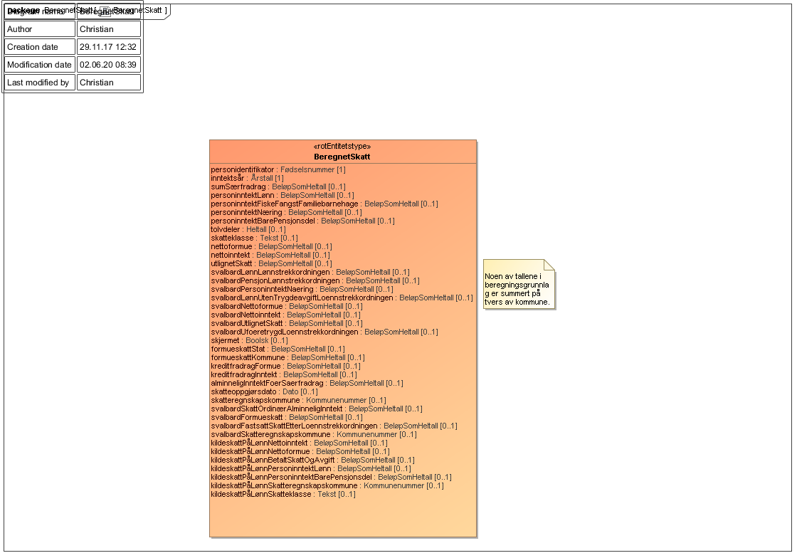
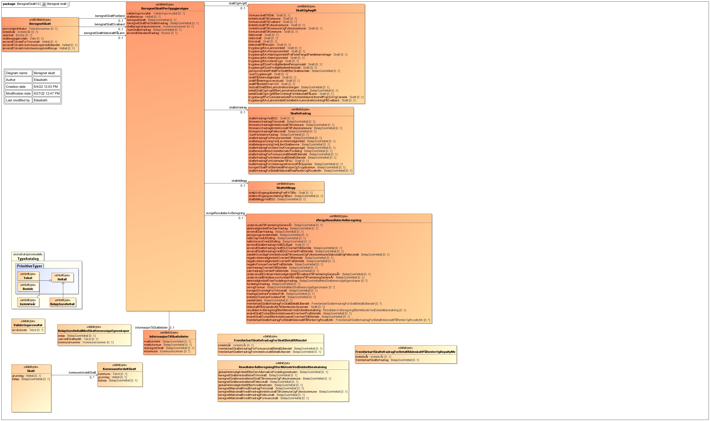

<summary>Tjenesten leverer informasjon om inntekt, fradrag, formue, gjeld og beregnet skatt.</summary>

<Tabs underline={true}>
<TabItem headerText="Om tjenesten" itemKey="itemKey-1" default>

For generell informasjon om tjenestene se egne sider om:
* [Bruk av tjenestene](../om/bruk.md)
* [Sikkerhetsmekansimer](../om/sikkerhet.md)
* [Rettighetspakker](../om/rettighetspakker.md)
* [Feilhåndtering](../om/feil.md)
* [Versjonering](../om/versjoner.md)
* [Teknisk spesifikasjon](../om/tekniskspesifikasjon.md)
  
## Scope
Følgende scope skal benyttes ved autentisering i Maskinporten: `skatteetaten:beregnetskatt`

## Delegering
Tilgang til dette api'et kan delegeres i Altinn, f.eks. dersom leverandør benyttes for den tekniske oppkoblingen. Søk opp følgende tjeneste i Altinn for å delegere tilgangen: `Beregnet skatt API - På vegne av`

## Teknisk spesifikasjon
Det finnes for tiden 2 versjoner av dette api'et, og ulike rettighetspakker er støttet i ulike versjoner. Url’er til api'et, beskrivelsen av parameterne, endepunkter og respons ligger i Open API spesifikasjonene på Swaggerhub.
* [Beregnet skatt API - versjon 1](https://app.swaggerhub.com/apis/Skatteetaten_Deling/beregnet-skatt-api/1.0.0)
* [Beregnet skatt API - versjon 2](https://app.swaggerhub.com/apis/Skatteetaten_Deling/beregnet-skatt-api)
  
## Rettighetspakker

| Navn på rettighetspakke | Egenskaper ved rettighetspakke |
|---|---|
| distribusjon | Støttes kun i versjon 1 |
| finans | Støttes kun i versjon 2 |
| forsikring | Støttes kun i versjon 2 |
| husbanken | Støttes kun i versjon 1 |
| kommuneLangtidsoppholdInstitusjon | Støttes kun i versjon 2 |
| kredittopplysning | Støttes kun i versjon 2 |
| laanekassen | Støttes kun i versjon 1 |
| nav | Støttes kun i versjon 1 |
| norgesbank | Støttes kun i versjon 1 |
| pensjonskasse | Støttes kun i versjon 1 |
| ssb | Støttes kun i versjon 2 |

## Støttetjenester
For å følge med på endringer tilbyr vi en [støttetjeneste for hendelsesliste](./hendelser.md): `Skatteoppgjør hendelser API`
  
## Datakatalog
[Datatjenestebeskrivelse](https://data.norge.no/dataservices/2b161294-9c82-30ff-854b-de007482f2b6) i Felles datakatalog.

</TabItem>
<TabItem headerText="Eksempler" itemKey="itemKey-2">

## JSON (Versjon 2)
```json
  {
  "personidentifikator": "25036412871",
  "inntektsaar": 2022,
  "skjermet": false,
  "beregnetSkattFastland": {
    "skatteklasse": "1",
    "beregnetSkatt": 120148,
    "beregnetSkattFoerSkattefradrag": 120148,
    "skatteregnskapskommune": "3816",
    "anvendtStandardfradrag": false,
    "skattOgAvgift": {
      "formuesskattTilStat": {
        "grunnlag": 5200000,
        "beloep": 8750
      },
      "inntektsskattTilKommune": {
        "kommunefordeltSkatt": [
          {
            "kommune": "3816",
            "grunnlag": 305050,
            "beloep": 27025
          }
        ],
        "grunnlag": 305050,
        "beloep": 27025
      },
      "inntektsskattTilFylkeskommune": {
        "kommunefordeltSkatt": [
          {
            "kommune": "3816",
            "grunnlag": 305050,
            "beloep": 5923
          }
        ],
        "grunnlag": 305050,
        "beloep": 5923
      },
      "inntektsskattTilKommuneOgFylkeskommune": {
        "grunnlag": 305050,
        "beloep": 32948
      },
      "formuesskattTilKommune": {
        "kommunefordeltSkatt": [
          {
            "kommune": "3816",
            "grunnlag": 5200000,
            "beloep": 24500
          }
        ],
        "grunnlag": 5200000,
        "beloep": 24500
      },
      "fellesskatt": {
        "grunnlag": 305050,
        "beloep": 21348
      },
      "trinnskatt": {
        "grunnlag": 350000,
        "beloep": 4602
      },
      "trygdeavgiftAvLoennsinntekt": {
        "grunnlag": 350000,
        "beloep": 28000
      },
      "sumTrygdeavgift": {
        "grunnlag": 350000,
        "beloep": 28000
      }
    },
    "oevrigeResultaterAvBeregning": {
      "alminneligInntektFoerSaerfradrag": 355050,
      "anvendtSaerfradrag": 50000,
      "pensjonsgivendeInntekt": 350000,
      "samletGrunnlagForInntektsskattTilKommuneOgFylkeskommuneStatsskattOgFellesskatt": 305050,
      "alminneligInntektFoerFordelingsfradrag": [
        {
          "beloep": 355050
        }
      ],
      "oevrigFormue": [
        {
          "beloep": 350000
        }
      ]
    },
    "informasjonTilSkattelister": {
      "nettoinntekt": 355050,
      "nettoformue": 5200000,
      "beregnetSkatt": 120148,
      "kommune": [
        "3816"
      ]
    }
  },
  "skatteoppgjoersdato": "2022-09-27",
  "anvendtTolvdelForTrinnskatt": 12,
  "anvendtTolvdelVedArbeidsoppholdINorge": 12
}
```

## JSON (Versjon 1)
  
### Fastland og Svalbard

```json
{
  "personidentifikator": "12345678910",
  "inntektsaar": "2019",
  "skjermet": false,
  "sumSaerfradrag": 123,
  "tolvdeler": 12,
  "skatteklasse": "6",
  "nettoformue": 1234500,
  "nettoinntekt": 504321,
  "utlignetSkatt": 654321,
  "formueskattStat": 5489,
  "formueskattKommune": 1111,
  "kreditfradragFormue": 852,
  "kreditfradragInntekt": 5698,
  "alminneligInntektFoerSaerfradrag": 4587,
  "skatteoppgjoersdato": "2020-04-07",
  "skatteregnskapskommune": "7015",
  "svalbardLoennLoennstrekkordningen": 54331,
  "svalbardPensjonLoennstrekkordningen": 7894,
  "svalbardLoennUtenTrygdeavgiftLoennstrekkordningen": 457,
  "svalbardNettoformue": 7896,
  "svalbardNettoinntekt": 45870,
  "svalbardUtlignetSkatt": 4258,
  "svalbardUfoeretrygdLoennstrekkordningen": 7412,
  "svalbardSkattOrdinaerAlminneligInntekt": 89547,
  "svalbardFormueskatt": 7863,
  "svalbardFastsattSkattEtterLoennstrekkordningen": 478,
  "svalbardSkatteregnskapskommune": "2222"
}
```
### Kildeskatt på lønn (kpl)

```json
{
  "personidentifikator": "12345678910",
  "inntektsaar": "2019",
  "skjermet": false,
  "kildeskattPaaLoennNettoinntekt": 12345,
  "kildeskattPaaLoennNettoformue": 0,
  "kildeskattPaaLoennBetaltSkattOgAvgift": 11973,
  "kildeskattPaaLoennPersoninntektLoenn": 24587,
  "kildeskattPaaLoennPersoninntektBarePensjonsdel": 123,
  "kildeskattPaaLoennSkatteregnskapskommune": "2312",
  "kildeskattPaaLoennSkatteklasse": "1"
}
```

## XML (Versjon 1)

Dersom man ønsker XML i stedet for JSON kan dette spesifiseres med header `Accept` satt til `application/xml`:

```xml
<beregnetSkatt xmlns="no:skatteetaten:datasamarbeid:beregnetskatt:v1">
   <personidentifikator>12899699481</personidentifikator>
   <inntektsaar>2020</inntektsaar>
   <tolvdeler>12</tolvdeler>
   <skatteklasse>1</skatteklasse>
   <nettoformue>2455120</nettoformue>
   <nettoinntekt>1367403</nettoinntekt>
   <utlignetSkatt>518063</utlignetSkatt>
   <skjermet>false</skjermet>
   <formueskattStat>1433</formueskattStat>
   <formueskattKommune>6686</formueskattKommune>
   <alminneligInntektFoerSaerfradrag>1367403</alminneligInntektFoerSaerfradrag>
   <skatteoppgjoersdato>2021-09-14</skatteoppgjoersdato>
   <skatteregnskapskommune>5421</skatteregnskapskommune>
</beregnetSkatt>
```
</TabItem>
<TabItem headerText="Feilkoder" itemKey="itemKey-3">

Se egen side for generell info om [feilhåndtering i tjenestene](../om/feil.md).

Tabellen under viser en oversikt over hvilke spesifikke feilkoder denne applikasjonen kan gi.
  
| Feilkode | HTTP Statuskode | Feilområde |
|----------|-----------------|-------|
| BSA-001 | 500 | Uventet feil på tjenesten.  |
| BSA-002 | 500 | Uventet feil i et bakenforliggende system.  |
| BSA-003 | 404 | Ukjent url benyttet. |
| BSA-004 | 401 | Feil i forbindelse med autentisering.  |
| BSA-005 | 403 | Feil i forbindelse med autorisering.  |
| BSA-006 | 400 | Feil i forbindelse med validering av inputdata. |
| BSA-007 | 404 | Ingen beregnet skatt funnet på oppgitt gitt inntektsår og identifikator. |
| BSA-008 | 406 | Feil tilknyttet dataformat. Kun json eller xml er støttet. |
| BSA-009 | 404 | Ikke treff på oppgitt identifikator. |

</TabItem>
<TabItem headerText="Informasjonsmodell V1" itemKey="itemKey-4">

[Informasjonsmodell](https://data.norge.no/informationmodels/1ee98d61-eb44-33c9-96aa-822b898abed5) i Felles datakatalog. 

Obs. Hvis denne siden avviker fra Open API spesifikasjonen på Swaggerhub, er det Open API spesifikasjonen som er mest oppdatert.

I listen under vises navn på de ulike feltene tjenesten leverer. Ta kontakt med Skatteetaten for å finne ut hvilken rettighetspakke som er aktuell for din organisasjon og hvilke felter den aktuelle rettighetspakken returnerer.

| Navn på felt | Beskrivelse | Gjelder 2016 | Gjelder 2017 | Gjelder 2018 | Gjelder 2019 | Gjelder 2020 |
|--------------|-------------|--------------|--------------|--------------| -------------|---------------|
| personidentifikator | Gjeldene personidentifikator for personen det ble søkt på | X | X | X | X | X |
| inntektsaar | Inntektsåret det ble søkt på | X | X | X | X | X |
| sumSaerfradrag |[Anvendt Særfradrag](https://data.skatteetaten.no/begrep/anvendt%20s%C3%A6rfradrag)| X | X | X | X | X |
| personinntektLoenn |[Personinntekt fra lønnsinntekt](https://data.skatteetaten.no/begrep/personinntekt%20fra%20l%C3%B8nnsinntekt)| X | X | X | X | X |
| personinntektFiskeFangstFamiliebarnehage | [personinntekt fra fiske, fangst og barnepass i barnepasserens hjem](https://data.skatteetaten.no/begrep/367f2cb9-a9e1-11e8-8514-005056821322)| X | X | X | X | X |
| personinntektNaering | [personinntekt fra næringsinntekt](https://data.skatteetaten.no/begrep/367f2cbb-a9e1-11e8-8514-005056821322)| X | X | X | X | X |
| personinntektBarePensjonsdel |[personinntekt som medlem i pensjonsdel](https://data.skatteetaten.no/begrep/367f2cc1-a9e1-11e8-8514-005056821322)| X | X | X | X | X |
| tolvdeler | [Antall anvendte tolvdeler ved arbeidsopphold i Norge](https://data.skatteetaten.no/begrep/98da4353-dff2-11e7-a0fd-005056821322)| X | X | X | X | X |
| skatteklasse | [Skatteklasse](https://data.skatteetaten.no/begrep/skatteklasse)| X | X | X | X | X |
| nettoformue | [Nettoformue](https://data.skatteetaten.no/begrep/649cbce3-ad07-11e8-8ffd-005056821322)| X | X | X | X | X |
| nettoinntekt | [alminnelig inntekt før særfradrag](https://data.skatteetaten.no/begrep/e88c7380-5684-11e7-a43d-0050568351d2)| | X | X | X | X |
| utlignetSkatt | [Beregnet skatt](https://data.skatteetaten.no/begrep/beregnet%20skatt)| X | X | X | X | X |
| svalbardLoennLoennstrekkordningen |[lønnsinntekt med trygdeavgiftsplikt omfattet av lønnstrekkordningen](https://data.skatteetaten.no/begrep/367f2ca4-a9e1-11e8-8514-005056821322)| X | X | | | |
| svalbardPensjonLoennstrekkordningen |[pensjonsinntekt omfattet av lønnstrekkordningen](https://data.skatteetaten.no/begrep/367f2cb8-a9e1-11e8-8514-005056821322)| X | X | | | |
| svalbardPersoninntektNaering |[personinntekt fra næringsinntekt](https://data.skatteetaten.no/begrep/367f2cbb-a9e1-11e8-8514-005056821322)| X | X | X | X | X |
| svalbardLoennUtenTrygdeavgiftLoennstrekkordningen |[lønnsinntekt uten trygdeavgiftsplikt omfattet av lønnstrekkordningen](https://data.skatteetaten.no/begrep/367f2ca5-a9e1-11e8-8514-005056821322)| X | X | | | |
| svalbardNettoformue |[Nettoformue](https://data.skatteetaten.no/begrep/649cbce3-ad07-11e8-8ffd-005056821322)| X | X | X | X | X |
| svalbardNettoinntekt |[alminnelig inntekt før særfradrag](https://data.skatteetaten.no/begrep/e88c7380-5684-11e7-a43d-0050568351d2)| | X | X | X | X |
| svalbardUtlignetSkatt | [Beregnet skatt](https://data.skatteetaten.no/begrep/beregnet%20skatt)| X | X | X | X | X |
| svalbardUfoeretrygdLoennstrekkordningen |[uføreytelse omfattet av lønnstrekkordningen](https://data.skatteetaten.no/begrep/367f2cd5-a9e1-11e8-8514-005056821322)| X | X | | | |
| skjermet | se [skjerming](../om/skjerming.md)| X | X | X | X | X |
| formueskattStat | [Formueskatt til stat](https://data.skatteetaten.no/begrep/649cbcd8-ad07-11e8-8ffd-005056821322)| | X | X | X | X |
| formueskattKommune |[Fomrueskatt til kommune](https://data.skatteetaten.no/begrep/649cbcd7-ad07-11e8-8ffd-005056821322)| | X | X | X | X |
| kreditfradragInntekt |[skattefradrag for inntektsskatt betalt i utlandet](https://data.skatteetaten.no/begrep/649cbcea-ad07-11e8-8ffd-005056821322)| | X | X | X | X |
| kreditfradragFormue |[skattefradrag for formuesskatt betalt i utlandet](https://data.skatteetaten.no/begrep/6c325d62-ff95-11e8-a756-005056823b15)| | X | X | X | X |
| alminneligInntektFoerSaerfradrag |[alminnelig inntekt før særfradrag](https://data.skatteetaten.no/begrep/e88c7380-5684-11e7-a43d-0050568351d2)| | X | X | X | X |
| skatteoppgjoersdato || | X | X | X | X |
| skatteregnskapskommune | [skatteregnskapskommune](https://data.skatteetaten.no/begrep/skatteregnskapskommune)| | X | X | X | X |
| svalbardSkattOrdinaerAlminneligInntekt | | | X | X | X | X |
| svalbardFormueskatt |[Formueskatt til stat](https://data.skatteetaten.no/begrep/649cbcd8-ad07-11e8-8ffd-005056821322)| | X | X | X | X |
| svalbardFastsattSkattEtterLoennstrekkordningen | | | X | X | X | X |
| svalbardSkatteregnskapskommune |[skatteregnskapskommune](https://data.skatteetaten.no/begrep/skatteregnskapskommune)| | | X | X | X |
| kildeskattPaaLoennNettoinntekt |[alminnelig inntekt før særfradrag](https://data.skatteetaten.no/begrep/e88c7380-5684-11e7-a43d-0050568351d2)| | | | X | X |
| kildeskattPaaLoennNettoformue |[Nettoformue](https://data.skatteetaten.no/begrep/649cbce3-ad07-11e8-8ffd-005056821322)| | | | X | X |
| kildeskattPaaLoennBetaltSkattOgAvgift |[Beregnet skatt](https://data.skatteetaten.no/begrep/beregnet%20skatt)| | | | X | X |
| kildeskattPaaLoennPersoninntektLoenn |[Personinntekt fra lønnsinntekt](https://data.skatteetaten.no/begrep/personinntekt%20fra%20l%C3%B8nnsinntekt)| | | | X | X |
| kildeskattPaaLoennPersoninntektBarePensjonsdel |[personinntekt som medlem i pensjonsdel](https://data.skatteetaten.no/begrep/367f2cc1-a9e1-11e8-8514-005056821322)| | | | X | X |
| kildeskattPaaLoennSkatteregnskapskommune |[skatteregnskapskommune](https://data.skatteetaten.no/begrep/skatteregnskapskommune)| | | | X | X |

## Informasjonsmodell - skjema

[](../../static/download/BeregnetSkatt_v1.png)

</TabItem>
<TabItem headerText="Informasjonsmodell V2" itemKey="itemKey-5">

[Informasjonsmodell](https://data.norge.no/informationmodels/1ee98d61-eb44-33c9-96aa-822b898abed5) i Felles datakatalog. 

Obs. Hvis denne siden avviker fra Open API spesifikasjonen på Swaggerhub, er det Open API spesifikasjonen som er mest oppdatert.

I listen under vises navn på de ulike feltene tjenesten leverer. Ta kontakt med Skatteetaten for å finne ut hvilken rettighetspakke som er aktuell for din organisasjon og hvilke felter den aktuelle rettighetspakken returnerer.    
  
| Felt | Beskrivelse | Gjelder fra inntektsår | Type |
| ---- | -------------------------------------------------------- | -------- | -------|
| personidentifikator | Gjeldene personidentifikator for personen det ble søkt på | 2017 | Fødselsnummer |
| inntektsaar | Inntektsåret det ble søkt på | 2017 | Inntektsår |
| skjermet | se [skjermet](https://skatteetaten.github.io/datasamarbeid-api-dokumentasjon/information_skjerming.html) | 2017 | Boolsk |
| anvendtTolvdelVedArbeidsoppholdINorge | [Antall anvendte tolvdeler ved arbeidsopphold i Norge](https://data.skatteetaten.no/begrep/98da4353-dff2-11e7-a0fd-005056821322) | 2017 | Heltall |
| anvendtTolvdelVedArbeidsoppholdIUtlandet |  | 2021 | Heltall | 
| anvendtTolvdelForTrinnskatt | [Antall hele eller påbegynte måneder som regulerer beregning av fribeløp til fratrekk i grunnlag for trinnskatt for personlig skattepliktig](https://data.skatteetaten.no/begrep/98da4351-dff2-11e7-a0fd-005056821322) | 2021 | Heltall |
| skatteoppgjoersdato |  | 2017 | Dato |
| beregnetSkattFastland | vil inneholde verdier fra skatteoppgjør fastland| 2017 | [BeregnetSkattPerOppgjoerstype](#beregnetskattperoppgjoerstype) |
| beregnetSkattSvalbard | vil inneholde verdier fra skatteoppgjør Svalbard| 2017 | [BeregnetSkattPerOppgjoerstype](#beregnetskattperoppgjoerstype) |
| beregnetSkattKildeskattPaaLoenn | vil inneholde verdier fra kildeskattkvittering| 2019 |[BeregnetSkattPerOppgjoerstype](#beregnetskattperoppgjoerstype)|

## BeregnetSkattPerOppgjoerstype
Beregnet skatt per skatteoppgjørstype (fastland eller Svalbard) eller kildeskattkvittering (kildeskatt på lønn)

| Felt | Beskrivelse | Gjelder fra inntektsår | Type |
| ---- | -------------------------------------------------------- | -------- | ----- |
| valideringsresultat | beskrivelse mangler | 2021 | Valideringsresultat |
| skatteklasse | [Skatteklasse](https://data.skatteetaten.no/begrep/skatteklasse) | 2017 | Heltall |
| beregnetSkatt | | 2021 | BeløpSomHeltall |
| beregnetSkattFoerSkattefradrag | | 2021 | BeløpSomHeltall |
| skatteregnskapskommune | [skatteregnskapskommune](https://data.skatteetaten.no/begrep/skatteregnskapskommune) | 2017 | Kommunenummer |
| sumSkattefradrag | | 2021 | BeløpSomHeltall |
| anvendtStandardfradrag |[Standardfradrag for utenlansk arbeidstaker](https://data.skatteetaten.no/begrep/cf248015-dfe5-11e7-9101-005056821322)| 2021 | Boolsk |
| informasjonTilSkattelister | | 2017 | [InformasjonTilSkattelister](#informasjonTilSkattelister) |
| skattOgAvgift | | 2017 |[SkattOgAvgift](#skattogavgift)  |
| skattefradrag | | 2017 |  [Skattefradrag](#skattefradrag) |
| skattetillegg | | 2021 | [Skattetillegg](#skattetillegg) |
| oevrigeResultaterAvBeregning | | 2017 | [OevrigeResultaterAvBeregning](#oevrigeresultateravberegning)|

## InformasjonTilSkattelister

| Felt | Beskrivelse | Gjelder fra inntektsår | Type |
| ---- | -------------------------------------------------------- | -------- | -------|
| nettoinntekt | [alminnelig inntekt før særfradrag](https://data.skatteetaten.no/begrep/e88c7380-5684-11e7-a43d-0050568351d2) | 2017 | BeløpSomHeltall |
| nettoformue | [Nettoformue](https://data.skatteetaten.no/begrep/649cbce3-ad07-11e8-8ffd-005056821322) | 2017 | BeløpSomHeltall |
| beregnetSkatt | [Beregnet skatt](https://data.skatteetaten.no/begrep/beregnet%20skatt) | 2017 | BeløpSOmHeltall |
| kommune | [Kommune](https://data.skatteetaten.no/begrep/kommune)| 2021 | Kommunenummer |

## SkattOgAvgift

| Felt | Beskrivelse | Gjelder fra inntektsår | Type |
| ---- | -------------------------------------------------------- | -------- | ------- |
| formuesskattTilStat | [Formueskatt til stat](https://data.skatteetaten.no/begrep/649cbcd8-ad07-11e8-8ffd-005056821322)| 2017 (kun beløp) | [Skatt](#skatt) |
| inntektsskattTilKommune | | 2021 | [Skatt](#skatt) |
| formuesskattTilSvalbard | [Formueskatt til stat](https://data.skatteetaten.no/begrep/649cbcd8-ad07-11e8-8ffd-005056821322) | 2017 (kun beløp) |[Skatt](#skatt) |
| inntektsskattTilFylkeskommune | | 2021 |[Skatt](#skatt) |
| inntektsskattTilKommuneOgFylkeskommune | | 2021 | [Skatt](#skatt) |
| formuesskattTilKommune | [formuesskatt til kommune](https://data.skatteetaten.no/begrep/649cbcd7-ad07-11e8-8ffd-005056821322) | 2021 | [Skatt](#skatt) |
| fellesskatt |[skatt til staten for fysiske personer og dødsbo og som beregnes på samme grunnlag som inntektsskatten til kommunene](https://data.skatteetaten.no/begrep/649cbcd5-ad07-11e8-8ffd-005056821322) | 2021 | [Skatt](#skatt) |
| statsskatt |[direkte eller indirekte skatt som tilkommer staten](https://data.skatteetaten.no/begrep/649cbcf3-ad07-11e8-8ffd-005056821322)| 2021 | [Skatt](#skatt) |
| trinnskatt |[en progressiv bruttoskatt på personlig skattyters personinntekt, består av fire trinn](https://data.skatteetaten.no/begrep/649cbcf9-ad07-11e8-8ffd-005056821322)| 2021 | [Skatt](#skatt) |
| kildeskattPaaPensjon |[kildeskatt på pensjon og uføreytelser](https://data.skatteetaten.no/begrep/649cbce0-ad07-11e8-8ffd-005056821322)| 2021 |[Skatt](#skatt) |
| trygdeavgiftAvLoennsinntekt | [Personinntekt fra lønnsinntekt](https://data.skatteetaten.no/begrep/367f2cbc-a9e1-11e8-8514-005056821322)| 2017 (kun grunnlag) [Skatt](#skatt) | |
| trygdeavgiftAvPensjonsinntekt |[personinntekt av pensjonsinntekt](https://data.skatteetaten.no/begrep/367f2cbc-a9e1-11e8-8514-005056821322)| 2021 |[Skatt](#skatt) |
| trygdeavgiftAvNaeringsinntektFraFiskeFangstFamiliebarnehage |[personinntekt fra fiske, fangst og barnepass i barnepasserens hjem](https://data.skatteetaten.no/begrep/367f2cb9-a9e1-11e8-8514-005056821322)| 2017 (kun grunnlag) | [Skatt](#skatt) |
| trygdeavgiftAvNaeringsinntekt |[personinntekt fra næringsinntekt](https://data.skatteetaten.no/begrep/367f2cbb-a9e1-11e8-8514-005056821322)| 2017 (kun grunnlag) | [Skatt](#skatt) |
| trygdeavgiftAvUfoeretrygd | [Personinntekt fra lønnsinntekt](https://data.skatteetaten.no/begrep/367f2cbc-a9e1-11e8-8514-005056821322)| 2021 | [Skatt](#skatt) |
| trygdeavgiftSomFrivilligMedlemIPensjonsdel |[personinntekt som medlem i pensjonsdel](https://data.skatteetaten.no/begrep/367f2cc1-a9e1-11e8-8514-005056821322)| 2017 (kun grunnlag) | [Skatt](#skatt) |
| trygdeavgiftSomFrivilligMedlemIHelsedel |[trygdeavgift](https://data.skatteetaten.no/begrep/367f2cbc-a9e1-11e8-8514-005056821322)| 2021 | [Skatt](#skatt) |
| pensjonsinntektFritattForSkattEtterSkatteavtale |[pensjonsinntekt fritatt for skatt etter skatteavtale](https://data.skatteetaten.no/begrep/649cbce5-ad07-11e8-8ffd-005056821322)| 2021 | BeløpSomHeltall |
| sumTrygdeavgift |[trygdeavgift](https://data.skatteetaten.no/begrep/649cbcfa-ad07-11e8-8ffd-005056821322)| 2021 | [Skatt](#skatt) |
| skattPaaAlminneligInntekt || 2017 | [Skatt](#skatt) |
| skattPaaNaeringsoverskudd || 2021 |[Skatt](#skatt) |
| skattPaaInntektOver12G | [restskatt over 12G omfattet av lønnstrellordningen](https://data.skatteetaten.no/begrep/367f2cc4-a9e1-11e8-8514-005056821322) | 2021 | [Skatt](#skatt) |
| fastsattSkattEtterLoennstrekkordningen | | 2017 | BeløpSomHeltall |
| betaltSkattOgAvgiftEtterLoennstrekkordningen | | 2021 |BeløpSomHeltall |
| betaltSkattOgAvgiftEtterOrdningForKildeskattPaaLoenn | | 2021 | [Skatt](#skatt) |
| trygdeavgiftForSykestoenadsdelForArbeidstakereUtsendtFraUSAOgCanada | | 2021 | [Skatt](#skatt) |
| trygdeavgiftAvLoennsinntektOmfattetAvLoennstrekkordningPaaSvalbard | | 2021 |[Skatt](#skatt) |

## Skattefradrag

| Felt | Beskrivelse | Gjelder fra inntektsår | Type |
| ---- | -------------------------------------------------------- | -------- | ------- |
| skattefradragVedBSU | | 2021 | [Skatt](#skatt) |
| finnmarksfradragITrinnskatt | [redusert skattesats for trinnskatt til staten i Finnmark og Nord-Troms](https://data.skatteetaten.no/begrep/649cbce6-ad07-11e8-8ffd-005056821322) | 2021 | BeløpSomHeltall |
| finnmarksfradragIInntektsskattTilKommune | [særskilt fradrag i alminnelig inntekt i Finnmark og Nord-Troms beregnet forholdsmessig i inntektsskatt til kommune](https://data.skatteetaten.no/begrep/649cbcf7-ad07-11e8-8ffd-005056821322)| 2021 | BeløpSomHeltall |
| finnmarksfradragIInntektsskattTilFylkeskommune | [særskilt fradrag i alminnelig inntekt i Finnmark og Nord-Troms beregnet forholdsmessig i inntektsskatt til fylkeskommune](https://data.skatteetaten.no/begrep/649cbcf6-ad07-11e8-8ffd-005056821322) | 2021 | BeløpSomHeltall |
| finnmarksfradragIFellesskatt | [særskilt fradrag i alminnelig inntekt og redusert skattesats for fellesskatt til staten i Finnmark og Nord-Troms](https://data.skatteetaten.no/begrep/649cbcf8-ad07-11e8-8ffd-005056821322) | 2021 | BeløpSomHeltall |
| sumFinnmarksfradrag | [sum skattefordeler i Finnmark og Nord-Troms](https://data.skatteetaten.no/begrep/649cbcf4-ad07-11e8-8ffd-005056821322) | 2021 | BeløpSomHeltall |
| skattefradragForPensjonsinntekt | [fradrag i inntektsskatt og trygdeavgift til skattepliktig som mottar bestemte pensjoner med nedtrapping av fradraget når samlet pensjonsinntekt overstiger fastsatte beløpsgrenser](https://data.skatteetaten.no/begrep/cf24800b-dfe5-11e7-9101-005056821322)| 2021 | BeløpSomHeltall |
| skattebegrensningVedLavAlminneligInntekt | [skattebegrensning ved lav alminnelig inntekt](https://data.skatteetaten.no/begrep/649cbce8-ad07-11e8-8ffd-005056821322) | 2021 | BeløpSomHeltall |
| skattebegrensningVedLitenSkatteevne | [skattebegrensninger ved liten skatteevne](https://data.skatteetaten.no/begrep/649cbce9-ad07-11e8-8ffd-005056821322) | 2021 | BeløpSomHeltall |
| skattefradragForUfoereVedOvergangsregel | [skattefradrag for uføre ved overgangsregel](https://data.skatteetaten.no/begrep/649cbced-ad07-11e8-8ffd-005056821322)| 2021 | BeløpSomHeltall |
| skattenedsettelseVedAlternativFordeling | [skattenedsettelse ved den alternative fordelingsmetoden](https://data.skatteetaten.no/begrep/649cbcf0-ad07-11e8-8ffd-005056821322)| 2021 | BeløpSomHeltall |
| skattefradragForFormuesskattBetaltIUtlandet | [skattefradrag for formuesskatt betalt i utlandet](https://data.skatteetaten.no/begrep/6c325d62-ff95-11e8-a756-005056823b15) | 2017 | BeløpSomHeltall |
| skattefradragForInntektsskattBetaltIUtlandet | [skattefradrag for inntektsskatt betalt i utlandet](https://data.skatteetaten.no/begrep/649cbcea-ad07-11e8-8ffd-005056821322) | 2017 | BeløpSomHeltall |
| skattefradragForKostnaderTilFoU | [skattefradrag for kostnader til forskning og utvikling](https://data.skatteetaten.no/begrep/649cbceb-ad07-11e8-8ffd-005056821322) | 2021 | [Skatt](#skatt) |
| skattefradragForOmberegnetGevinstPaaOpsjoner | | 2021 | BeløpSomHeltall |
| korrigertSkattForEtterbetaltPensjonOgTrygdeytelse | [beregnet skatt korrigert ved etterbetalte pensjoner og trygdeytelser](https://data.skatteetaten.no/begrep/367f2c86-a9e1-11e8-8514-005056821322) | 2021 | BeløpSomHeltall |
| skattefradragForBetaltKildeskattPaaRenterOgRoyaltyMv | | 2021 | BeløpSomHeltall |

## Skattetillegg

| Felt | Beskrivelse | Gjelder fra inntektsår | Type |
| ---- | -------------------------------------------------------- | -------- | -------- |
| skattAvEngangutbetalingFraIPATilBo | [Skatt av engangsutbetaling fra individuell pensjonsavtale til bo](https://data.skatteetaten.no/begrep/649cbce7-ad07-11e8-8ffd-005056821322) | 2021 | [Skatt](#skatt) |
| skattAvEngangserstatningTilBarn | [Særskilt fastsatt skatt for barn på engangserstatning eller engangsutbetaling](https://data.skatteetaten.no/begrep/367f2ccf-a9e1-11e8-8514-005056821322)| 2021 | BeløpSomHeltall |
| skattetilleggVedBSU | [Skattetillegg ved vilkårsbrudd for boligsparing for ungdom](https://data.skatteetaten.no/begrep/367f2cd3-a9e1-11e8-8514-005056821322)| 2021 | BeløpSomHeltall |

## OevrigeResultaterAvBeregning

| Felt | Beskrivelse | Gjelder fra inntektsår | Type | 
| ---- | -------------------------------------------------------- | -------- | -------|
| underskuddTilFramfoeringSenereAar | [Underskudd i inntekt til fremføring senere år](https://data.skatteetaten.no/begrep/367f2cd6-a9e1-11e8-8514-005056821322) | 2021 | BeløpSomHeltall |
| alminneligInntektFoerSaerfradrag | [alminnelig inntekt før særfradrag](https://data.skatteetaten.no/begrep/e88c7380-5684-11e7-a43d-0050568351d2) | 2017 | BeløpSomHeltall |
| anvendtSaerfradrag | [Anvendt Særfradrag](https://data.skatteetaten.no/begrep/anvendt%20s%C3%A6rfradrag) | 2017 | BeløpSomHeltall |
| pensjonsgivendeInntekt | [Pensjonsgivende inntekt](https://data.skatteetaten.no/begrep/649cbce4-ad07-11e8-8ffd-005056821322) | 2021 | BeløpSomHeltall |
| nettoTapVedUtflytting | [Netto latent tap og andeler mv.ved utflytting](https://data.skatteetaten.no/begrep/367f2cad-a9e1-11e8-8514-005056821322) | 2021 | BeløpSomHeltall |
| nettoGevinstVedUtflytting | [Netto latent tap på aksjer og andeler mv. ved utflytting](https://data.skatteetaten.no/begrep/367f2cad-a9e1-11e8-8514-005056821322) | 2021 | BeløpSomHeltall |
| anvendtSkattefradragVedBSUEget | | 2021 | [Skatt](#skatt) |
| anvendtSkattefradragVedBSUOverfoertTilEktefelle | | 2021 | BeløpSomHeltall |
| anvendtSkattefradragVedBSUOverfoertFraEktefelle | | 2021 | BeløpSomHeltall |
| samletGrunnlagForInntektsskattTilKommuneOgFylkeskommuneStatsskattOgFellesskatt | | 2021 | BeløpSomHeltall |
| negativAlminneligInntektOverfoertTilEktefelle | | 2021 | BeløpSomHeltall |
| negativAlminneligInntektOverfoertFraEktefelle | | 2021 | BeløpSomHeltall |
| negativFormueOverfoertFraEktefelle | [negativ formue overført fra ektefelle](https://data.skatteetaten.no/begrep/5f90f748-f16f-11e8-bd7b-005056823b15) | 2021 | BeløpSomHeltall |
| saerfradragOverfoertTilEktefelle | [særfradrag overført til ektefelle](https://data.skatteetaten.no/begrep/5f90f74a-f16f-11e8-bd7b-005056823b15)| 2021 | BeløpSomHeltall | 
| saerfradragOverfoertFraEktefelle | [særfradrag overført fra ektefelle](https://data.skatteetaten.no/begrep/5f90f749-f16f-11e8-bd7b-005056823b15)| 2021 | BeløpSomHeltall |
| underskuddIOrdinaerAlminneligInntektPaaSvalbardTilFremfoeringSenereAar | | 2021 | BeløpSomHeltall |
| underskuddIEnkeltpersonforetakPaaSvalbardTilFremfoeringSenereAar | | 2021 | BeløpSomHeltall |
| alminneligInntektFoerFordelingsfradrag | | 2021 | BeløpSomHeltallMedSkattemessigeEgenskaper |
| fordelingsfradrag | [fordelingsfradrag](https://data.skatteetaten.no/begrep/fordelingsfradrag) | 2021 | BeløpSomHeltall |
| oevrigFormue | [Øvrig formue](https://data.skatteetaten.no/begrep/367f2cda-a9e1-11e8-8514-005056821322)| 2021 | BeløpSomHeltallMedSKattemessigeEgenskaper |
| korrigertGrunnlagForTrinnskatt | | 2021 | BeløpSomHeltall |
| fradragSomKanFordelesFritt | [fradrag som kan fordeles fritt](https://data.skatteetaten.no/begrep/367f2c97-a9e1-11e8-8514-005056821322)| 2021 | BeløpSomHeltall |
| inntekterSomKanFordelesFritt | [inntekter som kan fordeles fritt](https://data.skatteetaten.no/begrep/367f2ca0-a9e1-11e8-8514-005056821322)| 2021 | BeløpSomHeltall |
| samletGjeld | [samlet gjeld](https://data.skatteetaten.no/begrep/367f2cc6-a9e1-11e8-8514-005056821322) | 2021 | BeløpSomHeltall |
| fremfoerbartSkattefradragForSkattBetaltIUtlandet | | 2021 | [FremfoerbartSkattefradragForSkattBetaltIUtlandet](#fremfoerbartskattefradragforskattbetaltiutlandet) |
| kildeskattPaaAksjeutbytteTilUtenlandskAksjonaer | | 2021 | [Skatt](#skatt)
| resultaterAvBeregningEtterMetodeVedDobbeltbeskatning | | 2021 | [ResultaterAvBeregningEtterMetodeVedDobbeltbeskatning](#resultateravberegningettermetodeveddobbeltbeskatning) |
| endretSkattToAarEtterInntektsaaretOverfoertTilEktefelle | | 2021 | BeløpSomHeltall |
| endretSkattToAarEtterInntektsaaretOverfoertFraEktefelle | | 2021 | BeløpSomHeltall |
| fremfoerbartSkattefradragForBetaltKildeskattPaaRenterOgRoyaltyMv | | 2021 |[FremfoerbartSkattefradragForBetaltKildeskattPaaRenterOgRoyaltyMv](#fremfoerbartskattefradragforbetaltkildeskattpaarenterogroyaltymv) |

## FremfoerbartSkattefradragForSkattBetaltIUtlandet

| Felt | Beskrivelse | Gjelder fra inntektsår | Type |
| ---- | -------------------------------------------------------- | -------- | ------|
| inntektsaar |  | 2021 | Inntektsår |
| fremfoerbartSkattefradragForFormuesskattBetaltIUtlandet |  | 2021 | BeløpSomHeltall |
| fremfoerbartSkattefradragForInntektsskattBetaltIUtlandet |  | 2021 | BeløpSomHeltall |

## ResultaterAvBeregningEtterMetodeVedDobbeltbeskatning

| Felt | Beskrivelse | Gjelder fra inntektsår | Type |
| ---- | -------------------------------------------------------- | -------- | ----- |
| globalAlminneligInntektEtterDenAlternativeFordelingsmetoden | | 2021 | BeløpSomHeltall |
| beregnetSkattenedsettelseITrinnskatt | | 2021 | BeløpSomHeltall |
| beregnetSkattenedsettelseISkattTilKommuneOgFylkeskommune | | 2021 | BeløpSomHeltall |
| beregnetSkattenedsettelseIFellesskatt | | 2021 | BeløpSomHeltall |
| globalAlminneligInntektEtterKreditmetoden | | 2021 | BeløpSomHeltall |
| beregnetMaksimaltKreditfradragITrinnskatt | | 2021 | BeløpSomHeltall |
| beregnetMaksimaltKreditfradragIInntektsskattTilKommuneOgFylkeskommune | | 2021 | BeløpSomHeltall |
| beregnetMaksimaltKreditfradragIFellesskatt | | 2021 | BeløpSomHeltall |
| beregnetMaksimaltKreditfradragIFormuesskatt | | 2021 | BeløpSomHeltall |

## FremfoerbartSkattefradragForBetaltKildeskattPaaRenterOgRoyaltyMv

| Felt | Beskrivelse | Gjelder fra inntektsår | Type |
| ---- | -------------------------------------------------------- | -------- | -----|
| inntektsaar | | 2021 | Inntektsår |
| fremfoerbartSkattefradrag | | 2021 | BeløpSomHeltall |

## Skatt

| Felt | Beskrivelse | Type |
| ---- | -------------------------------------------------------- | ----- |
| grunnlag | grunnlag for den beregnede skatten | Heltall |
| beloep | den beregnede skatten | BeløpSomHeltall |
| kommunefordeltSkatt.kommune | kommunenummer til kommunefordelt skatt | Tekst |
| kommunefordeltSkatt.grunnlag | grunnlag for kommunefordelt skatt | Heltall |
| kommunefordeltSkatt.beloep | kommunefordelt skatt | BeløpSomHeltall |

## Informasjonsmodell - skjema

[](../../static/download/BeregnetSkatt_v2.png)
  
</TabItem>
<TabItem headerText="Test" itemKey="itemKey-6">

## Tenor testdatasøk
Testdata for tjenesten kan finnes i [Tenor](../test/tenor.md) med søket for "Beregnet skatt".
  
</TabItem>
</Tabs>


