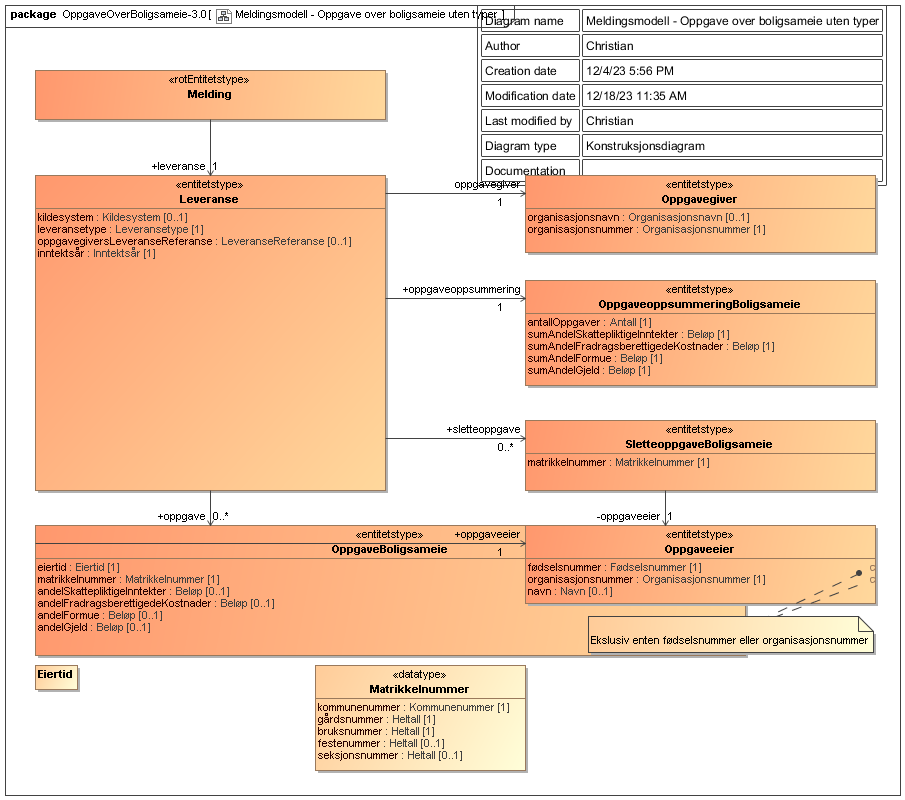

<summary>Tjenesten brukes til innsending av Boligsameie.</summary>

<Tabs underline={true}>
<TabItem headerText="Om tjenesten" itemKey="itemKey-1" default>

For generell informasjon om tjenestene se egne sider om:

* [Bruk av tjenestene](../om/bruk.md)
* [Sikkerhetsmekansimer](../om/sikkerhet.md)
* [Rettighetspakker](../om/rettighetspakker.md)
* [Feilhåndtering](../om/feil.md)
* [Versjonering](../om/versjoner.md)
* [Teknisk spesifikasjon](../om/tekniskspesifikasjon.md)

## Scope

Følgende scope skal benyttes ved autentisering i Maskinporten: `skatteetaten:boligsameie`

## Delegering

Tilgang til dette API-et kan delegeres i Altinn, f.eks. dersom leverandør benyttes for den tekniske oppkoblingen.
Søk opp følgende tjeneste i Altinn for å delegere tilgangen: `Boligsameie API - På vegne av`

## Teknisk spesifikasjon

URL-er til API-et, beskrivelsen av parameterne, endepunkter og respons ligger i Open API spesifikasjonen på
SwaggerHub

API-et for boligsameie har bare ett endepunkt:

* __POST innsending__: Mottar tredjepartsopplysninger for boligsameier. Ett kall mot API-et er en rapportering for et
  boligsameie gitt av en oppgavegiver og som gjelder et inntektsår.

API-et validerer mottatte data mot JSON schema beskrevet på SwaggerHub. Se [feilkoder](boligsameie?tab=Feilkoder) for
relaterte feilmeldinger.

Se også [eksempler](boligsameie?tab=Eksempler) for de ulike endepunktene.

### Parameter: idempotencyKey

idempotencyKey parameteren er påkrevet. Innholdet skal være en unik UUID. Hvert nye kall til API-et skal ha en
tilsvarende ny idempotencyKey. Flere etterfølgende POST kall med samme request-body og samme idempotencyKey vil gi den
samme repsponsen. Kun det første av denne rekken med like API kall vil behandles. IdempotencyKey muliggjør at man trygt
kan prøve innsendinger på nytt der man av ulike årsaker ikke har fått en tilbakemelding fra API-et.

## Datakatalog

Dette API-et er pt. ikke dokumentert i Felles datakatalog.

</TabItem>
<TabItem headerText="Eksempler" itemKey="itemKey-2"> 

## Innsending

### Eksempel på request URL

```
https://{env}/api/boligsameie/v1/{inntektsår}/innsending
```

### JSON

#### Eksempel på innsending

```
{
  "leveranse": {
    "oppgavegiversLeveranseReferanse": "Leveranse-1",
    "leveransetype": "ordinaer",
    "oppgavegiver": {
      "organisasjonsnummer": "819897522",
      "organisasjonsnavn": "SPENNENDE MENINGSFULLE GÅRDER ESEK",
      "kontaktinformasjon": {
        "navn": "Realt Testutvikling",
        "telefonnummer": "00000000",
        "varselEpostadresse": "anonym.varsel@skatteetaten.no",
        "varselSmsMobilnummer": "12345678"
      }
    },
    "oppgaveoppsummering": {
      "antallOppgaver": 23,
      "sumAndelSkattepliktigeInntekter": 0,
      "sumAndelFradragsberettigedeKostnader": 11777,
      "sumAndelFormue": 62240,
      "sumAndelGjeld": 145075
    },
    "inntektsaar": 2023,
    "kildesystem": "SBS-1",
    "sletteoppgave": [],
    "oppgave": [
      {
        "oppgaveeier": {
          "organisasjonsnummer": "800877830",
          "navn": "NØYTRALE FORURENSEDE SPISESTEDER AS"
        },
        "eiertid": {
          "start": "0101",
          "slutt": "3112"
        },
        "matrikkelnummer": {
          "kommunenummer": "1554",
          "bruksnummer": 227,
          "gaardsnummer": 91,
          "seksjonsnummer": 11
        },
        "andelSkattepliktigeInntekter": 1766,
        "andelFradragsberettigedeKostnader": 1766,
        "andelFormue": 9336,
        "andelGjeld": 21761
      },
      {
        "oppgaveeier": {
          "foedselsnummer": "17045802256",
          "navn": "ALLA STIE"
        },
        "eiertid": {
          "start": "0101",
          "slutt": "3112"
        },
        "matrikkelnummer": {
          "kommunenummer": "1554",
          "bruksnummer": 227,
          "gaardsnummer": 91,
          "seksjonsnummer": 30
        },
        "andelSkattepliktigeInntekter": 483,
        "andelFradragsberettigedeKostnader": 483,
        "andelFormue": 2552,
        "andelGjeld": 5948
      },
      {
        "oppgaveeier": {
          "foedselsnummer": "06096215671",
          "navn": "IHOR EVJE"
        },
        "eiertid": {
          "start": "0101",
          "slutt": "3012"
        },
        "matrikkelnummer": {
          "kommunenummer": "1554",
          "bruksnummer": 227,
          "gaardsnummer": 91,
          "seksjonsnummer": 74
        },
        "andelSkattepliktigeInntekter": 443,
        "andelFradragsberettigedeKostnader": 443,
        "andelFormue": 0,
        "andelGjeld": 0
      },
      {
        "oppgaveeier": {
          "foedselsnummer": "03056904602",
          "navn": "HANS ANDERS CZERWINSKI"
        },
        "eiertid": {
          "start": "0101",
          "slutt": "3112"
        },
        "matrikkelnummer": {
          "kommunenummer": "1554",
          "bruksnummer": 227,
          "gaardsnummer": 91,
          "seksjonsnummer": 17
        },
        "andelSkattepliktigeInntekter": 377,
        "andelFradragsberettigedeKostnader": 377,
        "andelFormue": 1992,
        "andelGjeld": 4642
      },
      {
        "oppgaveeier": {
          "foedselsnummer": "15065700589",
          "navn": "VALDAS SØRVIK GLØRSTAD"
        },
        "eiertid": {
          "start": "0101",
          "slutt": "3112"
        },
        "matrikkelnummer": {
          "kommunenummer": "1554",
          "bruksnummer": 227,
          "gaardsnummer": 91,
          "seksjonsnummer": 49
        },
        "andelSkattepliktigeInntekter": 495,
        "andelFradragsberettigedeKostnader": 495,
        "andelFormue": 2614,
        "andelGjeld": 6093
      },
      {
        "oppgaveeier": {
          "foedselsnummer": "28097317803",
          "navn": "MAY BENTE KLINGENBERG GRONGSTAD"
        },
        "eiertid": {
          "start": "0101",
          "slutt": "3112"
        },
        "matrikkelnummer": {
          "kommunenummer": "1554",
          "bruksnummer": 227,
          "gaardsnummer": 91,
          "seksjonsnummer": 93
        },
        "andelSkattepliktigeInntekter": 377,
        "andelFradragsberettigedeKostnader": 377,
        "andelFormue": 1992,
        "andelGjeld": 4642
      },
      {
        "oppgaveeier": {
          "foedselsnummer": "23113402067",
          "navn": "ROGER ANDRE HALLING"
        },
        "eiertid": {
          "start": "0101",
          "slutt": "3112"
        },
        "matrikkelnummer": {
          "kommunenummer": "1554",
          "bruksnummer": 227,
          "gaardsnummer": 91,
          "seksjonsnummer": 86
        },
        "andelSkattepliktigeInntekter": 589,
        "andelFradragsberettigedeKostnader": 589,
        "andelFormue": 3112,
        "andelGjeld": 7254
      },
      {
        "oppgaveeier": {
          "foedselsnummer": "28095102613",
          "navn": "STYRK KLEPPA"
        },
        "eiertid": {
          "start": "0101",
          "slutt": "3112"
        },
        "matrikkelnummer": {
          "kommunenummer": "1554",
          "bruksnummer": 227,
          "gaardsnummer": 91,
          "seksjonsnummer": 23
        },
        "andelSkattepliktigeInntekter": 824,
        "andelFradragsberettigedeKostnader": 824,
        "andelFormue": 4357,
        "andelGjeld": 10155
      },
      {
        "oppgaveeier": {
          "foedselsnummer": "31085909676",
          "navn": "AIVIS VAGLE"
        },
        "eiertid": {
          "start": "0101",
          "slutt": "3112"
        },
        "matrikkelnummer": {
          "kommunenummer": "1554",
          "bruksnummer": 227,
          "gaardsnummer": 91,
          "seksjonsnummer": 43
        },
        "andelSkattepliktigeInntekter": 436,
        "andelFradragsberettigedeKostnader": 436,
        "andelFormue": 2303,
        "andelGjeld": 5368
      },
      {
        "oppgaveeier": {
          "foedselsnummer": "09128506265",
          "navn": "MIROSLAW STANISLAW JENSVOLL"
        },
        "eiertid": {
          "start": "0101",
          "slutt": "3112"
        },
        "matrikkelnummer": {
          "kommunenummer": "1554",
          "bruksnummer": 227,
          "gaardsnummer": 91,
          "seksjonsnummer": 67
        },
        "andelSkattepliktigeInntekter": 495,
        "andelFradragsberettigedeKostnader": 495,
        "andelFormue": 2614,
        "andelGjeld": 6093
      },
      {
        "oppgaveeier": {
          "foedselsnummer": "22128126639",
          "navn": "ARNE EMIL GRØTTA"
        },
        "eiertid": {
          "start": "0101",
          "slutt": "3112"
        },
        "matrikkelnummer": {
          "kommunenummer": "1554",
          "bruksnummer": 227,
          "gaardsnummer": 91,
          "seksjonsnummer": 5
        },
        "andelSkattepliktigeInntekter": 389,
        "andelFradragsberettigedeKostnader": 389,
        "andelFormue": 2054,
        "andelGjeld": 4787
      },
      {
        "oppgaveeier": {
          "foedselsnummer": "31035117388",
          "navn": "SEBASTIAN NORLI"
        },
        "eiertid": {
          "start": "0101",
          "slutt": "3112"
        },
        "matrikkelnummer": {
          "kommunenummer": "1554",
          "bruksnummer": 227,
          "gaardsnummer": 91,
          "seksjonsnummer": 87
        },
        "andelSkattepliktigeInntekter": 412,
        "andelFradragsberettigedeKostnader": 412,
        "andelFormue": 2178,
        "andelGjeld": 5078
      },
      {
        "oppgaveeier": {
          "foedselsnummer": "09085926443",
          "navn": "LIV HEIDI OSBORNE"
        },
        "eiertid": {
          "start": "0101",
          "slutt": "3112"
        },
        "matrikkelnummer": {
          "kommunenummer": "1554",
          "bruksnummer": 227,
          "gaardsnummer": 91,
          "seksjonsnummer": 42
        },
        "andelSkattepliktigeInntekter": 377,
        "andelFradragsberettigedeKostnader": 377,
        "andelFormue": 1992,
        "andelGjeld": 4642
      },
      {
        "oppgaveeier": {
          "organisasjonsnummer": "804266801",
          "navn": "SENDREKTIGE BRILJANTE FANS AS"
        },
        "eiertid": {
          "start": "0101",
          "slutt": "3112"
        },
        "matrikkelnummer": {
          "kommunenummer": "1554",
          "bruksnummer": 227,
          "gaardsnummer": 91,
          "seksjonsnummer": 61
        },
        "andelSkattepliktigeInntekter": 353,
        "andelFradragsberettigedeKostnader": 353,
        "andelFormue": 1867,
        "andelGjeld": 4352
      },
      {
        "oppgaveeier": {
          "organisasjonsnummer": "805518731",
          "navn": "ROSA FLOTTE MUS AS"
        },
        "eiertid": {
          "start": "0101",
          "slutt": "3112"
        },
        "matrikkelnummer": {
          "kommunenummer": "1554",
          "bruksnummer": 227,
          "gaardsnummer": 91,
          "seksjonsnummer": 80
        },
        "andelSkattepliktigeInntekter": 441,
        "andelFradragsberettigedeKostnader": 441,
        "andelFormue": 2116,
        "andelGjeld": 4933
      },
      {
        "oppgaveeier": {
          "organisasjonsnummer": "805518731",
          "navn": "ROSA FLOTTE MUS AS"
        },
        "eiertid": {
          "start": "0101",
          "slutt": "3112"
        },
        "matrikkelnummer": {
          "kommunenummer": "1554",
          "bruksnummer": 227,
          "gaardsnummer": 91,
          "seksjonsnummer": 99
        },
        "andelSkattepliktigeInntekter": 989,
        "andelFradragsberettigedeKostnader": 989,
        "andelFormue": 5228,
        "andelGjeld": 12186
      },
      {
        "oppgaveeier": {
          "organisasjonsnummer": "805518731",
          "navn": "ROSA FLOTTE MUS AS"
        },
        "eiertid": {
          "start": "0101",
          "slutt": "3112"
        },
        "matrikkelnummer": {
          "kommunenummer": "1554",
          "bruksnummer": 227,
          "gaardsnummer": 91,
          "seksjonsnummer": 36
        },
        "andelSkattepliktigeInntekter": 683,
        "andelFradragsberettigedeKostnader": 683,
        "andelFormue": 3610,
        "andelGjeld": 8414
      },
      {
        "oppgaveeier": {
          "organisasjonsnummer": "810382392",
          "navn": "KONSERVATIVE GLADE KVINNER AS"
        },
        "eiertid": {
          "start": "0101",
          "slutt": "3112"
        },
        "matrikkelnummer": {
          "kommunenummer": "1554",
          "bruksnummer": 227,
          "gaardsnummer": 91,
          "seksjonsnummer": 55
        },
        "andelSkattepliktigeInntekter": 283,
        "andelFradragsberettigedeKostnader": 283,
        "andelFormue": 1494,
        "andelGjeld": 3482
      },
      {
        "oppgaveeier": {
          "foedselsnummer": "19116312894",
          "navn": "SYLWESTER LARSEN"
        },
        "eiertid": {
          "start": "0101",
          "slutt": "3112"
        },
        "matrikkelnummer": {
          "kommunenummer": "1554",
          "bruksnummer": 227,
          "gaardsnummer": 91,
          "seksjonsnummer": 92
        },
        "andelSkattepliktigeInntekter": 824,
        "andelFradragsberettigedeKostnader": 824,
        "andelFormue": 4357,
        "andelGjeld": 10155
      },
      {
        "oppgaveeier": {
          "foedselsnummer": "14078907968",
          "navn": "KJELL VIDAR KÅSA JANKOWSKA"
        },
        "eiertid": {
          "start": "0101",
          "slutt": "3112"
        },
        "matrikkelnummer": {
          "kommunenummer": "1554",
          "bruksnummer": 227,
          "gaardsnummer": 91,
          "seksjonsnummer": 24
        },
        "andelSkattepliktigeInntekter": 353,
        "andelFradragsberettigedeKostnader": 353,
        "andelFormue": 1867,
        "andelGjeld": 4352
      },
      {
        "oppgaveeier": {
          "foedselsnummer": "11107627822",
          "navn": "KNUT ERIK GJELLESTAD"
        },
        "eiertid": {
          "start": "0101",
          "slutt": "3112"
        },
        "matrikkelnummer": {
          "kommunenummer": "1554",
          "bruksnummer": 227,
          "gaardsnummer": 91,
          "seksjonsnummer": 68
        },
        "andelSkattepliktigeInntekter": 389,
        "andelFradragsberettigedeKostnader": 389,
        "andelFormue": 2054,
        "andelGjeld": 4787
      },
      {
        "oppgaveeier": {
          "foedselsnummer": "07020069796",
          "navn": "PER KRISTIAN FORFANG"
        },
        "eiertid": {
          "start": "3012",
          "slutt": "3112"
        },
        "matrikkelnummer": {
          "kommunenummer": "1554",
          "bruksnummer": 227,
          "gaardsnummer": 91,
          "seksjonsnummer": 74
        },
        "andelSkattepliktigeInntekter": 0,
        "andelFradragsberettigedeKostnader": 0,
        "andelFormue": 1276,
        "andelGjeld": 2974
      },
      {
        "oppgaveeier": {
          "foedselsnummer": "12060253798",
          "navn": "ÅSE MARIT HALVORSRUD"
        },
        "eiertid": {
          "start": "3012",
          "slutt": "3112"
        },
        "matrikkelnummer": {
          "kommunenummer": "1554",
          "bruksnummer": 227,
          "gaardsnummer": 91,
          "seksjonsnummer": 74
        },
        "andelSkattepliktigeInntekter": 0,
        "andelFradragsberettigedeKostnader": 0,
        "andelFormue": 1276,
        "andelGjeld": 2974
      }
    ]
  }
}
```

#### Eksempel på respons

```
{
  "dialogId": "018b3d0f-d57e-7f5c-8a04-76dbc7e2fed2",
  "dialogelementId": "018f521e-5488-79e3-8817-48e94cb75455",
  "oppgavegiversLeveranseReferanse": "leveranse-1",
  "antallOppgaver": 23
}
```

</TabItem>
<TabItem headerText="Feilkoder" itemKey="itemKey-3">

Se egen side for generell info om [feilhåndtering i tjenestene](../om/feil.md).

Tabellen under viser en oversikt over hvilke spesifikke feilkoder denne applikasjonen kan gi.

| Feilkode | HTTP Statuskode | Feilområde                                   |
|----------|-----------------|----------------------------------------------|
| GLD_005  | 403             | Feil i forbindelse med autorisering          |
| GLD_006  | 400             | Feil i request                               |
| GLD_008  | 400             | Strukturell feil i tilknyttet dataformat     |
| GLD_010  | 400             | Feil i forbindelse med validering av payload |
| GLD_011  | 400             | Feil i metadata                              |
| GLD_017  | 500             | Uspesifisert systemfeil                      |
| GLD_019  | 409             | Idempotensnøkkel er benyttet tidligere       |
| GLD_021  | 404             | Finner ikke forespurt ressurs                |
| GLD_022  | 405             | HTTP-metode ikke støttet                     |

Feilresponsene kan også inneholde en feilspesifiseringskode som presiserer feilen ytterligere.
Tabellen under viser hvilke feilspesifiseringskoder applikasjonen kan gi.
Dersom det finnes mer detaljert feilinformasjon enn generelt feilområde vil det beskrives i melding, sti og angitt verdi
feltene.

| Feilspesifiseringskode | Feilområde                                     | Årsak                                                                                                                       |
|------------------------|------------------------------------------------|-----------------------------------------------------------------------------------------------------------------------------|
| GLD_1022               | Feil i parametre                               | Diverse feil med parametre i request. Mer detaljert beskrivelse ligger i melding, sti og angitt verdi dersom det er aktuelt |
| GLD_1023               | Finner ingen ressurs for denne urlen           | Det er ikke noe innhold tilgjengelig på denne URLen                                                                         |
| GLD_1027               | Inntektsår er ikke støttet                     | Det er ikke tillatt å levere på oppgitt inntektsår                                                                          |
| GLD_1028               | Header mangler                                 | Påkrevd header er ikke med i requesten                                                                                      |
| GLD_1030               | Accept-header må være av type application/json | Accept header er feil. APIet har kun støtte for json i response                                                             |
| GLD_1047               | Content type må være application/json          | Content-type header er feil. APIet har kun støtte for json i request body                                                   |

</TabItem>
<TabItem headerText="Informasjonsmodell" itemKey="itemKey-4">



| Eier                           | Element                              | Dokumentasjon                                                                                                                                   |
|--------------------------------|--------------------------------------|-------------------------------------------------------------------------------------------------------------------------------------------------|
| Leveranse                      | inntektsår                           | Inntektsåret leveransen gjelder                                                                                                                 |
| Leveranse                      | kildesystem                          | System brukt for å levere oppgaven                                                                                                              |
| Leveranse                      | leveransetype                        | Type av leveranse som angir om leveransen inneholder ordinære oppgaver eller om oppgavegiver angir at det ikke er noen oppgaver å innrapportere |
| Leveranse                      | oppgave                              | Oppgave som leveres                                                                                                                             |
| Leveranse                      | oppgavegiver                         | Tredjepart som rapporterer opplysning til Skatteetaten                                                                                          |
| Leveranse                      | oppgavegiversLeveranseReferanse      | Frivillig referanse på innsendingen til bruk mot egne interne systemer og evt. support mot skattetaten                                          |
| Leveranse                      | oppgaveoppsummering                  | Oppsummering med totalsummer for innleverte oppgaver                                                                                            |
| Leveranse                      | sletteoppgave                        | Oppgave for sletting av tidligere innrapporterte oppgaver                                                                                       |
| Melding                        | leveranse                            | Selve leveransen. Alle leveranser på en melding må ha samme oppgavegiver                                                                       |
| OppgaveBoligsameie             | andelFormue                          | Oppgaveeiers andel av felles formue i boligsameiet                                                                                              |
| OppgaveBoligsameie             | andelFradragsberettigedeKostnader    | Oppgaveeiers andel av fradragsberettigede kostnader i boligsameiet                                                                              |
| OppgaveBoligsameie             | andelGjeld                           | Oppgaveeiers andel av gjeld i boligselsameiet                                                                                                   |
| OppgaveBoligsameie             | andelSkattepliktigeInntekter         | Oppgaveeiers andel av skattepliktige inntekter i boligsameiet                                                                                   |
| OppgaveBoligsameie             | eiertid                              | Oppgaveeiers tid som eier av boenheten                                                                                                          |
| OppgaveBoligsameie             | matrikkelnummer                      | Boenhetens matrikkelnummer                                                                                                                      |
| OppgaveBoligsameie             | oppgaveeier                          | Eier av oppgaven                                                                                                                                |
| Oppgaveeier                    | fødselsnummer                        | Fødselsnummer på oppgaveeier. Eksklusiv enten fødselsnummer eller organisasjonsnummer                                                           |
| Oppgaveeier                    | navn                                 | Navn på oppgaveeier                                                                                                                             |
| Oppgaveeier                    | organisasjonsnummer                  | Organisasjonsnummer på oppgaveeier. Eksklusiv enten fødselsnummer eller organisasjonsnummer                                                     |
| Oppgavegiver                   | organisasjonsnavn                    | Navn på oppgavegiver                                                                                                                            |
| Oppgavegiver                   | organisasjonsnummer                  | Organisasjonsnummer på oppgavegiver                                                                                                             |
| OppgaveoppsummeringBoligsameie | antallOppgaver                       | Totalt antall oppgaver i leveransens oppgaver                                                                                                   |
| OppgaveoppsummeringBoligsameie | sumAndelFormue                       | Sum av andelFormue i leveransens oppgaver                                                                                                       |
| OppgaveoppsummeringBoligsameie | sumAndelFradragsberettigedeKostnader | Sum av andelFradragsberettigedeKostnader i leveransens oppgaver                                                                                 |
| OppgaveoppsummeringBoligsameie | sumAndelGjeld                        | Sum av andelGjeld i leveransens oppgaver                                                                                                        |
| OppgaveoppsummeringBoligsameie | sumAndelSkattepliktigeInntekter      | Sum av andelSkattepliktigeInntekter i leveransens oppgaver                                                                                      |
| SletteoppgaveBoligsameie       | matrikkelnummer                      | Boenhetens matrikkelnummer                                                                                                                      |
| SletteoppgaveBoligsameie       | oppgaveeier                          | Eier av sletteoppgaven                                                                                                                          |
| Matrikkelnummer                | bruksnummer                          | Del av matrikkelnummeret som sammen med kommunenummer, gårdsnummer og seksjonsnummer unikt identifiserer en eierseksjon                         |
| Matrikkelnummer                | festenummer                          | Festenummer tilhørende eierseksjonen dersom eiendommen er festet                                                                                |
| Matrikkelnummer                | gårdsnummer                          | Del av matrikkelnummeret som sammen med kommunenummer, bruksnummer og seksjonsnummer unikt identifiserer en eierseksjon                         |
| Matrikkelnummer                | kommunenummer                        | Boenhetens kommunenummer                                                                                                                        |
| Matrikkelnummer                | seksjonsnummer                       | Del av matrikkelnummeret som sammen med kommunenummer, gårdsnummer og bruksnummer unikt identifiserer en eierseksjon                            | 
</TabItem>

<TabItem headerText="Test" itemKey="itemKey-5">

I første omgang er test kun tilgjengelig for et utvalg leverandører som det er inngått avtale med og som skal være
med å pilotere løsningene.

### Tenor testdatasøk

Det finnes pt. ikke søk i [Tenor](https://github.com/Skatteetaten/api-dokumentasjon/blob/main/docs/test/tenor.md) for
denne tjenesten. Men egenskaper ved enhetene som har testdata kan søkes frem i Tenor.

### Testdata

Det finnes foreløpig ingen testdata for denne tjenesten. Denne siden oppdateres fortløpende ettersom testdata blir
tilgjengelig.

</TabItem>
</Tabs>
