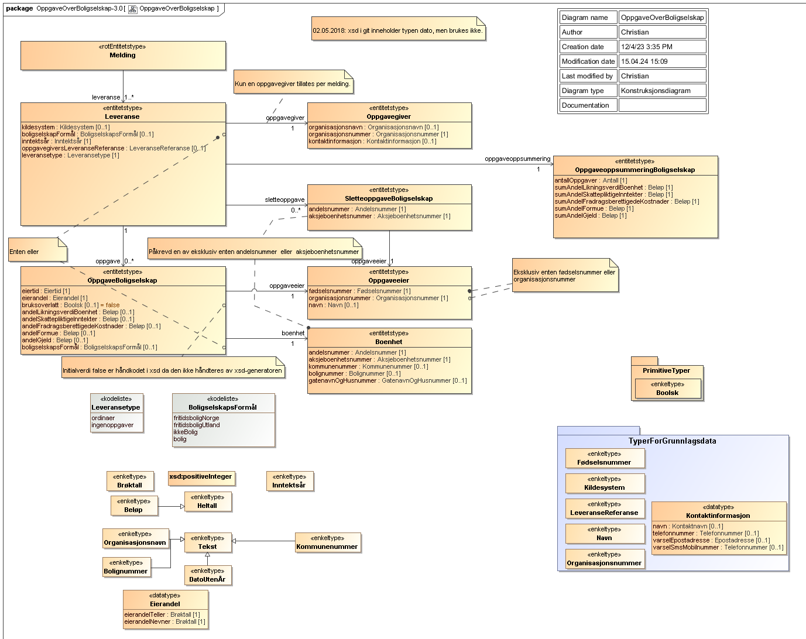

<summary>Tjenesten brukes til innsending av Boligselskap.</summary>

<Tabs underline={true}>
<TabItem headerText="Om tjenesten" itemKey="itemKey-1" default>

For generell informasjon om tjenestene se egne sider om:
* [Bruk av tjenestene](../om/bruk.md)
* [Sikkerhetsmekansimer](../om/sikkerhet.md)
* [Rettighetspakker](../om/rettighetspakker.md)
* [Feilhåndtering](../om/feil.md)
* [Versjonering](../om/versjoner.md)
* [Teknisk spesifikasjon](../om/tekniskspesifikasjon.md)

## Scope
Følgende scope skal benyttes ved autentisering i Maskinporten: `skatteetaten:boligselskap`

## Delegering
Tilgang til dette API-et kan delegeres i Altinn, f.eks. dersom leverandør benyttes for den tekniske oppkoblingen. Søk opp følgende tjeneste i Altinn for å delegere tilgangen: `Boligselskap API - På vegne av`

## Teknisk spesifikasjon
URL-er til API-et, beskrivelsen av parameterne, endepunkter og respons...

## Datakatalog
Dette API-et er pt. ikke dokumentert i Felles datakatalog.

</TabItem>
<TabItem headerText="Eksempler" itemKey="itemKey-2"> 

```
Legg inn eksempel
```

</TabItem>
<TabItem headerText="Feilkoder" itemKey="itemKey-3">

Se egen side for generell info om [feilhåndtering i tjenestene](../om/feil.md).

Tabellen under viser en oversikt over hvilke spesifikke feilkoder denne applikasjonen kan gi.

| Feilkode | HTTP Statuskode | Feilområde                                   |
|----------|-----------------|----------------------------------------------|
| GLD_005  | 403             | Feil i forbindelse med autorisering          |
| GLD_006  | 400             | Feil i request                               |
| GLD_008  | 400             | Strukturell feil i tilknyttet dataformat     |
| GLD_010  | 400             | Feil i forbindelse med validering av payload |
| GLD_011  | 400             | Feil i metadata                              |
| GLD_017  | 500             | Uspesifisert systemfeil                      |
| GLD_019  | 409             | Idempotensnøkkel er benyttet tidligere       |
| GLD_021  | 404             | Finner ikke forespurt ressurs                |
| GLD_022  | 405             | HTTP-metode ikke støttet                     |

Feilresponsene kan også inneholde en feilspesifiseringskode som presiserer feilen ytterligere.
Tabellen under viser hvilke feilspesifiseringskoder applikasjonen kan gi.
Dersom det finnes mer detaljert feilinformasjon enn generelt feilområde vil det beskrives i melding, sti og angitt verdi feltene.

| Feilspesifiseringskode | Feilområde                                     | Årsak                                                                                                                       |
|------------------------|------------------------------------------------|-----------------------------------------------------------------------------------------------------------------------------|
| GLD_1022               | Feil i parametre                               | Diverse feil med parametre i request. Mer detaljert beskrivelse ligger i melding, sti og angitt verdi dersom det er aktuelt |
| GLD_1023               | Finner ingen ressurs for denne urlen           | Det er ikke noe innhold tilgjengelig på denne URLen                                                                         |
| GLD_1027               | Inntektsår er ikke støttet                     | Det er ikke tillatt å levere på oppgitt inntektsår                                                                          |
| GLD_1028               | Header mangler                                 | Påkrevd header er ikke med i requesten                                                                                      |
| GLD_1030               | Accept-header må være av type application/json | Accept header er feil. APIet har kun støtte for json i response                                                             |
| GLD_1047               | Content type må være application/json          | Content-type header er feil. APIet har kun støtte for json i request body                                                   |
  
</TabItem>
<TabItem headerText="Informasjonsmodell" itemKey="itemKey-4">



| Eier                            | Element                              | Dokumentasjon                                                                                                                                                                                                                                                                        |
|---------------------------------|--------------------------------------|--------------------------------------------------------------------------------------------------------------------------------------------------------------------------------------------------------------------------------------------------------------------------------------|
| Boenhet                         | aksjeboenhetsnummer                  | Nummer for boenheten. Eksklusiv enten aksjeboenhetsnummer, eller andelsnummer                                                                                                                                                                                                        |
| Boenhet                         | andelsnummer                         | Nummer for boenheten. Eksklusiv enten aksjeboenhetsnummer, eller andelsnummer                                                                                                                                                                                                        |
| Boenhet                         | bolignummer                          | En bokstav og fire siffer som entydig identifiserer den enkelte bruksenheten innenfor en adresserbar bygning eller bygningsdel                                                                                                                                                       |
| Boenhet                         | gatenavnOgHusnummer                  | Navn på gate og husnummer for boenheten                                                                                                                                                                                                                                              |
| Boenhet                         | kommunenummer                        | Nummer på kommunen boenheten tilhører                                                                                                                                                                                                                                                |
| Eierandel                       | eierandelNevner                      | Nevner i eierandelsbrøken                                                                                                                                                                                                                                                            |
| Eierandel                       | eierandelTeller                      | Teller i eierandelsbrøken                                                                                                                                                                                                                                                            |
| Leveranse                       | boligselskapFormål                   | Boligselskapets formål. Denne må spesifiseres enten på leveransen, eller oppgaven. Dersom den blir satt i begge vil boligformålet for oppgaven være gjeldende. Verdien skal være en av "bolig", "fritidsbolig", "fritidsboligUtland eller "ikkeBolig" (Brukes f.eks. for garasjelag) |
| Leveranse                       | inntektsår                           | Inntektsåret leveransen gjelder                                                                                                                                                                                                                                                      |
| Leveranse                       | kildesystem                          | System brukt for å levere oppgaven                                                                                                                                                                                                                                                   |
| Leveranse                       | leveransetype                        | type av leveranse som angir om leveransen inneholder ordinære oppgaver eller om oppgavegiver angir at det ikke er noen oppgaver å innrapportere                                                                                                                                      |
| Leveranse                       | oppgave                              | Oppgave som leveres                                                                                                                                                                                                                                                                  |
| Leveranse                       | oppgavegiver                         | Tredjepart som rapporterer opplysning til Skatteetaten                                                                                                                                                                                                                               |
| Leveranse                       | oppgavegiversLeveranseReferanse      | Frivillig referanse på innsendingen til bruk mot egne interne systemer og evt. support mot skattetaten                                                                                                                                                                               |
| Leveranse                       | oppgaveoppsummering                  | Oppsummering med totalsummer for innleverte oppgaver                                                                                                                                                                                                                                 |
| Leveranse                       | sletteoppgave                        | Oppgave for sletting av tidligere innrapporterte oppgaver                                                                                                                                                                                                                            |
| Melding                         | leveranse                            | Selve leveransen. Alle leveranser på en melding må ha samme oppgavegiver                                                                                                                                                                                                             |
| OppgaveBoligselskap             | andelFormue                          | Oppgaveeiers andel av felles formue i boligselskap                                                                                                                                                                                                                                   |
| OppgaveBoligselskap             | andelFradragsberettigedeKostnader    | Oppgaveeiers andel av fradragsberettigede kostnader i boligselskapet                                                                                                                                                                                                                 |
| OppgaveBoligselskap             | andelGjeld                           | Oppgaveeiers andel av gjeld i boligselskapet                                                                                                                                                                                                                                         |
| OppgaveBoligselskap             | andelLikningsverdiBoenhet            | Oppgaveeiers andel av likninsverdi av boenheten                                                                                                                                                                                                                                      |
| OppgaveBoligselskap             | andelSkattepliktigeInntekter         | Oppgaveeiers andel av skattepliktige inntekter i boligselskapet                                                                                                                                                                                                                      |
| OppgaveBoligselskap             | boenhet                              | Boenheten oppgaven gjelder                                                                                                                                                                                                                                                           |
| OppgaveBoligselskap             | boligselskapsFormål                  | Boligselskapets formål. Denne må spesifiseres enten på leveransen, eller oppgaven. Dersom den blir satt i begge vil boligformålet for oppgaven være gjeldende. Verdien skal være en av "bolig", "fritidsbolig", "fritidsboligUtland eller "ikkeBolig" (Brukes f.eks. for garasjelag)                   |
| OppgaveBoligselskap             | bruksoverlatt                        | Framleid boenhet der boenheten er leid ut av andelshaver i halvparten eller mer av eiertiden det rapporteres for                                                                                                                                                                     |
| OppgaveBoligselskap             | eierandel                            | Oppgaveeiers eierandel i boenheten                                                                                                                                                                                                                                                   |
| OppgaveBoligselskap             | eiertid                              | Oppgaveeiers tid som eier av boenheten                                                                                                                                                                                                                                               |
| OppgaveBoligselskap             | oppgaveeier                          | Eier av oppgaven                                                                                                                                                                                                                                                                     |
| Oppgaveeier                     | fødselsnummer                        | Fødselsnummer på oppgaveeier. Eksklusiv enten fødselsnummer eller organisasjonsnummer                                                                                                                                                                                                |
| Oppgaveeier                     | navn                                 | Navn på oppgaveeier                                                                                                                                                                                                                                                                  |
| Oppgaveeier                     | organisasjonsnummer                  | Organisasjonsnummer på oppgaveeier. Eksklusiv enten fødselsnummer eller organisasjonsnummer                                                                                                                                                                                          |
| Oppgavegiver                    | kontaktinformasjon                   | Kontaktinformasjon for oppgavegiver                                                                                                                                                                                                                                                  |
| Oppgavegiver                    | organisasjonsnavn                    | Navn på oppgavegiver                                                                                                                                                                                                                                                                 |
| Oppgavegiver                    | organisasjonsnummer                  | Organisasjonsnummer på oppgavegiver                                                                                                                                                                                                                                                  |
| OppgaveoppsummeringBoligselskap | antallOppgaver                       | Totalt antall oppgaver i leveransens oppgaver                                                                                                                                                                                                                                        |
| OppgaveoppsummeringBoligselskap | sumAndelFormue                       | Sum av andelFormue i leveransens oppgaver                                                                                                                                                                                                                                            |
| OppgaveoppsummeringBoligselskap | sumAndelFradragsberettigedeKostnader | Sum av andelFradragsberettigedeKostnader i leveransens oppgaver                                                                                                                                                                                                                      |
| OppgaveoppsummeringBoligselskap | sumAndelGjeld                        | Sum av andelGjeld i leveransens oppgaver                                                                                                                                                                                                                                             |
| OppgaveoppsummeringBoligselskap | sumAndelLikningsverdiBoenhet         | Sum av andelLikningsverdiBoenhet i leveransens oppgaver                                                                                                                                                                                                                              |
| OppgaveoppsummeringBoligselskap | sumAndelSkattepliktigeInntekter      | Sum av andelSkattepliktigeInntekter i leveransens oppgaver                                                                                                                                                                                                                           |
| SletteoppgaveBoligselskap       | aksjeboenhetsnummer                  | Nummer for boenheten. Eksklusiv enten aksjeboenhetsnummer, eller andelsnummer                                                                                                                                                                                                        |
| SletteoppgaveBoligselskap       | andelsnummer                         | Nummer for boenheten. Eksklusiv enten aksjeboenhetsnummer, eller andelsnummer                                                                                                                                                                                                        |
| SletteoppgaveBoligselskap       | oppgaveeier                          | Eier av sletteoppgaven                                                                                                                                                                                                                                                               |


</TabItem>
<TabItem headerText="Test" itemKey="itemKey-5">

Her kan du legge inn tekst om test av tjenesten. 
  
</TabItem>
</Tabs>
