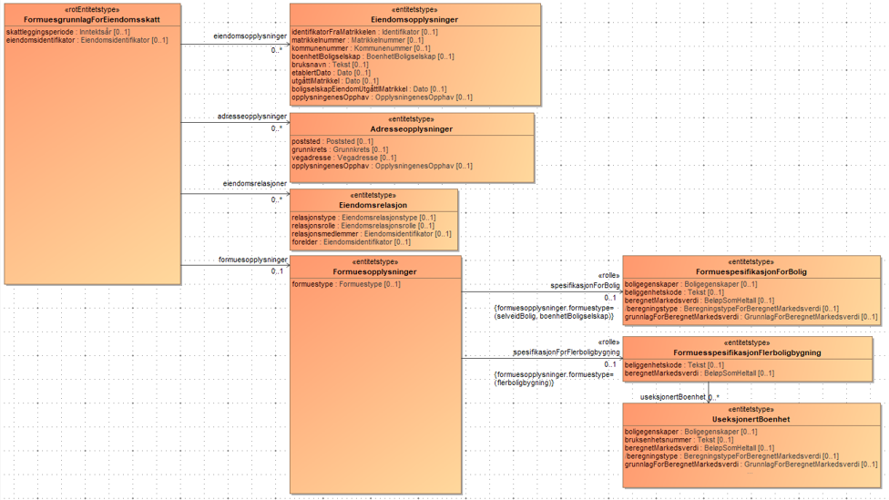

<summary>Tjenesten leverer fastsatte formuesgrunnlag for fast eiendom som grunnlag for eiendomsskatt, og inneholder informasjon om eiendomsopplysninger, adresseopplysninger og eiendomsrelasjoner for fast eiendom, samt beregnede markedsverdier med tilhørende grunnlag for boliger.</summary>

<Tabs underline={true}>
<TabItem headerText="Om tjenesten" itemKey="itemKey-1" default>

For generell informasjon om tjenestene se egne sider om:

* [Bruk av tjenestene](../om/bruk.md)
* [Sikkerhetsmekansimer](../om/sikkerhet.md)
* [Rettighetspakker](../om/rettighetspakker.md)
* [Feilhåndtering](../om/feil.md)
* [Versjonering](../om/versjoner.md)
* [Teknisk spesifikasjon](../om/tekniskspesifikasjon.md)

## Scope

Følgende scope skal benyttes ved autentisering i Maskinporten: `skatteetaten:formuesgrunnlageiendomsskatt`

## Delegering

Tilgang til dette api'et kan delegeres i Altinn, f.eks. dersom leverandør benyttes for den tekniske oppkoblingen. Søk
opp følgende tjeneste i Altinn for å delegere tilgangen: `Formuesgrunnlag for eiendomsskatt API - På vegne av`

## Teknisk spesifikasjon

Url’er til api'et, beskrivelsen av parameterne, endepunkter og respons ligger
i [Open API spesifikasjonen](https://app.swaggerhub.com/apis/Skatteetaten_Deling/formuesgrunnlag-for-eiendomsskatt-api)
på SwaggerHub.

## Rettighetspakker

| Navn på rettighetspakke |	
|-------------------------|
| kommune                 |

## Støttetjenester

### Hendelser

For å følge med på endringer tilbyr vi
en [støttetjeneste for hendelsesliste](./hendelser.md): `Formuesgrunnlag for eiendomsskatt hendelser API`

## Datakatalog

[Datatjenestebeskrivelse](https://data.norge.no/dataservices/7fc0232d-cc1a-3333-b54f-5d435b7b4c9d) i Felles datakatalog.

</TabItem>
<TabItem headerText="Eksempler" itemKey="itemKey-2"> 

## JSON

```json
{
  "skattleggingsperiode": 2020,
  "eiendomsidentifikator": {
    "skatteetatensEiendomsidentifikator": "1",
    "eksternIdentifikator": "921782775543322"
  },
  "formuesopplysninger": {
    "formuestype": "selveidBolig",
    "spesifikasjonForBolig": {
      "boligegenskaper": {
        "primaerromareal": 97,
        "boligtype": "enebolig",
        "byggeaar": "2019"
      },
      "beliggenhetskode": "1",
      "beregnetMarkedsverdi": 3494213,
      "beregningstype": "maskinellBeregning",
      "grunnlagForBeregnetMarkedsverdi": {
        "boligverdi": 3494213
      }
    }
  },
  "adresseopplysninger": [
    {
      "poststed": {
        "poststedsnavn": "ARENDAL",
        "postnummer": "4825"
      },
      "grunnkrets": {
        "grunnkretsnavn": "Pusnes-Roligheten",
        "grunnkretsnummer": "2101"
      },
      "vegadresse": {
        "adressekode": "1",
        "adressenavn": "Grubeveien",
        "adressenummer": {
          "husnummer": 47
        }
      },
      "opplysningenesOpphav": "SKATTLEGGINGSPERIODE_3112"
    },
    {
      "poststed": {
        "poststedsnavn": "ARENDAL",
        "postnummer": "4825"
      },
      "grunnkrets": {
        "grunnkretsnavn": "Pusnes-Roligheten",
        "grunnkretsnummer": "2101"
      },
      "vegadresse": {
        "adressekode": "1",
        "adressenavn": "Grubeveien",
        "adressenummer": {
          "husnummer": 47
        }
      },
      "opplysningenesOpphav": "OPPDATERT_MATRIKKEL"
    }
  ],
  "eiendomsopplysninger": [
    {
      "matrikkelnummer": {
        "kommunenummer": "4203",
        "gaardsnummer": 433,
        "bruksnummer": 89,
        "festenummer": 0,
        "seksjonsnummer": 0
      },
      "kommunenummer": "4203",
      "bruksnavn": "Lorem Ipsum",
      "etablertDato": "2023-09-12",
      "opplysningenesOpphav": "SKATTLEGGINGSPERIODE_3112"
    },
    {
      "matrikkelnummer": {
        "kommunenummer": "4203",
        "gaardsnummer": 433,
        "bruksnummer": 89,
        "festenummer": 0,
        "seksjonsnummer": 0
      },
      "kommunenummer": "4203",
      "bruksnavn": "Lorem Ipsum",
      "etablertDato": "2023-09-12",
      "opplysningenesOpphav": "OPPDATERT_MATRIKKEL"
    }
  ]
}
```

</TabItem>
<TabItem headerText="Feilkoder" itemKey="itemKey-3">

Se egen side for generell info om [feilhåndtering i tjenestene](../om/feil.md).

Tabellen under viser en oversikt over hvilke spesifikke feilkoder denne applikasjonen kan gi.

| Feilkode | HTTP Statuskode | Feilområde                                                                                    |
|----------|-----------------|-----------------------------------------------------------------------------------------------|
| FGS-001  | 500             | Uventet feil på tjenesten.                                                                    |
| FGS-002  | 500             | Uventet feil i et bakenforliggende system.                                                    |
| FGS-003  | 404             | Ukjent url benyttet.                                                                          |
| FGS-004  | 401             | Feil i forbindelse med autentisering.                                                         |
| FGS-005  | 403             | Feil i forbindelse med autorisering.                                                          |
| FGS-006  | 400             | Feil i forbindelse med validering av inputdata.                                               |
| FGS-007  | 404             | Fant ikke formuesgrunnlag for eiendomsskatt for gitt identifikator, periode og kommunenummer. |
| FGS-008  | 406             | Feil tilknyttet dataformat. Kun json eller xml er støttet.                                    |

</TabItem>
<TabItem headerText="Informasjonsmodell" itemKey="itemKey-4">

[](../../static/download/Informasjonsmodell_Formuesgrunnlageiendomsskatt.png)

</TabItem>
<TabItem headerText="Test" itemKey="itemKey-5">

## Tenor testdatasøk

Det finnes pt. ikke søk i [Tenor](../test/tenor.md) for denne tjenesten, men man kan benytt hendelseslisten for å finne referanser man kan benytte for å teste oppslagstjenesten.

## Testdata

For å teste hendelseslisten kan du benytte følgende kommunenummer:

| Kommunenummer |
| ------------- |
| 4203 |
| 5001 |

Under har vi listet enkelte testdata som er tilgjengelige for å teste oppslagstjenesten:

| Eksternidentifikator | Periode | Kommunenummer |
|----------------------|---------|---------------|
| 921782775543322      | 2020    | 4203          | 
| 921782775543321      | 2020    | 4203          | 


</TabItem>
</Tabs>
