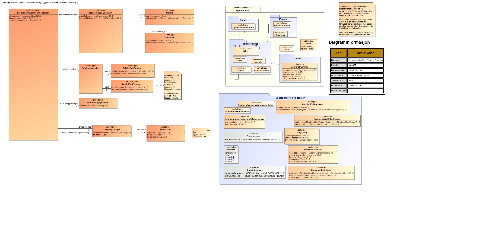

<Summary>Tjenesten leverer forretningshendelser knyttet til formuesobjekter for fast eiendom og rettighetshavere til
formuesobjektene. Tjenesten leverer klassifisering av formuesobjektene og eiendommens relasjoner.</Summary>

<Tabs underline={true}>
<TabItem headerText="Om tjenesten" itemKey="itemKey-1" default>

For generell informasjon om tjenestene se egne sider om:

* [Bruk av tjenestene](../om/bruk.md)
* [Sikkerhetsmekansimer](../om/sikkerhet.md)
* [Rettighetspakker](../om/rettighetspakker.md)
* [Feilhåndtering](../om/feil.md)
* [Versjonering](../om/versjoner.md)
* [Teknisk spesifikasjon](../om/tekniskspesifikasjon.md)

## Scope

Følgende scope skal benyttes ved autentisering i Maskinporten: `skatteetaten:formuesobjektfasteiendom`

## Delegering

Tilgang til dette API-et kan delegeres i Altinn, f.eks. dersom leverandør benyttes for den tekniske oppkoblingen. Søk
opp følgende tjeneste i Altinn for å delegere tilgangen: `Formuesobjekt fast eiendom API - På vegne av`

## Teknisk spesifikasjon

URL-er til API-et, beskrivelsen av parameterne, endepunkter og respons ligger
i [Open API spesifikasjonen](https://app.swaggerhub.com/apis/skatteetaten/formuesobjekt-fast-eiendom-api/) på
SwaggerHub.

## Rettighetspakker

| Navn på rettighetspakke    |	
|----------------------------|
| kartverketEgenregistrering |

## Støttetjenester

### Hendelser

For å følge med på endringer tilbyr vi
en [støttetjeneste for hendelsesliste](./hendelser.md): `Formuesobjekt fast eiendom hendelser API`

## Datakatalog
Datatjenestebeskrivelse er ikke i Felles datakatalog enda.

</TabItem>
<TabItem headerText="Eksempler" itemKey="itemKey-2"> 

## JSON

```json


```

</TabItem>
<TabItem headerText="Feilkoder" itemKey="itemKey-3">

Se egen side for generell info om [feilhåndtering i tjenestene](../om/feil.md).

Tabellen under viser en oversikt over hvilke spesifikke feilkoder denne applikasjonen kan gi. Feilmeldingen vil kunne
variere selv om samme feilkode returneres. Dette er for å kunne gi en så presis beskrivelse av feilen som mulig.

| Feilkode | HTTP Statuskode | Feilområde                                           |
|----------|-----------------|------------------------------------------------------|
| FFE-001  | 500             | Uventet feil på tjenesten.                           |
| FFE-002  | 500             | Uventet feil i et bakenforliggende system.           |
| FFE-003  | 404             | Ukjent url benyttet.                                 |
| FFE-004  | 401             | Feil i forbindelse med autentisering.                |
| FFE-005  | 403             | Feil i forbindelse med autorisering.                 |
| FFE-006  | 400             | Feil i forbindelse med validering av inputdata.      |
| FFE-007  | 404             | Ingen formuesobjekt funnet på oppgitt identifikator. |
| FFE-008  | 406             | Feil tilknyttet dataformat. Kun json er støttet.     |

</TabItem>
<TabItem headerText="Informasjonsmodell" itemKey="itemKey-4">

[](../../static/download/Informasjonsmodell_FormuesobjektFastEiendomOppslag.png)

</TabItem>
<TabItem headerText="Test" itemKey="itemKey-5">

Det finnes pt. ikke søk i [Tenor](../test/tenor.md) for denne tjenesten, men man kan benytt hendelseslisten for å finne
testdata man kan benytte for å teste oppslagstjenesten.

</TabItem>
</Tabs>
