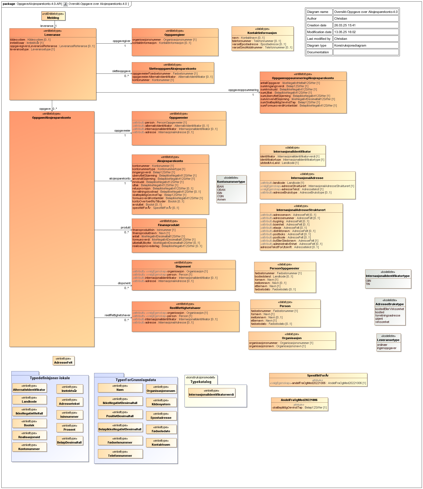

<Summary>Tjeneste for innrapportering av tredjepartsopplysninger om aksjesparekonto (RF-1301)</Summary>

<Tabs underline={true}>
<TabItem headerText="Om tjenesten" itemKey="itemKey-1" default>

For generell informasjon om tjenestene se egne sider om:

* [Sikkerhetsmekansimer](../om/sikkerhet.md)
* [Systembruker](../om/systembruker.md)
* [Feilhåndtering](../om/feil.md)
* [Versjonering](../om/versjoner.md)
* [Teknisk spesifikasjon](../om/tekniskspesifikasjon.md)

## Scope

Følgende scope skal benyttes ved autentisering i Maskinporten: `skatteetaten:innrapporteringaksjesparekonto`

## Delegering

Tilgang til dette API-et kan delegeres i Altinn, f.eks. dersom leverandør benyttes for den tekniske oppkoblingen.

## Systemtilgang

Bruk av API-et krever systemtilgang, som er ny funksjonalitet i Maskinporten levert av Digdir.
Informasjon vedr. dette finnes [her](../om/systembruker.md).

Dette API-et krever at systemet og dets systembrukere har tilgang til én eller flere av følgende tilgangspakker:

```json
"accessPackages": [
    {
        "urn": "urn:altinn:accesspackage:regnskapsforer-med-signeringsrettighet"
    },
    {
        "urn": "urn:altinn:accesspackage:ansvarlig-revisor"
    },
    {
        "urn": "urn:altinn:accesspackage:skattegrunnlag"
    }
]
```

## Teknisk spesifikasjon

URL-er til API-et, beskrivelse av parametre, endepunkter og respons ligger i Open API-spesifikasjonen på
[SwaggerHub](https://app.swaggerhub.com/apis/skatteetaten/innrapportering-aksjesparekonto-api/0.0.1)

Nødvendige åpninger i en evt. brannmur er beskrevet [her](../om/sikkerhet.md)

API-et for innrapportering av tredjepartsopplysninger om aksjesparekonto til offentlige myndigheter har to endepunkter:

* __POST innsending__: Innsending av tredjepartsopplysninger om aksjesparekonto til offentlige myndigheter. Et kall mot API-et er en rapportering for en organisasjon gitt av en oppgavegiver og som gjelder et inntektsår.
* __GET uthenting_dokument__: Henter ut et spesifikt dokument knyttet til en forsendelse i Dialogporten

API-et validerer mottatte data mot JSON-schema beskrevet på SwaggerHub. Se [feilkoder](innrapportering-aksjesparekonto?tab=Feilkoder) for
relaterte feilmeldinger.

Se også [eksempler](innrapportering-aksjesparekonto?tab=Eksempler) for de ulike endepunktene.

### Parameter: idempotencyKey

`idempotencyKey`-parameteren er påkrevet. Innholdet skal være en unik `UUID`. Hvert nye kall til API-et skal ha en
tilsvarende ny idempotencyKey. Flere etterfølgende `POST` kall med samme request-body og samme `idempotencyKey` vil gi den
samme responsen. Kun det første av denne rekken med like API kall vil behandles. `idempotencyKey` muliggjør at man trygt
kan prøve innsendinger på nytt der man av ulike årsaker ikke har fått en tilbakemelding fra API-et.

## Datakatalog

Dette API-et er pt. ikke dokumentert i Felles datakatalog.

</TabItem>
<TabItem headerText="Eksempler" itemKey="itemKey-2"> 

## Innsending

### Eksempel på request-URL

```
https://innrapporteringaksjesparekonto.api.{env}.no/v1/{inntektsaar}
```

### JSON

#### Eksempel på innsending

```json
{
    "leveranse": {
        "kildesystem": "Kildesystemet v2.0.5",
        "oppgavegiver": {
            "organisasjonsnummer": "987546231",
            "kontaktinformasjon": {
                "navn": "Kari Kontaktperson",
                "telefonnummer": "80080000",
                "varselEpostadresse": "kari.kontaktperson@finansinstitusjon.no",
                "varselSmsMobilnummer": "80080000"
            }
        },
        "inntektsaar": 2024,
        "oppgavegiversLeveranseReferanse": "EksternLeveranseRef12345",
        "leveransetype": "ordinaer",
        "oppgave": [
            {
                "oppgaveeier": {
                    "person": {
                        "foedselsnummer": "00000000000",
                        "fornavn": "Scott",
                        "etternavn": "Tiger",
                        "foedselsdato": "1980-05-10"
                    },
                    "alternativIdentifikator": "4545454545",
                    "internasjonalIdentifikator": {
                        "identifikator": "454-54-5454",
                        "identifikatortype": "TIN",
                        "utstedtAvLand": "US"
                    },
                    "adresse": {
                        "adresseStrukturert": {
                            "byEllerStedsnavn": "Oslo"
                        },
                        "landkode": "NO"
                    }
                },
                "aksjesparekonto": {
                    "kontonummer": "NO0014437946",
                    "kontonummertype": "ISIN",
                    "inngangsverdi": "10",
                    "ubenyttetSkjerming": "10",
                    "anvendtSkjerming": "0",
                    "innskudd": "10000",
                    "uttak": "0",
                    "skattepliktigGevinstTap": "0",
                    "formuesverdiKontantdel": "5000",
                    "avsluttet": false
                }
            },
            {
                "oppgaveeier": {
                    "person": {
                        "foedselsnummer": "00000000000",
                        "fornavn": "Scott",
                        "etternavn": "Tiger"
                    }
                },
                "aksjesparekonto": {
                    "kontonummer": "420042004200",
                    "kontonummertype": "OBAN",
                    "inngangsverdi": "10",
                    "ubenyttetSkjerming": "10",
                    "anvendtSkjerming": "0",
                    "innskudd": "10000",
                    "uttak": "0",
                    "forvaltningskostnad": "100",
                    "skattepliktigGevinstTap": "0",
                    "formuesverdiKontantdel": "4000",
                    "kontoOverfoertNyTilbyder": true,
                    "avsluttet": false
                },
                "produkt": [
                    {
                        "finansproduktIsin": "NOOB80000WW4",
                        "finansproduktnavn": "olje",
                        "antall": "1",
                        "formuesverdi": "100",
                        "utbetaltUtbytte": "0",
                        "realisasjonsvederlag": "0"
                    },
                    {
                        "finansproduktIsin": "NOOB80000WW5",
                        "finansproduktnavn": "gass",
                        "antall": "1",
                        "formuesverdi": "10000",
                        "utbetaltUtbytte": "500",
                        "realisasjonsvederlag": "0"
                    }
                ]
            }
        ],
        "oppgaveoppsummering": {
            "antallOppgaver": 2,
            "sumInngangsverdi": "20.00",
            "sumInnskudd": "20000.00",
            "sumUttak": "0.00",
            "sumUbenyttetSkjerming": "20.00",
            "sumAnvendtSkjerming": "0.00",
            "sumSkattepliktigGevinstTap": "0.00",
            "sumFormuesverdiKontantdel": "9000.00"
        }
    }
}
```

#### Eksempel på respons

```json
{
    "dialogId": "0193b5cd-cb85-7320-bd8c-6c78c88dc8af",
    "forsendelseId": "0193b5cd-cbce-7dbd-b188-1437db673767",
    "oppgavegiversLeveranseReferanse": "EksternLeveranseRef12345",
    "antallOppgaver": 2
}
```

</TabItem>
<TabItem headerText="Feilkoder" itemKey="itemKey-3">

Se egen side for generell info om [feilhåndtering i tjenestene](../om/feil.md).

Tabellen under viser en oversikt over hvilke spesifikke feilkoder denne tjenesten kan gi.

| Feilkode | HTTP Statuskode | Feilområde                                   |
|----------|-----------------|----------------------------------------------|
| GLD_001  | 500             | Uventet feil på tjenesten                    |
| GLD_004  | 401             | Feil i forbindelse med autentisering         |
| GLD_005  | 403             | Feil i forbindelse med autorisering          |
| GLD_006  | 400             | Feil i request                               |
| GLD_008  | 400             | Strukturell feil i tilknyttet dataformat     |
| GLD_010  | 400             | Feil i forbindelse med validering av payload |
| GLD_011  | 400             | Feil i metadata                              |
| GLD_017  | 500             | Uspesifisert systemfeil                      |
| GLD_019  | 409             | Idempotensnøkkel er benyttet tidligere       |
| GLD_021  | 404             | Finner ikke forespurt ressurs                |
| GLD_022  | 405             | HTTP-metode ikke støttet                     |
| GLD_023  | 500             | Uventet feil i et bakenforliggende system    |

Feilresponsene kan også inneholde en feilspesifiseringskode som presiserer feilen ytterligere.
Tabellen under viser hvilke feilspesifiseringskoder tjenesten kan gi.
Dersom det finnes mer detaljert feilinformasjon enn generelt feilområde vil det beskrives i melding, sti og 
angitt verdi-feltene.

| Feilspesifiseringskode | Feilområde                                                                                  | Årsak                                                                                                                       |
|------------------------|---------------------------------------------------------------------------------------------|-----------------------------------------------------------------------------------------------------------------------------|
| GLD_1007               | Mangler Token                                                                               | Det er ikke lagt ved noen Authorization header med token på request                                                         |
| GLD_1008               | Ugyldig token                                                                               | Token oppgitt i Authorization header er ugyldig                                                                             |
| GLD_1015               | Ikke autorisert for å levere på denne dialogen                                              | Organisasjonen som leverer har ikke rettighet til å levere for denne oppgavegiveren                                         |
| GLD_1022               | Feil i parametre                                                                            | Diverse feil med parametre i request. Mer detaljert beskrivelse ligger i melding, sti og angitt verdi dersom det er aktuelt |
| GLD_1023               | Finner ingen ressurs for denne URL-en                                                       | Det er ikke noe innhold tilgjengelig på denne URL-en                                                                        |
| GLD_1027               | Inntektsår er ikke støttet                                                                  | Det er ikke tillatt å levere på oppgitt inntektsår                                                                          |
| GLD_1028               | Header mangler                                                                              | Påkrevd header er ikke med i requesten                                                                                      |
| GLD_1030               | Accept-header må være av type application/json                                              | Accept header er feil. API-et har kun støtte for JSON i respons                                                             |
| GLD_1050               | Finner ikke et dokument med denne IDen på denne forsendelsen                                | Det finnes ikke noe dokument med gitt id på angitt forsendelse                                                              |
| GLD_1052               | Inntektsår i path og i innsending er ulike                                                  | Inntektsår i innsending i JSON body og inntektsår i path må være like                                                       |
| GLD_1053               | Uventet feil i et bakenforliggende system, vennligst prøv igjen senere                      |                                                                                                                             |
| GLD_1054               | Det finnes ingen dialog for denne kombinasjonen av inntektsår, organisjonsnummer og ordning |                                                                                                                             |

</TabItem>
<TabItem headerText="Informasjonsmodell" itemKey="itemKey-4">



</TabItem>

<TabItem headerText="Test" itemKey="itemKey-5">

I første omgang er test kun tilgjengelig for et utvalg leverandører som det er inngått avtale med og som skal være
med å pilotere løsningene.

### Testmiljøer

For spesifikke URL-er til testmiljø hos Skatteetaten, se [SwaggerHub](https://app.swaggerhub.com/apis/skatteetaten/innrapportering-aksjesparekonto-api/0.0.1).

Digdir benytter TT02 som testmiljø, hvor følgende tilbys:
* DialogPorten
* Autentisering - Maskinporten
* Autorisering - systembruker
* Altinn innboks

Konsumenter må ha egne testmiljøer som kan kobles mot testmiljøer hos Skatteetaten og Digdir.

### Tenor testdatasøk

Det finnes pt. ikke søk i [Tenor](https://github.com/Skatteetaten/api-dokumentasjon/blob/main/docs/test/tenor.md) for
denne tjenesten. Men egenskaper ved enhetene som har testdata kan søkes frem i Tenor.

### Testdata

Det skal utelukkende benyttes syntetiske testdata ved test av tjenesten. Tenor testdatasøk tilbyr dette.
Det er ikke tillatt å bruke/sende skarpe data i test pga krav fra GDPR-regelverket.

Det finnes foreløpig ingen testdata for denne tjenesten. Denne siden oppdateres fortløpende ettersom testdata blir
tilgjengelig.

</TabItem>
<TabItem headerText="Kontakt oss" itemKey="itemKey-6">

Har du spørsmål til Skatteetaten om Innrapportering Aksjesparekonto API, kan du sende oss e-post: [altinnreetablering\@skatteetaten.no](mailto:altinnreetablering@skatteetaten.no)  
Vær oppmerksom på at epostadressen er midlertidig og gjelder bare i perioden tjenestene er i utvikling og test fra Altinn II til Altinn 3.

</TabItem>
</Tabs>
