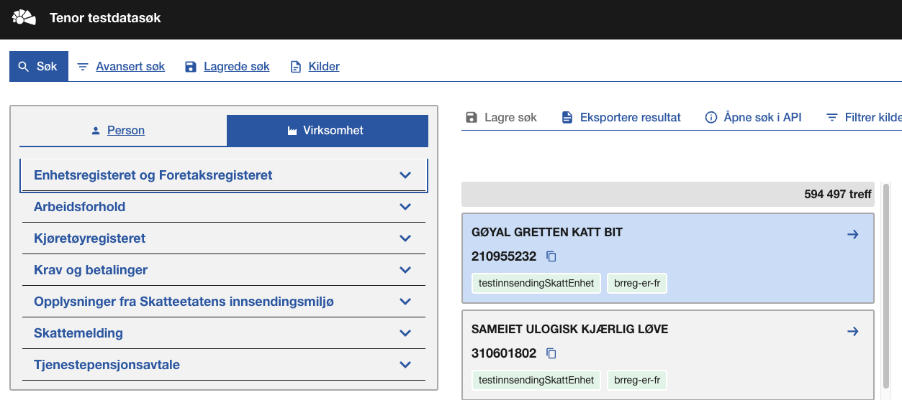
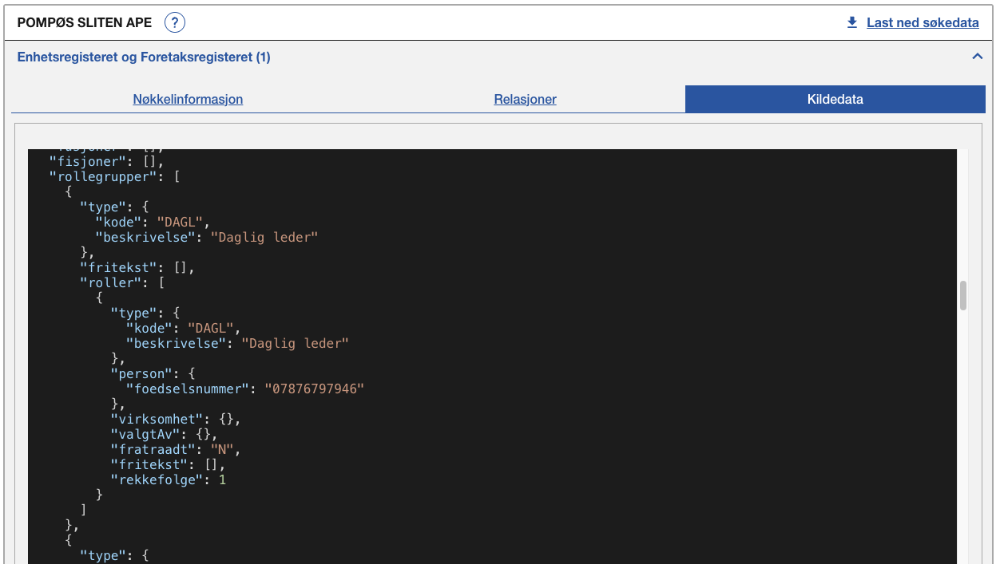

<Summary>Tjeneste for innrapportering av aksjonærregisteroppgaven (RF-1086)</Summary>

<Tabs underline={true}>
<TabItem headerText="Om tjenesten" itemKey="itemKey-1" default>

For generell informasjon om tjenestene se egne sider om:

* [Bruk av API-er for innrapportering](../om/bruk_innrapportering.md)
* [Sikkerhetsmekanismer](../om/sikkerhet.md)
* [Systembruker](../om/systembruker.md)
* [Feilhåndtering](../om/feil.md)
* [Versjonering](../om/versjoner.md)
* [Teknisk spesifikasjon](../om/tekniskspesifikasjon.md)

## Scope

Følgende scope skal benyttes ved autentisering i Maskinporten: `skatteetaten:innrapporteringaksjonaerregisteroppgave`

Skatteetaten må gi tilgang til scope. Søk om dette [her](https://www.skatteetaten.no/samarbeidspartnere/sluttbrukersystemer/aksjonarregisteroppgaven-sbs/#bestill-tilgang-til-tjenesten-krever-innlogging).

## Delegering

Tilgang til dette API-et kan delegeres i Altinn, f.eks. dersom leverandør benyttes for den tekniske oppkoblingen.

## Systemtilgang med systembruker

Bruk av API-et krever systemtilgang med systembruker, som er ny funksjonalitet i Maskinporten levert av Digdir.
Informasjon vedr. dette finnes [her](../om/systembruker.md).

For systembruker for klientsystemer anbefaler vi å ikke kombinere tilgangspakker på tvers av fullmaktsområder, da det kan medføre at bruker ikke kan utføre [klientdelegering](https://docs.altinn.studio/nb/authorization/guides/end-user/system-user/delegate-clients/). Se fullmaktsområder [her](https://docs.altinn.studio/nb/authorization/what-do-you-get/accessgroups/accessgroups/)

Dette API-et krever at systemet og dets systembrukere har tilgang til én eller flere av følgende tilgangspakker:

```json
"accessPackages": [
    {
        "urn": "urn:altinn:accesspackage:regnskapsforer-med-signeringsrettighet"
    },
    {
        "urn": "urn:altinn:accesspackage:regnskapsforer-uten-signeringsrettighet"
    },
    {
        "urn": "urn:altinn:accesspackage:ansvarlig-revisor"
    },
    {
        "urn": "urn:altinn:accesspackage:revisormedarbeider"
    },
    {
        "urn": "urn:altinn:accesspackage:skattegrunnlag"
    }
]
```

Ved bruk av standard systembruker kan man også benytte enkeltrettighet for tilgang til tjenesten:

```json
"rights": [
    {
        "resource": [
            {
                "id": "urn:altinn:resource",
                "value": "ske-innrapportering-aksjonaerregisteroppgave"
            }
        ]
    }
]
```

## Teknisk spesifikasjon


URL-er til API-et, beskrivelsen av parameterne, endepunkter og respons ligger i Open API spesifikasjonen på
[SwaggerHub](https://app.swaggerhub.com/apis/skatteetaten/innrapportering-aksjonaerregister-api/)

Oppbygning av URL-er og åpninger i en evt. brannmur er beskrevet her [Brannmur](../om/sikkerhet#brannmur)

API-et for innsending av aksjonaerregisteroppgaven har bare fem endepunkter:

* __POST hovedskjema__: Mottar hovedskjema for aksjonærregisteroppgaven
* __POST underskjema__: Mottar underskjema for aksjonærregisteroppgaven
* __POST bekreft__: Bekrefter at alle underskjemaer er innsendt og oppgaven er klar til videre behandling
* __GET dokumenter__: Henter ut flere dokumenter fra en forsendelse 
  * Dette endepunktet anbefales brukt om man ønsker å hente ut alle innsendte hoved/underskjemaer. Endepunktet kan levere opp til 50 skjemaer pr kall og hovedskjemaet vil alltid være første skjema på første page.
* __GET dokument__: Henter ut et enkelt dokument fra en forsendelse
  * Dette endepunktet anbefales brukt om man skal hente ut enkeltdokumenter som f.eks tilbakemeldinger. 
* __GET prefill__: Henter ut en tidligere godkjent innrapportering av aksjonærregisteroppgaven
  * I endepunktet spesifiserer man inntektsår, oppgavegiver og et optional felt for paginering
  * Sjekker om det finnes prefill for inntektsåret man spør om. Setter man inntektsår 2026, så sjekkes det om det finnes innrapportert oppgave for 2025 med enten status "GODKJENT" eller "AVVIST". Finnes det ikke så returneres 404.

Innsendt data på hovedskjema endepunktet valideres etter følgende xsd: [hovedskjema](../../static/download/aksjonaerregisteroppgaveHovedskjema.xsd)

Innsendt data på underskjema endepunktet valideres etter følgende xsd: [underskjema](../../static/download/aksjonaerregisteroppgaveUnderskjema.xsd)

Øvrige krav til innsending er dokumentert i rettleding til utfylling av akjsonærregisteroppgaven på denne siden: https://www.skatteetaten.no/bedrift-og-organisasjon/rapportering-og-bransjer/aksjonarregisteroppgaven/

Se også [eksempler](innrapportering-aksjonaerregisteroppgave?tab=Eksempler) for de ulike endepunktene.

### Parameter: idempotencyKey

idempotencyKey parameteren er påkrevet. Innholdet skal være en unik UUID. Hvert nye kall til API-et skal ha en
tilsvarende ny idempotencyKey. Flere etterfølgende POST kall med samme request-body og samme idempotencyKey vil gi den
samme responsen. Kun det første av denne rekken med like API kall vil behandles. IdempotencyKey muliggjør at man trygt
kan prøve innsendinger på nytt der man av ulike årsaker ikke har fått en tilbakemelding fra API-et.

## Datakatalog

Dette API-et er pt. ikke dokumentert i Felles datakatalog.

</TabItem>
<TabItem headerText="Eksempler" itemKey="itemKey-2"> 

## Innsending

### Eksempel på hovedskjema

#### Hovedskjema url:
```
https://api-test.sits.no/api/aksjonaerregister/v1/2023/1086H
```

#### Hovedskjema XML
```
<Skjema
        skjemanummer="890" spesifikasjonsnummer="12144"
        blankettnummer="RF-1086" gruppeid="2586" etatid="974761076">
    <GenerellInformasjon-grp-2587 gruppeid="2587">
        <Selskap-grp-2588 gruppeid="2588">
            <EnhetOrganisasjonsnummer-datadef-18 orid="18">314259521</EnhetOrganisasjonsnummer-datadef-18>
            <EnhetNavn-datadef-1 orid="1">MOSEGRODD ORANSJE TIGER AS</EnhetNavn-datadef-1>
            <EnhetAdresse-datadef-15 orid="15">Haråsveien 13E</EnhetAdresse-datadef-15>
            <EnhetPostnummer-datadef-6673 orid="6673">0283</EnhetPostnummer-datadef-6673>
            <EnhetPoststed-datadef-6674 orid="6674">OSLO</EnhetPoststed-datadef-6674>
            <AksjeType-datadef-17659 orid="17659">01</AksjeType-datadef-17659>
            <Inntektsar-datadef-692 orid="692">2023</Inntektsar-datadef-692>
        </Selskap-grp-2588>
        <Kontaktperson-grp-3442 gruppeid="3442">
            <KontaktpersonSkjemaEPost-datadef-30533 orid="30533">epost@epost.no
            </KontaktpersonSkjemaEPost-datadef-30533>
        </Kontaktperson-grp-3442>
        <AnnenKontaktperson-grp-5384 gruppeid="5384"></AnnenKontaktperson-grp-5384>
    </GenerellInformasjon-grp-2587>
    <Selskapsopplysninger-grp-2589 gruppeid="2589">
        <AksjekapitalForHeleSelskapet-grp-3443 gruppeid="3443">
            <AksjekapitalFjoraret-datadef-7129 orid="7129">0</AksjekapitalFjoraret-datadef-7129>
            <Aksjekapital-datadef-87 orid="87">100000</Aksjekapital-datadef-87>
        </AksjekapitalForHeleSelskapet-grp-3443>
        <AksjekapitalIDenneAksjeklassen-grp-3444 gruppeid="3444">
            <AksjekapitalISINAksjetypeFjoraret-datadef-17663 orid="17663">0
            </AksjekapitalISINAksjetypeFjoraret-datadef-17663>
            <AksjekapitalISINAksjetype-datadef-17664 orid="17664">100000</AksjekapitalISINAksjetype-datadef-17664>
        </AksjekapitalIDenneAksjeklassen-grp-3444>
        <PalydendePerAksje-grp-3447 gruppeid="3447">
            <AksjeMvPalydendeFjoraret-datadef-23944 orid="23944">0</AksjeMvPalydendeFjoraret-datadef-23944>
            <AksjeMvPalydende-datadef-23945 orid="23945">1000</AksjeMvPalydende-datadef-23945>
        </PalydendePerAksje-grp-3447>
        <AntallAksjerIDenneAksjeklassen-grp-3445 gruppeid="3445">
            <AksjerMvAntallFjoraret-datadef-29166 orid="29166">0</AksjerMvAntallFjoraret-datadef-29166>
            <AksjerMvAntall-datadef-29167 orid="29167">100</AksjerMvAntall-datadef-29167>
        </AntallAksjerIDenneAksjeklassen-grp-3445>
        <InnbetaltAksjekapitalIDenneAksjeklassen-grp-3446 gruppeid="3446">
            <AksjekapitalInnbetaltFjoraret-datadef-8020 orid="8020">0</AksjekapitalInnbetaltFjoraret-datadef-8020>
            <AksjekapitalInnbetalt-datadef-5867 orid="5867">100000</AksjekapitalInnbetalt-datadef-5867>
        </InnbetaltAksjekapitalIDenneAksjeklassen-grp-3446>
        <InnbetaltOverkursIDenneAksjeklassen-grp-3448 gruppeid="3448">
            <AksjeOverkursISINAksjetypeFjoraret-datadef-17662 orid="17662">0
            </AksjeOverkursISINAksjetypeFjoraret-datadef-17662>
            <AksjeOverkursISINAksjetype-datadef-17661 orid="17661">0</AksjeOverkursISINAksjetype-datadef-17661>
        </InnbetaltOverkursIDenneAksjeklassen-grp-3448>
    </Selskapsopplysninger-grp-2589>
    <Utbytte-grp-3449 gruppeid="3449">
        <UtdeltSkatterettsligUtbytteILopetAvInntektsaret-grp-3451
                gruppeid="3451"></UtdeltSkatterettsligUtbytteILopetAvInntektsaret-grp-3451>
    </Utbytte-grp-3449>
    <UtstedelseAvAksjerIfmStiftelseNyemisjonMv-grp-3452 gruppeid="3452">
        <AntallNyutstedteAksjer-grp-3453 gruppeid="3453">
            <AksjerNyutstedteStiftelseMvAntall-datadef-17668 orid="17668">100
            </AksjerNyutstedteStiftelseMvAntall-datadef-17668>
            <AksjerStiftelseMvAntall-datadef-17669 orid="17669">100</AksjerStiftelseMvAntall-datadef-17669>
            <AksjerNyutstedteStiftelseMvType-datadef-17670 orid="17670">N
            </AksjerNyutstedteStiftelseMvType-datadef-17670>
            <AksjerNyutstedteStiftelseMvTidspunkt-datadef-17671 orid="17671">2022-01-01T00:00:00
            </AksjerNyutstedteStiftelseMvTidspunkt-datadef-17671>
            <AksjerNyutstedteStiftelseMvPalydende-datadef-23947 orid="23947">1000
            </AksjerNyutstedteStiftelseMvPalydende-datadef-23947>
        </AntallNyutstedteAksjer-grp-3453>
    </UtstedelseAvAksjerIfmStiftelseNyemisjonMv-grp-3452>
    <UtstedelseAvAksjerIfmFondsemisjonSplittMv-grp-3454 gruppeid="3454">
        <NyutstedteAksjerOmfordeling-grp-3455 gruppeid="3455"></NyutstedteAksjerOmfordeling-grp-3455>
    </UtstedelseAvAksjerIfmFondsemisjonSplittMv-grp-3454>
    <SlettingAvAksjerIfmLikvidasjonPartiellLikvidasjonMv-grp-3456 gruppeid="3456">
        <SlettedeAksjerAvgang-grp-3457 gruppeid="3457"></SlettedeAksjerAvgang-grp-3457>
    </SlettingAvAksjerIfmLikvidasjonPartiellLikvidasjonMv-grp-3456>
    <SlettingAvAksjerIfmSpleisSkattefriFusjonFisjon-grp-3458 gruppeid="3458">
        <SlettedeAksjerOmfordeling-grp-3459 gruppeid="3459"></SlettedeAksjerOmfordeling-grp-3459>
    </SlettingAvAksjerIfmSpleisSkattefriFusjonFisjon-grp-3458>
    <EndringerIAksjekapitalOgOverkurs-grp-3460 gruppeid="3460">
        <NedsettelseAvInnbetaltOverkursMedTilbakebetalingTilAksjonarene-grp-3461
                gruppeid="3461"></NedsettelseAvInnbetaltOverkursMedTilbakebetalingTilAksjonarene-grp-3461>
        <ForhoyelseAvAKVedOkningAvPalydende-grp-3462 gruppeid="3462"></ForhoyelseAvAKVedOkningAvPalydende-grp-3462>
        <ForhoyelseAvAKVedOkningAvPalydende-grp-3463 gruppeid="3463"></ForhoyelseAvAKVedOkningAvPalydende-grp-3463>
        <NedsettelseAvInnbetaltOgFondsemittertAK-grp-3464
                gruppeid="3464"></NedsettelseAvInnbetaltOgFondsemittertAK-grp-3464>
        <NedsettelseAKVedReduksjonAvPalydende-grp-3465 gruppeid="3465"></NedsettelseAKVedReduksjonAvPalydende-grp-3465>
        <NedsettelseAvAKVedReduksjonUtfisjonering-grp-3466
                gruppeid="3466"></NedsettelseAvAKVedReduksjonUtfisjonering-grp-3466>
    </EndringerIAksjekapitalOgOverkurs-grp-3460>
</Skjema>

```

#### Eksempel på respons fra hovedskjema endepunkt
```
{
    "hovedskjemaid": "0193de1a-d956-739e-980e-ab57ae7de73c"
}
```

### Underskjema innsending

#### Underskjema url
```
https://api-test.sits.no/api/aksjonaerregister/v1/2023/{{hovedskjemaid}}/1086U
```

#### Underskjema XML

```
<Skjema
        skjemanummer="923" spesifikasjonsnummer="12232"
        blankettnummer="RF-1086-U" tittel="Aksjonærregisteroppgaven - underskjema" gruppeid="3983" etatid="974761076">
    <SelskapsOgAksjonaropplysninger-grp-3987 gruppeid="3987">
        <Selskapsidentifikasjon-grp-3986 gruppeid="3986">
            <EnhetOrganisasjonsnummer-datadef-18 orid="18">314259521</EnhetOrganisasjonsnummer-datadef-18>
            <AksjeType-datadef-17659 orid="17659">01</AksjeType-datadef-17659>
            <Inntektsar-datadef-692 orid="692">2023</Inntektsar-datadef-692>
        </Selskapsidentifikasjon-grp-3986>
        <NorskUtenlandskAksjonar-grp-3988 gruppeid="3988">
            <AksjonarFodselsnummer-datadef-1156 orid="1156">26829398612</AksjonarFodselsnummer-datadef-1156>
            <Adresse-grp-7722 gruppeid="7722"></Adresse-grp-7722>
        </NorskUtenlandskAksjonar-grp-3988>
    </SelskapsOgAksjonaropplysninger-grp-3987>
    <AntallAksjerUtbytteOgTilbakebetalingAvTidligereInnbetaltKapit-grp-3990 gruppeid="3990">
        <AntallAksjerPerAksjonar-grp-3989 gruppeid="3989">
            <AksjerAntallFjoraret-datadef-29168 orid="29168">0</AksjerAntallFjoraret-datadef-29168>
            <AksjonarAksjerAntall-datadef-17741 orid="17741">100</AksjonarAksjerAntall-datadef-17741>
        </AntallAksjerPerAksjonar-grp-3989>
        <UtdeltUtbyttePerAksjonar-grp-3991 gruppeid="3991">
            <AutomatiskMotregningOnskerIkke-datadef-37159 orid="37159">0</AutomatiskMotregningOnskerIkke-datadef-37159>
        </UtdeltUtbyttePerAksjonar-grp-3991>
        <UtdeltUtbytteKildeskatt-grp-9347 gruppeid="9347"></UtdeltUtbytteKildeskatt-grp-9347>
        <TilbakebetalingAvTidligereInnbetaltKapital-grp-7633 gruppeid="7633">
            <TilbakebetalingAvTidligereInnbetaltKapital-grp-7865
                    gruppeid="7865"></TilbakebetalingAvTidligereInnbetaltKapital-grp-7865>
        </TilbakebetalingAvTidligereInnbetaltKapital-grp-7633>
    </AntallAksjerUtbytteOgTilbakebetalingAvTidligereInnbetaltKapit-grp-3990>
    <Transaksjoner-grp-3992 gruppeid="3992">
        <KjopArvGaveStiftelseNyemisjonMv-grp-3993 gruppeid="3993">
            <AntallAksjerITilgang-grp-3998 gruppeid="3998">
                <AksjerKjopAntall-datadef-12153 orid="12153">100</AksjerKjopAntall-datadef-12153>
                <AksjeErvervType-datadef-17745 orid="17745">N</AksjeErvervType-datadef-17745>
                <AksjerErvervsdato-datadef-17746 orid="17746">2022-01-01T00:00:00</AksjerErvervsdato-datadef-17746>
                <AksjeAnskaffelsesverdi-datadef-17636 orid="17636">100000</AksjeAnskaffelsesverdi-datadef-17636>
            </AntallAksjerITilgang-grp-3998>
        </KjopArvGaveStiftelseNyemisjonMv-grp-3993>
    </Transaksjoner-grp-3992>
    <FondsemisjonSplittSkattefriFusjonFisjonSammenslaingDelingAv-grp-3994 gruppeid="3994">
        <AntallAksjerITilgangIfmOmfordeling-grp-3999 gruppeid="3999"></AntallAksjerITilgangIfmOmfordeling-grp-3999>
    </FondsemisjonSplittSkattefriFusjonFisjonSammenslaingDelingAv-grp-3994>
    <SalgArvGaveLikvidasjonPartiellLikvidasjonMv-grp-3995 gruppeid="3995">
        <AksjerIAvgang-grp-4002 gruppeid="4002"></AksjerIAvgang-grp-4002>
    </SalgArvGaveLikvidasjonPartiellLikvidasjonMv-grp-3995>
    <SpleisSkattefriFusjonOgSkattefriFisjon-grp-3996 gruppeid="3996">
        <AntallAksjerIAvgangVedOmfordeling-grp-4003 gruppeid="4003"></AntallAksjerIAvgangVedOmfordeling-grp-4003>
    </SpleisSkattefriFusjonOgSkattefriFisjon-grp-3996>
    <EndringerIAksjekapitalOgOverkurs-grp-3997 gruppeid="3997">
        <TilbakebetaltInnbetaltOgFondsemittertAKVedReduksjonAvPalydende-grp-4000
                gruppeid="4000"></TilbakebetaltInnbetaltOgFondsemittertAKVedReduksjonAvPalydende-grp-4000>
        <TilbakebetaltTidligereInnbetaltOverkursForAksjen-grp-4001
                gruppeid="4001"></TilbakebetaltTidligereInnbetaltOverkursForAksjen-grp-4001>
        <ForhoyelseAvInnbetaltAksjekapitalVedOkning-grp-4987
                gruppeid="4987"></ForhoyelseAvInnbetaltAksjekapitalVedOkning-grp-4987>
        <ReduksjonInnbetaltAksjekapital-grp-9857 gruppeid="9857"></ReduksjonInnbetaltAksjekapital-grp-9857>
    </EndringerIAksjekapitalOgOverkurs-grp-3997>
</Skjema>

```

#### Eksempel på respons fra underskjema endepunkt
Endepunktet gir ingen data tilbake ved vellykket kall. Kun 200 OK som statuskode

### Bekretft endepunkt

#### Bekreft url
```
https://api-test.sits.no/api/aksjonaerregister/v1/2023/{{hovedskjemaid}}/bekreft?antall_underskjema={{antall-innsendte-underskjema}}
```

#### Eksempel på respons fra bekreft endepunkt

```
{
    "oppgavegiversLeveranseReferanse": "0193de1a-d956-739e-980e-ab57ae7de73c",
    "dialogId": "0193d51a-ec30-7d58-b727-6ce65964d3d4",
    "forsendelseId": "0193de1b-0483-740a-9e0b-f60a2d519638"
}
```

## Uthenting

### Prefill endepunktet

#### Prefill url
```
https://api-test.sits.no/api/aksjonaerregister/v1/prefill/{{inntektsår}}/{{oppgavegiver}}?page=0
```

#### Eksempel på respons fra prefill endepunkt

```
{
  "totalItems": 17,
  "totalPages": 1,
  "currentPage": 0,
  "oppgaveStatus": "GODKJENT",
  "dokumenter": [
    {
      "aksjeklasse": "01",
      "namespace": "xmlns:brreg=\"http://www.brreg.no/or\" xmlns:xsi=\"http://www.w3.org/2001/XMLSchema-instance\"",
      "dokument": "<Skjema xmlns:brreg=\"http://www.brreg.no/or\" xmlns:xsi=\"http://www.w3.org/2001/XMLSchema-instance\" skjemanummer=\"890\" spesifikasjonsnummer=\"12144\" 
      blankettnummer=\"RF-1086\" etatid=\"999999999\"><GenerellInformasjon-grp-2587 gruppeid=\"2587\"><Selskap-grp-2588 gruppeid=\"2588\"><EnhetOrganisasjonsnummer-datadef-18 
      orid=\"18\">888888888</EnhetOrganisasjonsnummer-datadef-18><AksjeType-datadef-17659 orid=\"17659\">ordinaer</AksjeType-datadef-17659><Inntektsar-datadef-692 
      orid=\"692\">2026</Inntektsar-datadef-692></Selskap-grp-2588>......"
    }
  ]
}
```

</TabItem>
<TabItem headerText="Feilkoder" itemKey="itemKey-3">

Se egen side for generell info om [feilhåndtering i tjenestene](../om/feil.md).

Tabellen under viser en oversikt over hvilke spesifikke feilkoder denne applikasjonen kan gi.

| Feilkode | HTTP Statuskode | Feilområde                                   |
|----------|-----------------|----------------------------------------------|
| GLD_001  | 500             | Uventet feil på tjenesten                    |
| GLD_004  | 401             | Feil i forbindelse med autentisering         |
| GLD_005  | 403             | Feil i forbindelse med autorisering          |
| GLD_006  | 400             | Feil i request                               |
| GLD_008  | 400             | Strukturell feil i tilknyttet dataformat     |
| GLD_010  | 400             | Feil i forbindelse med validering av payload |
| GLD_011  | 400             | Feil i metadata                              |
| GLD_017  | 500             | Uspesifisert systemfeil                      |
| GLD_019  | 409             | Idempotensnøkkel er benyttet tidligere       |
| GLD_021  | 404             | Finner ikke forespurt ressurs                |
| GLD_022  | 405             | HTTP-metode ikke støttet                     |
| GLD_023  | 500             | Uventet feil i et bakenforliggende system.   |

Feilresponsene kan også inneholde en feilspesifiseringskode som presiserer feilen ytterligere.
Tabellen under viser hvilke feilspesifiseringskoder applikasjonen kan gi.
Dersom det finnes mer detaljert feilinformasjon enn generelt feilområde vil det beskrives i melding, sti og angitt verdi
feltene.

| Feilspesifiseringskode | Feilområde                                                                         | Årsak                                                                                                                       |
|------------------------|------------------------------------------------------------------------------------|-----------------------------------------------------------------------------------------------------------------------------|
| GLD_1007               | Mangler Token                                                                      | Det er ikke lagt ved noen authorization header med token på request                                                         |
| GLD_1008               | Ugyldig token                                                                      | Token oppgitt i authorization header er ugyldig                                                                             |
| GLD_1015               | Ikke autorisert for å levere på denne dialogen                                     | Organisasjonen som leverer har ikke rettighet til å levere for denne oppgavegiveren                                         |
| GLD_1016               | Det finnes ikke et hovedskjema med denne IDen for denne innsendingen               | Oppgitt hovedskjemaid finnes ikke, eller gjelder ikke for denne oppgavegiver og inntektsår                                  |
| GLD_1018               | Oppgitt antall underskjemaer stemmer ikke med antall underskjemaer på innsendingen | Antallet underskjemaer oppgitt i parameter er ikke likt som antall underskjemaer sendt inn på hovedskjemaet                 |
| GLD_1022               | Feil i parametre                                                                   | Diverse feil med parametre i request. Mer detaljert beskrivelse ligger i melding, sti og angitt verdi dersom det er aktuelt |
| GLD_1023               | Finner ingen ressurs for denne urlen                                               | Det er ikke noe innhold tilgjengelig på denne URLen                                                                         |
| GLD_1026               | En innsending må ha minimum ett underskjema                                        | Man kan ikke bekrefte en innsending som ikke har noen innsendte underskjemaer                                               |
| GLD_1028               | Header mangler                                                                     | Påkrevd header er ikke med i requesten                                                                                      |
| GLD_1029               | Innsendingen er allerede bekreftet                                                 | Denne feilmeldingen gis om man forsøker å sende inn underskjema på en innsending som er bekreftet                           |
| GLD_1030               | Accept-header må være av type application/json                                     | Accept header er feil. APIet har kun støtte for json i response                                                             |
| GLD_1031               | Content-type må være av type application/xml                                       | Content-type header er feil. APIet har kun støtte for xml i request body                                                    |
| GLD_1050               | Finner ikke et dokument med denne IDen på denne forsendelsen                       | Det finnes ikke noe dokument med gitt id på angitt forsendelse                                                              |
| GLD_1052               | Inntektsår i path og i innsending er ulike                                         | Inntektsår i innsending i JSON body og inntektsår i path må være like                                                       |
| GLD_1053               | Uventet feil i et bakenforliggende system, vennligst prøv igjen senere             |                                                                                                                             |

</TabItem>

<TabItem headerText="Informasjonsmodell" itemKey="itemKey-4">
For informasjon om hvilke data som skal fylles inn i oppgaven se rettledning og mer info på skatteetatens sider for [aksjonærregisteroppgave](https://www.skatteetaten.no/bedrift-og-organisasjon/rapportering-og-bransjer/aksjonarregisteroppgaven/)
</TabItem>

<TabItem headerText="Valideringer" itemKey="itemKey-5">
I tillegg til valideringer som gjøres i xsd-skjemaene, så gjøres det også en del valideringer på innsendt data. Tabellen under viser hvilke valideringer som gjøres og hvilke feilmeldinger som gis dersom valideringen feiler.

## Hovedskjema

| Sjekk | Feilmelding |
| --- | --- |
| AksjerSlettedeLikvidasjonMvType-datadef-17691 = L OG en av følgende er ulik 0 Aksjekapital-datadef-87 AksjekapitalISINAksjetype-Datadef-17664 AksjeMvPalydende-Datadef-23945 AksjerMvAntall-datadef-29167 AksjekapitalInnbetalt-datadef-5867 AksjeOverkursISINAksjetype-datadef-17661 | Ved likvidasjon av selskap, skal post 1-6 være 0 |
| AksjerSlettedeLikvidasjonMvType-datadef-17691 = L OG AksjeOverkursISINAksjetype-datadef-17661 er ikke satt i xml | Ved likvidasjon av selskap, skal post 6 være 0 |
| for hvert UtdeltSkatterettsligUtbytteILopetAvInntektsaret-grp-3451 AksjeUtbytteHendelsestype-datadef-36564 = Y OG ingen eller alle av AksjeUtbytteISINAksjetype-datadef-17665 AksjeUtbyttePerAksje-datadef-23946 AksjeUtbytteTidspunkt-datadef-17667 er definert | Samtlige felt i post 8 må fylles ut |
| for hvert UtdeltSkatterettsligUtbytteILopetAvInntektsaret-grp-3451 AksjeUtbytteHendelsestype-datadef-36564 = Z OG ingen eller alle av AksjeUtbytteISINAksjetype-datadef-17665 AksjeUtbytteTidspunkt-datadef-17667 er definert | Samtlige felt i post 8 må fylles ut |
| for hvert UtdeltSkatterettsligUtbytteILopetAvInntektsaret-grp-3451 AksjeUtbytteTidspunkt-datadef-17667 er definertOGAksjeUtbytteHendelsestype-datadef-36564 = Y OG en eller begge av AksjeUtbytteISINAksjetype-datadef-17665 AksjeUtbyttePerAksje-datadef-23946 Ikke er definert | Oppgir man tidspunkt, må det også foreligge en utbetaling. |
| for hvert UtdeltSkatterettsligUtbytteILopetAvInntektsaret-grp-3451 AksjeUtbytteHendelsestype-datadef-36564 er definert OG en eller begge av AksjeUtbytteISINAksjetype-datadef-17665 AksjeUtbytteTidspunkt-datadef-17667 Ikke er definert | Oppgir man hendelsestype, må det også foreligge en utbetaling |
| for hvert UtdeltSkatterettsligUtbytteILopetAvInntektsaret-grp-3451 AksjeUtbytteHendelsestype-datadef-36564 ikke er definert OG en av AksjeUtbytteISINAksjetype-datadef-17665 AksjeUtbytteTidspunkt-datadef-17667 AksjeUtbyttePerAksje-datadef-23946 er definert | Du må oppgi hendelsestype, når det foreligger en utbetaling |
| for hvert UtdeltSkatterettsligUtbytteILopetAvInntektsaret-grp-3451 AksjeUtbytteHendelsestype-datadef-36564 er definert OG AksjeUtbytteTidspunkt-datadef-17667 er IKKE definert | Oppgir man tidspunkt, må det også foreligge en utbetaling |
| for hver AntallNyutstedteAksjer-grp-3453 ingen eller alle av AksjerStiftelseMvAntall-datadef-17669 AksjerNyutstedteStiftelseMvType-datadef-17670 AksjerNyutstedteStiftelseMvTidspunkt-datadef-17671 AksjerNyutstedteStiftelseMvPalydende-datadef-23947 er definert | I post 9 mangler ett eller flere av de følgende feltene utfylling: Antall nyutstedte aksjer', 'Antall aksjer etter', 'Hendelsestype', 'Tidspunkt' eller 'Pålydende per aksje' |
| for hver NyutstedteAksjerOmfordeling-grp-3455 AksjerNyutstedteFondsemisjonMvType-datadef-17679 = SD AksjerNyutstedteFondsemisjonMvISIN-datadef-17684 er IKKE definert OG AksjerNyutstedteFondsemisjonMvAksjetype-datadef-19905 er IKKE definert | Ved 'Sammenslåing/deling av aksjeklasse' må minst ett av feltene 'ISIN' eller 'Aksjeklasse' fylles ut |
| for hver NyutstedteAksjerOmfordeling-grp-3455 AksjerNyutstedteFondsemisjonMvType-datadef-17679 = C OG ingen eller alle av AksjerNyutstedteFondsemisjonMvAntall-datadef-17677 AksjerNyutstedteFondsemisjonMvAntallEtter-datadef-17678 AksjerNyutstedteFondsemisjonMvType-datadef-17679 AksjerNyutstedteFondsemisjonMvTidspunkt-datadef-17680 AksjerNyutstedteFondsemisjonMvPalydende-datadef-23949 er definert | I post 10 mangler ett eller flere av de følgende feltene utfylling: 'Antall nyutstedte aksjer', 'Antall aksjer etter', 'Hendelsestype', 'Tidspunkt' eller 'Pålydende per utstedt aksje' |
| for hver NyutstedteAksjerOmfordeling-grp-3455 AksjerNyutstedteFondsemisjonMvType-datadef-17679 = C OG AksjerNyutstedteFondsemisjonMvTidspunkt-datadef-17680 er IKKE definer | Ved 'Korrigering av aksjeklasse/ISIN' må 'Tidspunkt' fylles ut. |
| for hver NyutstedteAksjerOmfordeling-grp-3455 AksjerNyutstedteFondsemisjonMvType-datadef-17679 = C OG AksjerNyutstedteFondsemisjonMvISIN-datadef-17684 er IKKE definert OG AksjerNyutstedteFondsemisjonMvAksjetype-datadef-19905 er IKKE definert | Ved 'Korrigering av aksjeklasse/ISIN' må minst ett av feltene 'ISIN' eller 'Aksjeklasse' fylles ut. |
| for hver SlettedeAksjerAvgang-grp-3457 ingen eller alle av AksjerSlettedeLikvidasjonMvAntall-datadef-17688 AksjerLividasjonMvAntall-datadef-17689 AksjerSlettedeLikvidasjonMvPalydende-datadef-23951 AksjerSlettedeLikvidasjonMvType-datadef-17691 AksjerSlettedeLividasjonMvTidspunkt-datadef-17692 er definert | I post 11 mangler ett eller flere av de følgende feltene utfylling: 'Antall slettede aksjer', " +              "'Antall aksjer etter', 'Pålydende per aksje', 'Hendelsestype' eller 'Tidspunkt' |
| for hver SlettedeAksjerOmfordeling-grp-3459 en eller flere av AksjerSlettedeSpleisMvDatterselskapOvertakendeISINType-datadef-20374 AksjerSlettedeSpleisMvDatterselskapOvertakendeAksjetype-datadef-20375 AksjerSlettedeSpleisMvOvertakendeAntall-datadef-17701 AksjerSlettedeSpleisMvOvertakendePalydende-datadef-23954 er definert OG en eller flere av EnhetSlettedeSpleisMvMorselskapOvertakendeOrganisasjonsnumm-datadef-17703 AksjerSlettedeSpleisMvMorselskapOvertakendeISINType-datadef-17704 AksjerSlettedeSpleisMvMorselskapOvertakendeAksjetype-datadef-19907 AksjerSlettedeSpleisMvMorselskapOvertakendeAntall-datadef-17705 AksjerSlettedeSpleisMvMorselskapOvertakendePalydende-datadef-23955 | Hvis opplysninger om Overtakende selskap er utfylt kan ikke opplysninger om Overtakende morselskap fylles ut |
| for hver SlettedeAksjerOmfordeling-grp-3459 ingen eller alle av AksjerSlettedeSpleisMvAntall-datadef-17693 AksjerSpleisAntall-datadef-17694 AksjerSlettedeSpleisMvType-datadef-17695 AksjerSlettedeSpleisMvTidspunkt-datadef-17696 er definert | I post 12 mangler ett eller flere av de følgende feltene utfylling: 'Antall slettede aksjer', 'Antall aksjer etter', 'Hendelsestype' eller 'Tidspunkt' |
| for hver SlettedeAksjerOmfordeling-grp-3459 AksjerSlettedeSpleisMvMorselskapOvertakendeAntall-datadef-17705 er definert OG AksjerSlettedeSpleisMvMorselskapOvertakendeAntall-datadef-17705 > 0 OG AksjerSlettedeSpleisMvMorselskapOvertakendePalydende-datadef-23955 | Når 'Vederlagsaksjer (antall)' er utfylt, må også feltet 'Pålydende per vederlagsaksje' fylles ut |
| for hver SlettedeAksjerOmfordeling-grp-3459 EnhetSlettedeSpleisMvMorselskapOvertakendeOrganisasjonsnumm-datadef-17703 er definert OG AksjerSlettedeSpleisMvMorselskapOvertakendeAksjetype-datadef-19907 er IKKE definert OG AksjerSlettedeSpleisMvMorselskapOvertakendeISINType-datadef-17704 | Hvis 'Overtakende morselskaps org.nr' er utfylt må minst ett av feltene 'ISIN' eller 'Aksjeklasse' fylles ut |
| for hver SlettedeAksjerOmfordeling-grp-3459 AksjerSlettedeSpleisMvDatterselskapOvertakendeAksjetype-datadef-20375 er definert OG AksjerSlettedeSpleisMvType-datadef-17695 er IKKE SD OG AksjerSlettedeSpleisMvOvertakendePalydende-datadef-23954 er IKKE definert | Når feltet 'Aksjeklasse' er utfylt, må også feltet 'Pålydende per vederlagsaksje' fylles ut |
| for hver SlettedeAksjerOmfordeling-grp-3459 EnhetSlettedeSpleisMvDatterselskaovertakendeOrganisasjonsnumm-datadef-20373 er definert OG EnhetSlettedeSpleisMvMorselskapOvertakendeOrganisasjonsnumm-datadef-17703 IKKE er definert OG AksjerSlettedeSpleisMvDatterselskapOvertakendeISINType-datadef-20374 IKKE er definert OG AksjerSlettedeSpleisMvDatterselskapOvertakendeAksjetype-datadef-20375 IKKE er definert | Overtakende selskaps org.nr' er utfylt og 'Overtakende morselskaps org.nr' ikke " +              "er utfylt, må minst ett av feltene 'ISIN' eller 'Aksjeklasse for Overtakende selskaps org.nr' fylles ut |
| for hver SlettedeAksjerOmfordeling-grp-3459 AksjerSlettedeSpleisMvType-datadef-17695 = SD OG AksjerSlettedeSpleisMvDatterselskapOvertakendeISINType-datadef-20374 IKKE er definert OG AksjerSlettedeSpleisMvDatterselskapOvertakendeAksjetype-datadef-20375 IKKE er definert | Ved 'Sammenslåing/deling av aksjeklasse/ISIN' må minst ett av feltene 'ISIN' eller 'Aksjeklasse' fylles ut |
| for hver SlettedeAksjerOmfordeling-grp-3459 AksjerSlettedeSpleisMvType-datadef-17695 er I ELLER U OG EnhetSlettedeSpleisMvDatterselskaovertakendeOrganisasjonsnumm-datadef-20373 IKKE er definert OG EnhetSlettedeSpleisMvMorselskapOvertakendeOrganisasjonsnumm-datadef-17703 IKKE er definert | Ved skattefri fusjon og fisjon må ett av feltene 'Overtakendeorg.nr' eller 'Overtakende morselskap org.nr' fylles ut |
| for hver SlettedeAksjerOmfordeling-grp-3459 AksjerSlettedeSpleisMvType-datadef-17695 er I, U ELLER SD OG AksjerSlettedeFisjonPalydende-datadef-23952 IKKE er definert | Feltet 'Pålydende per aksje' må fylles ut. |
| for hver SlettedeAksjerOmfordeling-grp-3459 AksjerSlettedeSpleisMvType-datadef-17695 = V OG AksjerSlettedeSpleisPalydende-datadef-23953 IKKE er definert | Feltet 'Pålydende per aksje etter spleis' må fylles ut |
| for hver SlettedeAksjerOmfordeling-grp-3459 AksjerSlettedeSpleisMvType-datadef-17695 = U OG EnhetSlettedeSpleisMvMorselskapOvertakendeOrganisasjonsnumm-datadef-17703 er definert OG EnhetSlettedeSpleisMvDatterselskaovertakendeOrganisasjonsnumm-datadef-20373 er IKKE definert | Ved trekanfusjon skal både 'Overtakende morselskaps org.nr' og 'Overtakende selskaps org.nr' fylles ut |
| for hver NedsettelseAvInnbetaltOverkursMedTilbakebetalingTilAksjonarene-grp-3461 ingen eller alle av AksjerOverkursNedsettelse-datadef-17707 AksjerOverkursNedsettelseTidspunkt-datadef-17708 er definert | Begge felt i post 13 må fylles ut. |
| for hver ForhoyelseAvAKVedOkningAvPalydende-grp-3462 ingen eller alle av AksjekapitalForhoyelseFondsemisjon-datadef-17709 AksjeFondsemisjonPalydendeForhoyelse-datadef-23956 AksjePalydendeEtterFondsemisjon-datadef-23957 AksjeFondsemisjonTidspunkt-datadef-17712 er definert | Samtlige felt i post 14 må fylles ut |
| for hver ForhoyelseAvAKVedOkningAvPalydende-grp-3463 AksjekapitalForhoyelsePalydendeHendelsestype-datadef-28268 = 8ELLER 9 OG EnhetOverdragendeNyemisjonMvOrganisasjonsnummer-datadef-28213 IKKE er definert | Hvis Fisjon/Fusjon ved økning av Pålydende er valgt, må 'Overdragende selskaps org.nr' fylles ut |
| for hver ForhoyelseAvAKVedOkningAvPalydende-grp-3463 AksjekapitalForhoyelsePalydendeHendelsestype-datadef-28268 = 8 ELLER 9 OG AksjerNyutstedteNyemisjonMvISIN-datadef-28214 IKKE er definert OG AksjerNyutstedteNyemisjonMvAksjetype-datadef-28215 IKKE er definert | Hvis Fisjon/fusjon ved økning av Pålydende er valgt må minst ett av feltene 'ISIN' eller 'Aksjeklasse' fylles ut |
| for hver ForhoyelseAvAKVedOkningAvPalydende-grp-3463 AksjekapitalForhoyelsePalydendeHendelsestype-datadef-28268 = 11 ingen eller alle av AksjekapitalNyemisjonForhoyelse-datadef-17713 AksjeNyemisjonPalydendeForhoyelse-datadef-23958 AksjePalydendeEtterNyemisjon-datadef-23959 AksjekapitalForhoyelsePalydendeHendelsestype-datadef-28268 AksjeNyemisjonTidspunkt-datadef-17716 er definert | Feltene 'Forhøyelse av aksjekapital', 'økning Pålydende pr. aksje', 'Pålydende pr. aksje etter', 'Hendelsestype' og 'Tidspunkt' må fylles ut |
| for hver ForhoyelseAvAKVedOkningAvPalydende-grp-3463 AksjekapitalForhoyelsePalydendeHendelsestype-datadef-28268 = 11 OG EnhetOverdragendeNyemisjonMvOrganisasjonsnummer-datadef-28213 IKKE er definert | Ved forenklet fusjon må 'Overdragende selskaps org.nr' fylles ut |
| for hver ForhoyelseAvAKVedOkningAvPalydende-grp-3463 AksjekapitalForhoyelsePalydendeHendelsestype-datadef-28268 = 11 OG AksjeNyemisjonTidspunkt-datadef-17716 IKKE er definert | Ved forenklet fusjon må 'Tidspunkt' fylles ut |
| for hver ForhoyelseAvAKVedOkningAvPalydende-grp-3463 AksjekapitalForhoyelsePalydendeHendelsestype-datadef-28268 = 11 OG AksjerNyutstedteNyemisjonMvISIN-datadef-28214 IKKE er definert OG AksjerNyutstedteNyemisjonMvAksjetype-datadef-28215 IKKE er definert | Ved forenklet fusjon må minst ett av feltene 'ISIN' eller 'Aksjeklasse' fylles ut |
| for hver NedsettelseAvInnbetaltOgFondsemittertAK-grp-3464 ingen eller alle av AksjePalydendeNedsettelseTapsdekning-datadef-23960 AksjePalydendeEtterNedsettelseTapsdekning-datadef-23961 AksjeNedsettelseTidspunkt-datadef-17720 er definert | I post 16 mangler ett eller flere av de følgende feltene utfylling: 'Reduksjon Pålydende per aksje', 'Pålydende per aksje etter' eller 'Tidspunkt' |
| for hver NedsettelseAKVedReduksjonAvPalydende-grp-3465 ingen eller alle av AksjekapitalUtbetalingNedsettelse-datadef-17722 AksjePalydendeNedsettelseUtbetaling-datadef-23962 AksjePalydendeEtterNedsettelseUtbetaling-datadef-23963 AksjeNedsettelseTidspunkt-datadef-17725 er definert | Samtlige felt i post 17 må fylles ut |
| for hver NedsettelseAvAKVedReduksjonUtfisjonering-grp-3466 EnhetOvertakendeISIN-datadef-17731 er definert OG EnhetISINOvertakendeMorselskap-datadef-17735 er definert | Feltet 'ISIN' kan bare fylles ut en gang |
| for hver NedsettelseAvAKVedReduksjonUtfisjonering-grp-3466 EnhetOvertakendeAksjetype-datadef-19903 er definert OG EnhetAksjetypeOvertakendeMorsselskap-datadef-19904 er definert | Feltet 'Aksjeklasse' kan bare fylles ut en gang |
| for hver NedsettelseAvAKVedReduksjonUtfisjonering-grp-3466 AksjerOvertakendeVederlagAntall-datadef-17732 er definert OG EnhetAksjetypeOvertakendeMorsselskap-datadef-19904 er definert OG AksjerMorselskapOvertakendeVederlagAntall-datadef-17736 er definert | Feltet 'Vederlagsaksje' kan bare fylles ut en gang |
| for hver NedsettelseAvAKVedReduksjonUtfisjonering-grp-3466 AksjerOvertakendeVederlagPalydende-datadef-23966 er definert OG AksjerMorselskapOvertakendeVederlagPalydende-datadef-23967 er definert | Feltet 'Pålydende per vederlagsaksje' kan bare fylles ut en gang |
| for hver NedsettelseAvAKVedReduksjonUtfisjonering-grp-3466 AksjerMorselskapOvertakendeVederlagAntall-datadef-17736 er definert OG AksjerMorselskapOvertakendeVederlagAntall-datadef-17736 > 0 OG AksjerMorselskapOvertakendeVederlagPalydende-datadef-23967 IKKE er definert | Når 'Vederlagsaksjer (antall)' er utfylt, må også feltet 'Pålydende per vederlagsaksje' fylles ut |
| for hver NedsettelseAvAKVedReduksjonUtfisjonering-grp-3466 AksjeUtfisjoneringHendelsestype-datadef-37825 IKKE er IRO OG ingen eller alle av AksjekapitalUtfisjoneringNedsettelse-datadef-17726 AksjePalydendeNedsettelseUtfisjonering-datadef-23964 AksjePalydendeEtterNedsettelseUtfisjonering-datadef-23965 AksjeUtfisjoneringHendelsestype-datadef-37825 AksjeNedsettelseUtfisjoneringTidspunkt-datadef-17729 EnhetOvertakendeOrganisasjonsnummer-datadef-17730 er definert | I post 18 mangler ett eller flere av de følgende feltene utfylling: 'Nedsettelse av aksjekapital', 'Reduksjon av Pålydende per aksje', 'Pålydende per aksje etter', 'Hendelsestype', 'Tidspunkt' eller 'Overtakende selskaps org.nr' |
| for hver NedsettelseAvAKVedReduksjonUtfisjonering-grp-3466 AksjeUtfisjoneringHendelsestype-datadef-37825 = IRO OG ingen eller alle av AksjekapitalUtfisjoneringNedsettelse-datadef-17726 AksjePalydendeNedsettelseUtfisjonering-datadef-23964 AksjePalydendeEtterNedsettelseUtfisjonering-datadef-23965 AksjeUtfisjoneringHendelsestype-datadef-37825 AksjeNedsettelseUtfisjoneringTidspunkt-datadef-17729 er definert | I post 18 mangler ett eller flere av de følgende feltene utfylling: 'Nedsettelse av aksjekapital', 'Reduksjon av Pålydende per aksje', 'Pålydende per aksje etter', 'Hendelsestype' eller 'Tidspunkt' |
| for hver NedsettelseAvAKVedReduksjonUtfisjonering-grp-3466 EnhetOvertakendeOrganisasjonsnummer-datadef-17730 er definert OG EnhetMorselskapOvertakendeOrganisasjonsnummer-datadef-17734 IKKE er definert OG EnhetOvertakendeISIN-datadef-17731 IKKE er definert OG EnhetOvertakendeAksjetype-datadef-19903 IKKE er definert | Når 'Overtakende selskaps org.nr' er utfylt og 'Overtakende morselskaps org.nr'kke er utfylt, må minst ett av feltene 'ISIN' eller 'Aksjeklasse for Overtakende selskaps org.nr' fylles ut |
| for hver NedsettelseAvAKVedReduksjonUtfisjonering-grp-3466 AksjerOvertakendeVederlagAntall-datadef-17732 er definert OG AksjerOvertakendeVederlagAntall-datadef-17732 > 0 OG AksjerOvertakendeVederlagPalydende-datadef-23966 | Når 'Vederlagsaksjer (antall)' er utfylt, må også feltet 'Pålydende per vederlagsaksje' fylles ut. |
| for hver NedsettelseAvAKVedReduksjonUtfisjonering-grp-3466 EnhetMorselskapOvertakendeOrganisasjonsnummer-datadef-17734 er definert OG EnhetISINOvertakendeMorselskap-datadef-17735 IKKE er definert OG EnhetAksjetypeOvertakendeMorsselskap-datadef-19904 IKKE er definert | Hvis 'Overtakende morselskaps org.nr' er utfylt, må minst ett av feltene 'ISIN' eller 'Aksjeklasse' fylles ut. |
| for hver NedsettelseAvAKVedReduksjonUtfisjonering-grp-3466 EnhetMorselskapOvertakendeOrganisasjonsnummer-datadef-17734 er definert OG EnhetOvertakendeOrganisasjonsnummer-datadef-17730 IKKE er definert | Ved trekantfisjon skal både 'Overtakende morselskaps org.nr' og 'Overtakende selskaps org.nr' fylles ut |

## Underskjema

| Sjekk | Feilmelding |
| --- | --- |
| AksjonarFodselsnummer-datadef-1156 er IKKE definert OG AksjonarOrganisasjonsnummer-datadef-7597 er IKKE definert OG AksjonarUtenlandskIdenifikasjonsnummer-datadef-26626 er IKKE definert OG minst en av følgende er IKKE definert AksjonarNavn-datadef-1153 AksjonarLandkode-datadef-17740 | 'Navn' og 'Land' må fylles ut hvis Aksjonæridentifikasjon ikke er utfylt |
| AksjonarFodselsnummer-datadef-1156 er definert OG AksjonarOrganisasjonsnummer-datadef-7597 er definert | Aksjonærer skal bare identifiseres med en av følgende: 'Fødsels-/D-nummer', 'Org.nr' eller 'Utenlandske aksjonr ID |
| AksjonarFodselsnummer-datadef-1156 er definert OG AksjonarUtenlandskIdenifikasjonsnummer-datadef-26626 er definert | Aksjonærer skal bare identifiseres med en av følgende: 'Fødsels-/D-nummer', 'Org.nr' eller 'Utenlandske aksjonr ID |
| AksjonarOrganisasjonsnummer-datadef-7597 er definert OG AksjonarUtenlandskIdenifikasjonsnummer-datadef-26626er definert | Aksjonærer skal bare identifiseres med en av følgende: 'Fødsels-/D-nummer', 'Org.nr' eller 'Utenlandske aksjonr ID |
| AksjerAntallFjoraret-datadef-29168 er IKKE definert OG/ELLER AksjonarAksjerAntall-datadef-17741 er IKKE definert | 'Antall aksjer' må fylles ut |
| for hver UtdeltUtbyttePerAksjonar-grp-3991 Kildeskatt-datadef-17743 er definert OG KildeskattLandkode-datadef-17744 er definert OG KildeskattProsent-datadef-2280 er definert OG minst en av følgende er IKKE definert Aksjeutbytte-datadef-29169 AksjerUtbytteAntall-datadef-17742 AksjerUtbytteTidspunkt-datadef-17769 | Når feltet for kildeskatt er utfylt, må også feltene'Utdelt utbytte', 'Antall aksjer' og 'Tidspunkt' være utfylt |
| for hver UtdeltUtbyttePerAksjonar-grp-3991 ingen eller alle av AksjerUtbytteAntall-datadef-17742 Aksjeutbytte-datadef-29169 AksjerUtbytteTidspunkt-datadef-17769 er definert | I post 21 mangler ett eller flere av de følgende feltene utfylling:'Utdelt utbytte', 'Antall aksjer' eller 'Tidspunkt' |
| for hver UtdeltUtbyttePerAksjonar-grp-3991 Kildeskatt-datadef-17743 er IKKE definert OG minst en av følgende er IKKE definert KildeskattProsent-datadef-2280 KildeskattLandkode-datadef-17744 | I post 21 mangler ett eller flere av de følgende feltene utfylling:'Kildeskatt i %', 'Kildeskatt i kroner' eller 'Kildeskatt land' |
| for hver UtdeltUtbyttePerAksjonar-grp-3991 Kildeskatt-datadef-17743 er definert OG minst en av følgende er IKKE definert KildeskattProsent-datadef-2280 KildeskattLandkode-datadef-17744 | I post 21 mangler ett eller flere av de følgende feltene utfylling: 'Kildeskatt i %', 'Kildeskatt i kroner' eller 'Kildeskatt land' |
| for hver TilbakebetalingAvTidligereInnbetaltKapital-grp-7865 ingen eller alle av KapitalTidligereInnbetaltTilbakebetaling-datadef-30396 KapitalTidligereInnbetaltTilbakebetaltHendelsestype-datadef-36658 KapitalTidligereInnbetaltTilbakebetalingDato-datadef-30397 er definert | Et av feltene 'Transaksjonstype', 'Beløp' eller 'Tidspunkt' mangler utfylling |
| for hver AntallAksjerITilgang-grp-3998 ingen eller alle av AksjerKjopAntall-datadef-12153 AksjeErvervType-datadef-17745 AksjerErvervsdato-datadef-17746 er definert OG AksjeErvervType-datadef-17745 er IKKE TH | I post 23 mangler ett eller flere av de følgende feltene utfylling:'Antall aksjer i tilgang', 'Transaksjonstype' eller 'Tidspunkt' |
| for hver AntallAksjerITilgang-grp-3998 AksjeErvervType-datadef-17745 er OK OG AksjonarTidligereFodselsnummer-datadef-26530 er ikke definert OG AksjonarTidligereOrganisasjonsnummer-datadef-26531 er ikke definert | Ved 'Arv/gave m/skattem. kontinuitet' (GK) må avgivers fødselsnummer eller org.nr være utfylt. |
| for hver AntallAksjerITilgang-grp-3998 AksjeErvervType-datadef-17745 er GS, ES ELLER AK OG AksjonarTidligereFodselsnummer-datadef-26530 er ikke definert | Ved 'Avgiftspliktig arv/gave med kontinuitet' (AK), 'Gavesalg' (GS) eller'Fordeling mellom ektefeller ved skilsmisse' (ES) må avgivers fødselsnummer være utfylt. |
| for hver AntallAksjerITilgang-grp-3998 AksjeErvervType-datadef-17745 er definert OG AksjonarTidligereFodselsnummer-datadef-26530 er definert OG AksjonarTidligereOrganisasjonsnummer-datadef-26531 er definert | Du skal kun fylle ut et av feltene avgivers fødselsnummer eller avgivers org.nr. |
| for hver AntallAksjerITilgang-grp-3998 AksjeErvervType-datadef-17745 = TH OG minst en av følgende er ikke definert AksjerErvervsdato-datadef-17746 AksjeAnskaffelsesverdi-datadef-17636 AksjonarTidligereOrganisasjonsnummer-datadef-26531 | Ved 'Fradrag for investering i oppstartsselskap' (TH) må 'Tidspunkt','Anskaffelsesverdi totalt' og 'Avgivers org.nr' være utfylt. |
| for hver AntallAksjerITilgangIfmOmfordeling-grp-3999 ingen eller alle av AksjerTilgangFondsemisjonMvAntall-datadef-17748 AksjerTilgangFondsemisjonMvType-datadef-17749 AksjerTilgangFondsemisjonMvTidspunkt-datadef-17750 er definert | I post 24 mangler ett eller flere av de følgende feltene utfylling:'Antall aksjer i tilgang', 'Transaksjonstype' eller 'Tidspunkt'. |
| for hver AntallAksjerITilgangIfmOmfordeling-grp-3999 EnhetOverdragendeFondsemisjonMvOrganisasjonsnummer-datadef-17683 er definert OG AksjerNyutstedteFondsemisjonMvISIN-datadef-17684 IKKE er definert OG AksjerNyutstedteFondsemisjonMvAksjetype-datadef-19905 IKKE er definert | Hvis feltet 'Overdragende selskaps org.nr' er fylt ut, skal minst ett av feltene'Overdragende selskaps ISIN' eller 'Overdragende selskaps aksjeklasse' fylles ut. |
| for hver AntallAksjerITilgangIfmOmfordeling-grp-3999 AksjerTilgangFondsemisjonMvType-datadef-17749 er U ELLER I OG EnhetOverdragendeFondsemisjonMvOrganisasjonsnummer-datadef-17683 IKKE er definert | Ved skattefri fusjon og fisjon må 'Overdragende selskaps org.nr' fylles ut. |
| for hver AntallAksjerITilgangIfmOmfordeling-grp-3999 AksjerTilgangFondsemisjonMvType-datadef-17749 = SD OG AksjerNyutstedteFondsemisjonMvISIN-datadef-17684 IKKE er definert OG AksjerNyutstedteFondsemisjonMvAksjetype-datadef-19905 IKKE er definert | Ved 'Sammenslåing/deling av aksjeklasse/ISIN' må minst ett av feltene'ISIN' eller 'Aksjeklasse' fylles ut. |
| for hver AntallAksjerITilgangIfmOmfordeling-grp-3999 EnhetOverdragendeFondsemisjonMvOrganisasjonsnummer-datadef-17683 er definert OG AksjerFondsemisjonPalydende-datadef-23968 er IKKE definert | Hvis feltet 'Overdragende selskaps org.nr' er utfylt, så skal også feltet'Overdragende selskaps Pålydende (per aksje)' være utfylt. |
| for hver AksjerIAvgang-grp-4002 ingen eller alle av AksjerArvMvOmsattAntall-datadef-17752 AksjerArvMvOmsattType-datadef-17753 AksjerArvMvOmsattTidspunkt-datadef-17754 er definert | I post 25 mangler ett eller flere av de følgende feltene utfylling:'Antall aksjer i avgang', 'Transaksjonstype' eller 'Tidspunkt' |
| for hver AksjerIAvgang-grp-4002 AksjerArvMvOmsattType-datadef-17753 = OK OG AksjonarOvertakendeFodselsnummer-datadef-26532 er IKKE definert OG AksjonarOvertakendeOrganisasjonsnummer-datadef-26533 er IKKE definert | Ved 'Overføring med skattemessig kontinuitet' (OK) må enten mottakers fødselsnummer eller org.nr. være utfylt. |
| for hver AksjerIAvgang-grp-4002 AksjerArvMvOmsattType-datadef-17753 = GK OG AksjonarOvertakendeFodselsnummer-datadef-26532 er IKKE definert OG AksjonarOvertakendeOrganisasjonsnummer-datadef-26533 er IKKE definert | Ved 'Arv/gave med kontinuitet' (GK) må enten mottakers fødselsnummer eller org.nr være utfylt. Valgt transaksjonsstype ({0}). |
| for hver AksjerIAvgang-grp-4002 AksjerArvMvOmsattType-datadef-17753 er AK, GS ELLER ES OG AksjonarOvertakendeFodselsnummer-datadef-26532 er IKKE definert | Ved 'Avgiftspliktig arv/gave med kontinuitet' (AK),'Gavesalg' (GS) eller 'Fordeling mellom ektefeller ved skilsmisse' (ES) må mottakers fødselsnummer være utfylt. |
    | for hver AksjerIAvgang-grp-4002 AksjerArvMvOmsattType-datadef-17753 er definert OG AksjonarOvertakendeFodselsnummer-datadef-26532 er definert OG AksjonarOvertakendeOrganisasjonsnummer-datadef-26533 er definert | Du skal kun fylle ut et av feltene avgivers fødselsnummer eller avgivers org.nr. |
| for hver AntallAksjerIAvgangVedOmfordeling-grp-4003 ingen eller alle av AksjerSpleisMvAvgangAntall-datadef-24007 AksjerSpleisMvType-datadef-17758 AksjerSpleisMvTidspunkt-datadef-17759 er definert | I post 26 mangler ett eller flere av de følgende feltene utfylling:'Antall aksjer i avgang', 'Transaksjonstype' eller 'Tidspunkt'. |
| for hver AntallAksjerIAvgangVedOmfordeling-grp-4003 EnhetOvertakendeFisjonOrganisasjonsnummer-datadef-17699 er definert OG AksjerSpleisMvOvetakendeISIN-datadef-17700 IKKE er definert OG AksjerSpleisMvOvertakendeAksjetype-datadef-19906 IKKE er definert | Hvis feltet 'Overtakende selskaps (evt.morselskap) org.nr' er fylt ut, skal minstett av feltene 'Overtakende selskaps ISIN' eller 'Overtakende selskaps aksjeklasse' fylles ut. |
| for hver AntallAksjerIAvgangVedOmfordeling-grp-4003 AksjerSpleisMvType-datadef-17758 er I ELLER U OG EnhetOvertakendeFisjonOrganisasjonsnummer-datadef-17699 er IKKE definert | Ved skattefri fusjon og fisjon må 'Overtakende selskaps (evt.morselskap) org.nr' fylles ut. |
| for hver AntallAksjerIAvgangVedOmfordeling-grp-4003 EnhetOvertakendeFisjonOrganisasjonsnummer-datadef-17699 er definert OG AksjerSpleisMvPalydende-datadef-23969 er IKKE definert | Hvis feltet 'Overtakende selskaps (evt.morselskap) org.nr' er utfylt, så skal også feltet 'Overtakende selskaps Pålydende per aksje' være utfylt. |
| for hver AntallAksjerIAvgangVedOmfordeling-grp-4003 AksjerSpleisMvType-datadef-17758 = SD OG AksjerSpleisMvOvetakendeISIN-datadef-17700 er IKKE definert OG AksjerSpleisMvOvertakendeAksjetype-datadef-19906 er IKKE definert | Ved 'Sammenslåing/deling av aksjeklasse' må minst ett av feltene 'ISIN' eller 'Aksjeklasse' fylles ut. |
| for hver TilbakebetaltInnbetaltOgFondsemittertAKVedReduksjonAvPalydende-grp-4000 minst en av følgende er definert AksjekapitalNedsettelseTilbakebetalt-datadef-17761 AksjekapitalNedsettelse-datadef-17764 AksjeTilbakebetaltTidspunkt-datadef-17763 AksjePalydendeRedusert-datadef-23970 OG minst en av følgende er IKKE definert AksjePalydendeRedusert-datadef-23970 AksjeTilbakebetaltTidspunkt-datadef-17763 | I post 27 mangler ett eller flere av de følgende feltene utfylling:'Reduksjon av Pålydende per aksje' eller 'Tidspunkt'. |
| for hver TilbakebetaltInnbetaltOgFondsemittertAKVedReduksjonAvPalydende-grp-4000 minst en av følgende er definert AksjePalydendeRedusert-datadef-23970 AksjeTilbakebetaltTidspunkt-datadef-17763 OG AksjekapitalNedsettelseTilbakebetalt-datadef-17761 er ikke definert OG AksjekapitalNedsettelse-datadef-17764 er ikke definert | Nedsettelse av innbetalt aksjekapital' og 'Nedsettelse fondsemittert aksjekapital': Ett eller begge felt må være utfylt. |
| for hver TilbakebetaltTidligereInnbetaltOverkursForAksjen-grp-4001 ingen eller alle av OverkursTilbakebetalt-datadef-17765 OverkursTilbakebetaltTidspunkt-datadef-17766 er definert | Begge feltene i post 28 må fylles ut. |
| for hver ForhoyelseAvInnbetaltAksjekapitalVedOkning-grp-4987 AksjekapitalNyemisjonForhoyelsePalydendeTransaksjonstype-datadef-28267 = 11 OG ingen eller alle av AksjekapitalNyemisjonForhoyelseAksjonar-datadef-22073 AksjeNyemisjonPalydendeForhoyelseAksjonar-datadef-23971 AksjekapitalNyemisjonForhoyelsePalydendeTransaksjonstype-datadef-28267 AksjeNyemisjonTidspunktAksjonar-datadef-22075 er definert | I post 29 mangler ett eller flere av de følgende feltene utfylling: 'Forhøyelse av aksjekapital','økning av Pålydende per aksje', 'Transaksjonstype' og 'Tidspunkt'. |
| for hver ForhoyelseAvInnbetaltAksjekapitalVedOkning-grp-4987 AksjekapitalNyemisjonForhoyelsePalydendeTransaksjonstype-datadef-28267 = 11 OG AksjeNyemisjonTidspunktAksjonar-datadef-22075 er definert OG AksjekapitalNyemisjonForhoyelseAksjonar-datadef-22073 er IKKE definert OG AksjeNyemisjonPalydendeForhoyelseAksjonar-datadef-23971 er IKKE definert OG AksjeOverkursForhoyelseAksjonar-datadef-22076 er IKKE definert | Når 'Tidspunkt' er utfylt, må enten feltene 'Forhøyelse av aksjekapital' eller'økning av Pålydende per aksje' og/eller feltet 'Forhøyelse av overkurs' fylles ut. |
| for hver ForhoyelseAvInnbetaltAksjekapitalVedOkning-grp-4987 AksjekapitalNyemisjonForhoyelsePalydendeTransaksjonstype-datadef-28267 er 8 ELLER 9 OG EnhetOverdragendeNyemisjonMvOrganisasjonsnummerAksjonar-datadef-28216 er IKKE definert | Ved Fisjon/Fusjon ved økning av Pålydende må 'Overdragende selskaps org.nr' fylles ut. |
| for hver ForhoyelseAvInnbetaltAksjekapitalVedOkning-grp-4987 AksjekapitalNyemisjonForhoyelsePalydendeTransaksjonstype-datadef-28267 er 8 ELLER 9 OG AksjerNyutstedteNyemisjonMvISINAksjonar-datadef-28217 IKKE er definert OG AksjerNyutstedteNyemisjonMvAksjetypeAksjonar-datadef-28218 IKKE er definert | Ved Fisjon/Fusjon ved økning av Pålydende må minst ett av feltene 'ISIN' eller 'Aksjeklasse' fylles ut. |
| for hver ForhoyelseAvInnbetaltAksjekapitalVedOkning-grp-4987 AksjekapitalNyemisjonForhoyelsePalydendeTransaksjonstype-datadef-28267 = 11 OG AksjerNyutstedteNyemisjonMvISINAksjonar-datadef-28217 IKKE er definert OG AksjerNyutstedteNyemisjonMvAksjetypeAksjonar-datadef-28218 IKKE er definert | Ved forenklet fusjon må enten 'Overdragende selskaps ISIN' eller'Overdragende selskaps aksjeklasse' eller begge fylles ut. |
| for hver ReduksjonInnbetaltAksjekapital-grp-9857 ingen eller alle av AksjekapitalReduksjon-datadef-37826 AksjekapitalReduksjonTransaksjonstype-datadef-37827 AksjekapitalReduksjonTidspunkt-datadef-37828 EnhetOverdragendeKapitalreduksjonOrganisasjonsnummer-datadef-37829 er definert | I post 30 mangler ett eller flere av de følgende feltene utfylling:'Reduksjon av aksjekapital', 'Transaksjonstype', 'Tidspunkt' eller 'Overtakende selskaps org.nr'. |
| for hver ReduksjonInnbetaltAksjekapital-grp-9857 AksjekapitalReduksjonTransaksjonstype-datadef-37827 er definert OG AksjerReduksjonISIN-datadef-37830 er IKKE definert OG AksjerReduksjonAksjeklasse-datadef-37831 er IKKE definert | Når transaksjonstype er fylt ut må minst ett av feltene 'ISIN' eller 'Aksjeklasse' fylles ut. |

</TabItem>

<TabItem headerText="Test" itemKey="itemKey-6">

### Testmiljøer

For spesifikke URL-er til testmiljø hos Skatteetaten, se [SwaggerHub](https://app.swaggerhub.com/apis/skatteetaten/innrapportering-aksjonaerregister-api/).

Skatteetaten [innboks](https://skatt-test.sits.no/web/innboks/)

Altinn benytter TT02 som testmiljø, hvor følgende tilbys:
* Dialogporten - [Swagger](https://platform.tt02.altinn.no/dialogporten/swagger/index.html#/)
* API for å registere system og systembrukere
* Brukerflate for tilgangsstyring og administrasjon av systembrukere - [Id-porten login](https://am.ui.tt02.altinn.no/accessmanagement/ui/systemuser/overview)
* Altinn Autorisasjon - tilgangskontroll
* Altinn innboks - [Id-porten login](https://af.tt.altinn.no/)

Maskinporten tilbyr eget [testmiljø](https://docs.digdir.no/docs/Maskinporten/maskinporten_func_wellknown). Maskinporten klient skal opprettes på reellt organisasjonsnummer, også i testmiljø.

Konsumenter må ha egne testmiljøer som kan kobles mot testmiljøer hos Skatteetaten og Digdir.

### Tenor testdatasøk

Skatteetaten og Altinn krever syntetiske testdata, og dette kan finnes i [Tenor](https://github.com/Skatteetaten/api-dokumentasjon/blob/main/docs/test/tenor.md).
For å logge inn i Tenor, benyttes egen personlig BankID.

Her kan man filtrere søket etter behov, om man f.eks. ønsker å finne organiasjoner med regnskapsfører eller finne organiasjoner som er registrert i Skatteetatens manntall for gitte ordninger.



For å finne personer med roller i valgt organisasjon, se kildedata.




### Testdata

Det skal utelukkende benyttes syntetiske testdata ved test av tjenesten. Tenor testdatasøk tilbyr dette.
Det er ikke tillatt å bruke/sende skarpe data i test pga krav fra GDPR-regelverket.

### Oppskrift for test

* Opprett integrasjon med Maskinporten test. Benytt reellt organisasjonsnummer i denne integrasjonen, da vi kun gir scope-tilgang til klienter koblet til reelle organisasjoner.
* Opprett integrasjon med API-er hos Digdir (kontakt Digdir for scope-tilganger) for å:
    * Opprette system i systemregisteret. Systemet kobles til reell organiasjon og Maskinporten klient.
    * Opprette systembrukere. Systembrukere i test skal registreres på syntetiske organisasjoner funnet i Tenor.
    * Godkjenne systembrukere. Login på mottatt url fra opprett systembruker forespørsel med person med rolle hos den syntetiske organisasjoner funnet i Tenor. F.eks. daglig leder.
* Søk om scope-tilgang for tjenesten hos Skatteetaten som beskrevet.
* Da er du klar til å sende inn syntetiske testdata i test.


</TabItem>
<TabItem headerText="Kontakt oss" itemKey="itemKey-7">

Trenger du faglig eller teknisk brukerstøtte knyttet til integrasjon mot innrapportering av tredjepartsopplysninger kan du kontakte oss via [Brukerstøttetjenesten](https://eksternjira.sits.no/servicedesk/customer/user/login?destination=plugins/servlet/desk/site/global)

</TabItem>
</Tabs>
