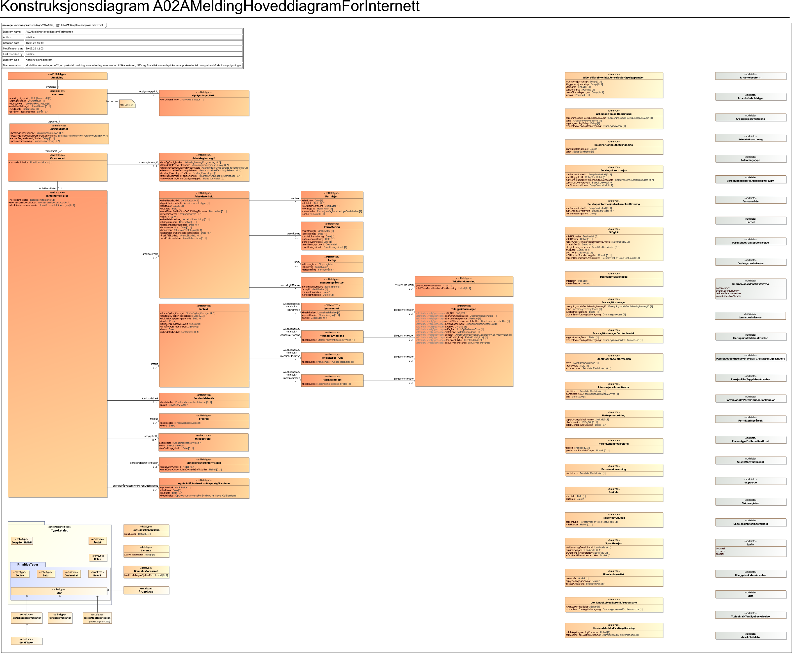

<Summary>Tjeneste for innrapportering av A-melding ved filopplasting</Summary>

<Tabs underline={true}>
<TabItem headerText="Om tjenesten" itemKey="itemKey-1" default>

## Status Filopplasting
| Miljø        | Status             |
|--------------|--------------------|
| Ekstern test | :white_check_mark: |
| Produksjon   | TBA                |

## Om

For generell informasjon om tjenestene se egne sider om:

* [Bruk av API-er for innrapportering](../om/bruk_innrapportering.md)
* [Sikkerhetsmekanismer](../om/sikkerhet.md)
* [Systembruker](../om/systembruker.md)
* [Feilhåndtering](../om/feil.md)
* [Versjonering](../om/versjoner.md)
* [Teknisk spesifikasjon](../om/tekniskspesifikasjon.md)

## Bruk av API-et
Dette API-et er ment for selskaper som skal rapportere A-meldingen, som har innsendinger større enn 10MB og 
som ikke kan dele opp innsendingene.

## Scope

Følgende scope skal benyttes ved autentisering i Maskinporten: `skatteetaten:innrapporteringamelding`

Dette scopet kan også brukes for [maskin-til-maskin mottaks-apiet](innrapportering-amelding.md) 
og for tilbakemeldingen som skal hentes fra eget API, se [SwaggerHub tilbakemelding](https://app.swaggerhub.com/apis/skatteetaten/amelding-tilbakemelding-api/)


## Systemtilgang med systembruker

Steg for steg: [Slik kobler du deg opp til våre reetablerte tjenester](https://www.skatteetaten.no/samarbeidspartnere/reetablering-altinn/systemleverandor/oppkobling/)

Dette APIet krever at systemet og dets systembrukere har tilgang til én eller flere av følgende tilgangspakker:

```json
"accessPackages": [
    {
        "urn": "urn:altinn:accesspackage:regnskapsforer-med-signeringsrettighet"
    },
    {
        "urn": "urn:altinn:accesspackage:regnskapsforer-uten-signeringsrettighet"
    },
    {
        "urn": "urn:altinn:accesspackage:ansvarlig-revisor"
    },
    {
        "urn": "urn:altinn:accesspackage:revisormedarbeider"
    },
    {
        "urn": "urn:altinn:accesspackage:regnskapsforer-lonn"
    },
    {
        "urn": "urn:altinn:accesspackage:a-ordning"
    }
]
```


Ved bruk av standard systembruker kan man også benytte enkeltrettigheter for tilgang til tjenesten:
```JSON
"Rights": [
    {
      "Resource": [
        {
          "value": "ske-innrapportering-amelding",
          "id": "urn:altinn:resource"
        }
      ]
    }
  ]
```

## Teknisk spesifikasjon

URL-er til API-et, beskrivelse av parametre, endepunkter og respons ligger i Open API-spesifikasjonen på
[SwaggerHub](https://app.swaggerhub.com/apis/skatteetaten/innrapportering-amelding-filopplasting-api/)

Nødvendige åpninger i en evt. brannmur er beskrevet [her](../om/sikkerhet.md)

API-et for innrapportering av A-melding via filopplasting har fire endepunkter

* __POST /opplastinger__: Laster opp en fil til skatteetaten for kontroll
* __GET /opplastinger/:id__: Henter status for en enkelt opplastet fil
* __DELETE /opplastinger/:id__: Sletter en opplastet fil
* __PUT /innsending__: Sender inn en opplastet og validert fil til behandling

Se [feilkoder](innrapportering--amelding-filopplasting?tab=Feilkoder) for relaterte feilmeldinger.

Se også [eksempler](innrapportering-amelding-filopplasting?tab=Eksempler) for de ulike endepunktene.

## Datakatalog

Dette API-et er pt. ikke dokumentert i Felles datakatalog.

</TabItem>
<TabItem headerText="Eksempler" itemKey="itemKey-2"> 

## Innsending
En innsending foregår over flere steg.
- Last opp en fil til `opplastinger`-endepunktet
- Poll `opplastinger`-endepunktet for å se om status til fila har blitt enten `VALIDERING_FEILET` eller `KLAR_TIL_INNSENDING`
- Hvis status er `KLAR_TIL_INNSENDING` kall `innsending`-endepunktet for å sende inn fila
- Hvis status er `VALIDERING_FEILET`, se feil i feilliste på status kallet for hva som feilet

### POST /opplastinger

#### Eksempel på body

```json
{
    "leveranse": {
        "kildesystem": "EDAG Testutvikling",
        "opplysningspliktig": {
            "norskIdentifikator": "211785462"
        },
        "meldingsId": "60656973-9df0-4e93-9e8e-9cf48d812be2",
        "oppgave": {
            "betalingsinformasjon": {
                "sumArbeidsgiveravgift": 34605,
                "sumFinansskattLoenn": 5289,
                "sumUtleggstrekk": 30532,
                "sumForskuddstrekkPerLoennsutbetalingsdato": [
                    {
                        "loennsutbetalingsdato": "2026-01-20",
                        "beloep": 178485
                    }
                ]
            },
            "virksomhet": [
                {
                    "norskIdentifikator": "314768949",
                    "inntektsmottaker": [
                        {
                            "norskIdentifikator": "08842199736",
                            "arbeidsforhold": [
                                {
                                    "arbeidsforholdId": "ORDINAERT",
                                    "typeArbeidsforhold": "ordinaertArbeidsforhold",
                                    "startdato": "2026-01-31",
                                    "sluttdato": "2026-02-28",
                                    "antallTimerPerUkeSomEnFullStillingTilsvarer": "33.6",
                                    "yrke": "3411101",
                                    "arbeidstidsordning": "offshore336",
                                    "stillingsprosent": "74.0",
                                    "sisteLoennsendringsdato": "2012-04-01",
                                    "loennsansiennitet": "1995-05-01",
                                    "sisteDatoForStillingsprosentendring": "2023-04-01",
                                    "loennstrinn": "Ltr50",
                                    "aarsakTilSluttdato": "kontraktEngasjementEllerVikariatErUtloept",
                                    "formForAnsettelse": "midlertidig"
                                }
                            ],
                            "fradrag": [
                                {
                                    "beskrivelse": "fagforeningskontingentSvalbard",
                                    "beloep": "-456.0"
                                }
                            ],
                            "forskuddstrekk": [
                                {
                                    "beskrivelse": "ordinaert",
                                    "beloep": -17022
                                }
                            ],
                            "inntekt": [
                                {
                                    "skatteOgAvgiftsregel": "svalbard",
                                    "fordel": "kontantytelse",
                                    "utloeserArbeidsgiveravgift": true,
                                    "inngaarIGrunnlagForTrekk": true,
                                    "beloep": "23989.5",
                                    "loennsinntekt": {
                                        "beskrivelse": "fastloenn",
                                        "tilleggsinformasjon": {
                                            "inntjeningsforhold": "loennUtbetaltFraDenNorskeStatOpptjentIUtlandet"
                                        },
                                        "spesifikasjon": {
                                            "opptjeningsland": "US"
                                        }
                                    }
                                },
                                {
                                    "fordel": "naturalytelse",
                                    "utloeserArbeidsgiveravgift": false,
                                    "inngaarIGrunnlagForTrekk": true,
                                    "beloep": "1569.5",
                                    "pensjonEllerTrygd": {
                                        "beskrivelse": "avtalefestetPensjon",
                                        "tilleggsinformasjon": {
                                            "pensjon": {
                                                "pensjonsgrad": "50",
                                                "tidsrom": {
                                                    "startdato": "2023-04-01",
                                                    "sluttdato": "2023-04-30"
                                                }
                                            }
                                        }
                                    }
                                }
                            ],
                            "utleggstrekk": [
                                {
                                    "beskrivelse": "utleggstrekkSkatt",
                                    "beloep": -1998
                                }
                            ]
                        }
                    ],
                    "arbeidsgiveravgift": {
                        "loennOgGodtgjoerelse": [
                            {
                                "beregningskodeForArbeidsgiveravgift": "generelleNaeringer",
                                "sone": "1a",
                                "avgiftsgrunnlagBeloep": "245428.0",
                                "prosentsatsForAvgiftsberegning": "14.1"
                            }
                        ]
                    }
                }
            ],
            "pensjonsinnretning": [
                {
                    "identifikator": "899205291"
                }
            ]
        },
        "leveringstidspunkt": "2026-01-23T14:50:35.920+00:00",
        "kalendermaaned": "2026-01",
        "spraakForTilbakemelding": "bokmaal"
    }
}

```

#### Eksempel på respons
```json
{
  "status": "LASTER_OPP",
  "id": "019c6663-aeb0-74ae-91e5-c1c64b6b2579",
  "feilliste": null,
  "sistOppdatertTidspunkt": null
}
```

### Status

#### Eksempel på respons
```json
[
  {
    "status": "KLAR_TIL_INNSENDING",
    "id": "019c6663-aeb0-74ae-91e5-c1c64b6b2579",
    "feilliste": null,
    "sistOppdatertTidspunkt": null
  }
]
```

### Send inn

#### Eksempel på respons

```json
{
  "dialogId": "0193b5cd-cb85-7320-bd8c-6c78c88dc8af",
  "forsendelseId": "0193b5cd-cbce-7dbd-b188-1437db673767",
  "meldingsId": "60656973-9df0-4e93-9e8e-9cf48d812be2"
}
```

### Slett

#### Eksempel på respons
200 OK uten mer data


</TabItem>
<TabItem headerText="Feilkoder" itemKey="itemKey-3">

Se egen side for generell info om [feilhåndtering i tjenestene](../om/feil.md).

Tabellen under viser en oversikt over hvilke spesifikke feilkoder denne tjenesten kan gi.

| Feilkode | HTTP Statuskode | Feilområde                                   |
|----------|-----------------|----------------------------------------------|
| AMLD_004 | 401             | Feil i forbindelse med autentisering         |
| AMLD_005 | 403             | Feil i forbindelse med autorisering          |
| AMLD_006 | 400             | Feil i request                               |
| AMLD_008 | 400             | Strukturell feil i tilknyttet dataformat     |
| AMLD_010 | 400             | Feil i forbindelse med validering av payload |
| AMLD_017 | 500             | Uspesifisert systemfeil                      |
| AMLD_021 | 404             | Finner ikke forespurt ressurs                |
| AMLD_022 | 405             | HTTP-metode ikke støttet                     |
| AMLD_023 | 500             | Uventet feil i et bakenforliggende system    |

Feilresponsene kan også inneholde en feilspesifiseringskode som presiserer feilen ytterligere.
Tabellen under viser hvilke feilspesifiseringskoder tjenesten kan gi.
Dersom det finnes mer detaljert feilinformasjon enn generelt feilområde vil det beskrives i melding, sti og
angitt verdi-feltene.

| Feilspesifiseringskode | Feilområde                                                          | Årsak                                                                                                                       |
|------------------------|---------------------------------------------------------------------|-----------------------------------------------------------------------------------------------------------------------------|
| AMLD_1008              | Ugyldig token                                                       | Feil i forbindelse ved validering av token                                                                                  |
| AMLD_1015              | Ikke autorisert for denne dialogen                                  | Feil i forbindelse ved autorisering.                                                                                        |
| AMLD_1022              | Feil i parametre                                                    | Diverse feil med parametre i request. Mer detaljert beskrivelse ligger i melding, sti og angitt verdi dersom det er aktuelt |
| AMLD_1023              | Finner ingen ressurs for denne URL-en                               | Det er ikke noe innhold tilgjengelig på denne URL-en                                                                        |
| AMLD_1028              | Header mangler                                                      | Påkrevd header er ikke med i requesten                                                                                      |
| AMLD_1030              | Accept-header må være av type application/json                      | Accept header er feil. API-et har kun støtte for JSON i respons                                                             |
| AMLD_1032              | Feil i JSON-innhold                                                 | Feil med innsendt innhold, det er enten uleselig, eller feiler i validering.                                                |
| AMLD_1047              | Content-type-header må være av type application/json                | Content-type header er feil. API-et har kun støtte for JSON                                                                 |
| AMLD_1063              | Tokenet mangler informasjon om systembruker i authorization_details | Tokenet er ikke et gyldig systembruker token                                                                                |

</TabItem>

<TabItem headerText="Informasjonsmodell" itemKey="itemKey-4">

Informasjonsmodell kan også lastes ned i [PDF-format](../../static/download/a-melding/Informasjonsmodell_A-meldingen_V2_3.pdf)



                                                                                                                                                                                                                                                         |
</TabItem>

<TabItem headerText="Test" itemKey="itemKey-5">

### Testmiljøer

For spesifikke URL-er til testmiljø hos Skatteetaten, se [SwaggerHub](https://app.swaggerhub.com/apis/skatteetaten/innrapportering-amelding-filopplasting-api/).

Digdir benytter TT02 som testmiljø, hvor følgende tilbys:
* DialogPorten
* Autentisering - Maskinporten
* Altinn innboks

Konsumenter må ha egne testmiljøer som kan kobles mot testmiljøer hos Skatteetaten og Digdir.

### Tenor testdatasøk

Det finnes pt. ikke søk i [Tenor](https://github.com/Skatteetaten/api-dokumentasjon/blob/main/docs/test/tenor.md) for
denne tjenesten. Men egenskaper ved enhetene som har testdata kan søkes frem i Tenor.

### Testdata

Det skal utelukkende benyttes syntetiske testdata ved test av tjenesten. Tenor testdatasøk tilbyr dette.
Det er ikke tillatt å bruke/sende skarpe data i test pga krav fra GDPR-regelverket.

Det finnes foreløpig ingen testdata for denne tjenesten. Denne siden oppdateres fortløpende ettersom testdata blir
tilgjengelig.

</TabItem>
<TabItem headerText="Kontakt oss" itemKey="itemKey-6">

Trenger du faglig eller teknisk brukerstøtte knyttet til integrasjon mot innrapportering av A-meldingen kan du kontakte 
oss via [Brukerstøttetjenesten](https://eksternjira.sits.no/servicedesk/customer/user/login?destination=plugins/servlet/desk/site/global) 
eller på [Slack](https://skatteetaten.slack.com/)

</TabItem>
</Tabs>
