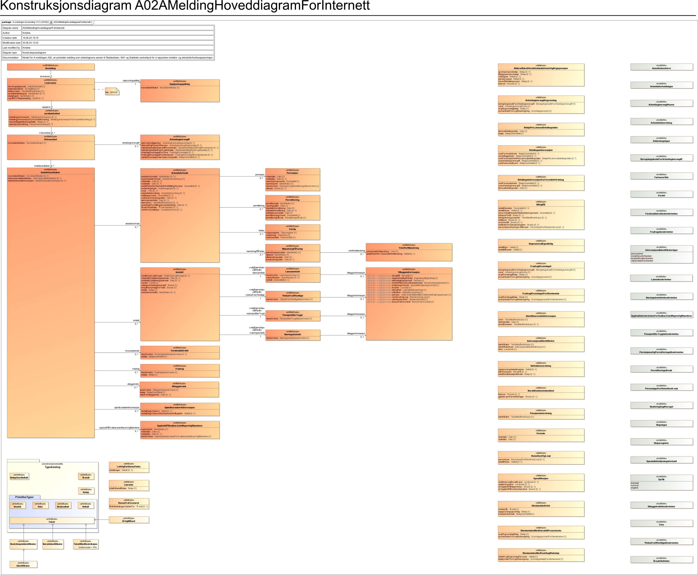

<Summary>Tjeneste for innrapportering av A-meldingen (tidligere A02).</Summary>

<Tabs underline={true}>
<TabItem headerText="Om tjenesten" itemKey="itemKey-1" default>

For generell informasjon om tjenestene se egne sider om:

* [Sikkerhetsmekanismer](../om/sikkerhet.md)
* [Systembruker](../om/systembruker.md)
* [Feilhåndtering](../om/feil.md)
* [Versjonering](../om/versjoner.md)
* [Teknisk spesifikasjon](../om/tekniskspesifikasjon.md)

## Scope

Følgende scope skal benyttes ved autentisering i Maskinporten: `skatteetaten:innrapporteringamelding`.
Dette scopet skal også brukes for tilbakemeldingen som skal hentes fra eget API, se [SwaggerHub](https://app.swaggerhub.com/apis/skatteetaten/amelding-tilbakemelding-api/)
 

## Delegering

Tilgang til dette API-et kan delegeres i Altinn, f.eks. dersom leverandør benyttes for den tekniske oppkoblingen. 

## Systemtilgang med systembruker

Steg for steg: [Slik kobler du deg opp til våre reetablerte tjenester](https://www.skatteetaten.no/samarbeidspartnere/reetablering-altinn/systemleverandor/oppkobling/)

Dette APIet krever at systemet og dets systembrukere har tilgang til én eller flere av følgende tilgangspakker:

```json
"accessPackages": [
    {
        "urn": "urn:altinn:accesspackage:regnskapsforer-med-signeringsrettighet"
    },
    {
        "urn": "urn:altinn:accesspackage:regnskapsforer-uten-signeringsrettighet"
    },
    {
        "urn": "urn:altinn:accesspackage:ansvarlig-revisor"
    },
    {
        "urn": "urn:altinn:accesspackage:revisormedarbeider"
    },
    {
        "urn": "urn:altinn:accesspackage:regnskapsforer-lonn"
    },
    {
        "urn": "urn:altinn:accesspackage:a-ordning"
    }
]
```


Ved bruk av standard systembruker kan man også benytte enkeltrettigheter for tilgang til tjenesten:
```JSON
"Rights": [
    {
      "Resource": [
        {
          "value": "ske-innrapportering-amelding",
          "id": "urn:altinn:resource"
        }
      ]
    }
  ]
```


## Teknisk spesifikasjon

URL-er til innrapprterings API-et, beskrivelsen av parameterne, endepunkter og respons ligger i Open API spesifikasjonen på
[SwaggerHub](https://app.swaggerhub.com/apis/skatteetaten/innrapportering-amelding-api)

Tilsvarende for tilbakemeldingen ligger i Open API spesifikasjonen på
[SwaggerHub](https://app.swaggerhub.com/apis/skatteetaten/amelding-tilbakemelding-api/) 

**VIKTIG!!** For å hente tilbakemeldingen må man lytte på hendelser hos Dialogporten. Dette er beskrevet hos Digdir: [Hvordan hente meldinger gjennom Dialogporten](https://samarbeid.digdir.no/altinn/hvordan-hente-meldinger-gjennom-dialogporten/2869)

**15.des-25: Både innsending og tilbakemelding er tilgjengelig i test.**


Nødvendige åpninger i en evt. brannmur er beskrevet [her](../om/sikkerhet.md)

### Parameter: idempotencyKey

idempotencyKey parameteren er påkrevet. Innholdet skal være en unik UUID. Hvert nye kall til API-et skal ha en
tilsvarende ny idempotencyKey. Flere etterfølgende POST kall med samme request-body og samme idempotencyKey vil gi den
samme responsen. Kun det første av denne rekken med like API kall vil behandles. IdempotencyKey muliggjør at man trygt
kan prøve innsendinger på nytt der man av ulike årsaker ikke har fått en tilbakemelding fra API-et.

## Datakatalog

Dette API-et er pt. ikke dokumentert i Felles datakatalog.

</TabItem>
<TabItem headerText="Eksempler" itemKey="itemKey-2"> 

## Innsending
Dokumentasjon finner du på [SwaggerHub](https://app.swaggerhub.com/apis/skatteetaten/innrapportering-amelding-api/)

## Tilbakemelding
Dokumentasjon finner du på [SwaggerHub](https://app.swaggerhub.com/apis/skatteetaten/amelding-tilbakemelding-api/)
Benytt samme scope som for innsending ved autentisering i Maskinporten: `skatteetaten:innrapporteringamelding`.

**VIKTIG!!** For å hente tilbakemeldingen må man lytte på hendelser hos Dialogporten. Dette er beskrevet hos Digdir: [Hvordan hente meldinger gjennom Dialogporten](https://samarbeid.digdir.no/altinn/hvordan-hente-meldinger-gjennom-dialogporten/2869)

**Oppdatert 10.des:** 
Vi har gjort et par justeringer i OpenApi-spesifikasjonen for amelding-tilbakemelding-api for å samstemme den med tilbakemelding-XSD-en.

Endringene er:
-	Arbeidsforhold: feltet fartoeyMoenstring har endret navn til moenstringPaaFartoey
-	InternasjonalIdentifikator.identifikatortype: typen InternasjonalIdentifikatortype er endret fra enum til string

Ny versjon, 0.0.4 er tilgjengelig på på [SwaggerHub](https://app.swaggerhub.com/apis/skatteetaten/amelding-tilbakemelding-api/).


**15.des-25: Også tilbakemeldingen er tilgjengelig i test.**


</TabItem>
<TabItem headerText="Feilkoder" itemKey="itemKey-3">

Tabellen under viser en oversikt over hvilke spesifikke feilkoder denne applikasjonen kan gi.

| Feilkode | HTTP Statuskode | Feilområde                                   |
|----------|-----------------|----------------------------------------------|
| AMLD_001  | 500             | Uventet feil på tjenesten                    |
| AMLD_004  | 401             | Feil i forbindelse med autentisering         |
| AMLD_005  | 403             | Feil i forbindelse med autorisering          |
| AMLD_006  | 400             | Feil i request                               |
| AMLD_008  | 400             | Strukturell feil i tilknyttet dataformat     |
| AMLD_010  | 400             | Feil i forbindelse med validering av payload |
| AMLD_011  | 400             | Feil i metadata                              |
| AMLD_017  | 500             | Uspesifisert systemfeil                      |
| AMLD_019  | 409             | Idempotensnøkkel er benyttet tidligere       |
| AMLD_021  | 404             | Finner ikke forespurt ressurs                |
| AMLD_022  | 405             | HTTP-metode ikke støttet                     |
| AMLD_023  | 500             | Uventet feil i et bakenforliggende system    |

Feilresponsene kan også inneholde en feilspesifiseringskode som presiserer feilen ytterligere.
Tabellen under viser hvilke feilspesifiseringskoder applikasjonen kan gi.
Dersom det finnes mer detaljert feilinformasjon enn generelt feilområde vil det beskrives i melding, sti og angitt verdi
feltene.

| Feilspesifiseringskode | Feilområde                                     | Årsak                                                                                                                       |
|------------------------|------------------------------------------------|-----------------------------------------------------------------------------------------------------------------------------|
| AMLD_1008               | Ugyldig token                                  | Ugyldig token                                                                                                               | 
| AMLD_1015               | Ikke autorisert for denne dialogen             | Ikke autorisert for denne dialogen                                                                                          | 
| AMLD_1022               | Feil i parametre                               | Diverse feil med parametre i request. Mer detaljert beskrivelse ligger i melding, sti og angitt verdi dersom det er aktuelt |
| AMLD_1023               | Finner ingen ressurs for denne urlen           | Det er ikke noe innhold tilgjengelig på denne URLen                                                                         |
| AMLD_1027               | Inntektsår er ikke støttet                     | Det er ikke tillatt å levere på oppgitt inntektsår                                                                          |
| AMLD_1028               | Header mangler                                 | Påkrevd header er ikke med i requesten                                                                                      |
| AMLD_1030               | Accept-header må være av type application/json | Accept header er feil. APIet har kun støtte for json i response                                                             |
| AMLD_1032               | Feil i json-innhold                            | Feil i json-innhold                                                                                                         |
| AMLD_1047               | Content type må være application/json          | Content-type header er feil. APIet har kun støtte for json i request body                                                   |
| AMLD_1050               | Finner ikke et dokument med denne IDen på denne forsendelsen | Finner ikke et dokument med denne IDen på denne forsendelsen                                                  |
| AMLD_1051               | Opplysningspliktig i path og i innsending er ulike | Opplysningspliktig i path og i innsending er ulike                                                                      |
| AMLD_1052               | Periode (kalendermåned) i path og i innsending er ulike | Periode (kalendermåned) i path og i innsending er ulike                                                            |
| AMLD_1053               | Uventet feil i et bakenforliggende system, vennligst prøv igjen senere | Uventet feil i et bakenforliggende system, vennligst prøv igjen senere                              |
| AMLD_1061               | Det finnes ingen forsendelse med denne IDen for denne ordningen | Det finnes ingen forsendelse med denne IDen for denne ordningen                                            |
| AMLD_1062               | Oppgavegiver er ikke hovedenhet, og kan derfor ikke rapportere for ordningen | Oppgavegiver er ikke hovedenhet, og kan derfor ikke rapportere for ordningen                  |
| AMLD_1063               | Tokenet mangler informasjon om systembruker i authorization_details | Tokenet mangler informasjon om systembruker i authorization_details                                    |

</TabItem>
<TabItem headerText="Informasjonsmodell" itemKey="itemKey-4">

Informasjonsmodell kan også lastes ned i [PDF-format](../../static/download/a-melding/Informasjonsmodell_A-meldingen_V2_3.pdf)



                                                                                                                                                                                                                                                         |
</TabItem>
<TabItem headerText="Test" itemKey="itemKey-5">

I første omgang er test kun tilgjengelig for et utvalg leverandører som det er inngått avtale med og som skal være med å pilotere løsningene.

### Testmiljøer

For spesifikke URL'er til testmiljø hos Skatteetaten, se [SwaggerHub](https://app.swaggerhub.com/apis/skatteetaten/innrapportering-amelding-api)

Digdir benytter TT02 som testmiljø, hvor følgende tilbys:
* Dialogporten
* Autentisering med Maskinporten
* Autorisering med Systembruker
* Altinn innboks

Konsumenter må ha egne testmiljøer som kan kobles mot testmiljøer hos Skatteetaten og Digdir.

### Tenor testdatasøk

[Testdata] (https://www.skatteetaten.no/testdata/)

### Testdata

Det skal utelukkende benyttes syntetiske testdata ved test av tjenesten. Tenor testdatasøk tilbyr dette. Det er ikke tillatt å bruke/sende skarpe data i test pga krav fra GDPR-regelverket.

</TabItem>
<TabItem headerText="Kontakt oss" itemKey="itemKey-6">
  
Trenger du faglig eller teknisk brukerstøtte knyttet til integrasjon mot a-meldingen kan du kontakte oss via [Brukerstøttetjenesten](https://eksternjira.sits.no/servicedesk/customer/user/login?destination=plugins/servlet/desk/site/global) 

Lenke til å sette opp tilgang til brukerstøttetjenesten og bestille tilgang til ny tjeneste/scope finner dere på denne siden (under «trenger du hjelp»):  [A-meldingen - for sluttbrukersystemer - Skatteetaten](https://www.skatteetaten.no/samarbeidspartnere/sluttbrukersystemer/a-meldingen-sbs/)
  
</TabItem>

</Tabs>
