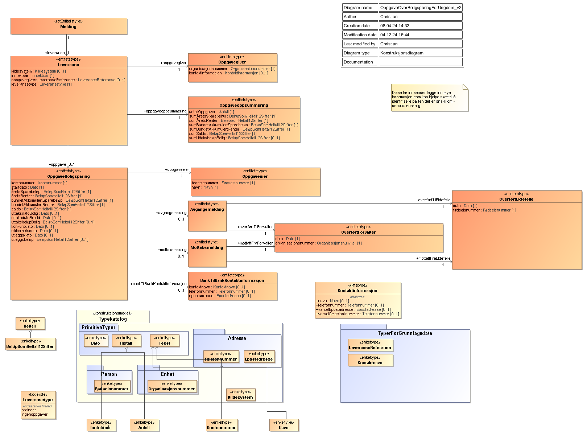

<Summary>Tjeneste for innrapportering av tredjepartsopplysninger for Boligsparing for ungdom (RF-1360)</Summary>

<Tabs underline={true}>
<TabItem headerText="Om tjenesten" itemKey="itemKey-1" default>

For generell informasjon om tjenestene se egne sider om:

* [Bruk av tjenestene](../om/bruk.md)
* [Sikkerhetsmekansimer](../om/sikkerhet.md)
* [Systembruker](../om/systembruker.md)
* [Feilhåndtering](../om/feil.md)
* [Versjonering](../om/versjoner.md)
* [Teknisk spesifikasjon](../om/tekniskspesifikasjon.md)

## Scope

Følgende scope skal benyttes ved autentisering i Maskinporten: `skatteetaten:innrapporteringboligsparingungdom`

## Delegering

Tilgang til dette API-et kan delegeres i Altinn, f.eks. dersom leverandør benyttes for den tekniske oppkoblingen.

## Systemtilgang med systembruker

Bruk av API-et krever systemtilgang med systembruker, som er ny funksjonalitet i Maskinporten levert av Digdir. 
Informasjon vedr. dette finnes [her](../om/systembruker.md). 

For å kunne benytte dette api'et med systemtilgang må man gi følgende rettighet til systemet ved opprettelse i systemregisteret:
```JSON
"Rights": [
    {
      "Resource": [
        {
          "value": "ske-innrapportering-boligsparing-ungdom",
          "id": "urn:altinn:resource"
        }
      ]
    }
  ]
```

## Teknisk spesifikasjon

URL-er til API-et, beskrivelsen av parameterne, endepunkter og respons ligger i Open API spesifikasjonen på
[SwaggerHub](https://app.swaggerhub.com/apis/skatteetaten/innrapportering-bsu-api/0.0.1)

Nødvendige åpninger i en evt. brannmur er beskrevet [her](../om/sikkerhet.md)

API-et for innrapportering av BSU har to endepunkter

* __POST innsending__: Mottar tredjepartsopplysninger for BSU. Ett kall mot API-et er en rapportering for en
  person gitt av en oppgavegiver og som gjelder et inntektsår.
* __GET uthenting_dokument__: Henter ut ett spesifikt dokument knyttet til en transmission i dialogporten

API-et validerer mottatte data mot JSON schema beskrevet på SwaggerHub. Se [feilkoder](innrapportering-bsu?tab=Feilkoder) for
relaterte feilmeldinger.

Se også [eksempler](innrapportering-bsu?tab=Eksempler) for de ulike endepunktene.

### Parameter: idempotencyKey

idempotencyKey parameteren er påkrevet. Innholdet skal være en unik UUID. Hvert nye kall til API-et skal ha en
tilsvarende ny idempotencyKey. Flere etterfølgende POST kall med samme request-body og samme idempotencyKey vil gi den
samme responsen. Kun det første av denne rekken med like API kall vil behandles. IdempotencyKey muliggjør at man trygt
kan prøve innsendinger på nytt der man av ulike årsaker ikke har fått en tilbakemelding fra API-et.

## Datakatalog

Dette API-et er pt. ikke dokumentert i Felles datakatalog.

</TabItem>
<TabItem headerText="Eksempler" itemKey="itemKey-2"> 

## Innsending

### Eksempel på request URL

```
https://innrapporteringbsu.api.{env}.no/v1/{inntektsaar}
```

### JSON

#### Eksempel på innsending

```
{
  "leveranse": {
    "inntektsaar": 2023,
    "leveransetype": "ordinaer",
    "oppgavegiver": {
      "organisasjonsnummer": "987654321",
      "kontaktinformasjon": {
        "navn": "Kari Kontakt",
        "telefonnummer": "80080000",
        "varselEpostadresse": "kontakt@boligsparebanken.no",
        "varselSmsMobilnummer": "43999123"
      }
    },
    "oppgaveoppsummering": {
      "antallOppgaver": 5,
      "sumAaretsSparebeloep": 20500,
      "sumAaretsRenter": 9790,
      "sumBundetAkkumulertSparebeloep": 344500,
      "sumBundetAkkumulertRenter": 39800,
      "sumSaldo": 124500,
      "sumUttaksbeloepBolig": 118500
    },
    "kildesystem": "Kildesystemet v2.0.5",
    "oppgavegiversLeveranseReferanse": "EksternReferanse_2015_1",
    "oppgave": [
      {
        "kontonummer": "42004200420",
        "startdato": "2015-03-19",
        "aaretsSparebeloep": 20000,
        "aaretsRenter": 2500,
        "bundetAkkumulertSparebeloep": 20000,
        "bundetAkkumulertRenter": 2500,
        "saldo": 22500,
        "oppgaveeier": {
          "foedselsnummer": "01010123456",
          "navn": "Sindre Boligsparer"
        },
        "bankTilBankKontaktinformasjon": {
          "kontaktnavn": "Kari Bankkontakt",
          "epostadresse": "kari.bankkontakt@boligsparebanken.no"
        }
      },
      {
        "kontonummer": "420045454545",
        "startdato": "2010-10-04",
        "aaretsSparebeloep": 0,
        "aaretsRenter": 3400,
        "bundetAkkumulertSparebeloep": 84000,
        "bundetAkkumulertRenter": 15200,
        "saldo": 0,
        "oppgaveeier": {
          "foedselsnummer": "02020123456",
          "navn": "Kari Sparedame"
        },
        "avgangsmelding": {
          "overfoertTilForvalter": {
            "dato": "2015-05-07",
            "organisasjonsnummer": "888888888"
          }
        }
      },
      {
        "kontonummer": "82004200421",
        "startdato": "2013-03-01",
        "aaretsSparebeloep": 500,
        "aaretsRenter": 1300,
        "bundetAkkumulertSparebeloep": 50500,
        "bundetAkkumulertRenter": 3500,
        "saldo": 54000,
        "oppgaveeier": {
          "foedselsnummer": "31059500012",
          "navn": "Ida Sparejente"
        },
        "mottaksmelding": {
          "mottattFraForvalter": {
            "dato": "2015-11-20",
            "organisasjonsnummer": "777777777"
          }
        }
      },
      {
        "kontonummer": "32004205420",
        "startdato": "2009-01-06",
        "aaretsSparebeloep": 0,
        "aaretsRenter": 2340,
        "bundetAkkumulertSparebeloep": 150000,
        "bundetAkkumulertRenter": 16050,
        "saldo": 48000,
        "oppgaveeier": {
          "foedselsnummer": "01028700045",
          "navn": "Hanne Boligkjøper"
        },
        "uttaksdatoBolig": "2015-12-15",
        "uttaksbeloepBolig": 118050,
        "mottaksmelding": {
          "mottattFraForvalter": {
            "dato": "2015-04-05",
            "organisasjonsnummer": "123456789"
          }
        }
      },
      {
        "kontonummer": "60004230420",
        "startdato": "2008-11-03",
        "aaretsSparebeloep": 0,
        "aaretsRenter": 250,
        "bundetAkkumulertSparebeloep": 40000,
        "bundetAkkumulertRenter": 2550,
        "saldo": 0,
        "oppgaveeier": {
          "foedselsnummer": "23059800023",
          "navn": "Johan Boligkontobryter"
        },
        "uttaksdatoBrudd": "2015-05-29"
      }
    ]
  }
}


```

#### Eksempel på respons

```
{
    "dialogId": "0193b5cd-cb85-7320-bd8c-6c78c88dc8af",
    "forsendelseId": "0193b5cd-cbce-7dbd-b188-1437db673767",
    "oppgavegiversLeveranseReferanse": "EksternReferanse_2013_1",
    "antallOppgaver": 2
}
```

</TabItem>
<TabItem headerText="Feilkoder" itemKey="itemKey-3">

Se egen side for generell info om [feilhåndtering i tjenestene](../om/feil.md).

Tabellen under viser en oversikt over hvilke spesifikke feilkoder denne applikasjonen kan gi.

| Feilkode | HTTP Statuskode | Feilområde                                   |
|----------|-----------------|----------------------------------------------|
| GLD_001  | 500             | Uventet feil på tjenesten                    |
| GLD_004  | 401             | feil i forbindelse med autentisesring        |
| GLD_005  | 403             | Feil i forbindelse med autorisering          |
| GLD_006  | 400             | Feil i request                               |
| GLD_008  | 400             | Strukturell feil i tilknyttet dataformat     |
| GLD_010  | 400             | Feil i forbindelse med validering av payload |
| GLD_011  | 400             | Feil i metadata                              |
| GLD_017  | 500             | Uspesifisert systemfeil                      |
| GLD_019  | 409             | Idempotensnøkkel er benyttet tidligere       |
| GLD_021  | 404             | Finner ikke forespurt ressurs                |
| GLD_022  | 405             | HTTP-metode ikke støttet                     |
| GLD_023  | 500             | Uventet feil i et bakenforliggende system    |

Feilresponsene kan også inneholde en feilspesifiseringskode som presiserer feilen ytterligere.
Tabellen under viser hvilke feilspesifiseringskoder applikasjonen kan gi.
Dersom det finnes mer detaljert feilinformasjon enn generelt feilområde vil det beskrives i melding, sti og angitt verdi
feltene.

| Feilspesifiseringskode | Feilområde                                                             | Årsak                                                                                                                       |
|------------------------|------------------------------------------------------------------------|-----------------------------------------------------------------------------------------------------------------------------|
| GLD_1007               | Mangler Token                                                          | Det er ikke lagt ved noen authorization header med token på request                                                         |
| GLD_1008               | Ugyldig token                                                          | Token oppgitt i authorization header er ugyldig                                                                             |
| GLD_1015               | Ikke autorisert for å levere på denne dialogen                         | Organisasjonen som leverer har ikke rettighet til å levere for denne oppgavegiveren                                         |
| GLD_1022               | Feil i parametre                                                       | Diverse feil med parametre i request. Mer detaljert beskrivelse ligger i melding, sti og angitt verdi dersom det er aktuelt |
| GLD_1023               | Finner ingen ressurs for denne urlen                                   | Det er ikke noe innhold tilgjengelig på denne URLen                                                                         |
| GLD_1027               | Inntektsår er ikke støttet                                             | Det er ikke tillatt å levere på oppgitt inntektsår                                                                          |
| GLD_1028               | Header mangler                                                         | Påkrevd header er ikke med i requesten                                                                                      |
| GLD_1030               | Accept-header må være av type application/json                         | Accept header er feil. APIet har kun støtte for json i response                                                             |
| GLD_1047               | Content type må være application/json                                  | Content-type header er feil. APIet har kun støtte for json i request body                                                   |
| GLD_1050               | Finner ikke et dokument med denne IDen på denne forsendelsen           | Det finnes ikke noe dokument med gitt id på angitt forsendelse                                                              |
| GLD_1052               | Inntektsår i path og i innsending er ulike                             | Inntektsår i innsending i JSON body og inntektsår i path må være like                                                       |
| GLD_1053               | Uventet feil i et bakenforliggende system, vennligst prøv igjen senere |                                                                                                                             |
| GLD_1061               | Det finnes ingen forsendelse med denne IDen for denne ordningen        |                                                                                                                             |

</TabItem>
<TabItem headerText="Informasjonsmodell" itemKey="itemKey-4">



| Eier                          | Element                         | Dokumentasjon                                                                                                                                   |
|-------------------------------|---------------------------------|-------------------------------------------------------------------------------------------------------------------------------------------------|
| Avgangsmelding                | overfoertTilEktefelle           | Enten overfoertTilEktefelle, eller overfoertTilForvalter                                                                                        |
| Avgangsmelding                | overfoertTilForvalter           | Enten overfoertTilEktefelle, eller overfoertTilForvalter                                                                                        |
| BankTilBankKontaktinformasjon | kontaktnavn                     | Navn på kontaktperson for kontoen                                                                                                               |
| BankTilBankKontaktinformasjon | telefonnummer                   | Telefonnumemr til kontaktperson for kontoen                                                                                                     |
| BankTilBankKontaktinformasjon | epostadresse                    | Epostadresse til kontaktperson for kontoen                                                                                                      |
| Leveranse                     | inntektsaar                     | Inntektsåret leveransen gjelder                                                                                                                 |
| Leveranse                     | kildesystem                     | System brukt for å levere oppgaven                                                                                                              |
| Leveranse                     | leveransetype                   | Type av leveranse som angir om leveransen inneholder ordinære oppgaver eller om oppgavegiver angir at det ikke er noen oppgaver å innrapportere |
| Leveranse                     | oppgave                         | Oppgave som leveres                                                                                                                             |
| Leveranse                     | oppgavegiver                    | Tredjepart som rapporterer opplysning til Skatteetaten                                                                                          |
| Leveranse                     | oppgavegiversLeveranseReferanse | Frivillig referanse på innsendingen til bruk mot egne interne systemer og evt. support mot skattetaten                                          |
| Leveranse                     | oppgaveoppsummering             | Oppsummering med totalsummer for innleverte oppgaver                                                                                            |
| Melding                       | leveranse                       | Selve leveransen. Merk at det kun er tillatt med en leveranse pr Melding                                                                        |
| Mottaksmelding                | mottattFraForvalter             | Enten mottattFraForvalter, eller mottattFraEktefelle                                                                                            |
| Mottaksmelding                | mottattFraEktefelle             | Enten mottattFraForvalter, eller mottattFraEktefelle                                                                                            |
| OppgaveBoligsparing           | kontonummer                     | Kontonummer for BSU kontoen                                                                                                                     |
| OppgaveBoligsparing           | startdato                       | Startdato for BSU kontoen                                                                                                                       |
| OppgaveBoligsparing           | aaretsSparebeloep               | Beløp spart for dette inntektsåret                                                                                                              |
| OppgaveBoligsparing           | aaretsRenter                    | Renter påløpt for inntektsåret                                                                                                                  |
| OppgaveBoligsparing           | bundetAkkumulertSparebeloep     | Samlet innbetalt sparebeløp på BSU konto                                                                                                        |
| OppgaveBoligsparing           | bundetAkkumulertRenter          | Samlet akkumelerte renter på BSU konto                                                                                                          |
| OppgaveBoligsparing           | saldo                           | Saldo på en BSU-konto utgjør samlet sparebeløp inklusivt totalt påløpte renter                                                                  |
| OppgaveBoligsparing           | uttaksdatoBolig                 | Dato for uttak fra BSU konto                                                                                                                    |
| OppgaveBoligsparing           | uttaksdatoBrudd                 | dato for brudd på kontrakt om BSU                                                                                                               |
| OppgaveBoligsparing           | uttaksbeloepBolig               | Beløp for uttak fra BSU konto                                                                                                                   |
| OppgaveBoligsparing           | konkursdato                     | Dato for konkurs. Fylles ut ved dekning av krav ved konkurs                                                                                     |
| OppgaveBoligsparing           | sikkerhetsdato                  | Datoen kontoen ble stilt som sikkerhet                                                                                                          |
| OppgaveBoligsparing           | oppgaveeier                     | Person oppgaven gjelder for                                                                                                                     |
| OppgaveBoligsparing           | bankTilBankKontaktinformasjon   | Kontaktinformasjon for kontoen                                                                                                                  |
| OppgaveBoligsparing           | avgangsmelding                  | Melding for overføring til ektefelle ved skilsmisse/separasjon eller død, eller overføring til forvalter typisk ved bytte av bank               |
| OppgaveBoligsparing           | mottaksmelding                  | Melding for mottak fra ektefelle ved skilsmisse/separasjon eller død, eller overføring fra forvalter typisk ved bytte av bank                   |
| OppgaveBoligsparing           | utleggsdato                     | Dato for utlegg fra BSU konto                                                                                                                   |
| OppgaveBoligsparing           | utleggsbeloep                   | Beløp for utlegg fra BSU konto                                                                                                                  |
| Oppgaveeier                   | fødselsnummer                   | Oppgaveeiers fødselsnummer eller d-nummer                                                                                                       |
| Oppgaveeier                   | navn                            | Navn på oppgaveeier                                                                                                                             |
| Oppgavegiver                  | kontaktinformasjon              | Kontaktinformasjon for oppgavegiver                                                                                                             |
| Oppgavegiver                  | organisasjonsnummer             | Organisasjonsnummer på oppgavegiver                                                                                                             |
| Oppgaveoppsummering           | antallOppgaver                  | Totalt antall oppgaver i leveransens oppgaver                                                                                                   |
| Oppgaveoppsummering           | sumAaretsSparebeloep            | Sum av alle aaretsSparebeloep i oppgavene til en leveranse                                                                                      |
| Oppgaveoppsummering           | sumAaretsRenter                 | Sum av alle aaretsRenter i oppgavene til en leveranse                                                                                           |
| Oppgaveoppsummering           | sumBundetAkkumulertSparebeloep  | Sum av alle bundetAkkumulertSparebeloep i oppgavene til en leveranse                                                                            |
| Oppgaveoppsummering           | sumBundetAkkumulertRenter       | Sum av alle bundetAkkumulertRenter i oppgavene til en leveranse                                                                                 |
| Oppgaveoppsummering           | sumSaldo                        | Sum av alle saldo i oppgavene til en leveranse                                                                                                  |
| Oppgaveoppsummering           | sumUttaksbeloepBolig            | Sum av alle uttaksbeloepBolig i oppgavene til en leveranse                                                                                      |
</TabItem>

<TabItem headerText="Test" itemKey="itemKey-5">

I første omgang er test kun tilgjengelig for et utvalg leverandører som det er inngått avtale med og som skal være
med å pilotere løsningene.

### Testmiljøer

For spesifikke URL'er til testmiljø hos Skatteetaten, se [SwaggerHub](https://app.swaggerhub.com/apis/skatteetaten/innrapportering-bsu-api/0.0.1). 

Digdir benytter TT02 som testmiljø, hvor følgende tilbys: 
* DialogPorten
* Autentisering - Maskinporten
* Autorisering - systembruker
* Altinn innboks 

Konsumenter må ha egne testmiljøer som kan kobles mot testmiljøer hos Skatteetaten og Digdir. 

### Tenor testdatasøk

Det finnes pt. ikke søk i [Tenor](https://github.com/Skatteetaten/api-dokumentasjon/blob/main/docs/test/tenor.md) for 
denne tjenesten. Men egenskaper ved enhetene som har testdata kan søkes frem i Tenor.

### Testdata

Det skal utelukkende benyttes syntetiske testdata ved test av tjenesten. Tenor testdatasøk tilbyr dette.
Det er ikke tillatt å bruke/sende skarpe data i test pga krav fra GDPR-regelverket.

Det finnes foreløpig ingen testdata for denne tjenesten. Denne siden oppdateres fortløpende ettersom testdata blir
tilgjengelig.

</TabItem>
<TabItem headerText="Kontakt oss" itemKey="itemKey-6">
  
Har du spørsmål til Skatteetaten om BSU API, kan du sende oss e-post: [altinnreetablering\@skatteetaten.no](mailto:altinnreetablering@skatteetaten.no)  
Vær oppmerksom på at epostadressen er midlertidig og gjelder bare i perioden tjenestene er i utvikling og test fra Altinn II til Altinn 3.
  
</TabItem>
</Tabs>
