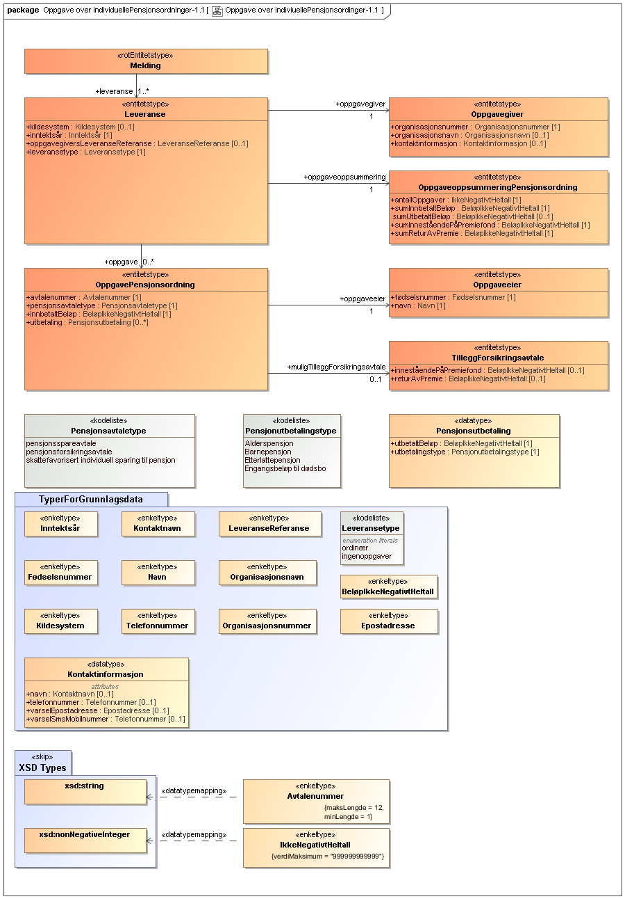
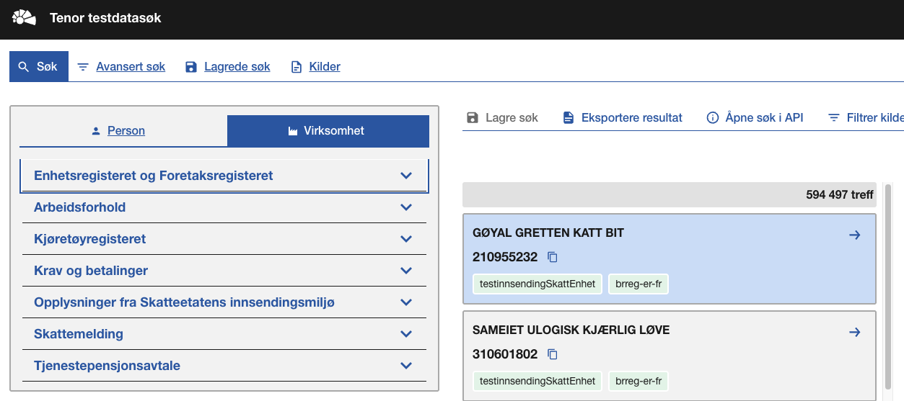
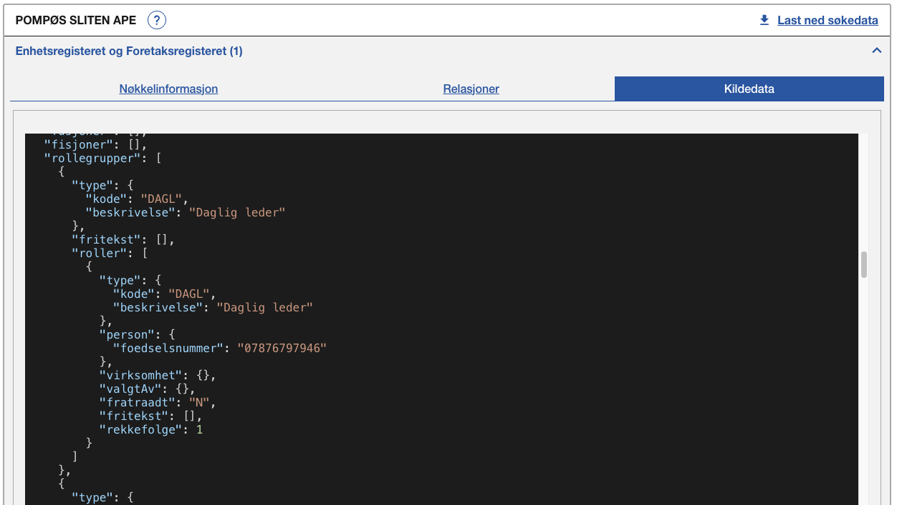

<Summary>Tjeneste for innrapportering av individuelle pensjonsordninger (RF-1301)</Summary>

<Tabs underline={true}>
<TabItem headerText="Om tjenesten" itemKey="itemKey-1" default>

For generell informasjon om tjenestene se egne sider om:

* [Sikkerhetsmekanismer](../om/sikkerhet.md)
* [Systembruker](../om/systembruker.md)
* [Feilhåndtering](../om/feil.md)
* [Versjonering](../om/versjoner.md)
* [Teknisk spesifikasjon](../om/tekniskspesifikasjon.md)

## Scope

Følgende scope skal benyttes ved autentisering i Maskinporten: `skatteetaten:innrapporteringindividuellepensjonsordninger`

Skatteetaten må gi tilgang til scope. Søk om dette [her](https://www.skatteetaten.no/samarbeidspartnere/sluttbrukersystemer/tredjepartsopplysninger-sbs/#bestill-tilgang-til-tjenesten-krever-innlogging).

## Delegering

Tilgang til dette API-et kan delegeres i Altinn, f.eks. dersom leverandør benyttes for den tekniske oppkoblingen.

## Systemtilgang med systembruker

Bruk av API-et krever systemtilgang med systembruker, som er ny funksjonalitet i Maskinporten levert av Digdir.
Informasjon vedr. dette finnes [her](../om/systembruker.md).

For systembruker for klientsystemer anbefaler vi å ikke kombinere tilgangspakker på tvers av fullmaktsområder, da det kan medføre at bruker ikke kan utføre [klientdelegering](https://docs.altinn.studio/nb/authorization/guides/end-user/system-user/delegate-clients/). Se fullmaktsområder [her](https://docs.altinn.studio/nb/authorization/what-do-you-get/accessgroups/accessgroups/)

Dette API-et krever at systemet og dets systembrukere har tilgang til én eller flere av følgende tilgangspakker:

```json
"accessPackages": [
    {
        "urn": "urn:altinn:accesspackage:regnskapsforer-med-signeringsrettighet"
    },
    {
        "urn": "urn:altinn:accesspackage:regnskapsforer-uten-signeringsrettighet"
    },
    {
        "urn": "urn:altinn:accesspackage:ansvarlig-revisor"
    },
    {
        "urn": "urn:altinn:accesspackage:revisormedarbeider"
    },
    {
        "urn": "urn:altinn:accesspackage:skattegrunnlag"
    }
]
```

Ved bruk av standard systembruker kan man også benytte enkeltrettighet for tilgang til tjenesten:

```json
"rights": [
    {
        "resource": [
            {
                "id": "urn:altinn:resource",
                "value": "ske-innrapportering-individuelle-pensjonsordninger"
            }
        ]
    }
]
```

## Teknisk spesifikasjon

URL-er til API-et, beskrivelse av parametere, endepunkter og respons ligger i Open API spesifikasjonen på
[SwaggerHub](https://app.swaggerhub.com/apis/skatteetaten/innrapportering-individuelle-pensjonsordninger-api/0.0.1)

Nødvendige åpninger i en evt. brannmur er beskrevet [her](../om/sikkerhet.md)

API-et for innrapportering av individuelle pensjonsordninger har to endepunkter

* __POST innsending__: Mottar tredjepartsopplysninger for individuelle pensjonsordninger. Et kall mot API-et er en rapportering for en organisasjon gitt av en oppgavegiver og som gjelder et inntektsår.
* __GET uthenting_dokument__: Henter ut et spesifikt dokument knyttet til en forsendelse i dialogporten

API-et validerer mottatte data mot JSON schema beskrevet på SwaggerHub. Se [feilkoder](innrapportering-individuellepensjonsordninger?tab=Feilkoder) for
relaterte feilmeldinger.

Se også [eksempler](innrapportering-individuellepensjonsordninger?tab=Eksempler) for de ulike endepunktene.

### Parameter: idempotencyKey

`idempotencyKey`-parameteren er påkrevet. Innholdet skal være en unik UUID. Hvert nye kall til API-et skal ha en
tilsvarende ny idempotencyKey. Flere etterfølgende POST kall med samme request-body og samme idempotencyKey vil gi den
samme responsen. Kun det første av denne rekken med like API kall vil behandles. IdempotencyKey muliggjør at man trygt
kan prøve innsendinger på nytt der man av ulike årsaker ikke har fått en tilbakemelding fra API-et.

## Datakatalog

Dette API-et er pt. ikke dokumentert i Felles datakatalog.

</TabItem>
<TabItem headerText="Eksempler" itemKey="itemKey-2"> 

## Innsending

### Eksempel på request URL

```
https://innrapporteringindividuellepensjonsordninger.api.{env}.no/v1/{inntektsaar}
```

### JSON

#### Eksempel på innsending

```json
{
  "leveranse": {
    "kildesystem": "SystemX",
    "inntektsaar": 2024,
    "oppgavegiversLeveranseReferanse": "REF123456",
    "leveransetype": "ordinaer",
    "oppgavegiver": {
      "organisasjonsnummer": "313613216",
      "kontaktinformasjon": {
        "navn": "Kontakt Navn",
        "telefonnummer": "12345678",
        "varselEpostadresse": "kontakt@eksempel.no",
        "varselSmsMobilnummer": "98765432"
      }
    },
    "oppgave": [
      {
        "avtalenummer": "AVT123",
        "pensjonsavtaletype": "pensjonsspareavtale",
        "innbetaltBeloep": 50000,
        "oppgaveeier": {
          "foedselsnummer": "12345678901",
          "navn": "Ola Nordmann"
        },
        "muligTilleggForsikringsavtale": {
          "innestaaendePaaPremiefond": 10000,
          "returAvPremie": 500
        },
        "utbetaling": [
          {
            "utbetaltBeloep": 20000,
            "utbetalingstype": "Alderspensjon"
          }
        ]
      }
    ],
    "oppgaveoppsummering": {
      "antallOppgaver": 1,
      "sumInnbetaltBeloep": 50000,
      "sumUtbetaltBeloep": 20000,
      "sumInnestaaendePaaPremiefond": 10000,
      "sumReturAvPremie": 500
    }
  }
}
```

#### Eksempel på respons

```json
{
    "dialogId": "0193b5cd-cb85-7320-bd8c-6c78c88dc8af",
    "forsendelseId": "0193b5cd-cbce-7dbd-b188-1437db673767",
    "oppgavegiversLeveranseReferanse": "EksternReferanse_2024_1",
    "antallOppgaver": 1
}
```

</TabItem>
<TabItem headerText="Feilkoder" itemKey="itemKey-3">

Se egen side for generell info om [feilhåndtering i tjenestene](../om/feil.md).

Tabellen under viser en oversikt over hvilke spesifikke feilkoder denne applikasjonen kan gi.

| Feilkode | HTTP Statuskode | Feilområde                                  |
|----------|-----------------|---------------------------------------------|
| GLD_001  | 500             | Uventet feil på tjenesten                   |
| GLD_004  | 401             | Feil i forbindelse med autentisering        |
| GLD_005  | 403             | Feil i forbindelse med autorisering         |
| GLD_006  | 400             | Feil i request                              |
| GLD_008  | 400             | Strukturell feil i tilknyttet dataformat    |
| GLD_010  | 400             | Feil i forbindelse med validering av payload|
| GLD_011  | 400             | Feil i metadata                             |
| GLD_017  | 500             | Uspesifisert systemfeil                     |
| GLD_019  | 409             | Idempotensnøkkel er benyttet tidligere      |
| GLD_021  | 404             | Finner ikke forespurt ressurs               |
| GLD_022  | 405             | HTTP-metode ikke støttet                    |
| GLD_023  | 500             | Uventet feil i et bakenforliggende system   |

Feilresponsene kan også inneholde en feilspesifiseringskode som presiserer feilen ytterligere.
Tabellen under viser hvilke feilspesifiseringskoder applikasjonen kan gi.
Dersom det finnes mer detaljert feilinformasjon enn generelt feilområde vil det beskrives i melding, sti og angitt verdi
feltene.

| Feilspesifiseringskode | Feilområde                                                                                  | Årsak                                                                                                                       |
|------------------------|---------------------------------------------------------------------------------------------|-----------------------------------------------------------------------------------------------------------------------------|
| GLD_1007               | Mangler Token                                                                               | Det er ikke lagt ved noen authorization header med token på request                                                         |
| GLD_1008               | Ugyldig token                                                                               | Token oppgitt i authorization header er ugyldig                                                                             |
| GLD_1015               | Ikke autorisert for å levere på denne dialogen                                              | Organisasjonen som leverer har ikke rettighet til å levere for denne oppgavegiveren                                         |
| GLD_1022               | Feil i parametre                                                                            | Diverse feil med parametre i request. Mer detaljert beskrivelse ligger i melding, sti og angitt verdi dersom det er aktuelt |
| GLD_1023               | Finner ingen ressurs for denne URL-en                                                       | Det er ikke noe innhold tilgjengelig på denne URL-en                                                                        |
| GLD_1027               | Inntektsår er ikke støttet                                                                  | Det er ikke tillatt å levere på oppgitt inntektsår                                                                          |
| GLD_1028               | Header mangler                                                                              | Påkrevd header er ikke med i requesten                                                                                      |
| GLD_1030               | Accept-header må være av type application/json                                              | Accept header er feil. API-et har kun støtte for JSON i respons                                                             |
| GLD_1050               | Finner ikke et dokument med denne IDen på denne forsendelsen                                | Det finnes ikke noe dokument med gitt id på angitt forsendelse                                                              |
| GLD_1052               | Inntektsår i path og i innsending er ulike                                                  | Inntektsår i innsending i JSON body og inntektsår i path må være like                                                       |
| GLD_1053               | Uventet feil i et bakenforliggende system, vennligst prøv igjen senere                      |                                                                                                                             |
| GLD_1054               | Det finnes ingen dialog for denne kombinasjonen av inntektsår, organisjonsnummer og ordning |                                                                                                                             |
</TabItem>

<TabItem headerText="Informasjonsmodell" itemKey="itemKey-4">


</TabItem>

<TabItem headerText="Test" itemKey="itemKey-5">

### Testmiljøer

For spesifikke URL'er til testmiljø hos Skatteetaten, se [SwaggerHub](https://app.swaggerhub.com/apis/skatteetaten/innrapportering-aandsverk-api/0.0.1).

Skatteetaten [innboks](https://skatt-test.sits.no/web/innboks/)

Altinn benytter TT02 som testmiljø, hvor følgende tilbys:
* Dialogporten - [Swagger](https://platform.tt02.altinn.no/dialogporten/swagger/index.html#/)
* Api for å registere system og systembrukere
* Brukerflate for tilgangsstyring og administrasjon av systembrukere - [Id-porten login](https://am.ui.tt02.altinn.no/accessmanagement/ui/systemuser/overview)
* Altinn Autorisasjon - tilgangskontroll
* Altinn innboks - [Id-porten login](https://af.tt.altinn.no/)

Maskinporten tilbyr eget [testmiljø](https://docs.digdir.no/docs/Maskinporten/maskinporten_func_wellknown). Maskinporten klient skal opprettes på reellt organisasjonsnummer, også i testmiljø.

Konsumenter må ha egne testmiljøer som kan kobles mot testmiljøer hos Skatteetaten og Digdir.

### Tenor testdatasøk

Skatteetaten og Altinn krever syntetiske testdata, og dette kan finnes i [Tenor](https://github.com/Skatteetaten/api-dokumentasjon/blob/main/docs/test/tenor.md).
For å logge inn i Tenor, benyttes egen personlig bankId.

Her kan man filtrere søket etter behov, om man f.eks. ønsker å finne organiasjoner med regnskapsfører eller finne organiasjoner som er registrert i Skatteetatens manntall for gitte ordninger.



For å finne personer med roller i valgt organisasjon, se kildedata.




### Testdata

Det skal utelukkende benyttes syntetiske testdata ved test av tjenesten. Tenor testdatasøk tilbyr dette.
Det er ikke tillatt å bruke/sende skarpe data i test pga krav fra GDPR-regelverket.

### Oppskrift for test

* Opprett integrasjon med Maskinporten test. Benytt reellt organisasjonsnummer i denne integrasjonen, da vi kun gir scope-tilgang til klienter koblet til reelle organisasjoner.
* Opprett integrasjon med api'er hos DigDir (kontakt DigDir for scope-tilganger) for å:
    * Opprette system i systemregisteret. Systemet kobles til reell organiasjon og Maskinporten klient.
    * Opprette systembrukere. Systembrukere i test skal registreres på syntetiske organisasjoner funnet i Tenor.
    * Godkjenne systembrukere. Login på mottatt url fra opprett systembruker forespørsel med person med rolle hos den syntetiske organisasjoner funnet i Tenor. F.eks. daglig leder.
* Søk om scope-tilgang for tjenesten hos Skatteetaten som beskrevet.
* Da er du klar til å sende inn syntetiske testdata i test.


</TabItem>
<TabItem headerText="Kontakt oss" itemKey="itemKey-6">
  
Har du spørsmål til Skatteetaten om individuelle pensjonsordninger API, kan du sende oss e-post: [altinnreetablering\@skatteetaten.no](mailto:altinnreetablering@skatteetaten.no)  
Vær oppmerksom på at epostadressen er midlertidig og gjelder bare i perioden tjenestene er i utvikling og test fra Altinn II til Altinn 3.
  
</TabItem>
</Tabs>
