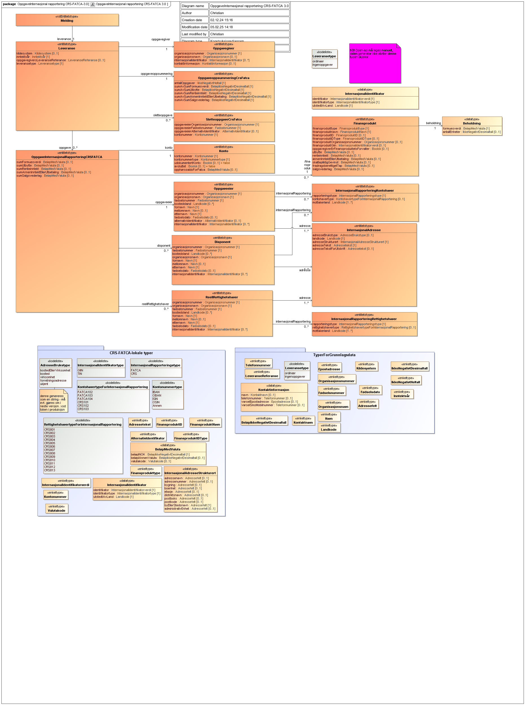

<Summary>
Tjeneste for innrapportering av tredjepartsopplysninger om internasjonal rapportering (CRS/FATCA) (RF-1183)
</Summary>

<Tabs underline={true}>
<TabItem headerText="Om tjenesten" itemKey="itemKey-1" default>

For generell informasjon om tjenestene se egne sider om:

* [Bruk av tjenestene](../om/bruk.md)
* [Sikkerhetsmekansimer](../om/sikkerhet.md)
* [Systembruker](../om/systembruker.md)
* [Feilhåndtering](../om/feil.md)
* [Versjonering](../om/versjoner.md)
* [Teknisk spesifikasjon](../om/tekniskspesifikasjon.md)

## Scope

Følgende scope skal benyttes ved autentisering i Maskinporten: `skatteetaten:innrapporteringinternasjonalrapportering`

## Delegering

Tilgang til dette API-et kan delegeres i Altinn, f.eks. dersom leverandør benyttes for den tekniske oppkoblingen.

## Systemtilgang med systembruker

Bruk av API-et krever systemtilgang med systembruker, som er ny funksjonalitet i Maskinporten levert av Digdir.
Informasjon vedr. dette finnes [her](../om/systembruker.md).

For å kunne benytte dette API-et med systemtilgang må man gi følgende rettighet til systemet ved opprettelse i
systemregisteret:

```JSON
{
  "Rights": [
    {
      "Resource": [
        {
          "value": "ske-innrapportering-internasjonal-rapportering",
          "id": "urn:altinn:resource"
        }
      ]
    }
  ]
}
```

## Teknisk spesifikasjon

URL-er til API-et, beskrivelse av parametere, endepunkter og responser ligger i Open API spesifikasjonen på
[SwaggerHub](https://app.swaggerhub.com/apis/skatteetaten/innrapportering-internasjonalrapportering-api/0.0.1)

Nødvendige åpninger i en evt. brannmur er beskrevet [her](../om/sikkerhet.md)

API-et for internasjonal rapportering har to endepunkter:

* __POST innsending__: Mottar tredjepartsopplysninger om internasjonal rapportering. Et kall mot API-et sender inn
  internasjonal rapportering for én oppgavegiver på et gitt inntektsår.
* __GET uthenting_dokument__: Henter ut ett spesifikt dokument knyttet til en transmission i Dialogporten

API-et validerer mottatte data mot JSON schema beskrevet på SwaggerHub.
Se [feilkoder](innrapportering-internasjonalrapportering?tab=Feilkoder)
for relaterte feilmeldinger.

Se også [eksempler](innrapportering-internasjonalrapportering?tab=Eksempler) for de ulike endepunktene.

### Parameter: idempotencyKey

idempotencyKey-parameteren er påkrevet. Innholdet skal være en unik UUID. Hvert nye kall til API-et skal ha en ny
idempotencyKey. Flere etterfølgende POST kall med samme request-body og samme idempotencyKey vil gi den
samme responsen. Kun det første av denne rekken med like API kall vil behandles. IdempotencyKey muliggjør at man trygt
kan prøve innsendinger på nytt der man av ulike årsaker ikke har fått en tilbakemelding fra API-et.

## Datakatalog

Dette API-et er pt. ikke dokumentert i Felles datakatalog.

</TabItem>
<TabItem headerText="Eksempler" itemKey="itemKey-2"> 

## Innsending

### Eksempel på request URL

```
https://innrapporteringinternasjonalrapportering.api.{env}.no/v1/{inntektsaar}
```

### JSON

#### Eksempel på innsending

```
{
  "leveranse": {
    "kildesystem": "Kildesystemet v2.0.5",
    "oppgavegiver": {
      "organisasjonsnummer": "987654321",
      "organisasjonsnavn": "FINANSINSTITUSJON 2 ASA",
      "internasjonalIdentifikator": [
        {
          "identifikator": "456DEF.99999.ME.578",
          "identifikatortype": "GIIN",
          "utstedtAvLand": "US"
        }
      ],
      "kontaktinformasjon": {
        "navn": "Kari test",
        "telefonnummer": "80080000",
        "varselEpostadresse": "kari.kontaktperson@finansinstitusjon.no",
        "varselSmsMobilnummer": "80080000"
      }
    },
    "inntektsaar": "2024",
    "leveransetype": "ordinaer",
    "oppgave": [
      {
        "oppgaveeier": {
          "person": {
            "fornavn": "Scott",
            "etternavn": "Tiger",
            "foedselsnummer": "00000000000",
            "foedselsdato": "1980-05-10"
          },
          "alternativIdentifikator": "4545454545",
          "internasjonalIdentifikator": [
            {
              "identifikator": "454-54-5454",
              "identifikatortype": "TIN",
              "utstedtAvLand": "US"
            }
          ],
          "adresse": [
            {
              "landkode": "NO",
              "strukturertAdresse": {
                "byEllerStedsnavn": "Bergen"
              }
            }
          ],
          "internasjonalRapportering": [
            {
              "rapporteringstype": "FATCA",
              "kontohavertype": "FATCA102",
              "mottakerland": [
                "US"
              ]
            }
          ]
        },
        "konto": {
          "kontonummer": "NO0014437946",
          "kontonummertype": "ISIN"
        },
        "summerteVerdier": {
          "sumFormuesverdi": {
            "beloepINOK": 540000.0
          },
          "sumUtbytte": {
            "beloepINOK": 4000.0
          },
          "sumRenteinntekt": {
            "beloepINOK": 450.0
          }
        }
      }
    ],
    "oppgaveoppsummering": {
      "antallOppgaver": 3,
      "sumAvSumFormuesverdi": 840000.0,
      "sumAvSumUtbytte": 14000.0,
      "sumAvSumRenteinntekt": 45450.0,
      "sumAvSumAnnenInntektEllerUtbetaling": 35000.0,
      "sumAvSumSalgsvederlag": 45000.0
    }
  }
}
```

#### Eksempel på respons

```
{
  "dialogId": "018b3d0f-d57e-7f5c-8a04-76dbc7e2fed2",
  "forsendelseId": "018f521e-5488-79e3-8817-48e94cb75455",
  "oppgavegiversLeveranseReferanse": "leveranse-1",
  "antallOppgaver": 23
}
```

#### Eksempel på sletteoppgave

```
{
  "leveranse": {
    "kildesystem": "Kildesystemet v2.0.5",
    "oppgavegiver": {
      "organisasjonsnummer": "987654321",
      "organisasjonsnavn": "FINANSINSTITUSJON 2 ASA",
      "internasjonalIdentifikator": [
        {
          "identifikator": "456DEF.99999.ME.578",
          "identifikatortype": "GIIN",
          "utstedtAvLand": "US"
        }
      ],
      "kontaktinformasjon": {
        "navn": "Kari test",
        "telefonnummer": "80080000",
        "varselEpostadresse": "kari.kontaktperson@finansinstitusjon.no",
        "varselSmsMobilnummer": "80080000"
      }
    },
    "inntektsaar": "2024",
    "leveransetype": "ordinaer",
    "oppgaveoppsummering": {
      "antallOppgaver": 0,
      "sumAvSumFormuesverdi": 0.0,
      "sumAvSumUtbytte": 0.0,
      "sumAvSumRenteinntekt": 0.0,
      "sumAvSumAnnenInntektEllerUtbetaling": 0.0,
      "sumAvSumSalgsvederlag": 0.0
    },
    "sletteoppgave": [
      {
        "kontonummer": "123456789",
        "oppgaveeierOrganisasjonsnummer": "123456789",
        "oppgaveeierAlternativIdentifikator": "alternativ id"
      }
    ]
  }
}
```

</TabItem>
<TabItem headerText="Feilkoder" itemKey="itemKey-3">

Se egen side for generell info om [feilhåndtering i tjenestene](../om/feil.md).

Tabellen under viser en oversikt over hvilke spesifikke feilkoder denne applikasjonen kan gi.

| Feilkode | HTTP Statuskode | Feilområde                                   |
|----------|-----------------|----------------------------------------------|
| GLD_001  | 500             | Uventet feil på tjenesten                    |
| GLD_005  | 403             | Feil i forbindelse med autorisering          |
| GLD_006  | 400             | Feil i request                               |
| GLD_008  | 400             | Strukturell feil i tilknyttet dataformat     |
| GLD_010  | 400             | Feil i forbindelse med validering av payload |
| GLD_011  | 400             | Feil i metadata                              |
| GLD_017  | 500             | Uspesifisert systemfeil                      |
| GLD_019  | 409             | Idempotensnøkkel er benyttet tidligere       |
| GLD_021  | 404             | Finner ikke forespurt ressurs                |
| GLD_022  | 405             | HTTP-metode ikke støttet                     |

Feilresponsene kan også inneholde en feilspesifiseringskode som presiserer feilen ytterligere.
Tabellen under viser hvilke feilspesifiseringskoder applikasjonen kan gi.
Dersom det finnes mer detaljert feilinformasjon enn generelt feilområde vil det beskrives i melding, sti og angitt verdi
feltene.

| Feilspesifiseringskode | Feilområde                                                                                    | Årsak                                                                                                                       |
|------------------------|-----------------------------------------------------------------------------------------------|-----------------------------------------------------------------------------------------------------------------------------|
| GLD_1007               | Mangler Token                                                                                 | Det er ikke lagt ved noen authorization header med token på request                                                         |
| GLD_1008               | Ugyldig token                                                                                 | Token oppgitt i authorization header er ugyldig                                                                             |
| GLD_1015               | Ikke autorisert for å levere på denne dialogen                                                | Organisasjonen som leverer har ikke rettighet til å levere for denne oppgavegiveren                                         |
| GLD_1022               | Feil i parametre                                                                              | Diverse feil med parametre i request. Mer detaljert beskrivelse ligger i melding, sti og angitt verdi dersom det er aktuelt |
| GLD_1023               | Finner ingen ressurs for denne URL-en                                                         | Det er ikke noe innhold tilgjengelig på denne URL-en                                                                        |
| GLD_1027               | Inntektsår er ikke støttet                                                                    | Det er ikke tillatt å levere på oppgitt inntektsår                                                                          |
| GLD_1028               | Header mangler                                                                                | Påkrevd header er ikke med i requesten                                                                                      |
| GLD_1030               | Accept-header må være av type application/json                                                | Accept header er feil. APIet har kun støtte for json i response                                                             |
| GLD_1032               | Feil i JSON-innhold                                                                           | Innhold i JSON er ikke i henhold til spesifikasjonen                                                                        |
| GLD_1047               | Content type må være application/json                                                         | Content-type header er feil. APIet har kun støtte for json i request body                                                   |
| GLD_1050               | Finner ikke et dokument med denne IDen på denne forsendelsen                                  | Det finnes ikke noe dokument med gitt id på angitt forsendelse                                                              |
| GLD_1052               | Inntektsår i path og i innsending er ulike                                                    | Inntektsår i innsending i JSON body og inntektsår i path må være like                                                       |
| GLD_1053               | Uventet feil i et bakenforliggende system, vennligst prøv igjen senere                        |                                                                                                                             |
| GLD_1054               | Det finnes ingen dialog for denne kombinasjonen av inntektsår, organisasjonsnummer og ordning | Det har blitt forsøkt å hente ut dokument på en dialog som ikke finnes                                                      |

</TabItem>
<TabItem headerText="Informasjonsmodell" itemKey="itemKey-4">



</TabItem>

<TabItem headerText="Test" itemKey="itemKey-5">

I første omgang er test kun tilgjengelig for et utvalg leverandører som det er inngått avtale med og som skal være
med å pilotere løsningene.

### Testmiljøer

For spesifikke URL-er til testmiljø hos Skatteetaten,
se [SwaggerHub](https://app.swaggerhub.com/apis/skatteetaten/innrapportering-internasjonalrapportering-api/0.0.1).

Digdir benytter TT02 som testmiljø, hvor følgende tilbys:

* DialogPorten
* Autentisering - Maskinporten
* Autorisering - systembruker
* Altinn innboks

Konsumenter må ha egne testmiljøer som kan kobles mot testmiljøer hos Skatteetaten og Digdir.

### Tenor testdatasøk

Det finnes pt. ikke søk i [Tenor](https://github.com/Skatteetaten/api-dokumentasjon/blob/main/docs/test/tenor.md) for
denne tjenesten. Men egenskaper ved enhetene som har testdata kan søkes frem i Tenor.

### Testdata

Det skal utelukkende benyttes syntetiske testdata ved test av tjenesten. Tenor testdatasøk tilbyr dette.
Det er ikke tillatt å bruke/sende skarpe data i test pga krav fra GDPR-regelverket.

Det finnes foreløpig ingen testdata for denne tjenesten. Denne siden oppdateres fortløpende ettersom testdata blir
tilgjengelig.

</TabItem>
<TabItem headerText="Kontakt oss" itemKey="itemKey-6">

Har du spørsmål til Skatteetaten om API for internasjonal rapportering, kan du sende oss
e-post: [altinnreetablering\@skatteetaten.no](mailto:altinnreetablering@skatteetaten.no)  
Vær oppmerksom på at epostadressen er midlertidig og gjelder bare i perioden tjenestene er i utvikling og test fra
Altinn II til Altinn 3.

</TabItem>
</Tabs>
