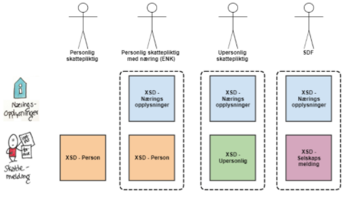
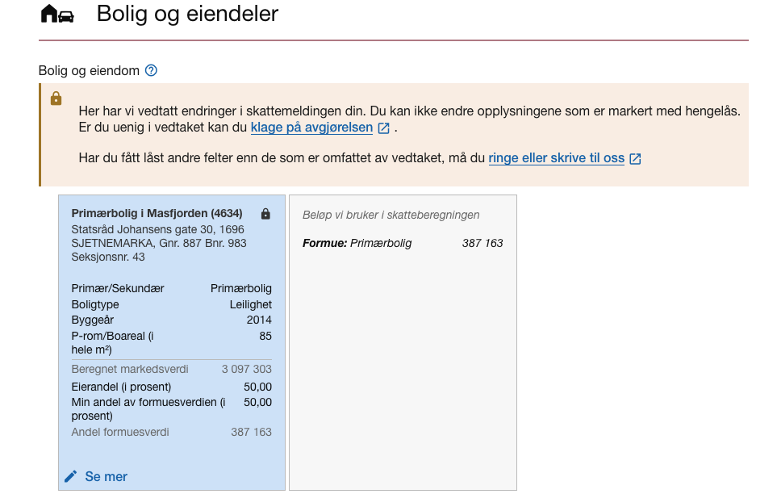

<Summary>Tjenester for innrapportering av skattemeldingen for næringsdrivende fra sluttbrukersystemer</Summary>

<Tabs underline={true}>
<TabItem headerText="Om tjenesten" itemKey="itemKey-1" default>

Denne siden inneholder spesifikasjoner/implementasjonsguide for hvordan innrapportering av
skattemeldinger for personlige og upersonlige skattepliktige skal leveres fra sluttbrukersystem.
Den primære målgruppen er systemleverandører av årsoppgjørsprogram eller regnskapssystem for
innrapportering av skattemeldingen og næringsopplysninger. Slike systemer kalles heretter
sluttbrukersystemer (SBS).

Løsningen legger opp til at en innsending skal inneholde en skattemelding. For personlige som driver ENK, upersonlige (selskaper) og for selskaper
med deltakerfastsetting skal innsendingen også __alltid__ inneholde næringsspesifikasjon. Det er kun lønnstakere og pensjonister som kun sender inn
skattemelding. Dette illustreres her:


<br></br> _Illustrasjon av skattemeldingsvarianter for personlige og upersonlige skattepliktige._

For generell informasjon om tjenestene se egne sider om:

* [Bruk av tjenestene](../om/bruk.md)
* [Sikkerhetsmekanismer](../om/sikkerhet.md)
* [Systembruker](../om/systembruker.md)
* [Feilhåndtering](../om/feil.md)
* [Versjonering](../om/versjoner.md)
* [Teknisk spesifikasjon](../om/tekniskspesifikasjon.md)

For informasjon og oppdateringer for systemleverandører med integrasjon mot skattemeldingen for person og næring, se våre [fellessider for systemleverandører](https://www.skatteetaten.no/samarbeidspartnere/sluttbrukersystemer/skattemelding-sbs/).

Dokumentasjonen for innsending av skattemeldingen ligger foreløpig på [en egen Github-side](https://github.com/Skatteetaten/skattemeldingen).
API-ene for innsending vil tilgjengeliggjøres som OpenAPI-spesifikasjoner på SwaggerHub. Dette er ikke enda klart.

Det tilbys to sett med API-er:

- Skatteetatens API: har tjenester for henting- og validering av skattemeldinger, eiendomskalkulator, hent vedlegg og
  foreløpig avregning.
- Altinn3 API: har tjenester for opprettelse og innsending av en skattemelding.

## Ordliste
| Begrep | Beskrivelse                                                                                                |
|--------|------------------------------------------------------------------------------------------------------------|
| SBS    | Sluttbrukersystem                                                                                          |
| SDF    | Selskap med deltakerfastsetting                                                                            |
| SERG   | Betegnelse på Eiendomsregisteret                                                                           |
| SME    | Skattemelding, modernisert versjon. (benyttes oftest om publikumssiden for innlevering av skattemeldingen) |
| SMIA   | Skattemelding interne arbeidsflate (nytt saksbehandlingssystem 2020)                                       |

## Tilgang til API-et
Når en skattepliktig skal benytte et sluttbrukersystem for å sende inn skattemeldingen og næringsopplysninger gjennom
API må sluttbrukeren og/eller sluttbrukersystemet være autentisert og autorisert gjennom en påloggingsprosess.

Ved kall til skattemelding-API ønsker Skatteetaten å kjenne til identiteten til innsender. Identiteten til pålogget
bruker, kombinert med informasjon fra Altinn autorisasjon vil avgjøre hvilken person/selskap en pålogget bruker kan
hente skattemeldingen til eller sende inn skattemelding for.

Autentisering skjer enten via ID-porten eller Maskinporten:

- Personlig innlogging vil skje via ID-porten med bruk av sluttbrukerens eget personnummer.
- Systemer/maskiner som ønsker å opptre på vegne av en organisasjon kan autentisere seg via Maskinporten.

For mer informasjon om autentisering og autorisasjon, se [Sikkerhet](../om/sikkerhet.md).

### Tilgang til Altinn3 API
For tilgang til Altinn3-tjenestene må man ha en systembruker. Du kan lese mer om systembruker og hvordan systemet ditt kan ta det i bruk under [Systembruker](../om/systembruker.md).

Access-tokenet systembrukeren har mottatt fra Maskinporten må veksles til et Altinn-token for å autentisere seg mot Altinn3 API-et for innsending av skattemeldingen.
Mer informasjon om veksling av Maskinporten-token til Altinn-token og generell dokumentasjon om Altinn3 API finnes på [Altinns API-dokumentasjon](https://docs.altinn.studio/nb/api/scenarios/authentication/).

### Scope
#### Skatteetaten API
Følgende scopes med respektive maks-levetider skal benyttes ved autentisering i Maskinporten mot Skatteetatens API-er:

| Scope                                            | Beskrivelse                         | Levetid access-token | Levetid refresh-token |
|--------------------------------------------------|-------------------------------------|----------------------|-----------------------|
| skatteetaten:formueinntekt/skattemelding         | Tilgang til skattemeldingstjenester | 8 timer              | 90 dager              |
| skatteetaten:formueinntekt/skattemelding/eiendom | Tilgang til eiendomstjenester       | 8 timer              | 90 dager              |

:::info
Scopet med den korteste levetiden vil være gjeldende for hele access-tokenet.
Vi anbefaler å begrense levetiden på access-tokenet ytterligere, og heller ta i bruk refresh-token.
:::

#### Altinn3 API
For Altinn3 benyttes en systembruker som beskrevet tidligere. Ressursen som systembrukeren må ha for å bli autorisert er `app_skd_formueinntekt-skattemelding-v2`.

Altinn krever også at man har egne Altinn scopes ved kall mot Altinn3-appen, de aktuelle vil være `altinn:instances.read` og `altinn:instances.write` for sluttbrukersystem.
[https://docs.altinn.studio/nb/authorization/getting-started/authentication/id-porten/](https://docs.altinn.studio/nb/authorization/getting-started/authentication/id-porten/)

For å se maksimal levetid til Altinn sine scopes, finner man oversikt over disse på [DigDir Scopes - Altinn dokumentasjon](https://docs.altinn.studio/nb/api/authentication/digdirscopes/).

### Skatteetaten må gi tilgang
For å kunne bruke API-ene må Skatteetaten gi din virksomhet tilgang.
[Bestill tilgang til API-et](https://www.skatteetaten.no/samarbeidspartnere/sluttbrukersystemer/skattemelding-sbs/#trenger-du-hjelp)

## Teknisk spesifikasjon
Følgende figur gir en en overordnet flyt med aktører og komponenter for innsending av skattemelding med næringsspesifikasjon:

[](../../static/download/skattemeldingupersonlig/Komponentoversikt%20skattemelding%20næring%20for%20SBS.png)

Som det fremkommer av figuren kan skattemeldingen med tilhørende næringsspesifikasjon sendes inn som _komplett_ eller _ikke-komplett_.
* Ved __komplett innsending__ sendes ferdig utfylt skattemelding og næringsspesifikasjon inn fra SBS og lagres ned i Skatteetaten som <u>gjeldende fastsetting</u>.
* __Ikke-komplett innsending__ er kun støttet for personlig skattepliktige. SBS kan velge å la den skattepliktige fylle ut deler av personlig skattemelding,
  eller å kun støtte næringsspesifikasjon, og la den den skattepliktige fullføre innsending av skattemelding i Skatteetatens portalløsning (SME).
  Det er ikke mulig å kun sende inn næringsspesifikasjon, så om SBS kun skal støtte innsending av næringsspesifikasjon
  må det gjeldende utkastet til skattemelding hentes ut som beskrevet lenger nede og sendes inn sammen med næringsspesifikasjonen
  slik at den skattepliktige kan fylle inn dette selv i Skatteetatens portal.

Næringsspesifikasjonen kan ikke redigeres. Skal næringsspesifikasjon endres, må denne sendes inn på nytt fra SBS.

Det er fire hovedstrategier for hvordan man integrerer seg mot Skatteetatens tjenester for innsending av skattemelding og næringsspesifikasjon.
Dette er ikke en uttømmende liste, men representerer de mest vanlige scenariene:

#### Komplett innsending med full beregningsimplementasjon:
SBS implementerer alle beregninger som Skatteetaten gjør i valideringstjenesten, og sender inn skattemelding og næringsspesifikasjon som komplett.

#### Komplett innsending med integrert valideringstjeneste:
SBS integrerer valideringstjenesten i sitt sluttbrukersystem, og sender inn skattemelding og næringsspesifikasjon som komplett.

#### Ikke-komplett innsending med beregningsstøtte kun for næringsspesifikasjon:
SBS implementerer kun støtte for beregning av næringsspesifikasjon, og sender inn utkast til skattemelding fra Skatteetaten uten endringer.

#### Ikke-komplett innsending med integrert valideringstjeneste kun for næringsspesifikasjon:
SBS integrerer valideringstjenesten kun for næringsspesifikasjon, og sender inn utkast til skattemelding fra Skatteetaten uten endringer.

### 1. Hent gjeldende skattemelding
Første steg i innsendingsprosessen er å hente ut den siste gjeldende skattemeldingen. Denne kan ha status utkast eller fastsatt:

* Utkast er en preutfylt skattemelding Skatteetaten har laget for den skattepliktige basert på innrapporterte data og data fra skattemeldingen tidligere år.
* Fastsatt betyr at skattemeldingen er manuelt innlevert eller automatisk innlevert ved utløp av innleveringsfrist. Denne kan også inneholde et eller flere myndighetsfastsatte felter. For mer informasjon om myndighetsfastsatte felter se avsnittet under valider skattemeldingen.

Tjenesten som benyttes for å hente ut den siste gjeldende skattemeldingen er `GET /api/skattemelding/v2/{inntektsår}/{identifikator}`.

XSD-filen for responsobjektet til tjenesten er `skattemeldingognaeringsspesifikasjonforespoerselresponse_{versjon}.xsd`,
og er dokumentert i <span style={{ color: "red" }}> [OpenAPI-spesifikasjonen] til tjenesten. </span>
De Base64-encodede dokumentene i konvolutten til responsobjektet er nærmere beskrevet i fanen __Informasjonsmodell__.

#### 1.1 Utvidet veiledning
Det er mulig å etterspørre eventuelle ubesvarte utvidede veiledninger som del av dette API-et.

En utvidet veiledning representerer opplysninger som Skatteetaten har om skatteyter som muligens burde vært oppgitt i skattmeldingen, men som ikke er det.
Disse opplysningene er gjerne ikke fullstendige, og kan derfor ikke forhåndsutfylles.
Opplysningene vil trolig heller ikke validere mot valideringstjenesten senere i prosessen uten å ha blitt besvart.

Bare "ubesvarte" utvidede veiledninger returneres i responsen. En veiledning kan besvares på to måter:
* Gjennom Skatteetatens innleveringsportal for personlige skatteytere, der de kan velge å avvise eller legge til opplysningene.
* Ved innsending av `komplett` skattemelding fra et sluttbrukersystem. Når en slik innsending er fullført og fører til fastsetting, så vil alle ubesvarte veiledninger _på fastsettingstidspunktet_ bli besvart som at de er "hentet av SBS".
  * OBS! Siden nye utvidede veiledninger kan oppstå fortløpende, så finnes det en risiko for at det har kommet nye mellom tidspunktet hvor SBS henter veiledningene og fastsetting utføres. Det er derfor en risiko for at veiledninger som ikke har blitt hentet av SBSen og fremvist bruker blir besvart som det.

For å etterspørre utvidet veiledning, sendes query-parameteren `ìnkluderUtvidetVeiledning=true` med i kallet til `GET /api/skattemelding/v2/{inntektsaar}/{identifikator}`.
Parameteren støttes fra inntektsår 2022. Hvis request-parameteren sendes med for tidligere år vil den ignoreres.

### 2. Søk etter eiendomsinformasjon, hent formuesgrunnlag og beregn markedsverdi
Skatteetaten har utviklet egne tjenester for å hente eiendomsinformasjon og formuesgrunnlag fra Eiendomsregisteret, og beregne korrekt markedsverdi.
Eiendomsdataene som hentes ut og beregnes sendes inn til valideringstjenesten og senere som en del av skattemeldingen for at Skatteetaten skal få beregnet korrekt formuesverdi for eiendommene.
Valideringstjenesten beregner og returnerer også formuesverdien for hele eiendommene, formuesverdien for den skattepliktiges formuesandel av
eiendommene, og verdi før verdsettingsrabatt for den skattepliktiges formuesandel av eiendommene. Dette er verdier som skal benyttes ved innsending av skattemeldingen.

Eiendomsopplysninger preutfylles for personlige skattepliktige, men må fastsettes for upersonlige.

#### 2.1 Søk etter eiendom
Søketjenesten brukes til å identifisere brukerens eiendommer som skal inngå i skattemeldingen.
Tjenesten fungerer som inngangsport til de øvrige eiendomstjenestene, og leverer en eiendomsidentifikator som brukes videre i prosessen.
Det er mulig å søke på alle norske veiadresser, matrikkelnummer og <span style={{ color: "red" }}>boligselskap</span>.

Bruk endepunktet `/api/skattemelding/v2/eiendom/soek/v2/{inntektsår}?query={query}&resultSize={resultSize}`.

Følgende forretningsregler gjelder for `query`-parameteren:
* `Hvis første tegn man angir er et tall vil søket kun lete blant matrikkeladresser.`
* `Hvis første tegn man angir er en bokstav vil søket kun lete blant veiadresser.`
* `Søket krever streng plassering av tegn.`

#### 2.2 Hent formuesgrunnlag
Formuesgrunnlag hentes ut for hver eiendom som skal inngå i skattemeldingen. Eiendomsidentifikatoren fra søketjenesten brukes til å identifisere eiendommene.
Tjenesten henter ut ulik informasjon basert på hvilken eiendomstype eiendomsidentifikator har, samt inntektsåret det søkes for.
Noen detaljer vil fjernes fra responsen hvis skatteyter ikke er eier av eiendommen.

Eiendomstypen bestemmer også om det skal beregnes markedsverdi, ev. utleieverdi, før validering og innsending av skattemeldingen.
For følgende eiendomstyper skal det beregnes markedsverdi gjennom tjenestene beskrevet i neste avsnitt:

| Eiendomstype               | Feltnavn i API-et                 |
|----------------------------|-----------------------------------|
| Selveid bolig              | `selveidBolig`                    |
| Boenhet i boligselskap     | `boenhetIBoligselskap`            |
| Flerboligbygning           | `flerboligbygning`                |
| Ikke utleid næringseiendom | `ikkeUtleidNaeringseiendomINorge` |

Bruk endepunktet `/api/skattemelding/v2/eiendom/formuesgrunnlag/{inntektsår}/{eiendomsidentifikator}/{identifikator}`.
`eiendomsIdentifikator` er `SERG eiendomsidentifikator` for eiendommen fra søketjenesten.

#### 2.3 Beregning av markedsverdi/utleieverdi
Det er tre tjenester som benyttes for å beregne markedsverdi for eiendommer basert på eiendomstype:
* Selveid bolig, boenhet i boligselskap: tjenesten for beregning av markedsverdi for bolig
* Flerboligbygning: tjenesten for å beregne markedsverdi for flerbolig
* Ikke utleid næringseiendom: tjenesten for beregning av utleieverdi for næringseiendom
* For andre eiendomstyper gjør valideringstjenesten nødvendige beregninger for å fastsette formuesverdien, og det er ikke nødvendig å kalle tjenestene for beregning av markedsverdi.

For de ovennevnte eiendomstypene det skal beregnes markedsverdi/utleieverdi for, sendes formuesgrunnlaget fra den foregående tjenesten som input til tjenesten.
Sender man inn hele responsen fra hent formuesgrunnlag vil responsen til beregningen innholde alt som ble sendt inn pluss de beregnede feltene.

Det er også er mulig å oppgi dokumentert markedsverdi.
<span style={{ color: "red" }}> Hvis det oppgis dokumentert markedsverdi for en ny bolig, må det vedlegges dokumentasjon. Opplasting av vedlegg skjer i en egen Altinn3-tjeneste.
For eksisterende boliger er ikke vedlegg påkrevd.</span>
Ugyldig dokumentert markedsverdi i forhold til klagegrense vil ikke hensyntas.
Om dokumentert markedsverdi har blitt hensyntatt vil responsen fra beregningstjenesten inkludere feltet `justertMarkedsverdi`.
Mer informasjon om klage finnes på [Klage til Skatteetaten](https://www.skatteetaten.no/kontakt/klage/).

#### 2.3.1 Beregning av markedsverdi for bolig
Beregningen er basert på sjablong fra SSB hvor boligegenskaper og inntektsår inngår i beregningen.

Endepunktet `/api/skattemelding/v2/eiendom/markedsverdi/bolig/{inntektsår}/{eiendomsidentifikator}` benyttes for å beregne markedsverdi for bolig.
Feltet `beregnetMarkedsverdiForBolig` i responsen er den beregnede markedsverdien for boligen.

Skal det sendes med dokumentert markedsverdi for boligen, sendes feltet `dokumentertMarkedsverdiForBolig` med i request-objektet.

#### 2.3.2 Beregning av markedsverdi for flerbolig
Beregningen er basert på sjablong fra SSB hvor boligegenskaper og inntektsår inngår i beregningen.
Spesielt for flerboligbygning er at det også beregnes markedsverdi for hver useksjonerte boenhet. Denne beregningen gjøres uavhengig av om dokumentert markedsverdi er oppgitt for bygningen.

Endepunktet `/api/skattemelding/v2/eiendom/markedsverdi/flerbolig/{inntektsår}/{eiendomsidentifikator}` benyttes for å beregne markedsverdi for flerbolig og useksjonerte boenheter.
I responsen returneres feltene `beregnetMarkedsverdiForFlerboligbygning` for hele boligen, og `boligverdi` for hver useksjonerte boenhet.

Skal det sendes med dokumentert markedsverdi for flerboligbygning, sendes feltet `dokumentertMarkedsverdiForFlerboligbygning` med i request-objektet sammen med `aarForMottattMarkedsverdiForFlerboligbygning`.

#### 2.3.2 Beregning av utleieverdi for næringseiendom
Beregningen er basert på næringssjablong fra SSB hvor næringstype, areal, bystatus, sentralitet og skatteleggingsperiode inngår i beregningen.

Endepunktet `/api/skattemelding/v2/eiendom/utleieverdi/{inntektsår}/{eiendomsidentifikator}` benyttes for å beregne utleieverdi for næringseiendom.
<span style={{ color: "red" }}> I responsen returneres feltene `beregnetUtleieverdiForIkkeUtleidNaeringseiendomINorge` for hele boligen, og `utleieverdiFraSerg`.</span>

Skal det sendes med dokumentert utleieverdi for næringseiendom, sendes feltet `dokumentertMarkedsverdiForIkkeUtleidNaeringseiendomINorge` med i request-objektet.

### 3. Valideringstjenesten
Før innsending av skattemelding med næringsspesifikasjon, <span style= {{ color: "red" }}>bør</span> innsendingen valideres ved bruk av valideringstjenesten for å sikre at skattemeldingen er korrekt og mest sannsynligvis vil bli godkjent ved innsending.
Samme tjeneste benyttes av Skatteetatens mottak ved validering av innsendt skattemelding. Som beskervet i de fire hovedstrategiene for implementasjon, kan SBS velge å implementere alle beregninger selv, eller integrere valideringstjenesten i sitt system.

:::tip[Lagring av valideringsdata]
Skatteetaten vil ikke lagre eller følge opp informasjonen som sendes inn i valideringstjenesten på noen måte. Skatteetaten anser disse dataene som eid av den skattepliktige og ikke av Skatteetaten.
:::

Valideringen utfører følgende steg:
1. Kontroll av XML-meldingsformatet for skattemeldingen og næringsspesifikasjon mot de tilhørende XSD-ene
2. Utføring av alle relevante beregninger for å finne Skatteetatens versjon av de kalkulerte verdiene.
   Beregningene hensyntar også ektefelle.
3. Sammenligning av Skatteetatens kalkulerte verdier mot de innsendte kalkulerte verdiene
4. Validering av andre forretningsregler som ikke gjelder kalkyler
5. Tilbakemelding som inneholder:
<br/>  a. Sentrale elementer fra skatteplikten benyttet i skatteberegningen (12-deler etc) - gjelder kun personlige
<br/>  b. Skatteetatens skattemelding etter å ha kjørt interne beregninger
<br/>  c. Skatteetatens næringsspesifikasjon etter å ha kjørt interne beregninger
<br/>  d. Foreløpig beregnet skatt
<br/>  e. Summert skattegrunnlag for visning (nivå av inntekt, fradrag, formue, gjeld)
          Dette er de samme tallene som ligger i skatteoppgjøret for personlig skattepliktige som underlag for å kunne forstå grunnlagene i beregnet skatt
<br/>  f. Alle avvik som ble funnet på beregninger gruppert etter summer hvor det er avvik og summer Skatteetaten har beregnet hvor SBS ikke sendte inn noen verdi
<br/>  g. Kontrollutslag på kontroller av innsendte oppgaver (noen obligatoriske, andre til info)
<br/>  h. Valideringsresultat og eventuelle avvisningsårsaker

:::info[Foreløpig skatteberegning]
Merk at skatteberegningen kun er en foreløpig beregning. Den endelige skatteberegningen utføres i skatteoppgjøret.
:::

Validering kan gjøres løpende etter hvert som sluttbruker fyller inn informasjon, eller som én samlet validering før innsending.
Dette avhenger av flyten i sluttbrukersystemet.

Endepunktet som benyttes for validering er `/api/skattemelding/v2/valider/{inntektsår}/{identifikator}`.

XSD-en for requestobjektet til tjenesten er `skattemeldingognaeringsspesifikasjonrequest_{versjon}.xsd`, og XSD til responsobjektet er `skattemeldingognaeringsspesifikasjonresponse_{versjon}.xsd`.
Disse er dokumentert i <span style={{ color: "red" }}> [OpenAPI-spesifikasjonen] til tjenesten. </span>
De Base64-encodede dokumentene i konvolutten til responsobjektet er dokumentert i fanen __Informasjonsmodell__.

#### 3.1 Kontrollutslag på kontroller av innsendte oppgaver
I forbindelse med validering kjøres kontroller som er satt opp til å kjøres eksternt <span style={{ color: "red" }}>(med ekstern, menes da SMIA ref. api-v2 README?) </span>. Kontroller som kjøres eksternt er benevnt som veiledning.
Alle veiledningsforekomster har en betjeningsstrategi som returneres i responsdokumentet. Noen få av disse hindrer innsending, de fleste ikke.

Objektet `veiledningEtterKontroll` i responsen til valideringstjenesten inneholder en liste med veiledningsforekomster som er funnet under valideringen.
Objektet inneholder betjeningsstrategi og tekstlig gjengivelse av veiledningen.

#### 3.2 Valideringsresultat og eventuelle avvisningsårsaker
Valideringstjenesten vil inneholde eget felt som viser valideringsresultatet, slik at man før innsending kan se om innsendt skattemelding med
næringsspesifikasjon vil bli avvist eller ikke.

Feltet `resultatAvValidering` i responsen vil returnere `validertOK` om innsendingen ikke inneholder feil som vil medføre avvisning,
eller `validertMedFeil` om innsending vil medføre at skattemeldingen med næringsspesifikasjon blir avvist.

I tillegg returneres `aarsakTilValidertMedFeil` hvis valideringsresultatet er ´validertMedFeil´, gir en tekstkode for feilårsaken.
`avvikVedValidering` returnerer en liste med alle avvik som ble funnet under valideringen.

#### 3.4 Avrundingsregler
For å unngå avvik i beregnede beløp må SBS og Skatteetatens valideringstjeneste benytte de samme prinsippene for avrunding av beløp.

* 2 desimaler er tillatt for opplysningene i XML for næringsspesifikasjon.
* Bruk av desimaler for opplysninger i XML for skattemelding tillates ikke.
* Alle beløp i XML for næringsspesifikasjon som skal overføres til XML for skattemelding skal avrundes til nærmeste kronebeløp iht. de alminnelige avrundingsreglene:
  * Ørebeløp som ender på 1 - 49 øre rundes ned til nærmeste kronebeløp.
  * Ørebeløp som ender på 50 - 99 øre rundes opp til nærmeste kronebeløp.

Bruk av desimaler for opplysninger i XML for skattemelding tillates ikke fordi det vil kunne skape utfordringer når summene skal
sendes videre til skatteberegning.

#### 3.5 Validering av låste felter
Skatteetaten har muligheten til å låse enkeltfelter eller hele skattemeldingen og/eller næringsspesifikasjonen. Dette vil kun forekomme på en fastsatt skattemelding, og aldri utkast.
Informasjon om hvilke felter som er låst er ikke med i de eksterne modellene, men når dere prøver å validere en skattemelding med endringer på et felt som er låst vil dere få følgende valideringsresultat: `KanIkkeOverskriveMyndighetsfastsattVerdi` eller `KanIkkeSletteMyndighetsfastsattVerdi`
Dette skyldes at en forekomst som har blitt låst har blitt endret eller slettet.


<br/>_Eksempel på låst felt i SME_.

### 4. Forleøpig avregning (er dette en del av hovedflyt?)
Det er laget en egen tjeneste for å kunne gjøre en foreløpig avregning basert på den beregnede skatten man sender inn til komponenten.
Endelig avregning i forbindelse med skatteoppgjøret kan gi et annet avregningsresultat enn ved foreløpig avregning.

Tjenesten tar ikke høyde for eventuelte tidligere skatteoppgjør for aktuelt inntektsår.
Hvis skattyter har et skatteoppgjør og fått utbetalt tilgode, og skal gjøre en endring, så vil denne tjenesten avregne som om det var første skatteoppgjør.

Endepunktet som benyttes er `POST /api/skattemelding/v2/avregning/avregn/{inntektsaar}/{identifikator}`,
og er dokumentert i <span style={{ color: "red" }}> [OpenAPI-spesifikasjonen] til tjenesten. </span>

### 5. Innsending av skattemelding i Altinn3 API


URL-er til API-et, beskrivelsen av parameterne, endepunkter og respons ligger i [Open API-spesifikasjonen til Altinn3-appen](https://skd.apps.altinn.no/skd/formueinntekt-skattemelding-v2/swagger/index.html?urls.primaryName=End+user+app+API+for+skd%2Fformueinntekt-skattemelding-v2).
Denne genereres og administreres av Altinn basert på appen utviklet av Skatteetaten.

#### Draft
Statuser i innsendingstjenesten:
* __Data__: instansen er opprettet og det kan lastes opp data på instansen
* __Confirmation__: data er ferdig lastet opp og man venter på innsending
  * Det kan være ett eller to confirmation-steg (kun skattepliktig eller skattepliktig og revisor)
  * Det er rollestyrt hvem som har lov til å sette status til feedback (det vil kun være revisorrollen som kan sende til feedback, etter at den skattepliktige har godkjent hvis to steg)
* __Feedback__: data er sendt inn og man avventer tilbakemelding fra Skatteetaten på om skattemeldingen er mottatt
  * Skatteetaten laster dokumenter tilbake til instansen som beskriver resultatet av mottak, deretter endres status til arkivert
* __Arkivert__: data er mottatt OK av Skatteetaten, resultatet er lastet tilbake til Altinn, Altinn instansen arkiveres som innsendt

Betjeningsstrategier (utdatert?)

| Strategi              | Beskrivelse                                                                                                       | Hindrer innsending |
|-----------------------|-------------------------------------------------------------------------------------------------------------------|--------------------|
| MERKNAD_FEIL          | Hindrer innsending                                                                                                | Ja                 |
| MERKNAD_DOKUMENTASJON | Krever at dokumentasjon legges til på korttypen                                                                   | Ja                 |
| MERKNAD_STANDARD      | Dialogboks over kort                                                                                              | Nei                |
| MERKNAD_TIPS          | Dialogboks i kortgruppe om man ønsker å legge til korttype som følge av informasjon i andre korttyper             | Nei                |
| MERKNAD_MANGEL        | Vises i toppen av siden, lenke til kort, skatteberegning vises ikke når denne eksisterer                          | Nei                |
| MERKNAD_INFORMASJON   | Dialogboks over kort, benyttes til å vises generell informasjon om regler/skatteloven o.l. som er til informasjon | Nei                |
| MERKNAD_INGEN         | Brukes i forbindelse med A/B-test for å si at det ikke skal vises noen merknad, bare logges i hendelsesloggen     | Nei                |
| UTVIDETVEILEDNING     | Brukes kun i toppen/i tema for å gi hjelp til hvilke kort man bør legge til                                       | Nei                |

### Valgfrie tilleggstjenester
Nedenfor dokumenteres tjenester som er utviklet basret på behov fra sluttbrukersystemer, men som ikke er en del av den obligatoriske flyten for innsending av skattemeldingen.

#### Hent gjeldende skattemelding for gitt type
I noen tilfeller er det ønskelig å hente ut den siste gjeldende skattemeldingen for en gitt type, f.eks. for å hente ut siste gjeldende utkast av skattemeldingen etter fastsettelse.

Endepunktet som benyttes til dette er `/api/skattemelding/v2/{type}/{inntektsår}/{identifikator}`, hvor `type` kan være `utkast` eller `fastsatt`.

#### Valider skattemeldingen uten dokumentreferanseTilGjeldendeDokument

Hvis det er et behov for å gjøre beregninger fra SBS før Skatteetaten har publisert utkast for et inntektsår, kan denne tjenesten benyttes.
Den er helt lik som valideringstjenesten, men krever ikke `dokumentreferanseTilGjeldendeDokument`.

Denne tjenesten skal ikke brukes for validering før innsending, da vi har en del kontroller som sjekker mot gjeldende utkast som denne tjenesten ikke utfører.

Endepunktet for denne tjenesten er `POST /api/skattemelding/v2/validertest/{inntektsår}/{identifikator}`

</TabItem>

<TabItem headerText="Informasjonsmodell" itemKey="itemKey-2">

# Informasjonsmodell for innsending av skattemelding med næringsspesifikasjon
Skattemeldingen og næringsopplysninger skal leveres som XML-filer. Innhold og format på XML-filene er spesifisert gjennom XML Schema Definition, XSD.

Følgende informasjonsmodeller skal brukes for fastsetting:
* skattemelding for formues- og inntektsskatt for personlige skattepliktige
* skattemelding for formues- og inntektsskatt for upersonlige skattepliktige
* selskapsmeldingen for selskap med deltakerfastsetting (SDF)
* næringsspesifikasjon

De til enhver tid gjeldende XSD-filene for informasjonsmodellene er tilgjengelig på [skattemeldingen på GitHub](https://github.com/Skatteetaten/skattemeldingen/tree/master/src/resources/xsd).

XSD-ene beskriver informasjonsmodellen som benyttes ved utveksling av data mellom sluttbrukersystemet og Skatteetaten.
Strukturen i informasjonsmodellen er ikke en beskrivelse av hvordan opplysningene skal presenteres for sluttbrukeren.
De samme opplysningene kan derfor være strukturert annerledes i en brukerflate enn i XML-en.

Dette gjelder også lede- og hjelpetekster. Tekstene som Skatteetaten har definert for skattemeldingen er knyttet til presentasjonen av opplysningene,
og er ikke en del av XSD-en. Tekstene er mappet mot XPath-uttrykk som angir hvor i XML-strukturen den enkelte teksten hører til.
Lede- og hjelpetekstene er tilgjengelige i maskinlesbart format på [GitHub](https://github.com/Skatteetaten/skattemeldingen/tree/master/docs/tekster).

Dokumentinnholdet i XML-forespørselene og responsene serialiseres i Base64-encodet format i henhold til [RFC 4648](https://datatracker.ietf.org/doc/html/rfc4648).
Responsen fra Skatteetaten vil alltid inneholde Base64 som er formatert på denne måten. Dette gjelder både ved uthenting av gjeldende skattemelding, validering og innsending av skattemeldingen med næringsspesifikasjon.

## Årsrevisjon

XSD-spesifikasjonene vil gjennomgå en årlig revisjon slik at det normalt kommer en ny versjon av disse per inntektsår.
Skatteetaten har valgt å ikke ha inntektsåret i filnavnet, men derimot ha et løpende versjonsnummer <span style={{ color: "red" }}>som er basert på
"semantic versioning".</span>

### Semantic Versioning

```
Given a version number MAJOR.MINOR.PATCH, increment the:

- MAJOR version when you make incompatible changes.
- MINOR version when you add functionality in a backwards compatible manner, and
- PATCH version when you make backwards compatible bug fixes.
```
Innenfor et inntektsår kan det forutsettes av det kun kommer MINOR- og PATCH-versjoner.

## Kompakt XSD
Alle XSD-filer med begrepsreferanser kommer i en "kompakt versjon" med _\_kompakt_ i filnavnet. De kompakte utgavene følger samme versjonering som de vanlige XSD-filene, men inneholder ikke referanser til begrepskatalogen.
Siden de ikke inneholder referansen til begrepskatalogen, vil det være enklere å følge med på funksjonelle endringer fra en versjon til neste ved hjelp av Git-funksjonalitet eller eksterne verktøy for å sammenligne to XSD-er.

Referanser til begrepskatalogen er angitt med egenskapen `skatt:begrepsreferanse` i de originale XSD-filene og er disse som er fjernet i de kompakte XSD-filene.

Eksempel:
<pre>
<code>
&lt;xsd:simpleType name="Heltall" <span style={{ color: "red" }}>skatt:begrepsreferanse="https://data.skatteetaten.no/web/datakatalog/begrep/20b52af0-9fe1-11e5-a9f8-e4115b280940"</span>&gt;
    &lt;xsd:restriction base="xsd:long" /&gt;
&lt;/xsd:simpleType&gt;
</code>
</pre>

## Generelle konsepter i XSD-filene
Noen typer og egenskaper brukes på tvers av informasjonsmodellene. XSD-ene angir hvilke egenskaper som er tilgjengelige på det enkelte objektet eller feltet.

### ID-er
Objekter i skattemeldingen har en `id` som identifiserer den enkelte forekomsten. Når et objekt kommer fra et utkast,
bør samme `id` videreføres når objektet endres. Feltene på objektet kan endres uten at objektet får en ny `id`.
Når sluttbrukersystemet oppretter et nytt objekt, må det også opprette en `id`. ID-en må være unik innenfor skattemeldingen.
Den kan for eksempel være en GUID eller en annen unik identifikator.

### Kodelister
For enkelte felt er verdiene som kan angis definert i eksterne kodelister.
Når en type i XSD-en bruker en slik kodeliste, er det angitt med egenskapen `skatt:eksternKodeliste`.

Eksempel:
<pre>
<code>
&lt;xsd:simpleType name="SaerskiltSkatteplikt" <span style={{ color: "red" }}>skatt:eksternKodeliste="/formuesOgInntektsskatt/2026_saerskiltSkatteplikt.xml"</span>&gt;
    &lt;xsd:restriction base="xsd:string" /&gt;
&lt;/xsd:simpleType&gt;
</code>
</pre>

Referansen i `skatt:eksternKodeliste` angir hvilken kodeliste som skal brukes for feltet.
Kodelistene er tilgjengelige på [GitHub](https://github.com/Skatteetaten/skattemeldingen/tree/master/src/resources/kodeliste).

### Egenskaper på objekter og felter
Objekter og felter i skattemeldingen kan ha egenskaper i tillegg til selve opplysningen som rapporteres. Hvilke egenskaper som kan brukes på den enkelte forekomsten, er definert i informasjonsmodellen.

#### Egenskaper på objekter
Enkelte forhold angis som egenskaper på objektet de gjelder, og rapporteres ikke som egne objekter i skattemeldingen.
Dette gjelder blant annet:
* utenlandsforhold, som angis med `landkode`
* kommunetilhørighet, som angis med `kommunenummer`

Det finnes altså ikke egne objekter for eksempelvis et utenlandsforhold eller en kommunetilhørighet. Egenskapen angis på objektet som forholdet gjelder.

For personlig skattepliktige fremgår hvilke egenskaper som kan brukes på de ulike forekomstene av kodelisten `{inntektsår}_egenskaperPerForekomstISkattemelding.xml` hvor `{inntektsår}` er inntektsåret for skattemeldingen.

#### Egenskaper på felter
Enkelte felt kan ha egenskaper i tillegg til feltets verdi. Hvilke egenskaper som kan angis, bestemmes av typen til feltet i XSD-en.
For eksempel kan et beløpsfelt ha skattemessige egenskaper knyttet til beløpet. Slike egenskaper skal bare brukes på felt der den aktuelle typen i XSD-en åpner for det.

Bruk XSD-en for samtlige, og i tillegg kodelisten `{inntektsår}_egenskaperPerForekomstISkattemelding.xml` for personlig skattepliktige, for å avgjøre hvilke egenskaper som kan brukes på den aktuelle forekomsten.

### Fastsettingsberegninger
En del steder i skattemeldingen er det laget beregningsstøtte for å komme frem til skattemessige verdier. Slike beregninger kalles
fastsettingsberegninger.

I XSD-ene for skattemeldingen er det mulig å se hvilke felt som har fastsettingsberegninger og som beregnes med utgangspunkt i andre felt. Dette
vises slik i XSD (merket rødt):

<pre>
<code>
&lt;xsd:complexType name="FormueOgGjeld"&gt;
  &lt;xsd:sequence&gt;
    &lt;xsd:element maxOccurs="unbounded" minOccurs="0" name="formuesobjekt" type="Formuesobjekt"/&gt;
    &lt;xsd:element name="id" type="Tekst"/&gt;
    &lt;xsd:element minOccurs="0" name="gjeld" type="Gjeld"/&gt;
    &lt;xsd:element minOccurs="0" name="samletVerdiFoerEventuellVerdsettingsrabatt" <span style={{ color: "red" }}>skatt:erAvledet="true"</span> type="BeloepSomHeltallMedOverstyring"/&gt;
    &lt;xsd:element minOccurs="0" name="samletGjeld" <span style={{ color: "red" }}>skatt:erAvledet="true"</span> type="BeloepSomHeltallMedOverstyring"/&gt;
    &lt;xsd:element minOccurs="0" name="samletVerdiBakAksjeneISelskapet" <span style={{ color: "red" }}>skatt:erAvledet="true"</span> type="BeloepSomHeltallMedOverstyring"/&gt;
    &lt;xsd:element minOccurs="0" name="fasteEiendommer" type="FasteEiendommer"/&gt;
  &lt;/xsd:sequence&gt;
&lt;/xsd:complexType&gt;
</code>
</pre>

Alle felt som er avledet vil bli reberegnet i mottak av skattemeldingen og hvis verdien som er sendt inn ikke er lik verdien den beregnes til vil
innsendingen bli avvist.

Det er mulig å ikke sende inn avledede felter - disse vil da bli beregnet ved mottak og slik sett bli endel av fastsettingen
(det blir markert som et avvik i valideringstjenesten, men vil ikke bli avvist).

#### Overstyring av fastsettingsberegninger
Avledede felt ha en tilhørende type som tillater overstyring (eks:`BeløpSomHeltallMedSkattemessigeEgenskaperMedOverstyring`).
Denne typen vil ha en egenskap `erOverstyrt` som gjør at man kan fastsette at verdien i dette sumfeltet er overstyrt.
Det betyr at man kan fastsette en sum og denne vil gjelde selv om skatteetatens interne summeringer returnerer et annet beløp.
Slike avvik blir ikke avvist i valideringstjenesten.

## Spesifikasjon av konvolutter for skattemelding, selskapsmelding og næringsspesifikasjon
På [GitHub](https://github.com/Skatteetaten/skattemeldingen/tree/master/src/resources/xsd) ligger de versjonerte XSD-filene som benyttes for skattemelding personlig og upersonlig, selskapsmelding og næringsspesifikasjon, i kompakt og originalt format.
I de originale versjonene av XSD-filene er det referanser til [begrepskatalogen](https://data.skatteetaten.no/web/datakatalog/begreper), hvor de ulike feltene er dokumentert.
Skatteetaten har også en [veileder til skattemeldingen](https://skattemelding-veileder.formueinntekt.skatt.skatteetaten.no/), hvor de ulike informasjonsmodellene er dokumentert per inntektsår.

Listen nedenfor gir en oversikt over de ulike XSD-filene. Versjonsnummeret er tatt bort fra filnavnet fordi disse revideres årlig:

| Dokumenttype i respons-XSD                                                                                                                                 | XSD-filnavn uten versjonsnummer                                                                                                                      | Beskrivelse                                                                |
|------------------------------------------------------------------------------------------------------------------------------------------------------------|------------------------------------------------------------------------------------------------------------------------------------------------------|----------------------------------------------------------------------------|
| `summertskattegrunnlagforVisningPersonlig` \| `summertSkattegrunnlagForVisningPersonligSvalbard`                                                           | `skatteberegningsgrunnlag_{versjon}.xsd`                                                                                                             | Skatteberegningsgrunnlag for personlige skattepliktige                     |
| `summertskattegrunnlagforVisningUpersonlig` \| `summertSkattegrunnlagForVisningUpersonligSvalbard` \| `summertSkattegrunnlagForVisningUpersonligPetroleum` | `summertSkatteGrunnlagForVisning_upersonligskattyter_{versjon}.xsd`                                                                                  | Skatteberegningsgrunnlag for upersonlige skattepliktige                    |
| `skattemeldingPersonligEtterBeregning`                                                                                                                     | `skattemelding_{versjon}_ekstern.xsd` \| `skattemelding_{versjon}_kompakt_ekstern.xsd`                                                               | Skattemelding for personlige skattepliktigemed og uten begrepsreferanser   |
| `skattemeldingUpersonligEtterBeregning`                                                                                                                    | `skattemeldingUpersonlig_{versjon}_ekstern.xsd` \| `skattemeldingUpersonlig_{versjon}_kompakt_ekstern.xsd`                                           | Skattemelding for upersonlige skattepliktige med og uten begrepsreferanser |
| `beregnetSkattPersonlig` \| `beregnetSkattPersonligSvalbard`                                                                                               | `beregnet_skatt_{versjon}.xsd`                                                                                                                       | Beregnet skatt for personlige skattepliktige                               |
| `beregnetSkattUpersonlig` \| `beregnetSkattUpersonligSvalbard`                                                                                             | `beregnetskatt_upersonlig_{versjon}_ekstern.xsd`                                                                                                     | Beregnet skatt for upersonlige skattepliktige                              |
| `selskapsmeldingSdfEtterBeregning`                                                                                                                         | `selskapsmeldingSelskapMedDeltakerFastsetting_{versjon}_ekstern.xsd` \| `selskapsmeldingSelskapMedDeltakerFastsetting_{versjon}_kompakt_ekstern.xsd` | Selskapsmelding for SDF med og uten begrepsreferanser                      |
| `naeringsspesifikasjonEtterBeregning`                                                                                                                      | `naeringsspesifikasjon_{versjon}_ekstern.xsd` \| `naeringsspesifikasjon_{versjon}_kompakt_ekstern.xsd`                                               | Næringsspesifikasjon med og uten begrepsreferanser                         |

### Informasjonsmodell hent gjeldende skattemelding


### Skattemelding person


### Skattemelding upersonlig

### Selskapsmelding for SDF

### Næringsspesifikasjon

#### ID-er
Det er et par spesielle regler for `id`-feltene i næringsspesifikasjonen:

* For entitetene under `Resultat` og `Balanse` skal id ___alltid___ settes til __1__.
* For entitetene `Resultatregnskapsforekomst` og `Balanseregnskapsforekomst`  skal id settes lik teknisk navn på valgt type i samme objekt.
  Typen er kontonummeret som beløpet er ført på. Se kodeliste `{inntektsår}_resultatregnskapOgBalanse.xml` for hvilke typer som er tilgjengelige.


</TabItem>

<TabItem headerText ="Test" itemKey="itemKey-3">

## Demo for hvordan koble seg på ID-porten og kalle Skatteetatens API
Skatteetaten har utviklet en demoklient (i python/jupyter notebook) som viser hvordan koble seg på ID-porten og kalle
Skatteetatens API, og sende inn skattemeldingen med vedlegg via Altinn3:
[jupyter notebook](../test/testinnsending/person-enk-med-vedlegg-2021.ipynb)

## Testdata for eiendommer
Oversikt over hvilke eiendommer dere kan søke opp ligger i [dette regnearket](Syntetiske_eiendommer_v5.csv)

</TabItem>
</Tabs>
