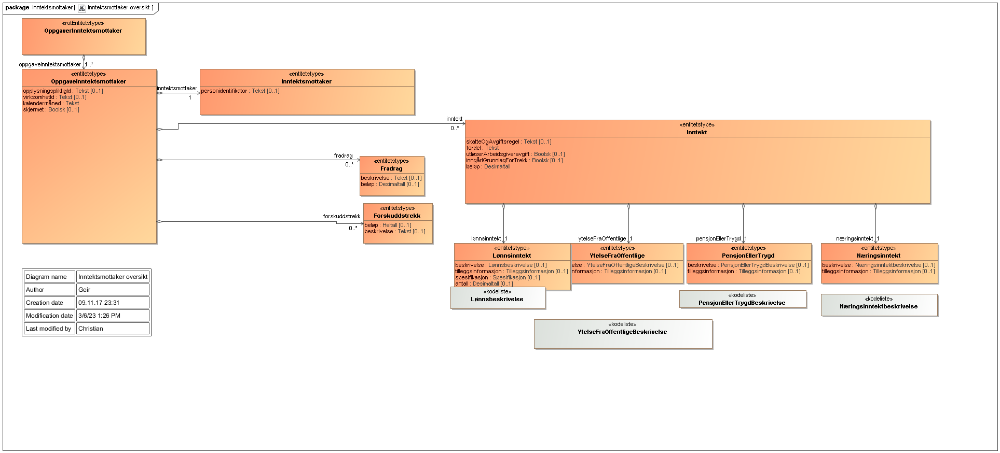
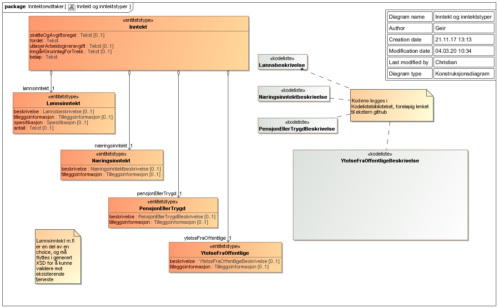
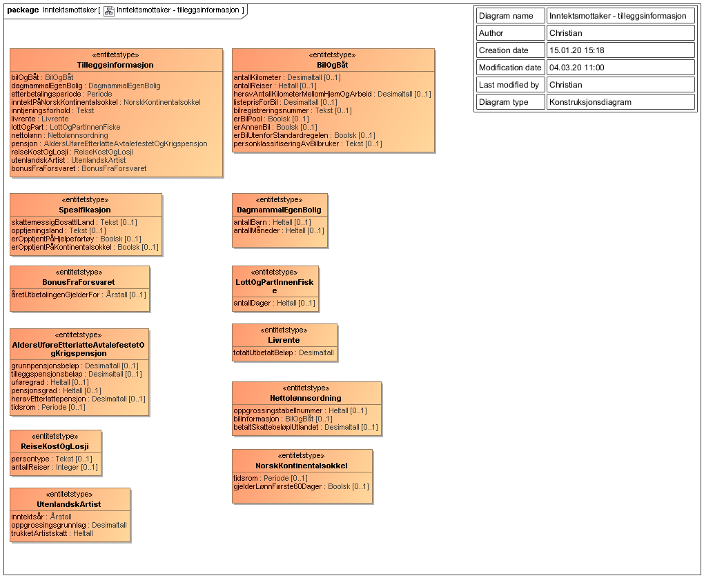

<Summary>Tjenesten leverer informasjon om arbeidsgivers (opplysningspliktiges) innrapporterte inntektsopplysninger for en inntektsmottaker for en gitt periode.</Summary>

<Tabs underline={true}>
<TabItem headerText="Om tjenesten" itemKey="itemKey-1" default>

For generell informasjon om tjenestene se egne sider om:

* [Bruk av tjenestene](../om/bruk.md)
* [Sikkerhetsmekansimer](../om/sikkerhet.md)
* [Rettighetspakker](../om/rettighetspakker.md)
* [Feilhåndtering](../om/feil.md)
* [Versjonering](../om/versjoner.md)
* [Teknisk spesifikasjon](../om/tekniskspesifikasjon.md)

## Scope

Følgende scope skal benyttes ved autentisering i Maskinporten: `skatteetaten:inntekt`

## Delegering

Tilgang til dette API-et kan delegeres i Altinn, f.eks. dersom leverandør benyttes for den tekniske oppkoblingen. Søk
opp følgende tjeneste i Altinn for å delegere tilgangen: `Inntekt API - På vegne av`

## Teknisk spesifikasjon

URL-er til API-et, beskrivelsen av parameterne, endepunkter og respons ligger
i [Open API spesifikasjonen](https://app.swaggerhub.com/apis/skatteetaten/inntekt-api/) på SwaggerHub.

## Rettighetspakker

Skatteetaten utleverer ikke alle inntekt typer til alle virksomheter. Virksomhetens *rettighetspakke* avgjør hvilke
inntekter som filtreres vekk før data utleveres. Inntekter som ikke skal utleveres for en rettighetspakke fjernes i sin
helhet.

| Navn på rettighetspakke               | Egenskaper ved rettighetspakke                                                                                                                                           |
|---------------------------------------|--------------------------------------------------------------------------------------------------------------------------------------------------------------------------|
| afp                                   | Hjemmel                                                                                                                                                                  |
| digisos                               | Hjemmel                                                                                                                                                                  |
| fiskeridirektoratetkontrollmanntall   | Hjemmel                                                                                                                                                                  |
| fiskeridirektoratetmanntall           | Hjemmel                                                                                                                                                                  |
| gff                                   | Hjemmel                                                                                                                                                                  |
| husbanken                             | Hjemmel                                                                                                                                                                  |
| kommuneBoligsosialeFormaal            | Hjemmel                                                                                                                                                                  |
| laanekassen                           | Hjemmel                                                                                                                                                                  |
| ldir                                  | Hjemmel                                                                                                                                                                  |
| ldirReindriftstilskudd                | Hjemmel                                                                                                                                                                  |
| nav                                   | Hjemmel                                                                                                                                                                  |
| otp                                   | Hjemmel. Perioden det spørres på må være innenfor virkningsperioden. Se [Forutsetning for bruk](../informasjonsmodeller/tjenestepensjonsavtale/forutsetningerforbruk.md) |
| pensjonskasseetteroppgjoerufoerafp    | Hjemmel                                                                                                                                                                  |
| pensjonskasseLivsvarigafpanneninntekt | Hjemmel                                                                                                                                                                  |
| pensjonskasseLivsvarigafpandreytelser | Hjemmel                                                                                                                                                                |
| saernamsmann                          | Hjemmel                                                                                                                                                                  |
| sbl                                   | Krever samtykke                                                                                                                                                          |
| spkBoliglaan                          | Hjemmel                                                                                                                                                                  |
| ssb                                   | Hjemmel                                                                                                                                                                  |
| udi                                   | Hjemmel                                                                                                                                                                  |

## Samtykke

For rettighetspakke `sbl` kreves [samtykke](../om/samtykke.md).

| Tjenestekode | Formål             | Kommentar                        |
|--------------|--------------------|----------------------------------|
| 4804_210607  | Samtykke for `sbl` | Sanert tjenestekode: 4804_170223 |

For denne tjenesten er det enkelte parametre som må følge med ved bruk av samtykke:

| Parameter            | Forklaring            | Eksempelverdi |
|----------------------|-----------------------|---------------|
| 4804_210607_fraOgMed | Parameter for Inntekt | 2018-03       |
| 4804_210607_tilOgMed | Parameter for Inntekt | 2018-06       |

## Støttetjeneste

For å følge med på endringer tilbyr vi en [støttetjeneste for hendelsesliste](./hendelser.md): `Inntekt hendelser API`

## Datakatalog

[Datatjenestebeskrivelse](https://data.norge.no/dataservices/5f96b872-b5be-3681-9e84-bb4a5a74d049) i Felles datakatalog.

## Datostyrt spørreperiode

Inntektsdata er et aggregat av innrapporterte data fra forskjellige kilder. Hver dataperiode (måned) bygges opp gradvis
i takt med at det rapporteres inn nye data.

Alle data oppdateres månedlig, men kan bli korrigert i ettertid. Fristen for å sende inn a-meldingen er satt til senest
den 5. i måneden etter at rapporteringspliktige forhold inntraff. Statistikk viser at data stort sett er komplette den

10. i måneden etter. Skatteetaten anbefaler at man ikke baserer forretningsbeslutninger på inntektsopplysninger hentet
    før den 10 i måneden etter. Før dette kan data være ufullstendige.

> *Eksempel:* En virksomhet skal lese inntektdata den 8. november 2017. Virksomheten bør hente data fra september 2017
> og tidligere. Det kan hende data for oktober finnes, men de kan være ufullstendige.

> *Eksempel:* En virksomhet skal lese inntektdata den 10. november 2017. Virksomheten bør hente data fra oktober 2017 og
> tidligere. Data for oktober 2017 er mest sannsynlig ferdig innrapportert.

</TabItem>
<TabItem headerText="Eksempler" itemKey="itemKey-2">

## Eksempel på respons fra tjenesten

Under er eksempler på respons fra inntektstjenesten.
Data kommer som en liste med OppgaveInntektsmottaker (oppgaver som gjelder en inntektsmottaker).

Hver OppgaveInntektsmottaker har:

* litt informasjon om oppgaven
    - kalendermåned
    - inntektsmottaker
    - opplysningspliktig
    - virksomhet (underenhet til opplysnigspliktig)
* en liste med inntekter. NB! Hvordan denne listen representeres vil for JSON avvike fra strukturen som er beskrevet i
  XSD. For json-se eksempel nedenfor.

#### JSON

```json
{
  "oppgaveInntektsmottaker": [
    {
      "opplysningspliktigId": "811094242",
      "virksomhetId": "811094552",
      "kalendermaaned": "2018-07",
      "inntektsmottaker": {
        "personidentifikator": "01029413157"
      },
      "inntekt": [
        {
          "fordel": "utgiftsgodtgjoerelse",
          "utloeserArbeidsgiveravgift": false,
          "inngaarIGrunnlagForTrekk": false,
          "beloep": 5100,
          "loennsinntekt": {
            "beskrivelse": "reiseKostMedOvernattingPaaHotellBeordringUtover28Doegn",
            "spesifikasjon": {
              "opptjeningsland": "DZ"
            },
            "antall": 51
          }
        },
        {
          "fordel": "naturalytelse",
          "utloeserArbeidsgiveravgift": true,
          "inngaarIGrunnlagForTrekk": true,
          "beloep": 6000,
          "loennsinntekt": {
            "beskrivelse": "bil",
            "tilleggsinformasjon": {
              "bilOgBaat": {
                "antallKilometer": 600,
                "heravAntallKilometerMellomHjemOgArbeid": 600,
                "listeprisForBil": 6000,
                "bilregistreringsnummer": "el12345",
                "erBilUtenforStandardregelen": true
              }
            }
          }
        },
        {
          "fordel": "kontantytelse",
          "utloeserArbeidsgiveravgift": true,
          "inngaarIGrunnlagForTrekk": true,
          "beloep": 150000,
          "loennsinntekt": {
            "beskrivelse": "timeloenn",
            "antall": 150
          }
        },
        {
          "fordel": "kontantytelse",
          "utloeserArbeidsgiveravgift": true,
          "inngaarIGrunnlagForTrekk": true,
          "beloep": 2400,
          "loennsinntekt": {
            "beskrivelse": "fastloenn",
            "tilleggsinformasjon": {
              "inntjeningsforhold": "utenlandskeSjoefolkSomIkkeErSkattepliktig"
            },
            "spesifikasjon": {
              "skattemessigBosattILand": "AF"
            }
          }
        },
        {
          "fordel": "utgiftsgodtgjoerelse",
          "utloeserArbeidsgiveravgift": false,
          "inngaarIGrunnlagForTrekk": false,
          "beloep": 5000,
          "loennsinntekt": {
            "beskrivelse": "reiseKostMedOvernattingPaaHybelBrakkePrivat",
            "antall": 50
          }
        },
        {
          "fordel": "utgiftsgodtgjoerelse",
          "utloeserArbeidsgiveravgift": true,
          "inngaarIGrunnlagForTrekk": true,
          "beloep": 2900,
          "loennsinntekt": {
            "beskrivelse": "smusstillegg"
          }
        },
        {
          "fordel": "utgiftsgodtgjoerelse",
          "utloeserArbeidsgiveravgift": false,
          "inngaarIGrunnlagForTrekk": false,
          "beloep": 2800,
          "loennsinntekt": {
            "beskrivelse": "overtidsmat",
            "antall": 28
          }
        },
        {
          "fordel": "utgiftsgodtgjoerelse",
          "utloeserArbeidsgiveravgift": false,
          "inngaarIGrunnlagForTrekk": false,
          "beloep": 4900,
          "loennsinntekt": {
            "beskrivelse": "reiseKostMedOvernattingPaaPensjonat",
            "antall": 49
          }
        }
      ]
    }
  ]
}
```

## Samtykkeoppsett

(Gjelder bare virksomheter som henter data basert på samtykke)

| Tjenestekode | Parametere v/ redirect til Altinn          | Eksempel parameter verdi                                   |
|--------------|--------------------------------------------|------------------------------------------------------------|
| 4804_210607  | 4804_210607_fraOgMed, 4804_210607_tilOgMed | &4804_210607_fraOgMed=2021-03&4804_210607_tilOgMed=2021-06 |

</TabItem>
<TabItem headerText="Feilkoder" itemKey="itemKey-3">

Se egen side for generell info om [feilhåndtering i tjenestene](../om/feil.md).

Tabellen under viser en oversikt over hvilke spesifikke feilkoder denne applikasjonen kan gi. Feilmeldingen vil kunne variere selv om samme feilkode returneres. Dette er for å kunne gi en så presis beskrivelse av feilen som mulig.

| Feilkode | HTTP Statuskode | Feilområde                                                                   |
|----------|-----------------|------------------------------------------------------------------------------|
| IM-001   | 500             | Uventet feil på tjenesten.                                                   |
| IM-002   | 500             | Uventet feil i et bakenforliggende system.                                   |
| IM-003   | 404             | Ukjent url benyttet.                                                         |
| IM-004   | 401             | Feil i forbindelse med autentisering.                                        |
| IM-005   | 403             | Feil i forbindelse med autorisering.                                         |
| IM-006   | 400             | Feil i forbindelse med validering av inputdata.                              |
| IM-007   | 404             | Ikke treff på oppgitt personidentifikator.                                   |
| IM-008   | 404             | Feil i forbindelse med at de ikke finnes inntektsopplysninger for angitt personidentifikator og tidspunkt, kan f.eks. være fordi informasjonen er slettet. |
| IM-009   | 406             | Feil tilknyttet dataformat. Kun json eller xml er støttet.                   |
| IM-010   | 403             | Feil i forbindelse med samtykke.                                             |

</TabItem>
<TabItem headerText="Informasjonsmodell" itemKey="itemKey-4">

[Informasjonsmodell](https://data.norge.no/informationmodels/c0837391-9c16-393b-b53b-ea0a27eb62a1) i Felles datakatalog.

Obs. Hvis modellene på denne siden avviker fra Open API spesifikasjonen på Swaggerhub, er det Open API spesifikasjonen
som er mest oppdatert.

## Beskrivelse

> Elementet *&lt;beskrivelse&gt;* klassifiserer den enkelte inntekt
> For rettighetspakke `otp` er inntekter som blir utdelt fra andre enn opplysningspliktige man har søkt på markert med
> X*


### &lt;loennsinntekt&gt; &lt;beskrivelse&gt;

Oversikt over hvilke *&lt;beskrivelse&gt;* koder som brukes for *&lt;loennsinntekt&gt;*. 
Gyldighetsperiode styrer hvilken periode en *&lt;beskrivelse&gt;* kode er i bruk.

|verdi| beskrivelse | gyldig fra og med | gyldig til | sbl | otp |
|--------|--------|---------|--------|--------|-------|
|administrativForpleining| Utgått |2013-01|2016-01|||
|aksjerGrunnfondsbevisTilUnderkurs| Innrapporterte opplysninger om ansattes fordel ved kjøp av aksjer eller grunnfondsbevis til underkurs. Fordelen utgjør som hovedregel differansen mellom salgsverdien for aksjen på ervervstidspunktet og det den ansatte eventuelt har betalt for aksjen. Fordel ved kjøp av aksjer til underkurs er skattepliktig fullt ut. Ytelsen er alltid oppgitt som trekkpliktig.| 2013-01|||X|
|annet| Innrapporterte kontante ytelser som ikke naturlig hører hjemme under noen av de andre lønnsytelsene. Det gjelder for eksempel dekning av kostnader til utdanning for inntektsmottakere der vilkårene for skattefritak ikke er tilstede. Unntaket er dersom kostnaden dekkes som naturalytelse. Det gjelder også dekning av kostnader til overtidsmat, flytting og privatutgifter hvor arbeidsgiver for eksempel refunderer kostnader mot bilag. Ytelsen her oppgis alltid som trekkpliktig.|2013-01||X|X|
|arbeidsoppholdKost|Utgiftsgodtgjørelse til kost for utenlandsk pendler. Godgjørelsen ikke trekkpliktig.| 2013-01|||X|
|arbeidsoppholdLosji|Utgiftsgodtgjørelse for losji til utenlandsk pendler. Godgjørelsen er ikke trekkpliktig| 2013-01|||X|
|bedriftsbarnehageplass| Utgått |2013-01|2019-01|X||
|beregnetSkatt| Innrapporterte opplysninger om arbeidstakere med nettolønnsordning. Det vil si beregnet skatt for arbeid utført i Norge eller i utlandet. Beregnet skatt er differansen mellom oppgrossingsgrunnlag (Sum kontantytelser, trekkpliktige naturalytelser, trekkpliktige utgiftsgodtgjørelser og betalt utenlandsk skatt hvis det inngår i oppgrossingen) og oppgrosset beløp (Sum utbetalte nettoytelser, betalt utenlandsk skatt hvis det inngår i oppgrossingen og beregnet skatt). Ytelsen oppgis alltid som trekkpliktig. |2013-01||X|X|
|besoeksreiserHjemmetAnnet|Innrapportere opplysninger om dekning av billetter til arbeidstakere som er pendleres (norsk eller utenlandsk) besøksreiser til hjemmet. Dekningen av billetter (godtgjørelsen) kan være både trekkpliktig og ikke trekkpliktig avhengig av om det er en norsk eller utenlandsk pendler.|2013-01||||
|besoeksreiserHjemmetKilometergodtgjoerelseBil|Innrapporterte opplysninger om trekkfri bilgodtgjørelse som er utbetalt til dekning av reiseutgifter til besøk i hjemmet i Norge eller utlandet for pendler. Bilgodtgjørelsen er trekkpliktig dersom det gjelder besøksreise til hjemmet for utlending med opphold i Norge.|2013-01|||X|
|besoeksreiserHjemmetKost|Trekkfri kostgodtgjørelse for besøksreiser til hjemmet for arbeidstaker med fri kost på arbeidsstedet|2013-01||||
|betaltUtenlandskSkatt|Nettolønnsordning, betalt utenlandsk skatt for arbeid utført i utlandet|2017-01||X||
|bil|Innrapporterte opplysinger om fordel ved privat disponering av arbeidsgivers bil. Ytelsen oppgis som naturalytelse og er alltid trekkpliktig. (standardregel). Fri bil utenfor standardregelen gjelder fordel ved privat bruk av arbeidsgivers bil som det er av en spesiell type. For eksempel lastebiler md tillatt totalvekt på 7500 kg eller mer og busser med 15 passasjerplasser. Fordelen oppgis som en naturalytelse og alltid trekkplitkig. Dersom det også er tilleggsinformasjon om annen fri bil vil det si fordel ved privat disponering av arbeidsgivers bil i de tilfellene hvor listeprisen klart ikke står i forhold til fordelen ved den private bruk. Dette er en unntaksregel og skal bare brukes når avviket er betydelig.|2013-01||X|X|
|bolig|Innrapporterte opplysninger om fordelen når arbeidsgiver stiller bolig helt eller delvis til fri disposisjon til arbeidstaker i Norge eller utlandet. Ytelsen oppgis som en naturalytelse og er alltid trekkpliktig. Dersom fordelen gjelder helt eller delvis fri bolig til norsk eller utenlandsk pendler er ytelsen ikke trekkpliktig. Gjelder fordel ved helt eller delvis fri bolig til norsk og utenlandsk pendler.|2013-01|||X|X|
|bonus|Bonus er vanligvis en ekstra utbetaling som inntektsmottaker får, og kjennetegnes ved at den utbetales med ujevne mellomrom eller noen få ganger i løpet av et år. Bonusytelsene skal stamme fra egen arbeidsinnsats, eller bonus som helt eller delvis skyldes andre faktorer. Honorarer, akkordlønn, prosentlønn og provisjonslønn regnes ikke som bonus. Bonus oppgis i bruttobeløp og oppgis alltid som trekkpliktig, men det trenger ikke være gjort forskuddstrekk av det hvis trekkbeløpet er under minstegrensene for forskuddstrekk.|2013-01|||X|X|
|bonusFraForsvaret|Gjelder bonus ved åremåls tilsetting i Forsvaret. Bonusen utbetales i én sum ved tjenestens slutt og skattlegges etter særskilte regler. Ytelsen oppgis som som trekkpliktig, men det trenger ikke være gjort forskuddstrekk av det hvis trekkbeløpet er under minstegrensene for forskuddstrekk|2014-01||X||
|elektroniskKommunikasjon|Elektronisk kommunikasjon innrapporteres som naturalytelse eller utgiftsgodtgjørelse. Fordelen oppgis som naturalytelse hvis arbeidsgiver står som abonnement, mens hvis inntektsmottaker står som abonnent oppgis det som utgiftsgodtgjørelse. Ytelsen oppgis alltid som trekkpliktig.|2013-01|||X|
|fastBilgodtgjoerelse|Fast bilgodtgjørelse er bilgodtgjørelse for yrkes- og tjenestekjøring som blir utbetalt med et fast beløp til dekning av løpende utgifter. Ytelsen oppgis som utgiftsgodtgjørelse og oppgis alltid som trekkpliktig.|2013-01||X|X|
|fastloenn|Innrapporterte opplysning om lønn som er utbetalt månedlig, ukentlig eller har annen fast utbetaling. Fastlønn oppgis som bruttobeløp og oppgis som trekkpliktig.|2013-01||X|X|
|fastTillegg|Innrapporterte opplysninger om faste tillegg som kommer regelmessig ved hver lønnsutbetaling. Faste tillegg er knyttet til personlige egenskaper, evner eller ansvar. Faste tillegg gjelder når det utbetales på faste tidspunkt og beløpet er en fast størrelse. Dette gjelder for eksempel: b-tillegg, stabiliseringstillegg, selektivt tillegg for sykepleiere, tillegg for ansvarsvakter, fagansvar og lederansvar, kvalifikasjons-/kompetansetillegg. Dette gjelder ikke: skift-, turnus- og vakttillegg, offshoretillegg|2013-01||X|X|
|feriepenger|Innrapporterte opplysninger om kontante ytelser for ferie, uavhengig av hvordan feriepengene beregnes. Det gjelder samlede feriepenger uavhengig av om beregningen er basert på prosentsats eller som et ferie tillegg til ordinær fastlønn. Feriepenger oppgis alltid som trekkpliktig i a-meldingen selv om det ikke foretas forskuddstrekk|2013-01||X|X|
|flyttegodtgjoerelse|Innrapporterte opplysninger om utbetalt flyttegodtgjørelse etter statens regulativ, og kompenasjonstillegg til dekning av kost og losji i forbindelse med flytting til nytt arbeidssted. Flyttegodgjørelse er ikke trekkpliktig|2013-01||||
|fondForIdrettsutoevere|Innrapportete opplysninger om innbetaling til godkjente fond for idrettsutøvere, eller utbetaling fra fondet. Midler som settes inn på fondet vil være økonomiske bidrag av enhver art som skriver seg fra: reklame, premiepenger, sponsorvirksomhet, annen økonomisk støtte eller godtgjørelse. Det oppgis bruttobeløp som betales inn til fondet, og det er ikke trekkpliktig da det oppstår i forbindelse med utbetaling fra fondet. Ved utbetaling fra fond til idrettsutøveren oppgis denne utbetalingen og oppgis som trekkpliktig. Ordningen gjelder ikke for: utøvere av lagidrett, for eksempel fotballspillere.|2013-01||X||
|friTransport|Innrapporterte opplysnigner om antall dager arbeidsgiveren har besørget transport mellom bolig og fast arbeidssted (arbeidsreiser) med transportmiddel som eies eller leies av arbeidsgiveren. Det oppgis 0 i beløp og den er ikke trekkpliktig.|2013-01|||||
|godtgjoerelseSaeravtaleUtland|Innrapporterte opplysninger om godtgjørelse etter særavtale om tillegg, godtgjørelse og ytelser i utenrikstjenesten og andre lignende avtaler i den utstrekning godtgjørelsen er skattefri. Godtgjørelse som utbetales til norske tjenestemenn i utlandet, er skattefri etter skatteloven. Ytelsen er ikke trekkpliktig|2013-01||X|||
|helligdagstillegg|Innrapporterte opplysninger om tillegg til ordinær lønn eller annen kontant godtgjørelse for arbeid som er utført på helligdag. Ytelesn oppgis alltid som trekkpliktig|2013-01||X|X|
|honorarAkkordProsentProvisjon|Honorar er en godtgjørelsesform som ofte brukes av frie yrker som forfattere, fotografer og kunstnere. Det vil si at mottaker av honorar ikke er fast ansatt, med alminnelige faste lønnsvilkår. Honorar er en betaling for et utført oppdrag. Akkordlønn er der en arbeidstakers lønn blir beregnet i forhold til resultatet på arbeidet som utføres. En inntektsmottaker med akkordlønn innebærer som regel at den ansatte har en garantert minstelønn per time eller måned. Prosentlønn er en type avlønning som tar utgangspunkt i omsetningen. De som utfører arbeid (arbeidstakerne) får en forhåndsbestemt andel av omsetningen. Provisjonslønn er en variabel godtgjørelse basert på arbeidstakerens arbeidsprestasjoner i en viss periode. Dette er en individuelt tilpasset lønn som reguleres i arbeidstagerens arbeidsavtale. Det mest vanlige er at provisjonen er et tillegg til den ansattes faste lønn, men det er heller ikke uvanlig at arbeidstakeren bare har en provisjonslønn som kun består av prosentvis beregnet godtgjørelse for utførelse av oppdrag. Akkord er en avtalt godtgjørelse per produsert enhet eller tjeneste, slik vil lønnen variere i takt med hvor mye som er produsert. Akkorden knyttes gjerne til krav om kvalitet og tid og benyttes i mange næringer bla bygg og anlegg, industri, transport med flere|2018-01||X|X|
|hyretillegg|Innrapporterte opplysninger om hyretillegg som er utbetalt for perioden sjøfolk er hjemme. Av praktiske og administrative grunner blir hyretillegget som regel utbetalt som et fast beløp per måned uavhengig av om det samsvarer med faktisk friperiode i hver enkelt måned. Tidligere skattefritak for hyretillegg inntil en gitt beløpsgrense ble opphevet fra 2018, og er nå skattepliktig og trekkpliktig fra første krone|2013-01||X|X|
|ikkeSkattepliktigLoennFraUtenlandskDiplomKonsulStasjon|Innrapporterte opplysninger om utbetalt lønn mv. fra utenlandsk diplomatisk eller konsulær stasjon til ansatte som ikke er norske borgere, eller som ikke er fast bosatte i Norge. Ytelsen er ikke trekkpliktig|2014-01||X||
|innbetalingTilUtenlandskPensjonsordning|Innrapportert tilskudd betalt av arbeidsgiver til utenlandsk pensjonsordning etter skatteloven. Slike tilskudd regnes ikke som skattepliktig inntekt for arbeidstakeren. Til forskjell fra arbeidsgivers tilskudd til norske pensjonsordninger, skal tilskuddet til utenlandske pensjonsordninger spesifiseres og rapporteres på hver enkelt arbeidstaker. Arbeidsgiver må også gi opplysninger om i hvilket land pensjonsordningen hører til. Ytelsen kan både være trekkpliktig og ikke|2016-01||||
|kapitalInntekt|Innrapporterte opplysninger om inntekter som bare skal behandles som kapitalinntekt. Dette gjelder for eksempel: renter av for sent utbetalt lønn, pensjon og feriepenger, tilbakebetaling av tidligere innbetalt pensjonsavgift til Pensjonstrygden for sjømenn. Ytelsen er ikke trekkpliktig|2014-01||X||
|kilometergodtgjoerelseAndreFremkomstmidler|Innrapportert opplysning om trekkfri bilgodgjørelse for yrkes- eller tjenestekjøring. Det kan være ulike typer lønn eller ytelser som er oppgitt. Eksempler på når man har fylt ut andre fremkomstmidler er: tilhengertillegg (herunder godtgjørelse for varebils lasterom), godtgjørelse for kjøring på skogs- og anleggsveier, godtgjørelse for bruk av egen motorbåt, godtgjørelse for bruk av egen snøscooter, motorsykkel og moped|2013-01||||
|kilometergodtgjoerelseBil|Innrapportert trekkpliktig bilgodtgjørelse (utgiftsgodtgjørelse) for yrkes- eller tjenestekjøring|2013-01|||X|
|kilometergodtgjoerelseElBil|Utgått|2013-01|2019-01|||
|kilometergodtgjoerelsePassasjertillegg|Innrapportert opplysning om trekkfri bilgodgjørelse for yrkes- eller tjenestekjøring. Det kan være ulike typer lønn eller ytelser som er oppgitt. Navn på passasjer må oppgis når man oppgir passasjertillegg.|2013-01||||
|kommunalOmsorgsloennOgFosterhjemsgodtgjoerelse|Innrapportert opplysning om kommunal omsorgsstønad som gjelder stønad til privatpersoner, for eksempel ektefelle eller andre pårørende, som tar seg av særlig tyngende omsorgsarbeid på privat basis. Fosterhjemsgodtgjørelse er to ulike betalinger, mens denne gjelder arbeidsgodgjørelse er skattepliktig. Utgiftsdekning som er skattefri og skal dekke kost, klær og fritidsaktiviteter oppgis på utgiftsgodtgjørelse, annet. Ytelsen oppgis som trekkpliktig|2013-01||X||
|kompensasjonstilleggBolig|Innrapporterte opplysninger om fordel ved helt eller delvis fri tjenestebolig for statsansatte i utlandet. Ytelsen oppgis som en kontantytelse og er alltid trekkpliktig|2013-01||X||
|kostbesparelseIHjemmet|Kostbesparelse er et beregnet tillegg i inntekten som skal representere innsparinger av kost i hjemmet fordi arbeidstakeren får kosten dekket av arbeidsgiveren. Ytelsen er som hovedregel trekkpliktig|2013-01||||
|kostDager|Arbeidstakerens fordel ved fri kost, fordelen kan oppgis både trekkpliktig og ikke. Antall dager oppgis som tilleggsinformasjon. Beløpet beregnes etter satser for kost og losji|2013-01|||X|
|kostDoegn|Arbeidstakers fordel ved helt eller delvis fri kost og fritt losji i arbeidsforhold. Antall døgn oppgis som tilleggsinformasjon. Beløpet beregnes etter satser for kost og losji|2013-01|||X|
|loennEtterDoedsfall|Innrapportert lønn, bonus, feriepenger og andre ytelser som avdøde hadde opptjent før dødsfallet, men som vedkommende ikke hadde faktisk eller rettslig krav på å få utbetalt før dødsfallet. Inntekten er opptjent før, men utbetalt etter dødsdato. Inntekten er skattepliktig for dødsboet, enearving eller gjenlevende ektefelle/samboer i uskifte som alminnelig inntekt (kapitalinntekt) og skal oppgis på avdøde som lønn etter dødsfall. Ytelsen er ikke trekkpliktig|2014-01|||X|
|loennForBarnepassIBarnetsHjem|Innrapportert lønn og andre godtgjørelser til dagmamma eller praktikant/au pair som passer barn i barnets hjem, når en privatperson er arbeidsgiver. Godtgjørelser for privat barnepass utført i barnets hjem gjelder når: barnet ikke har fylt 12 år før utgangen av inntektsåret eller barnet har særskilt behov for omsorg og pleie, gjelder også for barn over 12 år.|2014-01||X||
|loennTilPrivatpersonerForArbeidIHjemmet|Innrapportert lønn og andre godtgjørelser for arbeid i oppdragsgivers hjem. Gjelder bare private arbeidsgivere, og skal bare brukes for utbetalinger opplysningspliktig er unntatt plikt til å betale arbeidsgiveravgift av. Gjelder også for utbetalinger til verge, når utbetalingen skjer fra den vergetrengende|2014-01||X||
|loennTilVergeFraFylkesmannen|Innrapporterte opplyninger om utbetalinger fra statsforvalteren til verge eller representant som godtgjøres etter vergemålsloven eller utlendingsloven. All godtgjørelse kan være oppgitt, selv om inntekten ikke er skattepliktig for mottakeren. Ytelsen oppgis alltid som trekkpliktig|2016-01||X||
|loennUtbetaltAvVeldedigEllerAllmennyttigInstitusjonEllerOrganisasjon|loennUtbetaltAvVeldedigEllerAllmennyttigInstitusjonEllerOrganisasjon|2014-01||X|X|
|loennUtenlandskArtist|Gjelder honorarer, lønn eller andre ytelser til utenlandske artister som omfattes av artistskatteloven og blir skattemessig bosatt i Norge.|2014-01||X||
|losji|Gjelder fordel ved helt eller delvis fri kost og fritt losji i arbeidsforhold. Ytelsen oppgis som trekkpliktig.|2013-01|||X|
|losjiEgenBrakkeCampingvogn|Innrapportert utbetalt godtgjørelse til losji til arbeidstaker under arbeidsopphold utenfor hjemmet som benytter egen brakke eller campingvogn. Ytelsen er ikke trekkpliktig.|2014-01||||
|opsjoner|Innrapportert opplysning om når ansatte får en fordel ved innløsning eller salg av opsjoner og fordelen er en kontantytelse, eller en naturalytelse for eksempel aksjer. Ytelsen oppgis alltid som trekkpliktig.|2013-01||X|X|
|overtidsgodtgjoerelse|Innrapportert kontantvederlag som kompensasjon for overtid, det vil si arbeid utover alminnelig arbeidstid etter arbeidsmiljøloven. Ytelsen oppgis alltid som trekkpliktig|2013-01||X|X|
|overtidsmat|Utgått|2013-01|2019-01|||
|reiseAnnet|Annen utgiftsgodtgjørelse til reiser. Ytelsen oppgis alltid som trekkpliktig.|2013-01|||X|
|reiseKost|Innrapportert utbetalt trekkpliktig godtgjørelse til dekning av kost på tjenestereiser/yrkesreiser og ved pendleropphold. Ytelsen oppgis som trekkpliktig.|2013-01|||X|
|reiseKostMedOvernattingPaaHotell|Innrapportert trekkfri godtgjørelse til kost på reise med overnatting på hotell. Ved pendleropphold er det en forutsetning for trekkfritak at det ikke er kokemuligheter på oppholdsstedet|2014-01||||
|reiseKostMedOvernattingPaaHotellBeordringUtover28Doegn|Innrapportert utbetalt trekkfri kostgodtgjørelse når: arbeidsoppholdet på samme sted har hatt en varighet på over 28 døgn, og arbeidstaker har bodd på hotell. Gjelder godtgjørelse utbetalt fra og med det 29. døgnet|2013-01||||
|reiseKostMedOvernattingPaaHybelBrakkePrivat|Innrapportert godtgjørelse til kost på tjenestereise/yrkesreise når arbeidstakeren har overnattet på hybel, brakke eller privat, med kokemuligheter. Ytelsen er ikke trekkpliktig|2014-01||||
|reiseKostMedOvernattingPaaPensjonat|Innrapportert utbetalt trekkfri kostgodtgjørelse når arbeidstaker har overnattet på pensjonat. Ytelsen er ikke trekkpliktig.|2014-01||||
|reiseKostMedOvernattingPaaHybelMedKokEllerPrivat||2023-01||||
|reiseKostMedOvernattingPaaHybelUtenKokEllerPensjonatEllerBrakke||2023-01||||
|reiseKostMedOvernattingTilLangtransportsjaafoerForKjoeringIUtlandet|Innrapportert utbetalt kostgodtgjørelse til ansatte langtransportsjåfører og deres hjelpemannskaper på kjøreoppdrag der fraværet fra hjemmet er minimum ett døgn. Antall døgn oppgis som tilleggsinformasjon og ytelsen er ikke trekkpliktig.|2014-01||||
|reiseKostUtenOvernatting|Innrapportert trekkfri godtgjørelse til kost på tjenestereise uten overnatting. Rett til trekkfri dekning av kostutgifter forutsetter at inntektsmottaker har merkostnader.|2013-01||||
|reiseLosji|Innrapportert godtgjørelse som overstiger faktisk dokumenterte losjiutgifter. Den delen av godtgjørelsen som dekker dokumenterte losjiutgifter, skal oppgis ikke.|2013-01|||X|
|reiseNattillegg|Innrapportert trekkfri ulegitimert nattillegg på innenlandsreiser. Det er flere legitimasjonskrav som må framgå på en reiseregning.|2013-01||||
|rentefordelLaan|Innrapportert fordel ved lån som arbeidsgiver gir til arbeidstaker med rente som er lavere enn normrentesatsen. Fordelen er differansen mellom normrenten og lånerenten (hvis lånerenten er lavere).|2013-01|||X|
|skattefriErstatning|Innrapportert beløp som er utbetalt som skattefri erstatning for tort og svie i forbindelse med opphør av arbeidsforhold. Ytelsen er ikke trekkpliktig.|2013-01||X||
|skattefrieUtbetalinger|Innrapporterte andre skattefrie utgiftsgodgjørelser. Ytelsen er ikke trekkpliktig.|2014-01||||
|skattepliktigDelForsikringer|Innrapportert skattepliktig fordel ved forsikringspremier betalt av arbeidsgiver. Dette gjelder for eksempel: skattepliktig premie til ulykkesforsikring, gruppelivsforsikringspremie, personavbruddsforsikringspremie, livrentepremie (både individuell og kollektiv livrentepremie), innbetaling/premie til individuell pensjonsspareavtale/pensjonsforsikringsavtale (gammel IPS), premie til «loss of license»-forsikring for den del av premien som dekker skattepliktig syke- og ulykkesforsikring. Det gjelder ikke: Yrkesskadeforsikringspremie som dekker arbeidsgivers normale erstatningsansvar. Ytelsen oppgis som trekkpliktig|2013-01|||X|
|skattepliktigPersonalrabatt|Innrapporterte opplysnigner om skattepliktig personalrabatt på varer og tjenester fra arbeidsgiver som overstiger beløpsgrensen på 8 000 kroner per år. Også personalrabatter som ikke oppfyller vilkårene for å være skattefrie oppgis her. Skattepliktige rabatter, bonuspoeng og andre ytelser fra arbeidsgivers forretningspartnere og andre tredjeparter skal også oppgis. Personalforsikringer er ikke omfattet, mens personalrabatt for persontransport er omfattet fra 1.1.21. Opplysningen rapporters som naturalytelse og er alltid trekkpliktig.|2019-01||X|X|
|sluttvederlag|Innrapportert kontantvederlag som er økonomisk kompensasjon til arbeidstakere som ufrivillig mister jobben ved avskjed, oppsigelse eller avtale med arbeidsgiver. Dette gjelder også lønn som utbetales etter at den ansatte har sluttet. Sluttvederlag anses som lønn og kan utbetales både løpende eller som et engangsbeløp. Ytelsen oppgis alltid som trekkpliktig.|2013-01||X|X|
|smusstillegg|Innrapportert totalt smusstillegg. Smusstillegg er et ulempetillegg som ytes i en del tilfeller som kompensasjon for merkostnader til arbeidstøy samtidig som det skal være et visst vederlag for ubekvemt arbeid. Ytelsen oppgis som trekkpliktig.|2013-01|||X|
|stipend|Innrapportert stipend. Ytelsen kan både være trekkpliktig og ikke ut i fra visse vilkår.|2013-01||X|X|
|styrehonorarOgGodtgjoerelseVerv|Innrapportert styrehonorar og godtgjørelser i forbindelse med verv. Ytelsen oppgis som trekkpliktig.|2013-01||X||
|tilskuddBarnehageplass|Utgått|2013-01|2019-01|X||
|timeloenn|Innrapportert opplysning om timelønn for ansatte som har avtalt timelønnssats, og spesifiser antall timer som ligger til grunn for timelønnen. Det samme gjelder for overtidsgodtgjørelse, mens overtid ikke skal oppgis som en del av timelønnen. For honorarer, akkord, prosent eller provisjonslønn skal det brukes egen inntektsbeskrivelse. Ytelsen oppgis alltid som trekkpliktig.|2013-01||X|X|
|tips|Innrapporterte opplysninger om tips som den ansatte har mottatt fra arbeidsgiveren, og tips som er mottatt direkte fra kunder. Det har ingen betydning hvordan tips utbetales eller gjøres opp, eller hvordan den ansatte avlønnes. Arbeidsgiver må holde oversikt over hvor mye tips som tilfaller de ansatte og fordelingen dem imellom. Ytelsen oppgis som trekkpliktig.|2019-01||X|X|
|trekkILoennForFerie|Innrapporterte opplysninger om trekk i lønn for ferie når det avregnes av alle feriepenger samlet i en måned og foretar trekk i lønn. Det er bruttobeløpet som oppgis, men beløpet i trekk i lønn for ferie er negativt og skal bare brukes i kombinasjon med positivt beløp i fastlønn. Ytelsen skal alltid oppgis som trekkpliktig|2016-01||X|X|
|uregelmessigeTilleggKnyttetTilArbeidetTid|Innrapporterte opplysninger om uregelmessige tillegg knyttet til stillingen eller yrket, arbeidsmengde, arbeidstid eller arbeidssted, og som ikke gis regelmessig. Ytelsen skal alltid oppgis som trekkpliktig.|2013-01||X|X|
|uregelmessigeTilleggKnyttetTilIkkeArbeidetTid|Innrapporterte opplysninger om tillegg som gis for perioder som ikke er betinget av at man er tilstede på arbeidsplassen eller ikke arbeider. Eksempler er: vakttillegg, beredskapstillegg, utkallingstillegg, hjemmevaktstillegg. Ytelsen oppgis alltid som trekkpliktig.|2013-01||X|X|
|yrkebilTjenestligbehovKilometer|Fordel ved privat bruk av yrkesbil som skal verdsettes individuelt etter kilometersats for privat bruk. Opplysningen rapporteres som naturalytelse og er alltid trekkpliktig.|2016-01||||
|yrkebilTjenestligbehovListepris|Fordel ved privat bruk av yrkesbil som skal verdsettes etter sjablongmetode basert på listepris med bunnfradrag. Opplysningen rapporteres som natualytelse og er alltid trekkpliktig.|2016-01||||


### &lt;ytelseFraOffentlige&gt; &lt;beskrivelse&gt;

Oversikt over hvilke *&lt;beskrivelse&gt;* koder som brukes for *&lt;ytelseFraOffentlige&gt;*. 
Gyldighetsperiode styrer hvilken periode en *&lt;beskrivelse&gt;* kode er i bruk.

|verdi| gyldig fra og med | gyldig til | sbl | otp |
|--------|--------|--------|--------|-------|
|arbeidsavklaringspenger|2013-01||X|X*|
|dagpengerTilFiskerSomBareHarHyre|2013-01||X||
|dagpengerVedArbeidsloeshet|2013-01||X||
|ektefelletilleggUfoeretrygd|2015-01||X||
|feriepengerForeldrepenger|2024-01||X||
|feriepengerOmsorgspenger|2024-01||X|X|
|feriepengerOpplaeringspenger|2024-01||X|X|
|feriepengerPleiepenger|2024-01||X|X|
|feriepengerSvangerskapspenger|2024-01||X|X|
|feriepengerSykepenger|2024-01||X|X|
|feriepengerSykepengerTilFiskerSomBareHarHyre|2024-01||X|X|
|ferietilleggDagpengerTilFiskerSomBareHarHyre|2024-01||X|X|
|ferietilleggDagpengerVedArbeidsloeshet|2024-01||X|X|
|foreldrepenger|2013-01||X||
|omsorgspenger|2024-01||X|X|
|omsorgspengerTilFiskerSomBareHarHyre|2024-01||X|X|
|omstillingsstoenad|2024-01||X||
|opplaeringspenger|2024-01||X|X|
|opplaeringspengerTilFiskerSomBareHarHyre|2024-01||X|X|
|overgangsstoenadTilEnsligMorEllerFarSomBegynteAaLoepe1April2014EllerSenere|2014-01||X||
|pleiepenger|2024-01||X|X|
|pleiepengerTilFiskerSomBareHarHyre|2024-01||X|X|
|skattefrieTilleggsstoenader|2013-01|2016-01|X||
|skattefriStoenadTilBarnetilsyn|2013-01|2016-01|X||
|svangerskapspenger|2013-01||X|X*|
|sykepenger|2013-01||X|X*|
|sykepengerTilFiskerSomBareHarHyre|2013-01||X|X*|
|ufoeretrygd|2015-01||X|X*|
|ufoereytelseEtteroppgjoer|2016-01||X||
|underholdsbidragTilBarn|2013-01|2017-01|X||
|venteloenn|2013-01||X||


### &lt;pensjonEllerTrygd&gt; &lt;beskrivelse&gt;

Oversikt over hvilke *&lt;beskrivelse&gt;* koder som brukes for *&lt;pensjonEllerTrygd&gt;*. 
Gyldighetsperiode styrer hvilken periode en *&lt;beskrivelse&gt;* kode er i bruk.

|verdi| gyldig fra og med | gyldig til | sbl | otp |
|--------|--------|--------|--------|-------|
|alderspensjon|2013-01||X||
|alderspensjonSkjermingstillegg|2022-08||X||
|annet|2013-01||X||
|avtalefestetPensjon|2013-01||X||
|barnepensjon|2013-01||X||
|barnepensjonFra2024|2024-01||X||
|barnepensjonFraAndreEnnFolketrygden|2013-01||X||
|barnepensjonFraAndreEnnFolketrygdenFra2024|2024-01||X||
|bil|2013-01||X||
|bolig|2013-01||X||
|ektefelletillegg|2013-01||X||
|elektroniskKommunikasjon|2013-01||||
|engangsutbetalingInnskuddspensjon|2015-01||X||
|etterlattepensjon|2013-01||X||
|etterloenn|2017-01||||
|etterloennOgEtterpensjon|2013-01||X||
|foederaad|2013-01||||
|introduksjonsstoenad|2013-01||X||
|ipaEllerIpsBarnepensjon|2015-01||X||
|ipaEllerIpsBarnepensjonFra2024|2024-01||X||
|ipaEllerIpsEngangsutbetaling|2015-01||X||
|ipaEllerIpsPeriodiskeYtelser|2015-01||X||
|ipaEllerIpsUfoerepensjon|2015-01||X|X*|
|krigspensjon|2013-01||X||
|kvalifiseringstoenad|2013-01||X||
|nyAvtalefestetPensjonPrivatSektor|2013-01||X||
|nyeLivrenterIArbeidsforholdOgLivrenterFortsettelsesforsikringer|2013-01||X||
|overgangsstoenadTilEnsligMorEllerFarSomBegynteAaLoepe31Mars2014EllerTidligere|2014-01|2019-01|X||
|overgangsstoenadTilGjenlevendeEktefelle|2014-01||X||
|pensjonIDoedsmaaneden|2013-01||||
|pensjonOgLivrenterIArbeidsforhold|2013-01||X||
|rentefordelLaan|2013-01||||
|slitertillegg|2019-01||X||
|supplerendeStoenadTilPersonKortBotidNorge|2013-01||X||
|ufoerepensjon|2013-01||X||
|ufoerepensjonFraAndreEnnFolketrygden|2013-01||X|X*|
|ufoereytelseEtteroppgjoerFraAndreEnnFolketrygden|2015-01||X|X*|
|underholdsbidragTilTidligereEktefelle|2013-01|2020-01|X||


### &lt;naeringsinntekt&gt; &lt;beskrivelse&gt;

Oversikt over hvilke *&lt;beskrivelse&gt;* koder som brukes for *&lt;pensjonEllerTrygd&gt;*. 
Gyldighetsperiode styrer hvilken periode en *&lt;beskrivelse&gt;* kode er i bruk.

|verdi| gyldig fra og med | gyldig til | sbl |
|--------|--------|--------|--------|
|annet|2013-01|2018-01|X|
|dagpengerTilFisker|2013-01||X|
|dagpengerVedArbeidsloeshet|2013-01||X|
|foreldrepenger|2024-01||X|
|foreldrepengerTilDagmamma|2024-01||X|
|foreldrepengerTilFisker|2024-01||X|
|foreldrepengerTilJordOgSkogbrukere|2024-01||X|
|lottKunTrygdeavgift|2016-01||X|
|omsorgspenger|2024-01||X|
|omsorgspengerTiLDagmamma|2024-01||X|
|omsorgspengerTilFisker|2024-01||X|
|omsorgspengerTilJordOgSkogbrukere|2024-01||X|
|opplaeringspenger|2024-01||X|
|opplaeringspengerTilDagmamma|2024-01||X|
|opplaeringspengerTilFisker|2024-01||X|
|opplaeringspengerTilJordOgSkogbrukere|2024-01||X|
|pleiepenger|2024-01||X|
|pleiepengerTilDagmamma|2024-01||X|
|pleiepengerTilFisker|2024-01||X|
|pleiepengerTilJordPgSkogbrukere|2024-01||X|
|svangerskapspenger|2024-01||X|
|svangerskapspengerTilDagmamma|2024-01||X|
|svangerskapspengerTilFisker|2024-01||X|
|svangerskapspengerTilJordOgSkogbrukere|2024-01||X|
|sykepenger|2013-01||X|
|sykepengerTilDagmamma|2013-01||X|
|sykepengerTilFisker|2013-01||X|
|sykepengerTilJordOgSkogbrukere|2013-01||X|
|vederlag|2013-01||X|
|vederlagDagmammaIEgetHjem|2014-01||X|


## Element med tekstkoder

Det henvises generelt til xsd for den enkelte Rettighetspakke for hvilke verdier som kan utleveres i element. I dette avsnittet dokumenteres kun element som inneholder tekstkoder definert av skatteetaten


### &lt;land&gt;

Landkoder oppgis i [ISO 3166 alpha-2](https://en.wikipedia.org/wiki/ISO_3166-1_alpha-2)
 
### &lt;fordel&gt;

| verdi | gyldig fra og med | gyldig til og med | sbl | otp |
|--------|--------|--------|------|---|
| kontantytelse | | | X | X |
| naturalytelse | | | X | X |
| utgiftsgodtgjoerelse | | | X | X |


### &lt;skatteOgAvgiftsRegel&gt;

|verdi| gyldig fra og med | gyldig til og med | kommentar | sbl|
|--------|--------|--------|-----------|----|
|janMayenOgBilandene||||X|
|kildeskattPaaPensjoner||||X|
|nettoloenn||||X|
|svalbard||||X|
|saerskiltFradragForSjoefolk||||X|
|nettoloennForSjoefolk||||X|
|skattefriOrganisasjon|2016-01|||X|
||||ingen verdi (tom streng) er lov i dette feltet| 


### &lt;Forskuddstrekk&gt; &lt;beskrivelse&gt;

|verdi| gyldig fra og med | gyldig til og med | kommentar | sbl |
|--------|--------|--------|-----------|----|
|betaltTrygdeavgiftTilJanMayen||||X|
|janMayenOgBilandene||||X|
|kildeskattPaaPensjon||||X|
|svalbard||||X|
|barnepensjon||||X|
||||ingen verdi (tom streng) er lov i dette feltet|| 


### &lt;Fradrag&gt; &lt;beskrivelse&gt;

|verdi| gyldig fra og med | gyldig til og med | sbl |
|--------|--------|--------|----|
|brakkeleie|||X|
|premieTilFondOgTrygd|||X|
|premieTilPensjonsordninger|||X|
|brakkeleieSvalbard|||X|
|premieTilFondOgTrygdSvalbard|||X|
|premieTilPensjonsordningerSvalbard|||X|
|premieTilPensjonsordningerJanMayenOgBilandene|||X|
|premieTilUtenlandskePensjonsordninger|||X|
 

## Element i utvidet format med tekstkoder

Det henvises generelt til xsd for den enkelte Rettighetspakke for hvilke verdier som kan utleveres i elementer. I dette avsnittet dokumenteres element som kun utleveres med Rettighetsett Utvidet, og som i tillegg inneholder tekstkoder definert av skatteetaten


### &lt;tilleggsinformasjon&gt; &lt;inntjeningsforhold&gt;

|verdi| gyldig fra og med | gyldig til og med | sbl|
|--------|--------|--------|----|
|hyreTilMannskapPaaFiskeSmaahvalfangstOgSelfangstfartoey|||X|
|loennOgAnnenGodtgjoerelseSomIkkeErSkattepliktig|||X|
|loennUtbetaltFraDenNorskeStatOpptjentIUtlandet|||X|
|loennVedArbeidsmarkedstiltak|||X|
|loennVedKonkursEllerStatsgarantiOsv|||X|
|skattefriArbeidsinntektBarnUnderTrettenAar|||X|
|statsansattUtlandet|||X|
|utenlandskeSjoefolkSomIkkeErSkattepliktig|||X|


### &lt;tilleggsinformasjon&gt; &lt;reiseKostOgLosji&gt; &lt;persontype&gt; 

|verdi| gyldig fra og med | gyldig til og med |sbl|
|--------|--------|--------|----|
|norskPendler|||X|
|sokkelarbeider|||X|
|utenlandskPendlerMedSkattekortUtenStandardFradrag|||X|
|utenlandskPendler|||X|
|utlendingMedOppholdINorge|||X|


## Informasjonsmodell - skjema

### Oversikt

[](../../static/download/inntektsmottaker/Informasjonsmodell_Inntekt_Oversikt.png)

### Inntekt og inntektstyper

[](../../static/download/inntektsmottaker/inntektsmottaker_tilleggsinformasjon.png)

### Tilleggsinformasjon

[](../../static/download/inntektsmottaker/inntektsmottaker_tilleggsinformasjon.png)

</TabItem>
<TabItem headerText="Test" itemKey="itemKey-5">

## Tenor testdatasøk

Testdata for tjenesten kan finnes i [Tenor](../test/tenor.md) med søket for "Inntekt A-ordningen".

</TabItem>
<TabItem headerText="Årsrevisjon" itemKey="itemKey-6">

Det er få endringer i forbindelse med årets revisjon i Inntekt API.
[Open API spesifikasjonen på Swaggerhub](https://app.swaggerhub.com/apis/skatteetaten/inntekt-api) er oppdatert med endringene.

## Tidsplan

| Dato | Aktivitet |
|------|-----------|
| 18.12.2024 | Tidsplan for årsrevisjon 2025 distribuert |
| 18.12.2024 | Informasjon om nye lønnsbeskrivelser fra 2024 |
| 20.01.2025 | Støtte for nye lønnsbeskrivelser i test |
| 05-10.2.2025 | Opplysningspliktige virksomheter har frist for innrapportering til A-ordningen for januar, og nye lønnsbeskrivelser blir derfor tilgjengelig i produksjon |

## Ny inntektsbeskrivelse tilgjengelig
| pensjonEllerTrygd	| SBL | OTP |
| -----------------	| --- | --- |
| barnepensjonFra2025 | x | |

## Inntektsbeskrivelser utgår
| loennsinntekt	| SBL | OTP |
| -------------	| --- | --- |
| bonusFraForsvaret | x	| |

## Ny forskuddsbeskrivelse
| forskuddstrekkbeskrivelse	| SBL | OTP |
| -------------------------	| --- | --- |
| frivillig | x	| |

SBL=samtykkebasert lånesøknad  
OTP=obligatorisk tjenestepensjon


## Felt som ikke lengre er obligatorisk
Vi ser behov for å gjøre et felt frivillig, siden det ikke alltid vil inneholde verdi. Gjelder følgende felter:

Tilhørende OppgaveInntektsmottaker:
- Inntektsmottaker
- Kalendermaaned

Tilhørende Inntekt (OppgaveInntektsmottaker.Inntekt):
- Beloep
- Fordel
 
Tilhørende Livrente:
- totaltUtbetaltBeloep

Tilhørende UtenlandskArtist
- inntektsaar
- oppgrossingsgrunnlag
- trukketArtistskatt


</TabItem>

</Tabs>
