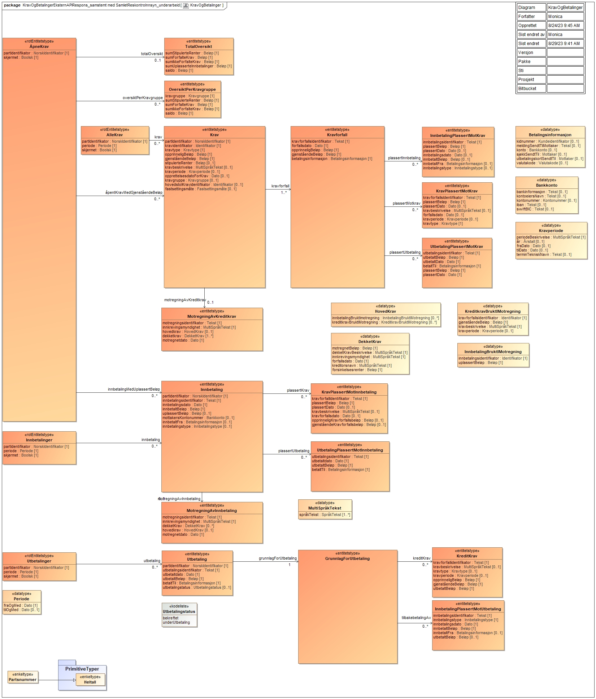
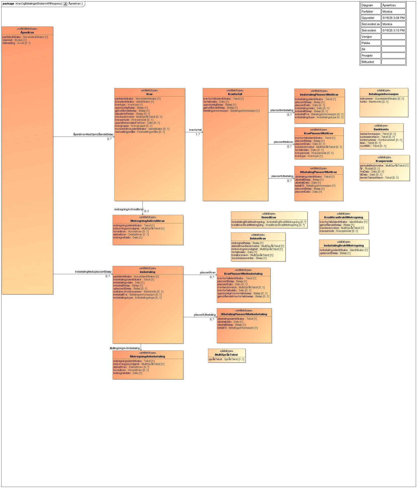
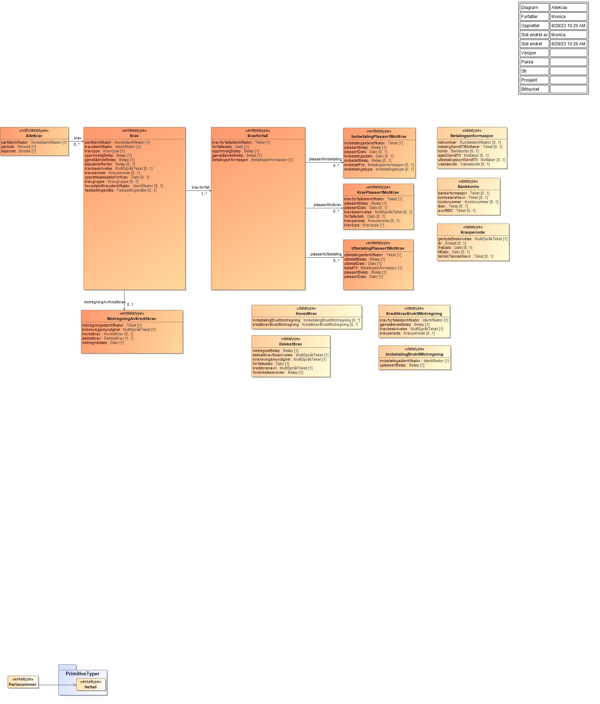
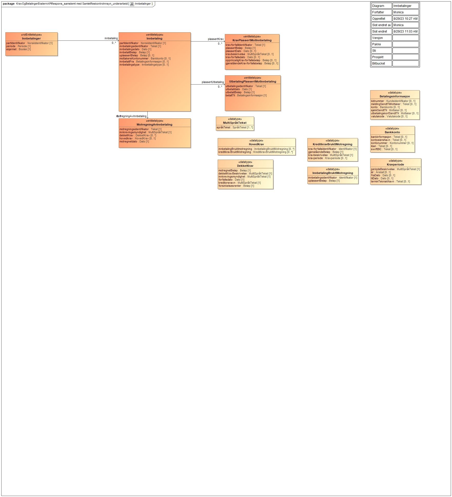
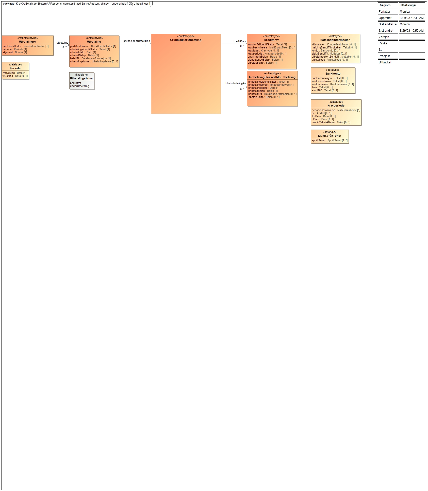

<summary>

Tjeneste som tilbyr oversikt av krav, innbetalinger og utbetalinger tilhørende en part. 

</summary>

<Tabs underline={true}>
<TabItem headerText="Om tjenesten" itemKey="itemKey-1" default>

For generell informasjon om tjenestene se egne sider om:

* [Bruk av tjenestene](../om/bruk.md)
* [Sikkerhetsmekansimer](../om/sikkerhet.md)
* [Rettighetspakker](../om/rettighetspakker.md)
* [Feilhåndtering](../om/feil.md)
* [Versjonering](../om/versjoner.md)
* [Teknisk spesifikasjon](../om/tekniskspesifikasjon.md)

## Scope

Følgende scope skal benyttes ved autentisering i Maskinporten: `skatteetaten:kravogbetalinger`

## Delegering

Tilgang til dette API-et kan delegeres i Altinn, f.eks. dersom leverandør benyttes for den tekniske oppkoblingen. Søk
opp følgende tjeneste i Altinn for å delegere tilgangen: `Krav og betalinger API - På vegne av`

## Teknisk spesifikasjon

URL-er til API-et, beskrivelsen av parameterne, endepunkter og respons ligger
i [Open API spesifikasjonen](https://app.swaggerhub.com/apis/skatteetaten/krav-og-betalinger-api) på SwaggerHub.

API-et har 4 endepunkter:

* __Åpne krav__: Hent oversikt over åpne krav og uplasserte innbetalinger. Gjør oppslag mot reskontrosystemene på åpne
  krav og uplasserte innbetalinger og oppgir de samlet med en summert oversikt
* __Krav__: Hent alle krav innen et gitt tidsrom. Gjør oppslag mot reskontrosystemene på alle krav innen et gitt tidsrom
  på maks ett år.
* __Innbetalinger__: Hent alle innbetalinger innen et gitt tidsrom. Gjør oppslag mot reskontrosystemene på alle
  innbetalinger innen et gitt tidsrom på maks ett år.
* __Utbetalinger__: Hent alle utbetalinger innen et gitt tidsrom. Gjør oppslag mot reskontrosystemene på alle
  utbetalinger innen et gitt tidsrom på maks ett år.

Se også [eksempler](kravogbetalinger?tab=Eksempler) for de ulike endepunktene.

## Rettighetspakker

For denne tjenesten finns følgende rettighetspakker

| Navn på rettighetspakke | Formål med rettighetspakke | Egenskaper ved rettighetspakke |
|-------------------------|----------------------------|--------------------------------|
| finans                  | Banker og finansforetak som skal vise krav og betalinger i nettbank | Finans-rettighetspakken krever bruk av Altinn-samtykke, og den gir tilgang til alle 4 endepunkter med oppslag for virksomheter (vil etter hvert bli utvidet også til oppslag for personer) |
| regnskapssystem         | Regnskapssystemer som skal vise krav og betalinger i sine sluttbrukersystemer | Regnskapssystem-rettighetspakken krever bruk av den nye [Systembruker-løsningen fra Digdir for virksomhet](../om/systemtilgang.md), og gir tilgang til alle 4 endepunkter. Det kommer mer informasjon om Systembruker etter hvert. I pilotfasen vil systemleverandører kun få tilgang til egne data. |

## Samtykke

For rettighetspakken `finans` kreves [samtykke](../om/samtykke.md) for dette API-et.

| ServiceCode | ServiceEditionCode | Formål |
|-------------|--------------------|--------|
| 5928        | 202301             | Kreves for rettighetspakken `finans` |

## Datakatalog

[Datatjenestebeskrivelse](https://dataservice-catalog.fellesdatakatalog.digdir.no/974761076/data-services/662907037321ef0080ea8cbe) i Felles datakatalog.

</TabItem>
<TabItem headerText="Eksempler" itemKey="itemKey-2"> 

## Åpne krav

### Eksempel på request URL

```
https://{env}/api/innkreving/kravogbetalinger/v1/finans/212201782/aapnekrav
```

### Eksempel på respons

```json
{
  "partIdentifikator": "212201782",
  "skjermet": false,
  "aapentKravMedGjenstaaendeBeloep": [
    {
      "partIdentifikator": "212201782",
      "kravidentifikator": "krav-1234",
      "kravtype": "RESTSKATT",
      "opprinneligBeloep": 10000.0,
      "gjenstaaendeBeloep": 10000.0,
      "kravforfall": [
        {
          "kravforfallsIdentifikator": "93d29b06-6cbd-4999-bd23-b0a13c47da51",
          "forfallsdato": "2023-02-21",
          "opprinneligBeloep": 10000.0,
          "gjenstaaendeBeloep": 10000.0,
          "betalingsinformasjon": {
            "konto": {
              "bankinformasjon": "Nordea Bank Norge ASA, Postboks 1166 Sentrum, 0107 Oslo, Norge",
              "kontonummer": "63450624804",
              "iban": "NO42 6345 06 24804",
              "swiftBIC": "NDEANOKK"
            }
          },
          "plassertInnbetaling": [
            {
              "innbetalingsIdentifikator": "inn-12345",
              "plassertBeloep": -1000.0,
              "plassertDato": "2023-02-05",
              "innbetalingsdato": "2023-01-30",
              "innbetaltBeloep": 0.0,
              "innbetaltFra": {
                "konto": {}
              },
              "innbetalingstype": "Bankoverføring"
            }
          ],
          "plassertMotkrav": [
            {
              "kravforfallsIdentifikator": "93d29b06-6cbd-4999-bd23-b0a13c47da51",
              "plassertBeloep": -1000.0,
              "kravtype": "RESTSKATT",
              "plassertDato": "2023-02-05",
              "kravbeskrivelse": {
                "spraakTekst": [
                  {
                    "tekst": "Restskatt",
                    "spraak": "nb"
                  }
                ]
              },
              "forfallsdato": "2023-01-30",
              "kravperiode": {
                "periodeBeskrivelse": {
                  "spraakTekst": [
                    {
                      "tekst": "2023/02",
                      "spraak": "nb"
                    }
                  ]
                }
              }
            }
          ]
        }
      ],
      "stipulerteRenter": 200.0,
      "kravbeskrivelse": {
        "spraakTekst": [
          {
            "tekst": "Restskatt",
            "spraak": "nb"
          }
        ]
      },
      "kravperiode": {
        "periodeBeskrivelse": {
          "spraakTekst": [
            {
              "tekst": "2023/02",
              "spraak": "nb"
            }
          ]
        }
      },
      "opprettelsesdatoForKrav": "2023-01-30",
      "kravgruppe": "Skatt",
      "fastsettingsmaate": "blank"
    },
    {
      "partIdentifikator": "04827896468",
      "kravidentifikator": "krav-1234",
      "kravtype": "RESTSKATT",
      "opprinneligBeloep": 10000.0,
      "gjenstaaendeBeloep": 10000.0,
      "kravforfall": [
        {
          "kravforfallsIdentifikator": "93d29b06-6cbd-4999-bd23-b0a13c47da51",
          "forfallsdato": "2023-02-21",
          "opprinneligBeloep": 10000.0,
          "gjenstaaendeBeloep": 10000.0,
          "betalingsinformasjon": {
            "konto": {
              "bankinformasjon": "Nordea Bank Norge ASA, Postboks 1166 Sentrum, 0107 Oslo, Norge",
              "kontonummer": "63450624804",
              "iban": "NO42 6345 06 24804",
              "swiftBIC": "NDEANOKK"
            }
          },
          "plassertInnbetaling": [
            {
              "innbetalingsIdentifikator": "inn-12345",
              "plassertBeloep": -1000.0,
              "plassertDato": "2023-02-05",
              "innbetalingsdato": "2023-01-30",
              "innbetaltBeloep": 0.0,
              "innbetaltFra": {
                "konto": {}
              },
              "innbetalingstype": "Bankoverføring"
            }
          ],
          "plassertMotkrav": [
            {
              "kravforfallsIdentifikator": "93d29b06-6cbd-4999-bd23-b0a13c47da51",
              "plassertBeloep": -1000.0,
              "kravtype": "RESTSKATT",
              "plassertDato": "2023-02-05",
              "kravbeskrivelse": {
                "spraakTekst": [
                  {
                    "tekst": "Restskatt",
                    "spraak": "nb"
                  }
                ]
              },
              "forfallsdato": "2023-01-30",
              "kravperiode": {
                "periodeBeskrivelse": {
                  "spraakTekst": [
                    {
                      "tekst": "2023/02",
                      "spraak": "nb"
                    }
                  ]
                }
              }
            }
          ]
        }
      ],
      "stipulerteRenter": 200.0,
      "kravbeskrivelse": {
        "spraakTekst": [
          {
            "tekst": "Restskatt",
            "spraak": "nb"
          }
        ]
      },
      "kravperiode": {
        "periodeBeskrivelse": {
          "spraakTekst": [
            {
              "tekst": "2023/02",
              "spraak": "nb"
            }
          ]
        }
      },
      "opprettelsesdatoForKrav": "2023-01-30",
      "kravgruppe": "Skatt",
      "fastsettingsmaate": "blank"
    }
  ],
  "innbetalingMedUplassertBeloep": [
    {
      "partIdentifikator": "212201782",
      "innbetalingsidentifikator": "inn-1234",
      "innbetalingsdato": "2023-03-01",
      "innbetaltBeloep": 1000.0,
      "uplassertBeloep": 0.0,
      "mottakersKontonummer": {
        "kontonummer": "98766543210"
      },
      "innbetaltFra": {
        "konto": {
          "kontoeiersNavn": "LYSTIG KLAM KATT TUSJ",
          "kontonummer": "******43210"
        }
      },
      "innbetalingstype": "bankoverføring"
    },
    {
      "partIdentifikator": "04827896468",
      "innbetalingsidentifikator": "inn-1234",
      "innbetalingsdato": "2023-03-01",
      "innbetaltBeloep": 1000.0,
      "uplassertBeloep": 0.0,
      "mottakersKontonummer": {
        "kontonummer": "98766543210"
      },
      "innbetaltFra": {
        "konto": {
          "kontoeiersNavn": "LYSTIG KLAM KATT TUSJ",
          "kontonummer": "******43210"
        }
      },
      "innbetalingstype": "bankoverføring"
    }
  ],
  "totalOversikt": {
    "sumStipulerteRenter": 400.0,
    "sumForfalteKrav": 20000.0,
    "sumIkkeForfalteKrav": 0.0,
    "sumUplasserteInnbetalinger": 0.0,
    "saldo": 20400.0
  },
  "oversiktPerKravgruppe": [
    {
      "kravgruppe": "Skatt",
      "sumStipulerteRenter": 400.0,
      "sumForfalteKrav": 20000.0,
      "sumIkkeForfalteKrav": 0.0,
      "saldo": 20400.0
    }
  ]
}
```

## Krav

### Eksempel på request URL

```
https://{env}/api/innkreving/kravogbetalinger/v1/finans/212201782/krav?fraOgMed=2023-01-01&tilOgMed=2023-09-01
```

### Eksempel på respons

```json
{
  "partIdentifikator": "212201782",
  "periode": {
    "fraOgMed": "2023-01-01",
    "tilOgMed": "2023-09-01"
  },
  "skjermet": false,
  "krav": [
    {
      "partIdentifikator": "212201782",
      "kravidentifikator": "krav-1234",
      "kravtype": "RESTSKATT",
      "opprinneligBeloep": 10000.0,
      "gjenstaaendeBeloep": 10000.0,
      "kravforfall": [
        {
          "kravforfallsIdentifikator": "93d29b06-6cbd-4999-bd23-b0a13c47da51",
          "forfallsdato": "2023-02-21",
          "opprinneligBeloep": 10000.0,
          "gjenstaaendeBeloep": 10000.0,
          "betalingsinformasjon": {
            "konto": {
              "bankinformasjon": "Nordea Bank Norge ASA, Postboks 1166 Sentrum, 0107 Oslo, Norge",
              "kontonummer": "63450624804",
              "iban": "NO42 6345 06 24804",
              "swiftBIC": "NDEANOKK"
            }
          },
          "plassertInnbetaling": [
            {
              "innbetalingsIdentifikator": "inn-12345",
              "plassertBeloep": -1000.0,
              "plassertDato": "2023-02-05",
              "innbetalingsdato": "2023-01-30",
              "innbetaltBeloep": 0.0,
              "innbetaltFra": {
                "konto": {}
              },
              "innbetalingstype": "Bankoverføring"
            }
          ],
          "plassertMotkrav": [
            {
              "kravforfallsIdentifikator": "93d29b06-6cbd-4999-bd23-b0a13c47da51",
              "plassertBeloep": -1000.0,
              "kravtype": "RESTSKATT",
              "plassertDato": "2023-02-05",
              "kravbeskrivelse": {
                "spraakTekst": [
                  {
                    "tekst": "Restskatt",
                    "spraak": "nb"
                  }
                ]
              },
              "forfallsdato": "2023-01-30",
              "kravperiode": {
                "periodeBeskrivelse": {
                  "spraakTekst": [
                    {
                      "tekst": "2023/02",
                      "spraak": "nb"
                    }
                  ]
                }
              }
            }
          ]
        }
      ],
      "stipulerteRenter": 200.0,
      "kravbeskrivelse": {
        "spraakTekst": [
          {
            "tekst": "Restskatt",
            "spraak": "nb"
          }
        ]
      },
      "kravperiode": {
        "periodeBeskrivelse": {
          "spraakTekst": [
            {
              "tekst": "2023/02",
              "spraak": "nb"
            }
          ]
        }
      },
      "opprettelsesdatoForKrav": "2023-01-30",
      "kravgruppe": "Skatt",
      "fastsettingsmaate": "blank"
    },
    {
      "partIdentifikator": "04827896468",
      "kravidentifikator": "krav-1234",
      "kravtype": "RESTSKATT",
      "opprinneligBeloep": 10000.0,
      "gjenstaaendeBeloep": 10000.0,
      "kravforfall": [
        {
          "kravforfallsIdentifikator": "93d29b06-6cbd-4999-bd23-b0a13c47da51",
          "forfallsdato": "2023-02-21",
          "opprinneligBeloep": 10000.0,
          "gjenstaaendeBeloep": 10000.0,
          "betalingsinformasjon": {
            "konto": {
              "bankinformasjon": "Nordea Bank Norge ASA, Postboks 1166 Sentrum, 0107 Oslo, Norge",
              "kontonummer": "63450624804",
              "iban": "NO42 6345 06 24804",
              "swiftBIC": "NDEANOKK"
            }
          },
          "plassertInnbetaling": [
            {
              "innbetalingsIdentifikator": "inn-12345",
              "plassertBeloep": -1000.0,
              "plassertDato": "2023-02-05",
              "innbetalingsdato": "2023-01-30",
              "innbetaltBeloep": 0.0,
              "innbetaltFra": {
                "konto": {}
              },
              "innbetalingstype": "Bankoverføring"
            }
          ],
          "plassertMotkrav": [
            {
              "kravforfallsIdentifikator": "93d29b06-6cbd-4999-bd23-b0a13c47da51",
              "plassertBeloep": -1000.0,
              "kravtype": "RESTSKATT",
              "plassertDato": "2023-02-05",
              "kravbeskrivelse": {
                "spraakTekst": [
                  {
                    "tekst": "Restskatt",
                    "spraak": "nb"
                  }
                ]
              },
              "forfallsdato": "2023-01-30",
              "kravperiode": {
                "periodeBeskrivelse": {
                  "spraakTekst": [
                    {
                      "tekst": "2023/02",
                      "spraak": "nb"
                    }
                  ]
                }
              }
            }
          ]
        }
      ],
      "stipulerteRenter": 200.0,
      "kravbeskrivelse": {
        "spraakTekst": [
          {
            "tekst": "Restskatt",
            "spraak": "nb"
          }
        ]
      },
      "kravperiode": {
        "periodeBeskrivelse": {
          "spraakTekst": [
            {
              "tekst": "2023/02",
              "spraak": "nb"
            }
          ]
        }
      },
      "opprettelsesdatoForKrav": "2023-01-30",
      "kravgruppe": "Skatt",
      "fastsettingsmaate": "blank"
    }
  ]
}
```

## Innbetalinger

### Eksempel på request URL

```
GET https://{env}/api/innkreving/kravogbetalinger/v1/finans/212201782/innbetalinger?fraOgMed=2023-01-01&tilOgMed=2023-09-01
```

### Eksempel på respons

```json
{
  "partIdentifikator": "212201782",
  "periode": {
    "fraOgMed": "2023-01-01",
    "tilOgMed": "2023-09-01"
  },
  "skjermet": false,
  "innbetaling": [
    {
      "partIdentifikator": "212201782",
      "innbetalingsidentifikator": "inn-1234",
      "innbetalingsdato": "2023-03-01",
      "innbetaltBeloep": 1000.0,
      "uplassertBeloep": 0.0,
      "mottakersKontonummer": {
        "kontonummer": "98766543210"
      },
      "innbetaltFra": {
        "konto": {
          "kontoeiersNavn": "LYSTIG KLAM KATT TUSJ",
          "kontonummer": "******43210"
        }
      },
      "innbetalingstype": "bankoverføring"
    },
    {
      "partIdentifikator": "04827896468",
      "innbetalingsidentifikator": "inn-1234",
      "innbetalingsdato": "2023-03-01",
      "innbetaltBeloep": 1000.0,
      "uplassertBeloep": 0.0,
      "mottakersKontonummer": {
        "kontonummer": "98766543210"
      },
      "innbetaltFra": {
        "konto": {
          "kontoeiersNavn": "LYSTIG KLAM KATT TUSJ",
          "kontonummer": "******43210"
        }
      },
      "innbetalingstype": "bankoverføring"
    }
  ]
}
```

## Utbetalinger

### Eksempel på request URL

```
GET https://{env}/api/innkreving/kravogbetalinger/v1/finans/871978433/utbetalinger?fraOgMed=2022-01-01&tilOgMed=2021-12-31
```

### Eksempel på respons

```json
{
  "partIdentifikator": "312438623",
  "periode": {
    "fraOgMed": "2023-01-01",
    "tilOgMed": "2023-09-01"
  },
  "skjermet": false,
  "utbetaling": [
    {
      "partIdentifikator": "312438623",
      "utbetalingsidentifikator": "147654",
      "utbetaltdato": "2023-08-21",
      "utbetaltBeloep": 62374.0,
      "betaltTil": {
        "meldingSendtTilMottaker": "Tilgode skatt 2023",
        "konto": {
          "kontoeiersNavn": "OVERFØLSOM GLAD TIGER AS",
          "kontonummer": "627xxxxxx"
        },
        "valutakode": "NOK"
      },
      "grunnlagForUtbetaling": {
        "kreditKrav": [
          {
            "kravforfallidentifikator": "6412123",
            "opprinneligBeloep": -62374.0,
            "gjenstaaendeBeloep": 0.0,
            "utbetaltBeloep": 62374.0,
            "kravbeskrivelse": {
              "spraakTekst": [
                {
                  "tekst": "Tibakebetaling restskatt - 2023",
                  "spraak": "nb"
                }
              ]
            },
            "kravtype": "RESTERENDE_SKT_TILB",
            "kravperiode": {
              "periodeBeskrivelse": {
                "spraakTekst": [
                  {
                    "tekst": "Inntektstår",
                    "spraak": "nb"
                  }
                ]
              },
              "aar": "2023"
            }
          }
        ]
      },
      "utbetalingstatus": "bekreftet"
    },
    {
      "partIdentifikator": "312438623",
      "utbetalingsidentifikator": "147654",
      "utbetaltdato": "2023-08-21",
      "utbetaltBeloep": 62374.0,
      "betaltTil": {
        "meldingSendtTilMottaker": "Tilgode skatt 2023",
        "konto": {
          "kontoeiersNavn": "OVERFØLSOM GLAD TIGER AS",
          "kontonummer": "627xxxxxx"
        },
        "valutakode": "NOK"
      },
      "grunnlagForUtbetaling": {
        "kreditKrav": [
          {
            "kravforfallidentifikator": "6412123",
            "opprinneligBeloep": -62374.0,
            "gjenstaaendeBeloep": 0.0,
            "utbetaltBeloep": 62374.0,
            "kravbeskrivelse": {
              "spraakTekst": [
                {
                  "tekst": "Tibakebetaling restskatt - 2023",
                  "spraak": "nb"
                }
              ]
            },
            "kravtype": "RESTERENDE_SKT_TILB",
            "kravperiode": {
              "periodeBeskrivelse": {
                "spraakTekst": [
                  {
                    "tekst": "Inntektstår",
                    "spraak": "nb"
                  }
                ]
              },
              "aar": "2023"
            }
          }
        ]
      },
      "utbetalingstatus": "bekreftet"
    },
    {
      "partIdentifikator": "312438623",
      "utbetalingsidentifikator": "147654",
      "utbetaltdato": "2023-08-21",
      "utbetaltBeloep": 62374.0,
      "betaltTil": {
        "meldingSendtTilMottaker": "Tilgode skatt 2023",
        "konto": {
          "kontoeiersNavn": "OVERFØLSOM GLAD TIGER AS",
          "kontonummer": "627xxxxxx"
        },
        "valutakode": "NOK"
      },
      "grunnlagForUtbetaling": {
        "kreditKrav": [
          {
            "kravforfallidentifikator": "6412123",
            "opprinneligBeloep": -62374.0,
            "gjenstaaendeBeloep": 0.0,
            "utbetaltBeloep": 62374.0,
            "kravbeskrivelse": {
              "spraakTekst": [
                {
                  "tekst": "Tibakebetaling restskatt - 2023",
                  "spraak": "nb"
                }
              ]
            },
            "kravtype": "RESTERENDE_SKT_TILB",
            "kravperiode": {
              "periodeBeskrivelse": {
                "spraakTekst": [
                  {
                    "tekst": "Inntektstår",
                    "spraak": "nb"
                  }
                ]
              },
              "aar": "2023"
            }
          }
        ]
      },
      "utbetalingstatus": "bekreftet"
    }
  ]
}
```

</TabItem>
<TabItem headerText="Feilkoder" itemKey="itemKey-3">

Se egen side for generell info om [feilhåndtering i tjenestene](../om/feil.md).

Tabellen under viser en oversikt over hvilke spesifikke feilkoder denne applikasjonen kan gi. Feilmeldingen vil kunne variere selv om samme feilkode returneres. Dette er for å kunne gi en så presis beskrivelse av feilen som mulig.

| Feilkode | HTTP Statuskode | Feilområde                                                     |
|----------|-----------------|----------------------------------------------------------------|
| KB-001   | 500             | Uventet feil på tjenesten.                                     |
| KB-002   | 500             | Uventet feil i et bakenforliggende system.                     |
| KB-003   | 404             | Ukjent url benyttet.                                           |
| KB-004   | 401             | Feil i forbindelse med autentisering.                          |
| KB-005   | 403             | Feil i forbindelse med samtykketoken.                          |
| KB-006   | 400             | Feil i forbindelse med validering av inputdata.                |
| KB-007   | 404             | Fant ingen krav/betalinger på angitt identifikator og periode. |
| KB-008   | 406             | Feil tilknyttet dataformat. Kun json eller xml er støttet.     |
| KB-009   | 404             | Ingen treff på oppgitt identifikator.                          |

</TabItem>
<TabItem headerText="Informasjonsmodell" itemKey="itemKey-4">

Her ser du hele informasjonsmodellen for Krav og betalinger API med alle 4 endepunktene.

[](../../static/download/Informasjonsmodell_Kravogbetalinger.png)

## Modell pr endepunkt

### Åpne krav

[](../../static/download/Informasjonsmodell_Kravogbetalinger_Aapnekrav.png)

### Krav

[](../../static/download/Informasjonsmodell_Kravogbetalinger_Krav.png)

### Innbetalinger

[](../../static/download/Informasjonsmodell_Kravogbetalinger_Innbetalinger.png)

### Utbetalinger

[](../../static/download/Informasjonsmodell_Kravogbetalinger_Utbetalinger.png)

### Feltbeskrivelser

| Eier                    | Element                      | Dokumentasjon                                                                                                                                                                                                                                                                                         |
| ----------------------- | ---------------------------- | ----------------------------------------------------------------------------------------------------------------------------------------------------------------------------------------------------------------------------------------------------------------------------------------------------- |
| AlleKrav                | krav                         | Vanligvis en debettransaksjon i reskontro, som kjennetegnes av at den skal betales av en debitor.                                                                                                                                                                                                     |
| AlleKrav                | partIdentifikator            | Part er rettssubjekt som har eller kan få rettigheter eller plikter innenfor Skatteetatens virkeområde, eller som Skatteetaten har rettigheter eller plikter i forhold til; i denne kontekst med partIdentifikator menes unikt identifikator for Part, f.eks. organisasjonsnummer eller fødselsnummer |
| AlleKrav                | periode                      | etterspurt periode                                                                                                                                                                                                                                                                                    |
| Innbetaling             | betaltFra                    | konto innbetalingen ble betalt fra og evt. kidnummmer                                                                                                                                                                                                                                                 |
| Innbetaling             | betaltTilKonto               | konto innbetalingen ble betalt til                                                                                                                                                                                                                                                                    |
| Innbetaling             | innbetalingsdato             | Dato innbetaling var effektuert                                                                                                                                                                                                                                                                       |
| Innbetaling             | innbetalingsidentifikator    | unikt identifikator for innbetaling                                                                                                                                                                                                                                                                   |
| Innbetaling             | innbetalingstype             | klassifisering av innbetalinger                                                                                                                                                                                                                                                                       |
| Innbetaling             | innbetaltBeløp               | beløp innbetalt                                                                                                                                                                                                                                                                                       |
| Innbetaling             | partIdentifikator            | Part er rettssubjekt som har eller kan få rettigheter eller plikter innenfor Skatteetatens virkeområde, eller som Skatteetaten har rettigheter eller plikter i forhold til; i denne kontekst med partIdentifikator menes unikt identifikator for Part, f.eks. organisasjonsnummer eller fødselsnummer |
| Innbetaling             | plassertInnbetalingMotKrav   | innbetaling som er plassert mot et gitt krav                                                                                                                                                                                                                                                          |
| Innbetaling             | uplassertBeløp               | innbetalingens gjenstående beløp som er ikke enda plassert mot en krav                                                                                                                                                                                                                                |
| Innbetalinger           | innbetaling                  | overføring av penger til kreditor eller kreditors representant.                                                                                                                                                                                                                                       |
| Innbetalinger           | partIdentifikator            | Part er rettssubjekt som har eller kan få rettigheter eller plikter innenfor Skatteetatens virkeområde, eller som Skatteetaten har rettigheter eller plikter i forhold til; i denne kontekst med partIdentifikator menes unikt identifikator for Part, f.eks. organisasjonsnummer eller fødselsnummer |
| Innbetalinger           | periode                      | etterspurt periode                                                                                                                                                                                                                                                                                    |
| Krav                    | gjenståendeBeløp             | beløp som er ikke dekket av innbetalinger eller plasserte motkrav.                                                                                                                                                                                                                                    |
| Krav                    | kravbeskrivelse              | ledetekst - beskrivelse av krav slik den kommer inn i saksbehandlingssystem                                                                                                                                                                                                                           |
| Krav                    | kravforfall                  | frist for å betale krav. En krav kan ha flere forfall(frister), med ulike beløp i vise tilfeller (f. eks. forskuddsskatt).                                                                                                                                                                            |
| Krav                    | kravgruppe                   | overordnet klassifisering av krav basert på innkrevingsområdet de tilhører til.                                                                                                                                                                                                                       |
| Krav                    | kravidentifikator            | unikt identifikator for krav                                                                                                                                                                                                                                                                          |
| Krav                    | kravperiode                  | periode kravet gjelder for, typisk en termin / skattleggingsperiode.                                                                                                                                                                                                                                  |
| Krav                    | kravtype                     | kategorisering av krav                                                                                                                                                                                                                                                                                |
| Krav                    | opprettelsesdatoForKrav      | dato når krav var opprettet                                                                                                                                                                                                                                                                           |
| Krav                    | opprinneligBeløp             | opprinelige beløp kravet var registrert                                                                                                                                                                                                                                                               |
| Krav                    | partIdentifikator            | Part er rettssubjekt som har eller kan få rettigheter eller plikter innenfor Skatteetatens virkeområde, eller som Skatteetaten har rettigheter eller plikter i forhold til; i denne kontekst med partIdentifikator menes unikt identifikator for Part, f.eks. organisasjonsnummer eller fødselsnummer |
| Krav                    | stipulerteRenter             | rente etablert etter gjeldende lov når kravet ikke innfris ved forfall                                                                                                                                                                                                                                |
| Kravforfall             | betalingsinformasjon         | betalingsdetaljer; kan inneholde f. eks. KIDnummer og bankkonto                                                                                                                                                                                                                                       |
| Kravforfall             | forfallsdato                 | Betalingsfrist eller forfall eller forfallsdato for en krav                                                                                                                                                                                                                                           |
| Kravforfall             | gjenståendeBeløp             | beløp som er ikke dekket av innbetalinger eller plasserte motkrav for denne betalingsfrist.                                                                                                                                                                                                           |
| Kravforfall             | kravforfallsIdentifikator    | unikt identifikator for kravforfall                                                                                                                                                                                                                                                                   |
| Kravforfall             | opprinneligBeløp             | opprinelige beløp tilsvarende frist for kravet                                                                                                                                                                                                                                                        |
| Kravforfall             | plassertInnbetaling          | innbetaling som er plassert mot et gitt krav med en gitt betalingsfrist                                                                                                                                                                                                                               |
| Kravforfall             | plassertMotkrav              | motkrav som ble plassert mot en krav i en oppgjøring.                                                                                                                                                                                                                                                 |
| Kravforfall             | utsattIverksettelse          | Når vilkårene for en omgjøring av enkel vedtak (f.eks. fastsetting) er tilstede, kan forvaltningen utsette iverksettelsen inntil det er bestemt om omgjøring skal skje. Det er også adgang til å utsette iverksettelsen i forbindelse med klage og søksmål.                                           |
| KravOgBetalinger        | AlleKrav                     | oversikt over gjeld, tilgodebeløp og betalinger mellom deg og Skatteetaten                                                                                                                                                                                                                            |
| KravOgBetalinger        | ÅpneKrav                     | oversikt over krav med gjenstående beløp (åpne krav) og eventuelle uplasserte innbetalinger.                                                                                                                                                                                                          |
| KravOgBetalinger        | Innbetaling                  | overføring av penger til kreditor eller kreditors representant.                                                                                                                                                                                                                                       |
| KravOgBetalinger        | Innbetalinger                | viser alle innbetalinger for en valgt periode. Du får oversikt over innbetalinger som er gjort, og hvilke krav som har blitt dekket.                                                                                                                                                                  |
| KravOgBetalinger        | Krav                         | Krav (pengekrav) er forpliktelse til å betale eller rett til å motta en bestemt sum penger.                                                                                                                                                                                                           |
| KravOgBetalinger        | Kravforfall                  | forfall, forfallsdag eller forfallstid er det tidspunkt da en fordring kan kreves oppfylt (skal betales). Forfallsdato for skatte- og avgiftskrav er lovbestemt.                                                                                                                                      |
| KravOgBetalinger        | KreditKrav                   | rett til å motta en bestemt sum penger                                                                                                                                                                                                                                                                |
| KravOgBetalinger        | OversiktPerKravgruppe        | oversikt over saldo, stipulerte renter og krav (forfallte og ikke forfalte) gruppert per kravgrupe ved forespørsels tidspunkt                                                                                                                                                                         |
| KravOgBetalinger        | PlasseringAvInnbetaling      | angivelse av beløp fra kreditpost som går til dekning av debetpost                                                                                                                                                                                                                                    |
| KravOgBetalinger        | PlassertInnbetaling          | viser detaljer av hvilken innbetaling er plassert mot krav                                                                                                                                                                                                                                            |
| KravOgBetalinger        | PlassertMotkrav              | viser detaljer av hvilken motkrav er plassert mot krav                                                                                                                                                                                                                                                |
| KravOgBetalinger        | TotalOversikt                | oversikt over saldo, stipulerte renter, forfalte og ikke forfalte krav for forespurt part                                                                                                                                                                                                             |
| KravOgBetalinger        | Utbetaling                   | overføring av penger fra kreditor eller kreditors representant.                                                                                                                                                                                                                                       |
| KravOgBetalinger        | Utbetalinger                 | oversikt over utbetalinger utført til en part                                                                                                                                                                                                                                                         |
| KreditKrav              | dekketKrav                   | beskrivelse av kravet utbetalingen ble plassert mot                                                                                                                                                                                                                                                   |
| KreditKrav              | gjenståendeBeløp             | gjenstående til utbetaling                                                                                                                                                                                                                                                                            |
| KreditKrav              | kravIdentifikator            | unikt identifikator for krav                                                                                                                                                                                                                                                                          |
| KreditKrav              | kravperiode                  | periode kravet gjelder for, typisk en termin / skattleggingsperiode.                                                                                                                                                                                                                                  |
| KreditKrav              | kravtype                     | kategorisering av krav                                                                                                                                                                                                                                                                                |
| KreditKrav              | opprinneligBeløp             | opprinnelig tilgode beløp                                                                                                                                                                                                                                                                             |
| OversiktPerKravgruppe   | kravgruppe                   | overordnet klassifisering av krav basert på innkrevingsområdet de tilhører til.                                                                                                                                                                                                                       |
| OversiktPerKravgruppe   | saldo                        | differanse mellom skyldte krav og innbetalinger og motkrav som ble plassert mot disse krav på tidspunktet forespørselen ble gjørt (per kravgruppe)                                                                                                                                                    |
| OversiktPerKravgruppe   | sumForfalteKrav              | krav med gjenstående beløp som er ikke dekket etter forfall                                                                                                                                                                                                                                           |
| OversiktPerKravgruppe   | sumIkkeForfalteKrav          | åpne krav - krav med gjenstående beløp som ikke har passert forfallsdato                                                                                                                                                                                                                              |
| OversiktPerKravgruppe   | sumStipulerteRenter          | rente etablert etter gjeldende lov når kravet ikke innfris ved forfall                                                                                                                                                                                                                                |
| PlasseringAvInnbetaling | dekketKrav                   | beskrivelse av kravet innbetalingen ble plassert mot                                                                                                                                                                                                                                                  |
| PlasseringAvInnbetaling | gjenståendeKravforfallsbeløp | beløp som er ikke dekket av innbetalinger eller plasserte motkrav for denne betalingsfrist.                                                                                                                                                                                                           |
| PlasseringAvInnbetaling | kravforfallIdentifikator     | unikt identifikator for kravforfall                                                                                                                                                                                                                                                                   |
| PlasseringAvInnbetaling | kravforfallsdato             | forfall, forfallsdag eller forfallstid, er det tidspunkt da en fordring kan kreves oppfylt (skal betales). Forfallsdato for skatte- og avgiftskrav er lovbestemt.                                                                                                                                     |
| PlasseringAvInnbetaling | opprinneligKravforfallsbeløp | opprinelige beløp tilsvarende fristen for kravet som var dekket med denne innbetaling                                                                                                                                                                                                                 |
| PlasseringAvInnbetaling | plasseringsdato              | dato når innbetaling var plassert mot krav.                                                                                                                                                                                                                                                           |
| PlasseringAvInnbetaling | plassertBeløp                | innbetaling som er plassert mot et gitt krav                                                                                                                                                                                                                                                          |
| PlassertInnbetaling     | betaltFra                    | konto innbetalingen ble betalt fra og evt. kidnummmer                                                                                                                                                                                                                                                 |
| PlassertInnbetaling     | innbetalingsdato             | Dato innbetaling var effektuert                                                                                                                                                                                                                                                                       |
| PlassertInnbetaling     | innbetalingsIdentifikator    | unikt identifikator for innbetaling                                                                                                                                                                                                                                                                   |
| PlassertInnbetaling     | innbetalingstype             | klassifisering av innbetalinger                                                                                                                                                                                                                                                                       |
| PlassertInnbetaling     | innbetaltBeløp               | beløp innbetalt                                                                                                                                                                                                                                                                                       |
| PlassertInnbetaling     | plasseringsdato              | dato når innbetaling var plassert mot krav.                                                                                                                                                                                                                                                           |
| PlassertInnbetaling     | plassertBeløp                | beløp fra innbetaling som er plassert mot et gitt krav                                                                                                                                                                                                                                                |
| PlassertMotkrav         | motkravBeskrivelse           | beskrivelse av motkrav                                                                                                                                                                                                                                                                                |
| PlassertMotkrav         | motkravForfallsdato          | frist for den plasserte motkrav                                                                                                                                                                                                                                                                       |
| PlassertMotkrav         | motkravForfallsIdentifikator | unikt identiifkator for motkravforfall                                                                                                                                                                                                                                                                |
| PlassertMotkrav         | plasseringsdato              | dato når motkrav ble plassert mot en krav.                                                                                                                                                                                                                                                            |
| PlassertMotkrav         | plassertBeløp                | beløp fra motkrav som er plassert mot et gitt krav                                                                                                                                                                                                                                                    |
| TotalOversikt           | saldo                        | differanse mellom skyldte krav og innbetalinger og motkrav som ble plassert mot disse krav på tidspunktet forespørselen ble gjørt                                                                                                                                                                     |
| TotalOversikt           | sumForfalteKrav              | total krav med gjenstående beløp som er ikke dekket etter forfall                                                                                                                                                                                                                                     |
| TotalOversikt           | sumIkkeForfalteKrav          | åpne krav - krav med gjenstående beløp som ikke har passert forfallsdato                                                                                                                                                                                                                              |
| TotalOversikt           | sumStipulerteRenter          | rente etablert etter gjeldende lov når kravet ikke innfris ved forfall                                                                                                                                                                                                                                |
| TotalOversikt           | sumUplasserteInnbetalinger   | innbetalinger som ble gjort, men ikke plassert eller delvis plassert mot krav                                                                                                                                                                                                                         |
| Utbetaling              | betaltTil                    | konto utbetalingen ble betalt til og evt. kidnummmer                                                                                                                                                                                                                                                  |
| Utbetaling              | grunnlagForUtbetaling        | utbetalingens grunnlag; inneholder detaljer om kredit krav                                                                                                                                                                                                                                            |
| Utbetaling              | partIdentifikator            | Part er rettssubjekt som har eller kan få rettigheter eller plikter innenfor Skatteetatens virkeområde, eller som Skatteetaten har rettigheter eller plikter i forhold til; i denne kontekst med partIdentifikator menes unikt identifikator for Part, f.eks. organisasjonsnummer eller fødselsnummer |
| Utbetaling              | utbetalingIdentifikator      | unikt identifikator for utbetaling                                                                                                                                                                                                                                                                    |
| Utbetaling              | utbetalingsbeskrivelse       | beskrivelse av utbetaling                                                                                                                                                                                                                                                                             |
| Utbetaling              | utbetaltBeløp                | sum av alle kravene som blir utbetalt.                                                                                                                                                                                                                                                                |
| Utbetaling              | utbetaltdato                 | dato for betaling av kravet                                                                                                                                                                                                                                                                           |
| Utbetalinger            | partIdentifikator            | Part er rettssubjekt som har eller kan få rettigheter eller plikter innenfor Skatteetatens virkeområde, eller som Skatteetaten har rettigheter eller plikter i forhold til; i denne kontekst med partIdentifikator menes unikt identifikator for Part, f.eks. organisasjonsnummer eller fødselsnummer |
| Utbetalinger            | periode                      | etterspurt periode                                                                                                                                                                                                                                                                                    |
| Utbetalinger            | utbetaling                   | overføring av penger fra kreditor eller kreditors representant.                                                                                                                                                                                                                                       |
| ÅpneKrav                | åpentKravMedGjenståendeBeløp | Vanligvis en debettransaksjon i reskontro, som kjennetegnes av at den skal betales av en debitor.                                                                                                                                                                                                     |
| ÅpneKrav                | innbetalingMedUplassertBeløp | overføring av penger til kreditor eller kreditors representant.                                                                                                                                                                                                                                       |
| ÅpneKrav                | oversiktPerKravgruppe        | oversikt over saldo, stipulerte renter og krav (forfallte og ikke forfalte) gruppert per kravgrupe ved forespørsels tidspunkt                                                                                                                                                                         |
| ÅpneKrav                | partIdentifikator            | Part er rettssubjekt som har eller kan få rettigheter eller plikter innenfor Skatteetatens virkeområde, eller som Skatteetaten har rettigheter eller plikter i forhold til; i denne kontekst med partIdentifikator menes unikt identifikator for Part, f.eks. organisasjonsnummer eller fødselsnummer |
| ÅpneKrav                | totalOversikt                | oversikt over saldo, forfalte og ikke forfalte krav og renter for forespurt part                                                                                                                                                                                                                      |

</TabItem>
<TabItem headerText="Test" itemKey="itemKey-5">

I første omgang er det test kun tilgjengelig for et utvalg leverandører som det er inngått avtale med og som skal være
med å pilotere løsningene.

## Tenor testdatasøk

Det finnes pt. ikke søk i [Tenor](../test/tenor.md) for denne tjenesten, og testdata er derfor listet her.
Men egenskaper ved enhetene som har testdata kan søkes frem i Tenor.

## Testdata

Følgende enkeltmannsforetak (ENK) er tilgjengelige for denne tjenesten i Skatteetatens testmiljø for eksterne.
Vær oppmerksom på at det er et levende testdatasett som kan endre seg i løpet av testperioden. Ta kontakt dersom du har
behov for ytterligere testdata.

Obs. regnskapssystemer som tester vil i Test kunne gjøre oppslag på alle testvirksomheter, selv om de i pilotperioden kun kan gjøre oppslag for egen virksomhet i Prod.

| Organisasjonsnummer | 
|---------------------|
| 313367002           |
| 311851381           |
| 314961900           |
| 314055403           |
| 212201782           |

</TabItem>
</Tabs>


