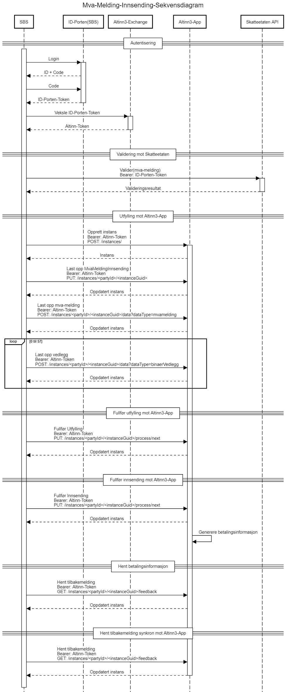

<Summary>Tjenesten brukes til innsending av Mva-melding.</Summary>

<Tabs underline={true}>
<TabItem headerText="Om tjenesten" itemKey="itemKey-1" default>

For generell informasjon om tjenestene se egne sider om:
* [Sikkerhetsmekanismer](../om/sikkerhet.md)
* [Feilhåndtering](../om/feil.md)
* [Versjonering](../om/versjoner.md)

## Tilgang til API-et

### Scope
Altinn krever også at man har et Altinn scope ved kall mot altinn3-appen, de aktuelle vil være `altinn:instances.read` og `altinn:instances.write` for sluttbrukersystem.
[https://docs.altinn.studio/nb/authentication/what-do-you-get/id-porten/](https://docs.altinn.studio/nb/authorization/getting-started/authentication/id-porten/)

## Sikkerhet
For mva-meldinginnsending er det Altinn token som brukes:

https://docs.altinn.studio//nb/api/authentication/id-porten/#veksling-av-access-token-til-altinn-token

## Teknisk spesifikasjon

### Introduksjon

API'ene fungerer for følgende kategorier skattemeldinger for merverdiavgift: Ordinær mva-melding (RF-0002/0004), mva-melding for omvendt avgiftsplikt (RF-0005) og Skattemelding for merverdiavgiftskompensasjon (RF-0009). Når disse meldingene skal sendes til Skatteetaten fra et sluttbrukersystem (SBS) burde disse APIene brukes:

1. Skatteetatens MVA-Melding validerings API
2. Skatteetatens Altinn3 MVA-Melding-Innsending's API

I API-beskrivelsen brukes mva-melding som en samlebetegnelse på de ulike meldingstypene. API'ene beskrives under.

### Prosess innsending og validering
Innsending av Mva Melding gjøres mot Skatteetatens Altinn3 Instans API for Innsending. Detaljert beskrivelse av Altinn3's Instans-API finnes her 
[Altinn Studio Instans API](https://docs.altinn.studio/api/apps/instances/). Inngående kjennskap til dette API'et er ikke nødvendig da denne dokumentasjonen dekker behovet for Mva Melding Innsending.

Det anbefales å benytte [swagger dokumentasjonen](https://skd.apps.tt02.altinn.no/skd/mva-melding-innsending-etm2/swagger/index.html) sammen med denne API-beskrivelsen.

Prosessen gjennomføres med en sekvens av kall mot Instans-API´et og beskrives i detalj under sekvensdiagrammet og er som følger:

1. Autentisering
    * Veksle ID-porten token til Altinn-token
2. Validering mot Skatteetaten
3. Utfylling mot Altinn3-App

    * Opprett instans mot Altinn3-App
    * Last opp MvaMeldingInnsending mot Altinn3-App
    * Last opp mva-melding mot Altinn3-App
    * Last opp vedlegg mot Altinn3-App
4. Fullfør utfylling mot Altinn3-App
5. Fullfør innsending mot Altinn3-App
6. Hent betalingsinformasjon mot Altinn3-App
7. Hent tilbakemelding mot Altinn3-App

Instans API'et til Mva Melding Innsending er tilgjengelig på denne URLen:
```
instansApiUrl = "https://skd.apps.altinn.no/skd/mva-melding-innsending-v1/instances"
```
I følgende sekvensdiagram vil applikasjonsUrl'en være skjult, så hvis det er skrevet ``` POST: /intances/ ``` så er det implisitt ``` POST: instansApiUrl ```




### Valider skattemelding

https://skatteetaten.github.io/api-dokumentasjon/api/mvameldingvalidering?tab=Om+tjenesten

### Opprett Instans

```JSON
POST {applikasjonsUrl}/instances/
HEADERS:
    "Authorization": "Bearer " + "{altinnToken}"
    "content-type": "application/json"
CONTENT/BODY:
    {
        "instanceOwner": {
            "organisationNumber": "{organisasjonsnummer}"
            }
    }
```

### Last Opp MvaMeldingInnsending

```
PUT {mvaMeldingInnsendingsUrl}
HEADERS:
    "Authorization": "Bearer " + "{altinnToken}"
    "content-type": "application/xml"
```

```XML
Content:
<?xml version="1.0" encoding="UTF-8"?>
<mvaMeldingInnsending>
    ...
</mvaMeldingInnsending>
```

### Last opp MvaMelding

```JSON
POST {instansUrl}/data?datatype=mvamelding
HEADERS:
    "Authorization": "Bearer " + "{altinnToken}"
    "content-type": "text/xml"
    "Content-Disposition": "attachment; filename=mvaMelding.xml"
```
```XML
Content:
<?xml version="1.0" encoding="UTF-8"?>
<mvaMeldingDto xmlns="no:skatteetaten:fastsetting:avgift:mva:skattemeldingformerverdiavgift:v1.0">
    ...
</mvaMeldingDto>
```
### Last Opp Vedlegg

```JSON
POST {instansUrl}/data?datatype=binaerVedlegg
HEADERS:
    "Authorization": "Bearer " + "{altinnToken}"
    "content-type": "application/pdf"
    "Content-Disposition": "attachment; filename=merknaderTilMvaMeldingen.pdf"
Content:
{pdf-vedlegg i binærformat}
```

### Fullfør utfylling

```JSON
PUT {instansUrl}/process/next
HEADERS:
    "Authorization": "Bearer " + "{altinnToken}"
    "content-type": "application/json"
```

### Fullfør MvaMeldingInnsending

```JSON
PUT {instansUrl}/process/next
HEADERS:
    "Authorization": "Bearer " + "{altinnToken}"
    "content-type": "application/json"
```

### Hent betalingsinformasjon
Med en gang mva-meldingen har blitt sendt helt inn er betalingsinformasjonen tilgjengelig for nedlastning fra altinn instansen.

```JSON
GET {instansUrl}/data/{instanceGuid}
HEADERS:
    "Authorization": "Bearer " + "{altinnToken}"
    "content-type": "application/json"
```
Hvor `{instanceGuid}` er UUIDen til data elementet med dataType=betalingsinformasjon.


### Hent tilbakemelding
Når en melding er sendt inn vil instansen ha `process.currentTask.name = "Tilbakemelding"`. 
Når den er ferdig behandlet av Skatteetaten vil den være `process.currentTask = null`, og en fil med `dataType = kvittering` lastet opp.

```JSON
GET {instansUrl}/data/{instanceGuid}
HEADERS:
    "Authorization": "Bearer " + "{altinnToken}"
    "content-type": "application/json"
```
Hvor `{instanceGuid}` er UUIDen til data elementet med `dataType = kvittering` eller `dataType = valideringsresultat`.

</TabItem>

<TabItem headerText="Feilkoder" itemKey="itemKey-2">

Se egen side for generell info om [feilhåndtering i tjenestene](../om/feil.md).

Tabellen under viser en oversikt over hvilke spesifikke feilkoder denne applikasjonen kan gi. Feilmeldingen vil kunne variere selv om samme feilkode returneres. Dette er for å kunne gi en så presis beskrivelse av feilen som mulig.
  
| HTTP Statuskode | Feilområde                                                 |
|-----------------|------------------------------------------------------------|
| 500             | Uventet feil på tjenesten.                                 |
| 500             | Uventet feil i et bakenforliggende system.                 |
| 404             | Ukjent url benyttet.                                       |
| 401             | Feil i forbindelse med autentisering.                      |
| 403             | Feil i forbindelse med autorisering.                       |
| 400             | Feil i forbindelse med validering av inputdata.            |
| 404             | Ingen mva-melding funnet på oppgitt referanse.             |
| 406             | Feil tilknyttet dataformat. Kun json eller xml er støttet. |
  
</TabItem>
<TabItem headerText="Informasjonsmodell" itemKey="itemKey-3">

## XSD for mva-meldingen

### XSD for mva-meldingen versjon 1.0
Mva-meldingen sendes inn i XML-format. Den må være i henhold til strukturen dokumentert i XSD for mva-melding.
Versjon 1.0 av denne XSD'en ligger her: no.skatteetaten.fastsetting.avgift.mva.skattemeldingformerverdiavgift.v1.0.xsd
Grafisk fremstilling av xsd og kodelister for [](../../static/img/SkattemeldingForMerverdiavgift2020.png) 

SAF-T standarden inneholder også kodene 0 (Ingen merverdiavgiftsbehandling (anskaffelser)), 7 (Ingen merverdiavgiftsbehandling (inntekter)), 20 (Kostnad ved innførsel av varer, ingen merverdiavgiftsbehandling)
, 21 (Kostnader ved innførsel av varer, alminnelig sats) og 22 (Kostnader ved innførsel av varer, redusert sats, middels). Disse skal ikke rapporteres i mva-meldingen.

### Kompensasjon i alminnelig mva-melding
Fra 01.01.2023 er spesifikasjonen «Kjøp med kompensasjonsrett» lagt til på 5 koder i mva-melding, i tillegg til de eksisterende spesifikasjonene. De berørte kodene med ny spesifikasjon er 81, 83, 86, 88 og 91. Felles for disse kodene er at innførsel av varer og tjenester (pluss innenlands kjøp av klimakvoter og gull) utløser utgående innførselsmerverdiavgift og at en har enten kompensasjonsrett for inngående mva eller direkte fradragsrett for inngående mva. Virksomheter som bruker disse kodene i ordinær mva-melding kan kreve kompensasjon ved å levere kompensasjonsmelding i tillegg.

## Feltbeskrivelse for mva-melding

<br />

#### MVAMelding
| Felt |	Beskrivelse | Formål |
|:------------------|:---------------------------------|:---------------------------------------------------------|
| meldingskategori | Type skjema som sendes inn | Å sikre at brukeren dekker sin plikt for egenfastsetting |
| merknad | Informasjon om innholdet i mva-meldingen  | Å sikre at skattepliktig kan forklare egen rettsanvendelse der det er nødvendig |

<br />

#### Skattepliktig
| Felt |	Beskrivelse | Formål |
|:--------------------|:-----------------------------------------------------------------------|:---------------------------------------------------|
| organisasjonsnummer | Unik identifikator for den skattepliktige som foretar egenfastsetting  | Ivareta den skattepliktiges rettigheter og plikter |

<br />

#### Innsending
| Felt |	Beskrivelse | Formål |
|:--------------------------|:-----------------------------------------------|:-----------------------------------------------------------------------------------|
| regnskapssystemrefereanse | Skattepliktiges unike referanse for innsending |  Sikre at skattepliktig og skattekontoret refererer til samme melding |
| system | Navn og evt versjon for regnskapssystem |  Å kunne følge opp systematiske feil med systemleverandør i stedet for å følge opp hver enkelt skattepliktig |

<br />

#### Betalingsinformasjon
| Felt |	Beskrivelse | Formål |
|:----|:------------------------------------------|:--------------------------------------------------|
| KID | Mottakerens identifikasjon av en betaling | Å kunne betale til de bankkontoene som krever KID |

<br />

#### Skattegrunnlag og beregnet skatt
| Felt |	Beskrivelse | Formål |
|:-----------------------|:------------------------------------------------------------------------------------------------------------------------------------------------------------------------------------------------------------------------|:-----------------------------------------------------|
| skattleggingsperiode | Den perioden egenfastsettingen gjelder for. Periode angis i henhold til kodeverket for Skattleggingsperiode. SkattleggingsperiodeUke følger kalenderens ukenummerering, eksempelvis løper uke 1 i 2022 fra 3. til 9. januar. I SkattleggingsperiodeHalvmåndelig løper første halvdel fra 1. til 15. i måneden og andre halvdel løper fra 16. til siste i måneden. |  Sikre samsvar mellom bokføring og egenfastsetting |
| fastsattMerverdiavgift | Sum å betale/sum til gode |  Å sikre at riktig beløp blir betalt |

<br />

#### MvaSpesifikasjonslinje
| Felt |	Beskrivelse | Formål |
|:-----------------------|:---------------------------------------------------------------------------------------------------------------------------------------------------------------------------------------------------------|:----------------------------------------------------------------------------|
| mvaKode | Klassifikasjon av inngående og utgående mva ihht til norsk SAF-T standard  | Formidling av hvilke mva-vurderinger som er utført |
| spesifikasjon | Detaljering av noen mva-forhold som ikke inngår i norsk SAF-T standard |  Formidling av hvilke mva-vurderinger som er utført |
| mvaKodeRegnskapssystem | intern mva-kode i regnskapssystemet. Det kan være flere interne mva-koder for en mvaKode og evt spesifikasjon. I det tilfellet vil det bli flere rader i mva-meldingen pr mvaKode og spesifikasjon; en pr kombinasjon av mva-kode, spesifikasjon og mvaKodeRegnskapssystem. |  To hensyn Brukerne: gjenkjennelig i forhold til det de ser i regnskapet. Systemleverandørene skal slippe å legge om mva-koder i systemene |
| grunnlag | Det beløpet det er regnet utgående mva av. Feltet skal ikke fylles ut for inngående mva | Grunnlag for kontroll ifra Skatteetaten |
| sats | Den mva-satsen som er benyttet ved beregning av utgående mva. Feltet skal ikke fylles ut for inngående mva |  Å sikre at bare gyldige satser benyttes ved fakturering |
| merverdiavgift | Fastsatt merverdiavgift | Å vise beregnet mva pr linje |
| merknad | Informasjon om innholdet i mvaKode |  Å sikre at skattepliktig kan forklare egen rettsanvendelse der det er nødvendig |

<br />
<br />

## Feltbeskrivelse for MvaMeldingInnsending

#### MvaMeldingInnsending 
| Felt |	Beskrivelse | Formål |
|:---------------------|:-----------------------------------------------------------------------------------------------------------------------------------------------------------------------------------------------|:-------------------------------|
| meldingskategori | Type skjema som sendes inn | Å sikre at brukeren dekker sin plikt for egenfastsetting |
| innsendingstype | En mva-melding av meldingskategori alminnelig og primær vil alltid være komplett. | Feltet beholdes for på et senere tidspunkt kunne åpne for at revisor kommenterer/ skriver merknad på de mva-meldingene (f. eks. merverdiavgift kompensasjon) som skal godkjennes av revisor før innsending. |
| instansstatus | Dette feltet kommer vi til å fjerne da vi får denne informasjonen fra hendelser på instansen. Dette skal gjøres ved at det settes til valgfritt i en overgang og fases ut ved en passende anledning.  |  |
| opprettetAv | Dette feltet skal inneholde navn på innlogget bruker | Innholdet i denne vises i Altinn. |
| opprettingstidspunkt | Dette feltet kommer vi til å fjerne da vi får denne informasjonen fra instansen. Dette skal gjøres ved at det settes til valgfritt i en overgang og fases ut ved en passende anledning. |  |

<br />

#### Identifikator (Enten organisasjonsnummer eller foedselsnummer)
| Felt |	Beskrivelse | Formål |
|:--------------------|:-----------------------------------------------------------------------|:---------------------------------------------------|
| organisasjonsnummer | Unik identifikator for den skattepliktige som foretar egenfastsetting  | Ivareta den skattepliktiges rettigheter og plikter |
| foedselsnummer | Unik identifikator for den skattepliktige som foretar egenfastsetting |  Ivareta den skattepliktiges rettigheter og plikter |

<br />

#### Skattleggingsperiode
| Felt |	Beskrivelse | Formål |
|:--------|:-----------------------------------------------------------------------------------------------------------------------------------------------------------------------------------------------------------------------------------------------------|:---------------------------------------------|
| periode | Den perioden egenfastsettingen gjelder for. Periode angis i henhold til kodeverket for Skattleggingsperiode. SkattleggingsperiodeUke følger kalenderens ukenummerering, eksempelvis løper uke 1 i 2022 fra 3. til 9. januar. I SkattleggingsperiodeHalvmåndelig løper første halvdel fra 1. til 15. i måneden og andre halvdel løper fra 16. til siste i måneden  | Sikre samsvar mellom bokføring og egenfastsetting |
| aar | Det året egenfastsettingen gjelder for | Sikre samsvar mellom bokføring og egenfastsetting |

<br />

#### Vedlegg
| Felt |	Beskrivelse | Formål |
|:---------------------|:----------------------------------------------------------------------------------------------------------------------------------------------------------------------------------------|:---------------------|
| vedleggstype | Type vedlegg som blir lastet opp på instansen i Altinn. Hvor en kan enten bruke mva-melding for selve mva-meldingen, eller binaerVedlegg for generelle vedlegg.  |  |
| kildegruppe | Hvilken gruppe innsendingen kommer fra. Valgmuligheter: <b>etat</b>, <b>sluttbrukersystem</b>, <b>sluttbruker</b> |  |
| opprettetAv |  Dette feltet skal inneholde navn på innlogget bruker  | Innholdet i denne vises i Altinn |
| opprettingstidspunkt | Dette feltet kommer vi til å fjerne da vi får denne informasjonen fra instansen. Dette skal gjøres ved at det settes til valgfritt i en overgang og fases ut ved en passende anledning. |  |

<br />

#### Vedleggsfil
| Felt |	Beskrivelse | Formål |
|:--------------|:-----------------------------------------------------------|--|
| filnavn | Navnet på filen som er lagt med som vedlegg  |  |
| filekstensjon | Ekstensjonen til filen som er lagt med som vedlegg |  |
| filinnhold | Gir en beskrivelse av innholdet i vedleggsfilen |  |

<br />
<br />

## Kodelister

| Gruppe og kode                                    | Beskrivelse av kode, fradrag og spesifikasjon                                             |
| ------------------------------------------------- | ----------------------------------------------------------------------------------------- |
| Salg av varer og tjenester i Norge                |                                                                                           |
| 3                                                 | Salg og uttak av varer og tjenester (høy sats)                                            |
| Spesifikasjonslinje til kode 3                    | Uttak                                                                                     |
| 31                                                | Salg og uttak av varer og tjenester (middels sats)                                        |
| Spesifikasjonslinje til kode 31                   | Uttak                                                                                     |
| 33                                                | Salg og uttak av varer og tjenester (lav sats)                                            |
| Spesifikasjonslinje til kode 33                   | Uttak                                                                                     |
| 5                                                 | Salg og uttak av varer og tjenester som er fritatt for merverdiavgift (nullsats)          |
| Spesifikasjonslinje til kode 5                    | Uttak                                                                                     |
| 6                                                 | Salg og uttak av varer og tjenester som er unntatt merverdiavgiftsloven                   |
| Salg av varer og tjenester til utlandet (eksport) |                                                                                           |
| 52                                                | Salg av varer og tjenester til utlandet som er fritatt for merverdiavgift (nullsats)      |
| Kjøp av varer og tjenester i Norge (fradrag)      |                                                                                           |
| 1                                                 | Kjøp av varer og tjenester med fradragsrett (høy sats)                                    |
| Spesifikasjonslinje til kode 1                    | Tap på krav                                                                               |
| Spesifikasjonslinje til kode 1                    | Justering av merverdiavgift for kapitalvarer                                              |
| Spesifikasjonslinje til kode 1                    | Tilbakeføring av merverdiavgift for kapitalvarer (kun personkjøretøy og fast eiendom)     |
| 11                                                | Kjøp av varer og tjenester med fradragsrett (middels sats)                                |
| Spesifikasjonslinje til kode 11                   | Tap på krav                                                                               |
| 13                                                | Kjøp av varer og tjenester med fradragsrett (lav sats)                                    |
| Spesifikasjonslinje til kode 13                   | Tap på krav                                                                               |
| Kjøp av varer fra utlandet (import)               |                                                                                           |
| 81                                                | Kjøp av varer fra utlandet med fradragsrett (høy sats)                                    |
| 81                                                | Fradrag på kjøp av varer fra utlandet (høy sats)                                          |
| Spesifikasjonslinje til kode 81                   | Tilbakeføring av merverdiavgift for kapitalvarer (kun personkjøretøy og fast eiendom)     |
| Spesifikasjonslinje til kode 81                   | Justering av merverdiavgift for kapitalvarer                                              |
| Spesifikasjonslinje til kode 81                   | Kjøp med kompensasjonsrett		                                                |
| 14                                                | Fradrag på kjøp av varer fra utlandet (merverdiavgift betalt ved innførsel, høy sats)     |
| 82                                                | Kjøp av varer fra utlandet uten fradragsrett (høy sats)                                   |
| 83                                                | Kjøp av varer fra utlandet med fradragsrett (middels sats)                                |
| 83                                                | Fradrag på kjøp av varer fra utlandet (middels sats)                                      |
| Spesifikasjonslinje til kode 83                   | Kjøp med kompensasjonsrett		                                                |
| 15                                                | Fradrag på kjøp av varer fra utlandet (merverdiavgift betalt ved innførsel, middels sats) |
| 84                                                | Kjøp av varer fra utlandet uten fradragsrett (middels sats)                               |
| 85                                                | Kjøp av varer fra utlandet som det ikke skal beregnes merverdiavgift på (nullsats)        |
| Kjøp av tjenester fra utlandet (import)           |                                                                                           |
| 86                                                | Kjøp av tjenester fra utlandet med fradragsrett (høy sats)                                |
| 86                                                | Fradrag på kjøp av tjenester fra utlandet (høy sats)                                      |
| Spesifikasjonslinje til kode 86                   | Kjøp med kompensasjonsrett		                                                |
| 87                                                | Kjøp av tjenester fra utlandet uten fradragsrett (høy sats)                               |
| 88                                                | Kjøp av tjenester fra utlandet med fradragsrett (lav sats)                                |
| 88                                                | Fradrag på kjøp av tjenester fra utlandet (lav sats)                                      |
| Spesifikasjonslinje til kode 88                   | Kjøp med kompensasjonsrett		                                                |
| 89                                                | Kjøp av tjenester fra utlandet uten fradragsrett (lav sats)                               |
| Fisk m.m.                                         |                                                                                           |
| 32                                                | Salg av fisk og andre marine viltlevende ressurser (11,11%)                               |
| 12                                                | Kjøp av fisk og andre marine viltlevende ressurser (11,11%)                               |
| Spesifikasjonslinje til kode 12                   | Tap på krav                                                                               |
| Klimakvoter og gull                               |                                                                                           |
| 51                                                | Salg av klimakvoter og gull til næringsdrivende                                           |
| 91                                                | Kjøp av klimakvoter og gull med fradragsrett (høy sats)                                   |
| 91                                                | Fradrag på kjøp av klimakvoter og gull (høy sats)                                         |
| Spesifikasjonslinje til kode 91                   | Kjøp med kompensasjonsrett				                                |
| 92                                                | Kjøp av klimakvoter og gull uten fradragsrett (høy sats)                                  |


</TabItem>
<TabItem headerText="Test" itemKey="itemKey-4">

## Krav til testgjennomføring
Systemleverandørene har ansvar for egen testgjennomføring. Det må fokuseres på at validerings- og innsendingstjenestene fungerer som forventet. 
Ved å melde en sak i [SSV løsningen](https://eksternjira.sits.no/servicedesk/customer/user/login?destination=plugins/servlet/desk/site/global) kan man få hjelp til feilsøk og oppfølging av saker som er sendt inn i testmiljøet.

## Testmiljø og testdata
Systemleverandørene må ha testmiljøer som kun består av syntetiske data.
Oppkobling mot testmiljøet skjer via ID-porten og i forbindelse med test kan Skatteetatens ID-porten-integrasjon benyttes. Det anbefales å bestille egen integrasjon mot ID-porten så tidlig som mulig da dette er en delvis manuell og tidkrevende prosess.

Systemutviklere skal bruke testbrukere fra Tenor Testdatasøk. Dette er syntetisk testbruker som også skal brukes for pålogging i ID-porten og Altinn. Det vil kun være disse testbrukeren som kan benyttes for å få testet. Testbrukere som ligger tilgjengelig på Digdir sine sider vil ikke kunne brukes. 
[Her finnes en bruksveiledning for Tenor Testdatasøk.](https://github.com/Skatteetaten/mva-meldingen/blob/master/docs/mvameldingen/test/Bruksveiledning_Tenor.pdf)

## Url'er til testmiljøet

| Tjeneste |	Url |
|----------|-------|
| Portalen | https://skatt-test.sits.no/web/mva/ |
| Validering | https://idporten-api-test.sits.no/api/mva/grensesnittstoette/mva-melding/valider |
| Innsending |	https://skd.apps.tt02.altinn.no/skd/mva-melding-innsending-test/  |

  
</TabItem>

<TabItem headerText="Eksempler" itemKey="itemKey-5"> 

## Eksempler på mva-meldinger

Eksempler på ny mva-melding i [excel](../../static/download/Testtilfeller_mva_melding.xlsx).

Tilsvarende eksempler på mva-meldinger i [XML-format](https://github.com/Skatteetaten/mva-meldingen/tree/master/docs/informasjonsmodell_filer/example_files/melding).

En oversikt over kodelistene finnes i [Oversikten over kodelister](https://github.com/Skatteetaten/mva-meldingen/blob/master/docs/informasjonsmodell_filer/kodelister/)

- Kodeliste for mva-kode: [mvaKodeSAFT](https://github.com/Skatteetaten/mva-meldingen/blob/master/docs/informasjonsmodell_filer/kodelister/mvaKodeSAFT.xml)
- Kodeliste for mva-spesifikasjon: [mvaSpesifikasjon](https://github.com/Skatteetaten/mva-meldingen/blob/master/docs/informasjonsmodell_filer/kodelister/mvaSpesifikasjon.xml)
- Kodeliste for sats: [sats](https://github.com/Skatteetaten/mva-meldingen/blob/master/docs/informasjonsmodell_filer/kodelister/sats.xml)
- Kodeliste for merknader: [merknad](https://github.com/Skatteetaten/mva-meldingen/blob/master/docs/informasjonsmodell_filer/kodelister/merknad.xml)
- Kodeliste for merknader og tilsvarende mva-kode: [merknadTilsvarendeMvaKode](https://github.com/Skatteetaten/mva-meldingen/blob/master/docs/informasjonsmodell_filer/kodelister/merknadTilsvarendeMvaKode.xml)

## XSD for innsending

Innsendingen til Altinn må inneholde en XML-fil med innsendingsinformasjon. Denne må være i henhold til strukturen i XSD for innsending.

[no.skatteetaten.fastsetting.avgift.mva.mvameldinginnsending.v1.0.xsd](https://github.com/Skatteetaten/mva-meldingen/blob/master/docs/informasjonsmodell_filer/xsd/no.skatteetaten.fastsetting.avgift.mva.mvameldinginnsending.v1.0.xsd)


</TabItem>

</Tabs>
