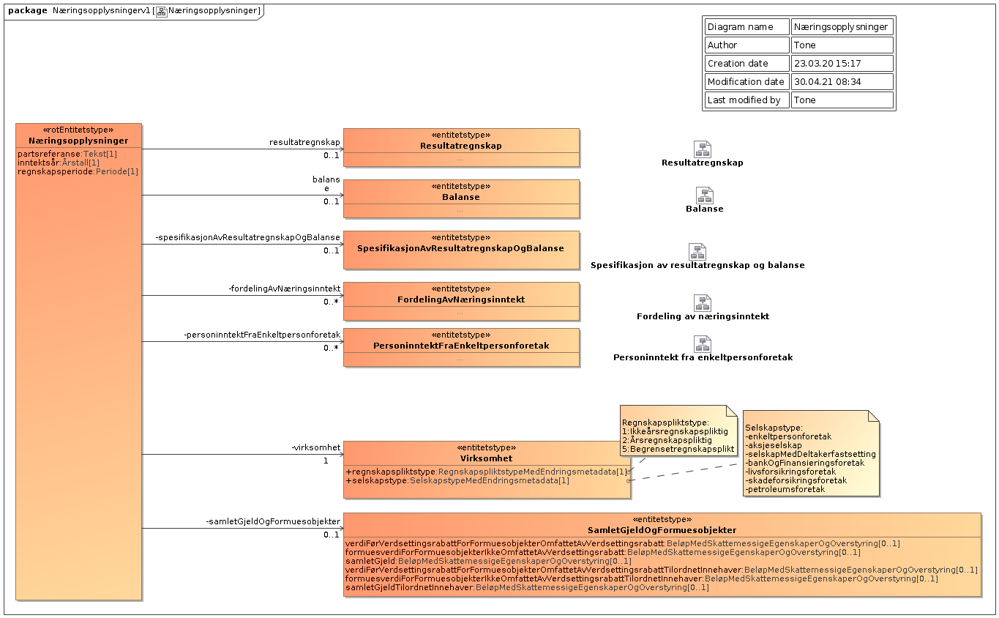
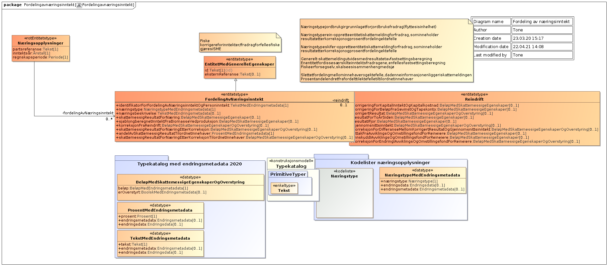
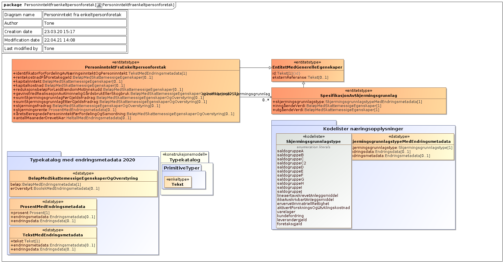
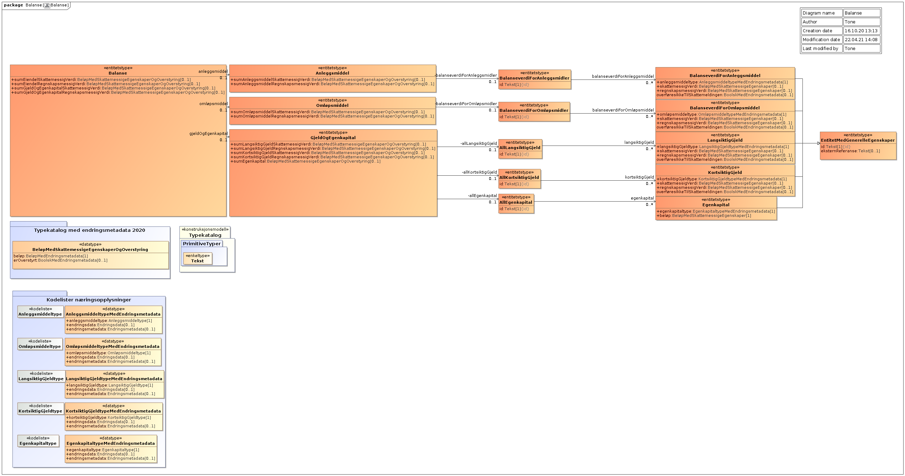
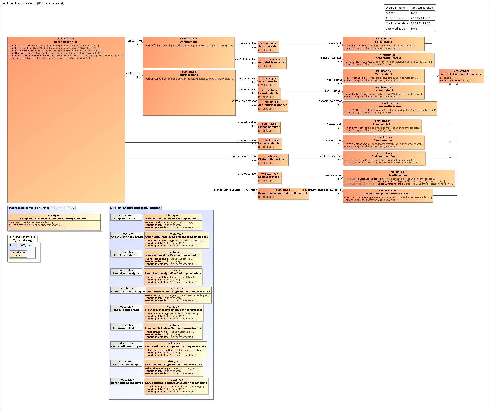
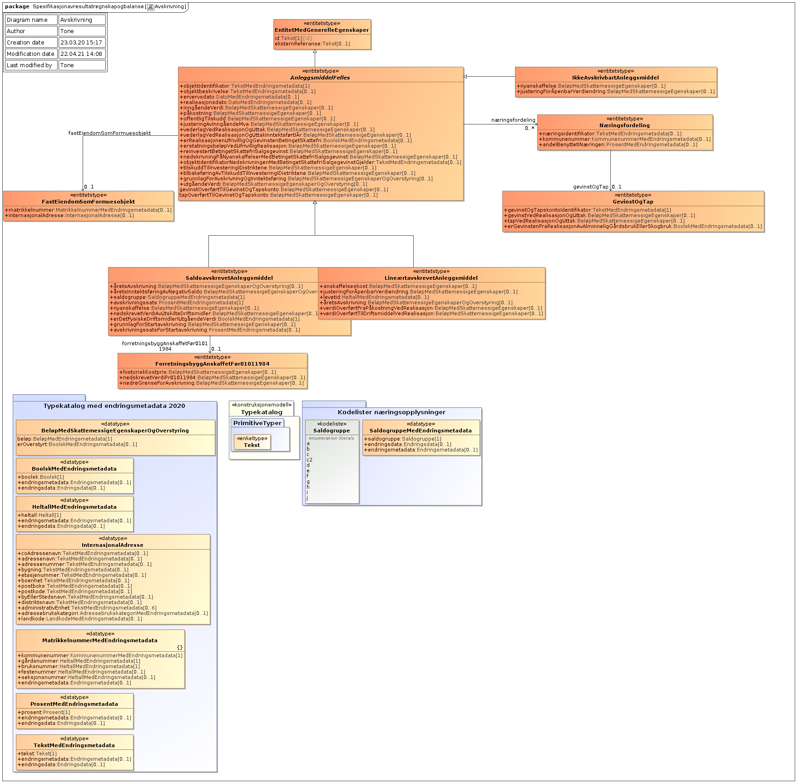
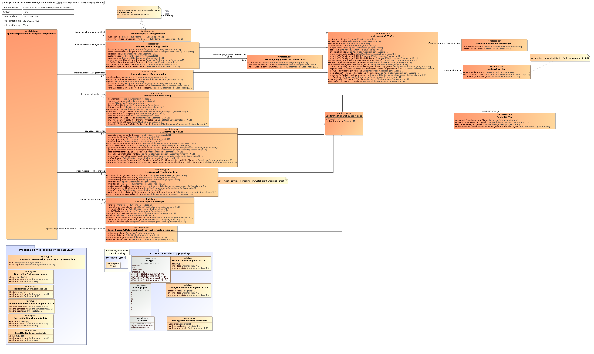

<Summary>Tjenesten leverer næringsopplysninger som enkeltpersonforetak og selskaper har innrapportert til Skatteetaten i forbindelse med skattemeldingen.</Summary>

<Tabs underline={true}>
<TabItem headerText="Om tjenesten" itemKey="itemKey-1" default>

For generell informasjon om tjenestene se egne sider om:

* [Bruk av tjenestene](../om/bruk.md)
* [Sikkerhetsmekansimer](../om/sikkerhet.md)
* [Rettighetspakker](../om/rettighetspakker.md)
* [Feilhåndtering](../om/feil.md)
* [Teknisk spesifikasjon](../om/tekniskspesifikasjon.md)

## Scope

Følgende scope skal benyttes ved autentisering i Maskinporten: `skatteetaten:naeringsspesifikasjon`

## Delegering

Tilgang til dette API-et kan delegeres i Altinn, f.eks. dersom leverandør benyttes for den tekniske oppkoblingen. Søk
opp følgende tjeneste i Altinn for å delegere tilgangen: `Næringsspesifikasjon API - På vegne av`

## Teknisk spesifikasjon

Næringsspesifikasjon API v4 leverer næringsspesifikasjon for inntektsårene 2022 og 2023.

URL-er til API-et, beskrivelsen av parameterne, endepunkter og respons ligger
i [Open API spesifikasjonen](https://app.swaggerhub.com/apis/skatteetaten/naeringsspesifikasjon-api) på SwaggerHub.

## Rettighetspakker

| Navn på rettighetspakke |	
|-------------------------|
| ldirTotalregnskap       |
| ssb                     |

## Støttetjeneste

For å følge med på endringer tilbyr vi
en [støttetjeneste for hendelsesliste](./hendelser.md): `Næringsspesifikasjon hendelser API`

## Datakatalog

[Datatjenestebeskrivelse](https://data.norge.no/dataservices/6ed9209d-c7c0-376f-a4b5-b4ce7cc1933b) i Felles datakatalog.

</TabItem>
<TabItem headerText="Eksempler" itemKey="itemKey-2">

## JSON

Eksempel på en gyldig respons for inntektsår 2023 (V4):

```json
{
  "norskIdentifikator": "19875297549",
  "inntektsaar": "2023",
  "resultatregnskap": {
    "driftsinntekt": {
      "sumDriftsinntekt": 500100.0,
      "salgsinntekt": {
        "inntekt": [
          {
            "beloep": 500000.0,
            "id": "3000",
            "type": "3000"
          }
        ]
      },
      "annenDriftsinntekt": {
        "inntekt": [
          {
            "beloep": 100.0,
            "id": "3700",
            "type": "3700"
          }
        ]
      }
    },
    "driftskostnad": {
      "sumDriftskostnad": 70333.0,
      "annenDriftskostnad": {
        "kostnad": [
          {
            "beloep": 45000.0,
            "id": "6100",
            "type": "6100"
          },
          {
            "beloep": 22222.0,
            "id": "7330",
            "type": "7330"
          },
          {
            "beloep": 3111.0,
            "id": "7295",
            "type": "7295"
          }
        ]
      }
    },
    "aarsresultat": 429767.0
  },
  "beregnetNaeringsinntekt": {
    "fordeltBeregnetNaeringsinntektForPersonligSkattepliktigEllerSdf": [
      {
        "id": "1",
        "identifikatorForFordeltBeregnetPersoninntekt": "1",
        "identifikatorForFordeltBeregnetNaeringsinntekt": "1",
        "naeringstype": "skiferproduksjon",
        "fordeltSkattemessigResultat": 329767.0,
        "fordeltSkattemessigResultatEtterKorreksjon": 329767.0,
        "andelAvFordeltSkattemessigResultatTilordnetInnehaver": 100.0,
        "fordeltSkattemessigResultatEtterKorreksjonTilordnetInnehaver": 329767.0
      },
      {
        "id": "ba0b7d70-55ac-45b8-ba3f-545c574f5251",
        "kommunenummer": "5403",
        "identifikatorForFordeltBeregnetPersoninntekt": "2",
        "identifikatorForFordeltBeregnetNaeringsinntekt": "2",
        "naeringstype": "reindrift",
        "naeringsbeskrivelse": "reindrift",
        "fordeltSkattemessigResultat": 100000.0,
        "reindrift": {
          "korrigertResultat": 100000.0
        },
        "fordeltSkattemessigResultatEtterKorreksjon": 100000.0,
        "andelAvFordeltSkattemessigResultatTilordnetInnehaver": 100.0,
        "fordeltSkattemessigResultatEtterKorreksjonTilordnetInnehaver": 100000.0
      }
    ],
    "skattemessigResultat": 429767.0
  },
  "beregnetPersoninntekt": {
    "fordeltBeregnetPersoninntekt": [
      {
        "id": "2",
        "identifikatorForFordeltBeregnetPersoninntekt": "2",
        "identifikatorForFordeltBeregnetNaeringsinntekt": "2",
        "aaretsBeregnedePersoninntektFoerFordelingOgSamordning": 100000.0,
        "andelAvPersoninntektTilordnetInnehaver": 100.0,
        "aaretsBeregnedePersoninntektFoerFordelingOgSamordningTilordnetInnehaver": 100000.0
      },
      {
        "id": "1",
        "identifikatorForFordeltBeregnetPersoninntekt": "1",
        "identifikatorForFordeltBeregnetNaeringsinntekt": "1",
        "aaretsBeregnedePersoninntektFoerFordelingOgSamordning": 329767.0,
        "andelAvPersoninntektTilordnetInnehaver": 100.0,
        "aaretsBeregnedePersoninntektFoerFordelingOgSamordningTilordnetInnehaver": 329767.0
      }
    ]
  },
  "virksomhet": {
    "regnskapspliktstype": "ingenRegnskapsplikt",
    "regnskapsperiode": {
      "start": "2023-01-01T00:00:00+01:00",
      "slutt": "2023-12-31T23:59:59+01:00"
    },
    "virksomhetstype": "enkeltpersonforetak",
    "regeltypeForAarsregnskap": "regnskapslovensAlminneligeRegler"
  },
  "skalBekreftesAvRevisor": false,
  "skjermet": false,
  "opprettetDato": "2024-01-29T12:09:07.614+01:00"
}
```

</TabItem>
<TabItem headerText="Feilkoder" itemKey="itemKey-3">

Se egen side for generell info om [feilhåndtering i tjenestene](../om/feil.md).

Tabellen under viser en oversikt over hvilke spesifikke feilkoder denne applikasjonen kan gi.

| Feilkode | HTTP Statuskode | Feilområde                                                             |
|----------|-----------------|------------------------------------------------------------------------|
| NS-001   | 500             | Uventet feil på tjenesten.                                             |
| NS-002   | 500             | Uventet feil i et bakenforliggende system.                             |
| NS-003   | 404             | Ukjent url benyttet.                                                   |
| NS-004   | 401             | Feil i forbindelse med autentisering.                                  |
| NS-005   | 403             | Feil i forbindelse med autorisering.                                   |
| NS-006   | 400             | Feil i forbindelse med validering av inputdata.                        |
| NS-007   | 404             | Fikk ikke treff på gitt identifikator.                                 |
| NS-008   | 404             | Fant ikke naeringsspesifikasjon for gitt identifikator og inntektsaar. |
| NS-009   | 406             | Feil tilknyttet dataformat. Kun json eller xml er støttet.             |
| NS-010   | 410             | Naeringsspesifikasjon er ikke lenger tilgjenglig.                      |

</TabItem>
<TabItem headerText="Informasjonsmodell" itemKey="itemKey-4">

[Informasjonsmodell](https://data.norge.no/informationmodels/c45bfb1b-766e-386a-b560-c57eca638c1a) i Felles datakatalog.

Obs. Hvis modellene på denne siden avviker fra Open API spesifikasjonen på Swaggerhub, er det Open API spesifikasjonen
som er mest oppdatert.

Modellene nedenfor avviker litt fra modellen slik den benyttes i tjenesten. Modellen har følgende avvik:

* Part er erstattet med personidentifikator
* Intern systemreferanse er ikke med
* Type Endringsmetadata er ikke med
* Type BeløpIValuta er konvertert til Beløp

## Toppnivå



## Næringsinntekt



## Personinntekt



## Balanse



## Resultatregnskap



## Avskrivning



## Spesifikasjon av resultatregnskap og balanse



</TabItem>
<TabItem headerText="Test" itemKey="itemKey-5">

## Tenor testdatasøk

Det finnes pt. ikke søk i [Tenor](../test/tenor.md) for denne tjenesten, men man kan benytte hendelseslisten for å finne testdata man kan benytte for å teste oppslagstjenesten.


</TabItem>
</Tabs>
