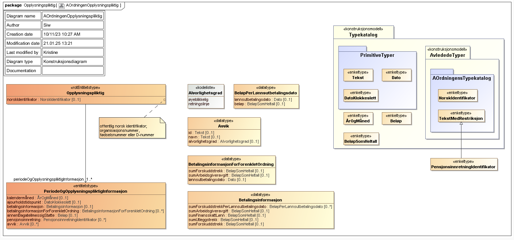
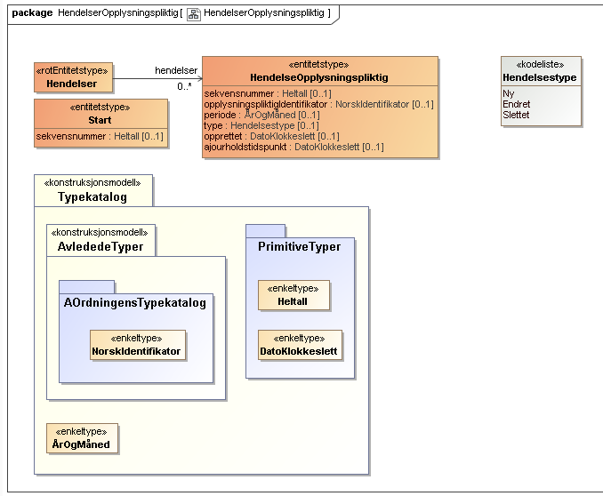

<Summary>Tjenesten leverer informasjon om opplysningspliktiges innrapporterte opplysninger for en gitt periode.</Summary>

<Tabs underline={true}>
<TabItem headerText="Om tjenesten" itemKey="itemKey-1" default>

For generell informasjon om tjenestene se egne sider om:

- [Bruk av tjenestene](../om/bruk.md)
- [Sikkerhetsmekansimer](../om/sikkerhet.md)
- [Feilhåndtering](../om/feil.md)
- [Versjonering](../om/versjoner.md)
- [Teknisk spesifikasjon](../om/tekniskspesifikasjon.md)

## Teknisk spesifikasjon

URL-er til API-et, beskrivelsen av parameterne, endepunkter og respons ligger
i [Open API spesifikasjonen](https://app.swaggerhub.com/apis/skatteetaten/opplysningspliktig-api/) på
SwaggerHub.

## Tilgang

### Scope
Følgende scope skal benyttes ved autentisering i Maskinporten: `skatteetaten:opplysningspliktig`

## Delegering
Tilgang til dette API-et kan delegeres i Altinn, f.eks. dersom leverandør benyttes for den tekniske oppkoblingen. Søk
opp følgende tjeneste i Altinn for å delegere tilgangen: `Opplysningspliktig API - På vegne av`

### Skatteetaten må gi tilgang
For å kunne bruke dette API-et må Skatteetaten gi din virksomhet tilgang til en eller flere rettighetspakker. Les mer om [hvordan du får tilgang til opplysninger fra Skatteetaten](https://www.skatteetaten.no/deling/).

### Rettighetspakker
Hvilke data en virksomhet får bestemmes av [rettighetspakken](../om/rettighetspakker.md).

Virksomheter som har fått tilgang kan kalle API-et med følgende rettighetspakker:

| Teknisk navn på rettighetspakker |
| ----------------------- |
| ssb                     |

## Støttetjenester

For å følge med på endringer tilbyr vi en [støttetjeneste for hendelsesliste](./hendelser.md): `Opplysningspliktig hendelser API`

## Datakatalog

[Datatjenestebeskrivelse](https://data.norge.no/data-services/c21f0fc1-5c48-382a-b957-0cf31556711d) i Felles datakatalog.

</TabItem>
<TabItem headerText="Eksempler" itemKey="itemKey-2">

## JSON

```json
{
  "norskIdentifikator": "311117815",
  "periodeOgOpplysningspliktigInformasjon": [
    {
      "kalendermaaned": "2024-08",
      "ajourholdstidspunkt": "2024-08-16T08:39:44.466",
      "betalingsinformasjon": {
        "sumArbeidsgiveravgift": 4213,
        "sumFinansskattLoenn": 6096,
        "sumUtleggstrekk": 1421,
        "sumForskuddstrekk": 26411
      },
      "betalingsinformasjonForForenkletOrdning": [],
      "pensjonsinnretning": [
        {
          "identifikator": "487247384"
        }
      ],
      "avvik": []
    }
  ]
}
```

</TabItem>
<TabItem headerText="Feilkoder" itemKey="itemKey-3">

Se egen side for generell info om [feilhåndtering i tjenestene](../om/feil.md).

Tabellen under viser en oversikt over hvilke spesifikke feilkoder denne applikasjonen kan gi. Feilmeldingen vil kunne
variere selv om samme feilkode returneres. Dette er for å kunne gi en så presis beskrivelse av feilen som mulig.

| Feilkode | HTTP Statuskode | Feilområde                                                                    |
| -------- | --------------- | ----------------------------------------------------------------------------- |
| OPP-001  | 500             | Uventet feil på tjenesten.                                                    |
| OPP-002  | 500             | Uventet feil i et bakenforliggende system.                                    |
| OPP-003  | 404             | Ukjent url benyttet.                                                          |
| OPP-004  | 401             | Feil i forbindelse med autentisering.                                         |
| OPP-005  | 403             | Feil i forbindelse med autorisering.                                          |
| OPP-006  | 400             | Feil i forbindelse med validering av inputdata.                               |
| OPP-007  | 404             | Fant ikke opplysninger om arbeidsforhold for angitt identifikator og periode. |
| OPP-008  | 406             | Feil tilknyttet dataformat. Kun json eller xml er støttet.                    |
| OPP-009  | 406             | Opplysninger om arbeidsforhold er slettet for periode.                        |

</TabItem>
<TabItem headerText="Informasjonsmodell" itemKey="itemKey-4">

## Oppslagstjeneste

[](../../static/download/Informasjonsmodell_Opplysningspliktig.png)

## Hendelsesliste

[](../../static/download/Informasjonsmodell_Opplysningspliktig_hendelser.png)

</TabItem>
<TabItem headerText="Test" itemKey="itemKey-5">

Det finnes pt. ikke søk i [Tenor](../test/tenor.md) for denne tjenesten, men man kan benytte hendelseslisten for å finne
testdata man kan benytte for å teste oppslagstjenesten.

</TabItem>
</Tabs>
