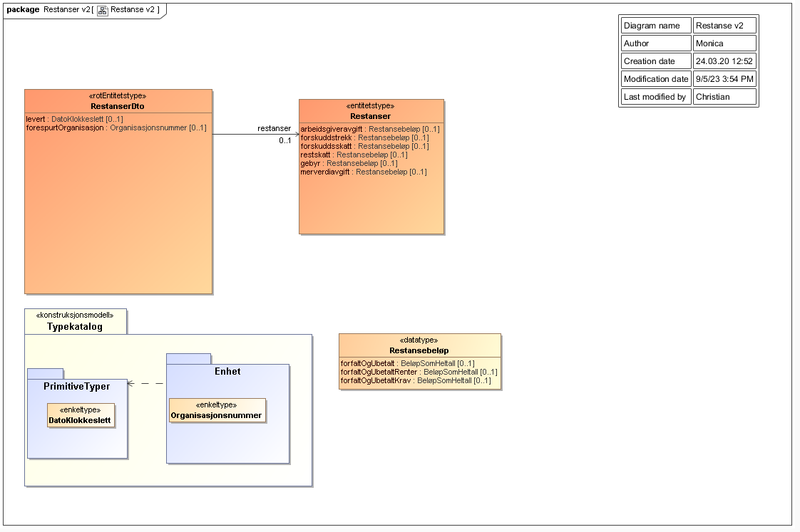

<summary>Tjenesten leverer informasjon om forfalte og ubetalte skatter og avgifter for en virksomhet.</summary>

<Tabs underline={true}>
<TabItem headerText="Om tjenesten" itemKey="itemKey-1" default>

For generell informasjon om tjenestene se egne sider om:
* [Bruk av tjenestene](../om/bruk.md)
* [Sikkerhetsmekansimer](../om/sikkerhet.md)
* [Rettighetspakker](../om/rettighetspakker.md) 
* [Feilhåndtering](../om/feil.md)
* [Versjonering](../om/versjoner.md)
* [Teknisk spesifikasjon](../om/tekniskspesifikasjon.md)

## Scope
Følgende scope skal benyttes ved autentisering i Maskinporten: `skatteetaten:restanser`

## Delegering
Tilgang til dette API-et kan delegeres i Altinn, f.eks. dersom leverandør benyttes for den tekniske oppkoblingen. Søk opp følgende tjeneste i Altinn for å delegere tilgangen: `Restanser API - På vegne av`
 
## Teknisk spesifikasjon
URL-er til API-et, beskrivelsen av parameterne, endepunkter og respons ligger i [Open API spesifikasjonen](https://app.swaggerhub.com/apis/skatteetaten/restanser-api) på SwaggerHub.

## Rettighetspakker

| Navn på rettighetspakke |	Egenskaper ved rettighetspakke |
|---|---|
| dibk | Hjemmel |
| ebevis | Krever samtykke |
 
## Samtykke
Tjenesten krever [samtykke](../om/samtykke.md).

| Tjenestekode | Formål |
|--------| ------ |
| 5616_5 | Kreves for rettighetspakke `ebevis`|
 
## Datakatalog
[Datatjenestebeskrivelse](https://data.norge.no/dataservices/0682ff1e-05b9-3031-8add-780f28853571) i Felles datakatalog.

</TabItem>
<TabItem headerText="Eksempler" itemKey="itemKey-2"> 

## Curl

Her er et eksempel på en spørring med curl mot tjenesten med rettighetspakke dibk. Du må ha et gyldig maskinportentoken som legges ved som header i curl-kommandoen. For enkelte rettighetspakker kreves i tillegg altinn samtykketoken som header.

```bash
$ curl -v -H "Authorization: Bearer <maskinporten_token>" "https://api-test.sits.no/api/innkreving/restanser/v2/dibk/310111643"
```

## JSON

```json
{
  "restanser": {
    "restskatt": {
      "forfaltOgUbetaltRenter": 0,
      "forfaltOgUbetaltKrav": 0,
      "forfaltOgUbetalt": 0
    },
    "forskuddstrekk": {
      "forfaltOgUbetaltRenter": 58552,
      "forfaltOgUbetaltKrav": 75155,
      "forfaltOgUbetalt": 133707
    },
    "merverdiavgift": {
      "forfaltOgUbetaltKrav": 1000,
      "forfaltOgUbetalt": 1000
    },
    "arbeidsgiveravgift": {
      "forfaltOgUbetaltRenter": 30071,
      "forfaltOgUbetaltKrav": 39956,
      "forfaltOgUbetalt": 70027
    },
    "gebyr": {
      "forfaltOgUbetaltRenter": 3000,
      "forfaltOgUbetaltKrav": 26579,
      "forfaltOgUbetalt": 29579
    },
    "forskuddsskatt": {
      "forfaltOgUbetaltRenter": 0,
      "forfaltOgUbetaltKrav": 0,
      "forfaltOgUbetalt": 0
    }
  },
  "levert": "2023-09-21T10:47:13.291069732",
  "forespurteOrganisasjon": "310111643"
}
```

</TabItem>
<TabItem headerText="Feilkoder" itemKey="itemKey-3">

Se egen side for generell info om [feilhåndtering i tjenestene](../om/feil.md).

Tabellen under viser en oversikt over hvilke spesifikke feilkoder denne applikasjonen kan gi. 

| Feilkode | HTTP Statuskode | Feilområde |
|----------|-----------------|-------|
| RESTANSE-001 | 500 | Uventet feil på tjenesten.  |
| RESTANSE-002 | 500 | Uventet feil i et bakenforliggende system.  |
| RESTANSE-003 | 404 | Ukjent url benyttet. |
| RESTANSE-004 | 401 | Feil i forbindelse med autentisering.  |
| RESTANSE-005 | 403 | Feil i forbindelse med autorisering.  |
| RESTANSE-006 | 400 | Feil i forbindelse med validering av inputdata. |
| RESTANSE-007 | 403 | Feil i forbindelse med samtykke.  |
| RESTANSE-008 | 404 | Ingen restanser funnet på oppgitt organisasjonsnummer. |
| RESTANSE-009 | 406 | Feil tilknyttet dataformat. Kun json eller xml er støttet. |

</TabItem>
<TabItem headerText="Informasjonsmodell" itemKey="itemKey-4">

 [Informasjonsmodell](https://data.norge.no/informationmodels/a38edde5-9c88-3bda-afb9-174a1aa94077) i Felles datakatalog.
 
 Obs. Hvis denne siden avviker fra Open API spesifikasjonen på Swaggerhub, er det Open API spesifikasjonen som er mest oppdatert.

 [](../../static/download/Informasjonsmodell_RestanserV2.PNG)
 
</TabItem>
<TabItem headerText="Test" itemKey="itemKey-5">

## Tenor testdatasøk
Det finnes pt. ikke søk i [Tenor](../test/tenor.md) for denne tjenesten.
 
## Testdata
Denne tjenesten har for nå kun enkle mockdata, med en statisk mocket respons. For å kunne teste tjenesten er det nok å benytte et syntetisk organisasjonsnummer som har et samtykke. Syntetiske organisasjonsnumre finner du i [Tenor](../test/tenor.md).
 
</TabItem>
</Tabs>
