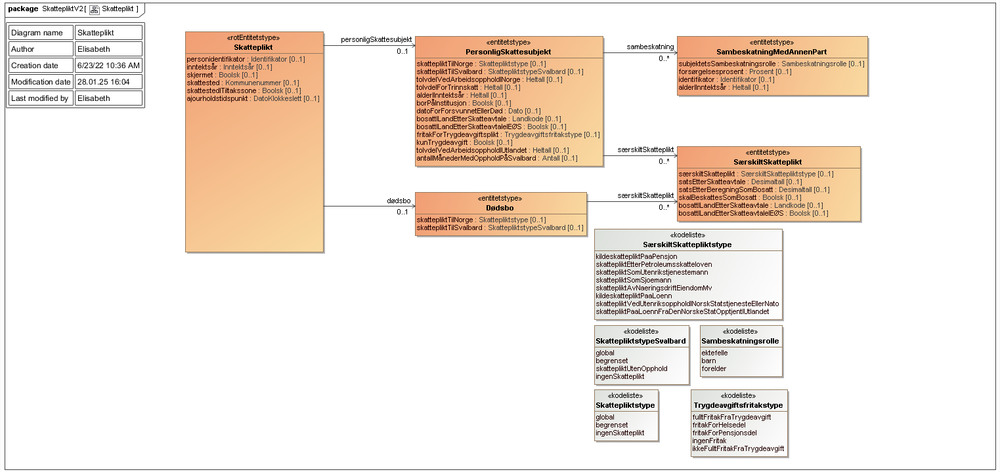

<Summary>Tjenesten leverer informasjon om type skatteplikt og grunnlag for vurdering av skatteplikten for en person.</Summary>

<Tabs underline={true}>
<TabItem headerText="Om tjenesten" itemKey="itemKey-1" default>

For generell informasjon om tjenestene se egne sider om:

* [Bruk av tjenestene](../om/bruk.md)
* [Sikkerhetsmekanismer](../om/sikkerhet.md)
* [Feilhåndtering](../om/feil.md)
* [Versjonering](../om/versjoner.md)
* [Teknisk spesifikasjon](../om/tekniskspesifikasjon.md)

## Teknisk spesifikasjon

URL-er til API-et, beskrivelsen av parameterne, endepunkter og respons ligger
i [Open API spesifikasjonen](https://app.swaggerhub.com/apis/skatteetaten/skatteplikt-api) på SwaggerHub.

## Tilgang

Tjenesten inneholder taushetsbelagte opplysninger om alle skattepliktige personer og/eller virksomheter, og krever eksplisitt lovregulering for tilgang. Tjenesten er ikke tilrettelagt for systembrukerløsningen og visning i sluttbrukersystem.
 
For å få tilgang til dette API-et, for videre bruk av opplysninger om andre personer eller virksomheter i annen oppgaveløsning, må den som ber om tilgang ha et behandlingsgrunnlag for mottak og bruk som er bygget på hjemmel i lov, ikke samtykke, og Skatteetaten må ha grunnlag som opphever vår taushetsplikt for utlevering.

### Skatteetaten må gi tilgang
For å kunne bruke dette API-et må Skatteetaten gi din virksomhet tilgang til en rettighetspakke. Les mer om [hvordan du får tilgang til opplysninger fra Skatteetaten](https://www.skatteetaten.no/deling/).

### Scope
Følgende scope skal benyttes ved autentisering i Maskinporten: `skatteetaten:skatteplikt`

### Delegering
Tilgang til dette API-et kan delegeres i Altinn, f.eks. dersom leverandør benyttes for den tekniske oppkoblingen. Søk
opp følgende tjeneste i Altinn for å delegere tilgangen: `Skatteplikt API - På vegne av`

### Rettighetspakker
Hvilke data en virksomhet får tilgang til i API-et bestemmes av [rettighetspakken](../om/rettighetspakker.md).

Skatteetaten har laget en selvbetjeningsløsning som gir virksomheter [innsyn i egne rettighetspakker](https://rettighetspakke-innsyn.skatteetaten.no/), og lister derfor ikke lengre rettighetspakkene på Github. Se egen dokumentasjon om [hvordan logge inn](https://skatteetaten.github.io/api-dokumentasjon/anvendelsesomraader/deling-skatteetaten#innsyn-i-rettighetspakker).

## Støttetjenester

For å følge med på endringer tilbyr vi
en [støttetjeneste for hendelsesliste](./hendelser.md): `Skatteoppgjør hendelser API`

## Datakatalog

[Datatjenestebeskrivelse](https://data.norge.no/dataservices/0411748d-0f94-3bce-b981-fd2b3930b6b2) i Felles datakatalog.

</TabItem>
<TabItem headerText="Eksempler" itemKey="itemKey-2">

## JSON

```json
{
  "personidentifikator": "08457590416",
  "inntektsaar": 2024,
  "skjermet": false,
  "skattested": "0301",
  "skattestedITiltakssone": false,
  "personligSkattesubjekt": {
    "skattepliktTilNorge": "global",
    "tolvdelVedArbeidsoppholdINorge": 12,
    "tolvdelForTrinnskatt": 12,
    "alderIInntektsaar": 49
  },
  "ajourholdstidspunkt": "2025-01-27T07:18:00.528Z"
}
```

</TabItem>
<TabItem headerText="Feilkoder" itemKey="itemKey-3">

Se egen side for generell info om [feilhåndtering i tjenestene](../om/feil.md).

Tabellen under viser en oversikt over hvilke spesifikke feilkoder denne applikasjonen kan gi. Feilmeldingen vil kunne variere selv om samme feilkode returneres. Dette er for å kunne gi en så presis beskrivelse av feilen som mulig.

| Feilkode | HTTP Statuskode | Feilområde                                                           |
|----------|-----------------|----------------------------------------------------------------------|
| SP-001   | 500             | Uventet feil på tjenesten.                                           |
| SP-002   | 500             | Uventet feil i et bakenforliggende system.                           |
| SP-003   | 404             | Ukjent url benyttet.                                                 |
| SP-004   | 401             | Feil i forbindelse med autentisering.                                |
| SP-005   | 403             | Feil i forbindelse med autorisering.                                 |
| SP-006   | 400             | Feil i forbindelse med validering av inputdata.                      |
| SP-007   | 404             | Ikke treff på oppgitt personidentifikator.                           |
| SP-008   | 404             | Fant ikke skattepliktsdokument for angitt personidentifikator og år. |
| SP-009   | 406             | Feil tilknyttet dataformat. Kun json eller xml er støttet.           |    
| SP-010   | 410             | Skattepliktsdokument finnes ikke lenger.                             |

</TabItem>
<TabItem headerText="Informasjonsmodell" itemKey="itemKey-4">

[](../../static/download/Informasjonsmodell_Skatteplikt.png)

</TabItem>
<TabItem headerText="Test" itemKey="itemKey-5">

## Tenor testdatasøk

Testdata for tjenesten kan finnes i [Tenor](../test/tenor.md) med søket for "Beregnet skatt", som kan kombineres med
egenskaper i søk for “Skatteplikt”.

</TabItem>
</Tabs>
