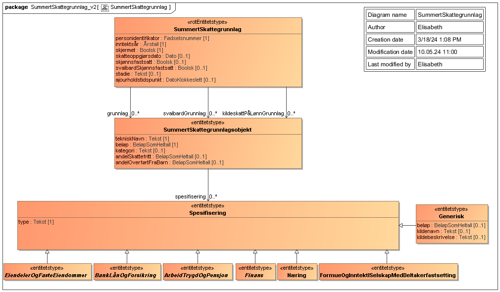
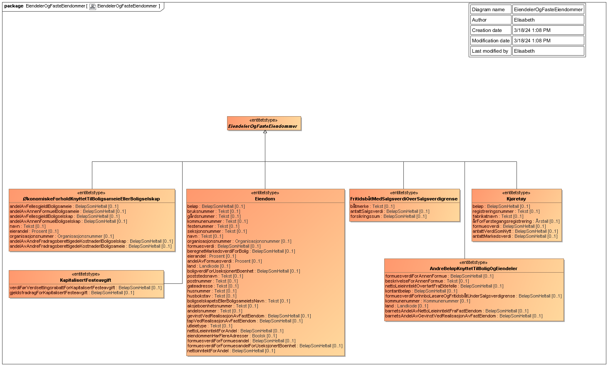
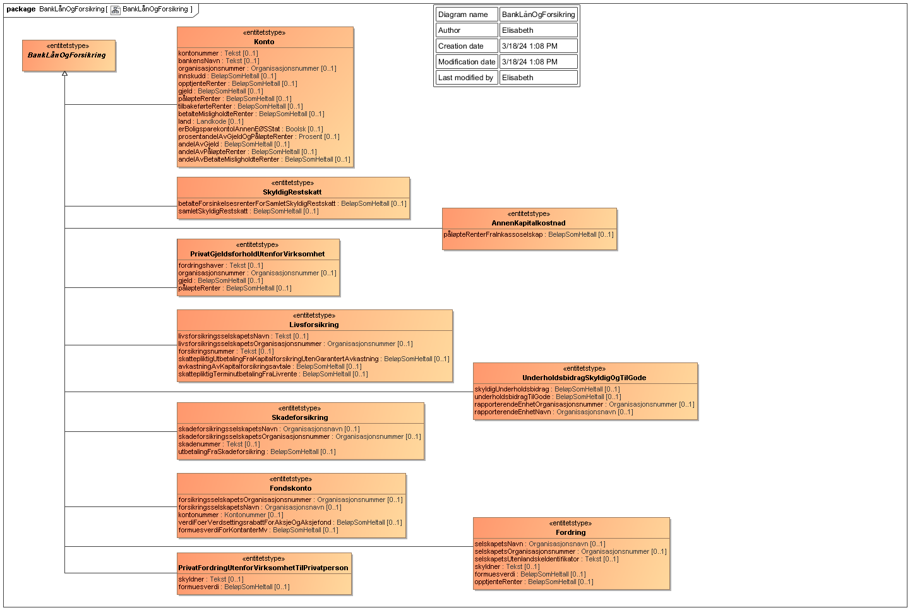
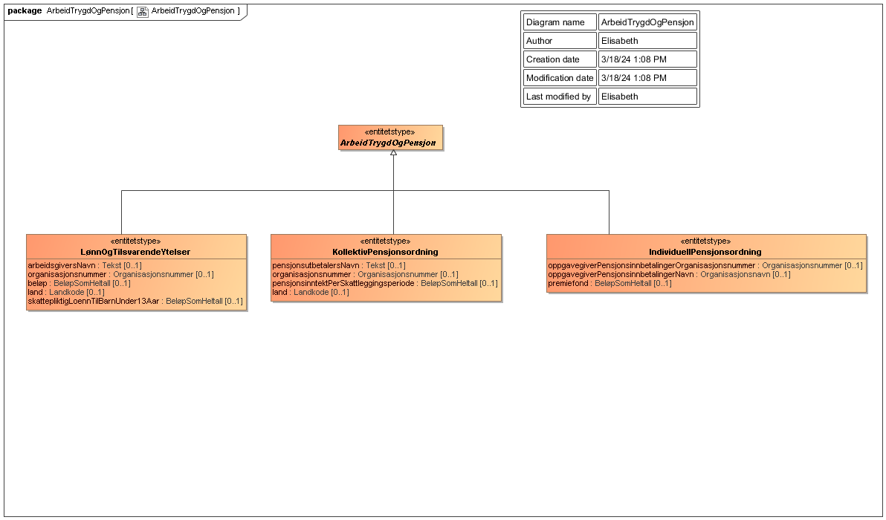
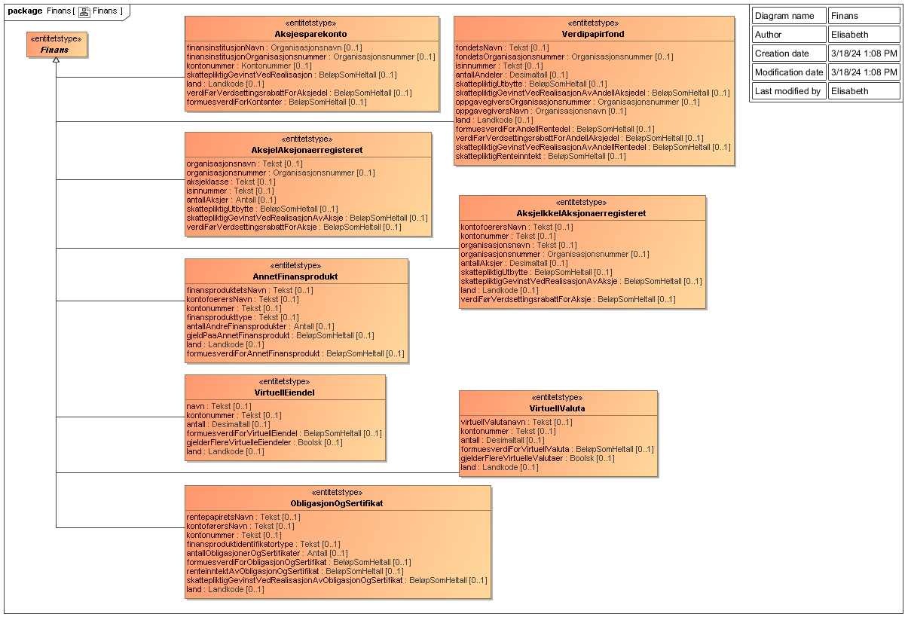
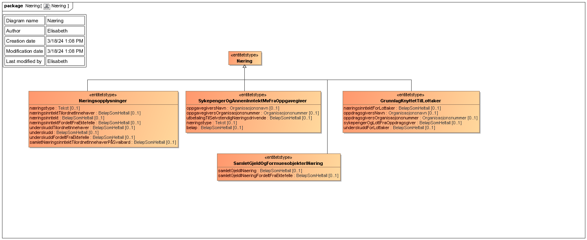
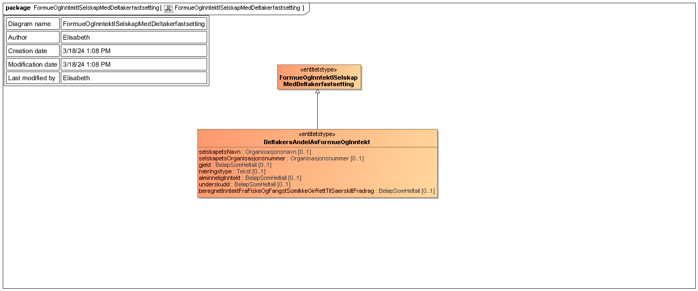

<Summary>Tjenesten leverer en oppsummering av grunnlag for skatt for en person, inkludert spesifisering av hvilke
opplysninger fra skattemeldingen som ligger til grunn.</Summary>

<Tabs underline={true}>
<TabItem headerText="Om tjenesten" itemKey="itemKey-1" default>

For generell informasjon om tjenestene se egne sider om:

* [Bruk av tjenestene](../om/bruk.md)
* [Sikkerhetsmekansimer](../om/sikkerhet.md)
* [Rettighetspakker](../om/rettighetspakker.md)
* [Feilhåndtering](../om/feil.md)
* [Versjonering](../om/versjoner.md)
* [Teknisk spesifikasjon](../om/tekniskspesifikasjon.md)

Summert skattegrunnlag API vil endres når skattereglene endres, altså årlig. Hvilke felt som er tilgjengelig vil kunne
variere etter skattereglene som gjelder for det gitte skatteåret det spørres om data om. Dette vil ikke føre til ny
versjon av API-et med mindre annen semantikk endres.

## Scope

Følgende scope skal benyttes ved autentisering i Maskinporten: `skatteetaten:summertskattegrunnlag`

I versjon 2 aksepteres også `skatteetaten:spesifisertsummertskattegrunnlag` for konsumenter som tidligere
benyttet Spesifisert summert skattegrunnlag API.

## Delegering

Tilgang til dette API-et kan delegeres i Altinn, f.eks. dersom leverandør benyttes for den tekniske oppkoblingen. Søk
opp følgende tjeneste i Altinn for å delegere tilgangen: `Summert skattegrunnlag API - På vegne av`

## Teknisk spesifikasjon

URL-er til API-et, beskrivelsen av parameterne, endepunkter og respons ligger
i [Open API spesifikasjonen](https://app.swaggerhub.com/apis/skatteetaten/summert-skattegrunnlag-api) på SwaggerHub.

## Rettighetspakker

| Navn på rettighetspakke             | 	Stadie                      | Kommentarer     |
|-------------------------------------|------------------------------|-----------------|
| fiskeridirektoratetKontrollmanntall | oppgjoer                     |                 |
| friRettshjelp                       | oppgjoer                     |                 |
| husbankenBostoette                  | oppgjoer                     |                 |
| husbankenLaanTilskudd               | oppgjoer                     |                 |
| kommuneBoligsosialeFormaal          | oppgjoer                     |                 |
| kommuneForeldrebetaling             | oppgjoer og utkast           |                 |
| kommuneLangtidsoppholdInstitusjon   | oppgjoer                     |                 |
| kommunePersonligassistanse          | oppgjoer                     |                 |
| kommunePraktiskBistand              | oppgjoer                     |                 |
| laanekassen                         | oppgjoer                     |                 |
| ldir                                | oppgjoer                     |                 |
| ldirReindriftstilskudd              | oppgjoer                     |                 |
| ldirTotalregnskap                   | oppgjoer                     |                 |
| nav                                 | oppgjoer                     |                 | 
| navBidrag                           | oppgjoer                     |                 | 
| navBilstoenad                       | oppgjoer                     |                 | 
| navSupplerendeStoenad               | oppgjoer og utkast           |                 |
| navUfoeretrygd                      | oppgjoer                     |                 | 
| norgesbank                          | oppgjoer og utkast           |                 |
| saernamsmann                        | oppgjoer                     |                 |
| sbl                                 | oppgjoer                     | Krever samtykke |
| sivilrett                           | oppgjoer, utkast og fastsatt |                 |
| spkBoliglaan                        | oppgjoer                     |                 |
| ssb                                 | oppgjoer                     |                 |
| udi                                 | oppgjoer                     |                 |

## Samtykke

Versjon 2 av API-et kan kreve [samtykke](../om/samtykke.md). Datakonsumenter med samtykke har kun lov til å spørre om
summert skattegrunnlag for siste tilgjengelige inntektsår, og dette kan sjekkes med
støttetjenesten [Siste tilgjengelige skatteoppgjør API](./sistetilgjengeligeskatteoppgjoer.md).

| Tjenestekode | Formål                           |
|--------------|----------------------------------|
| 4628_210607  | Kreves for rettighetspakke `sbl` |           

For denne tjenesten er det en parameter som må følge med:

| Parameter               | Forklaring                                 | Eksempelverdi |
|-------------------------|--------------------------------------------|---------------|
| 4628_210607_inntektsaar | Parameter for skattegrunnlagets inntektsår | 2022          |

## Støttetjenester

### Hendelser

For å følge med på endringer tilbyr vi
en [støttetjeneste for hendelsesliste](./hendelser.md): `Skatteoppgjør hendelser API`

### Siste tilgjengelige skatteoppgjør

Virksomheter med samtykke har kun lov til å spørre om summert skattegrunnlag for seneste tilgjengelige
*inntektsaar*. [Siste tilgjengelige skatteoppgjør API](./sistetilgjengeligeskatteoppgjoer.md) kan brukes uten samtykke
til å sjekke hva som er seneste tilgjengelige inntektsaar for en skattepliktig.

## Datakatalog

[Datatjenestebeskrivelse](https://data.norge.no/dataservices/dc560f2e-e5dd-3d8e-9383-eeb0b3085fce) i Felles datakatalog.

</TabItem>
<TabItem headerText="Eksempler" itemKey="itemKey-2"> 

## JSON

Her er et eksempel på respons for inntektsår 2023 for V2 av tjenesten.

```json
{
  "personidentifikator": "09819899123",
  "inntektsaar": "2023",
  "grunnlag": [
    {
      "tekniskNavn": "samledeOpptjenteRenterIInnenlandskeBanker",
      "beloep": 19667,
      "spesifisering": [
        {
          "type": "Konto",
          "kontonummer": "95751752084",
          "bankensNavn": "FORSIKTIG EMPATISK TIGER AS",
          "organisasjonsnummer": "310827002",
          "innskudd": 983351,
          "opptjenteRenter": 19667
        }
      ],
      "kategori": "inntekt"
    },
    {
      "tekniskNavn": "avkortetFordelVedElektroniskKommunikasjon",
      "beloep": 4392,
      "kategori": "inntekt"
    },
    {
      "tekniskNavn": "verdiFoerVerdsettingsrabattForAksjedelIAksjesparekonto",
      "beloep": 2205524,
      "spesifisering": [
        {
          "type": "Aksjesparekonto",
          "finansinstitusjonNavn": "FORSKJELLIG SKAPENDE GIRAFF SPAREBANK",
          "finansinstitusjonOrganisasjonsnummer": "312582465",
          "kontonummer": "81966764325",
          "verdiFoerVerdsettingsrabattForAksjedel": 2205524,
          "formuesverdiForKontanter": 15790
        }
      ],
      "kategori": "formue"
    },
    {
      "tekniskNavn": "formuesverdiForKontanterIAksjesparekonto",
      "beloep": 15790,
      "spesifisering": [
        {
          "type": "Aksjesparekonto",
          "finansinstitusjonNavn": "FORSKJELLIG SKAPENDE GIRAFF SPAREBANK",
          "finansinstitusjonOrganisasjonsnummer": "312582465",
          "kontonummer": "81966764325",
          "verdiFoerVerdsettingsrabattForAksjedel": 2205524,
          "formuesverdiForKontanter": 15790
        }
      ],
      "kategori": "formue"
    },
    {
      "tekniskNavn": "samletPersoninntektFraEnkeltpersonforetakInnenJordbrukReindriftSkiferproduksjonOgAnnenNaering",
      "beloep": 51432,
      "kategori": "inntekt"
    },
    {
      "tekniskNavn": "samletOverskuddPaaUtgiftsgodtgjoerelse",
      "beloep": 111948,
      "kategori": "inntekt"
    },
    {
      "tekniskNavn": "innskudd",
      "beloep": 983351,
      "spesifisering": [
        {
          "type": "Konto",
          "kontonummer": "95751752084",
          "bankensNavn": "FORSIKTIG EMPATISK TIGER AS",
          "organisasjonsnummer": "310827002",
          "innskudd": 983351,
          "opptjenteRenter": 19667
        }
      ],
      "kategori": "formue",
      "andelSkattefritt": 2000,
      "andelOverfoertFraBarn": 3000
    },
    {
      "tekniskNavn": "forvaltningskostnadKnyttetTilAksjesparekonto",
      "beloep": 829,
      "kategori": "inntektsfradrag"
    },
    {
      "tekniskNavn": "samletLoennsinntektMedTrygdeavgiftspliktOgMedTrekkplikt",
      "beloep": 719038,
      "spesifisering": [
        {
          "type": "LoennOgTilsvarendeYtelser",
          "arbeidsgiversNavn": "UTAKKNEMLIG TANKEFULL TIGER AS",
          "organisasjonsnummer": "312917408",
          "beloep": 719038
        }
      ],
      "kategori": "inntekt"
    },
    {
      "tekniskNavn": "samletOverskuddAvEnkeltpersonforetakInnenAnnenNaering",
      "beloep": 51432,
      "spesifisering": [
        {
          "type": "Naeringsopplysninger",
          "naeringstype": "annenNaering",
          "naeringsinntektTilordnetInnehaver": 51432
        }
      ],
      "kategori": "inntekt"
    }
  ],
  "skjermet": false,
  "skatteoppgjoersdato": "2024-02-20",
  "stadie": "oppgjoer",
  "ajourholdstidspunkt": "2024-02-20T08:38:37.72Z"
}
```

## XML

Dersom man ønsker XML i stedet for JSON kan dette spesifiseres med header `Accept` satt til `application/xml`

## Tilleggsinformasjon

* I 2018-2021 kom spesifikasjonene til summert skattegrunnlag fra to forskjellige løyper: ordinær og pilot. For
  en detaljert beskrivelse av hva dette innebærer,
  se [Spesifikasjonstyper for summert skattegrunnlag 2018](../informasjonsmodeller/summertskattegrunnlag/summertskattegrunnlag2018_spesifikasjoner)
* Fra og med 2018 er feltene skjoennsfastsatt og svalbardSkjoennsfastsatt fjernet.

</TabItem>
<TabItem headerText="Feilkoder" itemKey="itemKey-3">

Se egen side for generell info om [feilhåndtering i tjenestene](../om/feil.md).

Tabellen under viser en oversikt over hvilke spesifikke feilkoder denne applikasjonen kan gi. Feilmeldingen vil kunne
variere selv om samme feilkode returneres. Dette er for å kunne gi en så presis beskrivelse av feilen som mulig.

| Feilkode | HTTP Statuskode | Feilområde                                                                        |
|----------|-----------------|-----------------------------------------------------------------------------------|
| SSG-001  | 500             | Uventet feil på tjenesten.                                                        |
| SSG-002  | 500             | Uventet feil i et bakenforliggende system.                                        |
| SSG-003  | 404             | Ukjent url benyttet.                                                              |
| SSG-004  | 401             | Feil i forbindelse med autentisering.                                             |
| SSG-005  | 403             | Feil i forbindelse med autorisering.                                              |
| SSG-006  | 400             | Feil i forbindelse med validering av inputdata.                                   |
| SSG-007  | 404             | Ikke treff på oppgitt personidentifikator.                                        |
| SSG-008  | 404             | Ingen summert skattegrunnlag funnet på oppgitt personidentifikator og inntektsår. |
| SSG-009  | 406             | Feil tilknyttet dataformat. Kun json eller xml er støttet.                        |
| SSG-010  | 403             | Feil i forbindelse med samtykketoken.                                             |
| SSG-011  | 410             | Skattegrunnlag finnes ikke lenger.                                                |

</TabItem>
<TabItem headerText="Informasjonsmodell" itemKey="itemKey-4">

[Informasjonsmodell](https://data.norge.no/informationmodels/f78a48e2-8b5c-32fa-90bc-4c0bb8206fef) i Felles datakatalog.

Obs. Hvis modellene på denne siden avviker fra Open API spesifikasjonen på Swaggerhub, er det Open API spesifikasjonen
som er mest oppdatert.

## Årsversjoner

| År   | Informasjonsmodell                                                                                                                                  |
|------|-----------------------------------------------------------------------------------------------------------------------------------------------------|
| 2023 | [Informasjonsmodell for summert skattegrunnlag og spesifikasjoner 2023](../informasjonsmodeller/summertskattegrunnlag/summertskattegrunnlag2023.md) |
| 2022 | [Informasjonsmodell for summert skattegrunnlag og spesifikasjoner 2022](../informasjonsmodeller/summertskattegrunnlag/summertskattegrunnlag2022.md) |
| 2021 | [Informasjonsmodell for summert skattegrunnlag og spesifikasjoner 2021](../informasjonsmodeller/summertskattegrunnlag/summertskattegrunnlag2021.md) |
| 2020 | [Informasjonsmodell for summert skattegrunnlag og spesifikasjoner 2020](../informasjonsmodeller/summertskattegrunnlag/summertskattegrunnlag2020.md) |
| 2019 | [Informasjonsmodell for summert skattegrunnlag og spesifikasjoner 2019](../informasjonsmodeller/summertskattegrunnlag/summertskattegrunnlag2019.md) |
| 2018 | [Informasjonsmodell for summert skattegrunnlag og spesifikasjoner 2018](../informasjonsmodeller/summertskattegrunnlag/summertskattegrunnlag2018.md) |
| 2017 | [Informasjonsmodell for summert skattegrunnlag og spesifikasjoner 2017](../informasjonsmodeller/summertskattegrunnlag/summertskattegrunnlag2017.md) |

## Informasjonsmodell - skjema

### Oversikt

[](../../static/download/summertskattegrunnlag/Informasjonsmodell_Summertskattegrunnlag_SummertSkattegrunnlag.png)

### Eiendeler og faste eiendommer

[](../../static/download/Informasjonsmodell_Summertskattegrunnlag_/EiendelerOgFasteEiendommer.png)

### Bank, lån og forsikring

[](../../static/download/summertskattegrunnlag/Informasjonsmodell_Summertskattegrunnlag_BankLaanOgForsikring.png)

### Arbeid, trygd og pensjon

[](../../static/download/summertskattegrunnlag/Informasjonsmodell_Summertskattegrunnlag_ArbeidTrygdOgPensjon.png)

### Finans

[](../../static/download/summertskattegrunnlag/Informasjonsmodell_Summertskattegrunnlag_Finans.png)

### Næring

[](../../static/download/summertskattegrunnlag/Informasjonsmodell_Summertskattegrunnlag_Naering.png)

### Formue og inntekt i selskap med deltakerfastsetting

[](../../static/download/summertskattegrunnlag/Informasjonsmodell_Summertskattegrunnlag_FormueOgInntektISelskapMedDeltakerfastsetting.png)


</TabItem>
<TabItem headerText="Test" itemKey="itemKey-5">

## Tenor testdatasøk

Testdata for tjenesten kan finnes i [Tenor](../test/tenor.md) med søket for "Summert skattegrunnlag".

</TabItem>
<TabItem headerText="Årsrevisjon" itemKey="itemKey-6">

Det er få endringer i forbindelse med årets revisjon i Summert skattegrunnlag API.
​
## Tidsplan

| Dato          | Aktivitet                                                                |
|---------------|--------------------------------------------------------------------------|
| 18.12.2024    | Tidsplan for årsrevisjon for 2024 distribuert                            |
| 18.12.2024    | Første versjon av endringer i kodeliste for inntektsår 2024              |
| Medio januar  | Oppdatert versjon av endringer i kodeliste for inntektsår 2024           |
| Medio februar | Endelig versjon av kodeliste for inntektsår 2024                         |
| Medio februar | Støtte for inntektsår 2024 i test for alle stadier                       |
| 12.03.2025    | Første utkast for inntektsår 2024 tilgjengelig i delingstjenesten        |
| 22.03.2025    | Første skatteoppgjør for inntektsår 2024 tilgjengelig i delingstjenesten |

## Nye summerte skattegrunnlag fra 2024

| Teknisk navn | Kategori | SBL |
|--------------|---------|---|
| gjeldFraInkassoselskap | formuesfradrag | x |
| minstefradragILivrenteTilBarn | inntektsfradrag | |
| latentEllerRealisertGevinstPaaOpsjonerIArbeidsforholdVedUtflytting | inntekt | x |
| latentEllerRealisertTapPaaOpsjonerIArbeidsforholdVedUtflytting | inntektsfradrag | x |
| latentGevinstPaaAksjeAndelMvVedUtflyttingUtenUtsattBetaling | inntekt | x |
| latentGevinstPaaAnnetFinansproduktMvVedUtflyttingUtenUtsattBetaling | inntekt | x |
| latentGevinstPaaOpsjonIArbeidsforholdVedUtflyttingUtenUtsattBetaling | inntekt | x |
| latentTapPaaAksjeAndelMvVedUtflyttingUtenUtsattBetaling | inntektsfradrag | x |
| latentTapPaaAnnetFinansproduktMvVedUtflyttingUtenUtsattBetaling | inntektsfradrag | x |
| latentTapPaaOpsjonIArbeidsforholdVedUtflyttingUtenUtsattBetaling | inntektsfradrag | x |
| omstillingsstoenad | inntekt | x |
| skattepliktigInntektVedSalgAvOverskuddsstroem | inntekt	| x |

## Summerte skattegrunnlag som utgår fra 2024

| Teknisk navn | 
|--------------|
| saerfradragForEnsligForsoerger |
| samletSkattefriDelAvFormue |
| arbeidsinntektFraKompensasjonsytelseUtbetaltAvNav |
| naeringsinntektFraKompensasjonsytelseUtbetaltAvNavInnenAnnenNaering |
| naeringsinntektFraKompensasjonsytelseUtbetaltAvNavInnenBarnepassIBarnepasserensHjem |
| personinntektFraKompensasjonsytelseUtbetaltAvNavInnenAnnenNaering |
| personinntektFraKompensasjonsytelseUtbetaltAvNavInnenBarnepassIBarnepasserensHjem |

</TabItem>
</Tabs>

