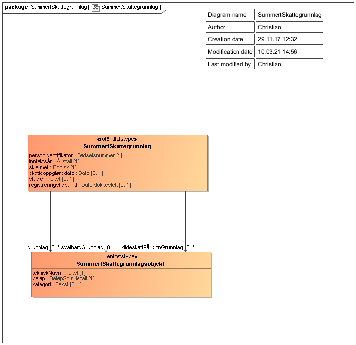

<summary>Tjenesten leverer en oppsummering av formue, gjeld, inntekt og fradrag for en person.</summary>

<Tabs underline={true}>
<TabItem headerText="Om tjenesten" itemKey="itemKey-1" default>

For generell informasjon om tjenestene se egne sider om:
* [Bruk av tjenestene](../om/bruk.md)
* [Sikkerhetsmekansimer](../om/sikkerhet.md)
* [Rettighetspakker](../om/rettighetspakker.md)
* [Feilhåndtering](../om/feil.md)
* [Versjonering](../om/versjoner.md)
* [Teknisk spesifikasjon](../om/tekniskspesifikasjon.md)
  
Summert skattegrunnlag API vil endres når skattereglene endres, altså årlig. Hvilke felt som er tilgjengelig vil kunne variere etter skattereglene som gjelder for det gitte skatteåret det spørres om data om. Dette vil ikke føre til ny versjon av API'et med mindre annen semantikk endres.

## Scope
Følgende scope skal benyttes ved autentisering i Maskinporten: `skatteetaten:summertskattegrunnlag`

## Delegering
Tilgang til dette API-et kan delegeres i Altinn, f.eks. dersom leverandør benyttes for den tekniske oppkoblingen. Søk opp følgende tjeneste i Altinn for å delegere tilgangen: `Summert skattegrunnlag API - På vegne av`

## Teknisk spesifikasjon
URL-er til API-et, beskrivelsen av parameterne, endepunkter og respons ligger i [Open API spesifikasjonen](https://app.swaggerhub.com/apis/skatteetaten/summert-skattegrunnlag-api) på SwaggerHub.

Det tilbys for tiden 2 endepunkter for uthenting av spesifisert summert skattegrunnlag, hvor URL'en har litt ulik oppbygging.

Enkelte rettighetspakker er tilrettelagt for ny URL med stadie:

```bash
GET https://{env}/api/formueinntekt/summertskattegrunnlag/{stadie}/{rettighetspakke}/{inntektsaar}/{personidentifikator}
```

Andre rettighetspakker må fremdeles benytter gammel URL uten stadie, men disse vil etter hvert bli tilrettelagt for ny url:

```bash
GET https://{env}/api/formueinntekt/summertskattegrunnlag/{rettighetspakke}/{inntektsaar}/{personidentifikator}
```

## Rettighetspakker  
 
| Navn på rettighetspakke |	Stadie | Kommentarer |
|---|---|
| frirettshjelp | oppgjoer | 
| husbanken | oppgjoer | 
| kommuneBoligsosialeFormaal | oppgjoer | Benytt ny url med stadie |
| kommuneForeldrebetaling | oppgjoer og utkast | Benytt ny url med stadie |
| kommunePersonligassistanse | oppgjoer | Benytt ny url med stadie |
| kommuneLangtidsoppholdInstitusjon | oppgjoer | Benytt ny url med stadie |
| laanekassen | oppgjoer | 
| ldir | oppgjoer | 
| nav | oppgjoer | 
| ssb | oppgjoer | Benytt ny url med stadie |
| udi | oppgjoer | 
  
## Støttetjenester

### Hendelser
For å følge med på endringer tilbyr vi en [støttetjeneste for hendelsesliste](./hendelser.md): `Skatteoppgjør hendelser API`

### Siste tilgjengelige skatteoppgjør
[Siste tilgjengelige skatteoppgjør API](./sistetilgjengeligeskatteoppgjoer.md) gir informasjon om hva som er seneste periode med data for en skattepliktig.
  
## Datakatalog
[Datatjenestebeskrivelse](https://data.norge.no/dataservices/dc560f2e-e5dd-3d8e-9383-eeb0b3085fce) i Felles datakatalog.

</TabItem>
<TabItem headerText="Eksempler" itemKey="itemKey-2"> 

## JSON
  
Her er et eksempel på respons for inntektsår 2022 i JSON uten oppgitt stadie.

```json
{
  "personidentifikator": "20076716073",
  "inntektsaar": "2023",
  "skjermet": false,
  "grunnlag": [
    {
      "tekniskNavn": "formuesverdiForKjoeretoey",
      "beloep": 0,
      "kategori": [
        "formue"
      ]
    },
    {
      "tekniskNavn": "formuesverdiForPrimaerbolig",
      "beloep": 544978,
      "kategori": [
        "formue"
      ]
    },
    {
      "tekniskNavn": "gjeldIInnenlandskeBanker",
      "beloep": 183457,
      "kategori": [
        "formuesfradrag"
      ]
    },
    {
      "tekniskNavn": "pensjonsinnbetaling",
      "beloep": 3935,
      "kategori": [
        "inntektsfradrag"
      ]
    },
    {
      "tekniskNavn": "samletUfoeretrygdFraFolketrygdenEksklusiveEktefelletillegg",
      "beloep": 126362,
      "kategori": [
        "inntekt"
      ]
    },
    {
      "tekniskNavn": "samledePaaloepteRenterPaaGjeldIInnenlandskeBanker",
      "beloep": 13101,
      "kategori": [
        "inntektsfradrag"
      ]
    },
    {
      "tekniskNavn": "samletGjeld",
      "beloep": 183457,
      "kategori": [
        "-"
      ]
    },
    {
      "tekniskNavn": "samletUfoereytelseFraAndreEnnFolketrygden",
      "beloep": 28218,
      "kategori": [
        "inntekt"
      ]
    },
    {
      "tekniskNavn": "innskudd",
      "beloep": 7,
      "kategori": [
        "formue"
      ]
    },
    {
      "tekniskNavn": "samletLoennsinntektMedTrygdeavgiftspliktOgMedTrekkplikt",
      "beloep": 213151,
      "kategori": [
        "inntekt"
      ]
    },
    {
      "tekniskNavn": "bruttoformue",
      "beloep": 544985,
      "kategori": [
        "-"
      ]
    }
  ],
  "skatteoppgjoersdato": "2023-09-28"
}
```

Eksempel på respons for inntektsår 2020 med oppgitt stadie 'oppgjoer' i JSON.

```json
{
  "personidentifikator": "12345678910",
  "inntektsaar": "2020",
  "skjermet": false,
  "grunnlag": [
    {
      "tekniskNavn": "samledePaaloepteRenter",
      "beloep": 779981,
      "kategori": [
        "inntektsfradrag"
      ]
    },
    {
      "tekniskNavn": "andreFradragsberettigedeKostnader",
      "beloep": 59981,
      "kategori": [
        "inntektsfradrag"
      ]
    },
    {
      "tekniskNavn": "samletSkattepliktigOverskuddAvUtleieAvFritidseiendom",
      "beloep": 1609981,
      "kategori": [
        "inntekt"
      ]
    },
    {
      "tekniskNavn": "skattepliktigAvkastningEllerKundeutbytte",
      "beloep": 1749981,
      "kategori": [
        "inntekt"
      ]
    }
  ],
  "svalbardGrunnlag": [
    {
      "tekniskNavn": "samledePaaloepteRenter",
      "beloep": 779981,
      "kategori": [
        "inntektsfradrag"
      ]
    },
    {
      "tekniskNavn": "samletAndelAvInntektIBoligselskapEllerBoligsameie",
      "beloep": 849981,
      "kategori": [
        "inntekt"
      ]
    },
    {
      "tekniskNavn": "skattepliktigUtbytteFraAksjerRegistrertIVerdipapirsentralen",
      "beloep": 1779981,
      "kategori": [
        "inntekt"
      ]
    },
    {
      "tekniskNavn": "skattepliktigAvkastningEllerKundeutbytte",
      "beloep": 1749981,
      "kategori": [
        "inntekt"
      ]
    }
  ],
  "skatteoppgjoersdato": "2020-02-11",
  "stadie": "oppgjoer",
  "registreringstidpunkt": "2020-02-11T16:11:12.985"
}
```

Flere eksempler på responser:

[SummertSkattegrunnlag2022.json](../../static/download/summertSkattegrunnlag2022.json)  

[SummertSkattegrunnlag2021.json](../../static/download/summertSkattegrunnlag2021.json)  

[SummertSkattegrunnlag2020.json](../../static/download/summertSkattegrunnlag2020.json)

[SummertSkattegrunnlag2017.json](../../static/download/summertSkattegrunnlag2017.json)

[SummertSkattegrunnlag2016.json](../../static/download/summertSkattegrunnlag2016.json)

## XML

Dersom man ønsker XML i stedet for JSON kan dette spesifiseres med header `Accept` satt til `application/xml`

```xml
<summertSkattegrunnlag xmlns="urn:no:skatteetaten:datasamarbeid:summertskattegrunnlag:v1">
  <personidentifikator>21839199217</personidentifikator>
  <inntektsaar>2021</inntektsaar>
  <skjermet>false</skjermet>
  <grunnlag>
    <tekniskNavn>samletLoennsinntektMedTrygdeavgiftspliktOgMedTrekkplikt</tekniskNavn>
    <beloep>762732</beloep>
    <kategori>inntekt</kategori>
  </grunnlag>
  <grunnlag>
    <tekniskNavn>minstefradragIInntekt</tekniskNavn>
    <beloep>106750</beloep>
    <kategori>inntektsfradrag</kategori>
  </grunnlag>
  <skatteoppgjoersdato>2022-02-10</skatteoppgjoersdato>
</summertSkattegrunnlag>
```

## Tilleggsinformasjon

* For 2015 og 2016 er Svalbard- og fastlandsinformasjon summert sammen. Fra og med 2017 er Svalbard-data skilt ut i svalbardSkjoennsfastsatt og svalbardGrunnlag.
  
</TabItem>
<TabItem headerText="Feilkoder" itemKey="itemKey-3">

Se egen side for generell info om [feilhåndtering i tjenestene](../om/feil.md).

Tabellen under viser en oversikt over hvilke spesifikke feilkoder denne applikasjonen kan gi.
  
| Feilkode | HTTP Statuskode | Feilområde                                                                        |
|----------|-----------------|-----------------------------------------------------------------------------------|
| SSG-001  | 500             | Uventet feil på tjenesten.                                                        |
| SSG-002  | 500             | Uventet feil i et bakenforliggende system.                                        |
| SSG-003  | 404             | Ukjent url benyttet.                                                              |
| SSG-004  | 401             | Feil i forbindelse med autentisering.                                             |
| SSG-005  | 403             | Feil i forbindelse med autorisering.                                              |
| SSG-006  | 400             | Feil i forbindelse med validering av inputdata.                                   |
| SSG-007  | 404             | Ikke treff på oppgitt personidentifikator.                                        |
| SSG-008  | 404             | Ingen summert skattegrunnlag funnet på oppgitt personidentifikator og inntektsår. |
| SSG-009  | 406             | Feil tilknyttet dataformat. Kun json eller xml er støttet.                        |
| SSG-010  | 410             | Skattegrunnlag finnes ikke lenger.                                                |
  
</TabItem>
<TabItem headerText="Informasjonsmodell" itemKey="itemKey-4">

[Informasjonsmodell](https://data.norge.no/informationmodels/f78a48e2-8b5c-32fa-90bc-4c0bb8206fef) i Felles datakatalog. 

Obs. Hvis modellene på denne siden avviker fra Open API spesifikasjonen på Swaggerhub, er det Open API spesifikasjonen som er mest oppdatert. 

## Årsversjoner

| År   | Informasjonsmodell                                                                                                               |
|------|----------------------------------------------------------------------------------------------------------------------------------|
| 2016 | [Informasjonsmodell for summert skattegrunnlag 2016](../informasjonsmodeller/summertskattegrunnlag/summertskattegrunnlag2016.md) |
| 2017 | [Informasjonsmodell for summert skattegrunnlag 2017](../informasjonsmodeller/summertskattegrunnlag/summertskattegrunnlag2017.md) |
| 2018 | [Informasjonsmodell for summert skattegrunnlag 2018](../informasjonsmodeller/summertskattegrunnlag/summertskattegrunnlag2018.md) |
| 2019 | [Informasjonsmodell for summert skattegrunnlag 2019](../informasjonsmodeller/summertskattegrunnlag/summertskattegrunnlag2019.md) |
| 2020 | [Informasjonsmodell for summert skattegrunnlag 2020](../informasjonsmodeller/summertskattegrunnlag/summertskattegrunnlag2020.md) |
| 2021 | [Informasjonsmodell for summert skattegrunnlag 2021](../informasjonsmodeller/summertskattegrunnlag/summertskattegrunnlag2021.md) |
| 2022 | [Informasjonsmodell for summert skattegrunnlag 2022](../informasjonsmodeller/summertskattegrunnlag/summertskattegrunnlag2022.md) |
| 2023 | [Informasjonsmodell for summert skattegrunnlag 2023](../informasjonsmodeller/summertskattegrunnlag/summertskattegrunnlag2023.md) |

## Informasjonsmodell - skjema
[](../../static/download/SummertSkattegrunnlag.png)

</TabItem>
<TabItem headerText="Test" itemKey="itemKey-5">

## Tenor testdatasøk
  
Testdata for tjenesten kan finnes i [Tenor](../test/tenor.md) med søket for "Summert skattegrunnlag".
  
</TabItem>
<TabItem headerText="Årsrevisjon" itemKey="itemKey-6">

## Tidsplan

| Dato | Aktivitet |
|------|-----------|
| 21.11.2023 | Tidsplan for årsrevisjon for 2023 distribuert |
| 15.12.2023 | Første versjon av endringer i kodeliste for inntektsår 2023 |
| 16.01.2024 | Oppdatert versjon av endringer i kodeliste for inntektsår 2023 |
| 26.01.2024 | Open API spesifikasjon oppdatert på Swaggerhub |
| Medio februar | Endelig versjon av kodeliste for inntektsår 2023 |
| 22.02.2024 | Støtte for inntektsår 2023 i test for alle stadier |
| 13.03.2024 | Første utkast for inntektsår 2023 tilgjengelig i delingstjenesten |
| 24.03.2024 | Første skatteoppgjør for inntektsår 2023 tilgjengelig i delingstjenesten |

## Nye/endrede summerte skattegrunnlag fra 2023

| Teknisk navn | Endring |
|--------------|---------|
| alminneligInntektFraEnkeltpersonforetakPaaSvalbard | Nytt fra 2023, inngikk tidligere i samletOverskuddAvEnkeltpersonforetakInnenAnnenNaering |
| alminneligInntektFraSelskapMedDeltakerfastsettingPaaSvalbard | Nytt fra 2023 |
| fradragsberettighetTapVedSvindel | Nytt fra 2023 |
| samletOverskuddAvEnkeltpersonforetakInnenAnnenNaering | Endring i innhold: alminneligInntektFraEnkeltpersonforetakPaaSvalbard er skilt ut som eget teknisk navn	|
| godtgjoerelseEtterSaeravtaleIUtenrikstjenesten | Nytt fra 2023 |
| skattepliktigTilfeldigInntektFraSpillLotteriMv | Nytt fra 2023 |

## Summerte skattegrunnlag som utgår fra 2023

| Teknisk navn | Endring |
|--------------|---------|
| andreFradragsberettigedeKostnader | Utgått |
| annenSkattepliktigKapitalinntektFraVirtuellValuta | Utgått |
| dagpengerForNaeringsdrivendeOgFisker | Utgått |
| fradragsberettigetTapVedRealisasjonAvFastEiendomIUtlandet | Utgått |
| gevinstVedRealisasjonAvAksjeOgVerdipapirfondAksjedel | Utgått |
| gevinstVedRealisasjonAvFastEiendomMvIUtlandet | Utgått |
| gevinstVedRealisasjonAvVerdipapirfondsandelIKombifondKnyttetTilAksjedel | Utgått |
| loennsinntektPaaSvalbardOver12G | Utgått |
| naeringsinntektFraKompensasjonsytelseUtbetaltAvNavInnenFiskeOgFangst | Utgått |
| oppjustertTilleggTilAndelIFellesTilleggIAlminneligInntektFraSDFInnenAnnenNaering | Utgått |
| oppjustertTilleggTilAndelIFellesTilleggIAlminneligInntektFraSDFInnenBarnepassIBarnepasserensHjem | Utgått |
| oppjustertTilleggTilGevinstVedRealisasjonAvAksjeOgVerdipapirfondAksjedel | Utgått |
| oppjustertTilleggTilGevinstVedRealisasjonAvVerdipapirfondsandelIKombifondKnyttetTilAksjedel | Utgått |
| overskuddFraNaeringsinntekt | Utgått, grunnlagForSkattPaaNaeringsoverskuddSvalbard kan brukes i stedet |
| personinntektFraKompensasjonsytelseUtbetaltAvNavInnenFiskeOgFangst | Utgått |
| renteinntektAvObligasjonVerdipapirfondRentedelMv | Utgått |
| samledeAndrePaaloepteRenter | Utgått |
| samledeOpptjenteRenterIUtenlandskeBanker | Utgått |
| samledeUfoererenterOgLivrenter | Utgått |
| samletAnnenPensjonUtenTrekkplikt | Utgått |
| samletBarnepensjonOgLivrenteTilBarn | Utgått |
| samletFormuesverdiAvPrivatUtestaaendeFordring | Utgått |
| samletFormuesverdiForSekundaerbolig | Utgått |
| samletFradragsberettigetKostnadTilknyttetArbeidMv | Utgått |
| samletFradragsberettigetUnderskuddVedUtleieAvFastEiendom | Utgått |
| samletGjenkjoepsverdiForLivsforsikring | Utgått |
| samletInnskuddIInnenlandskeBanker | Utgått |
| samletInntektSomGirRettTilSaerskiltFradragForSjoefolk | Utgått |
| samletLoennsinntektUtenTrygdeavgiftspliktOgMedTrekkplikt | Utgått |
| samletMerkostnadVedArbeidsoppholdUtenforHjem | Utgått |
| samletPensjonFraFolketrygden | Utgått |
| samletPensjonsinnbetalingTilIndividuellPensjonsordning | Utgått |
| samletSkattepliktigOverskuddFraUtleieAvFastEiendom | Utgått |
| skattepliktigEtterloennOgEtterpensjon | Utgått |
  
</TabItem>
</Tabs>

