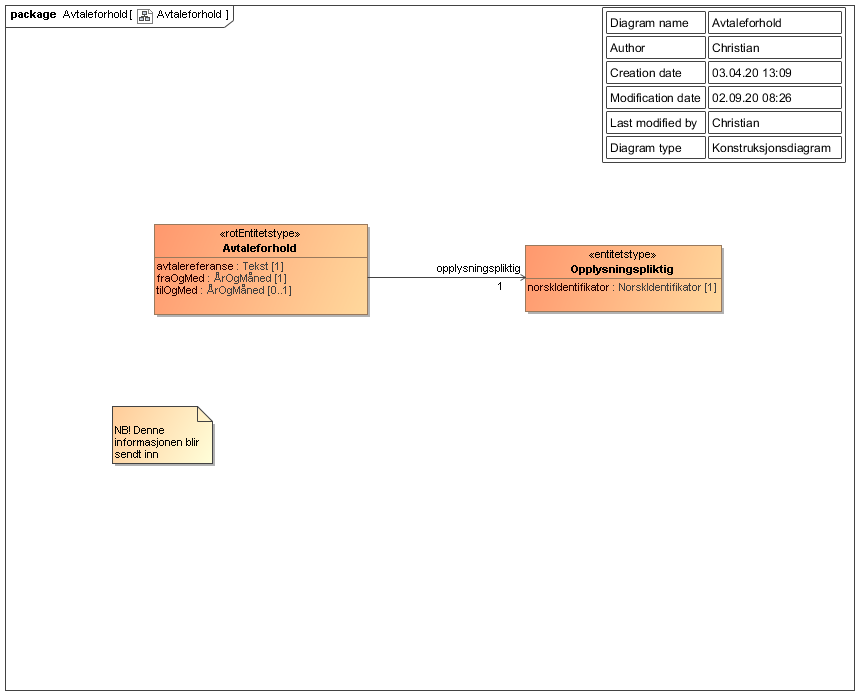
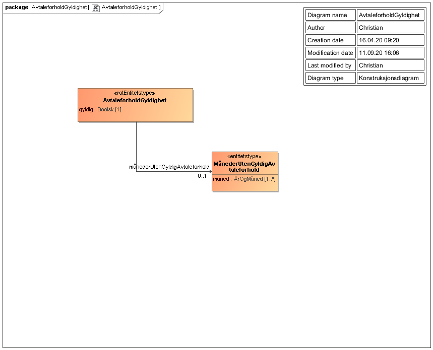

<Summary>Tjeneste hvor pensjonsinnretninger kan registrere, oppdatere og slette opplysninger om pensjonsavtaleforhold. Tjenesten kan også levere informasjon om det foreligger gyldig avtaleforhold mellom arbeidsgiver og pensjonsinnretning.</Summary>

<Tabs underline={true}>
<TabItem headerText="Om tjenesten" itemKey="itemKey-1" default>

For generell informasjon om tjenestene se egne sider om:
* [Bruk av tjenestene](../om/bruk.md)
* [Sikkerhetsmekansimer](../om/sikkerhet.md)
* [Rettighetspakker](../om/rettighetspakker.md) 
* [Feilhåndtering](../om/feil.md)
* [Versjonering](../om/versjoner.md)
* [Teknisk spesifikasjon](../om/tekniskspesifikasjon.md)

## Scope
Følgende scope skal benyttes ved autentisering i Maskinporten: `skatteetaten:tjenestepensjonsavtale`

## Delegering
Tilgang til dette API-et kan delegeres i Altinn, f.eks. dersom leverandør benyttes for den tekniske oppkoblingen. Søk opp følgende tjeneste i Altinn for å delegere tilgangen: `Tjenestepensjonsavtale API - På vegne av`

## Teknisk spesifikasjon
URL-er til API-et, beskrivelsen av parameterne, endepunkter og respons ligger i [Open API spesifikasjonen](https://app.swaggerhub.com/apis/skatteetaten/tjenestepensjonsavtale-api) på SwaggerHub.

## Rettighetspakker
 
| Navn på rettighetspakke |	Kommentar |
|---| --- |
| nav | Kun tilgang til endepunktene for å sjekke gyldighet for virkningsperiode og avtalteforhold|
| otp | Kun tilgang til å opprette, endre og slette avtaleforhold |
 
## Datakatalog
[Datatjenestebeskrivelse](https://data.norge.no/dataservices/8018e29d-f608-31b6-965e-00c290386612) i Felles datakatalog.

</TabItem>
<TabItem headerText="Eksempler" itemKey="itemKey-2">

## Hent avtaleforhold gyldighet

### Curl

```bash
$ curl -v -H "Authorization: Bearer {maskinporten_token}" "https://api-test.sits.no/api/tjenestepensjonsavtale/v1/{rettighetspakke}/avtaleforhold/gyldighet?opplysningspliktig=987654321&pensjonsinnretning=123456789&fraOgMed=2020-01&tilOgMed=2020-06"
```

### JSON
```json
{
  "gyldig": "false",
  "maanederUtenGyldigAvtaleforhold": {
    "maaned": [
      "2020-01",
      "2020-02",
      "2020-04"
    ]
  }
}
```
### XML
For svar på XML format, sett header `Accept` til `application/xml`:

```bash
$ curl -v -H "Accept: application/xml" -H "Authorization: Bearer {maskinporten_token}" "https://api-test.sits.no/api/tjenestepensjonsavtale/v1/{rettighetspakke}/avtaleforhold/gyldighet?opplysningspliktig=987654321&pensjonsinnretning=123456789&fraOgMed=2020-01&tilOgMed=2020-06"
```
 
[tjenestepensjonsavtaleAvtaleforholdGyldighet.xsd](../../static/download/tjenestepensjonsavtaleAvtaleforholdGyldighetV1.xsd)

[tjenestepensjonsavtaleAvtaleforholdGyldighet.xml (eksempel)](../../static/download/tjenestepensjonsavtaleAvtaleforholdGyldighet.xml)


## Hent virkningsperiode gyldighet

### Curl

```bash
$ curl -v -H "Authorization: Bearer {maskinporten_token}" "https://api-test.sits.no/api/tjenestepensjonsavtale/v1/{rettighetspakke}/avtaleforhold/virkningsperiode/gyldighet?opplysningspliktig=987654321&pensjonsinnretning=123456789&fraOgMed=2020-01&tilOgMed=2020-06"
```

#### Eksempel på respons
```json
{
    "gyldig": false,
    "maanederUtenforGyldigVirkningsperiode": {
        "maaned": [
            "2020-01",
            "2020-02",
            "2020-03"
        ]
    }
} 
```

## Registrere/endre avtale

### Curl

```bash
$ curl -v -H "Content-Type: application/json" -H "Authorization: Bearer {maskinporten_token}" -X POST -d '{"avtalereferanse" : "referanse til avtale","fraOgMed" : "2020-01","opplysningspliktig" : {"norskIdentifikator" : "999999999"}}' "https://api-test.sits.no/api/tjenestepensjonsavtale/v1/{rettighetspakke}/avtaleforhold"
```
### Dokumentformat

[TjenestepensjonsavtaleAvtaleforholdV1.xsd](../../static/download/TjenestepensjonsavtaleAvtaleforholdV1.xsd)

[TjenestepensjonsavtaleAvtaleforholdV1.json](../../static/download/TjenestepensjonsavtaleAvtaleforholdV1.json)

## Slette avtale

### Curl
  
```bash
$ curl -v -H "Content-Type: application/json" -H "Authorization: Bearer {maskinporten_token}" -X DELETE -d '{"avtalereferanse" : "referanse til avtale","opplysningspliktig" : {"norskIdentifikator" : "999999999"}}' "https://api-test.sits.no/api/tjenestepensjonsavtale/v1/{rettighetspakke}/avtaleforhold"
```
### Dokumentformat

[TjenestepensjonsavtaleAvtaleforholdSlettV1.xsd](../../static/download/TjenestepensjonsavtaleAvtaleforholdSlettV1.xsd)

[TjenestepensjonsavtaleAvtaleforholdSlettV1.json](../../static/download/TjenestepensjonsavtaleAvtaleforholdSlettV1.json)
 
</TabItem>
<TabItem headerText="Feilkoder" itemKey="itemKey-3">

Se egen side for generell info om [feilhåndtering i tjenestene](../om/feil.md).

Tabellen under viser en oversikt over hvilke spesifikke feilkoder denne applikasjonen kan gi. Feilmeldingen vil kunne variere selv om samme feilkode returneres. Dette er for å kunne gi en så presis beskrivelse av feilen som mulig.

| Feilkode | HTTP Statuskode | Feilområde |
|----------|-----------------|-------|
| OTP-001 | 500 | Uventet feil på tjenesten.  |
| OTP-002 | 500 | Uventet feil i et bakenforliggende system.  |
| OTP-003 | 404 | Ukjent url benyttet. |
| OTP-004 | 401 | Feil i forbindelse med autentisering.  |
| OTP-005 | 403 | Feil i forbindelse med autorisering.  |
| OTP-006 | 400 | Feil i forbindelse med validering av inputdata. |
| OTP-007 | 404 | Ingen data funnet på oppgitte inputparametere. |
| OTP-008 | 406 | Feil tilknyttet dataformat. Kun json eller xml er støttet. |

</TabItem>
<TabItem headerText="Informasjonsmodell" itemKey="itemKey-4">

Obs. Hvis modellene på denne siden avviker fra Open API spesifikasjonen på Swaggerhub, er det Open API spesifikasjonen som er mest oppdatert. 

Tjenesten tilbyr følgende endepunkt med forskjellige modeller.

## Opprette eller endre avtaleforhold
Informasjonsmodell for avtaleforhold tilknyttet tjenestepensjonsavtale, og oversikt over verdier som sendes inn gjennom endepunktet for å opprette avtaleforhold.

### Avtaleforhold

| Felt | Beskrivelse |
| ---- | -------------------------------------------------------- |
| avtalereferanse | Pensjonsinnretningens egen referanse til avtalen |
| fraOgMed | Start årstall og måned for avtaleinngåelse angitt i nummer, må oppgis som YYYY-MM |
| tilOgMed | Slutt årstall og måned for opphør av avtale angitt i nummer, må oppgis som YYYY-MM |
| opplysningspliktig | Den opplysningspliktige som avtaleforholdet er med  |
 
### Opplysingsingspliktig

| Felt | Beskrivelse |
| ---- | ------------------------------------------------------ |
| norskIdentifikator | Opplysningspliktiges organisasjonsnummer |

### Figur 


## Slette avtaleforhold

Informasjonsmodell for å slette avtaleforhold tilknyttet tjenestepensjonsavtale, og oversikt over verdier som sendes inn gjennom endepunktet for å slette avtaleforhold.

### Avtaleforhold

| Felt | Beskrivelse |
| ---- | -------------------------------------------------------- |
| avtalereferanse | Pensjonsinnretningens egen referanse til avtalen |
| opplysningspliktig | Den opplysningspliktige som avtaleforholdet er med  |

### Opplysingsingspliktig

| Felt | Beskrivelse |
| ---- | ------------------------------------------------------ |
| norskIdentifikator | Opplysningspliktiges organisasjonsnummer |

### Figur


## Sjekk om gyldig avtaleforhold finnes for periode

Informasjonsmodell for gyldig avtaleforhold for tjenestepensjonsavtale og oversikt over verdier som returneres i data fra endepunktet avtaleforhold/gyldighet.

### AvtaleforholdGyldighet

| Navn på felt | Beskrivelse |
| -------------- | ---------------------------------------------- |
|  gyldig | Boolsk felt som er sann/true dersom det finnes en eller flere gyldige avtaleforhold for hele perioden det blir spurt om. Se [Forutsetning for bruk](./forutsetningerforbruk.md) for ytterligere informasjon om avtaleforhold. |
| måndederUtenGyldigAvtaleforhold | Liste med måneder som ikke har avtale.  Fylles kun ut når "gyldig" er usann/false |

### MånederUtenGyldigAvtaleforhold

| Navn på felt | Beskrivelse |
| -------------- | ----------------------------------------------|
| måned        | Måned som ikke har et gyldig avtaleforhold | 

### Figur


## Sjekk om gyldig virkningsperioden for et avtaleforholdet finnes for periode

Informasjonsmodell for virkningsperiodens gyldighet for tjenestepensjonsavtale og oversikt over verdier som returneres i data fra endepunktet virkningsperiode/gyldighet.

### VirkningsperiodeGyldighet

| Navn på felt | Beskrivelse |
| -------------- | ---------------------------------------------- |
|  gyldig | Boolsk felt som er sann/true dersom det finnes en eller flere avtaleforhold med gyldig virkningsperiode for hele perioden det blir spurt om. Se [Forutsetning for bruk](./forutsetningerforbruk.md) for ytterligere informasjon om virkningsperiode.  |
| måndederUtenforGyldigVirkningsperiode | Liste med måneder som ikke har avtale med gyldig virkningsperiode.  Fylles kun ut når "gyldig" er usann/false |

### MånederUtenforGyldigVirkningsperiode

| Navn på felt | Beskrivelse |
| -------------- | ----------------------------------------------|
| måned        | Måned som er utenfor gyldig virkningsperiode for avtaler | 

### Figur


  
</TabItem>
<TabItem headerText="Test" itemKey="itemKey-5">

## Tenor testdatasøk

Testdata for tjenesten kan finnes i [Tenor](../test/tenor.md) med søkene for "Tjenestepensjonsavtale" både for personer og virksomheter.
  
## Testdata

Tjenestepensjonsavtaler for personer med adressebeskyttelse fortrolig og strengt fortrolig er ikke søkbare i Tenor, tabell med parter er distribuert via BITS.

</TabItem>
</Tabs>
