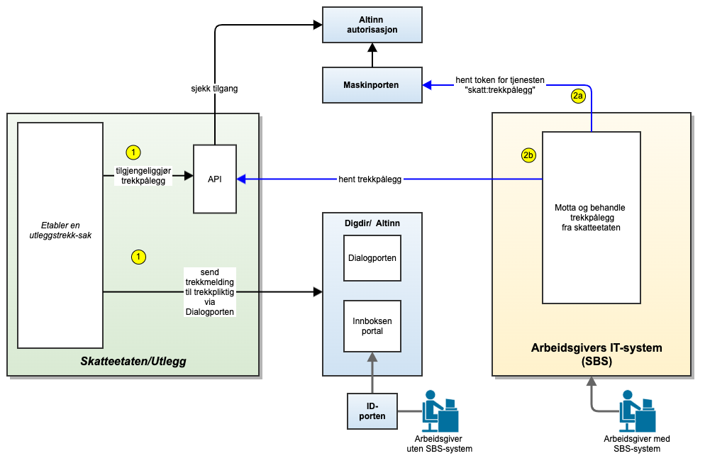
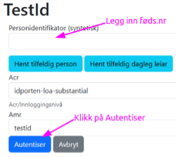
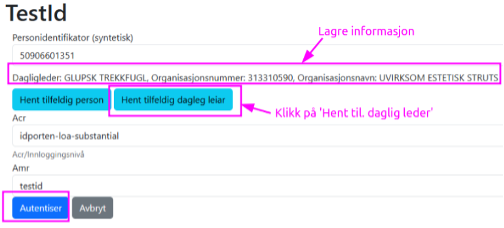

<Summary> Denne siden beskriver et nytt grensesnitt mellom IT-systemene til Skatteetaten og trekkpliktige/arbeidsgivere.</Summary>

<Tabs underline={true}>
<TabItem headerText="Om tjenesten" itemKey="itemKey-1" default>

Målgruppen for siden er utviklere og IT-arkitekter hos systemleverandører som leverer lønns- og personalsystemer (eller
sluttbrukersystemer) til arbeidsgivere. Slike systemer kalles i det videre sluttbrukersystemer og forkortes SBS.
Det skal etableres et nytt grensesnitt for å formidle trekkpålegg fra Skatteetaten til arbeidsgivere med ansatte som
skal ha utleggstrekk i lønn.

Grensesnittet vil på sikt erstatte det eksisterende grensesnittet for trekkformidling, men i første omgang vil det nye
grensesnittet komme i tillegg til det eksisterende grensesnittet. Grensesnittet vil først tilbys i et testmiljø,
deretter i piloter og til slutt i full produksjon.
Figuren under viser arkitekturen: 
### Beskrivelse:
Skatteetaten etablerer en ny utleggstrekksak og oppretter en JSON-melding om dette i utleggstrekk-API

Send informasjon om nytt trekkpålegg til arbeidsgiver via Dialogporten
Arbeidsgiver henter trekkpålegg fra Skatteetaten.
2a SBS henter et systembrukertoken fra Maskinporten
2b SBS utfører kall (get) mot trekkpålegg-API for å hente trekkpålegg
Trekkpliktig arbeidsgiver kan også hente de samme trekkpåleggene fra Altinn-innboksen i Digdirs Felles arbeidsflate. En slik løsning vil videreføres også i fremtiden.
For generell informasjon om tjenester fra Skatteetaten se egne sider om:

* [Sikkerhetsmekansimer](../om/sikkerhet.md)
* [Systembruker](../om/systembruker.md)
* [Feilhåndtering](../om/feil.md)
* [Versjonering](../om/versjoner.md)
* [Teknisk spesifikasjon](../om/tekniskspesifikasjon.md)

## Scope

Følgende scope skal benyttes ved autentisering i Maskinporten: `skatteetaten:trekkpaalegg`.

Ved bruk av systembruker må forespørselen også inneholde ressurs-id `ske-informasjon-om-trekkpaalegg` som beskrevet her for produksjon: https://docs.altinn.studio/api/authentication/systemuserapi/systemuserrequest/external/#create-a-standard-system-user-request

## Teknisk spesifikasjon

URL-er til API-et, beskrivelsen av parameterne, endepunkter og respons ligger
i [Open API spesifikasjonen](https://app.swaggerhub.com/apis/skatteetaten/trekkpaalegg-app) på SwaggerHub.

Skatteetaten tilbyr API for å hente trekkpålegg.

Hovedtrekkene i det nye grensesnittet er:

* Grensesnittet er et maskin-maskin-grensesnitt som overfører trekkpålegg fra Skatteetaten til arbeidsgivere med
  SBS-systemer.
* Grensesnittet er basert på en RESTful-stil som tilbyr et API.
* SBS må spørre (poll) mot grensesnittet for å sjekke om det er nye trekkpålegg.
* Det vil etter hvert komme et grensesnitt der SBS kan motta notifikasjon (event) om at Skatteetaten har et nytt
  trekkpålegg til arbeidsgiver.
* I grensesnittet må SBS presentere et token som inneholder organisasjonsnummeret til trekkpliktig arbeidsgiver.
* Tokenet får SBS ved å koble seg opp mot Maskinporten med et gitt "scope".
* Trekkpålegget leveres i formatet JSON.

## API Spesifikasjon
Skatteetaten tilbyr API for å hente trekkpålegg.

Open API spesifikasjonen er tilgjengelig her: swaggerhub

### Trekkpålegg API
Alle URIer er relative til

https://api-test.sits.no (test)
--- (prod)
Metode	HTTP request	Beskrivelse
hent alle gjeldende	GET /api/trekkpaalegg/v1	Hent alle gjeldende trekkpålegg for den trekkpliktige
hent versjon	GET /api/trekkpaalegg/v1/trekkid/trekkversjon	Hent en spesifikk versjon av et trekkpålegg.

### Hent alle gjeldende
GET /api/trekkpaalegg/v1

Returnerer siste versjon av samtlige trekkpålegg for en trekkpliktig. Dersom en trekkpliktig har svært mange trekkpålegg (flere tusen) så bør man benytte fraSekvensnummer og maksAntall for begrense returen til kun å inneholde trekkpålegg som er endret siden forrige spørring. Dersom antall returnerte trekkpålegg er lik maksAntall så må det gjøres en ny spørring med fraSekvensnummer lik det største sekvensnummeret i siste retur inntil man har fått returnert samtlige endrede trekkpålegg.

### Parametre
Navn	Type	Beskrivelse	Notater
fraSekvensnummer	String	Begrenser returnerte trekkpålegg til bare inneholde nyere enn angitt sekvensnummer. 0 eller større. Oppgis sammen med maksAntall. Mest relevant for trekkpliktige med svært mange trekkpålegg	[default til null]
maksAntall	String	Angir maks antall trekkpålegg som skal returneres. 1 eller større. Skal bare brukes sammen med fraSekvensnummer. Mest relevant for trekkpliktige med svært mange trekkpålegg	[default til null]

### Retur type
Liste av Trekkpaalegg https://skatteetaten.github.io/beta-apier/trekkpaalegg/feltbeskrivelser/Models/Trekkpaalegg

### Autorisasjon
Se Tilgang https://skatteetaten.github.io/beta-apier/trekkpaalegg/tilgang

### HTTP request headere
Content-Type: Ikke definert
Accept: application/json, */*

### Hent versjon
GET /api/trekkpaalegg/v1/trekkid/trekkversjon
Returnerer den angitte versjonen av et trekkpålegg

### Parametre
Navn	Type	Beskrivelse	Notater
trekkid	String	Id til trekkpålegget	[default til null]
trekkversjon	String	Versjonen til det angitte trekkpålegg	[default til null]

### Retur type
Trekkpaalegg

### Autorisasjon
Se Tilgang

### HTTP request headere
Content-Type: Ikke definert
Accept: application/json, */*

Open API spesifikasjonen er tilgjengelig her :

swaggerhub
Trekkpålegg API
Alle URIer er relative til

https://api-test.sits.no (test)
--- (prod)
Metode	HTTP request	Beskrivelse
hent alle gjeldende	GET /api/trekkpaalegg/v1	Hent alle gjeldende trekkpålegg for den trekkpliktige
hent versjon	GET /api/trekkpaalegg/v1/:trekkid/:trekkversjon	Hent en spesifikk versjon av et trekkpålegg.
Hent alle gjeldende
GET /api/trekkpaalegg/v1

Returnerer siste versjon av samtlige trekkpålegg for en trekkpliktig. Dersom en trekkpliktig har svært mange trekkpålegg (flere tusen) så bør man benytte fraSekvensnummer og maksAntall for begrense returen til kun å inneholde trekkpålegg som er endret siden forrige spørring. Dersom antall returnerte trekkpålegg er lik maksAntall så må det gjøres en ny spørring med fraSekvensnummer lik det største sekvensnummeret i siste retur inntil man har fått returnert samtlige endrede trekkpålegg.

Parametre
Navn	Type	Beskrivelse	Notater
fraSekvensnummer	String	Begrenser returnerte trekkpålegg til bare inneholde nyere enn angitt sekvensnummer. 0 eller større. Oppgis sammen med maksAntall. Mest relevant for trekkpliktige med svært mange trekkpålegg	[default til null]
maksAntall	String	Angir maks antall trekkpålegg som skal returneres. 1 eller større. Skal bare brukes sammen med fraSekvensnummer. Mest relevant for trekkpliktige med svært mange trekkpålegg	[default til null]
Retur type
Liste av Trekkpaalegg

Autorisasjon
Se Tilgang

HTTP request headere
Content-Type: Ikke definert
Accept: application/json, */*
Hent versjon
GET /api/trekkpaalegg/v1/trekkid/trekkversjon

Returnerer den angitte versjonen av et trekkpålegg

Parametre
Navn	Type	Beskrivelse	Notater
trekkid	String	Id til trekkpålegget	[default til null]
trekkversjon	String	Versjonen til det angitte trekkpålegg	[default til null]
Retur type
Trekkpaalegg

Autorisasjon
Se Tilgang

HTTP request headere
Content-Type: Ikke definert
Accept: application/json, */*

## Datakatalog


## Tilgang til tjenesten
Tilgang styres via Maskinporten.

For å få utstedt token av Maskinporten må lønnssystemet gjennom sitt virksomhetssertifikat angi hvilket organisasjonsnummer de representerer. Dette organisasjonsnummeret må være godkjent av Skatteetaten.

For å benytte tjenestene for trekkpålegg skal følgende scope angis ved autentisering i Maskinporten: skatteetaten:trekkpaalegg

API-et støtter to varianter av autentisering via Maskinporten. Disse er beskrevet under

### Alternativ 1 - Systemleverandør er trekkpliktig
Dersom systemleverandør kun skal motta trekkpålegg for sin egen organisasjon, kan man benytte klassisk autentisering via Maskinporten. Mer informasjon om dette finnes her.

### Alternativ 2 - Systembruker
Dersom systemleverandør ønsker å tilby funksjonalitet der en annen organisasjon (kunde av systemleverandøren) skal benytte systemet til å motta trekkpålegg, skal Altinn sin nye funksjonalitet for ‘systembruker’ benyttes. Mer informasjon om dette finnes i Altinn Systembruker for SBS og Systembruker roadmap.

Systemleverandør må for å støtte systembruker registrere seg i Maskinporten og Altinn test environment.

### Testoppsett
### Test uten bruk av systembruker (alternativ 1)
Valgfrie organisasjoner fra Tenor kan benyttes som trekkpliktig.

### Test der systembruker benyttes (alternativ 2)
Valgfrie organisasjoner fra Tenor kan benyttes som trekkpliktig. Den valgte organisasjonen i Tenor (som representerer en trekkpliktig) må godkjenne at dens fagsystem kan benytte tilgangsressursen/tjenesten «Informasjon om trekkpålegg» på vegne av virksomheten. Det opprettes da en «systembruker» som er koblingen mellom bruker, system, leverandør og API.
Dette API-et finnes foreløpig ikke i Felles datakatalog.

</TabItem>
<TabItem headerText="Eksempler" itemKey="itemKey-2"> 

## Eksempler på innhold ved kall på tjenesten
Vær oppmerksom på at det til enhver tid vil være siste tilgjengelige versjon av et trekkpålegg som returneres ved kall på tjenesten.

Sørg også for å benytte eget organisasjonsnummer for feltet `trekkpliktig` og en passende skyldners fødselsnummer i feltet `skyldner`.

### Nyopprettet trekkpålegg på ny skyldner - prosenttrekk
* Prosenttrekk, 17 % av inntekten. Trekket skal løpe på ubestemt tid.

#### versjon 1

```json
{
  "trekkid": "10001",
  "skyldner": "10108412345",
  "opprettet": "2025-08-09T15:00:00.00Z",
  "saksnummer": "TREKK/2025/1",
  "trekkstatus": "aktiv",
  "trekkpliktig": "123456789",
  "trekkversjon": 1,
  "sekvensnummer": 38,
  "betalingsinformasjon": {
    "kidnummer": "6487719756",
    "kontonummer": "70213997155",
    "betalingsmottaker": "971648199"
  },
  "trekkstoerrelseForPeriode": [
    {
      "startdato": "2025-08-10",
      "trekkprosent": {
        "trekkprosent": 17.0
      }
    }
  ]
}
```

### Nyopprettet trekkpålegg på ny skyldner - beløpstrekk
* Beløpstrekk, 5000 kr i måneden. Trekket skal løpe på ubestemt tid.

#### versjon 1

```json
{
  "trekkid": "10002",
  "skyldner": "10108412345",
  "opprettet": "2025-08-09T15:00:00.00Z",
  "saksnummer": "TREKK/2025/2",
  "trekkstatus": "aktiv",
  "trekkpliktig": "123456789",
  "trekkversjon": 1,
  "sekvensnummer": 51,
  "betalingsinformasjon": {
    "kidnummer": "6487719756",
    "kontonummer": "70213997155",
    "betalingsmottaker": "971648199"
  },
  "trekkstoerrelseForPeriode": [
    {
      "startdato": "2025-08-10",
      "trekkbeloep": {
        "trekkbeloep": 5000
      }
    }
  ]
}
```

### Oppdatert trekk
* Prosenttrekk, 23 % av inntekten, opprettes og løper urørt i 3 md. Pga av endringer i livssituasjon gjøres endringer i trekket.
* Trekket oppdateres, det skal nå trekkes 17 % av inntekten.

#### versjon 1

```json
{
  "trekkid": "10003",
  "skyldner": "10108412345",
  "opprettet": "2025-05-05T15:00:00.00Z",
  "saksnummer": "TREKK/2025/3",
  "trekkstatus": "aktiv",
  "trekkpliktig": "123456789",
  "trekkversjon": 1,
  "sekvensnummer": 80,
  "betalingsinformasjon": {
    "kidnummer": "6487719756",
    "kontonummer": "70213997155",
    "betalingsmottaker": "971648199"
  },
  "trekkstoerrelseForPeriode": [
    {
      "startdato": "2025-05-10",
      "trekkprosent": {
        "trekkprosent": 23.0
      }
    }
  ]
}
```

#### versjon 2

```json
{
  "trekkid": "10003",
  "skyldner": "10108412345",
  "opprettet": "2025-08-08T15:00:00.00Z",
  "saksnummer": "TREKK/2025/3",
  "trekkstatus": "aktiv",
  "trekkpliktig": "123456789",
  "trekkversjon": 2,
  "sekvensnummer": 101,
  "betalingsinformasjon": {
    "kidnummer": "6487719756",
    "kontonummer": "70213997155",
    "betalingsmottaker": "971648199"
  },
  "trekkstoerrelseForPeriode": [
    {
      "startdato": "2025-05-10",
      "sluttdato": "2025-08-09",
      "trekkprosent": {
        "trekkprosent": 23.0
      }
    },
    {
      "startdato": "2025-08-10",
      "trekkprosent": {
        "trekkprosent": 17.0
      }
    }
  ]
}
```
### Avslutte trekk etter tre måneder.
* Prosenttrekk 17 % én periode. Avsluttes.

#### versjon 1

```json
{
  "trekkid": "10004",
  "skyldner": "10108412345",
  "opprettet": "2025-06-01T15:00:00.00Z",
  "saksnummer": "TREKK/2025/4",
  "trekkstatus": "aktiv",
  "trekkpliktig": "123456789",
  "trekkversjon": 1,
  "sekvensnummer": 142,
  "betalingsinformasjon": {
    "kidnummer": "6487719756",
    "kontonummer": "70213997155",
    "betalingsmottaker": "971648199"
  },
  "trekkstoerrelseForPeriode": [
    {
      "startdato": "2025-06-10",
      "trekkprosent": {
        "trekkprosent": 17.0
      }
    }
  ]
}
```

#### versjon 2

```json
{
  "trekkid": "10004",
  "skyldner": "10108412345",
  "opprettet": "2025-07-05T15:00:00.00Z",
  "saksnummer": "TREKK/2025/4",
  "trekkstatus": "avsluttet",
  "trekkpliktig": "123456789",
  "trekkversjon": 2,
  "sekvensnummer": 159,
  "betalingsinformasjon": {
    "kidnummer": "6487719756",
    "kontonummer": "70213997155",
    "betalingsmottaker": "971648199"
  },
  "trekkstoerrelseForPeriode": [
    {
      "startdato": "2025-06-10",
      "sluttdato": "2025-09-12",
      "trekkprosent": {
        "trekkprosent": 17.0
      }
    }
  ]
}
```

### Avslutte trekk, men siste trekk blir annerledes pga restbeløp.
* Prosenttrekk, 23 % av inntekten. Løper urørt i to måneder.
* Endring pga siste betaling, beløpstrekk 4400 kr med sluttdato.
* Trekket avsluttes.

#### versjon 1
```json
{
  "trekkid": "10005",
  "skyldner": "10108412345",
  "opprettet": "2025-06-05T15:00:00.00Z",
  "saksnummer": "TREKK/2025/5",
  "trekkstatus": "aktiv",
  "trekkpliktig": "123456789",
  "trekkversjon": 1,
  "sekvensnummer": 205,
  "betalingsinformasjon": {
    "kidnummer": "6487719756",
    "kontonummer": "70213997155",
    "betalingsmottaker": "971648199"
  },
  "trekkstoerrelseForPeriode": [
    {
      "startdato": "2025-06-10",
      "trekkprosent": {
        "trekkprosent": 23.0
      }
    }
  ]
}
```

#### versjon 2
```json
{
  "trekkid": "10005",
  "skyldner": "10108412345",
  "opprettet": "2025-08-09T15:00:00.00Z",
  "saksnummer": "TREKK/2025/5",
  "trekkstatus": "avsluttet",
  "trekkpliktig": "123456789",
  "trekkversjon": 2,
  "sekvensnummer": 228,
  "betalingsinformasjon": {
    "kidnummer": "6487719756",
    "kontonummer": "70213997155",
    "betalingsmottaker": "971648199"
  },
  "trekkstoerrelseForPeriode": [
    {
      "startdato": "2025-06-10",
      "sluttdato": "2025-08-09",
      "trekkprosent": {
        "trekkprosent": 23.0
      }
    },
    {
      "startdato": "2025-08-10",
      "sluttdato": "2025-08-31",
      "trekkbeloep": {
        "trekkbeloep": 4400
      }
    }
  ]
}
```
### Beløpstrekk med mange endringer
* Oppstart trekk 28.08.2025: 8000
* Endring trekk 15.09.2025: 6000
* Endring trekk 14.10.2025: 5000
* Ingen endring trekk - åpen sluttdato
* Endring trekk 10.02.2026: 7000

#### versjon 1

```json
{
  "trekkid": "10006",
  "skyldner": "10108412345",
  "opprettet": "2025-08-26T15:00:00.00Z",
  "saksnummer": "TREKK/2025/6",
  "trekkstatus": "aktiv",
  "trekkpliktig": "123456789",
  "trekkversjon": 1,
  "sekvensnummer": 271,
  "betalingsinformasjon": {
    "kidnummer": "6487719756",
    "kontonummer": "70213997155",
    "betalingsmottaker": "971648199"
  },
  "trekkstoerrelseForPeriode": [
    {
      "startdato": "2025-08-28",
      "trekkbeloep": {
        "trekkbeloep": 8000
      }
    }
  ]
}
```

#### versjon 2

```json
{
  "trekkid": "10006",
  "skyldner": "10108412345",
  "opprettet": "2025-09-12T15:00:00.00Z",
  "saksnummer": "TREKK/2025/6",
  "trekkstatus": "aktiv",
  "trekkpliktig": "123456789",
  "trekkversjon": 2,
  "sekvensnummer": 290,
  "betalingsinformasjon": {
    "kidnummer": "6487719756",
    "kontonummer": "70213997155",
    "betalingsmottaker": "971648199"
  },
  "trekkstoerrelseForPeriode": [
    {
      "startdato": "2025-08-28",
      "sluttdato": "2025-09-14",
      "trekkbeloep": {
        "trekkbeloep": 8000
      }
    },
    {
      "startdato": "2025-09-15",
      "trekkbeloep": {
        "trekkbeloep": 6000
      }
    }
  ]
}
```

#### versjon 3

```json
{
  "trekkid": "10006",
  "skyldner": "10108412345",
  "opprettet": "2025-10-12T15:00:00.00Z",
  "saksnummer": "TREKK/2025/6",
  "trekkstatus": "aktiv",
  "trekkpliktig": "123456789",
  "trekkversjon": 3,
  "sekvensnummer": 301,
  "betalingsinformasjon": {
    "kidnummer": "6487719756",
    "kontonummer": "70213997155",
    "betalingsmottaker": "971648199"
  },
  "trekkstoerrelseForPeriode": [
    {
      "startdato": "2025-08-28",
      "sluttdato": "2025-09-14",
      "trekkbeloep": {
        "trekkbeloep": 8000
      }
    },
    {
      "startdato": "2025-09-15",
      "sluttdato": "2025-10-13",
      "trekkbeloep": {
        "trekkbeloep": 6000
      }
    },
    {
      "startdato": "2025-10-14",
      "trekkbeloep": {
        "trekkbeloep": 5000
      }
    }
  ]
}
```

#### versjon 4

```json
{
  "trekkid": "10006",
  "skyldner": "10108412345",
  "opprettet": "2026-02-09T15:00:00.00Z",
  "saksnummer": "TREKK/2025/6",
  "trekkstatus": "aktiv",
  "trekkpliktig": "123456789",
  "trekkversjon": 4,
  "sekvensnummer": 350,
  "betalingsinformasjon": {
    "kidnummer": "6487719756",
    "kontonummer": "70213997155",
    "betalingsmottaker": "971648199"
  },
  "trekkstoerrelseForPeriode": [
    {
      "startdato": "2025-08-28",
      "sluttdato": "2025-09-14",
      "trekkbeloep": {
        "trekkbeloep": 8000
      }
    },
    {
      "startdato": "2025-09-15",
      "sluttdato": "2025-10-13",
      "trekkbeloep": {
        "trekkbeloep": 6000
      }
    },
    {
      "startdato": "2025-10-14",
      "sluttdato": "2026-02-09",
      "trekkbeloep": {
        "trekkbeloep": 5000
      }
    },
    {
      "startdato": "2026-02-10",
      "trekkbeloep": {
        "trekkbeloep": 7000
      }
    }
  ]
}
```
### Midlertidig endring i trekk (pga. uforutsette utgifter hos skyldner)
* Skyldner har et trekk som løper på 17 %.
* På grunn av uforutsette utgifter får skyldner innvilget stans i trekk i to måneder.
* Trekket fortsetter å løpe på 17 % etter stans-perioden.

Sagt på en annen måte

* Skyldner har løpende trekk 17 %
* Endring i trekket 0 % (men ikke stans/avsluttet)
* Endring i trekket 17 %

#### versjon 1

```json
{
  "trekkid": "10007",
  "skyldner": "10108412345",
  "opprettet": "2025-08-26T15:00:00.00Z",
  "saksnummer": "TREKK/2025/7",
  "trekkstatus": "aktiv",
  "trekkpliktig": "123456789",
  "trekkversjon": 1,
  "sekvensnummer": 351,
  "betalingsinformasjon": {
    "kidnummer": "6487719756",
    "kontonummer": "70213997155",
    "betalingsmottaker": "971648199"
  },
  "trekkstoerrelseForPeriode": [
    {
      "startdato": "2025-08-28",
      "trekkprosent": {
        "trekkprosent": 17.0
      }
    }
  ]
}
```

#### versjon 2

```json
{
  "trekkid": "10007",
  "skyldner": "10108412345",
  "opprettet": "2025-10-09T15:00:00.00Z",
  "saksnummer": "TREKK/2025/7",
  "trekkstatus": "aktiv",
  "trekkpliktig": "123456789",
  "trekkversjon": 2,
  "sekvensnummer": 380,
  "betalingsinformasjon": {
    "kidnummer": "6487719756",
    "kontonummer": "70213997155",
    "betalingsmottaker": "971648199"
  },
  "trekkstoerrelseForPeriode": [
    {
      "startdato": "2025-08-28",
      "sluttdato": "2025-10-10",
      "trekkprosent": {
        "trekkprosent": 17.0
      }
    },
    {
      "startdato": "2025-10-11",
      "sluttdato": "2025-12-10",
      "trekkprosent": {
        "trekkprosent": 0.0
      }
    },
    {
      "startdato": "2025-12-11",
      "trekkprosent": {
        "trekkprosent": 17.0
      }
    }
  ]
}
```

### Trekk mot skyldner avsluttes. Samme skyldner får så et nytt trekk hos samme arbeidsgiver.
* Skyldner får et prosenttrekk i lønn på 32 %.
* Skyldner oppdager at han har fått trekk når han får lønn, typisk den 15. i en måned, og gjør umiddelbart opp for seg.
* Trekket avsluttes den 17. i samme måned.
* Det opprettes et nytt trekk på samme skyldner.
* Nytt trekk med prosenttrekk 33 %.

#### versjon 1

```json
{
  "trekkid": "10008",
  "skyldner": "10108412345",
  "opprettet": "2025-08-26T15:00:00.00Z",
  "saksnummer": "TREKK/2025/8",
  "trekkstatus": "aktiv",
  "trekkpliktig": "123456789",
  "trekkversjon": 1,
  "sekvensnummer": 391,
  "betalingsinformasjon": {
    "kidnummer": "6487719756",
    "kontonummer": "70213997155",
    "betalingsmottaker": "971648199"
  },
  "trekkstoerrelseForPeriode": [
    {
      "startdato": "2025-08-28",
      "trekkprosent": {
        "trekkprosent": 32.0
      }
    }
  ]
}
```

#### versjon 2

```json
{
  "trekkid": "10008",
  "skyldner": "10108412345",
  "opprettet": "2025-08-16T15:00:00.00Z",
  "saksnummer": "TREKK/2025/8",
  "trekkstatus": "avsluttet",
  "trekkpliktig": "123456789",
  "trekkversjon": 2,
  "sekvensnummer": 410,
  "betalingsinformasjon": {
    "kidnummer": "6487719756",
    "kontonummer": "70213997155",
    "betalingsmottaker": "971648199"
  },
  "trekkstoerrelseForPeriode": [
    {
      "startdato": "2025-08-28",
      "sluttdato": "2025-09-17",
      "trekkprosent": {
        "trekkprosent": 32.0
      }
    }
  ]
}
```

#### versjon 3

```json
{
  "trekkid": "10009",
  "skyldner": "10108412345",
  "opprettet": "2025-09-30T15:00:00.00Z",
  "saksnummer": "TREKK/2025/9",
  "trekkstatus": "aktiv",
  "trekkpliktig": "123456789",
  "trekkversjon": 1,
  "sekvensnummer": 430,
  "betalingsinformasjon": {
    "kidnummer": "6487719756",
    "kontonummer": "70213997155",
    "betalingsmottaker": "971648199"
  },
  "trekkstoerrelseForPeriode": [
    {
      "startdato": "2025-10-01",
      "trekkprosent": {
        "trekkprosent": 33.0
      }
    }
  ]
}
```

### Trekket endres flere ganger innenfor en 10-dagersperiode
* 1.10. skyldner får beløpstrekk 3000 kr.
* 7.10. skyldner får endring i beløpstrekk, 2000 kr - ingen sluttdato.

#### versjon 1

```json
{
  "trekkid": "10010",
  "skyldner": "10108412345",
  "opprettet": "2025-08-26T15:00:00.00Z",
  "saksnummer": "TREKK/2025/10",
  "trekkstatus": "aktiv",
  "trekkpliktig": "123456789",
  "trekkversjon": 1,
  "sekvensnummer": 551,
  "betalingsinformasjon": {
    "kidnummer": "6487719756",
    "kontonummer": "70213997155",
    "betalingsmottaker": "971648199"
  },
  "trekkstoerrelseForPeriode": [
    {
      "startdato": "2025-10-01",
      "trekkbeloep": {
        "trekkbeloep": 3000
      }
    }
  ]
}
```

#### versjon 2

```json
{
  "trekkid": "10010",
  "skyldner": "10108412345",
  "opprettet": "2025-10-05T15:00:00.00Z",
  "saksnummer": "TREKK/2025/10",
  "trekkstatus": "aktiv",
  "trekkpliktig": "123456789",
  "trekkversjon": 2,
  "sekvensnummer": 555,
  "betalingsinformasjon": {
    "kidnummer": "6487719756",
    "kontonummer": "70213997155",
    "betalingsmottaker": "971648199"
  },
  "trekkstoerrelseForPeriode": [
    {
      "startdato": "2025-10-01",
      "sluttdato": "2025-10-06",
      "trekkbeloep": {
        "trekkbeloep": 3000
      }
    },
    {
      "startdato": "2025-10-07",
      "trekkbeloep": {
        "trekkbeloep": 2000
      }
    }
  ]
}
```

</TabItem>
<TabItem headerText="Feilkoder" itemKey="itemKey-3">

Se egen side for generell info om [feilhåndtering i tjenestene](../om/feil.md).

Tabellen under viser en oversikt over hvilke spesifikke feilkoder denne applikasjonen kan gi. Feilmeldingen vil kunne
variere selv om samme feilkode returneres. Dette er for å kunne gi en så presis beskrivelse av feilen som mulig.

| Feilkode | HTTP Statuskode | Feilområde                                                     |
|----------|-----------------|----------------------------------------------------------------|
| KB-001   | 500             | Uventet feil på tjenesten.                                     |
| KB-002   | 500             | Uventet feil i et bakenforliggende system.                     |
| KB-003   | 404             | Ukjent url benyttet.                                           |
| KB-004   | 401             | Feil i forbindelse med autentisering.                          |
| KB-005   | 403             | Feil i forbindelse med samtykketoken.                          |
| KB-006   | 400             | Feil i forbindelse med validering av inputdata.                |
| KB-007   | 404             | Fant ingen krav/betalinger på angitt identifikator og periode. |
| KB-008   | 406             | Feil tilknyttet dataformat. Kun json eller xml er støttet.     |
| KB-009   | 404             | Ingen treff på oppgitt identifikator.                          |

</TabItem>
<TabItem headerText="Informasjonsmodell" itemKey="itemKey-4">

Her ser du hele informasjonsmodellen Trekkpålegg API med alle 4 endepunktene.


## Feltforklaringer
| Navn         | Navn     | Type     | Beskrivelse     | Regler   |
|------        |----------|----------|-----------------|--------  |
| Navn         | Navn     | Type     | Beskrivelse     | Regler   |
| trekkid      |          | String   | Id til et trekkpålegg. Trekkpålegg med samme id kan bli oppdatert. Da vil det få et nytt versjonsnummer. | Saksnummer   og kidnummer holdes uendret for samme trekkid. |
| trekkversjon |          | Integer | Versjonen til et trekkpålegg med en ID. Inkrementeres med 1 for hver nye versjon, men beholder samme trekkID | Alltid stigende. |
| sekvensnummer |         | Integer | Globalt løpenummer på tvers av alle trekkpålegg. Kan benyttes som et 'vannmerke' for å huske siste mottatte trekkpålegg. | Alltid stigende. |
| opprettet     |         | Date | Dato for trekkversjon. En kombinasjon av typene Dato og Klokkeslett. Kodes som en tekststreng etter datoformatering spesifisert i ISO 8601 (ISO 8601:2004 Data elements and interchange formats -- Information interchange -- Representation of dates and times). |  Funksjonelt benyttes denne for å vite når endringen ble formidlet. |
| saksnummer   |          | String     | Identifiserer saken hvor trekkpålegget ble besluttet. | Unikt per trekkversjon) |
| trekkpliktig |          | String   | Orgnummeret til den trekkpliktige virksomheten |  |
| skyldner |              | String   | Fødsels- eller d-nummer til ansatt/ytelsesmottaker som skal trekkes i lønn/ytelse. |  |
| Trekkstatus  |          |          | Status på utleggstrekket. Når et trekkpålegg er avsluttet skal det ikke lenger trekkes i lønn/ytelse. | *Alltid status aktiv når sluttdato for siste trekkstørrelse for periode ikke er passert.<br/>*Når sluttdato er satt frem i tid, vil status endres til avsluttet etter at sluttdato er passert (ved midnatt).<br/><ul> Når sluttdato settes til i dag, vil status endres til avsluttet i samme trekkversjon som sluttdatoen blir publisert.
| trekkstoerrelseForPeriode |        | List   | Liste over beløp eller prosent som skal trekkes. Den trekkpliktige må velge korrekt beløp eller prosent avhengig av utbetalingsdatoen for lønnen/ytelsen. | *Trekkpliktig skal trekke det som står i den perioden som gjelder lønnsutbetalingsdatoen. |
|              | startdato | date    | gir verdier for år, måned og dag. Kodes som en tekststreng etter datoformatering spesifisert i ISO 8601 (ISO 8601:2004 Data elements and interchange formats -- Information interchange -- Representation of dates and times). Eksempel : 1998-12-21 eller 19981221. | 
| betalingsinformasjon | Betalingsinformasjon | Informasjons som skal benyttes ved innbetaling. Inneholder KID-nummer, kontonummer og mottakers organisasjonsnummer |*Kan ikke settes eller endres bakover i tid eller i dag.<br />*Kan settes fremover i tid, tidligste mulighet er å sette den til i morgen.<br />*Kan ikke være lik sluttdato på forrige periode. |
|              | sluttdato | date    | gir verdier for år, måned og dag. Kodes som en tekststreng etter datoformatering spesifisert i ISO 8601 (ISO 8601:2004 Data elements and interchange formats -- Information interchange -- Representation of dates and times). Eksempel : 1998-12-21 eller 19981221. | *Kan ikke settes eller endres bakover i tid.<br />*Kan settes til i dag enten fordi ny periode skal starte i morgen (da er trekkets status fortsatt "aktiv"). Eller fordi trekket skal avsluttes helt her og nå (da er status samtidig "avsluttet")<br />*Kan settes fremover i tid.<br />*Kan være lik startdato i samme periode |
|              | trekkbeloep |        | Angi enten trekkbeløp eller trekkprosent | *Kan være 0.<br />*Hvis det er flere lønnsutbetalinger i samme måned, er det den trekkpliktiges ansvar å sørge for at hele beløpet i trekkpålegget blir trukket i løpet av måneden. Det må trekkes ved minst én av lønnsutbetalingene. |
|              | trekkbeloep |        | Angi enten trekkbeløp eller trekkprosent | *Kan være 0.<br />*Trekkes av brutto inntekt.<br>*Trekkes ved hver lønnsutbetaling |
| Betalingsinformasjon|     |        | Informasjons som skal benyttes ved innbetaling. Inneholder KID-nummer, kontonummer og mottakers organisasjonsnummer |        |
|              | betalingsmottaker |    | Organisasjonsnummer til mottaker av betaling | Organisasjonsnummer til Innkrevingsmyndigheten, felles for alle trekkpålegg |
|             | kidnummer |            | kidnummer for trekkpålegget | Unikt per trekkpålegg<br />*ny trekkID, men samme trekkpliktige og skyldner.<br />*samme trekkID, men ny trekkversjon = uendret kidnummer |
|          | kontonummer |     | Kontonummer til mottaker av betaling. | Kontonummer til Innkrevingsmyndigheten, felles for alle trekkpålegg |


</TabItem>
<TabItem headerText="Test" itemKey="itemKey-5">

## Krav til testgjennomføring

Systemleverandørene har ansvar for egen testgjennomføring. Det må fokuseres på at det kan hentes meldinger via gitt endepunkt beskrevet av skatteetaten. Se [API spesifikasjon](./apispesifikasjon/index.md).

Prosjektet bistår med feilsøk og evt. feilretting av vår løsning.

## Oppsummering av test og oppstart i produksjon

Systemleverandørene skal etter avsluttet testperiode og i forkant av produksjon oppsummere testen. Oppsummeringen skal vise hva som er testet, samt status etter gjennomført test inkludert oversikt over feil og mangler. Systemleverandørene skal på skatteetatens forespørsel fremlegge dokumentasjon på hvordan integrasjon er testet.

## Testmiljø

Systemleverandørene må ha testmiljøer som kun består av syntetiske data. Lenke til Skatt sitt testmiljø angitt under [API spesifikasjon](./apispesifikasjon/index.md).

Testmiljøet til Skatteetaten vil i utgangspunktet være tilgjengelig 24/7, men det kan ikke forventes teknisk support eller restart av miljøet hvis det går ned utenfor ordinær arbeidstid (kl. 8 – 15 alle ukedager). Miljøet kan være nede på kveldstid og i helger på grunn av vedlikehold. Testmiljøet til Altinn er [TT02](http://tt02.altinn.no).

## Testdata

For å teste trenger systemleverandør en testbruker som er daglig leder i en tilknyttet enhet.

|   | Testbehov        | Beskrivelse                                                                                                                                                                                                                                                                              | Kommentar                                                                                                       |
|---|------------------|------------------------------------------------------------------------------------------------------------------------------------------------------------------------------------------------------------------------------------------------------------------------------------------|-----------------------------------------------------------------------------------------------------------------|
| 1 | Hvis du allerede har en testbruker du ønsker å bruke | <ul><li>Følg lenke til testmiljøet til Altinn</li><li>Velg ‘Log inn i Altinn (TT02) testmiljø’</li><li>Velg ‘TestID’</li><li>Legg inn fødselsnummer til daglig leder</li><li>Klikk på ‘Autentiser’</li><li>Under ‘Alle dine aktører’ klikk på organisasjon som daglig leder representerer</li></ul>                    | Lenke til testmiljø i Altinn http://tt02.altinn.no <br/>  |
| 2 | Hvis du skal finne en ny testbruker | <ul><li>Følg lenke til testmiljøet til Altinn</li><li>Velg ‘Log inn i Altinn (TT02) testmiljø’</li><li>Velg ‘TestID’</li><li>Velg ‘Hent tilfeldig daglig leder’</li><li>Lagre personidentifikator og organisasjonsnummer</li><li>Klikk på ‘Autentiser’</li><li>Under ‘Alle dine aktører’ klikk på organisasjon som dagligleder representerer</li></ul>  | Lenke til testmiljø i Altinn http://tt02.altinn.no <br/>               |

## Oppsett av maskinport-integrasjon og eventuelt systembruker

Se [tilgang](./tilgang.md) for hvordan få tilgang til tjenesten.

Tilgang til scope i test bestilles ved å sende en mail med ditt organisasjonsnummer til fremtidensinnkreving@skatteetaten.no

## Verifisere at du når løsningen og be deretter om å få opprettet testdata for trekkpålegg

|   | Steg             | Beskrivelse                                                                                                                                                                                                                  | Kommentar |
|---|------------------|------------------------------------------------------------------------------------------------------------------------------------------------------------------------------------------------------------------------------|-------|
| 1 | Gjør et kall mot tjenesten for trekkpålegg for å verifisere at du når tjenesten i test | Før det er tilgjengeliggjort data for dere, så vil du få en respons 200.                                                                                                              |       |
| 2 | Få tilgang på testdata | Når integrasjonen er testet tar du kontakt med oss via mail fremtidensinnkreving@skatteetaten.no og oppgir det org.nummeret dere har klargjort. Vi vil legge tilgjengelig testdata til dere for dette organisasjonsnummeret. | Dere vil kunne få testdata på flere parter på samme org.nummer eller dere oppretter flere org.nummer som dere ønsker å hente fra.      |

</TabItem>

<TabItem headerText="Sjekkliste for lønns- og personalsystemleverandører" itemKey="itemKey-6">

## Sjekkliste for lønns- og personalsystemleverandører

Integrasjon med Skatteetatens API for trekkpålegg

### 1. Forberedelser og avtaler

* Avklar roller og ansvar internt (teknisk kontakt, prosjektansvarlig, etc.)
* Sett deg inn i gjeldende informasjon for digital innsending av utleggsbegjæring
    * [Github](https://skatteetaten.github.io/api-dokumentasjon/api/utleggsbegjaering?tab=Om+tjenesten)
    * [Skatteettaten.no](https://www.skatteetaten.no/om-skatteetaten/fremtidens-innkreving/systemleverandorer/lonns--og-personalsystem/)
    * [Swaggerhub](https://app.swaggerhub.com/apis/skatteetaten/trekkpaalegg-app/1.4)
    * [Nettside for oppkobling](https://www.skatteetaten.no/samarbeidspartnere/reetablering-altinn/systemleverandor/oppkobling/)

### 2. Tilgang og autentisering

* Skaff virksomhetssertifikat (PKI) 6
* Registrer systemet i [Maskinporten](https://docs.digdir.no/docs/Maskinporten/maskinporten_overordnet)
* [Be Skatteetaten om tilgang](https://encoded-592c9deb-987b-4562-aa3c-9fa3d37d83e9.uri/mailto%3a%5bfremtidensinnkreving%40skatteetaten.no%5d) til test-scope: ```skatteetaten:trekkpaalegg```. Oppgi virksomhetens organisasjonsnummer (ikke syntetisk).
* Hent testdata fra [Syntetisk Norge](https://www.digdir.no/tenor/syntetisk-norge/3910) via [Tenor testdatasøk](https://tenor.test.norge.no/)
* Velg syntetiske virksomheter og syntetiske personer og [be om at Skatteetaten oppretter trekkpålegg i test](https://encoded-592c9deb-987b-4562-aa3c-9fa3d37d83e9.uri/mailto%3a%5bfremtidensinnkreving%40skatteetaten.no%5d)
* Sett opp [Systembruker](https://www.skatteetaten.no/samarbeidspartnere/reetablering-altinn/systemleverandor/#testplan-for-systemleverandorer) dersom dere utvikler systemer for andre
* Test uthenting av token med korrekt org.nr. via Maskinporten

### 3. Testmiljø og testdata

* Sett opp testmiljø med **kun** syntetiske data
* Bruk kun syntetiske data i vedlegg og meldinger
* Koble til Skatteetatens testmiljø: ```https://api-test.sits.no```

### 4. Implementasjon og integrasjon

* Følg [API-spesifikasjonen på SwaggerHub](https://app.swaggerhub.com/apis/skatteetaten/trekkpaalegg-app/1.4)
* Sørg for robust feilhåndtering og validering
* Implementer evt. polling eller event-varsling via [Dialogporten](https://docs.digdir.no/docs/dialogporten/) (valgfritt)

### 5. Testing og verifisering

* Gjennomfør testing inkludert:
    * Test full flyt: mottak, feilhåndtering og validering
    * Verifiser at dere mottar korrekt respons fra API
    * Loggfør testresultater og oppsummer testforløpet
    * Dokumenter integrasjon og test
* Send oppsummering til Skatteetaten ved forespørsel. **Du får ikke tilgang til produksjonsmiljø før dette er gjennomført**

### 6. Overgang til produksjon

* [Be om tilgang](https://encoded-592c9deb-987b-4562-aa3c-9fa3d37d83e9.uri/mailto%3a%5bmailto%3afremtidensinnkreving%40skatteetaten.no%5d) til produksjons-scope: ```skatteetaten:trekkpåålegg```
    * Signer avtale (se «vilkår for bruk») med Skatteetaten som kommer i retur
* Motta og verifiser tilgang til produksjons-scope i Maskinporten
* Bytt miljø i integrasjonen til produksjon
* Utfør teknisk verifikasjon i produksjon
* Klargjør supportrutiner for håndtering av reelle saker

### 7. Oppfølging

* Abonner på oppdateringer fra Skatteetaten (f.eks. endringer i API eller informasjonsmodell) og følg med på informasjonsmøter mm
    * Følg med på [Skatteetatens Statusside](https://status.skatteetaten.no/)
    * [Kontaktskjema for datadeling](https://www.skatteetaten.no/deling/kontakt)
* Gi tilbakemeldinger eller innspill ved behov

</TabItem>

</Tabs>
