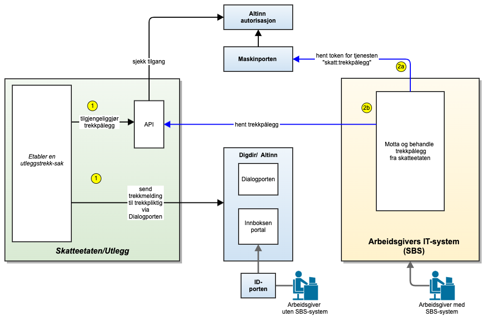
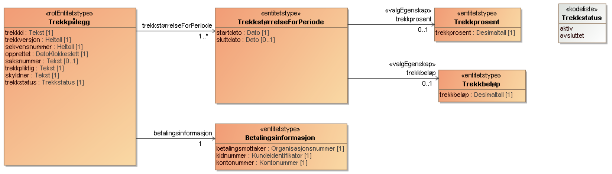

 
Denne siden beskriver et nytt grensesnitt mellom IT-systemene til Skatteetaten og
trekkpliktige/arbeidsgivere.

<Tabs underline={true}>
<TabItem headerText="Om tjenesten" itemKey="itemKey-1" default>

Målgruppen for siden er utviklere og IT-arkitekter hos systemleverandører som leverer lønns- og personalsystemer (eller
sluttbrukersystemer) til arbeidsgivere. Slike systemer kalles i det videre sluttbrukersystemer og forkortes SBS. 
Det skal etableres et nytt grensesnitt for å formidle trekkpålegg fra Skatteetaten til arbeidsgivere med ansatte som
skal ha utleggstrekk i lønn.

Grensesnittet vil på sikt erstatte det eksisterende grensesnittet for trekkformidling, men i første omgang vil det nye
grensesnittet komme i tillegg til det eksisterende grensesnittet. Grensesnittet vil først tilbys i et testmiljø,
deretter i piloter og til slutt i full produksjon.
Figuren under viser arkitekturen: 

For generell informasjon om tjenester fra Skatteetaten se egne sider om:

* [Sikkerhetsmekansimer](../om/sikkerhet.md)
* [Systembruker](../om/systembruker.md)
* [Feilhåndtering](../om/feil.md)
* [Versjonering](../om/versjoner.md)
* [Teknisk spesifikasjon](../om/tekniskspesifikasjon.md)

## Scope

Følgende scope skal benyttes ved autentisering i Maskinporten: `skatteetaten:trekkpaalegg`

## Teknisk spesifikasjon

URL-er til API-et, beskrivelsen av parameterne, endepunkter og respons ligger
i [Open API spesifikasjonen](https://app.swaggerhub.com/apis/skatteetaten/trekkpaalegg-app) på SwaggerHub.

Skatteetaten tilbyr API for å hente trekkpålegg.

Hovedtrekkene i det nye grensesnittet er:

* Grensesnittet er et maskin-maskin-grensesnitt som overfører trekkpålegg fra Skatteetaten til arbeidsgivere med
  SBS-systemer.
* Grensesnittet er basert på en RESTful-stil som tilbyr et API.
* SBS må spørre (poll) mot grensesnittet for å sjekke om det er nye trekkpålegg.
* Det vil etter hvert komme et grensesnitt der SBS kan motta notifikasjon (event) om at Skatteetaten har et nytt
  trekkpålegg til arbeidsgiver.
* I grensesnittet må SBS presentere et token som inneholder organisasjonsnummeret til trekkpliktig arbeidsgiver.
* Tokenet får SBS ved å koble seg opp mot Maskinporten med et gitt "scope".
* Trekkpålegget leveres i formatet JSON.

## API Spesifikasjon
Skatteetaten tilbyr API for å hente trekkpålegg.

Open API spesifikasjonen er tilgjengelig her :

swaggerhub
### Trekkpålegg API
Alle URIer er relative til

https://api-test.sits.no (test)
--- (prod)
Metode	HTTP request	Beskrivelse
hent alle gjeldende	GET /api/trekkpaalegg/v1	Hent alle gjeldende trekkpålegg for den trekkpliktige
hent versjon	GET /api/trekkpaalegg/v1/{trekkid}/{trekkversjon}	Hent en spesifikk versjon av et trekkpålegg.

### Hent alle gjeldende
GET /api/trekkpaalegg/v1

Returnerer siste versjon av samtlige trekkpålegg for en trekkpliktig. Dersom en trekkpliktig har svært mange trekkpålegg (flere tusen) så bør man benytte fraSekvensnummer og maksAntall for begrense returen til kun å inneholde trekkpålegg som er endret siden forrige spørring. Dersom antall returnerte trekkpålegg er lik maksAntall så må det gjøres en ny spørring med fraSekvensnummer lik det største sekvensnummeret i siste retur inntil man har fått returnert samtlige endrede trekkpålegg.

### Parametre
Navn	Type	Beskrivelse	Notater
fraSekvensnummer	String	Begrenser returnerte trekkpålegg til bare inneholde nyere enn angitt sekvensnummer. 0 eller større. Oppgis sammen med maksAntall. Mest relevant for trekkpliktige med svært mange trekkpålegg	[default til null]
maksAntall	String	Angir maks antall trekkpålegg som skal returneres. 1 eller større. Skal bare brukes sammen med fraSekvensnummer. Mest relevant for trekkpliktige med svært mange trekkpålegg	[default til null]

### Retur type
Liste av Trekkpaalegg https://skatteetaten.github.io/beta-apier/trekkpaalegg/feltbeskrivelser/Models/Trekkpaalegg

Autorisasjon
Se Tilgang

HTTP request headere
Content-Type: Ikke definert
Accept: application/json, */*
Hent versjon
GET /api/trekkpaalegg/v1/{trekkid}/{trekkversjon}

Returnerer den angitte versjonen av et trekkpålegg

Parametre
Navn	Type	Beskrivelse	Notater
trekkid	String	Id til trekkpålegget	[default til null]
trekkversjon	String	Versjonen til det angitte trekkpålegg	[default til null]
Retur type
Trekkpaalegg

Autorisasjon
Se Tilgang

HTTP request headere
Content-Type: Ikke definert
Accept: application/json, */*

Open API spesifikasjonen er tilgjengelig her :

swaggerhub
Trekkpålegg API
Alle URIer er relative til

https://api-test.sits.no (test)
--- (prod)
Metode	HTTP request	Beskrivelse
hent alle gjeldende	GET /api/trekkpaalegg/v1	Hent alle gjeldende trekkpålegg for den trekkpliktige
hent versjon	GET /api/trekkpaalegg/v1/:trekkid/:trekkversjon	Hent en spesifikk versjon av et trekkpålegg.
Hent alle gjeldende
GET /api/trekkpaalegg/v1

Returnerer siste versjon av samtlige trekkpålegg for en trekkpliktig. Dersom en trekkpliktig har svært mange trekkpålegg (flere tusen) så bør man benytte fraSekvensnummer og maksAntall for begrense returen til kun å inneholde trekkpålegg som er endret siden forrige spørring. Dersom antall returnerte trekkpålegg er lik maksAntall så må det gjøres en ny spørring med fraSekvensnummer lik det største sekvensnummeret i siste retur inntil man har fått returnert samtlige endrede trekkpålegg.

Parametre
Navn	Type	Beskrivelse	Notater
fraSekvensnummer	String	Begrenser returnerte trekkpålegg til bare inneholde nyere enn angitt sekvensnummer. 0 eller større. Oppgis sammen med maksAntall. Mest relevant for trekkpliktige med svært mange trekkpålegg	[default til null]
maksAntall	String	Angir maks antall trekkpålegg som skal returneres. 1 eller større. Skal bare brukes sammen med fraSekvensnummer. Mest relevant for trekkpliktige med svært mange trekkpålegg	[default til null]
Retur type
Liste av Trekkpaalegg

Autorisasjon
Se Tilgang

HTTP request headere
Content-Type: Ikke definert
Accept: application/json, */*
Hent versjon
GET /api/trekkpaalegg/v1/trekkid/trekkversjon

Returnerer den angitte versjonen av et trekkpålegg

Parametre
Navn	Type	Beskrivelse	Notater
trekkid	String	Id til trekkpålegget	[default til null]
trekkversjon	String	Versjonen til det angitte trekkpålegg	[default til null]
Retur type
Trekkpaalegg

Autorisasjon
Se Tilgang

HTTP request headere
Content-Type: Ikke definert
Accept: application/json, */*

## Datakatalog

## Tilgang til tjenesten
Tilgang styres via Maskinporten.

For å få utstedt token av Maskinporten må lønnssystemet gjennom sitt virksomhetssertifikat angi hvilket organisasjonsnummer de representerer. Dette organisasjonsnummeret må være godkjent av Skatteetaten.

For å benytte tjenestene for trekkpålegg skal følgende scope angis ved autentisering i Maskinporten: skatteetaten:trekkpaalegg

API-et støtter to varianter av autentisering via Maskinporten. Disse er beskrevet under

### Alternativ 1 - Systemleverandør er trekkpliktig
Dersom systemleverandør kun skal motta trekkpålegg for sin egen organisasjon, kan man benytte klassisk autentisering via Maskinporten. Mer informasjon om dette finnes her.

### Alternativ 2 - Systembruker
Dersom systemleverandør ønsker å tilby funksjonalitet der en annen organisasjon (kunde av systemleverandøren) skal benytte systemet til å motta trekkpålegg, skal Altinn sin nye funksjonalitet for ‘systembruker’ benyttes. Mer informasjon om dette finnes i Altinn Systembruker for SBS og Systembruker roadmap.

Systemleverandør må for å støtte systembruker registrere seg i Maskinporten og Altinn test environment.

### Testoppsett
### Test uten bruk av systembruker (alternativ 1)
Valgfrie organisasjoner fra Tenor kan benyttes som trekkpliktig.

### Test der systembruker benyttes (alternativ 2)
Valgfrie organisasjoner fra Tenor kan benyttes som trekkpliktig. Den valgte organisasjonen i Tenor (som representerer en trekkpliktig) må godkjenne at dens fagsystem kan benytte tilgangsressursen/tjenesten «Informasjon om trekkpålegg» på vegne av virksomheten. Det opprettes da en «systembruker» som er koblingen mellom bruker, system, leverandør og API.
Dette API-et finnes foreløpig ikke i Felles datakatalog.

</TabItem>
<TabItem headerText="Eksempler" itemKey="itemKey-2"> 

</TabItem>
<TabItem headerText="Feilkoder" itemKey="itemKey-3">

Se egen side for generell info om [feilhåndtering i tjenestene](../om/feil.md).

Tabellen under viser en oversikt over hvilke spesifikke feilkoder denne applikasjonen kan gi. Feilmeldingen vil kunne
variere selv om samme feilkode returneres. Dette er for å kunne gi en så presis beskrivelse av feilen som mulig.

| Feilkode | HTTP Statuskode | Feilområde                                                     |
|----------|-----------------|----------------------------------------------------------------|
| KB-001   | 500             | Uventet feil på tjenesten.                                     |
| KB-002   | 500             | Uventet feil i et bakenforliggende system.                     |
| KB-003   | 404             | Ukjent url benyttet.                                           |
| KB-004   | 401             | Feil i forbindelse med autentisering.                          |
| KB-005   | 403             | Feil i forbindelse med samtykketoken.                          |
| KB-006   | 400             | Feil i forbindelse med validering av inputdata.                |
| KB-007   | 404             | Fant ingen krav/betalinger på angitt identifikator og periode. |
| KB-008   | 406             | Feil tilknyttet dataformat. Kun json eller xml er støttet.     |
| KB-009   | 404             | Ingen treff på oppgitt identifikator.                          |

</TabItem>
<TabItem headerText="Informasjonsmodell" itemKey="itemKey-4">

Her ser du hele informasjonsmodellen Trekkpålegg API med alle 4 endepunktene.

</TabItem>
<TabItem headerText="Test" itemKey="itemKey-5">

## Test

### Krav til testgjennomføring
Systemleverandørene har ansvar for egen testgjennomføring. Det må fokuseres på at det kan hentes meldinger via gitt endepunkt beskrevet av skatteetaten. Se API spesifikasjon.

Prosjektet bistår med feilsøk og evt. feilretting av vår løsning.

### Oppsummering av test og oppstart i produksjon
Systemleverandørene skal etter avsluttet testperiode og i forkant av produksjon oppsummere testen. Oppsummeringen skal vise hva som er testet, samt status etter gjennomført test inkludert oversikt over feil og mangler. Systemleverandørene skal på skatteetatens forespørsel fremlegge dokumentasjon på hvordan integrasjon er testet.

Testmiljø
Systemleverandørene må ha testmiljøer som kun består av syntetiske data. Lenke til Skatt sitt testmiljø angitt under API spesifikasjon.

Testmiljøet til Skatteetaten vil i utgangspunktet være tilgjengelig 24/7, men det kan ikke forventes teknisk support eller restart av miljøet hvis det går ned utenfor ordinær arbeidstid (kl. 8 – 15 alle ukedager). Miljøet kan være nede på kveldstid og i helger på grunn av vedlikehold. Testmiljøet til Altinn er TT02.

Testdata
For å teste trenger systemleverandør en testbruker som er daglig leder i en tilknyttet enhet.

Testbehov	Beskrivelse	Kommentar
1	Hvis du allerede har en testbruker du ønsker å bruke	
Følg lenke til testmiljøet til Altinn
Velg ‘Log inn i Altinn (TT02) testmiljø’
Velg ‘TestID’
Legg inn fødselsnummer til daglig leder
Klikk på ‘Autentiser’
Under ‘Alle dine aktører’ klikk på organisasjon som daglig leder representerer
Lenke til testmiljø i Altinn http://tt02.altinn.no
tt02
2	Hvis du skal finne en ny testbruker	
Følg lenke til testmiljøet til Altinn
Velg ‘Log inn i Altinn (TT02) testmiljø’
Velg ‘TestID’
Velg ‘Hent tilfeldig daglig leder’
Lagre personidentifikator og organisasjonsnummer
Klikk på ‘Autentiser’
Under ‘Alle dine aktører’ klikk på organisasjon som dagligleder representerer
Lenke til testmiljø i Altinn http://tt02.altinn.no
tt02
Oppsett av maskinport-integrasjon og eventuelt systembruker
Se tilgang for hvordan få tilgang til tjenesten.

Tilgang til scope i test bestilles ved å sende en mail med ditt organisasjonsnummer til fremtidensinnkreving@skatteetaten.no

Verifisere at du når løsningen og be deretter om å få opprettet testdata for trekkpålegg
Steg	Beskrivelse	Kommentar
1	Gjør et kall mot tjenesten for trekkpålegg for å verifisere at du når tjenesten i test	Før det er tilgjengeliggjort data for dere, så vil du få en respons 200.	
2	Få tilgang på testdata	Når integrasjonen er testet tar du kontakt med oss via mail fremtidensinnkreving@skatteetaten.no og oppgir det org.nummeret dere har klargjort. Vi vil legge tilgjengelig testdata til dere for dette organisasjonsnummeret.	Dere vil kunne få testdata på flere parter på samme org.nummer eller dere oppretter flere org.nummer som dere ønsker å hente fra.

## Tenor testdatasøk

## Testdata

</TabItem>
</Tabs>
