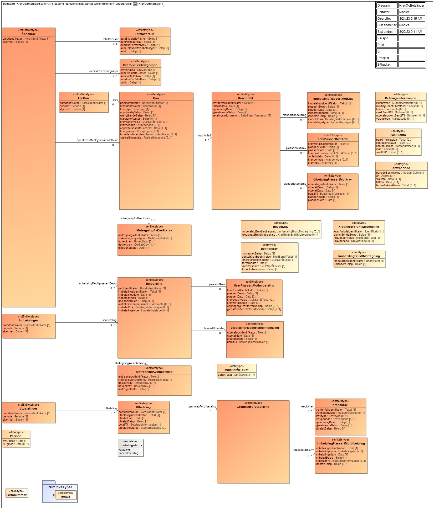

<Summary>Tjeneste som tilbyr oversikt av krav, innbetalinger og utbetalinger tilhørende en part.</Summary>

<Tabs underline={true}>
<TabItem headerText="Om tjenesten" itemKey="itemKey-1" default>

For generell informasjon om tjenestene se egne sider om:

* [Sikkerhetsmekansimer](../om/sikkerhet.md)
* [Systembruker](../om/systembruker.md)
* [Feilhåndtering](../om/feil.md)
* [Versjonering](../om/versjoner.md)
* [Teknisk spesifikasjon](../om/tekniskspesifikasjon.md)

## Scope

Følgende scope skal benyttes ved autentisering i Maskinporten: `skatteetaten:trekkpålegg`

## Delegering

Tilgang til dette API-et kan delegeres i Altinn, f.eks. dersom leverandør benyttes for den tekniske oppkoblingen. Søk
opp følgende tjeneste i Altinn for å delegere tilgangen: `Trekkpålegg API - På vegne av`

## Teknisk spesifikasjon

URL-er til API-et, beskrivelsen av parameterne, endepunkter og respons ligger
i [Open API spesifikasjonen](https://app.swaggerhub.com/apis/skatteetaten/trekkpaalegg-app) på SwaggerHub.

## Datakatalog

Dette API-et finnes foreløpig ikke i Felles datakatalog.

</TabItem>
<TabItem headerText="Eksempler" itemKey="itemKey-2"> 

## Åpne krav

### Eksempel på request URL

```
https://{env}/api/innkreving/kravogbetalinger/v1/finans/212201782/aapnekrav
```

### Eksempel på respons

```json
{
  "partIdentifikator": "212201782",
  "skjermet": false,
  "aapentKravMedGjenstaaendeBeloep": [
    {
      "partIdentifikator": "212201782",
      "kravidentifikator": "krav-1234",
      "kravtype": "RESTSKATT",
      "opprinneligBeloep": 10000.0,
      "gjenstaaendeBeloep": 10000.0,
      "kravforfall": [
        {
          "kravforfallsIdentifikator": "93d29b06-6cbd-4999-bd23-b0a13c47da51",
          "forfallsdato": "2023-02-21",
          "opprinneligBeloep": 10000.0,
          "gjenstaaendeBeloep": 10000.0,
          "betalingsinformasjon": {
            "konto": {
              "bankinformasjon": "Nordea Bank Norge ASA, Postboks 1166 Sentrum, 0107 Oslo, Norge",
              "kontonummer": "63450624804",
              "iban": "NO42 6345 06 24804",
              "swiftBIC": "NDEANOKK"
            }
          },
          "plassertInnbetaling": [
            {
              "innbetalingsIdentifikator": "inn-12345",
              "plassertBeloep": -1000.0,
              "plassertDato": "2023-02-05",
              "innbetalingsdato": "2023-01-30",
              "innbetaltBeloep": 0.0,
              "innbetaltFra": {
                "konto": {}
              },
              "innbetalingstype": "Bankoverføring"
            }
          ],
          "plassertMotkrav": [
            {
              "kravforfallsIdentifikator": "93d29b06-6cbd-4999-bd23-b0a13c47da51",
              "plassertBeloep": -1000.0,
              "kravtype": "RESTSKATT",
              "plassertDato": "2023-02-05",
              "kravbeskrivelse": {
                "spraakTekst": [
                  {
                    "tekst": "Restskatt",
                    "spraak": "nb"
                  }
                ]
              },
              "forfallsdato": "2023-01-30",
              "kravperiode": {
                "periodeBeskrivelse": {
                  "spraakTekst": [
                    {
                      "tekst": "2023/02",
                      "spraak": "nb"
                    }
                  ]
                }
              }
            }
          ]
        }
      ],
      "stipulerteRenter": 200.0,
      "kravbeskrivelse": {
        "spraakTekst": [
          {
            "tekst": "Restskatt",
            "spraak": "nb"
          }
        ]
      },
      "kravperiode": {
        "periodeBeskrivelse": {
          "spraakTekst": [
            {
              "tekst": "2023/02",
              "spraak": "nb"
            }
          ]
        }
      },
      "opprettelsesdatoForKrav": "2023-01-30",
      "kravgruppe": "Skatt",
      "fastsettingsmaate": "blank"
    },
    {
      "partIdentifikator": "04827896468",
      "kravidentifikator": "krav-1234",
      "kravtype": "RESTSKATT",
      "opprinneligBeloep": 10000.0,
      "gjenstaaendeBeloep": 10000.0,
      "kravforfall": [
        {
          "kravforfallsIdentifikator": "93d29b06-6cbd-4999-bd23-b0a13c47da51",
          "forfallsdato": "2023-02-21",
          "opprinneligBeloep": 10000.0,
          "gjenstaaendeBeloep": 10000.0,
          "betalingsinformasjon": {
            "konto": {
              "bankinformasjon": "Nordea Bank Norge ASA, Postboks 1166 Sentrum, 0107 Oslo, Norge",
              "kontonummer": "63450624804",
              "iban": "NO42 6345 06 24804",
              "swiftBIC": "NDEANOKK"
            }
          },
          "plassertInnbetaling": [
            {
              "innbetalingsIdentifikator": "inn-12345",
              "plassertBeloep": -1000.0,
              "plassertDato": "2023-02-05",
              "innbetalingsdato": "2023-01-30",
              "innbetaltBeloep": 0.0,
              "innbetaltFra": {
                "konto": {}
              },
              "innbetalingstype": "Bankoverføring"
            }
          ],
          "plassertMotkrav": [
            {
              "kravforfallsIdentifikator": "93d29b06-6cbd-4999-bd23-b0a13c47da51",
              "plassertBeloep": -1000.0,
              "kravtype": "RESTSKATT",
              "plassertDato": "2023-02-05",
              "kravbeskrivelse": {
                "spraakTekst": [
                  {
                    "tekst": "Restskatt",
                    "spraak": "nb"
                  }
                ]
              },
              "forfallsdato": "2023-01-30",
              "kravperiode": {
                "periodeBeskrivelse": {
                  "spraakTekst": [
                    {
                      "tekst": "2023/02",
                      "spraak": "nb"
                    }
                  ]
                }
              }
            }
          ]
        }
      ],
      "stipulerteRenter": 200.0,
      "kravbeskrivelse": {
        "spraakTekst": [
          {
            "tekst": "Restskatt",
            "spraak": "nb"
          }
        ]
      },
      "kravperiode": {
        "periodeBeskrivelse": {
          "spraakTekst": [
            {
              "tekst": "2023/02",
              "spraak": "nb"
            }
          ]
        }
      },
      "opprettelsesdatoForKrav": "2023-01-30",
      "kravgruppe": "Skatt",
      "fastsettingsmaate": "blank"
    }
  ],
  "innbetalingMedUplassertBeloep": [
    {
      "partIdentifikator": "212201782",
      "innbetalingsidentifikator": "inn-1234",
      "innbetalingsdato": "2023-03-01",
      "innbetaltBeloep": 1000.0,
      "uplassertBeloep": 0.0,
      "mottakersKontonummer": {
        "kontonummer": "98766543210"
      },
      "innbetaltFra": {
        "konto": {
          "kontoeiersNavn": "LYSTIG KLAM KATT TUSJ",
          "kontonummer": "******43210"
        }
      },
      "innbetalingstype": "bankoverføring"
    },
    {
      "partIdentifikator": "04827896468",
      "innbetalingsidentifikator": "inn-1234",
      "innbetalingsdato": "2023-03-01",
      "innbetaltBeloep": 1000.0,
      "uplassertBeloep": 0.0,
      "mottakersKontonummer": {
        "kontonummer": "98766543210"
      },
      "innbetaltFra": {
        "konto": {
          "kontoeiersNavn": "LYSTIG KLAM KATT TUSJ",
          "kontonummer": "******43210"
        }
      },
      "innbetalingstype": "bankoverføring"
    }
  ]
}
```

## Krav

### Eksempel på request URL

```
https://{env}/api/innkreving/kravogbetalinger/v1/finans/212201782/krav?fraOgMed=2023-01-01&tilOgMed=2023-09-01
```

### Eksempel på respons

```json
{
  "partIdentifikator": "212201782",
  "periode": {
    "fraOgMed": "2023-01-01",
    "tilOgMed": "2023-09-01"
  },
  "skjermet": false,
  "krav": [
    {
      "partIdentifikator": "212201782",
      "kravidentifikator": "krav-1234",
      "kravtype": "RESTSKATT",
      "opprinneligBeloep": 10000.0,
      "gjenstaaendeBeloep": 10000.0,
      "kravforfall": [
        {
          "kravforfallsIdentifikator": "93d29b06-6cbd-4999-bd23-b0a13c47da51",
          "forfallsdato": "2023-02-21",
          "opprinneligBeloep": 10000.0,
          "gjenstaaendeBeloep": 10000.0,
          "betalingsinformasjon": {
            "konto": {
              "bankinformasjon": "Nordea Bank Norge ASA, Postboks 1166 Sentrum, 0107 Oslo, Norge",
              "kontonummer": "63450624804",
              "iban": "NO42 6345 06 24804",
              "swiftBIC": "NDEANOKK"
            }
          },
          "plassertInnbetaling": [
            {
              "innbetalingsIdentifikator": "inn-12345",
              "plassertBeloep": -1000.0,
              "plassertDato": "2023-02-05",
              "innbetalingsdato": "2023-01-30",
              "innbetaltBeloep": 0.0,
              "innbetaltFra": {
                "konto": {}
              },
              "innbetalingstype": "Bankoverføring"
            }
          ],
          "plassertMotkrav": [
            {
              "kravforfallsIdentifikator": "93d29b06-6cbd-4999-bd23-b0a13c47da51",
              "plassertBeloep": -1000.0,
              "kravtype": "RESTSKATT",
              "plassertDato": "2023-02-05",
              "kravbeskrivelse": {
                "spraakTekst": [
                  {
                    "tekst": "Restskatt",
                    "spraak": "nb"
                  }
                ]
              },
              "forfallsdato": "2023-01-30",
              "kravperiode": {
                "periodeBeskrivelse": {
                  "spraakTekst": [
                    {
                      "tekst": "2023/02",
                      "spraak": "nb"
                    }
                  ]
                }
              }
            }
          ]
        }
      ],
      "stipulerteRenter": 200.0,
      "kravbeskrivelse": {
        "spraakTekst": [
          {
            "tekst": "Restskatt",
            "spraak": "nb"
          }
        ]
      },
      "kravperiode": {
        "periodeBeskrivelse": {
          "spraakTekst": [
            {
              "tekst": "2023/02",
              "spraak": "nb"
            }
          ]
        }
      },
      "opprettelsesdatoForKrav": "2023-01-30",
      "kravgruppe": "Skatt",
      "fastsettingsmaate": "blank"
    },
    {
      "partIdentifikator": "04827896468",
      "kravidentifikator": "krav-1234",
      "kravtype": "RESTSKATT",
      "opprinneligBeloep": 10000.0,
      "gjenstaaendeBeloep": 10000.0,
      "kravforfall": [
        {
          "kravforfallsIdentifikator": "93d29b06-6cbd-4999-bd23-b0a13c47da51",
          "forfallsdato": "2023-02-21",
          "opprinneligBeloep": 10000.0,
          "gjenstaaendeBeloep": 10000.0,
          "betalingsinformasjon": {
            "konto": {
              "bankinformasjon": "Nordea Bank Norge ASA, Postboks 1166 Sentrum, 0107 Oslo, Norge",
              "kontonummer": "63450624804",
              "iban": "NO42 6345 06 24804",
              "swiftBIC": "NDEANOKK"
            }
          },
          "plassertInnbetaling": [
            {
              "innbetalingsIdentifikator": "inn-12345",
              "plassertBeloep": -1000.0,
              "plassertDato": "2023-02-05",
              "innbetalingsdato": "2023-01-30",
              "innbetaltBeloep": 0.0,
              "innbetaltFra": {
                "konto": {}
              },
              "innbetalingstype": "Bankoverføring"
            }
          ],
          "plassertMotkrav": [
            {
              "kravforfallsIdentifikator": "93d29b06-6cbd-4999-bd23-b0a13c47da51",
              "plassertBeloep": -1000.0,
              "kravtype": "RESTSKATT",
              "plassertDato": "2023-02-05",
              "kravbeskrivelse": {
                "spraakTekst": [
                  {
                    "tekst": "Restskatt",
                    "spraak": "nb"
                  }
                ]
              },
              "forfallsdato": "2023-01-30",
              "kravperiode": {
                "periodeBeskrivelse": {
                  "spraakTekst": [
                    {
                      "tekst": "2023/02",
                      "spraak": "nb"
                    }
                  ]
                }
              }
            }
          ]
        }
      ],
      "stipulerteRenter": 200.0,
      "kravbeskrivelse": {
        "spraakTekst": [
          {
            "tekst": "Restskatt",
            "spraak": "nb"
          }
        ]
      },
      "kravperiode": {
        "periodeBeskrivelse": {
          "spraakTekst": [
            {
              "tekst": "2023/02",
              "spraak": "nb"
            }
          ]
        }
      },
      "opprettelsesdatoForKrav": "2023-01-30",
      "kravgruppe": "Skatt",
      "fastsettingsmaate": "blank"
    }
  ]
}
```

</TabItem>
<TabItem headerText="Feilkoder" itemKey="itemKey-3">

Se egen side for generell info om [feilhåndtering i tjenestene](../om/feil.md).

Tabellen under viser en oversikt over hvilke spesifikke feilkoder denne applikasjonen kan gi. Feilmeldingen vil kunne variere selv om samme feilkode returneres. Dette er for å kunne gi en så presis beskrivelse av feilen som mulig.

| Feilkode | HTTP Statuskode | Feilområde                                                     |
|----------|-----------------|----------------------------------------------------------------|
| KB-001   | 500             | Uventet feil på tjenesten.                                     |
| KB-002   | 500             | Uventet feil i et bakenforliggende system.                     |
| KB-003   | 404             | Ukjent url benyttet.                                           |
| KB-004   | 401             | Feil i forbindelse med autentisering.                          |
| KB-005   | 403             | Feil i forbindelse med samtykketoken.                          |
| KB-006   | 400             | Feil i forbindelse med validering av inputdata.                |
| KB-007   | 404             | Fant ingen krav/betalinger på angitt identifikator og periode. |
| KB-008   | 406             | Feil tilknyttet dataformat. Kun json eller xml er støttet.     |
| KB-009   | 404             | Ingen treff på oppgitt identifikator.                          |

</TabItem>
<TabItem headerText="Informasjonsmodell" itemKey="itemKey-4">

Her ser du hele informasjonsmodellen for Krav og betalinger API med alle 4 endepunktene.

[](../../static/download/Informasjonsmodell_Kravogbetalinger.png)

</TabItem>
<TabItem headerText="Test" itemKey="itemKey-5">

I første omgang er det test kun tilgjengelig for et utvalg leverandører som det er inngått avtale med og som skal være
med å pilotere løsningene.

## Tenor testdatasøk

Det finnes pt. ikke søk i [Tenor](../test/tenor.md) for denne tjenesten, og testdata er derfor listet her.
Men egenskaper ved enhetene som har testdata kan søkes frem i Tenor.

## Testdata

Følgende enkeltmannsforetak (ENK) er tilgjengelige for denne tjenesten i Skatteetatens testmiljø for eksterne.
Vær oppmerksom på at det er et levende testdatasett som kan endre seg i løpet av testperioden. Ta kontakt dersom du har
behov for ytterligere testdata.

Obs. regnskapssystemer som tester vil i Test kunne gjøre oppslag på alle testvirksomheter, selv om de i pilotperioden kun kan gjøre oppslag for egen virksomhet i Prod.

| Organisasjonsnummer | 
|---------------------|
| 313367002           |
| 311851381           |
| 314961900           |
| 314055403           |
| 212201782           |

</TabItem>
</Tabs>
