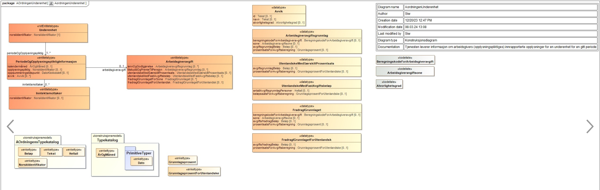
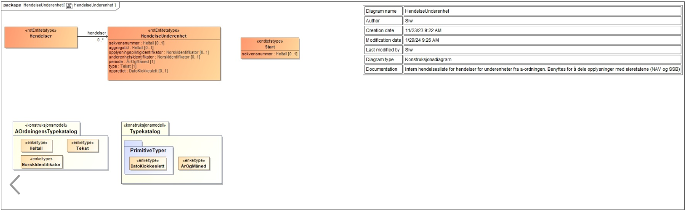

<summary>Tjenesten leverer informasjon om arbeidsgivers (opplysningspliktiges) innrapporterte inntektsopplysninger for en
inntektsmottaker for en gitt periode.</summary>

<Tabs underline={true}>
<TabItem headerText="Om tjenesten" itemKey="itemKey-1" default>

For generell informasjon om tjenestene se egne sider om:

* [Bruk av tjenestene](../om/bruk.md)
* [Sikkerhetsmekansimer](../om/sikkerhet.md)
* [Rettighetspakker](../om/rettighetspakker.md)
* [Feilhåndtering](../om/feil.md)
* [Versjonering](../om/versjoner.md)
* [Teknisk spesifikasjon](../om/tekniskspesifikasjon.md)

## Scope

Følgende scope skal benyttes ved autentisering i Maskinporten: `skatteetaten:underenhetaordningen`

## Delegering

Tilgang til dette API-et kan delegeres i Altinn, f.eks. dersom leverandør benyttes for den tekniske oppkoblingen. Søk
opp følgende tjeneste i Altinn for å delegere tilgangen: `Underenhet fra A-ordningen API - På vegne av`

## Teknisk spesifikasjon

URL-er til API-et, beskrivelsen av parameterne, endepunkter og respons ligger
i [Open API spesifikasjonen](https://app.swaggerhub.com/apis/skatteetaten/underenhet-fra-a-ordningen-hendelser-api)
på SwaggerHub.

## Rettighetspakker

| Navn på rettighetspakke |	
|-------------------------|
| nav                     |

## Støttetjenester

### Hendelser

For å følge med på endringer tilbyr vi
en [støttetjeneste for hendelsesliste](./hendelser.md): `Underenhet fra a-ordningen hendelser API`

## Datakatalog

Tjenesten er pt. ikke oppført i felles datakatalog.

</TabItem>
<TabItem headerText="Eksempler" itemKey="itemKey-2"> 

## JSON

```json
{
  "norskIdentifikator": "314928660",
  "periodeOgOpplysningspliktig": [
    {
      "kalendermaaned": "2023-11",
      "opplysningspliktig": "310138363",
      "arbeidsgiveravgift": {
        "loennOgGodtgjoerelse": [
          {
            "beregningskodeForArbeidsgiveravgift": "generelleNaeringer",
            "sone": "1",
            "avgiftsgrunnlagBeloep": 335082.0,
            "prosentsatsForAvgiftsberegning": 14.1
          }
        ]
      },
      "inntektsmottaker": [
        {
          "norskIdentifikator": "01852649662"
        },
        {
          "norskIdentifikator": "04861949937"
        },
        {
          "norskIdentifikator": "11891849879"
        },
        {
          "norskIdentifikator": "07891249807"
        },
        {
          "norskIdentifikator": "06878899138"
        },
        {
          "norskIdentifikator": "06820849572"
        },
        {
          "norskIdentifikator": "07820949018"
        },
        {
          "norskIdentifikator": "27892548531"
        },
        {
          "norskIdentifikator": "11882248684"
        },
        {
          "norskIdentifikator": "17921449070"
        },
        {
          "norskIdentifikator": "13900949949"
        },
        {
          "norskIdentifikator": "03871448433"
        }
      ],
      "oppsummeringstidspunkt": "2023-12-13T12:14:32.333"
    },
    {
      "kalendermaaned": "2023-12",
      "opplysningspliktig": "310138363",
      "arbeidsgiveravgift": {
        "loennOgGodtgjoerelse": [
          {
            "beregningskodeForArbeidsgiveravgift": "generelleNaeringer",
            "sone": "1",
            "avgiftsgrunnlagBeloep": 335082.0,
            "prosentsatsForAvgiftsberegning": 14.1
          }
        ]
      },
      "inntektsmottaker": [
        {
          "norskIdentifikator": "03871448433"
        },
        {
          "norskIdentifikator": "06878899138"
        },
        {
          "norskIdentifikator": "04861949937"
        },
        {
          "norskIdentifikator": "11891849879"
        },
        {
          "norskIdentifikator": "27892548531"
        },
        {
          "norskIdentifikator": "07820949018"
        },
        {
          "norskIdentifikator": "11882248684"
        },
        {
          "norskIdentifikator": "01852649662"
        },
        {
          "norskIdentifikator": "07891249807"
        },
        {
          "norskIdentifikator": "13900949949"
        },
        {
          "norskIdentifikator": "17921449070"
        },
        {
          "norskIdentifikator": "06820849572"
        }
      ],
      "oppsummeringstidspunkt": "2023-12-13T12:14:32.659"
    }
  ]
}
```

</TabItem>
<TabItem headerText="Feilkoder" itemKey="itemKey-3">

Se egen side for generell info om [feilhåndtering i tjenestene](../om/feil.md).

Tabellen under viser en oversikt over hvilke spesifikke feilkoder denne applikasjonen kan gi. Feilmeldingen vil kunne variere selv om samme feilkode returneres. Dette er for å kunne gi en så presis beskrivelse av feilen som mulig.

| Feilkode | HTTP Statuskode | Feilområde                                                                |
|----------|-----------------|---------------------------------------------------------------------------|
| UFA-001  | 500             | Uventet feil på tjenesten.                                                |
| UFA-002  | 500             | Uventet feil i et bakenforliggende system.                                |
| UFA-003  | 404             | Ukjent url benyttet.                                                      |
| UFA-004  | 401             | Feil i forbindelse med autentisering.                                     |
| UFA-005  | 403             | Feil i forbindelse med autorisering.                                      |
| UFA-006  | 400             | Feil i forbindelse med validering av inputdata.                           |
| UFA-007  | 404             | Fant ikke opplysninger om underenhet for angitt identifikator og periode. |
| UFA-008  | 406             | Feil tilknyttet dataformat. Kun json eller xml er støttet.                |
| UFA-009  | 410             | Opplysninger om underenhet er slettet for periode.                        |

</TabItem>
<TabItem headerText="Informasjonsmodell" itemKey="itemKey-4">

## Oppslagstjeneste

[](../../static/download/informasjonsmodell_underenhetaordningen.png)

## Hendelsesliste

[](../../static/download/informasjonsmodell_underenhetaordningen_hendelser.png)

</TabItem>
<TabItem headerText="Test" itemKey="itemKey-5">

## Tenor testdatasøk

Det finnes pt. ikke søk i [Tenor](../test/tenor.md) for denne tjenesten, men man kan benytt hendelseslisten for å finne
referanser man kan benytte for å teste oppslagstjenesten.

</TabItem>
</Tabs>
