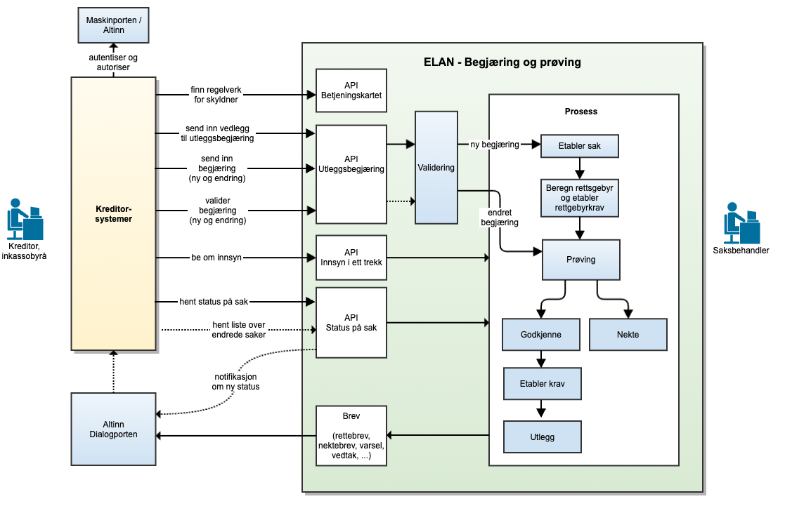

<Summary>ELAN (Utleggsbegjæring API) er en tjeneste for å sende utleggsbegjæringer til namsmannen gjennom Skatteetatens systemløsninger.</Summary>

<Tabs underline={true}>
<TabItem headerText="Om tjenesten" itemKey="itemKey-Om" default>
Målgruppen er dagens inkassosystemer, kommunene og andre systemleverandører.
Dersom du ønsker å ta i bruk ELAN og prøving i ditt system eller har spørsmål knyttet til dette, ta kontakt med fremtidensinnkreving@skatteetaten.no.

Figuren nedenfor angir overordnet tjenester Skatteetaten vil tilby for mottak og prøving av utleggsbegjæringer. Merk at figuren er en illustrasjon av måbildet, og det er ikke alle tjenestene i figuren som er implementert ennå. Det vil også i fremtiden kunne legges til nye tjenester som ikke er angitt i figuren.




For generell informasjon om tjenestene se egne sider om:

* [Sikkerhetsmekansimer](../om/sikkerhet.md)
* [Systembruker](../om/systembruker.md)
* [Feilhåndtering](../om/feil.md)
* [Versjonering](../om/versjoner.md)
* [Teknisk spesifikasjon](../om/tekniskspesifikasjon.md)

### Altinn Dialogporten
Leverandører er ikke påkrevet å å integrere med Dialogporten. Det vil være tilstrekkelig å kun benytte API-endepunktene. Gjennom Dialogporten vil vi imidlertid tilby en tjeneste for hendelsesvarsler (events) som angir når det er kommet nye meldinger fra Skatteeetaten, eksempelvis at det er bedt om retting av en tidligere innsendt utleggsbegjæring. Dersom man velger å ikke bruke varslingstjenesten, må man se etter nye meldinger ved jevnlig å gjøre spørringer mot etatens API (polling).

### Oppfølging og støtte
I testfasen vil vi tilby støtte til de eksterne leverandørene gjennom utvikling og test.

Mer informasjon kommer her.

I mellomtiden – ta kontakt med fremtidensinnkreving@skatteetaten.no.

## Scope

Følgende scope skal benyttes ved autentisering i Maskinporten: `skatteetaten:utleggsbegjaering`.

Ved bruk av systembruker må forespørselen også inneholde ressurs-id `ske-utleggsbegjaering` som beskrevet her for produksjon: https://docs.altinn.studio/api/authentication/systemuserapi/systemuserrequest/external/#create-a-standard-system-user-request

## Delegering

Tilgang til dette API-et kan delegeres i Altinn, f.eks. dersom leverandør benyttes for den tekniske oppkoblingen. Søk
opp følgende tjeneste i Altinn for å delegere tilgangen: `Utleggstrekkbegjæring API - På vegne av`

## Teknisk spesifikasjon

URL-er til API-et, beskrivelsen av parameterne, endepunkter og respons ligger
i [Open API spesifikasjonen](https://app.swaggerhub.com/apis/skatteetaten/utleggsbegjaering-app) på SwaggerHub.

## Datakatalog

Dette API-et finnes foreløpig ikke i Felles datakatalog.

## Tilgang til tjenesten
For å få tilgang til tjenesten må leverandøren ha underskrevet en pilotavtale med Skatteetaten.

Oppkobling mot testmiljøet i Skatteetaten skjer via Maskinporten. For å få utstedt token av Maskinporten må inkasso-systemet gjennom sitt virksomhetssertifikat angi hvilket organisasjonsnummer de representerer. Dette organisasjonsnummeret må være godkjent av Skatteetaten.

For å benytte tjenestene for innsending av begjæring skal følgende scope angis ved autentisering i Maskinporten: skatteetaten:utleggsbegjaering

API-et støtter to varianter av autentisering via Maskinporten. Disse er beskrevet under

### Alternativ 1 - Systemleverandør er innsender
Dersom systemleverandør kun skal sende inn utleggsbegjæringer på vegne av sin egen organisasjon, kan man benytte klassisk autentisering via Maskinporten. Mer informasjon om dette finnes her.

### Alternativ 2 - Systembruker
Dersom systemleverandør ønsker å tilby funksjonalitet der en annen organisasjon (kunde av systemleverandøren) skal benytte systemet til å sende inn utleggsbegjæringer, skal Altinn sin nye funksjonalitet for ‘systembruker’ benyttes. Mer informasjon om dette finnes i Altinn Systembruker for SBS og Systembruker roadmap.

Systemleverandør må for å støtte systembruker registrere seg i Maskinporten og Altinn test environment.

### Testoppsett
Bruk valgfrie organisasjoner fra Tenor som innsender av utleggsbegjæring.

### Test der systemleverandør er innsender (alternativ 1)
Når systemleverandør er innsender kan vilkårlige organisasjoner i Tenor benyttes som innsender.

### Test der systembruker benyttes (alternativ 2)
Den valgte organisasjonen i Tenor (som representerer en test-inkassovirksomhet) må godkjenne at dens fagsystem kan benytte tilgangsressursen/tjenesten «Innsending og oppfølging av utleggsbegjæring» på vegne av virksomheten. Det opprettes da en «systembruker» som er koblingen mellom bruker, system, leverandør og API.

</TabItem>
<TabItem headerText="Overgangsperioden" itemKey="itemKey-Overgangsperioden">

## Innføring av ny innkrevingslov
I en overgangsperiode (fra 1.1.2026 til 31.12.2026) skal namsmannen gradvis behandle nye utleggssaker mot saksøkte etter den nye innkrevingsloven og endringer i tvangsfullbyrdelsesloven. Myndighetene har derfor mulighet til å avgrense hvilke skyldnere som skal behandles etter nytt regelverk for utlegg ut fra forhåndsbestemte kriterier. Disse bestemmes konkret i forskrift.

Gjennom overgangsperioden legges det opp til en gradvis endring av parametrene slik at stadig flere skyldnere vil falle inn under kriterier for å bli behandlet etter nytt regelverk. Forskriften endres senest 14 dager før endringen trer i kraft. Parametrene er fastsatt i delegeringsvedtaket [Delegering av kongens myndighet etter innkrevingsloven § 40 andre og tredje ledd til Finansdepartementet](https://lovdata.no/dokument/DEL/forskrift/2025-06-10-968).

## Overgangsperiode for utleggsbegjæring

I overgangsperioden skal digitale utleggsbegjæringer for skyldnere som er omfattet av den nye innkrevingsloven sendes inn via ny løsning (ELAN), mens utleggsbegjæringer for skyldnere som ikke er omfattet av den nye innkrevingsloven skal sendes inn som før via eksisterende løsning (ELSA). Dersom en utleggsbegjæring angår flere skyldnere, må alle disse være på samme regelverk, hvis ikke må begjæringen sendes inn på papir.

## Betjeningskartet

For å avgjøre hvorvidt en skyldner er omfattet av nytt eller gammelt regelverk, kan innkassosystemet benytte en API-tjeneste kalt "Betjeningskartet". Her kan man slå opp gjeldende regelverk for en eller flere skyldnere på identifikator (fødselsnummer). Tjenesten skal kalles rett i forkant av innsending av en ny utleggsbegjæring gjennom API, slik at innsendingen gjøres til riktig system (ELSA eller ELAN). URL-er til betjeningskart API-et, beskrivelsen av parameterne, endepunkter og respons ligger i [Open API spesifikasjonen](https://app.swaggerhub.com/apis/skatteetaten/utleggsbegjaering-app) på SwaggerHub.


Dersom man sender en utleggsbegjæring til feil system, vil systemet returnere en feilmelding om dette og avvise innsendingen. For ELAN vil det gis en 422-feilkode med feilmeldingen "SAKSOEKT_GAMMELT_REGELVERK".

</TabItem>
<TabItem headerText="Eksempler" itemKey="itemKey-Eksempler"> 


## Enkelt eksempel på utleggsbegjæring

Eksempelet nedenfor bruker testparter fra Tenor. De syntetiske dataene i dokumentet byttes ut med deres egne syntetiske data. Dette inkluderer opplastede vedlegg, samt valgte aktører (innsender, saksøkte, saksøkere og prosessfullmektig) fra Tenor.

```json title="Enkelt eksempel på utleggsbegjæring"
{
  "saksoeker": [
    {
      "saksoeker": {
        "adresse": [
          {
            "adressetype": "bopelsadresse",
            "adresseInnland": {
              "adresseFrittFormatInnland": {
                "kommunenummer": "4601",
                "postnummer": "5231",
                "adressetekst": "Nattlandsåsen 2",
                "poststedsnavn": "Oslo"
              }
            }
          }
        ],
        "virksomhet": {
          "navn": "UPERSONLIG FRISK TIGER AS",
          "identifikator": {
            "identifikatortype": "taxIdentificationNumber",
            "verdi": "311758489",
            "landkode": "NO"
          },
          "virksomhetstype": "inkassovirksomhet"
        }
      },
      "saksoekerReferanse": "saksoekerReferanse",
      "saksoekerKontaktinformasjon": {
        "epostAdresse": "epost@yahoo.com",
        "telefonnummer": "99563564"
      },
      "prosessfullmektig": {
        "prosessfullmektig": {
          "adresse": [
            {
              "adressetype": "bopelsadresse",
              "adresseInnland": {
                "adresseFrittFormatInnland": {
                  "kommunenummer": "0301",
                  "postnummer": "1333",
                  "adressetekst": "Bergendal 66",
                  "poststedsnavn": "Bergen"
                }
              }
            }
          ],
          "virksomhet": {
            "navn": "UTROLIG ESTETISK TIGER AS",
            "identifikator": {
              "identifikatortype": "taxIdentificationNumber",
              "verdi": "312597772",
              "landkode": "NO"
            },
            "virksomhetstype": "inkassovirksomhet"
          }
        },
        "bevillingshaver": {
          "navn": {
            "fornavn": "Anna",
            "etternavn": "Norman",
            "mellomnavn": "Isaksen"
          },
          "inkassobevillingshaverNummer": "123212132"
        }
      }
    }
  ],
  "saksoekt": [
    {
      "saksoekt": {
        "adresse": [
          {
            "adressetype": "bopelsadresse",
            "adresseInnland": {
              "adresseFrittFormatInnland": {
                "kommunenummer": "0301",
                "postnummer": "0351",
                "adressetekst": "Josefines gate 3D"
              }
            }
          }
        ],
        "person": {
          "personnavn": {
            "fornavn": "HENSIKT",
            "etternavn": "LYSEGUL"
          },
          "foedselsdato": "2006-09-16",
          "identifikator": {
            "identifikatortype": "taxIdentificationNumber",
            "verdi": "44926701751",
            "landkode": "NO"
          }
        }
      },
      "prosessfullmektig": {
        "prosessfullmektig": {
          "adresse": [
            {
              "adressetype": "bopelsadresse",
              "adresseInnland": {
                "adresseFrittFormatInnland": {
                  "kommunenummer": "0301",
                  "postnummer": "1333",
                  "adressetekst": "Hardalsv. 12",
                  "poststedsnavn": "Bergen"
                }
              }
            }
          ],
          "virksomhet": {
            "navn": "OPPBLÅST UNDERDANIG TIGER AS",
            "identifikator": {
              "identifikatortype": "taxIdentificationNumber",
              "verdi": "312759667",
              "landkode": "NO"
            },
            "virksomhetstype": "inkassovirksomhet"
          }
        },
        "bevillingshaver": {
          "navn": {
            "fornavn": "Per",
            "etternavn": "Sand"
          },
          "inkassobevillingshaverNummer": "2345678951"
        }
      },
      "saksoektReferanse": "saksoektReferanse"
    }
  ],
  "underskrift": "Anna Norman",
  "tvangsfullbyrdelsestype": "utlegg",
  "begjaeringsdato": "2024-02-02",
  "begjaeringensTvangsgrunnlag": [
    {
      "innsendersKravreferanse": [
        "00890772001",
        "RentekravPåHovedkrav_00890772001_1",
        "UtenrettsligKostnaderAvHovedkrav_00890772001"
      ],
      "eksternSaksreferanse": "Saksnr: 106109935",
      "tvangsgrunnlagsdato": "2024-07-02",
      "tvangsgrunnlag": {
        "type": "tvangsgrunnlag",
        "filnavn": "tvangsgrunnlag",
        "uuid": "67a9a31d-312a-43e1-8261-e19afe8964b1"
      },
      "betegnelseAvTvangsgrunnlag": "Kredittkort",
      "varsel": [
        {
          "dato": "2022-04-21",
          "type": "varselTvfbl418",
          "tvangskraftgrunnlag": {
            "type": "tvangskraftgrunnlag",
            "filnavn": "tvangskraftgrunnlag",
            "uuid": "67a9a31d-312a-43e1-8261-e19afe8964b1"
          }
        }
      ],
      "begrunnelseUnnlatVarsel": "ukjentOppholdsstedSakssøkt",
      "saerligTvangsgrunnlag": {
        "paalydendeBeloep": 14101.38,
        "skyldner": [
          {
            "identifikatortype": "taxIdentificationNumber",
            "verdi": "44926701751",
            "landkode": "NO"
          }
        ],
        "referanseSak": "saksreferanse",
        "kreditor": [
          {
            "identifikatortype": "taxIdentificationNumber",
            "verdi": "311758489",
            "landkode": "NO"
          }
        ],
        "skriftligMeddelelse": {
          "kravetsGrunnlag": "Kredittkort",
          "krevesFravaersdom": true,
          "forsendelsesmaate": {
            "forsendelsesmaate": "altinn",
            "AlternativElektroniskKanalForMeddelelse": {
              "kanalForMeddelelse": "kanalForMeddelelse",
              "akseptKanalvalg": {
                "type": "annet",
                "filnavn": "akseptKanalvalg",
                "uuid": "67a9a31d-312a-43e1-8261-e19afe8964b1"
              }
            }
          },
          "faktiskeForholdForKravet": "Gjelder ubetalt kredittkort",
          "paastand": "Klagemotparten dømmes til å betale bla bla bla.",
          "kanBehandlesIForliksraadet": true,
          "avsender": {
            "identifikatortype": "taxIdentificationNumber",
            "verdi": "312597772",
            "landkode": "NO"
          },
          "mottakeradresse": {
            "adressetekst": [
              "Torshovsvei 56"
            ],
            "poststedsnavn": "Oslo",
            "postnummer": "0351"
          }
        }
      }
    }
  ],
  "kreverRettsgebyrErstattet": true,
  "kravTilInnkreving": [
    {
      "kravforfall": {
        "forfallsdato": "2024-06-15"
      },
      "tilleggsfristForeldelse": [
        {
          "grunnlag": "uvitenhet",
          "begrunnelse": "Søkt i Folkregisteret/1881. Ikke funnet ny adresse. Se vedlagte skjermdump",
          "dato": "2022-04-21"
        },
        {
          "grunnlag": "lovmessigeHindringer",
          "begrunnelse": "lovmessige hindringer",
          "dato": "2022-04-21"
        }
      ],
      "sisteFristavbrytendeTiltak": "siste fristavbrytende tiltak",
      "kravreferanse": "00890772001",
      "opprinneligBeloep": {
        "beloep": 12469.14,
        "valuta": "NOK"
      },
      "gjenstaaendeBeloep": {
        "beloep": 11000.14,
        "valuta": "NOK"
      },
      "innbetaling": [
        {
          "bokfoertDato": "2024-06-03",
          "beloep": {
            "beloep": 469,
            "valuta": "NOK"
          }
        },
        {
          "bokfoertDato": "2024-06-10",
          "beloep": {
            "beloep": 1000,
            "valuta": "NOK"
          }
        }
      ],
      "prioritetDekningsloven": "b",
      "prioritetISak": "1",
      "kravdetaljer": "Hovedkrav",
      "kravbeskrivelse": "kravbeskrivelse",
      "betalingsoppfordring": [
        {
          "betalingsfrist": "2024-07-16",
          "betalingsoppfordring": {
            "type": "betalingsoppfordring",
            "filnavn": "betalingsoppfordring.pdf",
            "uuid": "67a9a31d-312a-43e1-8261-e19afe8964b1"
          },
          "brevdato": "2024-07-02"
        }
      ],
      "renteOpplysning": {
        "forsinkelsesrente": true
      }
    },
    {
      "kravforfall": {
        "forfallsdato": "2024-06-15"
      },
      "kravreferanse": "RentekravPåHovedkrav_00890772001_1",
      "opprinneligBeloep": {
        "beloep": 232.24,
        "valuta": "NOK"
      },
      "gjenstaaendeBeloep": {
        "beloep": 132.24,
        "valuta": "NOK"
      },
      "prioritetDekningsloven": "b",
      "prioritetISak": "1",
      "kravdetaljer": "Rentekrav",
      "kravbeskrivelse": "Renter på hovedkrav",
      "betalingsoppfordring": [
        {
          "betalingsfrist": "2024-07-16",
          "betalingsoppfordring": {
            "type": "betalingsoppfordring",
            "filnavn": "betalingsoppfordring.pdf",
            "uuid": "67a9a31d-312a-43e1-8261-e19afe8964b1"
          },
          "brevdato": "2024-07-02"
        }
      ],
      "innbetaling": [
        {
          "bokfoertDato": "2024-06-03",
          "beloep": {
            "beloep": 50,
            "valuta": "NOK"
          }
        },
        {
          "bokfoertDato": "2024-06-10",
          "beloep": {
            "beloep": 50,
            "valuta": "NOK"
          }
        }
      ],
      "relatertKrav": [
        "00890772001"
      ],
      "erRentekrav": {
        "rentePeriode": {
          "startdato": "2024-06-02",
          "sluttdato": "2024-07-02"
        }
      }
    },
    {
      "kravforfall": {
        "forfallsdato": "2024-06-15"
      },
      "kravreferanse": "UtenrettsligKostnaderAvHovedkrav_00890772001",
      "opprinneligBeloep": {
        "beloep": 1400,
        "valuta": "NOK"
      },
      "gjenstaaendeBeloep": {
        "beloep": 1400,
        "valuta": "NOK"
      },
      "prioritetDekningsloven": "b",
      "prioritetISak": "3",
      "kravdetaljer": "UtenrettsligeKostnader",
      "kravbeskrivelse": "UtenrettsligeKostnader på hovedkrav",
      "betalingsoppfordring": [
        {
          "betalingsfrist": "2024-07-16",
          "betalingsoppfordring": {
            "type": "betalingsoppfordring",
            "filnavn": "betalingsoppfordring.pdf",
            "uuid": "67a9a31d-312a-43e1-8261-e19afe8964b1"
          },
          "brevdato": "2024-07-02"
        }
      ],
      "relatertKrav": [
        "00890772001"
      ]
    }
  ],
  "betalingsinformasjon": {
    "norskKonto": {
      "bankkode": "NordeaBankKode",
      "bankNavn": "Nordea Bank",
      "landkodeBank": "NO",
      "kontovaluta": "NOK",
      "iban": "NO5969930570044",
      "bic": "NDEANOKK",
      "kontonummer": "69930570044",
      "kidnummer": "2509937609"
    }
  },
  "vedlegg": [
    {
      "type": "tvangsgrunnlag",
      "filnavn": "tvangsgrunnlag",
      "uuid": "67a9a31d-312a-43e1-8261-e19afe8964b1"
    },
    {
      "type": "tvangskraftgrunnlag",
      "filnavn": "tvangskraftgrunnlag",
      "uuid": "67a9a31d-312a-43e1-8261-e19afe8964b1"
    }
  ],
  "saksreferanse": "saksref. 123456",
  "innsenderReferanse": "InnsenderRef124",
  "valgtNamsmannsdistrikt": {
    "namsmannsdistrikt": "Namsfogden i Oslo, Asker og Bærum",
    "begrunnelse": "begrunnelse"
  },
  "innsender": {
    "innsender": {
      "adresse": [
        {
          "adressetype": "bopelsadresse",
          "adresseInnland": {
            "adresseFrittFormatInnland": {
              "kommunenummer": "0301",
              "postnummer": "1333",
              "adressetekst": "Hallagerstrand 54",
              "poststedsnavn": "Bergen"
            }
          }
        }
      ],
      "virksomhet": {
        "navn": "Inkassobyrå AS",
        "identifikator": {
          "identifikatortype": "taxIdentificationNumber",
          "verdi": "312597772",
          "landkode": "NO"
        },
        "virksomhetstype": "inkassovirksomhet"
      }
    },
    "prosessfullmektig": {
      "prosessfullmektig": {
        "adresse": [
          {
            "adressetype": "bopelsadresse",
            "adresseInnland": {
              "adresseFrittFormatInnland": {
                "kommunenummer": "0301",
                "postnummer": "1333",
                "adressetekst": "Ryensvei 55",
                "poststedsnavn": "Bergen"
              }
            }
          }
        ],
        "virksomhet": {
          "navn": "Inkassobyrå AS",
          "identifikator": {
            "identifikatortype": "taxIdentificationNumber",
            "verdi": "312597772",
            "landkode": "NO"
          },
          "virksomhetstype": "inkassovirksomhet"
        }
      },
      "bevillingshaver": {
        "navn": {
          "fornavn": "Anna",
          "etternavn": "Norman"
        },
        "inkassobevillingshaverNummer": "123212132"
      }
    },
    "saksbehandler": "Ola Erikksen",
    "saksbehandlersKontaktinformasjon": {
      "epostAdresse": "saksbehandler@epost.com",
      "telefonnummer": "96673775"
    }
  },
  "berOmInnkallingTilMoeteMedBegrunnelse": "Ja",
  "berOmUnnlattForeleggelseMedBegrunnelse": "Nei",
  "spesiellUtleggsgjenstand": [
    "utleggspant",
    "utleggstrekk"
  ]
}
```

## Mer komplekst eksempel på utleggsbegjæring

Eksempelet nedenfor er noe mer komplisert, med flere tvangsgrunnlag.

```json title="Mer komplekst eksempel på utleggsbegjæring"
{
  "saksoeker": [
    {
      "saksoeker": {
        "adresse": [
          {
            "adressetype": "bopelsadresse",
            "adresseInnland": {
              "adresseFrittFormatInnland": {
                "kommunenummer": "4601",
                "postnummer": "5106",
                "adressetekst": "Våganeset 40C"
              }
            }
          }
        ],
        "virksomhet": {
          "navn": "SMUL FLAT TIGER AS",
          "identifikator": {
            "identifikatortype": "taxIdentificationNumber",
            "verdi": "313182495",
            "landkode": "NO"
          },
          "virksomhetstype": "inkassovirksomhet"
        }
      },
      "saksoekerReferanse": "saksoekerReferanse"
    }
  ],
  "saksoekt": [
    {
      "saksoekt": {
        "adresse": [
          {
            "adressetype": "bopelsadresse",
            "adresseInnland": {
              "adresseFrittFormatInnland": {
                "kommunenummer": "4008",
                "postnummer": "1103",
                "adressetekst": "Kannikgata 32"
              }
            }
          }
        ],
        "person": {
          "personnavn": {
            "fornavn": "Rimelig",
            "etternavn": "Merr"
          },
          "foedselsdato": "1978-08-29",
          "identifikator": {
            "identifikatortype": "taxIdentificationNumber",
            "verdi": "69887800189",
            "landkode": "NO"
          }
        }
      }
    }
  ],
  "underskrift": "bevilgningsNavn_ikke finnes i PDF",
  "tvangsfullbyrdelsestype": "utlegg",
  "begjaeringsdato": "2025-01-12",
  "begjaeringensTvangsgrunnlag": [
    {
      "innsendersKravreferanse": [
        "101461397",
        "RentekravPåHovedkrav_101461397_1",
        "RentekravPåHovedkrav_101461397_2",
        "UtenrettsligKostnaderPåHovedkrav_101461397",
        "RentekravPåUtenrettsligeKostnader"
      ],
      "eksternSaksreferanse": "Saksnr: 150023021",
      "tvangsgrunnlagsdato": "2022-04-21",
      "tvangsgrunnlag": {
        "type": "tvangsgrunnlag",
        "filnavn": "tvangsgrunnlag",
        "uuid": "61e17f8d-9f24-4bd0-ad8b-d7908a1acc18"
      },
      "betegnelseAvTvangsgrunnlag": "Vegfinans E134 Buskerud AS",
      "varsel": [
        {
          "dato": "2022-04-21",
          "type": "varselTvfbl418",
          "tvangskraftgrunnlag": {
            "type": "tvangskraftgrunnlag",
            "filnavn": "tvangskraftgrunnlag",
            "uuid": "61e17f8d-9f24-4bd0-ad8b-d7908a1acc18"
          }
        }
      ],
      "begrunnelseUnnlatVarsel": "ukjentOppholdsstedSakssøkt",
      "saerligTvangsgrunnlag": {
        "paalydendeBeloep": 535.79,
        "skyldner": [
          {
            "identifikatortype": "taxIdentificationNumber",
            "verdi": "69887800189",
            "landkode": "NO"
          }
        ],
        "referanseSak": "IKKE I BRUK FØR 2030",
        "kreditor": [
          {
            "identifikatortype": "taxIdentificationNumber",
            "verdi": "313182495",
            "landkode": "NO"
          }
        ],
        "skriftligMeddelelse": {
          "kravetsGrunnlag": "Vegfinans E134 Buskerud AS",
          "krevesFravaersdom": true,
          "forsendelsesmaate": {
            "forsendelsesmaate": "altinn",
            "alternativElektroniskKanalForMeddelelse": {
              "kanalForMeddelelse": "kanalForMeddelelse",
              "akseptKanalvalg": {
                "type": "annet",
                "filnavn": "akseptKanalvalg",
                "uuid": "cbdf604f-03df-4327-8188-d8fcfe72d533"
              }
            }
          },
          "faktiskeForholdForKravet": "Vegfinans E134 Buskerud AS",
          "paastand": "ikke pdf",
          "kanBehandlesIForliksraadet": false
        }
      }
    },
    {
      "innsendersKravreferanse": [
        "102486836_1",
        "102486836_2",
        "RentekravPåHovedkrav_102486836_1",
        "RentekravPåHovedkrav_102486836_2",
        "RentekravPåHovedkrav_102486836_3",
        "UtenrettsligKostnaderPå_102486836",
        "RentekravPåUtenrettsligeKostnader_1"
      ],
      "eksternSaksreferanse": "Saksnr: 20889222",
      "tvangsgrunnlagsdato": "2022-08-18",
      "tvangsgrunnlag": {
        "type": "tvangsgrunnlag",
        "filnavn": "tvangsgrunnlag",
        "uuid": "61e17f8d-9f24-4bd0-ad8b-d7908a1acc18"
      },
      "betegnelseAvTvangsgrunnlag": "Vegfinans Hallingporten AS",
      "varsel": [
        {
          "dato": "2022-08-18",
          "type": "varselTvfbl418",
          "tvangskraftgrunnlag": {
            "type": "tvangskraftgrunnlag",
            "filnavn": "tvangskraftgrunnlag",
            "uuid": "61e17f8d-9f24-4bd0-ad8b-d7908a1acc18"
          }
        }
      ],
      "begrunnelseUnnlatVarsel": "ukjentOppholdsstedSakssøkt",
      "saerligTvangsgrunnlag": {
        "paalydendeBeloep": 578.65,
        "skyldner": [
          {
            "identifikatortype": "taxIdentificationNumber",
            "verdi": "69887800189",
            "landkode": "NO"
          }
        ],
        "referanseSak": "IKKE I BRUK FØR 2030",
        "kreditor": [
          {
            "identifikatortype": "taxIdentificationNumber",
            "verdi": "313182495",
            "landkode": "NO"
          }
        ],
        "skriftligMeddelelse": {
          "kravetsGrunnlag": "Vegfinans E134 Buskerud AS",
          "krevesFravaersdom": true,
          "forsendelsesmaate": {
            "forsendelsesmaate": "altinn",
            "AlternativElektroniskKanalForMeddelelse": {
              "kanalForMeddelelse": "kanalForMeddelelse",
              "akseptKanalvalg": {
                "type": "annet",
                "filnavn": "akseptKanalvalg",
                "uuid": "cbdf604f-03df-4327-8188-d8fcfe72d533"
              }
            }
          },
          "faktiskeForholdForKravet": "Vegfinans E134 Buskerud AS",
          "paastand": "ikke pdf",
          "kanBehandlesIForliksraadet": false
        }
      }
    }
  ],
  "kreverRettsgebyrErstattet": true,
  "kravTilInnkreving": [
    {
      "kravforfall": {
        "forfallsdato": "2021-07-08"
      },
      "kravreferanse": "101461397",
      "opprinneligBeloep": {
        "beloep": 76,
        "valuta": "NOK"
      },
      "gjenstaaendeBeloep": {
        "beloep": 76,
        "valuta": "NOK"
      },
      "prioritetDekningsloven": "e",
      "kravdetaljer": "Hovedkrav",
      "kravbeskrivelse": "kravbeskrivelse",
      "betalingsoppfordring": [
        {
          "betalingsfrist": "2022-05-05",
          "betalingsoppfordring": {
            "type": "betalingsoppfordring",
            "filnavn": "betalingsoppfordring.pdf",
            "uuid": "61e17f8d-9f24-4bd0-ad8b-d7908a1acc18"
          },
          "brevdato": "2022-04-21"
        }
      ],
      "renteOpplysning": {
        "forsinkelsesrente": true
      }
    },
    {
      "kravforfall": {
        "forfallsdato": "2021-07-08"
      },
      "kravreferanse": "RentekravPåHovedkrav_101461397_1",
      "opprinneligBeloep": {
        "beloep": 2.93,
        "valuta": "NOK"
      },
      "gjenstaaendeBeloep": {
        "beloep": 2.93,
        "valuta": "NOK"
      },
      "prioritetDekningsloven": "e",
      "kravdetaljer": "Rentekrav",
      "kravbeskrivelse": "Renter på hovedkrav",
      "betalingsoppfordring": [
        {
          "betalingsfrist": "2022-05-05",
          "betalingsoppfordring": {
            "type": "betalingsoppfordring",
            "filnavn": "betalingsoppfordring.pdf",
            "uuid": "61e17f8d-9f24-4bd0-ad8b-d7908a1acc18"
          },
          "brevdato": "2022-04-21"
        }
      ],
      "relatertKrav": [
        "101461397"
      ],
      "erRentekrav": {
        "rentePeriode": {
          "startdato": "2021-07-09",
          "sluttdato": "2021-12-31"
        }
      }
    },
    {
      "kravforfall": {
        "forfallsdato": "2021-07-08"
      },
      "kravreferanse": "RentekravPåHovedkrav_101461397_2",
      "opprinneligBeloep": {
        "beloep": 1.96,
        "valuta": "NOK"
      },
      "gjenstaaendeBeloep": {
        "beloep": 1.96,
        "valuta": "NOK"
      },
      "prioritetDekningsloven": "e",
      "kravdetaljer": "Rentekrav",
      "kravbeskrivelse": "Renter på hovedkrav",
      "betalingsoppfordring": [
        {
          "betalingsfrist": "2022-05-05",
          "betalingsoppfordring": {
            "type": "betalingsoppfordring",
            "filnavn": "betalingsoppfordring.pdf",
            "uuid": "61e17f8d-9f24-4bd0-ad8b-d7908a1acc18"
          },
          "brevdato": "2022-04-21"
        }
      ],
      "relatertKrav": [
        "101461397"
      ],
      "erRentekrav": {
        "rentePeriode": {
          "startdato": "2022-01-01",
          "sluttdato": "2022-04-21"
        }
      }
    },
    {
      "kravforfall": {
        "forfallsdato": "2021-07-08"
      },
      "kravreferanse": "UtenrettsligKostnaderPåHovedkrav_101461397",
      "opprinneligBeloep": {
        "beloep": 437.5,
        "valuta": "NOK"
      },
      "gjenstaaendeBeloep": {
        "beloep": 437.5,
        "valuta": "NOK"
      },
      "prioritetDekningsloven": "e",
      "kravdetaljer": "UtenrettsligeKostnader",
      "kravbeskrivelse": "UtenrettsligKostnaderPå_102486836",
      "betalingsoppfordring": [
        {
          "betalingsfrist": "2022-05-05",
          "betalingsoppfordring": {
            "type": "betalingsoppfordring",
            "filnavn": "betalingsoppfordring.pdf",
            "uuid": "61e17f8d-9f24-4bd0-ad8b-d7908a1acc18"
          },
          "brevdato": "2022-04-21"
        }
      ],
      "relatertKrav": [
        "101461397"
      ],
      "renteOpplysning": {
        "forsinkelsesrente": true
      }
    },
    {
      "kravforfall": {
        "forfallsdato": "2021-07-08"
      },
      "kravreferanse": "RentekravPåUtenrettsligeKostnader",
      "opprinneligBeloep": {
        "beloep": 17.4,
        "valuta": "NOK"
      },
      "gjenstaaendeBeloep": {
        "beloep": 17.4,
        "valuta": "NOK"
      },
      "prioritetDekningsloven": "e",
      "kravdetaljer": "Rentekrav",
      "kravbeskrivelse": "kravbeskrivelse??",
      "betalingsoppfordring": [
        {
          "betalingsfrist": "2022-05-05",
          "betalingsoppfordring": {
            "type": "betalingsoppfordring",
            "filnavn": "betalingsoppfordring.pdf",
            "uuid": "61e17f8d-9f24-4bd0-ad8b-d7908a1acc18"
          },
          "brevdato": "2022-04-21"
        }
      ],
      "relatertKrav": [
        "UtenrettsligKostnaderPåHovedkrav_101461397"
      ],
      "erRentekrav": {
        "rentePeriode": {
          "startdato": "2021-10-23",
          "sluttdato": "2022-04-21"
        }
      }
    },
    {
      "kravforfall": {
        "forfallsdato": "2021-12-07"
      },
      "kravreferanse": "102486836_1",
      "opprinneligBeloep": {
        "beloep": 78,
        "valuta": "NOK"
      },
      "gjenstaaendeBeloep": {
        "beloep": 78,
        "valuta": "NOK"
      },
      "prioritetDekningsloven": "e",
      "kravdetaljer": "Hovedkrav",
      "kravbeskrivelse": "Hovedkrav 1",
      "betalingsoppfordring": [
        {
          "betalingsfrist": "2022-09-01",
          "betalingsoppfordring": {
            "type": "betalingsoppfordring",
            "filnavn": "betalingsoppfordring.pdf",
            "uuid": "61e17f8d-9f24-4bd0-ad8b-d7908a1acc18"
          },
          "brevdato": "2022-08-18"
        }
      ],
      "renteOpplysning": {
        "forsinkelsesrente": true
      }
    },
    {
      "kravforfall": {
        "forfallsdato": "2021-12-07"
      },
      "kravreferanse": "102486836_2",
      "opprinneligBeloep": {
        "beloep": 38,
        "valuta": "NOK"
      },
      "gjenstaaendeBeloep": {
        "beloep": 38,
        "valuta": "NOK"
      },
      "prioritetDekningsloven": "e",
      "kravdetaljer": "Hovedkrav",
      "kravbeskrivelse": "Hovedkrav 1",
      "betalingsoppfordring": [
        {
          "betalingsfrist": "2022-09-01",
          "betalingsoppfordring": {
            "type": "betalingsoppfordring",
            "filnavn": "betalingsoppfordring.pdf",
            "uuid": "61e17f8d-9f24-4bd0-ad8b-d7908a1acc18"
          },
          "brevdato": "2022-08-18"
        }
      ],
      "renteOpplysning": {
        "forsinkelsesrente": true
      }
    },
    {
      "kravforfall": {
        "forfallsdato": "2021-12-07"
      },
      "kravreferanse": "RentekravPåHovedkrav_102486836_1",
      "opprinneligBeloep": {
        "beloep": 0.61,
        "valuta": "NOK"
      },
      "gjenstaaendeBeloep": {
        "beloep": 0.61,
        "valuta": "NOK"
      },
      "prioritetDekningsloven": "e",
      "kravdetaljer": "Rentekrav",
      "kravbeskrivelse": "Renter på hovedkrav",
      "betalingsoppfordring": [
        {
          "betalingsfrist": "2022-09-01",
          "betalingsoppfordring": {
            "type": "betalingsoppfordring",
            "filnavn": "betalingsoppfordring.pdf",
            "uuid": "61e17f8d-9f24-4bd0-ad8b-d7908a1acc18"
          },
          "brevdato": "2022-08-18"
        }
      ],
      "relatertKrav": [
        "102486836_1",
        "102486836_2"
      ],
      "erRentekrav": {
        "rentePeriode": {
          "startdato": "2021-12-18",
          "sluttdato": "2021-12-31"
        }
      }
    },
    {
      "kravforfall": {
        "forfallsdato": "2021-12-07"
      },
      "kravreferanse": "RentekravPåHovedkrav_102486836_2",
      "opprinneligBeloep": {
        "beloep": 4.89,
        "valuta": "NOK"
      },
      "gjenstaaendeBeloep": {
        "beloep": 4.89,
        "valuta": "NOK"
      },
      "prioritetDekningsloven": "e",
      "kravdetaljer": "Rentekrav",
      "kravbeskrivelse": "Renter på hovedkrav 2",
      "betalingsoppfordring": [
        {
          "betalingsfrist": "2022-09-01",
          "betalingsoppfordring": {
            "type": "betalingsoppfordring",
            "filnavn": "betalingsoppfordring.pdf",
            "uuid": "61e17f8d-9f24-4bd0-ad8b-d7908a1acc18"
          },
          "brevdato": "2022-08-18"
        }
      ],
      "relatertKrav": [
        "102486836_1",
        "102486836_2"
      ],
      "erRentekrav": {
        "rentePeriode": {
          "startdato": "2022-01-01",
          "sluttdato": "2022-06-30"
        }
      }
    },
    {
      "kravforfall": {
        "forfallsdato": "2021-12-07"
      },
      "kravreferanse": "RentekravPåHovedkrav_102486836_3",
      "opprinneligBeloep": {
        "beloep": 1.44,
        "valuta": "NOK"
      },
      "gjenstaaendeBeloep": {
        "beloep": 1.44,
        "valuta": "NOK"
      },
      "prioritetDekningsloven": "e",
      "kravdetaljer": "Rentekrav",
      "kravbeskrivelse": "Renter på hovedkrav 3",
      "betalingsoppfordring": [
        {
          "betalingsfrist": "2022-09-01",
          "betalingsoppfordring": {
            "type": "betalingsoppfordring",
            "filnavn": "betalingsoppfordring.pdf",
            "uuid": "61e17f8d-9f24-4bd0-ad8b-d7908a1acc18"
          },
          "brevdato": "2022-08-18"
        }
      ],
      "relatertKrav": [
        "102486836_1",
        "102486836_2"
      ],
      "erRentekrav": {
        "rentePeriode": {
          "startdato": "2022-07-01",
          "sluttdato": "2022-08-18"
        }
      }
    },
    {
      "kravforfall": {
        "forfallsdato": "2021-12-07"
      },
      "kravreferanse": "UtenrettsligKostnaderPå_102486836",
      "opprinneligBeloep": {
        "beloep": 437.5,
        "valuta": "NOK"
      },
      "gjenstaaendeBeloep": {
        "beloep": 437.5,
        "valuta": "NOK"
      },
      "prioritetDekningsloven": "e",
      "kravdetaljer": "UtenrettsligeKostnader",
      "kravbeskrivelse": "UtenrettsligeKostnader på hovedkrav",
      "betalingsoppfordring": [
        {
          "betalingsfrist": "2022-09-01",
          "betalingsoppfordring": {
            "type": "betalingsoppfordring",
            "filnavn": "betalingsoppfordring.pdf",
            "uuid": "61e17f8d-9f24-4bd0-ad8b-d7908a1acc18"
          },
          "brevdato": "2022-08-18"
        }
      ],
      "relatertKrav": [
        "102486836_1",
        "102486836_2"
      ],
      "renteOpplysning": {
        "forsinkelsesrente": true
      }
    },
    {
      "kravforfall": {
        "forfallsdato": "2021-12-07"
      },
      "kravreferanse": "RentekravPåUtenrettsligeKostnader_1",
      "opprinneligBeloep": {
        "beloep": 18.21,
        "valuta": "NOK"
      },
      "gjenstaaendeBeloep": {
        "beloep": 18.21,
        "valuta": "NOK"
      },
      "prioritetDekningsloven": "e",
      "kravdetaljer": "Rentekrav",
      "kravbeskrivelse": "Renter på uttenrettslige kostnader",
      "betalingsoppfordring": [
        {
          "betalingsfrist": "2022-09-01",
          "betalingsoppfordring": {
            "type": "betalingsoppfordring",
            "filnavn": "betalingsoppfordring.pdf",
            "uuid": "61e17f8d-9f24-4bd0-ad8b-d7908a1acc18"
          },
          "brevdato": "2022-08-18"
        }
      ],
      "relatertKrav": [
        "UtenrettsligKostnaderPå_102486836"
      ],
      "erRentekrav": {
        "rentePeriode": {
          "startdato": "2022-02-19",
          "sluttdato": "2022-08-18"
        }
      }
    }
  ],
  "betalingsinformasjon": {
    "norskKonto": {
      "kontonummer": "69930570044",
      "kidnummer": "2509937609"
    }
  },
  "saksreferanse": "saksreferanse",
  "berOmInnkallingTilMoete": false,
  "innsenderReferanse": "InnsenderRef123",
  "valgtNamsmannsdistrikt": {
    "namsmannsdistrikt": "Namsfogden i Øst",
    "begrunnelse": "begrunnelse"
  },
  "innsender": {
    "innsender": {
      "adresse": [
        {
          "adressetype": "bopelsadresse",
          "adresseInnland": {
            "adresseFrittFormatInnland": {
              "kommunenummer": "0301",
              "postnummer": "1333",
              "adressetekst": "string",
              "poststedsnavn": "Bergen"
            }
          }
        }
      ],
      "virksomhet": {
        "navn": "Inkassobyrå AS",
        "identifikator": {
          "identifikatortype": "taxIdentificationNumber",
          "verdi": "312597772",
          "landkode": "NO"
        },
        "virksomhetstype": "inkassovirksomhet"
      }
    },
    "prosessfullmektig": {
      "prosessfullmektig": {
        "adresse": [
          {
            "adressetype": "bopelsadresse",
            "adresseInnland": {
              "adresseFrittFormatInnland": {
                "kommunenummer": "0301",
                "postnummer": "1333",
                "adressetekst": "string",
                "poststedsnavn": "Bergen"
              }
            }
          }
        ],
        "person": {
          "personnavn": {
            "fornavn": "Ola",
            "etternavn": "Nordmann"
          },
          "foedselsdato": "1980-08-29",
          "identifikator": {
            "identifikatortype": "taxIdentificationNumber",
            "verdi": "03057738971",
            "landkode": "NO"
          }
        }
      },
      "bevillingshaver": {
        "navn": {
          "fornavn": "Anna",
          "etternavn": "Norman"
        },
        "inkassobevillingshaverNummer": "123212132"
      }
    }
  }
}
```

</TabItem>
<TabItem headerText="Feilkoder" itemKey="itemKey-Feilkoder">

Se egen side for generell info om [feilhåndtering i tjenestene](../om/feil.md).

Tabellen nedenfor gir en oversikt over ulike former for valideringsfeil som kan inntreffe ved innsendng eller endring av en utleggsbegjæring. Dersom innholdet i begjæringen er syntaktisk korrekt men inneholder semantiske feil, vil tjensten returnere feilkode 422 og en liste av feil iht tabellen nedenfor.

| Vilkårnavn | Gjelder kun endringer | Tittel | Beskrivelse | Avvikstekst |
| :--- | :--- | :--- | :--- | :--- |
| DUPLIKAT_INNSENDING | Nei | Duplikat | Duplikat innsending | Sak med begjæringsdato %begjæringsdato og referanse %innsenderReferanse er allerede sendt inn |
| DUPLIKAT_SAKSOEKER | Nei | Duplikat saksøker | Det er ikke tillatt med duplikate saksøkere | Det er ikke tillatt med duplikate saksøkere |
| DUPLIKAT_SAKSOEKT | Nei | Duplikat saksøkt | Det er ikke tillatt med duplikate saksøkte | Det er ikke tillatt med duplikate saksøkte |
| INNSENDER_IKKE_IDENTIFISERBAR | Nei | Ukjent innsender | Begjæringen må angi en innsender som kan identifiseres | Innsender %innsender kan ikke identifiseres |
| INNSENDER_IKKE_ORGANISASJON | Nei | Innsender er ikke en organisasjon | Innsender må være en organisasjon | Innsender %innsender er ikke en organisasjon |
| INNSENDER_MANGLER | Nei | Mangler opplysninger om innsender | Begjæringen må inneholde opplysning om innsender | Begjæringen må inneholde opplysning om innsender |
| INNSENDER_SAMSVARER_IKKE_MED_AUTENTISERING | Nei | Innsender er ikke autentisert korrekt | Innsender må være autentisert | Innsenders organisasjonsnummer %innsenderOrgnr, som angitt i begjæringen, avviker fra pålogget virksomhet, %påloggetOrgnr |
| KAN_BEHANDLES_I_FORLIKSRAADET_PAAKREVET | Nei | Ønskes saken behandlet i Forliksrådet? | Begjæringen skal opplyse om saksøker ønsker behandling i forliksrådet dersom saksøkte reiser innvendinger mot kravet | Må angi hvorvidt saken ønskes behandlet i Forliksrådet |
| KRAV_DUPLIKATE_REFERANSER | Nei | Krav har ikke unike kravreferanser | Begjæringens krav må ha unike kravreferanser | Det foreligger flere krav med kravreferanse %kravreferanse |
| KRAV_IKKE_BENYTTET | Nei | Begjæringen inneholder krav som ikke er dokumentert gjennom tvangsgrunnlag | Alle krav lagt til i begjæringen må dokumenteres | Krav med kravreferanse %kravreferanse er ikke referert til fra begjaeringens tvangsgrunnlag |
| KRAV_I_FLERE_TVANGSGRUNNLAG | Nei | Krav i flere tvangsgrunnlag | Et krav kan ikke inngå i flere tvangsgrunnlag | Et krav kan ikke inngå i flere tvangsgrunnlag |
| MAKS_EN_ADRESSE_AV_HVER_TYPE | Nei | Maks en adresse av hver type | En aktør kan kun ha en adresse av hver type | Man kan kun definere en adresse av type %ukjentBosted, postadresse, bopelsadresse, forretningsadresse, postboks |
| MANGELFULLE_KONTOOPPLYSNINGER | Nei | Kontoopplysninger er mangelfulle | Kontoopplysninger må være gyldige | Konto må inneholde minst en verdi |
| MANGLER_KRAV | Nei | Begjæringen refererer ikke til noen krav | Det må finnes minimum ett krav | Krav mangler |
| MANGLER_OPPLYSNINGER_BEVILLINGSHAVER | Nei | Opplysninger om bevillingshaver mangler | Inkassobyrået må oppgi en bevillingshaver | Inkassobyrået %prosessfullmektig må oppgi bevillingshaver |
| MANGLER_OPPLYSNINGER_OM_SAKSOEKER | Nei | Mangler opplysninger om saksøker | Begjæring må inneholde et minimum av opplysninger for å identifisere saksøker | Saksøker %saksøker må oppgis med en av<br/>- orgnummer og navn<br/>- navn og adresse<br/>- personlig identifikator, etternavn og fornavn<br/>- fødselsdato, etternavn og fornavn |
| MANGLER_OPPLYSNINGER_OM_SAKSOEKT | Nei | Opplysninger om saksøkte mangler | Begjæring må inneholde et minimum av opplysninger for å identifisere saksøkt | Saksøkte %saksøkt må oppgis med en av<br/>- personlig identifikator, minst ett etternavn og fornavn<br/>- fødselsdato, etternavn, fornavn og adresse<br/>- orgnummer og navn |
| MANGLER_OPPLYSNINGER_PROSESSFULLMEKTIG_PERSON | Nei | Opplysninger om prosessfullmektig mangler | Begjæring skal inneholde prosessfullmektigens orgnummer eller navn og adresse dersom kreditoren benytter prosessfullmektig | Prosessfullmektig %prosessfullmektig må oppgis med<br/>- Fullt navn <br/>- Adresse |
| PAASTAND_PAAKREVET | Nei | Påstand må fylles ut | Påstand om resultat klager krever ved evt. dom | Ved utlegg og forliksklage kombinert må påstand være utfylt |
| PARAGRAF_4_18_VARSEL_PAAKREVET | Nei | § 4-18 Varsel må fylles ut | Feltet "Varsel" må fylles ut | For særlige tvangsgrunnlag må varsel etter tvangsfullbyrdelsesloven § 4-18 eller begrunnelse for manglende varsel være utfylt |
| PARAGRAF_4_19_VARSEL_PAAKREVET | Nei | § 4-19 Varsel må fylles ut | Feltet "Varsel" må fylles ut | Varsel etter tvangsfullbyrdelsesloven § 4-19 eller begrunnelse for manglende varsel må være utfylt |
| RELATERTE_KRAV_MÅ_FINNES | Nei | Relaterte krav på peke til krav i samme tvangsgrunnlag | Et relatert krav må finnes i samme tvangsgrunnlag | Relaterte krav må finnes i samme tvangsgrunnlag |
| RELATERTE_KRAV_UGYLDIGE_KRAVREFERANSER | Nei | Relaterte krav peker på krav som ikke eksisterer | Kravreferanser må være gylidige | Krav med kravreferanse %hovedkravRef peker på relatert krav med kravreferanse %relatertKravRef som ikke eksisterer |
| SAKSOEKERS_INNENLANDS_ADRESSE_UGYLDIG | Nei | Minimumsadresse innenlands for saksøker | Begjæring må inneholde et minimum av opplysninger for adresser | Saksøker %saksøker sin adresse innenlands må minimum inneholde adressetekst og postnummer |
| SAKSOEKERS_UTENLANDS_ADRESSE_UGYLDIG | Nei | Minimumsadresse utland for saksøker | Begjæring må inneholde et minimum av opplysninger for adresser | Saksøker %saksøker sin adresse utenlands må minimum inneholde poststed og landkode |
| SAKSØKTES_INNENLANDS_ADRESSE_UGYLDIG | Nei | Minimumsadresse innenlands for saksøkte | Begjæring må inneholde et minimum av opplysninger for adresser | Saksøkte %saksøkt sin adresse innenlands må minimum inneholde adressetekst og postnummer |
| SAKSØKTES_UTENLANDS_ADRESSE_UGYLDIG | Nei | Saksøktes utenlandsadresse er ugyldig | Begjæring må inneholde et minimum av opplysninger for adresser | Saksøkte %saksøkt sin adresse utland må minimum inneholde poststed og landkode |
| SAMME_SAKSOEKT_SOM_SAKSOEKER | Nei | Saksøker kan ikke være saksøkt | Saksøker kan ikke være saksøkt | Saksøker kan ikke være saksøkt |
| TVANGSGRUNNLAG_UGYLDIGE_KRAVREFERANSER | Nei | Begjæringens tvangsgrunnlag peker på krav som ikke eksisterer | Begjæringens tvangsgrunnlag på peke på krav | Begjæringens tvangsgrunnlag med kravreferanse %kravreferanse peker på krav som ikke eksisterer |
| UAVKLART_STATUS | Ja | Endringer på denne begjæringen er for tiden ikke tillatt | For å kunne endre en begjæring må tidligere innsendinger være behandlet | Sak med referanse %eksternSaksreferanse har eksisterende innsendinger som ikke er behandlet. Endringer er for tiden ikke tillatt, prøv igjen senere |
| UGYLDIG_BELOEP | Nei | Ugyldig beløp | Beløp har rett format | Beløp %beløp er ugyldig. Beløp kan ha maks to desimaler og ikke være negativt |
| UGYLDIG_KID | Nei | Ugyldig kid | KID har rett format | Kidnummer %kidnummer er feil |
| UGYLDIG_KONTONR | Nei | Ugyldig kontonummer | Kontonummer har rett format | Mottakers kontonummer %kontonummer er feil |
| UGYLDIG_ORGNR_PROSESSFULLMEKTIG | Nei | Prosessfullmektiges orgnummer er ugyldig | Prosessfullmektig har gyldig orgnummer | Prosessfullmektig %prosessfullmektig må oppgis med gyldig orgnummer for inkassobyrået |
| UGYLDIG_RENTE | Nei | Ugyldig rente | Rente har rett format | Rente %rentesats er ugyldig. Rente kan ha maks to desimaler og ikke være negativt |
| UGYLDIG_STATUS | Ja | Saken har en status der endringer ikke lenger er tillatt | Ugyldig status | Sak med referanse %eksternSaksreferanse har tilstand %tilstand. Endringer er ikke lenger tillatt |
| UGYLDIG_VEDLEGG_BETALINGSOPPFORDRING | Nei | Betalingsoppfordring har vedlegg av feil type | Betalingsoppfordring må ha vedlegg av korrekt type | Vedlegg for betalingsoppfordring med filnavn %filnavn må være av type betalingsoppfordring |
| UGYLDIG_VEDLEGG_FULLMAKT | Nei | Fullmakt har vedlegg av feil type | Fullmakt må ha vedlegg av korrekt type | Vedlegg for fullmakt med filnavn %filnavn må være av type fullmakt |
| UGYLDIG_VEDLEGG_TRANSPORTERKLÆRING | Nei | Transporterklæring har vedlegg av feil type | Transporterklæring må ha vedlegg av korrekt type | Vedlegg for transporterklæring med filnavn %filnavn må være av type transporterklæring |
| UGYLDIG_VEDLEGG_TVANGSGRUNNLAG | Nei | Tvangsgrunnlag har vedlegg av feil type | Begjæringens tvangsgrunnlag må ha vedlegg av korrekt type | Vedlegg for tvangsgrunnlag med betegnelse %betegnelse må være av type tvangsgrunnlag |
| UGYLDIG_VEDLEGG_TVANGSKRAFTGRUNNLAG | Nei | Tvangskraftgrunnlag (varsel) har vedlegg av feil type | Begjæringens tvangskraftgrunnlag (varsel) må ha vedlegg av korrekt type | Vedlegg for tvangskraftgrunnlag med filnavn %filnavn må være av type tvangskraftgrunnlag |
| ULOVLIG_ENDRING_BEGJAERINGSDATO | Ja | Det er ikke tillatt å endre begjæringens dato | Ulovlig endring |  |
| ULOVLIG_ENDRING_INNSENDER | Ja | Det er ikke tillatt å endre innsender | Ulovlig endring |  |
| ULOVLIG_ENDRING_UNDERSKRIFT | Ja | Det er ikke tillatt å endre underskrift | Ulovlig endring |  |
| VEDLEGG_SKAL_HA_REFERANSE_TIL_BEGJAERINGEN | Nei | Vedlegg referert til i begjæringen har er lastet opp med referanse til en annen begjæring | Alle vedlegg knyttet til begjæringen skal ha referanse til begjæringen | Vedlegg '%s' er lagret med referanse til en annen begjæring og kan ikke benyttes i denne begjæringen. Last opp vedlegg pånytt med referanse til '%s' |
| VEDLEGG_SKAL_HA_UUID | Nei | Vedlegg referert til i begjæringen har ikke fylt ut uuid | Alle vedlegg knyttet til begjæringen skal ha utfylt uuid | Vedlegg '%s' mangler uuid |
| VEDLEGG_SKAL_IKKE_HA_FEILET | Nei | Vedlegg referert til i begjæringen har feilet og kan ikke benyttes | Alle vedlegg knyttet til begjæringen skal være uten feil | En av følgende:<br/>- Vedlegg '%s' er er forsøkt validert, men valideringen feilet pga teknisk feil. Vennligst forsøk å laste opp vedlegget på nytt, og hvis problemet vedvarer, kontakt support<br/>- Vedlegg '%s' feilet ved forsøk på konvertering til gyldig pdf.<br/>- Vedlegg '%s' lar seg ikke konvertere til gyldig pdf. |
| VEDLEGG_SKAL_VAERE_TILGJENGELIG | Nei | Vedlegg referert til i begjæringen er ikke tilgjengelig og kan ikke benyttes | Alle vedlegg knyttet til begjæringen skal være tilgjengelig | En av følgende:<br/>- Vedlegg '%s' med id '%s' finnes ikke.<br/>- Vedlegg '%s' er slettet.<br/>- Vedlegg '%s' er kassert.<br/>- Vedlegg '%s' inneholder virus. |
| VEDLEGG_SKAL_VAERE_VIRUSSJEKKET_VALIDERT_OG_KONVERTERT | Nei | Vedlegg referert til i begjæringen er ikke klar til å kunne benyttes enda | Alle vedlegg knyttet til begjæringen skal være virussjekket, validert og konvertert | En av følgende:<br/>- Vedlegg '%s' er ikke virussjekket.<br/>- Vedlegg '%s' er ikke konvertert til gyldig pdf.<br/>- Vedlegg '%s' er ikke validert. |

</TabItem>
<TabItem headerText="Informasjonsmodell" itemKey="itemKey-Informasjonsmodell">

Her ser du hele informasjonsmodellen for Utleggsbegjæring


</TabItem>
<TabItem headerText="Test" itemKey="itemKey-Test">

## Testing
### Krav til testgjennomføring
Systemleverandørene har ansvar for egen testgjennomføring. Det må fokuseres på at validerings- og innsendingstjenestene fungerer som forventet. Prosjektet bistår med feilsøk, evt. Feilretting og ved behov oppfølging av saker som er sendt inn i testmiljøet.

### Testmiljø og testdata
Systemleverandørene må ha testmiljøer som kun består av syntetiske data. Det skal brukes testdata fra ‘Syntetisk Norge’ og disse hentes ut med Tenor Testdatasøk i de meldingene som sendes inn. Vedlegg skal også kun inneholde syntetiske testdata. Her finnes en bruksveiledning for Tenor Testdatasøk. Oppkobling mot testmiljøet i Skatteetaten skjer via Maskinporten.

Eksempel på en utleggsbegjæring som følger informasjonsmodellen er gitt på Informasjonsmodeller.

Testmiljøet til Skatteetaten vil i utgangspunktet være tilgjengelig 24/7, men det kan ikke forventes teknisk support eller restart av miljøet hvis det går ned utenfor ordinær arbeidstid (kl. 8 – 15:45 alle ukedager). Miljø kan også være nede på kveldstid og i helger på grunn av vedlikehold.

URL til testmiljøet er https://api-test.sits.no/api/utleggsbegjaering/v2

I første omgang er det test kun tilgjengelig for et utvalg leverandører som det er inngått avtale med og som skal være
med å pilotere løsningene.

### Tidligere versjoner
Utleggsbegjæringen ble 22.09.2025 lansert i ny versjon 1.0. Forrige versjon (0.9) av utleggsbegjæring er i en overgangsperiode tilgjengelig på https://api-test.sits.no/api/utleggsbegjaering/v1

Dokumentasjon av forrige versjon av utleggsbegjæring finnes her:
 [Open API spesifikasjonen](https://app.swaggerhub.com/apis/skatteetaten/utleggsbegjaering-app/0.9.2)

## Testdata
Testdata finner man i [Tenor](https://www.skatteetaten.no/testdata/)

</TabItem>
<TabItem headerText="Sjekkliste for inkassosystemleverandører" itemKey="itemKey-Sjekkliste">

## Sjekkliste for Inkassosystemleverandører

Integrasjon med Skatteetatens API for utleggsbegjæring 

### 1. Forberedelser og avtaler 

  * Avklar roller og ansvar internt (teknisk kontakt, prosjektansvarlig, etc.)  
  * Sett deg inn i gjeldende informasjon for digital innsending av utleggsbegjæring  
    * [Github](https://skatteetaten.github.io/api-dokumentasjon/api/utleggsbegjaering?tab=Om+tjenesten)
    * [Skatteettaten.no](https://www.skatteetaten.no/om-skatteetaten/fremtidens-innkreving/systemleverandorer/inkassosystem/)
    * [Swaggerhub](https://app.swaggerhub.com/apis/skatteetaten/utleggsbegjaering-app/0.0.4)
    * [Nettside for oppkobling](https://www.skatteetaten.no/samarbeidspartnere/reetablering-altinn/systemleverandor/oppkobling/)

### 2. Tilgang og autentisering 

* Skaff virksomhetssertifikat (PKI) 6 
* Registrer systemet i [Maskinporten](https://docs.digdir.no/docs/Maskinporten/maskinporten_overordnet)
* [Be Skatteetaten om tilgang](https://encoded-592c9deb-987b-4562-aa3c-9fa3d37d83e9.uri/mailto%3a%5bfremtidensinnkreving%40skatteetaten.no%5d) til Slack og test-scope: ```skatteetaten:utleggsbegjaering```. Oppgi virksomhetens organisasjonsnummer (ikke syntetisk). 
* Sett opp [Systembruker](https://www.skatteetaten.no/samarbeidspartnere/reetablering-altinn/systemleverandor/#testplan-for-systemleverandorer) dersom dere utvikler systemer for andre  
* Test uthenting av token med korrekt org.nr. via Maskinporten  

### 3. Testmiljø og testdata 

* Sett opp testmiljø med **kun** syntetiske data  
* Hent testdata fra [Syntetisk Norge](https://www.digdir.no/tenor/syntetisk-norge/3910) via [Tenor testdatasøk](https://tenor.test.norge.no/)
* Bruk kun syntetiske data i vedlegg og meldinger  
* Koble til Skatteetatens testmiljø: ```https://api-test.sits.no```

### 4. Implementasjon og integrasjon 

* Følg [API-spesifikasjonen på SwaggerHub](https://app.swaggerhub.com/apis/skatteetaten/utleggsbegjaering-app/0.0.4)
* Sørg for robust feilhåndtering og validering  
* Implementer evt. polling eller event-varsling via [Dialogporten](https://docs.digdir.no/docs/dialogporten/) (valgfritt)  

### 5. Testing og verifisering 

  * Gjennomfør testing inkludert: 
    * Test full flyt: innsending, feilhåndtering og validering  
    * Verifiser at dere mottar korrekt respons fra API  
    * Loggfør testresultater og oppsummer testforløpet  
    * Dokumenter integrasjon og test  
* Send oppsummering til Skatteetaten ved forespørsel. **Du får ikke tilgang til produksjonsmiljø før dette er gjennomført**

### 6. Overgang til produksjon 

  * [Be om tilgang](https://encoded-592c9deb-987b-4562-aa3c-9fa3d37d83e9.uri/mailto%3a%5bmailto%3afremtidensinnkreving%40skatteetaten.no%5d) til produksjons-scope: ```skatteetaten:utleggsbegjaering```
    * Signer avtale (se «vilkår for bruk») med Skatteetaten som kommer i retur 
  * Motta og verifiser tilgang til produksjons-scope i Maskinporten  
  * Bytt miljø i integrasjonen til produksjon  
  * Utfør teknisk verifikasjon i produksjon  
  * Klargjør supportrutiner for håndtering av reelle saker  

### 7. Oppfølging 

  * Abonner på oppdateringer fra Skatteetaten (f.eks. endringer i API eller informasjonsmodell) og følg med på informasjonsmøter mm 
    * Følg med på [Skatteetatens Statusside](https://status.skatteetaten.no/)
    * [Kontaktskjema for datadeling](https://www.skatteetaten.no/deling/kontakt)
  * Gi tilbakemeldinger eller innspill ved behov

</TabItem>


</Tabs>

