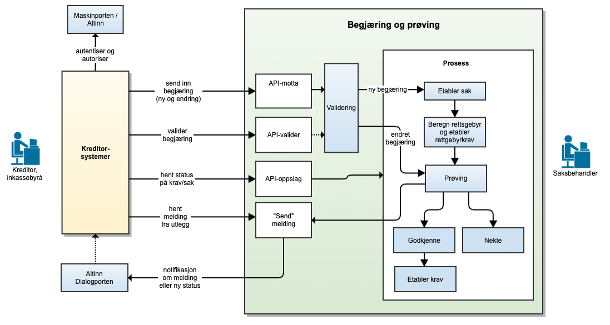

<Summary>## Om tjenesten
Utleggsbegjæring er en tjeneste for å sende utleggsbegjæringer til namsmannen gjennom Skatteetatens systemløsninger.

Målgruppen er dagens inkassosystemer, kommunene og andre systemleverandører.

Dersom du ønsker å ta i bruk utleggsbegjæring og prøving i ditt system eller har spørsmål knyttet til dette, ta kontakt med fremtidensinnkreving@skatteetaten.no.</Summary>

<Tabs underline={true}>
<TabItem headerText="Om tjenesten" itemKey="itemKey-1" default>

Figuren nedenfor angir overordnet tjenester Skatteetaten vil tilby for mottak og prøving av utleggsbegjæringer. Merk at figuren er en illustrasjon av måbildet, og det er ikke alle tjenestene i figuren som er implementert ennå. Det vil også i fremtiden kunne legges til nye tjenester som ikke er angitt i figuren.

[](../../static/download/Utleggsbegjaering_oversikt.png)


For generell informasjon om tjenestene se egne sider om:

* [Sikkerhetsmekansimer](../om/sikkerhet.md)
* [Systembruker](../om/systembruker.md)
* [Feilhåndtering](../om/feil.md)
* [Versjonering](../om/versjoner.md)
* [Teknisk spesifikasjon](../om/tekniskspesifikasjon.md)

## Scope

Følgende scope skal benyttes ved autentisering i Maskinporten: `skatteetaten:utleggsbegjaering`

## Delegering

Tilgang til dette API-et kan delegeres i Altinn, f.eks. dersom leverandør benyttes for den tekniske oppkoblingen. Søk
opp følgende tjeneste i Altinn for å delegere tilgangen: `Utleggstrekkbegjæring API - På vegne av`

## Teknisk spesifikasjon

URL-er til API-et, beskrivelsen av parameterne, endepunkter og respons ligger
i [Open API spesifikasjonen](https://app.swaggerhub.com/apis/skatteetaten/utleggsbegjaering-app) på SwaggerHub.

## Datakatalog

Dette API-et finnes foreløpig ikke i Felles datakatalog.

</TabItem>
<TabItem headerText="Eksempler" itemKey="itemKey-2"> 

## Åpne krav

### Eksempel på request URL

```
https://{env}/api/innkreving/kravogbetalinger/v1/finans/212201782/aapnekrav
```

### Eksempel på respons


</TabItem>
<TabItem headerText="Feilkoder" itemKey="itemKey-3">

Se egen side for generell info om [feilhåndtering i tjenestene](../om/feil.md).

Tabellen under viser en oversikt over hvilke spesifikke feilkoder denne applikasjonen kan gi. Feilmeldingen vil kunne variere selv om samme feilkode returneres. Dette er for å kunne gi en så presis beskrivelse av feilen som mulig.

| Feilkode | HTTP Statuskode | Feilområde                                                     |
|----------|-----------------|----------------------------------------------------------------|
| KB-001   | 500             | Uventet feil på tjenesten.                                     |
| KB-002   | 500             | Uventet feil i et bakenforliggende system.                     |
| KB-003   | 404             | Ukjent url benyttet.                                           |
| KB-004   | 401             | Feil i forbindelse med autentisering.                          |
| KB-005   | 403             | Feil i forbindelse med samtykketoken.                          |
| KB-006   | 400             | Feil i forbindelse med validering av inputdata.                |
| KB-007   | 404             | Fant ingen krav/betalinger på angitt identifikator og periode. |
| KB-008   | 406             | Feil tilknyttet dataformat. Kun json eller xml er støttet.     |
| KB-009   | 404             | Ingen treff på oppgitt identifikator.                          |

</TabItem>
<TabItem headerText="Informasjonsmodell" itemKey="itemKey-4">

Her ser du hele informasjonsmodellen for Krav og betalinger API med alle 4 endepunktene.

[](../../static/download/Informasjonsmodell_Kravogbetalinger.png)

</TabItem>
<TabItem headerText="Test" itemKey="itemKey-5">

I første omgang er det test kun tilgjengelig for et utvalg leverandører som det er inngått avtale med og som skal være
med å pilotere løsningene.

## Tenor testdatasøk

Det finnes pt. ikke søk i [Tenor](../test/tenor.md) for denne tjenesten, og testdata er derfor listet her.
Men egenskaper ved enhetene som har testdata kan søkes frem i Tenor.

## Testdata

Følgende enkeltmannsforetak (ENK) er tilgjengelige for denne tjenesten i Skatteetatens testmiljø for eksterne.
Vær oppmerksom på at det er et levende testdatasett som kan endre seg i løpet av testperioden. Ta kontakt dersom du har
behov for ytterligere testdata.

Obs. regnskapssystemer som tester vil i Test kunne gjøre oppslag på alle testvirksomheter, selv om de i pilotperioden kun kan gjøre oppslag for egen virksomhet i Prod.

| Organisasjonsnummer | 
|---------------------|
| 313367002           |
| 311851381           |
| 314961900           |
| 314055403           |
| 212201782           |

</TabItem>
</Tabs>

