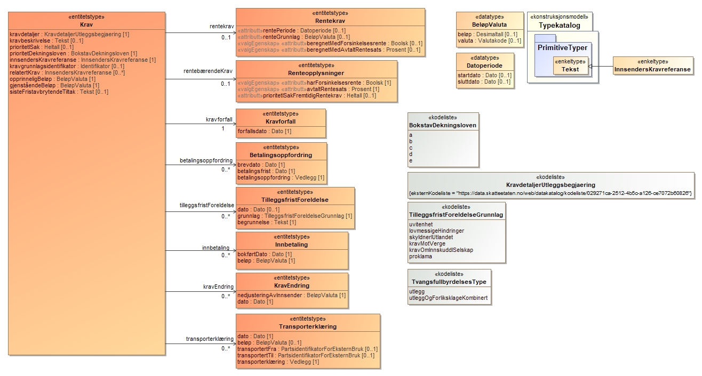
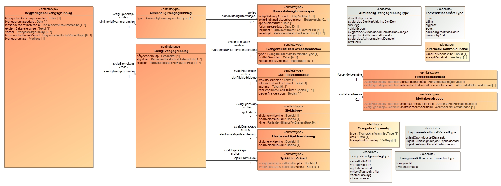
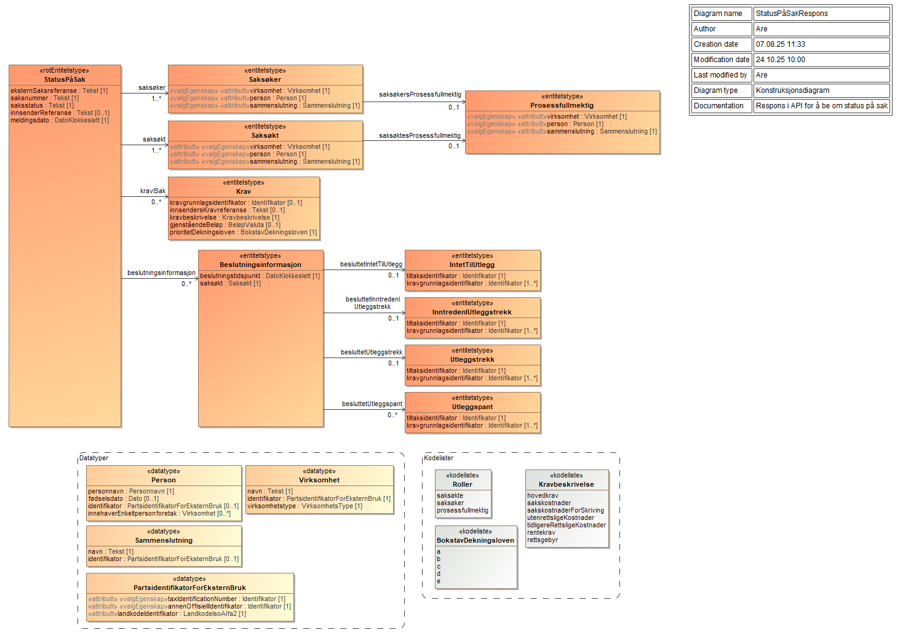
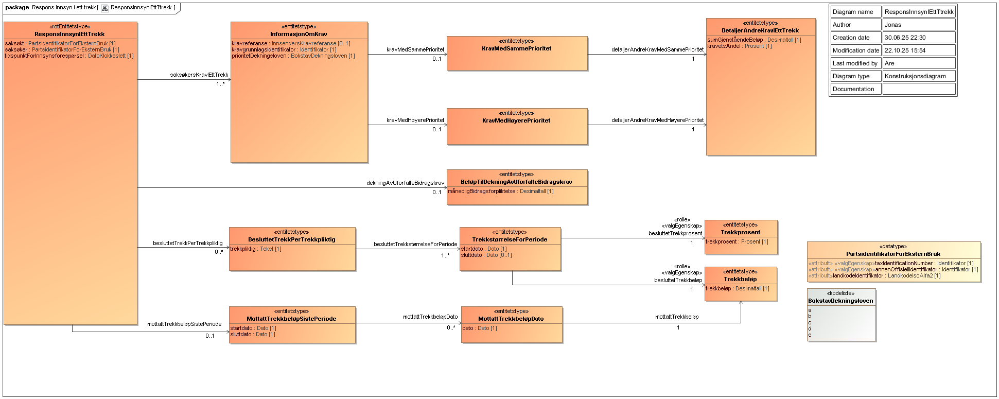

<Summary>ELAN (Utleggsbegjæring API) er en tjeneste for å sende utleggsbegjæringer til namsmannen gjennom Skatteetatens systemløsninger.</Summary>

<Tabs underline={true}>
<TabItem headerText="Om tjenesten" itemKey="itemKey-Om" default>
Målgruppen er dagens inkassosystemer, kommunene og andre systemleverandører.
Dersom du ønsker å ta i bruk ELAN og prøving i ditt system eller har spørsmål knyttet til dette, ta kontakt med fremtidensinnkreving@skatteetaten.no.

Figuren nedenfor angir overordnet tjenester Skatteetaten vil tilby for mottak og prøving av utleggsbegjæringer. Merk at figuren er en illustrasjon av måbildet, og det er ikke alle tjenestene i figuren som er implementert ennå. Det vil også i fremtiden kunne legges til nye tjenester som ikke er angitt i figuren.


For generell informasjon om tjenestene se egne sider om:

* [Sikkerhetsmekanismer](../om/sikkerhet.md)
* [Systembruker](../om/systembruker.md)
* [Feilhåndtering](../om/feil.md)
* [Versjonering](../om/versjoner.md)
* [Teknisk spesifikasjon](../om/tekniskspesifikasjon.md)

### Altinn Dialogporten
Leverandører er ikke påkrevet å å integrere med Dialogporten. Det vil være tilstrekkelig å kun benytte API-endepunktene. Gjennom Dialogporten vil vi imidlertid tilby en tjeneste for hendelsesvarsler (events) som angir når det er kommet nye meldinger fra Skatteeetaten, eksempelvis at det er bedt om retting av en tidligere innsendt utleggsbegjæring. Dersom man velger å ikke bruke varslingstjenesten, må man se etter nye meldinger ved jevnlig å gjøre spørringer mot etatens API (polling).

### Oppfølging og støtte
I testfasen vil vi tilby støtte til de eksterne leverandørene gjennom utvikling og test.

Mer informasjon kommer her.

I mellomtiden – ta kontakt med fremtidensinnkreving@skatteetaten.no.

## Scope

Følgende scope skal benyttes ved autentisering i Maskinporten: `skatteetaten:utleggsbegjaering`.

Ved bruk av systembruker må forespørselen også inneholde ressurs-id `ske-utleggsbegjaering` som beskrevet her for produksjon: https://docs.altinn.studio/api/authentication/systemuserapi/systemuserrequest/external/#create-a-standard-system-user-request

## Delegering

Tilgang til dette API-et kan delegeres i Altinn, f.eks. dersom leverandør benyttes for den tekniske oppkoblingen. Søk
opp følgende tjeneste i Altinn for å delegere tilgangen: `Utleggsbegjæring API - På vegne av`

## Teknisk spesifikasjon

Tjenestene knyttet til begjæring om utlegg er gruppert i ulike APIer, som agitt i tabellen nedenfor. URL-er til API-et, beskrivelsen av parameterne, endepunkter og respons ligger som spesifikasjoner på SwaggerHub.

| API                | Beskrivelse av tjenester                                                                                                                                                                 | Swaggerhub                                                                                                                        |
|:-------------------|:-----------------------------------------------------------------------------------------------------------------------------------------------------------------------------------------|:----------------------------------------------------------------------------------------------------------------------------------| 
| Utleggsbegjæring   | Tjenester for innsending og oppfølging av utleggsbegjæringer. Herunder tjenester for opplasting av vedlegg, innsending av utleggsbegjæring, endring av utleggsbegjæring samt validering. | [OpenAPI spesifikasjon for utleggsbegjæring](https://app.swaggerhub.com/apis/skatteetaten/utleggsbegjaering-api)                  |
| Innsyn i ett trekk | Tjenester for innsyn i samordnet trekk.                                                                                                                                                  | [OpenAPI spesifikasjon for innsyn i ett trekk](https://app.swaggerhub.com/apis/skatteetaten/utleggsbegjaering-innsyn-api)         |
| Status på sak      | Tjenester for å hente status på en utleggssak, inklusive informasjon om krav og beslutninger. Tjeneste for å få notifikasjon om statusendringer på sak                                   | [OpenAPI spesifikasjon for status på sak](https://app.swaggerhub.com/apis/skatteetaten/utleggsbegjaering-status-paa-sak-api)      |
| Betjeningskartet   | Tjenester for [overgangsperioden](utleggsbegjaering.md#Overgangsperiode-for-utleggsbegjæring)                                                                                            | [OpenAPI spesifikasjon for betjeningskartet](https://app.swaggerhub.com/apis/skatteetaten/utleggsbegjaering-betjeningskartet-api) |


## Datakatalog

Dette API-et finnes foreløpig ikke i Felles datakatalog.

## Tilgang til tjenesten
For å få tilgang til tjenesten må leverandøren ha underskrevet en pilotavtale med Skatteetaten.

Oppkobling mot testmiljøet i Skatteetaten skjer via Maskinporten. For å få utstedt token av Maskinporten må inkasso-systemet gjennom sitt virksomhetssertifikat angi hvilket organisasjonsnummer de representerer. Dette organisasjonsnummeret må være godkjent av Skatteetaten.

For å benytte tjenestene for innsending av begjæring skal korrekt scope benyttes.

API-et støtter to varianter av autentisering via Maskinporten. Disse er beskrevet under

### Alternativ 1 - Systemleverandør er innsender
Dersom systemleverandør kun skal sende inn utleggsbegjæringer på vegne av sin egen organisasjon, kan man benytte klassisk autentisering via Maskinporten. Mer informasjon om dette finnes her.

### Alternativ 2 - Systembruker
Dersom systemleverandør ønsker å tilby funksjonalitet der en annen organisasjon (kunde av systemleverandøren) skal benytte systemet til å sende inn utleggsbegjæringer, skal Altinn sin nye funksjonalitet for ‘systembruker’ benyttes. Mer informasjon om dette finnes i Altinn Systembruker for SBS og Systembruker roadmap.

Systemleverandør må for å støtte systembruker registrere seg i Maskinporten og Altinn test environment.

### Testoppsett
Bruk valgfrie organisasjoner fra Tenor som innsender av utleggsbegjæring.

### Test der systemleverandør er innsender (alternativ 1)
Når systemleverandør er innsender kan vilkårlige organisasjoner i Tenor benyttes som innsender.

### Test der systembruker benyttes (alternativ 2)
Den valgte organisasjonen i Tenor (som representerer en test-inkassovirksomhet) må godkjenne at dens fagsystem kan benytte tilgangsressursen/tjenesten «Innsending og oppfølging av utleggsbegjæring» på vegne av virksomheten. Det opprettes da en «systembruker» som er koblingen mellom bruker, system, leverandør og API.

</TabItem>
<TabItem headerText="Overgangsperioden" itemKey="itemKey-Overgangsperioden">

## Innføring av ny innkrevingslov
I en overgangsperiode (fra 1.1.2026 til 31.12.2026) skal namsmannen gradvis behandle nye utleggssaker mot saksøkte etter den nye innkrevingsloven og endringer i tvangsfullbyrdelsesloven. Myndighetene har derfor mulighet til å avgrense hvilke skyldnere som skal behandles etter nytt regelverk for utlegg ut fra forhåndsbestemte kriterier. Disse bestemmes konkret i forskrift.

Gjennom overgangsperioden legges det opp til en gradvis endring av parametrene slik at stadig flere skyldnere vil falle inn under kriterier for å bli behandlet etter nytt regelverk. Forskriften endres senest 14 dager før endringen trer i kraft. Parametrene er fastsatt i delegeringsvedtaket [Delegering av kongens myndighet etter innkrevingsloven § 40 andre og tredje ledd til Finansdepartementet](https://lovdata.no/dokument/DEL/forskrift/2025-06-10-968).

## Overgangsperiode for utleggsbegjæring

I overgangsperioden skal digitale utleggsbegjæringer for skyldnere som er omfattet av den nye innkrevingsloven sendes inn via ny løsning (ELAN), mens utleggsbegjæringer for skyldnere som ikke er omfattet av den nye innkrevingsloven skal sendes inn som før via eksisterende løsning (ELSA). Dersom en utleggsbegjæring angår flere skyldnere, må alle disse være på samme regelverk, hvis ikke må begjæringen sendes inn på papir.

## Betjeningskartet {#betjeningskartet-id}

For å avgjøre hvorvidt en skyldner er omfattet av nytt eller gammelt regelverk, kan innkassosystemet benytte en API-tjeneste kalt "Betjeningskartet". Her kan man slå opp gjeldende regelverk for en eller flere skyldnere på identifikator (fødselsnummer). Tjenesten skal kalles rett i forkant av innsending av en ny utleggsbegjæring gjennom API, slik at innsendingen gjøres til riktig system (ELSA eller ELAN). URL-er til betjeningskart API-et, beskrivelsen av parameterne, endepunkter og respons ligger i [OpenAPI spesifikasjonen for betjeningskartet](https://app.swaggerhub.com/apis/skatteetaten/utleggsbegjaering-betjeningskartet-api) på SwaggerHub.

:::warning[Merknad]
Vi ønsker ikke at dere kaller tjenesten unødig. Tjenesten skal kun brukes til å avklare i forkant av en innsending hvorvidt skyldner er på nytt eller gammelt regelverk.
:::


Dersom man sender en utleggsbegjæring til feil system, vil systemet returnere en feilmelding om dette og avvise innsendingen. For ELAN vil det gis en 422-feilkode med feilmeldingen "SAKSOEKT_GAMMELT_REGELVERK".


</TabItem>
<TabItem headerText="Feilkoder" itemKey="itemKey-Feilkoder">

Se egen side for generell info om [feilhåndtering i tjenestene](../om/feil.md).

Tabellen nedenfor gir en oversikt over ulike former for valideringsfeil som kan inntreffe ved innsendng eller endring av en utleggsbegjæring. Dersom innholdet i begjæringen er syntaktisk korrekt men inneholder semantiske feil, vil tjensten returnere feilkode 422 og en liste av feil iht tabellen nedenfor.

| Vilkårnavn | Gjelder kun endringer | Tittel | Beskrivelse | Avvikstekst |
| :--- | :--- | :--- | :--- | :--- |
| DUPLIKAT_INNSENDING | Nei | Duplikat | Duplikat innsending | Sak med begjæringsdato %begjæringsdato og referanse %innsenderReferanse er allerede sendt inn |
| DUPLIKAT_SAKSOEKER | Nei | Duplikat saksøker | Det er ikke tillatt med duplikate saksøkere | Det er ikke tillatt med duplikate saksøkere |
| DUPLIKAT_SAKSOEKT | Nei | Duplikat saksøkt | Det er ikke tillatt med duplikate saksøkte | Det er ikke tillatt med duplikate saksøkte |
| GEBYR_ELLER_SAKSKOSTNAD_HAR_ET_RELATERTKRAV_SOM_IKKE_ER_HOVEDSTOL | Nei | Uriktig eller manglende relasjon til hovedstol | Gebyr eller sakskostnad kan kun relateres til hovedstol | Kravet kan kun relateres til et krav av typen hovedstol. |
| HOVEDSTOL_SKAL_IKKE_HA_ET_RELATERT_KRAV | Nei | Hovedstol har et relatert krav | En hovedstol skal ikke ha en relatert krav | Hovedstol har et relatert krav |
| INNSENDER_IKKE_IDENTIFISERBAR | Nei | Ukjent innsender | Begjæringen må angi en innsender som kan identifiseres | Innsender %innsender kan ikke identifiseres |
| INNSENDER_IKKE_ORGANISASJON | Nei | Innsender er ikke en organisasjon | Innsender må være en organisasjon | Innsender %innsender er ikke en organisasjon |
| INNSENDER_MANGLER | Nei | Mangler opplysninger om innsender | Begjæringen må inneholde opplysning om innsender | Begjæringen må inneholde opplysning om innsender |
| INNSENDER_SAMSVARER_IKKE_MED_AUTENTISERING | Nei | Innsender er ikke autentisert korrekt | Innsender må være autentisert | Innsenders organisasjonsnummer %innsenderOrgnr, som angitt i begjæringen, avviker fra pålogget virksomhet, %påloggetOrgnr |
| KAN_BEHANDLES_I_FORLIKSRAADET_PAAKREVET | Nei | Ønskes saken behandlet i Forliksrådet? | Begjæringen skal opplyse om saksøker ønsker behandling i forliksrådet dersom saksøkte reiser innvendinger mot kravet | Må angi hvorvidt saken ønskes behandlet i Forliksrådet |
| KRAV_DUPLIKATE_REFERANSER | Nei | Krav har ikke unike kravreferanser | Begjæringens krav må ha unike kravreferanser | Det foreligger flere krav med kravreferanse %kravreferanse |
| KRAV_IKKE_BENYTTET | Nei | Begjæringen inneholder krav som ikke er dokumentert gjennom tvangsgrunnlag | Alle krav lagt til i begjæringen må dokumenteres | Krav med kravreferanse %kravreferanse er ikke referert til fra begjaeringens tvangsgrunnlag |
| KRAV_I_FLERE_TVANGSGRUNNLAG | Nei | Krav i flere tvangsgrunnlag | Et krav kan ikke inngå i flere tvangsgrunnlag | Et krav kan ikke inngå i flere tvangsgrunnlag |
| MAKS_EN_ADRESSE_AV_HVER_TYPE | Nei | Maks en adresse av hver type | En aktør kan kun ha en adresse av hver type | Man kan kun definere en adresse av type %ukjentBosted, postadresse, bopelsadresse, forretningsadresse, postboks |
| MANGELFULLE_KONTOOPPLYSNINGER | Nei | Kontoopplysninger er mangelfulle | Kontoopplysninger må være gyldige | Konto må inneholde minst en verdi |
| MANGLER_KRAV | Nei | Begjæringen refererer ikke til noen krav | Det må finnes minimum ett krav | Krav mangler |
| MANGLER_OPPLYSNINGER_BEVILLINGSHAVER | Nei | Opplysninger om bevillingshaver mangler | Inkassobyrået må oppgi en bevillingshaver | Inkassobyrået %prosessfullmektig må oppgi bevillingshaver |
| MANGLER_OPPLYSNINGER_OM_SAKSOEKER | Nei | Mangler opplysninger om saksøker | Begjæring må inneholde et minimum av opplysninger for å identifisere saksøker | Saksøker %saksøker må oppgis med en av<br/>- orgnummer og navn<br/>- navn og adresse<br/>- personlig identifikator, etternavn og fornavn<br/>- fødselsdato, etternavn og fornavn |
| MANGLER_OPPLYSNINGER_OM_SAKSOEKT | Nei | Opplysninger om saksøkte mangler | Begjæring må inneholde et minimum av opplysninger for å identifisere saksøkt | Saksøkte %saksøkt må oppgis med en av<br/>- personlig identifikator, minst ett etternavn og fornavn<br/>- fødselsdato, etternavn, fornavn og adresse<br/>- orgnummer og navn |
| MANGLER_OPPLYSNINGER_PROSESSFULLMEKTIG_PERSON | Nei | Opplysninger om prosessfullmektig mangler | Begjæring skal inneholde prosessfullmektigens orgnummer eller navn og adresse dersom kreditoren benytter prosessfullmektig | Prosessfullmektig %prosessfullmektig må oppgis med<br/>- Fullt navn <br/>- Adresse |
| PAASTAND_PAAKREVET | Nei | Påstand må fylles ut | Påstand om resultat klager krever ved evt. dom | Ved utlegg og forliksklage kombinert må påstand være utfylt |
| PARAGRAF_4_18_VARSEL_PAAKREVET | Nei | § 4-18 Varsel må fylles ut | Feltet "Varsel" må fylles ut | For særlige tvangsgrunnlag må varsel etter tvangsfullbyrdelsesloven § 4-18 eller begrunnelse for manglende varsel være utfylt |
| PARAGRAF_4_19_VARSEL_PAAKREVET | Nei | § 4-19 Varsel må fylles ut | Feltet "Varsel" må fylles ut | Varsel etter tvangsfullbyrdelsesloven § 4-19 eller begrunnelse for manglende varsel må være utfylt |
| PRIORITET_MANGLER | Nei | Manglende angivelse av prioritet på kravet | Hvis prioritet er angitt, så må det angis på alle. | Hvis dere har angitt prioritet på en av kravspostene, må det også angis på de øvrige kravspostene |
| PRIORITET_MANGLER_PÅ_RENTEOPPLYSNINGER | Nei | Prioritet angitt på ett krav men mangler på renter frem i tid | Må melde inn prioritet på renter som skal påløpe senere på alle kravlinjer som er rentebærende, når det er satt prioritet på minst et annet krav (ref. regel I7). Kravlinje for kravlinje.  | Hvis dere har angitt prioritet på en av kravspostene så må det også angis prioritet på fremtidige renteposter |
| PRIORITET_MANGLER_PÅ_RETTSGEBYR | Nei | Manglende angivelse av prioritet på kravet | Gebyr: Må angi prioritet på rettsgebyret hvis saksøkte skal betale dette og det er satt prioritet på minst et annet krav (ref. regel I7) | Hvis dere har angitt prioritet på en av kravspostene så må det også angis for rettsgebyret |
| RELATERTE_KRAV_KAN_IKKE_PEKE_PÅ_SEG_SELV | Nei | Relaterte krav kan ikke peke på seg selv | Relaterte krav kan ikke peke på seg selv | Relaterte krav kan ikke peke på seg selv |
| RELATERTE_KRAV_MÅ_FINNES | Nei | Relaterte krav må peke til krav i samme tvangsgrunnlag | Et relatert krav må finnes i samme tvangsgrunnlag | Relaterte krav må finnes i samme tvangsgrunnlag |
| RELATERTE_KRAV_UGYLDIGE_KRAVREFERANSER | Nei | Relaterte krav peker på krav som ikke eksisterer | Kravreferanser må være gyldige | Krav med kravreferanse %hovedkravRef peker på relatert krav med kravreferanse %relatertKravRef som ikke eksisterer |
| RENTEKRAV_KAN_IKKE_HA_RENTEKRAV | Nei | Uriktig relasjon til rentekravet | Rentekrav kan ikke peke på annet rentekrav | Et rentekrav kan ikke være relatert til et annet rentekrav. Oppgi korrekt relasjon til et rentebærende krav. |
| RENTE_MAA_HA_RELATERT_KRAV | Nei | Relasjon til rentebærende krav mangler | Relasjon til rentebærende krav mangler | Et rentekrav må ha et relatert krav slik at det relaterer seg til et annet krav som er rentebærende. |
| SAKSOEKERS_INNENLANDS_ADRESSE_UGYLDIG | Nei | Minimumsadresse innenlands for saksøker | Begjæring må inneholde et minimum av opplysninger for adresser | Saksøker %saksøker sin adresse innenlands må minimum inneholde adressetekst og postnummer |
| SAKSOEKERS_UTENLANDS_ADRESSE_UGYLDIG | Nei | Minimumsadresse utland for saksøker | Begjæring må inneholde et minimum av opplysninger for adresser | Saksøker %saksøker sin adresse utenlands må minimum inneholde poststed og landkode |
| SAKSOEKT_GAMMELT_REGELVERK | Nei | Saksøkt på gammelt regelverk | Begjæringen angir saksøkt som må behandles etter gammelt regelverk | Saksøkt med identifikator %identifikator må behandles etter gammelt regelverk, og må sendes inn via ELSA |
| SAKSØKTES_INNENLANDS_ADRESSE_UGYLDIG | Nei | Minimumsadresse innenlands for saksøkte | Begjæring må inneholde et minimum av opplysninger for adresser | Saksøkte %saksøkt sin adresse innenlands må minimum inneholde adressetekst og postnummer |
| SAKSØKTES_UTENLANDS_ADRESSE_UGYLDIG | Nei | Saksøktes utenlandsadresse er ugyldig | Begjæring må inneholde et minimum av opplysninger for adresser | Saksøkte %saksøkt sin adresse utland må minimum inneholde poststed og landkode |
| SAMME_SAKSOEKT_SOM_SAKSOEKER | Nei | Saksøker kan ikke være saksøkt | Saksøker kan ikke være saksøkt | Saksøker kan ikke være saksøkt |
| TVANGSGRUNNLAG_UGYLDIGE_KRAVREFERANSER | Nei | Begjæringens tvangsgrunnlag peker på krav som ikke eksisterer | Begjæringens tvangsgrunnlag på peke på krav | Begjæringens tvangsgrunnlag med kravreferanse %kravreferanse peker på krav som ikke eksisterer |
| UAVKLART_STATUS | Ja | Endringer på denne begjæringen er for tiden ikke tillatt | For å kunne endre en begjæring må tidligere innsendinger være behandlet | Sak med referanse %eksternSaksreferanse har eksisterende innsendinger som ikke er behandlet. Endringer er for tiden ikke tillatt, prøv igjen senere |
| UGYLDIG_BELOEP | Nei | Ugyldig beløp | Beløp har rett format | Beløp %beløp er ugyldig. Beløp kan ha maks to desimaler og ikke være negativt |
| UGYLDIG_KID | Nei | Ugyldig kid | KID har rett format | Kidnummer %kidnummer er feil |
| UGYLDIG_KONTONR | Nei | Ugyldig kontonummer | Kontonummer har rett format | Mottakers kontonummer %kontonummer er feil |
| UGYLDIG_ORGNR_PROSESSFULLMEKTIG | Nei | Prosessfullmektiges orgnummer er ugyldig | Prosessfullmektig har gyldig orgnummer | Prosessfullmektig %prosessfullmektig må oppgis med gyldig orgnummer for inkassobyrået |
| UGYLDIG_RENTE | Nei | Ugyldig rente | Rente har rett format | Rente %rentesats er ugyldig. Rente kan ha maks to desimaler og ikke være negativt |
| UGYLDIG_STATUS | Ja | Saken har en status der endringer ikke lenger er tillatt | Ugyldig status | Sak med referanse %eksternSaksreferanse har tilstand %tilstand. Endringer er ikke lenger tillatt |
| UGYLDIG_VEDLEGG_BETALINGSOPPFORDRING | Nei | Betalingsoppfordring har vedlegg av feil type | Betalingsoppfordring må ha vedlegg av korrekt type | Vedlegg for betalingsoppfordring med filnavn %filnavn må være av type betalingsoppfordring |
| UGYLDIG_VEDLEGG_FULLMAKT | Nei | Fullmakt har vedlegg av feil type | Fullmakt må ha vedlegg av korrekt type | Vedlegg for fullmakt med filnavn %filnavn må være av type fullmakt |
| UGYLDIG_VEDLEGG_TRANSPORTERKLÆRING | Nei | Transporterklæring har vedlegg av feil type | Transporterklæring må ha vedlegg av korrekt type | Vedlegg for transporterklæring med filnavn %filnavn må være av type transporterklæring |
| UGYLDIG_VEDLEGG_TVANGSGRUNNLAG | Nei | Tvangsgrunnlag har vedlegg av feil type | Begjæringens tvangsgrunnlag må ha vedlegg av korrekt type | Vedlegg for tvangsgrunnlag med betegnelse %betegnelse må være av type tvangsgrunnlag |
| UGYLDIG_VEDLEGG_TVANGSKRAFTGRUNNLAG | Nei | Tvangskraftgrunnlag (varsel) har vedlegg av feil type | Begjæringens tvangskraftgrunnlag (varsel) må ha vedlegg av korrekt type | Vedlegg for tvangskraftgrunnlag med filnavn %filnavn må være av type tvangskraftgrunnlag |
| ULOVLIG_ENDRING_BEGJAERINGSDATO | Ja | Det er ikke tillatt å endre begjæringens dato | Ulovlig endring |  |
| ULOVLIG_ENDRING_INNSENDER | Ja | Det er ikke tillatt å endre innsender | Ulovlig endring |  |
| ULOVLIG_ENDRING_UNDERSKRIFT | Ja | Det er ikke tillatt å endre underskrift | Ulovlig endring |  |
| VEDLEGG_SKAL_HA_REFERANSE_TIL_BEGJAERINGEN | Nei | Vedlegg referert til i begjæringen har er lastet opp med referanse til en annen begjæring | Alle vedlegg knyttet til begjæringen skal ha referanse til begjæringen | Vedlegg '%s' er lagret med referanse til en annen begjæring og kan ikke benyttes i denne begjæringen. Last opp vedlegg pånytt med referanse til '%s' |
| VEDLEGG_SKAL_HA_UUID | Nei | Vedlegg referert til i begjæringen har ikke fylt ut uuid | Alle vedlegg knyttet til begjæringen skal ha utfylt uuid | Vedlegg '%s' mangler uuid |
| VEDLEGG_SKAL_IKKE_HA_FEILET | Nei | Vedlegg referert til i begjæringen har feilet og kan ikke benyttes | Alle vedlegg knyttet til begjæringen skal være uten feil | En av følgende:<br/>- Vedlegg '%s' er er forsøkt validert, men valideringen feilet pga teknisk feil. Vennligst forsøk å laste opp vedlegget på nytt, og hvis problemet vedvarer, kontakt support<br/>- Vedlegg '%s' feilet ved forsøk på konvertering til gyldig pdf.<br/>- Vedlegg '%s' lar seg ikke konvertere til gyldig pdf. |
| VEDLEGG_SKAL_VAERE_TILGJENGELIG | Nei | Vedlegg referert til i begjæringen er ikke tilgjengelig og kan ikke benyttes | Alle vedlegg knyttet til begjæringen skal være tilgjengelig | En av følgende:<br/>- Vedlegg '%s' med id '%s' finnes ikke.<br/>- Vedlegg '%s' er slettet.<br/>- Vedlegg '%s' er kassert.<br/>- Vedlegg '%s' inneholder virus. |
| VEDLEGG_SKAL_VAERE_VIRUSSJEKKET_VALIDERT_OG_KONVERTERT | Nei | Vedlegg referert til i begjæringen er ikke klar til å kunne benyttes enda | Alle vedlegg knyttet til begjæringen skal være virussjekket, validert og konvertert | En av følgende:<br/>- Vedlegg '%s' er ikke virussjekket.<br/>- Vedlegg '%s' er ikke konvertert til gyldig pdf.<br/>- Vedlegg '%s' er ikke validert. |

</TabItem>
<TabItem headerText="Informasjonsmodell" itemKey="itemKey-Informasjonsmodell">

 <details>
      <summary>Utleggsbegjæring versjon 1.0</summary>
      <p>

## Endringslogg
Oversikt over endringer som er gjort i versjon 1.0 av Utleggsbegjæringen:
1. Fjernet saksøkerReferanse i Saksøker og saksøktReferanse i Saksøkt
2. Endret kardinalitet på forpliktet og berettiget i Domsslutningsinformasjon fra 0..1 til 1..*
3. Endret prosessfullmektig til hhv. saksøkersProsessfullmektig, innsendersProsessfullmektig og saksøktesProsessfullmektig
4. Fjernet inkassobevillingshaverNummer i Bevillingshaver
5. Lagt inn kodeliste for namsmannsdistrikt
6. Fjernet domsreferanse i AlminneligTvangsgrunnlag
7. Fjernet referanseSak i SærligTvangsgrunnlag
8. Endret alternativElektroniskKanalForMeddelelse i Forsendelsemåte til alternativElektroniskForesendelsesmåte
9. Endret navn på kravreferanse i Krav til innsendersKravreferanse
10. Lagt inn nytt valgfritt element kravEndring i Krav
11. Endret innhold i Rentekrav og fjernet relasjon til Renteopplysninger
12. Endret kodeverdien ukjentFullmektigMedKjentOppholdsstedEllerUkjentElektroniskKontaktinformasjon  i kodelisten BegrunnelseUnnlattVarselType til hhv. ukjentFullmektigMedKjentOppholdssted og ukjentElektroniskKontaktinformasjon
13. Rettet til skyldnererklæring i Gjeldsbrev og ElektroniskGjeldserklæring
14. Rettet til utleggOgForliksklageKombinert i Tvangsfullbyrdelsestype (fjernet ekstra l)
15. Endret avtaltRentesats i Renteopplysninger fra type Desimaltall til type Prosent
16. Fjernet avsender i SkriftligMeddelelse

## Forklaring til modellen
Denne veilederen har til formål å veilede både funksjonelle og tekniske ressurser til å få en overordnet forståelse av elementene og sammenhengen mellom disse i ELAN løsningen.
Hvert enkelt begrep forklares ikke her, det vil man finne i "documentation" elementet i Swagger(JSON).

Modellen består av en «rotEntitet» som gjelder overordnet informasjon på tvers av begjæringen.

I øvre halvdel har man informasjon om de formelle partene i begjæringen, saksøker, saksøkt og innsender. Disse partene kan ha/være en prosessfullmektig, dvs en representant for parten i aktuelle sak.

I tillegg finner man noen generelle entiteter som gjelder hele begjæringen.

Videre har man entiteten «Krav» som er kjerneinformasjon med detaljer om «pengekravet» med endringer, fra det ble etablert og frem til innsendingen av utleggsbegjæringen.

I «BegjæringensTvangsgrunnlag» skal man legge inn detaljer om grunnlaget for Kravene i utleggsbegjæringen.

### a) Rotnivå - Utleggsbegjæring
RotEntiteten Utleggsbegjæring inneholder kjernerneinformasjon om innsendingen, som generelle vedlegg, underskrift med navn på ansvarlig for innsendingen.

innsenderReferanse er innsenders unike referanse på saken. Tilsvarende er eksternSaksreferanse, som returneres ved innsending av utleggsbegjæringen, namsmyndighetens unike identifikator for saken og som skal benyttes senere i prosessen ved kommunikasjon ved namsmyndigheten.

I elementet tvangsfullbyrdelsestype må man angi om det er en ren utleggsbegjæring, eller kombinert forliksklage.

Dersom man har opplysninger om spesiellUtleggsgjenstand, kan dette opplyses.


#### Datatyper:


### b) Parter i utleggsbegjæringen
Innsender er den som sender inn utleggsbegjæringen. Innsender kan også være eller ha prosessfullmektig. Typisk kan Innsender være et inkassobyrå og prosessfullmektig være inkassobevillingshaver som har saken.

Saksøker er den som erklærer at noen er skyldig penger. Saksøker kan ha en prosessfullmektig som representerer seg i sak om tvangsfullbyrdelse(saksøkersProsessfullmektig). Typisk kan dette være en ansatt hos saksøkeren, med fullmakt.

Saksøkt er den man krever penger fra. Dersom man er kjent med at denne er representert av prosessfullmektig, kan saksøktesProsessfullmektig utfylles. OBS! Det er påkrevd med norsk identifikator for saksøkt.

Prosessfullmektig(fullmakt/bevillingshaver/Advokat/avdvokatfullmektig) er tredjeperson med en generell(Bevillingshaver) eller spesifikk fullmakt(Fullmakt) til å opptre på vegne av en part. Dette må være en fysisk person.

Dersom prosessfullmektig er Advokat/advokatfullmektig eller inkassobevillingshaver, skal bevillingshavers navn fylles ut. I alle andre tilfeller må fullmakt vedlegges.


#### Datatyper:


### c) Generelle elementer

I begjæringen har vi 3 såkalte entiteter med generell informasjon som dekker hele utleggsbegjæringen, dette er
* KreverRettsgebyrErstattet - Benyttes om du ønsker å angi at rettsgebyret som ilegges ved innsending, kreves erstattet av saksøkte.
* Betalingsinformasjon - Informasjon om hvor, hvordan og til hvem innbetalingen skal gjøres, dersom det ender opp i samordnet trekk.
* Namsmannsdistrikt -skal kun benyttes om man ønsker begjæringen behandlet av annet namsmannsdistrikt, enn saksøktes alminnelige verneting. Merk at namsmannsdistrikt må være skrevet nøyaktig som i kodelisten.


### d) Kravinformasjon

Krav er det minste objektet innenfor et tvangsgrunnlag og har ulike typer, kalt «kravdetaljer». Eksempler på kravdetaljer er "Hovedkrav" som er det opprinnelige beløpet en person er skyldig, og "Rentekrav" som omfatter renter som er påløpt etter at kravet oppstod.
Se kodeliste for alle gyldige verdier [kravdetaljerUtleggsbegjaering](https://data.skatteetaten.no/web/datakatalog/kodeliste/029271ca-2512-4b5c-a126-ce7072b60826).
En opprinnelig faktura kan være et eksempel på et "Hovedkrav". Har man f. eks to fakturaer med ulikt forfall («kravforfall»), er dette å anse som to krav.

«InnsendersKravreferanse» har flere formål, det ene er å unikt identifisere et krav innenfor en Utleggsbegjæring, det andre er å kunne relatere såkalte «tilleggskrav» som for eksempel «Sakskostnader» eller «Rentekrav». På samme måte kan man relatere «Rentekrav» til «Sakskostnader». I praksis fyller man ut «relatertKrav» med opphavets «InnsendersKravreferanse».

Dersom man sender inn et «Rentekrav», bør man legge ved hvilken «rentePeriode» (fra og til dato) rentene er beregnet, samt hvilket beløp det er beregnet rente av i «renteGrunnlag».  Dette fylles ut i «rentekrav» elementet.
I tillegg bør man angi om det er "beregnetMedForsinkelsesrente" eller evntuelt med en avtalt rentesats i «beregnetMedAvtaltRentesats».

Sender man inn et krav som det kreves renter for, må man fylle ut «rentebærendeKrav».

Har det kommet innbetalinger på aktuelle krav, må disse knyttes til det enkelte kravet med beløp og dato. Dette blant annet for å kunne beregne og ettergå krevde rentekrav.

Har man andre nedjusteringer på krav, skal dette angis i entiteten "kravEndring".

Har kravet byttet eier skal informasjon om dette angis i entiteten «transporterklæring», og det må vedlegges dokumentasjon.

Dersom man angir "transporterklæring" på et Hovedkrav trenger man ikke fylle ut posten for andre krav(kravdetaljer) som er koblet til dette via å oppgi Hovedkravet/opphavets "innsendersKravreferanse" i "relatertKrav".



### e) BegjæringensTvangsgrunnlag

Begjæringens Tvangsgrunnlag omfatter data om og i tvangsgrunnlag(ene) i begjæringen. Tvangsgrunnlaget brukes videre som kobling til krav(innsendersKravreferanse) og identifisere hvem som er parter på kravene.

Som innsender har du mulighet å legge deres egen referanse (eksternSaksreferanse) på hvert begjæringensTvangsgrunnlag.

Dersom man ikke har sendt varsel til skyldner, må årsak oppgis i begrunnelseUnnlatvarsel(OBS: Er ikke lov å fylle ut for SkriftligMeddelelse).



</p>
</details>

 <details>
      <summary>Eksempler på utleggsbegjæring</summary>
<p>

I dette avsnittet vises eksempler på data som illusterer hvordan man kan bygge opp en utleggsbegjæring i henhold til informasjonsmodellen.

## Eksempel på utleggsbegjæring
Eksemplene nedenfor bruker testparter fra Tenor. De syntetiske dataene i dokumentet byttes ut med deres egne syntetiske data. Dette inkluderer opplastede vedlegg, samt valgte aktører (innsender, saksøkte, saksøkere og prosessfullmektig) fra Tenor.

:::info[Enkelt eksempel]
[utleggsbegjaering-enkel.json](../../static/download/utleggsbegjaering/begjaering-v1.json)
:::

:::info[Komplekst eksempel]
Eksempelet angir en utleggsbegjæring med flere krav og flere tvangsgrunnlag. I tillegg er det angitt flere saksøkere og saksøkte.

[utleggsbegjaering-kompleks.json](../../static/download/utleggsbegjaering/begjaering-v1-kompleks.json)
:::

</p>
</details>

<details>
      <summary>Status på sak</summary>
<p>

Når Kreditor har sendt inn en utleggsbegjæring, kan man få status på saken ved å bruke tjenesten "Status på sak". Tjenesten gir informasjon om sakens tilstand, samt hvilke beslutninger som eventuelt er fattet i saken. Når en beslutning er fattet angir tjenesten informasjon om alle krav som følges opp av beslutningen. Dette inkluderer informasjon om kravenes kravgrunnlagsidentifikator, som er den identifikator som Alminnelig Namsmann har gitt de enkelte krav. Denne identifikatoren kan brukes til å angi spesifikke krav dersom Kreditor senere for eksempel ønsker å melde en innbetaling på kravet.



</p>
</details>

 <details>
      <summary>Innsyn i ett trekk</summary>
<p>

Tvangsforbyrdelseslovens forskrift [§ 4 Fordringshaveres innsyn i opplysninger om løpende utleggstrekk](https://lovdata.no/nav/forskrift/2025-07-09-1510) gir kreditor rett til å få innsyn i ett trekk. Forutsetningene for bruk av tjenesten er blant annet
* Prosessfullmektig kan kun få svar på krav i saker som hen er prosessfullmektig for.
* Kravene må være i et etablert og ikke avsluttet trekk.

| Informasjonselement                                                                                                                                                       | Hvilken informasjon returneres                                                                                                                                                                                                                                                                                                                                                |
|:--------------------------------------------------------------------------------------------------------------------------------------------------------------------------|:------------------------------------------------------------------------------------------------------------------------------------------------------------------------------------------------------------------------------------------------------------------------------------------------------------------------------------------------------------------------------| 
| a. summen av krav i trekket med bedre artsprioritet enn saksøkerens krav                                                                                                  | Summen av beløp og stipulerte renter på kravene i trekket som har bedre artsprioritet enn det aktuelle kravet (artsprioritet a er bedre enn b, b bedre enn c, osv.) eller bedre tidsprioritet                                                                                                                                                                                 |
| b. summen av krav i trekket med lik artsprioritet som saksøkerens krav, samt kravenes samlede grunnlag for forholdsmessig fordeling etter dekningsloven § 2-8 tredje ledd | Summen av beløp og stipulerte renter på kravene i trekket som har samme artsprioritet som det aktuelle kravet. Kravets dividendegrunnlag i trekket (gjenstående beløp for forholdsmessig fordeling pluss påløpte renter for forholdsmessig fordeling) for kravet / de andre kravene sitt dividendegrunnlag                                                                    |
| c. hvor mye av trekket som skal dekke uforfalte bidragskrav                                                                                                               | Besluttet løpende bidragskrav i trekk                                                                                                                                                                                                                                                                                                                                         |
| d. datoen for sist gjennomførte trekk og hvilket beløp som ble trukket                                                                                                    | Mottatte og plasserte beløp i dag og 1 måned bakover i tid                                                                                                                                                                                                                                                                                                                    |
| e. gjeldende beslutning om trekkets størrelse og hvem som er trekkpliktig                                                                                                 | Trekkpåleggene i dag og frem i tid – likt som i kreditors saksinnsyn                                                                                                                                                                                                                                                                                                          |



</p>
</details>

</TabItem>
<TabItem headerText="Test" itemKey="itemKey-Test">

## Testing
### Krav til testgjennomføring
Systemleverandørene har ansvar for egen testgjennomføring. Det må fokuseres på at validerings- og innsendingstjenestene fungerer som forventet. Prosjektet bistår med feilsøk, evt. Feilretting og ved behov oppfølging av saker som er sendt inn i testmiljøet.

### Testmiljø og testdata
Systemleverandørene må ha testmiljøer som kun består av syntetiske data. Det skal brukes testdata fra ‘Syntetisk Norge’ og disse hentes ut med Tenor Testdatasøk i de meldingene som sendes inn. Vedlegg skal også kun inneholde syntetiske testdata. Her finnes en bruksveiledning for Tenor Testdatasøk. Oppkobling mot testmiljøet i Skatteetaten skjer via Maskinporten.

Testdata finner man i [Tenor](https://www.skatteetaten.no/testdata/). Det er for testformål konfigurert opp syntetiske personer og virksomheter som i [Betjeningskartet](utleggsbegjaering.md?tab=Overgangsperioden#betjeningskartet-id) i overgangsperioden er låst til gammelt regelverk. Disse kan brukes i test for oppslag i Betjeningskartet og ved innsending av utleggsbegjæring. Ved innsending av utleggsbegjæring mot ELAN i test bør man velge saksøkte som IKKE er på denne lista, hvis ikke vil innsendingen bli avvist da saksøkt skal behandles på gammelt regelverk og i ELSA.
<details>
  <summary>Liste over syntetiske personer som er låst til gammelt regelverk</summary>
  <p>
| Fødselsnummer / D-nummer
|:------------------------------
| 08907395937
| 25876099732
| 10866995732
| 16826098795
| 23815198670
| 07854498589
| 30844996450
| 07865697079
| 11830099524
| 19845596576
| 28890199277
| 07871349252
| 16818999775
| 16830648546
| 16851598123
| 04929698350
| 16906796930
| 26876898178
| 28906599823
| 08846599399
| 22849499118
| 11909096741
| 29865399209
| 11865395304
| 30830248842
| 26883848240
| 23882748456
| 16868196126
| 05820398698
| 10878699314
| 16922749950
| 10921498832
| 29865196391
| 18888897832
| 22865996385
| 06818597124
| 17836595742
| 19836199688
| 29845999587
| 16821748686
| 17863349532
| 24821698924
| 19872849567
| 24921296564
| 24912847973
| 05876196907
| 05812249675
| 17923249419
| 01874798416
| 19870199417
| 30845698860
| 12880899218
| 11838597957
| 23874398381
| 27817897210
| 14813048990
| 08921849002
| 08859999760
| 20903549832
| 28909198889
| 03900899547
| 03859899098
| 15863949308
| 13850597132
| 03815796623
| 19928099914
| 19845097103
| 01925299312
| 12915598682
| 23871899428
| 04928798777
| 10876096043
| 17836196724
| 15920598568
| 13917499602
| 17870899041
| 01843747953
| 26816797666
| 05889499062
| 06861648492
| 18879499808
| 15865898816
| 13864699671
| 14857098634
| 28860999163
| 27885496518
| 18831049835
| 24918696535
| 17814398307
| 05845399583
| 21864699321
| 29861348812
| 12882349347
| 22883348633
| 11814996982
| 15852247433
| 13816197753
| 12845699338
| 07859999993
| 19849997931
  </p>
</details>
<details>
  <summary>Liste over syntetiske virksomheter som er låst til gammelt regelverk</summary>
  <p>
| Organisasjonsnummer
|:------------------------------
| 313159949
| 310844136
| 213144502
| 312387921
| 310222186
| 214313502
| 311689916
| 312399970
| 213913662
| 313185486
| 314053885
| 315658438
| 310777609
| 315687845
| 214659352
| 315791677
| 315723310
| 315139368
| 311171941
| 310382825
| 311136380
| 315921953
| 310598380
| 311514709
| 315844827
| 213732692
| 310454680
| 312084414
| 213668722
| 313377741
| 313388840
| 313388700
| 310380172
| 312981432
| 311040065
| 313474127
| 312653834
| 311790161
| 311784307
| 312324431
| 310007501
| 315835038
| 311257145
| 311243063
| 314162730
| 315288754
| 312865025
| 313588815
| 313667634
| 315226805
| 313715183
| 312752182
| 311109383
| 313532240
| 210008292
| 312362945
| 315484944
| 314784235
| 214147572
| 314883462
| 310133019
| 314272064
| 310203564
| 310485519
| 313032779
| 312206331
| 315609739
| 313638480
| 311363956
| 310468126
| 310061018
| 315730570
| 311327313
| 312250705
| 313270300
| 310601284
| 313225941
| 310506028
| 311370308
| 312522039
| 310125962
| 314787811
| 315705738
| 313589404
| 310111856
| 314839382
| 213973932
| 310777277
| 311788388
| 311054244
| 311779834
| 314386930
| 313836274
| 311297384
| 215026272
| 214752972
| 310963089
| 310407577
| 312356090
| 313279472
  </p>
</details>

Eksempel på en utleggsbegjæring som følger informasjonsmodellen er gitt på Informasjonsmodeller.

Testmiljøet til Skatteetaten vil i utgangspunktet være tilgjengelig 24/7, men det kan ikke forventes teknisk support eller restart av miljøet hvis det går ned utenfor ordinær arbeidstid (kl. 8 – 15:45 alle ukedager). Miljø kan også være nede på kveldstid og i helger på grunn av vedlikehold.

I første omgang er det test kun tilgjengelig for et utvalg leverandører som det er inngått avtale med og som skal være
med å pilotere løsningene.

URL til testmiljøet er https://api-test.sits.no/api/utleggsbegjaering/v2

### Bruk av tjenester i testmiljøet

Innsendinger av vedlegg og utleggsbegjæringer i testmiljøet vil ikke bli videre behandlet av Skattetaten.

Tjenesten for Innsyn i trekk vil i testmiljøet gi syntetiske svar, og reponsen fra tjenesten baserer seg ikke på faktiske trekk. For å få et innsyn i trekk i testmiljøet må innsender ha sendt inn en utleggssak knyttet til aktuell saksøker og saksøkt.

</TabItem>
<TabItem headerText="Sjekkliste for inkassosystemleverandører" itemKey="itemKey-Sjekkliste">

## Sjekkliste for Inkassosystemleverandører

Integrasjon med Skatteetatens API for utleggsbegjæring 

### 1. Forberedelser og avtaler 

  * Avklar roller og ansvar internt (teknisk kontakt, prosjektansvarlig, etc.)  
  * Sett deg inn i gjeldende informasjon for digital innsending av utleggsbegjæring  
    * [Github](https://skatteetaten.github.io/api-dokumentasjon/api/utleggsbegjaering?tab=Om+tjenesten)
    * [Skatteettaten.no](https://www.skatteetaten.no/om-skatteetaten/fremtidens-innkreving/systemleverandorer/inkassosystem/)
    * [Swaggerhub](https://app.swaggerhub.com/apis/skatteetaten/utleggsbegjaering-app/0.0.4)
    * [Nettside for oppkobling](https://www.skatteetaten.no/samarbeidspartnere/reetablering-altinn/systemleverandor/oppkobling/)

### 2. Tilgang og autentisering 

* Skaff virksomhetssertifikat (PKI) 6 
* Registrer systemet i [Maskinporten](https://docs.digdir.no/docs/Maskinporten/maskinporten_overordnet)
* [Be Skatteetaten om tilgang](https://encoded-592c9deb-987b-4562-aa3c-9fa3d37d83e9.uri/mailto%3a%5bfremtidensinnkreving%40skatteetaten.no%5d) til Slack og test-scope: ```skatteetaten:utleggsbegjaering```. Oppgi virksomhetens organisasjonsnummer (ikke syntetisk). 
* Sett opp [Systembruker](https://www.skatteetaten.no/samarbeidspartnere/reetablering-altinn/systemleverandor/#testplan-for-systemleverandorer) dersom dere utvikler systemer for andre  
* Test uthenting av token med korrekt org.nr. via Maskinporten  

### 3. Testmiljø og testdata 

* Sett opp testmiljø med **kun** syntetiske data  
* Hent testdata fra [Syntetisk Norge](https://data.norge.no/nb/datasets/33833825-8153-481c-a672-311502c97a74/syntetisk-folkeregister) via [Tenor testdatasøk](https://testdata.skatteetaten.no/web/testnorge/)
* Bruk kun syntetiske data i vedlegg og meldinger  
* Koble til Skatteetatens testmiljø: ```https://api-test.sits.no```

### 4. Implementasjon og integrasjon 

* Følg [API-spesifikasjonen på SwaggerHub](https://app.swaggerhub.com/apis/skatteetaten/utleggsbegjaering-app/0.0.4)
* Sørg for robust feilhåndtering og validering  
* Implementer evt. polling eller event-varsling via [Dialogporten](https://docs.digdir.no/docs/dialogporten/) (valgfritt)  

### 5. Testing og verifisering 

  * Gjennomfør testing inkludert: 
    * Test full flyt: innsending, feilhåndtering og validering  
    * Verifiser at dere mottar korrekt respons fra API  
    * Loggfør testresultater og oppsummer testforløpet  
    * Dokumenter integrasjon og test  
* Send oppsummering til Skatteetaten ved forespørsel. **Du får ikke tilgang til produksjonsmiljø før dette er gjennomført**

### 6. Overgang til produksjon 

  * [Be om tilgang](https://encoded-592c9deb-987b-4562-aa3c-9fa3d37d83e9.uri/mailto%3a%5bmailto%3afremtidensinnkreving%40skatteetaten.no%5d) til produksjons-scope: ```skatteetaten:utleggsbegjaering```
    * Signer avtale (se «vilkår for bruk») med Skatteetaten som kommer i retur 
  * Motta og verifiser tilgang til produksjons-scope i Maskinporten  
  * Bytt miljø i integrasjonen til produksjon  
  * Utfør teknisk verifikasjon i produksjon  
  * Klargjør supportrutiner for håndtering av reelle saker  

### 7. Oppfølging 

  * Abonner på oppdateringer fra Skatteetaten (f.eks. endringer i API eller informasjonsmodell) og følg med på informasjonsmøter mm 
    * Følg med på [Skatteetatens Statusside](https://status.skatteetaten.no/)
    * [Kontaktskjema for datadeling](https://www.skatteetaten.no/deling/kontakt)
  * Gi tilbakemeldinger eller innspill ved behov

</TabItem>


</Tabs>

