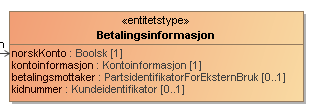
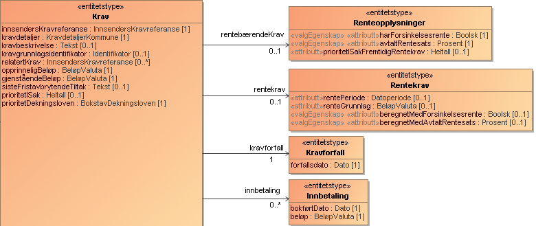

En tjeneste for å sende inn utleggstrekk fra kommune gjennom Skatteetatens systemløsninger.

<Tabs underline={true}>
<TabItem headerText="Om tjenesten" itemKey="itemKey-Om" default>
Målgruppen for tjenesten er kommunene.
Dersom du ønsker å ta i bruk ELAN og prøving i ditt system eller har spørsmål knyttet til dette, ta kontakt med fremtidensinnkreving@skatteetaten.no.

Figuren nedenfor angir overordnet tjenester Skatteetaten vil tilby for håndtering av utleggstrekk fra kommune. Merk at figuren er en illustrasjon av måbildet, og det er ikke alle tjenestene i figuren som er implementert ennå. Det vil også i fremtiden kunne legges til nye tjenester som ikke er angitt i figuren.

For generell informasjon om tjenestene se egne sider om:

* [Sikkerhetsmekansimer](../om/sikkerhet.md)
* [Systembruker](../om/systembruker.md)
* [Feilhåndtering](../om/feil.md)
* [Versjonering](../om/versjoner.md)
* [Teknisk spesifikasjon](../om/tekniskspesifikasjon.md)

### Oppfølging og støtte
I testfasen vil vi tilby støtte til de eksterne leverandørene gjennom utvikling og test.

Mer informasjon kommer her.

I mellomtiden – ta kontakt med fremtidensinnkreving@skatteetaten.no.

## Scope

Foreløbig brues følgende scope ved autentisering i Maskinporten: `skatteetaten:utleggsbegjaering`.

Ved bruk av systembruker må forespørselen også inneholde ressurs-id `ske-utleggsbegjaering` som beskrevet her for produksjon: https://docs.altinn.studio/api/authentication/systemuserapi/systemuserrequest/external/#create-a-standard-system-user-request

## Delegering

Tilgang til dette API-et kan delegeres i Altinn, f.eks. dersom leverandør benyttes for den tekniske oppkoblingen. Søk
opp følgende tjeneste i Altinn for å delegere tilgangen: `Utleggstrekkbegjæring API - På vegne av`

## Teknisk spesifikasjon

URL-er til API-et, beskrivelsen av parameterne, endepunkter og respons ligger som spesifikasjoner på SwaggerHub:
* [OpenAPI spesifikasjon for Innsending av trekk fra kommune](https://app.swaggerhub.com/apis/skatteetaten/utleggsbegjaering-kommune-api/)

## Datakatalog

Dette API-et finnes foreløpig ikke i Felles datakatalog.

## Tilgang til tjenesten

For informasjon om hvordan få tilgang til tjenesten se [Inforrmasjon om tilgang til tjenesten for utleggsbegjæring](utleggsbegjaering.md#Tilgang-til-tjenesten)

</TabItem>
<TabItem headerText="Overgangsperioden" itemKey="itemKey-Overgangsperioden">

## Innføring av ny innkrevingslov
I en overgangsperiode (fra 1.1.2026 til 31.12.2026) skal kommunene gradvis behandle nye utleggssaker mot saksøkte etter den nye innkrevingsloven og endringer i tvangsfullbyrdelsesloven. Myndighetene har derfor mulighet til å avgrense hvilke skyldnere som skal behandles etter nytt regelverk for utlegg ut fra forhåndsbestemte kriterier. Disse bestemmes konkret i forskrift.

Gjennom overgangsperioden legges det opp til en gradvis endring av parametrene slik at stadig flere skyldnere vil falle inn under kriterier for å bli behandlet etter nytt regelverk. Forskriften endres senest 14 dager før endringen trer i kraft. Parametrene er fastsatt i delegeringsvedtaket [Delegering av kongens myndighet etter innkrevingsloven § 40 andre og tredje ledd til Finansdepartementet](https://lovdata.no/dokument/DEL/forskrift/2025-06-10-968).

## Overgangsperiode for besluttede trekk fra kommune
I overgangsperioden skal kommunen forholde seg til et API fra utlegg som forteller om en skyldner har eller har hatt trekk etter nytt regelverk.
Dersom skyldner har eller har hatt trekk etter nytt regelverk skal beslutning om utleggstrekk sendes inn til ny løsning og kommunekravet vil da tre inn i det eksisterende trekket. 

Etter 1.1.2027 vil gjelder ny ordning for alle utleggstrekk som besluttes og kommunen må da sende alle beslutninger om utleggstrekk til ny løsning.

Merk at Betjeningskartet som for innsending av Utleggsbegjæringer skal benyttes for å undersøke hvorvidt skyldner er på nytt regelverk, ikke skal benyttes for beslutning av trekk fra kommune. I stedet skal tjeneste for hvorvidt skyldner har eller har hatt trekk etter nytt regelverk benyttes. 

</TabItem>
<TabItem headerText="Informasjonsmodell" itemKey="itemKey-Informasjonsmodell">

 

      
Beslutning om trekk fra kommune 1.0

     

## Forklaring til modellen
Denne veilederen har til formål å veilede både funksjonelle og tekniske ressurser til å få en overordnet forståelse av elementene og sammenhengen mellom disse i ELAN løsningen.
Hvert enkelt begrep forklares ikke her, det vil man finne i "documentation" elementet i Swagger(JSON).

Modellen består av en «rotEntitet» som gjelder overordnet informasjon på tvers av trekket.

I øvre halvdel har man informasjon om de formelle partene i trekkket, kommune, innsender og saksøkt. 

I tillegg finner man noen generelle entiteter som gjelder hele beslutningen om trekk.

Videre har man entiteten «Krav» som er kjerneinformasjon med detaljer om «pengekravet» med endringer, fra det ble etablert og frem til innsendingen av beslutningen.

I «BegjæringensTvangsgrunnlag» skal man legge inn detaljer om grunnlaget for Kravene i det besluttede trekket fra kommune.

### a) Rotnivå - Beslutning om trekk fra kommune
RotEntiteten Beslutning om trekk fra kommune inneholder kjernerneinformasjon om innsendingen, som generelle vedlegg, underskrift med navn på ansvarlig for innsendingen.

innsenderReferanse er innsenders unike referanse på saken, tilsvarende vil saksreferanse være namsmyndighetens unike identifikator for saken og som skal benyttes senere i prosessen ved kommunikasjon ved namsmyndigheten.

### b) Parter i besluttet trekk fra kommune

Saksøker er den som erklærer at noen er skyldig penger. Saksøker er i dette tilfelle en eller flere kommuner. En kommune kan også ha en innsender som kan være knyttet til en saksbehandler.

Saksøkt er den man krever penger fra. OBS! Det er påkrevd med norsk identifikator for saksøkt.

#### Datatyper:

### c) Generelle elementer

I beslutningen har vi 2 såkalte entiteter med generell informasjon som dekker hele beslutningen om trekk, dette er
* Betalingsinformasjon - Informasjon om hvor, hvordan og til hvem innbetalingen skal gjøres.
* ValgtNamsmannsdistrikt -skal kun benyttes om man ønsker trekk behandlet av annet namsmannsdistrikt, enn saksøktes alminnelige verneting. Merk at namsmannsdistrikt må være skrevet nøyaktig som i kodelisten.

### d) Kravinformasjon

Krav har ulike typer, kalt «kravdetaljer». Eksempler på kravdetaljer er "Hovedkrav" som er det opprinnelige beløpet en person er skyldig, og "Rentekrav" som omfatter renter som er påløpt etter at kravet oppstod.
Se kodeliste for alle gyldige verdier [kravdetaljerUtleggsbegjaering](https://data.skatteetaten.no/web/datakatalog/kodeliste/837f1cf5-0568-4029-b4fe-64d2f71ff2d8).
En opprinnelig faktura kan være et eksempel på et "Hovedkrav". Har man f. eks to fakturaer med ulikt forfall («kravforfall»), er dette å anse som to krav.

«InnsendersKravreferanse» har flere formål, det ene er å unikt identifisere et krav innenfor et besluttet trekk fra kommune, det andre er å kunne relatere såkalte «tilleggskrav» som for eksempel «Sakskostnader» eller «Rentekrav». På samme måte kan man relatere «Rentekrav» til «Sakskostnader». I praksis fyller man ut «relatertKrav» med opphavets «InnsendersKravreferanse».

Dersom man sender inn et «Rentekrav», bør man legge ved hvilken «rentePeriode» (fra og til dato) rentene er beregnet, samt hvilket beløp det er beregnet rente av i «renteGrunnlag».  Dette fylles ut i «rentekrav» elementet.
I tillegg bør man angi om det er "beregnetMedForsinkelsesrente" eller evntuelt med en avtalt rentesats i «beregnetMedAvtaltRentesats».

Sender man inn et krav som det kreves renter for, må man fylle ut «rentebærendeKrav».

Har det kommet innbetalinger på aktuelle krav, må disse knyttes til det enkelte kravet med beløp og dato. Dette blant annet for å kunne beregne og ettergå krevde rentekrav.

## Eksempler på testdata

Eksempelet nedenfor bruker testparter fra Tenor. De syntetiske dataene i dokumentet byttes ut med deres egne syntetiske data. Dette inkluderer opplastede vedlegg, samt valgte aktører (innsender, saksøkte, saksøkere og prosessfullmektig) fra Tenor.

[beslutning-om-trekk-fra-kommune.json](../../static/download/utleggstrekk-fra-kommune/beslutning-om-trekk-fra-kommune-v1.json) 

      
Oppslag samordnet trekk fra kommune 1.0

     

## Forklaring til modellen
Denne veilederen har til formål å veilede både funksjonelle og tekniske ressurser til å få en overordnet forståelse av elementene og sammenhengen mellom disse i ELAN løsningen.

Modellen for oppslag av samordnet trekk er en modell skal støtte at kommunene kan gjøre oppslag om en gitt part har eller har hatt trekk på nytt regelverk.
Dette for å kunne gradivis innføre flere skyldnere på nytt regelverk gjennom overgangsåret 2026.

### Oppslag av samordnet trekk request
Oppslag av samordnet trekk skjer ved å angi parten man ønsker å gjøre oppslag på

### Oppslag av samordnet trekk response
Som respons vil man få parten man gjorde oppslag på samt en boolsk verdi som er true dersom parten har eller har hatt trekk på nytt regelverk.

### Eksempler på testdata
Eksempelet nedenfor bruker testparter fra Tenor. De syntetiske dataene i dokumentet byttes ut med deres egne syntetiske data.
[oppslag-samordnet-trekk-kommune.json](../../static/download/utleggstrekk-fra-kommune/oppslag-samordnet-trekk-kommune.json)
     

## Forklaring til modellen

</TabItem>
<TabItem headerText="Test" itemKey="itemKey-Test">

Se [Testing](utleggsbegjaering.md#Testing)

</TabItem>
<TabItem headerText="Sjekkliste for leverandører" itemKey="itemKey-Sjekkliste">

## Sjekkliste for leverandører
Se [sjekkliste for inkassosystemleverandører](utleggsbegjaering.md#Sjekkliste-for-inkassosystemleverandører)

</TabItem>

</Tabs>

