
Tjenester for å kommuner som benytter seg av særnamsmyndigheten og behandler utlegg mot nytt regelverk. 
Dette består av en tjeneste for å gjøre oppslag på hvilket regelverk en skyldner skal behandles etter, samt en tjeneste for å sende inn utleggstrekk fra kommune gjennom Skatteetatens systemløsninger.

<Tabs underline={true}>
<TabItem headerText="Om tjenesten" itemKey="itemKey-Om" default>
Målgruppen for tjenesten er kommunene.
Dersom du ønsker å ta i bruk ELAN og prøving i ditt system eller har spørsmål knyttet til dette, ta kontakt med fremtidensinnkreving@skatteetaten.no.

Figuren nedenfor viser overordnet flyt for oppslag for å finne ut om en skyldner skal behandles etter nytt eller gammelt regelverk.

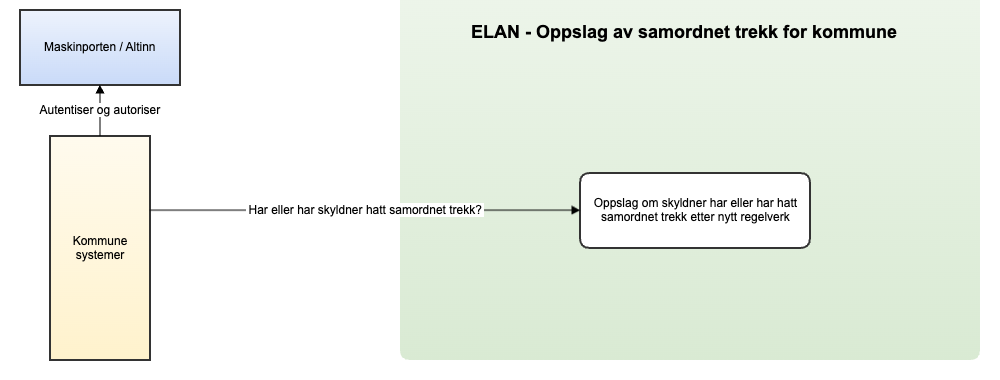

Figuren nedenfor angir overordnet tjenesten Skatteetaten vil tilby for håndtering av utleggstrekk fra kommune. Merk at figuren er en illustrasjon av måbildet, og det er ikke alle tjenestene i figuren som er implementert ennå. Det vil også i fremtiden kunne legges til nye tjenester som ikke er angitt i figuren.

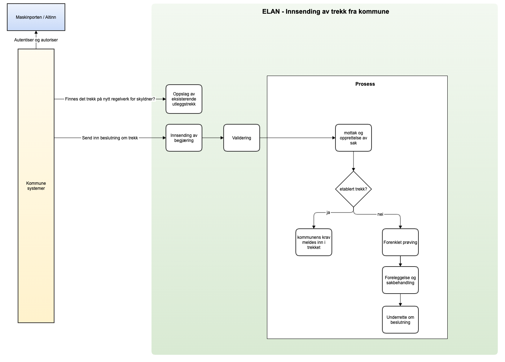

For generell informasjon om tjenestene se egne sider om:

* [Sikkerhetsmekansimer](../om/sikkerhet.md)
* [Systembruker](../om/systembruker.md)
* [Feilhåndtering](../om/feil.md)
* [Versjonering](../om/versjoner.md)
* [Teknisk spesifikasjon](../om/tekniskspesifikasjon.md)

### Oppfølging og støtte
I testfasen vil vi tilby støtte til de eksterne leverandørene gjennom utvikling og test.

Mer informasjon kommer her.

I mellomtiden – ta kontakt med fremtidensinnkreving@skatteetaten.no.

## Scope

Følgende scope brukes ved autentisering i Maskinporten: `skatteetaten:utleggstrekkbeslutningkommune`.

Ved bruk av systembruker må forespørselen også inneholde ressurs-id `TIL AVKLARING` som beskrevet her for produksjon: https://docs.altinn.studio/api/authentication/systemuserapi/systemuserrequest/external/#create-a-standard-system-user-request

## Delegering

Tilgang til dette API-et kan delegeres i Altinn, f.eks. dersom leverandør benyttes for den tekniske oppkoblingen. Søk
opp følgende tjeneste i Altinn for å delegere tilgangen: `Utleggstrekkbeslutning kommune API - På vegne av`

## Teknisk spesifikasjon

URL-er til API-et, beskrivelsen av parameterne, endepunkter og respons ligger som spesifikasjoner på SwaggerHub:
* [OpenAPI spesifikasjon for Innsending av trekk fra kommune](https://app.swaggerhub.com/apis/skatteetaten/utleggsbegjaering-kommune-api/)

## Datakatalog

Dette API-et finnes foreløpig ikke i Felles datakatalog.

## Tilgang til tjenesten

For informasjon om hvordan få tilgang til tjenesten se [Informasjon om tilgang til tjenesten for utleggsbegjæring](utleggsbegjaering.md#Tilgang-til-tjenesten)

</TabItem>
<TabItem headerText="Overgangsperioden" itemKey="itemKey-Overgangsperioden">

## Innføring av ny innkrevingslov
I en overgangsperiode (fra 1.1.2026 til 31.12.2026) skal kommunene gradvis behandle nye utleggssaker mot saksøkte etter nye regler i tvangsfullbyrdelsesloven kapittel 2 avsnitt II. Myndighetene har derfor mulighet til å avgrense hvilke skyldnere som skal behandles etter nytt regelverk for utlegg ut fra forhåndsbestemte kriterier. Disse bestemmes konkret i forskrift.

Gjennom overgangsperioden legges det opp til en gradvis endring av parametrene slik at stadig flere skyldnere vil falle inn under kriterier for å bli behandlet etter nytt regelverk. Forskriften endres senest 14 dager før endringen trer i kraft. Parametrene er fastsatt i delegeringsvedtaket [Delegering av kongens myndighet etter innkrevingsloven § 40 andre og tredje ledd til Finansdepartementet](https://lovdata.no/dokument/DEL/forskrift/2025-06-10-968).

## Når kommer det nye regelverket til anvendelse for kommunen som namsmyndighet
I overgangsperioden skal kommunen forholde seg til et API fra utlegg som forteller om en skyldner har eller har hatt trekk etter nytt regelverk.
Dersom skyldner har eller har hatt trekk etter nytt regelverk skal kommunen behandle saken etter nytt regelverk.
Dersom skyldner skal behandles etter nytt regelverk og kommunen beslutter utleggstrekk, skal kommunen sende beslutningen om utleggstrekk til alminnelig namsmann i ny løsning.
Dersom det allerede løper utleggstrekk mot skyldneren, meldes kravet umiddelbart inn i trekket. Dersom det ikke allerede løper utleggstrekk mot skyldneren, vil namsmannen forsøke å etablere utleggstrekk mot vedkommende.

Etter 1.1.2027 skal kommunen behandle alle skyldnere etter nytt regelverk

</TabItem>
<TabItem headerText="Informasjonsmodell" itemKey="itemKey-Informasjonsmodell">

 

      
Beslutning om trekk fra kommune 1.0

     

## Forklaring til modellen
Denne veilederen har til formål å veilede både funksjonelle og tekniske ressurser til å få en overordnet forståelse av elementene og sammenhengen mellom disse i ELAN løsningen.
Hvert enkelt begrep forklares ikke her, det vil man finne i "documentation" elementet i Swagger(JSON).

Modellen består av en «rotEntitet» som gjelder overordnet informasjon på tvers av trekket.

I øvre halvdel har man informasjon om de formelle partene i trekkket, kommune, innsender og saksøkt. 

I tillegg finner man noen generelle entiteter som gjelder hele beslutningen om trekk.

Videre har man entiteten «Krav» som er kjerneinformasjon med detaljer om «pengekravet» med endringer, fra det ble etablert og frem til innsendingen av beslutningen.

I «BegjæringensTvangsgrunnlag» skal man legge inn detaljer om grunnlaget for Kravene i det besluttede trekket fra kommune.

### a) Rotnivå - Beslutning om trekk fra kommune
Rot entiteten "Beslutning om trekk fra kommune" inneholder kjernerneinformasjon om innsendingen, som generelle vedlegg, underskrift med navn på ansvarlig for innsendingen.

innsenderReferanse er innsenders unike referanse på saken, tilsvarende vil saksreferanse være namsmyndighetens unike identifikator for saken og som skal benyttes senere i prosessen ved kommunikasjon ved namsmyndigheten.

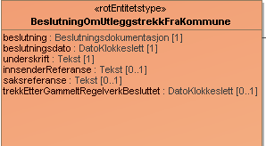

### b) Parter i besluttet trekk fra kommune

Saksøker er den som erklærer at noen er skyldig penger. Saksøker er i dette tilfelle en kommune. En kommune kan også ha en innsender som kan være knyttet til en saksbehandler.

Saksøkt er den man krever penger fra. OBS! Det er påkrevd med norsk identifikator for saksøkt.

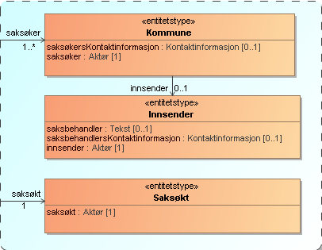

#### Datatyper:

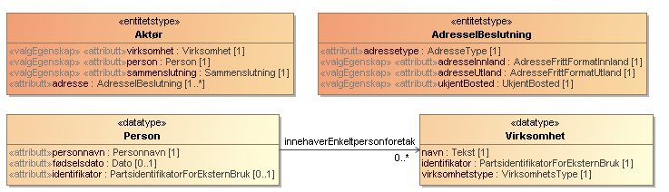
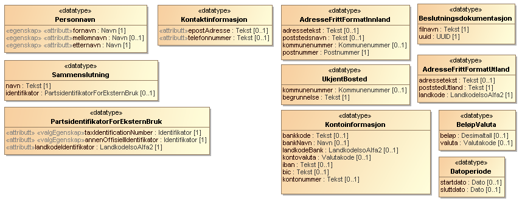
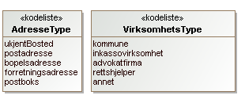

### c) Generelle elementer

I beslutningen har vi 2 såkalte entiteter med generell informasjon som dekker hele beslutningen om trekk, dette er
* Betalingsinformasjon - Informasjon om hvor, hvordan og til hvem innbetalingen skal gjøres.
* ValgtNamsmannsdistrikt -Benyttes kun dersom man ønsker å fremme beslutningen for en bestemt namsmann. Har relevans der flere namsmenn er kompetente til å etablere trekk mot skyldneren og kommunen har et bestemt ønske om hvilken namsmann de ønsker å fremsette beslutningen for. Der valgmuligheten ikke benyttes vil systemløsningen formidle saken til en alminnelig namsmann som er kompetent til å etablere utleggstrekk.

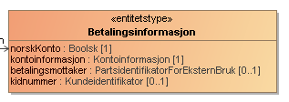
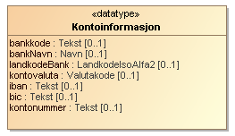
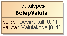

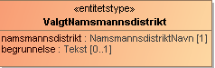
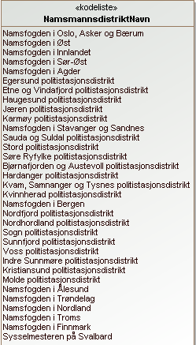

### d) Kravinformasjon

Krav har ulike typer, kalt «kravdetaljer». Eksempler på kravdetaljer er "Hovedkrav" som er det opprinnelige beløpet en person er skyldig, og "Rentekrav" som omfatter renter som er påløpt etter at kravet oppstod.
En opprinnelig faktura kan være et eksempel på et "Hovedkrav". Har man f. eks to fakturaer med ulikt forfall («kravforfall»), er dette å anse som to krav.

«InnsendersKravreferanse» har flere formål, det ene er å unikt identifisere et krav innenfor et besluttet trekk fra kommune, det andre er å kunne relatere såkalte «tilleggskrav» som for eksempel «Sakskostnader» eller «Rentekrav». På samme måte kan man relatere «Rentekrav» til «Sakskostnader». I praksis fyller man ut «relatertKrav» med opphavets «InnsendersKravreferanse».

Dersom man sender inn et «Rentekrav», bør man legge ved hvilken «rentePeriode» (fra og til dato) rentene er beregnet, samt hvilket beløp det er beregnet rente av i «renteGrunnlag».  Dette fylles ut i «rentekrav» elementet.
I tillegg bør man angi om det er "beregnetMedForsinkelsesrente" eller evntuelt med en avtalt rentesats i «beregnetMedAvtaltRentesats».

Sender man inn et krav som det kreves renter for, må man fylle ut «rentebærendeKrav».

Har det kommet innbetalinger på aktuelle krav, må disse knyttes til det enkelte kravet med beløp og dato. Dette blant annet for å kunne beregne og ettergå krevde rentekrav.

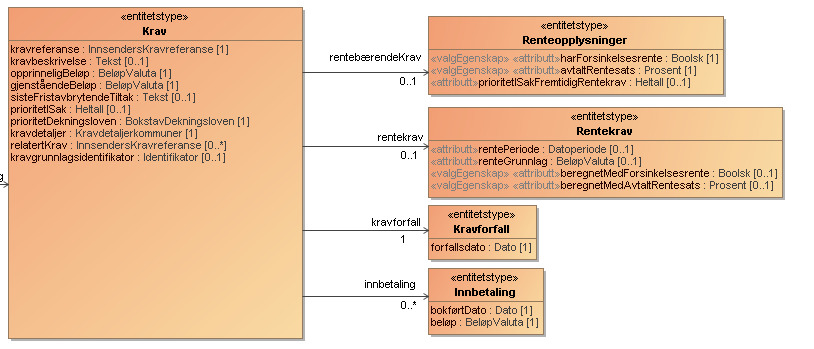
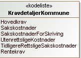

## Eksempler på testdata

Eksempelet nedenfor bruker testparter fra Tenor. De syntetiske dataene i dokumentet byttes ut med deres egne syntetiske data. Dette inkluderer opplastede vedlegg, samt valgte aktører (innsender, saksøkte, saksøkere og prosessfullmektig) fra Tenor.

[beslutning-om-trekk-fra-kommune.json](../../static/download/utleggstrekk-fra-kommune/beslutning-om-trekk-fra-kommune-v1.json) 

      
Beslutning om trekk fra kommune 2.0

     

## Forklaring til modellen
Formålet med denne brukerveiledningen er å gi både funksjonelle og tekniske ressurser en overordnet forståelse av innholdet i den beslutningen som skal sendes inn til Skatteetaten.

Modellen består av en rotEntitet, **BeslutningOmUtleggstrekkFraKommune** som inneholder overordnet informasjon om beslutningen fra kommune.
De formelle partene i beslutningen er beskrevet under **Kommune**, **Skyldner** og **Prosessfullmektig**.
Generell informasjon som gjelder alle kravene i beslutningen er beskrevet under **Betalingsinformasjon** og **ValgtNammsmannsdistrikt**.
Hvert av kravene som meldes inn til innkreving er beskrevet under **Krav**.
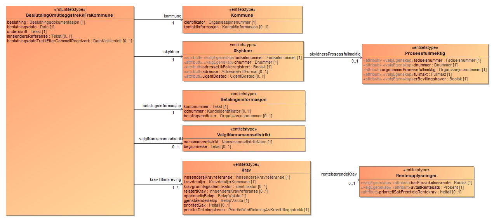

### a) Rotnivå - Beslutning om trekk fra kommune
#### Inneholder kjerneinformasjon om innsendingen.
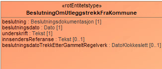
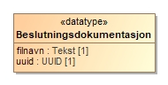
* **beslutning** består av et vedlegg med underlag for beslutningen.
* **beslutningsdato** er dato for beslutning hos kommunen.
* **underskrift** er navn på ansvarlig for innsendingen og er påkrevd å sende.
* **innsendersReferanse** er innsenders unike referanse på saken og er valgfritt å sende inn.
* **beslutningsdatoTrekkEtterGammeltRegelverk** inneholder dato for når et eventuelt trekk etter gammelt regelverk ble besluttet på et tidligere tidspunkt. Dette for å sikre riktig prioritet på det nye kravet.

### b) Parter i Beslutning om trekk fra kommune
#### Informasjon om partene i beslutningen
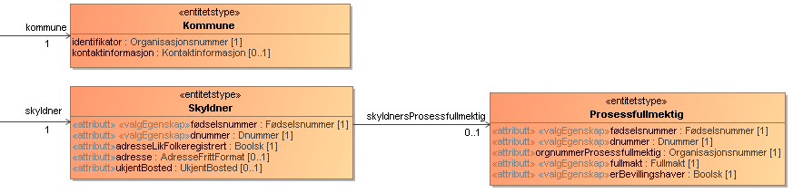
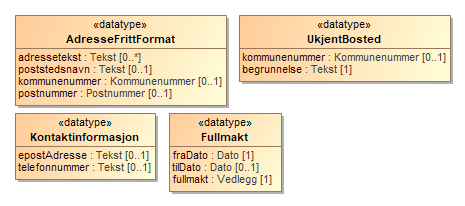

* **kommune** må identifiseres med organisasjonsnummer og kan ha med kontaktinformasjon til kontaktperson hos kommunen.
* **skyldner** må identifiseres med fødselsnummer eller d-nummer.
* **adresseLikFolkeregistrert** skal settes til true dersom skyldners adresse er lik den som er registrert i Folkeregisteret. Alternativt skal adresse eller ukjentBosted angis.
* Skyldner kan ha en **prosessfullmektig** som må identifiseres med fødselsnummer eller d-nummer. I tillegg skal selskapet som prosessfullmektig er ansatt i angis i identifiseres i **orgnummerProsessfullmektig**.
* Prosessfullmektig må ha en **fullmakt** eller være **bevillingshaver** (satt til true).

### c) Generelle elementer i Beslutning om trekk fra kommune
#### Generell informasjon som dekker hele beslutningen
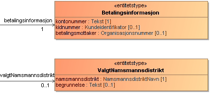

* **betalingsinformasjon** inneholder betalingsinformasjon til mottaker (kommunen).
* **valgtNamsmannsdistrikt** skal kun benyttes om man ønsker at saken skal behandles av annet namsmannsdistrikt enn det skyldner normalt er hjemmehørende i.
Merk at namsmannsdistrikt må være skrevet nøyaktig som kodenavnet i [Kodelisten for Namsmannsdistrikt](https://data.skatteetaten.no/web/datakatalog/kodeliste/6549b54b-809f-4d6a-b944-d607e90731b6/0.5/?size=25).

### d) Kravinformasjon i Beslutning om trekk fra kommune
#### Informasjon om hvert enkelt krav i beslutningen
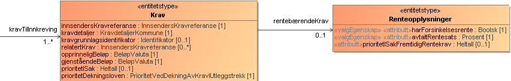

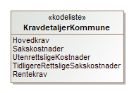

* **innsendersKravreferanse** skal unikt identifisere et krav innenfor en beslutning.
* **kravdetaljer** angir hvilken type krav det er. Eksempler på kravdetaljer er "Hovedkrav" som er det opprinnelige beløpet en person er skyldig og "Sakskostnader".
* **kravgrunnlagsidentifikator** er identifikator for kravet i Siro og skal brukes som referanse dersom kravet er meldt inn tidligere.
* **relatertKrav** skal brukes for å knytte renter eller andre omkostninger (tilleggskrav) til det hovedkravet det direkte tilhører.
* **opprinneligBeløp** er pengekravets opprinnelige beløp når kravet oppstod.
* **gjenståendeBeløp** er det beløpet som gjenstår når beslutningen sendes inn = opprinnelig beløp minus innbetalinger og nedjusteringer etter at kravet oppstod.
* **prioritetISak** angir prioritet for kravet innad i beslutningen. Benyttes ved fordeling av innbetaling i utleggstrekk, Verdier 1-99.
* **prioritetDekningsloven** angir hvilken prioritet kravet har etter bokstavene i dekningsloven § 2-8 (a til e).
* **rentebærendeKrav** må fylles ut dersom man sender inn et krav som det kreves renter for, f.eks. et hovedkrav.

## Eksempler på testdata

Eksempelet nedenfor bruker testparter fra Tenor. De syntetiske dataene i dokumentet byttes ut med deres egne syntetiske data. Dette inkluderer opplastede vedlegg, samt valgte aktører fra Tenor.

[beslutning-om-trekk-fra-kommune.json](../../static/download/utleggstrekk-fra-kommune/beslutning-om-trekk-fra-kommune-v2.json)

      
Oppslag samordnet trekk fra kommune 1.0

     

## Forklaring til modellen
Denne veilederen har til formål å veilede både funksjonelle og tekniske ressurser til å få en overordnet forståelse av elementene og sammenhengen mellom disse i ELAN løsningen.

Modellen for oppslag av samordnet trekk er en modell skal støtte at kommunene kan gjøre oppslag om en gitt part har eller har hatt trekk på nytt regelverk.
Dette for å kunne gradivis innføre flere skyldnere på nytt regelverk gjennom overgangsåret 2026.

### Oppslag av samordnet trekk request
Oppslag av samordnet trekk skjer ved å angi parten man ønsker å gjøre oppslag på

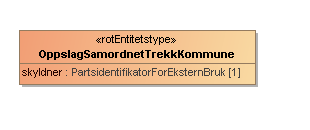
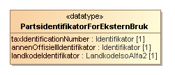

### Oppslag av samordnet trekk response
Som respons vil man få parten man gjorde oppslag på samt en boolsk verdi som er true dersom parten har eller har hatt trekk på nytt regelverk.

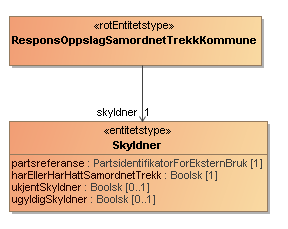
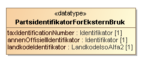

### Eksempler på testdata
Eksempelet nedenfor bruker testparter fra Tenor. De syntetiske dataene i dokumentet byttes ut med deres egne syntetiske data.

[oppslag-samordnet-trekk-kommune.json](../../static/download/utleggstrekk-fra-kommune/oppslag-samordnet-trekk-kommune.json)
     

</TabItem>
<TabItem headerText="Test" itemKey="itemKey-Test">

Se [Testing](utleggsbegjaering.md#Testing)

</TabItem>
<TabItem headerText="Sjekkliste for leverandører" itemKey="itemKey-Sjekkliste">

## Sjekkliste for leverandører
Se [sjekkliste for inkassosystemleverandører](utleggsbegjaering.md#Sjekkliste-for-inkassosystemleverandører)

</TabItem>

</Tabs>

