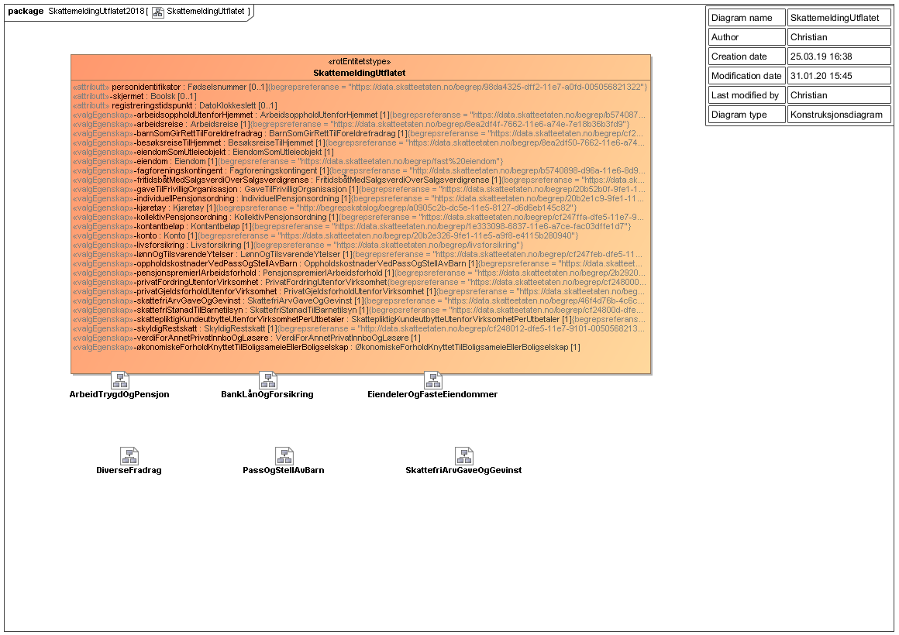
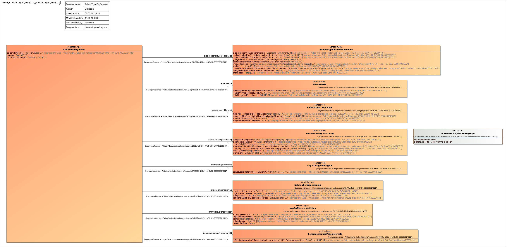
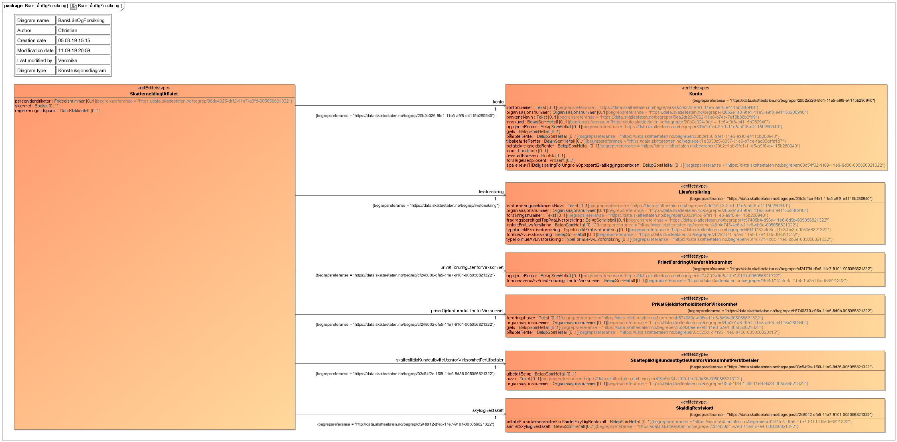
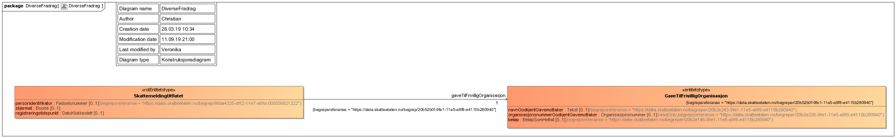
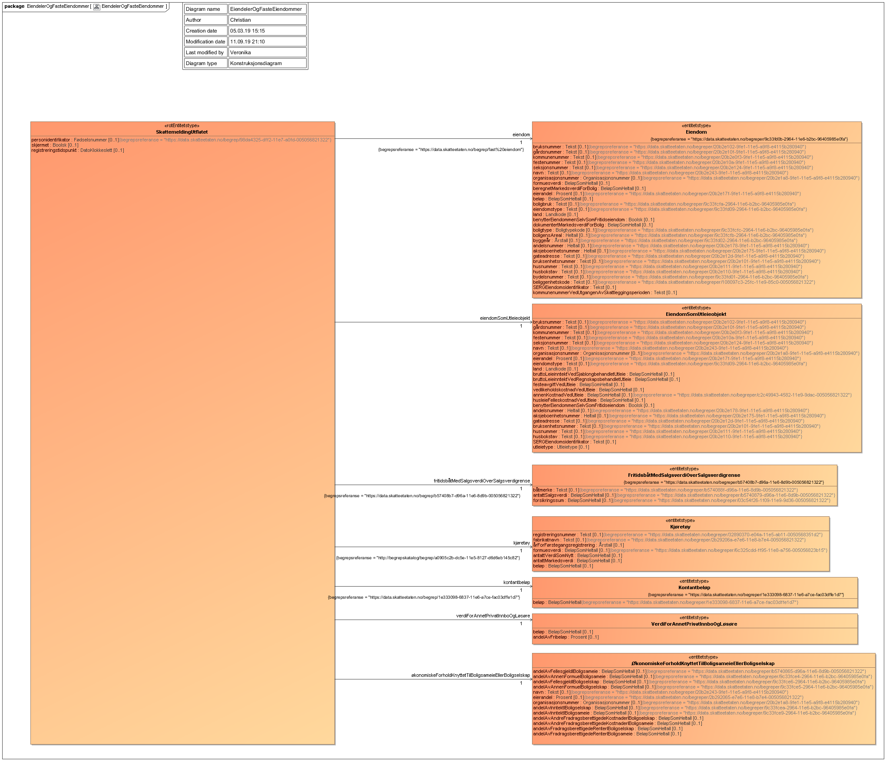
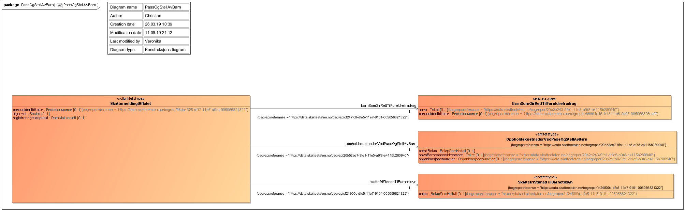
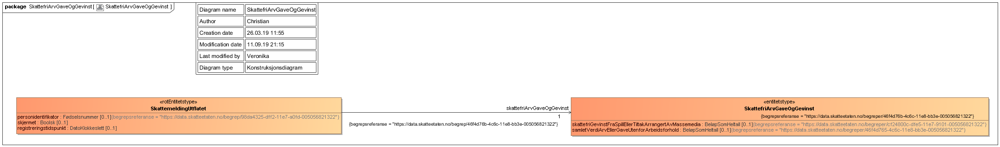

Informasjonsmodell for skattemelding for 2018.

# Informasjonsmodell for skattemelding 2018 

Oversikt over datamodellen som returneres fra Skattemelding API for inntektsår 2018.

Skattemeldingstjenesten returner skatteobjekt knyttet til utkast til skattemelding eller til fastsatt skattemelding.  

## Entiteter som returnes fra tjenesten

### Skattemelding utflatet
Dette er toppnivået til tjenesten, og inneholder informasjon om hvem det er søkt på, om informasjonen er skjermet, samt en liste med 
skatteobjekter.  De forskjellige typene skatteobjekt kan komme flere ganger, og i vilkårlig rekkefølge.  

| Navn på felt | Muliplisitet | Type | Begrep/Definisjon | Begrepsreferanse  |
| -------------|------|---------|-------------------|-------------------|
|personidentifikator | 1 |Fødselsnummer | identifikator for personlig skattesubjekt: fødselsnummer eller d-nummer | <https://data.skatteetaten.no/begrep/98da4325-dff2-11e7-a0fd-005056821322>|
|skjermet | 0..1 | Boolsk | Returnerer true dersom datasettet har blitt skjermet | |
|arbeidsoppholdUtenforHjemmet | 0..M | ArbeidsoppholdUtenforHjemmet | arbeidsopphold utenfor hjemmet: tidsrom en fysisk person har overnattet ett annet sted enn hjemme på grunn av arbeid | <https://data.skatteetaten.no/begrep/b574087c-d96a-11e6-8d9b-005056821322 >|
|arbeidsreise | 0..M | Arbeidsreise | arbeidsreise: reise mellom hjem og fast arbeidssted eller mellom to faste arbeidssteder.|<https://data.skatteetaten.no/begrep/8ea2df4f-7662-11e6-a74e-7e18b36b3fd9 >|
|barnSomGirRettTilForeldrefradrag |  0..M | BarnSomGirRettTilForeldrefradrag | barn som gir rett til foreldrefradrag: barn som når skattleggingsperioden slutter er under 12 år eller er barn som er 12 år eller eldre med særskilt behov for pleie og omsorg, under forutsetning av at barnet helt eller delvis bor hos den skattepliktige og den skattepliktige har omsorgsansvar for barnet |<https://data.skatteetaten.no/begrep/cf247fc0-dfe5-11e7-9101-005056821322>|
|besøksreiseTilHjemmet | 0..M |BesøksreiseTilHjemmet|besøksreise til hjemmet: reise mellom hjem og sted for pendleropphold|<https://data.skatteetaten.no/begrep/8ea2df50-7662-11e6-a74e-7e18b36b3fd9>|
|eiendomSomUtleieobjekt| 0..M |EiendomSomUtleieobjekt|||
|eiendom| 0..M |Eiendom|fast eiendom: grunn samt eventuell bebyggelse som finnes på denne. |<https://data.skatteetaten.no/begrep/fast%20eiendom>|
|fagforeningskontingent| 0..M |Fagforeningskontingent||<http://data.skatteetaten.no/begrep/b5740898-d96a-11e6-8d9b-005056821322>|
|fritidsbåtMedSalgsverdiOverSalgsverdigrense| 0..M |FritidsbåtMedSalgsverdiOverSalgsverdigrense|fritidsbåt med salgsverdi over salgsverdigrense: fritidsbåt med en antatt salgsverdi medregnet motor og fast utstyr som overstiger en forskriftsbestemt salgsverdigrense ved utgangen av et inntektsår|<https://data.skatteetaten.no/begrep/b57408b7-d96a-11e6-8d9b-005056821322>|
|gaveTilFrivilligOrganisasjon| 0..M |GaveTilFrivilligOrganisasjon|gave til frivillig organisasjon: summen av pengegaver som en gitt skattepliktig har ytt i en gitt skattleggingsperiode til en gitt godkjent gavemottaker|<https://data.skatteetaten.no/begrep/20b52b0f-9fe1-11e5-a9f8-e4115b280940>|
|individuellPensjonsordning|0..M|IndividuellPensjonsordning|: avtale inngått individuelt mellom kunde som har fylt 18 år og pensjonsinnretning om pensjonssparing basert på lovmessige krav som gir kunden rett til inntektsfradrag innenfor lovbestemt maksimalgrense for premie, innskudd og vederlag for forvaltning og administrasjon av avtalen|<https://data.skatteetaten.no/begrep/20b2e1c9-9fe1-11e5-a9f8-e4115b280940>|
|kjøretøy|0..M|Kjøretøy|kjøretøy: innretning som er bestemt til å kjøre på bakken uten skinner||
|kollektivPensjonsordning|0..M|KollektivPensjonsordning|pensjonsinntekt i arbeidsforhold: pensjonsinntekt i skattleggingsperioden for en gitt skattepliktig i form av alderspensjon som enten en bestemt arbeidsgiver løpende utbetaler over driften, utbetales helt eller delvis som obligatorisk tjenestepensjon eller avtalefestet pensjon|<https://data.skatteetaten.no/begrep/cf247ffa-dfe5-11e7-9101-005056821322>|
|kontantbeløp|0..M|Kontantbeløp|kontantbeløp: pålydende verdi av pengebeholdning|<https://data.skatteetaten.no/begrep/1e333098-6837-11e6-a7ce-fac03dffe1d7>|
|konto|0..M|Konto|konto: Inneholder kontoer av forskjellig art. Dette er å anse som en pengemessig adresse og kan brukes til identifisering.|<https://data.skatteetaten.no/begrep/20b2e326-9fe1-11e5-a9f8-e4115b280940>|
|livsforsikring|0..M|Livsforsikring|livsforsikring: forsikringsordning hvor selskapets forpliktelser er knyttet til den forsikredes liv eller helse|<https://data.skatteetaten.no/begrep/livsforsikring>|
|lønnOgTilsvarendeYtelser|0..M|LønnOgTilsvarendeYtelser|lønn og tilsvarende ytelse: vederlag for arbeid, overskudd av utgiftsgodgjørelse som knytter seg til arbeid og erstatning for slike inntekter|<https://data.skatteetaten.no/begrep/cf247feb-dfe5-11e7-9101-005056821322>|
|oppholdskostnaderVedPassOgStellAvBarn|0..M|OppholdskostnaderVedPassOgStellAvBarn|oppholdskostnader ved pass og stell av barn: summen for en bestemt skattleggingsperiode av en gitt skattepliktigs utgifter til tilsyn i barnets hjem, i barnepassers hjem, barnehage, i skolefritidsordning på barneskole, institusjon mv., for barn som gir rett til foreldrefradrag.|<https://data.skatteetaten.no/begrep/20b52ae7-9fe1-11e5-a9f8-e4115b280940>|
|pensjonspremierIArbeidsforhold|0..M|PensjonspremierIArbeidsforhold|pensjonspremier i arbeidsforhold: beløpsmessig summering av premier til godkjente pensjonsordninger i arbeidsforhold som en gitt skattepliktig har betalt i løpet av en gitt skattleggingsperiode|<https://data.skatteetaten.no/begrep/2b2920ad-e7e6-11e8-b7e4-005056821322>|
|privatFordringUtenforVirksomhet|0..M|PrivatFordringUtenforVirksomhet|private fordringer utenfor virksomhet: samlebegrep for en bestemt skattepliktig sine private fordringer utenfor virksomhet|<https://data.skatteetaten.no/begrep/cf248000-dfe5-11e7-9101-005056821322>|
|privatGjeldsforholdUtenforVirksomhet|0..M|PrivatGjeldsforholdUtenforVirksomhet|private lån: samlebegrep for private gjeldsforfold og utestående fordringer som en skattepliktig har|<https://data.skatteetaten.no/begrep/cf248002-dfe5-11e7-9101-005056821322>|
|skattefriArvGaveOgGevinst|0..M|SkattefriArvGaveOgGevinst|skattefri arv, gave og gevinst: tema i skattemeldingen for formues- og inntektsskatt som gjelder arv eller gaver utenfor arbeidsforhold, gevinster fra spill eller tiltak arrangert av massemedia, og andre skattefrie inntekter som ikke kan knyttes til andre temaer i skattemeldingen for formues- og inntektsskatt|<https://data.skatteetaten.no/begrep/46f4d76b-4c6c-11e8-bb3e-005056821322>|
|skattefriStønadTilBarnetilsyn|0..M|SkattefriStønadTilBarnetilsyn|skattefri stønad til barnetilsyn: skattefri stønad i skattleggingsperioden fra offentlig myndighet eller annen utbetaler, til en gitt enslig forelder som betaler for tilsyn av barn mens forelderen selv arbeider eller etablerer egen virksomhet|<https://data.skatteetaten.no/begrep/cf24800d-dfe5-11e7-9101-005056821322>|
|skattepliktigKundeutbytteUtenforVirksomhetPerUtbetaler|0..M|SkattepliktigKundeutbytteUtenforVirksomhetPerUtbetaler|skattepliktig kundeutbytte utenfor virksomhet per utbetaler: summen av skattepliktig kundeutbytte utenfor virksomhet som en gitt fysisk person eller organisasjon har mottatt i en gitt skatleggingsperiode fra en gitt utbetaler av skattepliktig kundeutbytte utenfor virksomhet |<https://data.skatteetaten.no/begrep/03c54f2e-1f09-11e9-9d36-005056821322>|
|skyldigRestskatt|0..M|SkyldigRestskatt||<http://data.skatteetaten.no/begrep/cf248012-dfe5-11e7-9101-005056821322>|
|verdiForAnnetPrivatInnboOgLøsøre|0..M|VerdiForAnnetPrivatInnboOgLøsøre|||
|økonomiskeForholdKnyttetTilBoligsameieEllerBoligselskap|0..M|ØkonomiskeForholdKnyttetTilBoligsameieEllerBoligselskap|||

## Informasjonsmodell -skjema

### Toppnivå

### Arbeid, trygd og pensjon

### Bank, lån og forsikring 

### Diverse fradag 

### Eiendeler og faste eiendommer 

### Pass og stell av barn 

### Skattefri arv, gave og gevinst 

