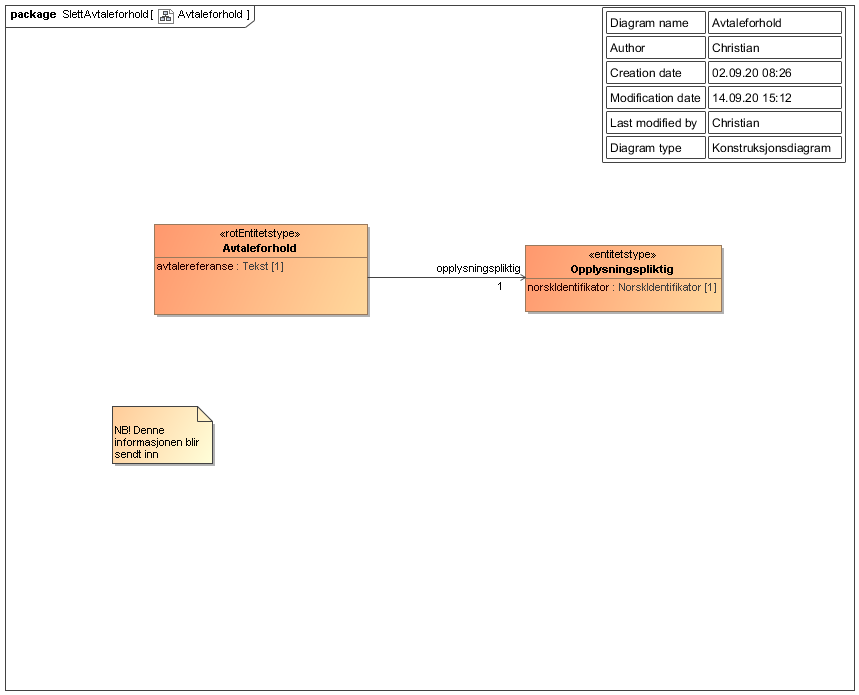

Informasjonsmodell for å slette avtaleforhold tilknyttet tjenestepensjonsavtale.

Oversikt over verdier som sendes inn gjennom endepunktet slette avtaleforhold i [Tjenestepensjonsavtale API](../../api/tjenestepensjonsavtale.md).

# Om Rettighetspakker

Rettighetspakker benyttes til å styre hvem som har lov til å slette denne informasjonen, se [Rettighetspakker](../../om/rettighetspakker.md).

Rettighetspakker som kan benyttes ved sletting:

| Rettighetspakke | Beskrivelse |
|--------|--------|
| otp | Obligatorisk tjenestepensjon |

# Avtaleforhold

| Felt | Beskrivelse |
| ---- | -------------------------------------------------------- |
| avtalereferanse | Pensjonsinnretningens egen referanse til avtalen |
| opplysningspliktig | Den opplysningspliktige som avtaleforholdet er med  |

## Opplysingsingspliktig

| Felt | Beskrivelse |
| ---- | ------------------------------------------------------ |
| norskIdentifikator | Opplysningspliktiges organisasjonsnummer |

