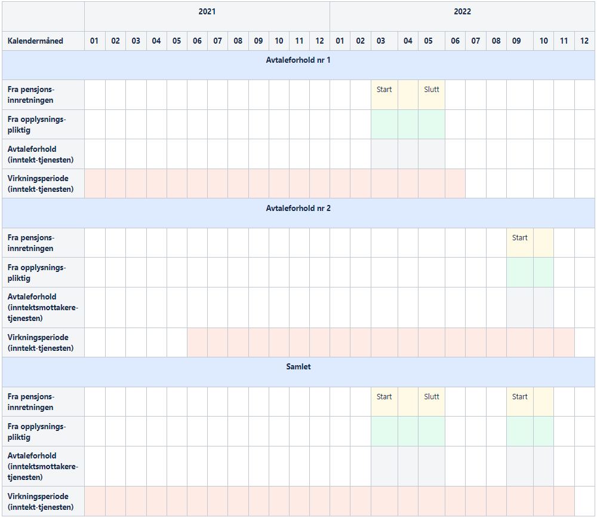
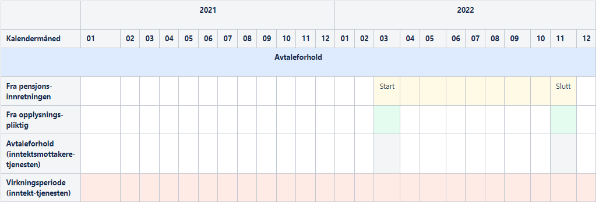
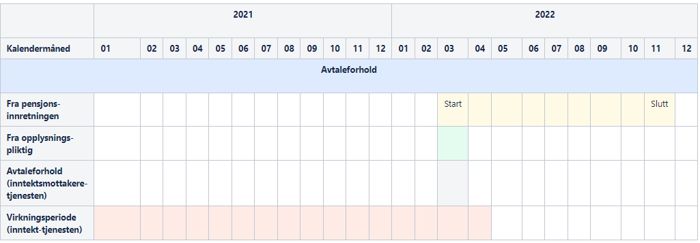
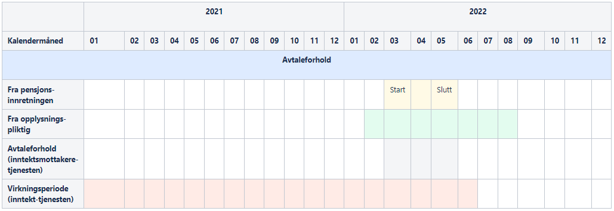

Forutsetninger for deling av liste med inntektsmottakere og opplysninger om inntekt i OTP-sammenheng.

## Forutsetninger for utlevering

Opplysningspliktig må ha rapportert at de har avtale med pensjonsinnretningen.

Pensjonsinnretningen må ha rapportert om avtalen med opplysningspliktig, inkludert dato for avtaleinngåelse.

### Tidspunkt det tillates henting

Pensjonsinnretningen kan aldri hente opplysninger før opplysningspliktig og pensjonsinnretningen har rapportert om avtaleforholdet.

Pensjonsinnretningen kan hente opplysninger på hvilket som helst tidspunkt etter at avtalen har opphørt, så lenge hentingen følger reglene for kalendermånedene som tillates hentet.

### Om avtaleforhold

Avtaleforholdet omfatter kalendermåneder der både opplysningspliktig og pensjonsinnretningen har rapportert at de har en avtale.

Tidligste kalendermåned i et avtaleforhold er 01-2021.

### Om virkningsperiode

Virkningsperioden for et gjensidig avtaleforhold omfatter kalendermåneder der både opplysningspliktig og pensjonsinnretningen har rapportert at de har en avtale, og 15 måneder før og 1 måned etter hver kalendermåned.

Tidligste kalendermåned i en virkningsperiode er 01-2020.

I tjenesten inntektsmottakere må perioden det spørres på være innenfor avtaleforholdet.

## Eksempler

**Eksempel når det finnes mer enn ett avtaleforhold**

Når det finnes mer enn ett avtaleforhold mellom pensjonsinnretning og opplysningspliktig, skal det sjekkes for alle avtaleforholdene når det avgjøres om pensjonsinnretningen tillates å hente opplysninger for en gitt kalendermåned. Hvis det på bakgrunn av en av avtaleforholdene gis tilgang til kalendermåneden (ut i fra virkningsperioden), skal pensjonsinnretningen tillates å hente for den kalendermåneden. Det presiseres at pensjonsinnretningen har et selvstendig ansvar for å kun hente for de kalendermånedene som avtalen virker innenfor, der den ytre grensen er virkningsperioden vi beregner.

Avtaleforhold nr 2 illustrerer også at avtalen behandles som aktiv når det ikke er rapportert sluttdato for avtalen fra pensjonsinnretningen.

**Eksempel når pensjonsinnretningen rapporterer start og slutt, opplysningspliktig rapporterer med "hull"**

Her illustreres en situasjon der opplysningspliktig har introdusert en pensjonsinnretning, for deretter å opphøre rapporteringen i inntil 15 måneder for så å gjeninnføre rapporteringen. Pensjonsinnretningen kan da hente tilbake i tid inntil 15 måneder forut for "gjeninnføringen". I praksis vil pensjonsinnretningen sannsynligvis lenge før den tid ha sørget for at opplysningspliktig oppgir pensjonsinnretning i a-meldingen. 

**Eksempel når pensjonsinnretningen rapporterer start og slutt, opplysningspliktig stopper rapporteringen**

For hver kalendermåned som pensjonsinnretningen rapporterer, gis det tilgang til 15 måneder før og 1 måned etter, gitt samsvar i rapporteringen fra pensjonsinnretningen.

**Eksempel når pensjonsinnretningen rapporterer start og slutt, opplysningspliktig starter rapporteringen tidligere og slutter rapporteringen senere**

Her er det pensjonsinnretningens rapportering av start som er styrende for henting 15 måneder før, da dette er den seneste av månedene for start. Det er videre pensjonsinnretningens rapportering av slutt som er styrende for henting 1 måned etter, da dette er den tidligste måneden for slutt.

