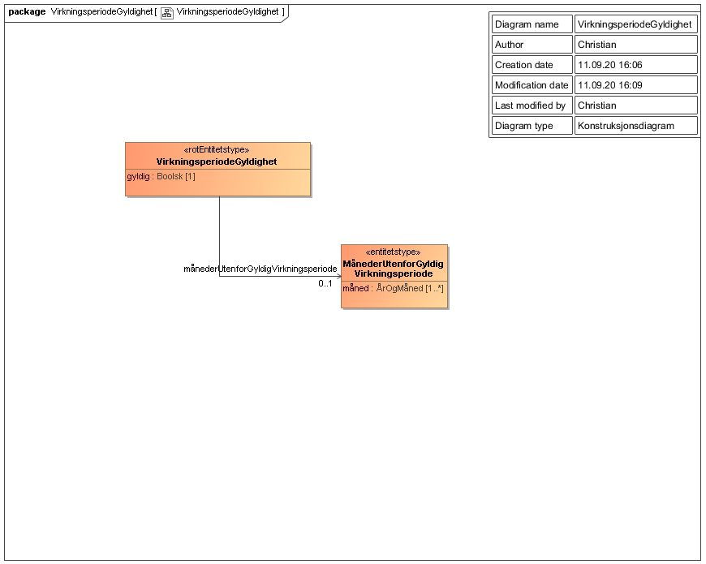

Informasjonsmodell for virkningsperiodens gyldighet for tjenestepensjonsavtale.

Oversikt over verdier som returneres i data fra endepunktet virkningsperiode/gyldighet i [Tjenestepensjonsavtale API](../../tjenester/tjenestepensjonsavtale.md).

# Om Rettighetspakker

Rettighetspakker benyttes til å styre hvem som har tilgang til denne informasjonen, se [Rettighetspakker](../../om/rettighetspakker.md).

Rettighetspakker som kan benyttes:

| Rettighetspakke | Beskrivelse |
|--------|--------|
| NAV | NAV |

# VirkningsperiodeGyldighet

| Navn på felt | Beskrivelse |
| -------------- | ---------------------------------------------- |
|  gyldig | Boolsk felt som er sann/true dersom det finnes en eller flere avtaleforhold med gyldig virkningsperiode for hele perioden det blir spurt om. Se [Forutsetning for bruk](./forutsetningerforbruk.md) for ytterligere informasjon om virkningsperiode.  |
| måndederUtenforGyldigVirkningsperiode | Liste med måneder som ikke har avtale med gyldig virkningsperiode.  Fylles kun ut når "gyldig" er usann/false |

## MånederUtenforGyldigVirkningsperiode

| Navn på felt | Beskrivelse |
| -------------- | ----------------------------------------------|
| måned        | Måned som er utenfor gyldig virkningsperiode for avtaler | 

