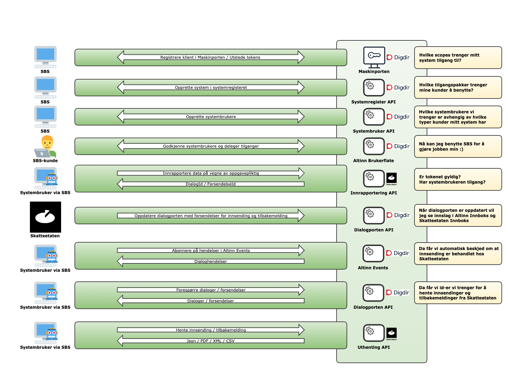

 Bruk av re-etablerte tjenester for innrapportering mot Skatteetaten.

I forbindelse med utfasing av Altinn 2 vil alle tjenester re-etableres hos Skatteetaten.
Overgangen medfører at konsumenter av Skatteetatens tjenester må forholde seg til flere nye systemer og opprette nye
integrasjoner.
Maskinporten med systembruker blir innført som standard løsning for autentisering og autorisering.

Figuren under viser hvilke systemer som er involvert i re-etablert løsning, og hvilke integrasjoner som oppnår hva i en
standard prosess.

## Forenklet forklaring av stegene

1. SBS må onboardes Maskinporten, og skaffe seg tilgang til alle scopes man trenger for å benytte tjenester hos
   Skatteetaten og Digdir. Hvilke scopes man trenger, varierer etter hvilke tjenester man ønsker å benytte. I
   Maskinporten benyttes reellt organisasjonsnummer for oppkoblingen, både i test og produksjon.
2. SBS må registreres i systemregisteret til Digdir. Her må man også sette opp alle tilgangspakker og/eller
   enkelttjenester systembrukerne tilknyttet systemet skal kunne benytte. Systemet i systemregisteret kobles til
   Maskinporten-klienten man opprettet i steg 1. Systemet kobles også til reellt organisasjonsnummer både i test og
   produksjon.
3. SBS må opprette systembrukere for sine kunder. Forskjellige systemer vil ha forskjellige behov for systembrukere
   avhengig av hvilke kunder de har. Systembrukere knyttes også til tilgangspakker og/eller enkelttjenester. Disse
   tilgangspakkene og/eller enkelttjenestene må være et sub-sett av tilgangspakkene og/eller enkelttjenestene som er
   satt opp for systemet i steg 2. Vi anbefaler å starte [her](https://samarbeid.digdir.no/altinn/systembruker/2542) for
   å forstå hva en systembruker er. I test kreves det at systembrukere opprettes for syntetiske organisasjoner funnet
   i [Tenor testdatasøk](https://www.skatteetaten.no/testdata/).
4. SBS-kundene må godkjenne at SBS kan operere på vegne av dem, ved å godkjenne opprettelse av systembruker i Altinn
   brukerflate. Her må person med klientadministrator eller hovedadministrator rolle/tilgangspakke på vegne av
   organisasjonen logge inn i Altinn og godkjenne. Ved bruk av systembruker for klientforhold, må SBS-kunde også sørge
   for at systembrukeren har de rette tilgangene til å operere på vegne av deres klienter.
5. SBS oppretter integrasjon mot Skatteetatens tjeneste (se mer info under dokumentasjon for hvert spesifikke API) og
   kaller denne med et token fra Maskinporten med systembruker.
   Skatteetaten vil autentisere kallet mot Maskinporten og autorisere mot Altinn Autorisasjon at systembrukeren har
   tilgang til å operere på vegne av den dataen omhandler for gitt tjenesteressurs.
6. Skatteetaten oppretter nødvendige dialoger i Dialogporten, med tilknyttede forsendelser. Hvilke dialoger og
   forsendelser som opprettes kan variere fra tjeneste til tjeneste, men ofte opprettes det dialoger både for den
   organisasjonen dataen omhandler og også for organisasjonen tilknyttet systembrukeren. Det opprettes som regel en
   forsendelse for innrapporteringen og en annen forsendelse for tilbakemeldingen fra Skatteetaten.
7. Gjennom integrasjon med Altinn Events kan man abonnere på hendelser som skjer i Dialogporten på vegne av en
   organisasjon. På denne måten vil SBS kunne få beskjed når for eksempel en tilbakemelding har kommet på en gitt
   innrapportering.
8. Gjennom integrasjon med Dialogporten kan SBS se status på innrapporteringer, og hente ut identifikatorer på
   forsendendelser og dokumenter. Denne integrasjonen krever også token fra Maskinporten med systembruker.
9. De fleste tjenester har API for å hente ut dokumenter tilknyttet forsendelser, for eksempel innsendinger og
   tilbakemeldinger. Disse API-ene krever som regel identifikatorer for forsendelse og dokument som du får fra
   Dialogporten i steg 8.  

