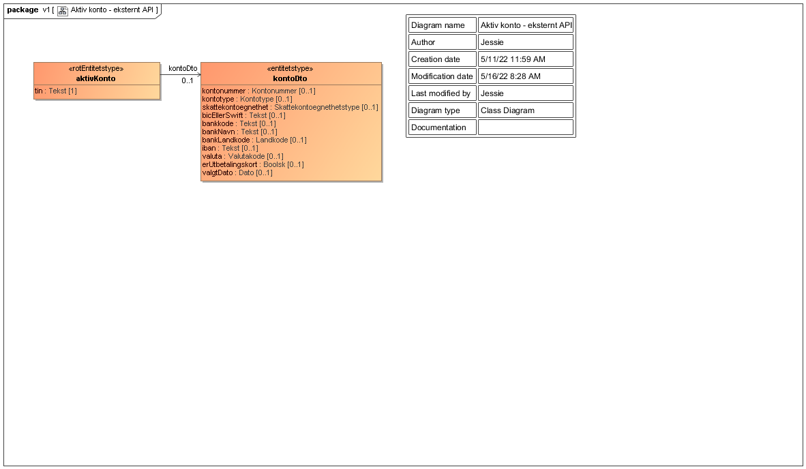

<summary>Tjenesten leverer informasjon om valgt konto for utbetalinger fra det offentlige for en person eller virksomhet.</summary>

<Tabs underline={true}>
<TabItem headerText="Om tjenesten" itemKey="itemKey-1" default>

For generell informasjon om tjenestene se egne sider om:
* [Bruk av tjenestene](../om/bruk.md)
* [Sikkerhetsmekansimer](../om/sikkerhet.md)
* [Rettighetspakker](../om/rettighetspakker.md) 
* [Feilhåndtering](../om/feil.md)
* [Versjonering](../om/versjoner.md)

## Scope
Følgende scope skal benyttes ved autentisering i Maskinporten: `skatteetaten:aktivkonto`

## Delegering
Tilgang til denne tjenesten kan delegeres i Altinn, f.eks. dersom leverandør benyttes for den tekniske oppkoblingen. Søk opp følgende tjeneste i Altinn for å delegere tilgangen: `Aktiv konto API - På vegne av`

## Teknisk spesifikasjon
  
URL har følgede oppbygging:

```bash
POST https://<env>/api/aktivkonto/ekstern/<versjon>/tin
```
Versjoner
- `<v1>`: Støtter virksomhetssertifikat
- `<v2>`: Støtter Maskinporten
- `<v3>`: Støtter Maskinporten og returnerer feilresponser som følger datasamarbeids feilkode-standard

Tjenesten krever innsending av JSON-objekt med følgende format:
```bash
{ "tin": "<personidentifikator>" }
```

</TabItem>

<TabItem headerText="Eksempler" itemKey="itemKey-2">

## Curl

Her er et eksempel på en spørring med curl mot tjenesten. Du må generere et gyldig [Maskinporten](../om/sikkerhet.md)-token og legge til i header.

```bash
curl -i -X POST 'https://api-test.sits.no/api/aktivkonto/ekstern/v3/tin' -H "Authorization: Bearer <maskinporten token>" -H "Content-Type: application/json"  -d '{"tin": "<personidentifikator>"}'
```

## JSON

```json
{
  "tin":"17816994780",
  "kontoDto": {
    "kontonummer":"32432567604",
    "kontotype":"innskuddskontoINOK",
    "skattekontoegnethet":"brukskonto",
    "bicEllerSwift":null,
    "bankkode":null,
    "bankNavn":"Bank1",
    "bankLandkode":null,
    "iban":null,
    "valuta":null,
    "erUtbetalingskort":false,
    "valgtDato":"2020-03-23"
  }
}
```
</TabItem> 
<TabItem headerText="Feilkoder" itemKey="itemKey-3">

Se egen side for generell info om [feilhåndtering i tjenestene](../om/feil.md).

Tabellen under viser en oversikt over hvilke spesifikke feilkoder denne applikasjonen kan gi. 

| HTTP status | Feilkode | Feilmelding |
|-------------|----------|-------------|
| 400         | AKE-001 | Tin mangler |
| 404         | AKE-002 | Fant ikke partsnummer for oppgitt tin |
| 500         | AKE-003 | Feil oppstod under oppslag av aktiv konto |
  
</TabItem>
<TabItem headerText="Informasjonsmodell" itemKey="itemKey-4">

Tjenesten returnerer data på JSON-formatet. JSON-objektet er basert på et XML-dokument med et tilknyttet skjema.

## Rotobjekt

Rotobjektet vil alltid returneres ved en positiv repons.

| Navn på felt | JSON-type | Beskrivelse                                                |
|--------------|-----------|------------------------------------------------------------|
| tin          | String | Gjeldende personidentifikator for personen det ble søkt på |
| kontoDto     | Array | Oversikt over [objekter av kontoDto](#objekt-i-kontoDto)   |

## Objekt i kontoDto

Definerer objektet som kan ligge i listen kontoDto i [rotobjektet](#rotobjekt)

| Navn på felt | JSON-type | Beskrivelse                                                                                           |
| -------------|-----------|-------------------------------------------------------------------------------------------------------|
| kontonummer | String    | Kontonummer                                                                                            |
| kontotype | String    | Type konto [ ]                                                                                           |
| skattekontoegnethet | String    | Egnethet for konto [ikkeEgnet, finnesLoennsutbetaling, finnesMinibankkort, brukskonto]         |
| bicEllerSwift | String    | BIC (Bank Identifier Code) eller SWIFT (Society for Worldwide Interbank Financial Telecommunications)|
| bankkode | String    |                                                                                                           |
| bankNavn | String    | Navn på bank                                                                                              |
| bankLandkode | String    | Kode for landet banken tilhører (eks. NO, US, EN)                                                     |
| iban | String    | IBAN (International Bank Account Number)                                                                      |
| valuta | String    | Valutakode (eks. NOK, GBP, USD, EUR)                                                                        |
| erUtbetalingskort | Boolean   | Om konto er for utbetalingskort                                                                  |
| valgtDato | String    | Dato for kontovalg. Gyldig format [YYYY-MM-DD] (ISO 8601 datoformat)                                     |

## Informasjonsmodell - skjema

### Oversikt
[](/download/aktivkontoekstern/aktivkonto-ekstern.png)

### XML skjema
[aktivkonto_valgtutbetalingskonto_v1.xsd](../../static/download/aktivkontoekstern/aktivkonto_valgtutbetalingskonto_v1.xsd)
  
</TabItem>
<TabItem headerText="Test" itemKey="itemKey-5">

## Tenor testdatasøk
Det finnes pt. ikke søk i [Tenor](../test/tenor.md) for denne tjenesten, og testdata er derfor listet her.

## Testdata
Følgende testdata er tilgjengelige i Skatteetatens testmiljø for eksterne: 

| Fødselsnummer | Kontotype | 
|---|---|
| 17816994780 | Norsk konto |
| 46907200809 | Utenlandsk konto |
| 27858199021 | Utbetalingskort |
| 23818699190 | Ingen konto |
  
</TabItem>
</Tabs>
  
