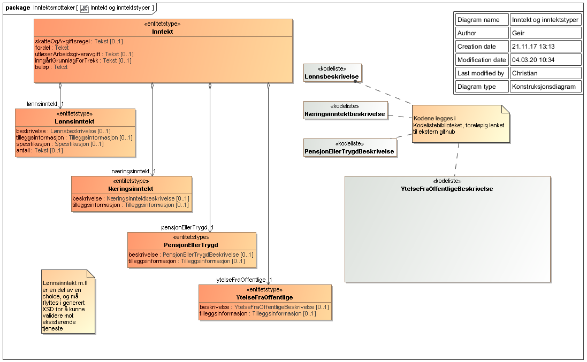

<summary>Tjenesten leverer informasjon om arbeidsgivers (opplysningspliktiges) innrapporterte inntektsopplysninger for en inntektsmottaker for en gitt periode.</summary>

<Tabs underline={true}>
<TabItem headerText="Om tjenesten" itemKey="itemKey-1" default>

For generell informasjon om tjenestene se egne sider om:
* [Bruk av tjenestene](../om/bruk.md)
* [Sikkerhetsmekansimer](../om/sikkerhet.md)
* [Rettighetspakker](../om/rettighetspakker.md) 
* [Feilhåndtering](../om/feil.md)
* [Versjonering](../om/versjoner.md)

## Scope
Følgende scope skal benyttes ved autentisering i Maskinporten: `skatteetaten:inntekt`

## Delegering
Tilgang til denne tjenesten kan delegeres i Altinn, f.eks. dersom leverandør benyttes for den tekniske oppkoblingen. Søk opp følgende tjeneste i Altinn for å delegere tilgangen: `Inntekt API - På vegne av`
 
## Teknisk spesifikasjon
[Open API spesifikasjon](https://app.swaggerhub.com/apis/Skatteetaten_Deling/inntekt-api/) ligger på SwaggerHub.

I Open API spesifikasjonen ligger URL'er til tjenesten, beskrivelsen av parameterene, endepunkter osv.

## Rettighetspakker

| Navn på rettighetspakke |	Egenskaper ved rettighetspakke |
|---|---|
| afp | |
| digisos | |
| gff | |
| husbanken | |
| kommuneBoligsosialeFormaal | |
| laanekassen | |
| ldir | |
| otp | |
| pensjonskasse | |
| saernamsmann | |
| spkBoliglaan | |
| sbl | Krever samtykke |
| udi | |
 
## Samtykke
For rettighetspakke `sbl` kreves [samtykke](../om/samtykke.md).

| Tjenestekode | Formål | Kommentar |
|--------| ------ |-------|
| 4804_210607 | Samtykke for `sbl` | Sanert tjenestekode: 4804_170223 |

For denne tjenesten er det enkelte parametre som må følge med:
 
| parameter | forklaring | eksempelverdi |
|---|---|---|
| 4804_210607_fraOgMed | Parameter for Inntekt | 2018-03 |
| 4804_210607_tilOgMed | Parameter for Inntekt | 2018-06 |

## Støttetjeneste
For å følge med på endringer tilbyr vi en [støttetjeneste for hendelsesliste](./hendelser.md): `Inntekt hendelser API`

## Datakatalog
 
[Datatjenestebeskrivelse](https://data.norge.no/dataservices/5f96b872-b5be-3681-9e84-bb4a5a74d049) i Felles datakatalog.
 
## Datostyrt spørreperiode

Inntektsdata er et aggregat av innrapporterte data fra forskjellige kilder. Hver dataperiode (måned) bygges opp gradvis i takt med at det rapporteres inn nye data.
 
Alle data oppdateres månedlig, men kan bli korrigert i ettertid. Fristen for å sende inn a-meldingen er satt til senest den 5. i måneden etter at rapporteringspliktige forhold inntraff. Statistikk viser at data stort sett er komplette den 10. i måneden etter. Skatteetaten anbefaler at man ikke baserer forretningsbeslutninger på inntektsopplysninger hentet før den 10 i måneden etter. Før dette kan data være ufullstendige.

  > *Eksempel:* En virksomhet skal lese inntektdata den 8. november 2017. Virksomheten bør hente data fra september 2017 og tidligere. Det kan hende data for oktober finnes, men de kan være ufullstendige. 
  
  > *Eksempel:* En virksomhet skal lese inntektdata den 10. november 2017. Virksomheten bør hente data fra oktober 2017 og tidligere. Data for oktober 2017 er mest sannsynlig ferdig innrapportert.

</TabItem>
<TabItem headerText="Eksempler" itemKey="itemKey-2">

## Curl

Her er et eksempel på en spørring med curl mot tjenesten. Du må legge sertifikat og nøkkel som parametre til curl-kommandoen.

```bash
$ curl -v --cert virksomhet.cer --key virksomhet.key -H "AltinnSamtykke: <samtykke>" "https://api-at.sits.no/api/innrapportert/inntektsmottaker/sbl/12345678901/oppgave/inntekt?fraOgMed=2016-11&tilOgMed=2017-01"
```
## Eksempel på respons fra tjenesten

Under er eksempler på respons fra inntektstjenesten.

Data kommer som en liste med OppgaveInntektsmottaker (oppgaver som gjelder en inntektsmottaker).
 
Hver OppgaveInntektsmottaker har

 * litt informasjon om oppgaven
   - kalendermåned
   - inntektsmottaker
   - opplysningspliktig
   - virksomhet (underenhet til opplysnigspliktig)
 * en liste med inntekter.  NB! Hvordan denne listen representeres vil for JSON avvike fra strukturen som er beskrevet i XSD.  For json-se eksempel nedenfor.

### Suksess (HTTP status 200)

Dersom kallet lykkes får man HTTP status 200 og data i JSON eller XML format. Dersom man ikke spesifiserer ønsket format får man JSON.

#### JSON

Spesifikasjon av return for tjenesten: [Inntektsmottaker.json](../../static/download/Inntektsmottaker.json)

```json
{
    "oppgaveInntektsmottaker": [
        {
            "opplysningspliktigId": "811094242",
            "virksomhetId": "811094552",
            "kalendermaaned": "2018-07",
            "inntektsmottaker": {
                "personidentifikator": "01029413157"
            },
            "inntekt": [
                {
                    "fordel": "utgiftsgodtgjoerelse",
                    "utloeserArbeidsgiveravgift": false,
                    "inngaarIGrunnlagForTrekk": false,
                    "beloep": 5100,
                    "loennsinntekt": {
                        "beskrivelse": "reiseKostMedOvernattingPaaHotellBeordringUtover28Doegn",
                        "spesifikasjon": {
                            "opptjeningsland": "DZ"
                        },
                        "antall": 51
                    }
                },
                {
                    "fordel": "naturalytelse",
                    "utloeserArbeidsgiveravgift": true,
                    "inngaarIGrunnlagForTrekk": true,
                    "beloep": 6000,
                    "loennsinntekt": {
                        "beskrivelse": "bil",
                        "tilleggsinformasjon": {
                            "bilOgBaat": {
                                "antallKilometer": 600,
                                "heravAntallKilometerMellomHjemOgArbeid": 600,
                                "listeprisForBil": 6000,
                                "bilregistreringsnummer": "el12345",
                                "erBilUtenforStandardregelen": true
                            }
                        }
                    }
                },
                {
                    "fordel": "kontantytelse",
                    "utloeserArbeidsgiveravgift": true,
                    "inngaarIGrunnlagForTrekk": true,
                    "beloep": 150000,
                    "loennsinntekt": {
                        "beskrivelse": "timeloenn",
                        "antall": 150
                    }
                },
                {
                    "fordel": "kontantytelse",
                    "utloeserArbeidsgiveravgift": true,
                    "inngaarIGrunnlagForTrekk": true,
                    "beloep": 2400,
                    "loennsinntekt": {
                        "beskrivelse": "fastloenn",
                        "tilleggsinformasjon": {
                            "inntjeningsforhold": "utenlandskeSjoefolkSomIkkeErSkattepliktig"
                        },
                        "spesifikasjon": {
                            "skattemessigBosattILand": "AF"
                        }
                    }
                },
                {
                    "fordel": "utgiftsgodtgjoerelse",
                    "utloeserArbeidsgiveravgift": false,
                    "inngaarIGrunnlagForTrekk": false,
                    "beloep": 5000,
                    "loennsinntekt": {
                        "beskrivelse": "reiseKostMedOvernattingPaaHybelBrakkePrivat",
                        "antall": 50
                    }
                },
                {
                    "fordel": "utgiftsgodtgjoerelse",
                    "utloeserArbeidsgiveravgift": true,
                    "inngaarIGrunnlagForTrekk": true,
                    "beloep": 2900,
                    "loennsinntekt": {
                        "beskrivelse": "smusstillegg"
                    }
                },
                {
                    "fordel": "utgiftsgodtgjoerelse",
                    "utloeserArbeidsgiveravgift": false,
                    "inngaarIGrunnlagForTrekk": false,
                    "beloep": 2800,
                    "loennsinntekt": {
                        "beskrivelse": "overtidsmat",
                        "antall": 28
                    }
                },
                {
                    "fordel": "utgiftsgodtgjoerelse",
                    "utloeserArbeidsgiveravgift": false,
                    "inngaarIGrunnlagForTrekk": false,
                    "beloep": 4900,
                    "loennsinntekt": {
                        "beskrivelse": "reiseKostMedOvernattingPaaPensjonat",
                        "antall": 49
                    }
                }
            ]
        }
    ]
}
```

## Samtykkeoppsett

(Gjelder bare virksomheter som henter data basert på samtykke)

| Tjenestekode | Parametere v/ redirect til Altinn | Eksempel parameter verdi |
|--------------|-----------------------------------|--------------------------|
| 4804_210607 | 4804_210607_fraOgMed, 4804_210607_tilOgMed | &4804_210607_fraOgMed=2021-03&4804_210607_tilOgMed=2021-06 |

</TabItem>
<TabItem headerText="Feilkoder" itemKey="itemKey-3">

Se egen side for generell info om [feilhåndtering i tjenestene](../om/feil.md).

Tabellen under viser en oversikt over hvilke spesifikke feilkoder denne applikasjonen kan gi. 

| Feilkode | HTTP Statuskode | Feilområde                                                                   |
|----------|-----------------|------------------------------------------------------------------------------|
| IM-001   | 500             | Uventet feil på tjenesten.                                                   |
| IM-002   | 500             | Uventet feil i et bakenforliggende system.                                   |
| IM-003   | 404             | Ukjent url benyttet.                                                         |
| IM-004   | 401             | Feil i forbindelse med autentisering.                                        |
| IM-005   | 403             | Feil i forbindelse med autorisering.                                         |
| IM-006   | 400             | Feil i forbindelse med validering av inputdata.                              |
| IM-007   | 404             | Ikke treff på oppgitt personidentifikator.                                   |
| IM-008   | 404             | Fant ingen inntektsopplysninger for angitt personidentifikator og tidspunkt. |
| IM-009   | 406             | Feil tilknyttet dataformat. Kun json eller xml er støttet.                   |
| IM-010   | 403             | Feil i forbindelse med samtykke.                                             |

</TabItem>
<TabItem headerText="Informasjonsmodell" itemKey="itemKey-4">

 [informasjonsmodell](https://data.norge.no/informationmodels/c0837391-9c16-393b-b53b-ea0a27eb62a1) i Felles datakatalog.
 
 Obs. Hvis modellene på denne siden avviker fra open api spesifikasjonen på Swaggerhub, er det open api spesifikasjonen som er mest oppdatert.
 
 ## Rettighetspakker

Hvilke data en virksomhet får bestemmes av rettighetspakken, se [Rettighetspakker](../om/rettighetspakker.md).

| Rettighetspakke | Beskrivelse | Regler for bruk |
|--------|--------| --------- |
| sbl | Samtykkebasert Lånesøknad | |
| otp | Obligatorisk tjenestepensjon |Perioden det spørres på må være innenfor virkningsperioden. Se [Forutsetning for bruk](../informasjonsmodeller/tjenestepensjonsavtale/forutsetningerforbruk.md) |   

Organisasjoner med hjemmel bes ta kontakt med Skatteetaten for å finne ut hvilken rettighetspakke som er aktuell for din organisasjon og hvilke felter den aktuelle rettighetspakken returnerer.


## Beskrivelse

> Elementet *&lt;beskrivelse&gt;* klassifiserer den enkelte inntekt

Skatteetaten utleverer ikke alle inntekt typer til alle virksomheter. Virksomhetens *Rettighetspakke* avgjør hvilke inntekter som filtreres vekk før data utleveres. Inntekter som ikke skal utleveres for en Rettighetspakke fjernes i sin helhet.

For rettighetspakke otp er inntekter som blir utdelt fra andre enn opplysningspliktige man har søkt på markert med X*

### &lt;loennsinntekt&gt; &lt;beskrivelse&gt;

Oversikt over hvilke *&lt;beskrivelse&gt;* koder som brukes for *&lt;loennsinntekt&gt;*. 
Gyldighetsperiode styrer hvilken periode en *&lt;beskrivelse&gt;* kode er i bruk.

|verdi| gyldig fra og med | gyldig til | sbl | otp |
|--------|--------|--------|--------|-------|
|administrativForpleining|2013-01|2016-01|||
|aksjerGrunnfondsbevisTilUnderkurs|2013-01|||X|
|annet|2013-01||X|X|
|arbeidsoppholdKost|2013-01|||X|
|arbeidsoppholdLosji|2013-01|||X|
|bedriftsbarnehageplass|2013-01|2019-01|X||
|beregnetSkatt|2013-01||X|X|
|besoeksreiserHjemmetAnnet|2013-01||||
|besoeksreiserHjemmetKilometergodtgjoerelseBil|2013-01|||X|
|besoeksreiserHjemmetKost|2013-01||||
|betaltUtenlandskSkatt|2017-01||X||
|bil|2013-01||X|X|
|bolig|2013-01||X|X|
|bonus|2013-01||X|X|
|bonusFraForsvaret|2014-01||X||
|elektroniskKommunikasjon|2013-01|||X|
|fastBilgodtgjoerelse|2013-01||X|X|
|fastloenn|2013-01||X|X|
|fastTillegg|2013-01||X|X|
|feriepenger|2013-01||X|X|
|flyttegodtgjoerelse|2013-01||||
|fondForIdrettsutoevere|2013-01||X||
|friTransport|2013-01||||
|godtgjoerelseSaeravtaleUtland|2013-01||X|||
|helligdagstillegg|2013-01||X|X|
|honorarAkkordProsentProvisjon|2018-01||X|X|
|hyretillegg|2013-01||X|X|
|ikkeSkattepliktigLoennFraUtenlandskDiplomKonsulStasjon|2014-01||X||
|innbetalingTilUtenlandskPensjonsordning|2016-01||||
|kapitalInntekt|2014-01||X||
|kilometergodtgjoerelseAndreFremkomstmidler|2013-01||||
|kilometergodtgjoerelseBil|2013-01|||X|
|kilometergodtgjoerelseElBil|2013-01|2019-01|||
|kilometergodtgjoerelsePassasjertillegg|2013-01||||
|kommunalOmsorgsloennOgFosterhjemsgodtgjoerelse|2013-01||X||
|kompensasjonstilleggBolig|2013-01||X||
|kostbesparelseIHjemmet|2013-01||||
|kostDager|2013-01|||X|
|kostDoegn|2013-01|||X|
|loennEtterDoedsfall|2014-01|||X|
|loennForBarnepassIBarnetsHjem|2014-01||X||
|loennTilPrivatpersonerForArbeidIHjemmet|2014-01||X||
|loennTilVergeFraFylkesmannen|2016-01||X||
|loennUtbetaltAvVeldedigEllerAllmennyttigInstitusjonEllerOrganisasjon|2014-01||X|X|
|loennUtenlandskArtist|2014-01||X||
|losji|2013-01|||X|
|losjiEgenBrakkeCampingvogn|2014-01||||
|opsjoner|2013-01||X|X|
|overtidsgodtgjoerelse|2013-01||X|X|
|overtidsmat|2013-01|2019-01|||
|reiseAnnet|2013-01|||X|
|reiseKost|2013-01|||X|
|reiseKostMedOvernattingPaaHotell|2014-01||||
|reiseKostMedOvernattingPaaHotellBeordringUtover28Doegn|2013-01||||
|reiseKostMedOvernattingPaaHybelBrakkePrivat|2014-01||||
|reiseKostMedOvernattingPaaPensjonat|2014-01||||
|reiseKostMedOvernattingTilLangtransportsjaafoerForKjoeringIUtlandet|2014-01||||
|reiseKostUtenOvernatting|2013-01||||
|reiseLosji|2013-01|||X|
|reiseNattillegg|2013-01||||
|rentefordelLaan|2013-01|||X|
|skattefriErstatning|2013-01||X||
|skattefrieUtbetalinger|2014-01||||
|skattepliktigDelForsikringer|2013-01|||X|
|skattepliktigPersonalrabatt|2019-01||X|X|
|sluttvederlag|2013-01||X|X|
|smusstillegg|2013-01|||X|
|stipend|2013-01||X|X|
|styrehonorarOgGodtgjoerelseVerv|2013-01||X||
|tilskuddBarnehageplass|2013-01|2019-01|X||
|timeloenn|2013-01||X|X|
|tips|2019-01||X|X|
|trekkILoennForFerie|2016-01||X|X|
|uregelmessigeTilleggKnyttetTilArbeidetTid|2013-01||X|X|
|uregelmessigeTilleggKnyttetTilIkkeArbeidetTid|2013-01||X|X|
|yrkebilTjenestligbehovKilometer|2016-01||||
|yrkebilTjenestligbehovListepris|2016-01||||


### &lt;ytelseFraOffentlige&gt; &lt;beskrivelse&gt;

Oversikt over hvilke *&lt;beskrivelse&gt;* koder som brukes for *&lt;ytelseFraOffentlige&gt;*. 
Gyldighetsperiode styrer hvilken periode en *&lt;beskrivelse&gt;* kode er i bruk.

|verdi| gyldig fra og med | gyldig til | sbl | otp |
|--------|--------|--------|--------|-------|
|arbeidsavklaringspenger|2013-01||X|X*|
|dagpengerTilFiskerSomBareHarHyre|2013-01||X||
|dagpengerVedArbeidsloeshet|2013-01||X||
|ektefelletilleggUfoeretrygd|2015-01||X||
|foreldrepenger|2013-01||X||
|overgangsstoenadTilEnsligMorEllerFarSomBegynteAaLoepe1April2014EllerSenere|2014-01||X||
|skattefrieTilleggsstoenader|2013-01|2016-01|X||
|skattefriStoenadTilBarnetilsyn|2013-01|2016-01|X||
|svangerskapspenger|2013-01||X|X*|
|sykepenger|2013-01||X|X*|
|sykepengerTilFiskerSomBareHarHyre|2013-01||X|X*|
|ufoeretrygd|2015-01||X|X*|
|ufoereytelseEtteroppgjoer|2016-01||X||
|underholdsbidragTilBarn|2013-01|2017-01|X||
|venteloenn|2013-01||X||


### &lt;pensjonEllerTrygd&gt; &lt;beskrivelse&gt;

Oversikt over hvilke *&lt;beskrivelse&gt;* koder som brukes for *&lt;pensjonEllerTrygd&gt;*. 
Gyldighetsperiode styrer hvilken periode en *&lt;beskrivelse&gt;* kode er i bruk.

|verdi| gyldig fra og med | gyldig til | sbl | otp |
|--------|--------|--------|--------|-------|
|alderspensjon|2013-01||X||
|annet|2013-01||X||
|avtalefestetPensjon|2013-01||X||
|barnepensjon|2013-01||X||
|barnepensjonFraAndreEnnFolketrygden|2013-01||X||
|bil|2013-01||X||
|bolig|2013-01||X||
|ektefelletillegg|2013-01||X||
|elektroniskKommunikasjon|2013-01||||
|engangsutbetalingInnskuddspensjon|2015-01||X||
|etterlattepensjon|2013-01||X||
|etterloenn|2017-01||||
|etterloennOgEtterpensjon|2013-01||X||
|foederaad|2013-01||||
|introduksjonsstoenad|2013-01||X||
|ipaEllerIpsBarnepensjon|2015-01||X||
|ipaEllerIpsEngangsutbetaling|2015-01||X||
|ipaEllerIpsPeriodiskeYtelser|2015-01||X||
|ipaEllerIpsUfoerepensjon|2015-01||X|X*|
|krigspensjon|2013-01||X||
|kvalifiseringstoenad|2013-01||X||
|nyAvtalefestetPensjonPrivatSektor|2013-01||X||
|nyeLivrenterIArbeidsforholdOgLivrenterFortsettelsesforsikringer|2013-01||X||
|overgangsstoenadTilEnsligMorEllerFarSomBegynteAaLoepe31Mars2014EllerTidligere|2014-01|2019-01|X||
|overgangsstoenadTilGjenlevendeEktefelle|2014-01||X||
|pensjonIDoedsmaaneden|2013-01||||
|pensjonOgLivrenterIArbeidsforhold|2013-01||X||
|rentefordelLaan|2013-01||||
|slitertillegg|2019-01||X||
|supplerendeStoenadTilPersonKortBotidNorge|2013-01||X||
|ufoerepensjon|2013-01||X||
|ufoerepensjonFraAndreEnnFolketrygden|2013-01||X|X*|
|ufoereytelseEtteroppgjoerFraAndreEnnFolketrygden|2015-01||X|X*|
|underholdsbidragTilTidligereEktefelle|2013-01|2020-01|X||


### &lt;naeringsinntekt&gt; &lt;beskrivelse&gt;

Oversikt over hvilke *&lt;beskrivelse&gt;* koder som brukes for *&lt;pensjonEllerTrygd&gt;*. 
Gyldighetsperiode styrer hvilken periode en *&lt;beskrivelse&gt;* kode er i bruk.

|verdi| gyldig fra og med | gyldig til | sbl |
|--------|--------|--------|--------|
|annet|2013-01|2018-01|X|
|dagpengerTilFisker|2013-01||X|
|dagpengerVedArbeidsloeshet|2013-01||X|
|lottKunTrygdeavgift|2016-01||X|
|sykepenger|2013-01||X|
|sykepengerTilDagmamma|2013-01||X|
|sykepengerTilFisker|2013-01||X|
|sykepengerTilJordOgSkogbrukere|2013-01||X|
|vederlag|2013-01||X|
|vederlagDagmammaIEgetHjem|2014-01||X|


## Element med tekstkoder

Det henvises generelt til xsd for den enkelte Rettighetspakke for hvilke verdier som kan utleveres i element. I dette avsnittet dokumenteres kun element som inneholder tekstkoder definert av skatteetaten


### &lt;land&gt;

Landkoder oppgis i [ISO 3166 alpha-2](https://en.wikipedia.org/wiki/ISO_3166-1_alpha-2)
 
### &lt;fordel&gt;

|verdi| gyldig fra og med | gyldig til og med | sbl| otp |
|--------|--------|--------|------|
|kontantytelse|||X|X|
|naturalytelse|||X|X|
|utgiftsgodtgjoerelse|||X|X|


### &lt;skatteOgAvgiftsRegel&gt;

|verdi| gyldig fra og med | gyldig til og med | kommentar | sbl|
|--------|--------|--------|-----------|----|
|janMayenOgBilandene||||X|
|kildeskattPaaPensjoner||||X|
|nettoloenn||||X|
|svalbard||||X|
|saerskiltFradragForSjoefolk||||X|
|nettoloennForSjoefolk||||X|
|skattefriOrganisasjon|2016-01|||X|
||||ingen verdi (tom streng) er lov i dette feltet| 


### &lt;Forskuddstrekk&gt; &lt;beskrivelse&gt;

|verdi| gyldig fra og med | gyldig til og med | kommentar | sbl |
|--------|--------|--------|-----------|----|
|betaltTrygdeavgiftTilJanMayen||||X|
|janMayenOgBilandene||||X|
|kildeskattPaaPensjon||||X|
|svalbard||||X|
|barnepensjon||||X|
||||ingen verdi (tom streng) er lov i dette feltet|| 


### &lt;Fradrag&gt; &lt;beskrivelse&gt;

|verdi| gyldig fra og med | gyldig til og med | sbl |
|--------|--------|--------|----|
|brakkeleie|||X|
|premieTilFondOgTrygd|||X|
|premieTilPensjonsordninger|||X|
|brakkeleieSvalbard|||X|
|premieTilFondOgTrygdSvalbard|||X|
|premieTilPensjonsordningerSvalbard|||X|
|premieTilPensjonsordningerJanMayenOgBilandene|||X|
|premieTilUtenlandskePensjonsordninger|||X|
 

## Element i utvidet format med tekstkoder

Det henvises generelt til xsd for den enkelte Rettighetspakke for hvilke verdier som kan utleveres i elementer. I dette avsnittet dokumenteres element som kun utleveres med Rettighetsett Utvidet, og som i tillegg inneholder tekstkoder definert av skatteetaten


### &lt;tilleggsinformasjon&gt; &lt;inntjeningsforhold&gt;

|verdi| gyldig fra og med | gyldig til og med | sbl|
|--------|--------|--------|----|
|hyreTilMannskapPaaFiskeSmaahvalfangstOgSelfangstfartoey|||X|
|loennOgAnnenGodtgjoerelseSomIkkeErSkattepliktig|||X|
|loennUtbetaltFraDenNorskeStatOpptjentIUtlandet|||X|
|loennVedArbeidsmarkedstiltak|||X|
|loennVedKonkursEllerStatsgarantiOsv|||X|
|skattefriArbeidsinntektBarnUnderTrettenAar|||X|
|statsansattUtlandet|||X|
|utenlandskeSjoefolkSomIkkeErSkattepliktig|||X|


### &lt;tilleggsinformasjon&gt; &lt;reiseKostOgLosji&gt; &lt;persontype&gt; 

|verdi| gyldig fra og med | gyldig til og med |sbl|
|--------|--------|--------|----|
|norskPendler|||X|
|sokkelarbeider|||X|
|utenlandskPendlerMedSkattekortUtenStandardFradrag|||X|
|utenlandskPendler|||X|
|utlendingMedOppholdINorge|||X|

## Informasjonsmodell - skjema

### Oversikt
 

### Inntekt og inntektstyper
 

### Tilleggsinformasjon
 
 
</TabItem>
<TabItem headerText="Test" itemKey="itemKey-5">

## Tenor testdatasøk
Testdata er søkbare i Tenor-adapteren "Inntekt A-ordningen"
 
</TabItem>
</Tabs>
