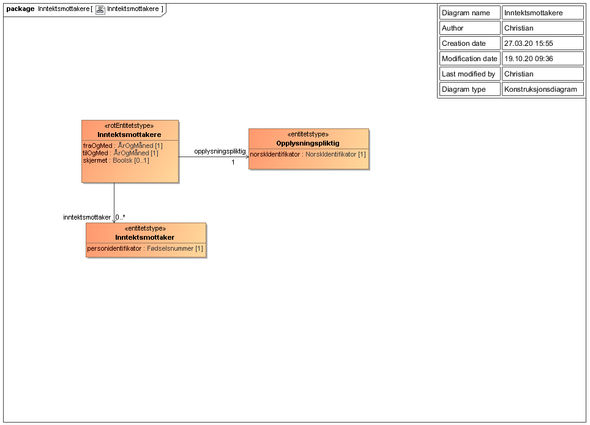

<summary>Tjenesten leverer en liste over inntektsmottakere der arbeidsgiver (opplysningspliktig), via a-ordningen, har rapportert pensjonsavtale med pensjonsinnretningen som utfører kallet.</summary>

<Tabs underline={true}>
<TabItem headerText="Om tjenesten" itemKey="itemKey-1" default>

For generell informasjon om tjenestene se egne sider om:
* [Bruk av tjenestene](../om/bruk.md)
* [Sikkerhetsmekansimer](../om/sikkerhet.md)
* [Rettighetspakker](../om/rettighetspakker.md) 
* [Feilhåndtering](../om/feil.md)
* [Versjonering](../om/versjoner.md)

## Scope
Følgende scope skal benyttes ved autentisering i Maskinporten: `skatteetaten:inntektsmottakere`

## Delegering
Tilgang til denne tjenesten kan delegeres i Altinn, f.eks. dersom leverandør benyttes for den tekniske oppkoblingen. Søk opp følgende tjeneste i Altinn for å delegere tilgangen: `Inntektsmottakere API - På vegne av`

## Teknisk spesifikasjon
[Open API spesifikasjon](https://app.swaggerhub.com/apis/Skatteetaten_Deling/inntektsmottakere-api) av API'et på SwaggerHub.

I Open API spesifikasjonen ligger URL'er til tjenesten, beskrivelsen av parameterene, endepunkter osv.

## Rettighetspakker
 
| Navn på rettighetspakke |	
|---|
| otp |

## Datakatalog
 
[Datatjenestebeskrivelse](https://data.norge.no/dataservices/463966c2-0a35-3845-b2a4-9446d36526e4) i Felles datakatalog.

</TabItem>
<TabItem headerText="Eksempler" itemKey="itemKey-2"> 

## Curl

Her er et eksempel på en spørring med curl mot tjenesten. Du må ha et gyldig maskinportentoken som legges ved som headerer i curl-kommandoen.

```bash
$ curl -v -H "Authorization: Bearer <maskinporten_token>" "https://api-at.sits.no/api/innrapportert/opplysningspliktig/v1/otp/999999999/inntektsmottakere"
```

## JSON

```json
 {
     "opplysningspliktig": {
         "norskIdentifikator": "910996215"
     },
     "fraOgMed": "2020-01",
     "tilOgMed": "2020-08",
     "inntektsmottaker": [
         {
             "personidentifikator": "01012066666"
         },
         {
             "personidentifikator": "01012066667"
         },
         {
             "personidentifikator": "01012066668"
         },
         {
             "personidentifikator": "01012066669"
         },
         {
             "personidentifikator": "01012066670"
         }
     ]
 }
```

</TabItem>
<TabItem headerText="Feilkoder" itemKey="itemKey-3">

Se egen side for generell info om [feilhåndtering i tjenestene](../om/feil.md).

Tabellen under viser en oversikt over hvilke spesifikke feilkoder denne applikasjonen kan gi. 
 
| Feilkode | HTTP Statuskode | Feilområde                                                                   |
|----------|-----------------|------------------------------------------------------------------------------|
| IM-001   | 500             | Uventet feil på tjenesten.                                                   |
| IM-002   | 500             | Uventet feil i et bakenforliggende system.                                   |
| IM-003   | 404             | Ukjent url benyttet.                                                         |
| IM-004   | 401             | Feil i forbindelse med autentisering.                                        |
| IM-005   | 403             | Feil i forbindelse med autorisering.                                         |
| IM-006   | 400             | Feil i forbindelse med validering av inputdata.                              |
| IM-007   | 404             | Ingen data funnet for angitt søk.                                   |
| IM-008   | 406             | Feil tilknyttet dataformat. Kun json eller xml er støttet. |
 
</TabItem>
<TabItem headerText="Informasjonsmodell" itemKey="itemKey-4">

[Informasjonsmodell](https://data.norge.no/informationmodels/df55045f-66d6-35c5-bc89-9ec856397951) i Felles datakatalog.
 
Hvilke data en virksomhet får bestemmes av rettighetspakken, se [Rettighetspakke](../om/rettighetspakker.md)

| Rettighetspakke | Beskrivelse | Regler for bruk | 
|--------|--------|-----------|
| otp | Obligatorisk tjenestepensjon | Perioden det spørres på må være innenfor avtaleperioden. Se [Forutsetning for bruk](../informasjonsmodeller/tjenestepensjonsavtale/forutsetningerforbruk.md) | 

## Inntektsmottakere

| Felt | Beskrivelse |
| ---- | -------------------------------------------------------- |
| fraOgMed | Startmåned for avtalen |
| tilOgMed | Sluttmåned for avtalen |
| skjermet | Settes til sann/true dersom informasjonssettet er skjermet |
| link | Teknisk felt for håndtering av store datasett.  Dette feltet er ikke i bruk |
| opplysningspliktig | Den opplysningspliktige som listen gjelder  |
| inntektsmottaker | Inntektsmottaker oppgitt av opplysningspliktig |
 
### Opplysningspliktig

| Felt | Beskrivelse |
| ---- | ------------------------------------------------------ |
| norskIdentifikator | Opplysningspliktiges organisasjonsnummer, fødsels- eller d-nummer |

### Inntektsmottaker
Det utleveres personidentifikator for inntektsmottakere som er rapportert av opplysningspliktig i minst en av periodene det spørres på.

| Felt | Beskrivelse |
| ---- | ------------------------------------------------------ |
| personidentifikator | Inntektsmottakerens fødsels- eller d-nummer |

## Informasjonsmodell - skjema
 

 
</TabItem>
<TabItem headerText="Test" itemKey="itemKey-5">

## Tenor testdatasøk
Testdata er søkbare i Tenor-adapteren "Inntekt A-ordningen" og denne kan også kombineres med Arbeidsforhold-adapter.

</TabItem>
</Tabs>

