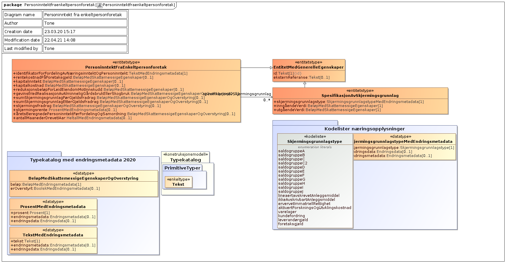
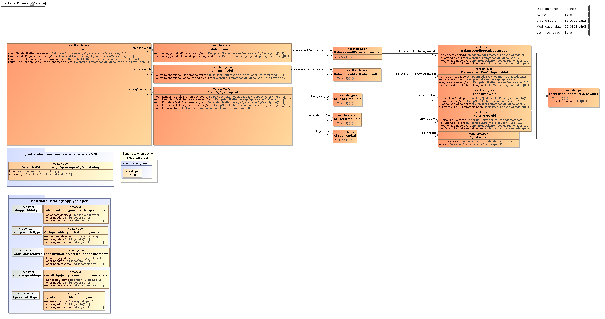

<summary>Tjenesten leverer næringsopplysninger som enkeltpersonforetak og selskaper har innrapportert til Skatteetaten i forbindelse med skattemeldingen.</summary>

<Tabs underline={true}>
<TabItem headerText="Om tjenesten" itemKey="itemKey-1" default>

For generell informasjon om tjenestene se egne sider om:
* [Bruk av tjenestene](../om/bruk.md)
* [Sikkerhetsmekansimer](../om/sikkerhet.md)
* [Rettighetspakker](../om/rettighetspakker.md) 
* [Feilhåndtering](../om/feil.md)

## Scope
Følgende scope skal benyttes ved autentisering i Maskinporten: `skatteetaten:naeringsspesifikasjon`

## Delegering
Tilgang til denne tjenesten kan delegeres i Altinn, f.eks. dersom leverandør benyttes for den tekniske oppkoblingen. Søk opp følgende tjeneste i Altinn for å delegere tilgangen: `Næringsspesifikasjon API - På vegne av`

## Teknisk spesifikasjon
Næringsspesifikasjon API følger ikke de generelle reglene for [versjonering](../om/versjoner.md), men har en egen versjon pr. inntektsår. For øyeblikket leverer tjenesten næringsspesifikasjon for 2022.
  
[Open API spesifikasjon](https://app.swaggerhub.com/apis/Skatteetaten_Deling/naeringsspesifikasjon-api) ligger på SwaggerHub.

I Open API spesifikasjonen ligger URL'er til tjenesten, beskrivelsen av parameterene, endepunkter osv.

## Rettighetspakker
  
| Navn på rettighetspakke |	
|---|
| ssb |
 
## Støttetjeneste
For å følge med på endringer tilbyr vi en [støttetjeneste for hendelsesliste](./hendelser.md): `Næringsspesifikasjon hendelser API`
 
## Datakatalog

[Datatjenestebeskrivelse](https://data.norge.no/dataservices/6ed9209d-c7c0-376f-a4b5-b4ce7cc1933b) i Felles datakatalog.

</TabItem>
<TabItem headerText="Eksempler" itemKey="itemKey-2">

## Curl
Her er et eksempel på en spørring med curl mot tjenesten. Du må ha et gyldig maskinportentoken som legges ved som headerer i curl-kommandoen.

```bash
$ curl -v -H "Authorization: Bearer <maskinporten_token>" "https://api-test.sits.no/api/formueinntekt/naeringsspesifikasjon/v3/ssb/2022/12345678901?gjelderpaaTidspunkt=2022-08-08T12:12:12"
```

## JSON
Eksempel på en gyldig respons for inntektsår 2022 (v3):

```json
{
  "norskIdentifikator" : "14074924167",
  "inntektsaar" : "2022",
  "resultatregnskap" : {
    "driftsinntekt" : {
      "sumDriftsinntekt" : 450000.0,
      "salgsinntekt" : {
        "inntekt" : [ {
          "id" : "3000",
          "type" : "3000",
          "beloep" : 450000.0
        } ]
      }
    },
    "driftskostnad" : {
      "sumDriftskostnad" : 36000.0,
      "annenDriftskostnad" : {
        "kostnad" : [ {
          "id" : "7099",
          "type" : "7099",
          "beloep" : 0.0
        }, {
          "id" : "6000",
          "type" : "6000",
          "beloep" : 36000.0
        } ]
      }
    },
    "aarsresultat" : 414000.0
  },
  "balanseregnskap" : {
    "anleggsmiddel" : {
      "sumBalanseverdiForAnleggsmiddel" : 144000.0,
      "balanseverdiForAnleggsmiddel" : {
        "balanseverdi" : [ {
          "id" : "1205",
          "beloep" : 144000.0,
          "type" : "1205"
        } ]
      }
    },
    "sumBalanseverdiForEiendel" : 144000.0
  },
  "spesifikasjonAvAnleggsmiddel" : {
    "saldoavskrevetAnleggsmiddel" : [ {
      "id" : "60285fd5-2bbf-4e11-8576-8ee5ed3b70c2",
      "objektidentifikator" : "1",
      "inngaaendeVerdi" : 180000.0,
      "erRealisasjonenUfrivilligOgGevinstenBetingetSkattefri" : false,
      "grunnlagForAvskrivningOgInntektsfoering" : 180000.0,
      "utgaaendeVerdi" : 144000.0,
      "aaretsAvskrivning" : 36000.0,
      "saldogruppe" : "d",
      "avskrivningssats" : 20.0,
      "erDetFysiskAnleggsmiddelIUtgaaendeVerdi" : true
    } ],
    "motorkjoeretoeyINaering" : [ {
      "id" : "1824b811-7349-46f4-941e-2484e2c666dc",
      "kjennemerke" : "KH15678",
      "aarForFoerstegangsregistrering" : "2015",
      "biltype" : "varebilKlasse2",
      "listeprisSomNy" : 300000.0,
      "drivstoffkostnad" : 100000.0,
      "vedlikeholdskostnad" : 50000.0,
      "kostnadTilForsikringOgAvgift" : 15000.0,
      "antallKilometerYrkeskjoering" : 25000,
      "antallKilometerKjoertIAar" : 25000,
      "disponertIPeriode" : {
        "start" : "2022-01-01",
        "slutt" : "2022-01-31"
      },
      "erElektroniskKjoerebokFoertVedroerendeYrkeskjoering" : false,
      "erYrkesbilenIBrukPrivat" : false,
      "tilbakefoertBilkostnadForPrivatBrukAvYrkesbil" : 0.0
    } ],
    "oevrigTilVisningForSpesifikasjonAvAnleggsmiddel" : {
      "samletSaldoavskrivning" : 36000.0
    }
  },
  "beregnetNaeringsinntekt" : {
    "fordeltBeregnetNaeringsinntekt" : [ {
      "id" : "9748c60c-f8cf-45d3-9e9a-5262328a88c5",
      "identifikatorForFordeltBeregnetPersoninntekt" : "1",
      "identifikatorForFordeltBeregnetNaeringsinntekt" : "1",
      "naeringstype" : "reindrift",
      "fordeltSkattemessigResultat" : 414000.0,
      "reindrift" : {
        "korrigertResultat" : 414000.0
      },
      "fordeltSkattemessigResultatEtterKorreksjon" : 414000.0,
      "andelAvFordeltSkattemessigResultatTilordnetInnehaver" : 100.0,
      "fordeltSkattemessigResultatEtterKorreksjonTilordnetInnehaver" : 414000.0
    } ],
    "skattemessigResultat" : 414000.0
  },
  "beregnetPersoninntekt" : {
    "fordeltBeregnetPersoninntekt" : [ {
      "id" : "1",
      "identifikatorForFordeltBeregnetPersoninntekt" : "1",
      "identifikatorForFordeltBeregnetNaeringsinntekt" : "1",
      "aaretsBeregnedePersoninntektFoerFordelingOgSamordning" : 414000.0,
      "andelAvPersoninntektTilordnetInnehaver" : 100.0,
      "aaretsBeregnedePersoninntektFoerFordelingOgSamordningTilordnetInnehaver" : 414000.0
    } ]
  },
  "virksomhet" : {
    "regnskapspliktstype" : "ingenRegnskapsplikt",
    "regnskapsperiode" : {
      "start" : "2022-01-01T00:00:00+01:00",
      "slutt" : "2022-12-31T23:59:59+01:00"
    },
    "virksomhetstype" : "enkeltpersonforetak",
    "regeltypeForAarsregnskap" : "regnskapslovensAlminneligeRegler"
  },
  "samletGjeldOgFormuesobjekter" : {
    "verdiFoerVerdsettingsrabattForFormuesobjekterOmfattetAvVerdsettingsrabatt" : 144000.0
  },
  "skjermet" : false,
  "opprettetDato" : "2023-02-08T15:12:38+01:00"
}
```
</TabItem>
<TabItem headerText="Feilkoder" itemKey="itemKey-3">

Se egen side for generell info om [feilhåndtering i tjenestene](../om/feil.md).

Tabellen under viser en oversikt over hvilke spesifikke feilkoder denne applikasjonen kan gi. 

| Feilkode | HTTP Statuskode | Feilområde                                                             |
|----------|-----------------|------------------------------------------------------------------------|
| NS-001   | 500             | Uventet feil på tjenesten.                                             |
| NS-002   | 500             | Uventet feil i et bakenforliggende system.                             |
| NS-003   | 404             | Ukjent url benyttet.                                                   |
| NS-004   | 401             | Feil i forbindelse med autentisering.                                  |
| NS-005   | 403             | Feil i forbindelse med autorisering.                                   |
| NS-006   | 400             | Feil i forbindelse med validering av inputdata.                        |
| NS-007   | 404             | Fikk ikke treff på gitt identifikator.                                 |
| NS-008   | 404             | Fant ikke naeringsspesifikasjon for gitt identifikator og inntektsaar. |
| NS-009   | 406             | Feil tilknyttet dataformat. Kun json eller xml er støttet.             |
| NS-010   | 410             | Naeringsspesifikasjon er ikke lenger tilgjenglig.                      |

</TabItem>
<TabItem headerText="Informasjonsmodell" itemKey="itemKey-4">

[Informasjonsmodell](https://data.norge.no/informationmodels/c45bfb1b-766e-386a-b560-c57eca638c1a) i Felles datakatalog.

Obs. Hvis modellene på denne siden avviker fra Open API spesifikasjonen på Swaggerhub, er det Open API spesifikasjonen som er mest oppdatert.

Modellene nedenfor avviker litt fra modellen slik den benyttes i tjenesten.  Modellen har følgende avvik:
* Part er erstattet med personidentifikator
* Intern systemreferanse er ikke med
* Type Endringsmetadata er ikke med
* Type BeløpIValuta er konvertert til Beløp 
 
## Toppnivå


## Næringsinntekt


## Personinntekt


## Balanse


## Resultatregnskap 


## Avskrivning 


## Spesifikasjon av resultatregnskap og balanse 


</TabItem>
<TabItem headerText="Test" itemKey="itemKey-5">

## Tenor testdatasøk
Det finnes pt. ikke søk i [Tenor](../test/tenor.md) for denne tjenesten, og testdata er derfor listet her.

## Testdata
Under har vi listet noen testdata som er tilgjengelige for denne tjenesten i Skatteetatens testmiljø for eksterne: 

| Type skattepliktig | Fødselsnummer | Inntektsår |
|---|---|---|
| Personlig | 07810099598 | 2022 |
| Personlig | 14839699914 | 2022 |
| Personlig | 17869096687 | 2022 |
| Personlig | 24875599174 | 2022 |
| Personlig | 29896399711 | 2022 |

Ytterligere testdata kan man benytte hendelseslisten for å finne.

</TabItem>
</Tabs>
