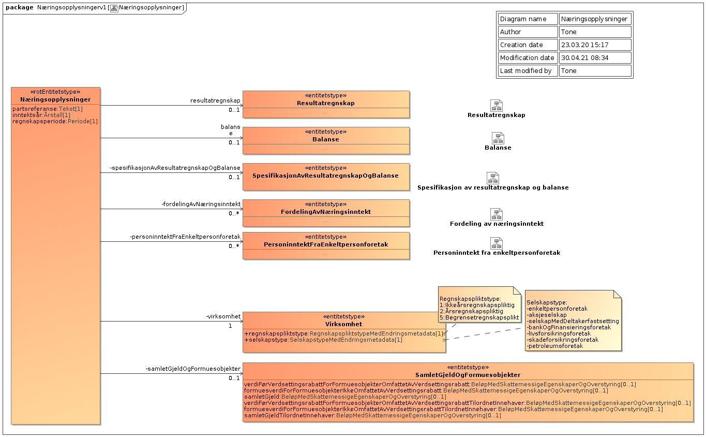

<summary>Tjenesten leverer næringsopplysninger som enkeltpersonforetak og selskaper har innrapportert til Skatteetaten i forbindelse med skattemeldingen.</summary>

<Tabs underline={true}>
<TabItem headerText="Om tjenesten" itemKey="itemKey-1" default>

For generell informasjon om tjenestene se egne sider om:
* [Bruk av tjenestene](../om/bruk.md)
* [Sikkerhetsmekansimer](../om/sikkerhet.md)
* [Rettighetspakker](../om/rettighetspakker.md) 
* [Feilhåndtering](../om/feil.md)
* [Versjonering](../om/versjoner.md)

## Scope
Følgende scope skal benyttes ved autentisering i Maskinporten: `skatteetaten:naeringsspesifikasjon`

## Delegering
Tilgang til denne tjenesten kan delegeres i Altinn, f.eks. dersom leverandør benyttes for den tekniske oppkoblingen. Søk opp følgende tjeneste i Altinn for å delegere tilgangen: `Næringsspesifikasjon API - På vegne av`

## Teknisk spesifikasjon
[Open API spesifikasjon](https://app.swaggerhub.com/apis/Skatteetaten_Deling/naeringsspesifikasjon-api) ligger på SwaggerHub.

I Open API spesifikasjonen ligger URL'er til tjenesten, beskrivelsen av parameterene, endepunkter osv.

Dette API'er er tilgjengelig i 2 versjoner, og URL har ulik oppbygging basert på hvilket inntektsår som etterspørres:
* For inntektsår 2020 benyttes [versjon 1 (v1)](https://app.swaggerhub.com/apis/Skatteetaten_Deling/naeringsspesifikasjon-api/1.0.0)
* For inntektsår 2021 benyttes [versjon 2 (v2)](https://app.swaggerhub.com/apis/Skatteetaten_Deling/naeringsspesifikasjon-api/2.1.0)

## Støttetjeneste
For å følge med på endringer tilbyr vi en [støttetjeneste for hendelsesliste](./hendelser.md): `Næringsspesifikasjon hendelser API`
 
## Datakatalog

[Datatjenestebeskrivelse](https://data.norge.no/dataservices/6ed9209d-c7c0-376f-a4b5-b4ce7cc1933b) i Felles datakatalog.

</TabItem>
<TabItem headerText="Eksempler" itemKey="itemKey-2">

## Curl
Her er et eksempel på en spørring med curl mot tjenesten. Du må ha et gyldig maskinportentoken som legges ved som headerer i curl-kommandoen.

```bash
$ curl -v -H "Authorization: Bearer <maskinporten_token>" "https://api-test.sits.no/api/formueinntekt/naeringsspesifikasjon/v1/ssb/2020/12345678901?gjelderpaaTidspunkt=2020-08-08T12:12:12"
```

## JSON
Eksempel på en gyldig respons for inntektsår 2021 (v2):

```json
{
  "norskIdentifikator": "23037616451",
  "inntektsaar": "2021",
  "resultatregnskap": {
    "driftsinntekt": {
      "sumDriftsinntekt": {
        "beloep": 5000.0
      },
      "salgsinntekt": {
        "id": "1",
        "inntekt": [
          {
            "id": "9bef63f3-c9d3-461f-9dea-a284e9a87a4e",
            "type": "3200",
            "beloep": {
              "beloep": 5000.0
            }
          }
        ]
      }
    },
    "driftskostnad": {
      "sumDriftskostnad": {
        "beloep": 40000.0
      },
      "annenDriftskostnad": {
        "id": "1",
        "kostnad": [
          {
            "id": "76793725-5ed3-4d87-83ff-1f04770120c5",
            "type": "7700",
            "beloep": {
              "beloep": 40000.0
            }
          }
        ]
      }
    },
    "aarsresultat": {
      "beloep": -35000.0
    }
  },
  "beregnetNaeringsinntekt": {
    "fordeltBeregnetNaeringsinntekt": [
      {
        "id": "1",
        "identifikatorForFordeltBeregnetPersoninntekt": "1",
        "identifikatorForFordeltBeregnetNaeringsinntekt": "1",
        "naeringstype": "annenNaering",
        "fordeltSkattemessigResultat": {
          "beloep": -35000.0
        },
        "fordeltSkattemessigResultatEtterKorreksjon": {
          "beloep": -35000.0
        },
        "andelAvFordeltSkattemessigResultatTilordnetInnehaver": 100.0,
        "fordeltSkattemessigResultatEtterKorreksjonTilordnetInnehaver": {
          "beloep": -35000.0
        }
      }
    ],
    "skattemessigResultat": {
      "beloep": -35000.0
    }
  },
  "beregnetPersoninntekt": {
    "fordeltBeregnetPersoninntekt": [
      {
        "id": "1",
        "identifikatorForFordeltBeregnetPersoninntekt": "1",
        "identifikatorForFordeltBeregnetNaeringsinntekt": "1",
        "aaretsBeregnedePersoninntektFoerFordelingOgSamordning": {
          "beloep": -35000.0
        },
        "andelAvPersoninntektTilordnetInnehaver": 100.0,
        "aaretsBeregnedePersoninntektFoerFordelingOgSamordningTilordnetInnehaver": {
          "beloep": -35000.0
        }
      }
    ]
  },
  "virksomhet": {
    "regnskapspliktstype": "1",
    "regnskapsperiode": {
      "start": "2021-01-01T00:00:00+01:00",
      "slutt": "2021-12-31T23:59:59+01:00"
    },
    "virksomhetsstype": "enkeltpersonforetak",
    "regeltypeForAarsregnskap": "regnskapslovensAlminneligeRegler"
  },
  "opprettetDato": "2022-02-09T14:01:29.326+01:00",
  "skjermet": false
}
```

Eksempel på respons for inntektsår 2020 (v1):
```json
{
  "norskIdentifikator": "12345678901",
  "inntektsaar": "2020",
  "regnskapsperiode": {
    "start": "2020-01-01T00:00:00+01:00",
    "slutt": "2020-12-31T23:59:00+01:00"
  },
  "resultatregnskap": {
    "driftsinntekt": {
      "sumDriftsinntekt": {
        "beloep": 832400
      },
      "salgsinntekter": {
        "salgsinntekt": [
          {
            "id": "3300",
            "salgsinntektstype": "3300",
            "beloep": {
              "beloep": -5000
            }
          },
          {
            "id": "3100",
            "salgsinntektstype": "3100",
            "beloep": {
              "beloep": 300000
            }
          },
          {
            "id": "3200",
            "salgsinntektstype": "3200",
            "beloep": {
              "beloep": 150000
            }
          },
          {
            "id": "3000",
            "salgsinntektstype": "3000",
            "beloep": {
              "beloep": 200000
            }
          }
        ],
        "id": "1"
      },
      "andreDriftsinntekter": {
        "annenDriftsinntekt": [
          {
            "id": "3600",
            "annenDriftsinntektstype": "3600",
            "beloep": {
              "beloep": 75000
            }
          },
          {
            "id": "3900",
            "annenDriftsinntektstype": "3900",
            "beloep": {
              "beloep": 40000
            }
          },
          {
            "id": "3695",
            "annenDriftsinntektstype": "3695",
            "beloep": {
              "beloep": 50000
            }
          },
          {
            "id": "3890",
            "annenDriftsinntektstype": "3890",
            "beloep": {
              "beloep": 8000
            }
          },
          {
            "id": "3895",
            "annenDriftsinntektstype": "3895",
            "beloep": {
              "beloep": 14400
            }
          }
        ],
        "id": "1"
      }
    },
    "driftskostnad": {
      "sumDriftskostnad": {
        "beloep": 662859.89
      },
      "varekostnader": {
        "varekostnad": [
          {
            "id": "4005",
            "varekostnadstype": "4005",
            "beloep": {
              "beloep": 150000
            }
          }
        ],
        "id": "1"
      },
      "loennskostnader": {
        "loennskostnad": [
          {
            "id": "5000",
            "loennskostnadstype": "5000",
            "beloep": {
              "beloep": 250000
            }
          },
          {
            "id": "5400",
            "loennskostnadstype": "5400",
            "beloep": {
              "beloep": 30000
            }
          }
        ],
        "id": "1"
      },
      "andreDriftskostnader": {
        "annenDriftskostnad": [
          {
            "id": "6340",
            "annenDriftskostnadstype": "6340",
            "beloep": {
              "beloep": 15000
            }
          },
          {
            "id": "6300",
            "annenDriftskostnadstype": "6300",
            "beloep": {
              "beloep": 30000
            }
          },
          {
            "id": "7099",
            "annenDriftskostnadstype": "7099",
            "beloep": {
              "beloep": -61703.75
            }
          },
          {
            "id": "6200",
            "annenDriftskostnadstype": "6200",
            "beloep": {
              "beloep": 20000
            }
          },
          {
            "id": "7897",
            "annenDriftskostnadstype": "7897",
            "beloep": {
              "beloep": 1363.64
            }
          },
          {
            "id": "7000",
            "annenDriftskostnadstype": "7000",
            "beloep": {
              "beloep": 50000
            }
          },
          {
            "id": "7830",
            "annenDriftskostnadstype": "7830",
            "beloep": {
              "beloep": 15000
            }
          },
          {
            "id": "7700",
            "annenDriftskostnadstype": "7700",
            "beloep": {
              "beloep": 25000
            }
          },
          {
            "id": "6000",
            "annenDriftskostnadstype": "6000",
            "beloep": {
              "beloep": 148200
            }
          },
          {
            "id": "6998",
            "annenDriftskostnadstype": "6998",
            "beloep": {
              "beloep": -10000
            }
          }
        ],
        "id": "1"
      }
    },
    "sumEkstraordinaerPost": {
      "beloep": 0
    },
    "sumSkattekostnad": {
      "beloep": 0
    },
    "aarsresultat": {
      "beloep": 169540.11
    }
  },
  "balanse": {
    "anleggsmiddel": {
      "sumAnleggsmiddelSkattemessigVerdi": {
        "beloep": 966800
      },
      "balanseverdiForAnleggsmidler": {
        "id": "1",
        "balanseverdiForAnleggsmiddel": [
          {
            "id": "1020",
            "anleggsmiddeltype": "1020",
            "skattemessigVerdi": {
              "beloep": 40000
            },
            "overfoeresIkkeTilSkattemeldingen": false
          },
          {
            "id": "1150",
            "anleggsmiddeltype": "1150",
            "skattemessigVerdi": {
              "beloep": 500000
            },
            "overfoeresIkkeTilSkattemeldingen": false
          },
          {
            "id": "1280",
            "anleggsmiddeltype": "1280",
            "skattemessigVerdi": {
              "beloep": 56000
            },
            "overfoeresIkkeTilSkattemeldingen": false
          },
          {
            "id": "1221",
            "anleggsmiddeltype": "1221",
            "skattemessigVerdi": {
              "beloep": 154800
            },
            "overfoeresIkkeTilSkattemeldingen": false
          },
          {
            "id": "1205",
            "anleggsmiddeltype": "1205",
            "skattemessigVerdi": {
              "beloep": 216000
            },
            "overfoeresIkkeTilSkattemeldingen": true
          }
        ]
      }
    },
    "omloepsmiddel": {
      "sumOmloepsmiddelSkattemessigVerdi": {
        "beloep": 406363.64
      },
      "balanseverdiForOmloepsmidler": {
        "id": "1",
        "balanseverdiForOmloepsmiddel": [
          {
            "id": "1400",
            "omloepsmiddeltype": "1400",
            "skattemessigVerdi": {
              "beloep": 70000
            },
            "overfoeresIkkeTilSkattemeldingen": false
          },
          {
            "id": "1500",
            "omloepsmiddeltype": "1500",
            "skattemessigVerdi": {
              "beloep": 100000
            },
            "overfoeresIkkeTilSkattemeldingen": false
          },
          {
            "id": "1530",
            "omloepsmiddeltype": "1530",
            "skattemessigVerdi": {
              "beloep": 36363.64
            },
            "overfoeresIkkeTilSkattemeldingen": false
          },
          {
            "id": "1920",
            "omloepsmiddeltype": "1920",
            "skattemessigVerdi": {
              "beloep": 200000
            },
            "overfoeresIkkeTilSkattemeldingen": true
          }
        ]
      }
    },
    "gjeldOgEgenkapital": {
      "sumLangsiktigGjeldSkattemessigVerdi": {
        "beloep": 120000
      },
      "sumKortsiktigGjeldSkattemessigVerdi": {
        "beloep": 130000
      },
      "sumEgenkapital": {
        "beloep": 1123163.64
      },
      "allLangsiktigGjeld": {
        "langsiktigGjeld": [
          {
            "id": "2220",
            "langsiktigGjeldtype": "2220",
            "skattemessigVerdi": {
              "beloep": 50000
            },
            "overfoeresIkkeTilSkattemeldingen": false
          },
          {
            "id": "2290",
            "langsiktigGjeldtype": "2290",
            "skattemessigVerdi": {
              "beloep": 70000
            },
            "overfoeresIkkeTilSkattemeldingen": true
          }
        ],
        "id": "1"
      },
      "allKortsiktigGjeld": {
        "kortsiktigGjeld": [
          {
            "id": "2990",
            "kortsiktigGjeldtype": "2990",
            "skattemessigVerdi": {
              "beloep": 25000
            },
            "overfoeresIkkeTilSkattemeldingen": false
          },
          {
            "id": "2949",
            "kortsiktigGjeldtype": "2949",
            "skattemessigVerdi": {
              "beloep": 35000
            },
            "overfoeresIkkeTilSkattemeldingen": false
          },
          {
            "id": "2400",
            "kortsiktigGjeldtype": "2400",
            "skattemessigVerdi": {
              "beloep": 70000
            },
            "overfoeresIkkeTilSkattemeldingen": false
          }
        ],
        "id": "1"
      },
      "allEgenkapital": {
        "egenkapital": [
          {
            "id": "2050",
            "egenkapitaltype": "2050",
            "beloep": {
              "beloep": 1045563.64
            }
          },
          {
            "id": "2095",
            "egenkapitaltype": "2095",
            "beloep": {
              "beloep": 45600
            }
          },
          {
            "id": "2096",
            "egenkapitaltype": "2096",
            "beloep": {
              "beloep": 32000
            }
          }
        ],
        "id": "1"
      }
    },
    "sumEiendelSkattemessigVerdi": {
      "beloep": 1373163.64
    },
    "sumGjeldOgEgenkapitalSkattemessigVerdi": {
      "beloep": 1373163.64
    }
  },
  "spesifikasjonAvResultatregnskapOgBalanse": {
    "ikkeAvskrivbartAnleggsmiddel": [
      {
        "id": "b106",
        "objektidentifikator": "tomt",
        "objektbeskrivelse": "Elvefiskeplassen 1",
        "ervervsdato": "2010-01-01",
        "inngaaendeVerdi": {
          "beloep": 600000
        },
        "grunnlagForAvskrivningOgInntektsfoering": {
          "beloep": 500000
        },
        "utgaaendeVerdi": {
          "beloep": 500000
        },
        "naeringsfordeling": [
          {
            "id": "n1",
            "naeringsidentifikator": "Elvefiske",
            "andelBenyttetINaeringen": 100
          }
        ],
        "justeringForAapenbarVerdiendring": {
          "beloep": -100000
        }
      }
    ],
    "saldoavskrevetAnleggsmiddel": [
      {
        "id": "b100",
        "objektidentifikator": "saldo 1",
        "objektbeskrivelse": "saldogruppe a",
        "inngaaendeVerdi": {
          "beloep": 100000
        },
        "offentligTilskudd": {
          "beloep": 20000
        },
        "grunnlagForAvskrivningOgInntektsfoering": {
          "beloep": 80000
        },
        "utgaaendeVerdi": {
          "beloep": 56000
        },
        "naeringsfordeling": [
          {
            "id": "n2",
            "naeringsidentifikator": "Elvefiske",
            "kommunenummer": "0301",
            "andelBenyttetINaeringen": 100
          }
        ],
        "aaretsAvskrivning": {
          "beloep": 24000
        },
        "saldogruppe": "a",
        "avskrivningssats": 30,
        "erDetFysiskeDriftsmidlerIUtgaaendeVerdi": true
      },
      {
        "id": "b103",
        "objektidentifikator": "saldo 4",
        "objektbeskrivelse": "saldogruppe d",
        "inngaaendeVerdi": {
          "beloep": 100000
        },
        "paakostning": {
          "beloep": 180000
        },
        "grunnlagForAvskrivningOgInntektsfoering": {
          "beloep": 280000
        },
        "utgaaendeVerdi": {
          "beloep": 216000
        },
        "naeringsfordeling": [
          {
            "id": "n5",
            "naeringsidentifikator": "Elvefiske",
            "kommunenummer": "0301",
            "andelBenyttetINaeringen": 100
          }
        ],
        "aaretsAvskrivning": {
          "beloep": 64000
        },
        "saldogruppe": "d",
        "avskrivningssats": 20,
        "erDetFysiskeDriftsmidlerIUtgaaendeVerdi": true,
        "grunnlagForStartavskrivning": {
          "beloep": 80000
        },
        "avskrivningssatsForStartavskrivning": 10
      },
      {
        "id": "b102",
        "objektidentifikator": "saldo 3",
        "objektbeskrivelse": "saldogruppe c",
        "inngaaendeVerdi": {
          "beloep": 100000
        },
        "vederlagVedRealisasjonOgUttak": {
          "beloep": 200000
        },
        "grunnlagForAvskrivningOgInntektsfoering": {
          "beloep": -60000
        },
        "utgaaendeVerdi": {
          "beloep": -45600
        },
        "naeringsfordeling": [
          {
            "id": "n4",
            "naeringsidentifikator": "Elvefiske",
            "kommunenummer": "0301",
            "andelBenyttetINaeringen": 100
          }
        ],
        "aaretsInntektsfoeringAvNegativSaldo": {
          "beloep": 14400
        },
        "saldogruppe": "c",
        "avskrivningssats": 24,
        "nyanskaffelse": {
          "beloep": 40000
        },
        "erDetFysiskeDriftsmidlerIUtgaaendeVerdi": true
      },
      {
        "id": "b101",
        "objektidentifikator": "saldo 2",
        "objektbeskrivelse": "skip",
        "ervervsdato": "2018-06-01",
        "inngaaendeVerdi": {
          "beloep": 100000
        },
        "paakostning": {
          "beloep": 80000
        },
        "grunnlagForAvskrivningOgInntektsfoering": {
          "beloep": 180000
        },
        "utgaaendeVerdi": {
          "beloep": 154800
        },
        "naeringsfordeling": [
          {
            "id": "n3",
            "naeringsidentifikator": "Elvefiske",
            "kommunenummer": "0301",
            "andelBenyttetINaeringen": 100
          }
        ],
        "aaretsAvskrivning": {
          "beloep": 25200
        },
        "saldogruppe": "e",
        "avskrivningssats": 14,
        "erDetFysiskeDriftsmidlerIUtgaaendeVerdi": true
      }
    ],
    "lineaertavskrevetAnleggsmiddel": [
      {
        "id": "b105",
        "objektidentifikator": "immaterielt driftsmiddel 2",
        "objektbeskrivelse": "prototype 1",
        "ervervsdato": "2018-01-01",
        "inngaaendeVerdi": {
          "beloep": 60000
        },
        "grunnlagForAvskrivningOgInntektsfoering": {
          "beloep": 60000
        },
        "utgaaendeVerdi": {
          "beloep": 40000
        },
        "naeringsfordeling": [
          {
            "id": "n7",
            "naeringsidentifikator": "Elvefiske",
            "kommunenummer": "0301",
            "andelBenyttetINaeringen": 100
          }
        ],
        "anskaffelseskost": {
          "beloep": 100000
        },
        "levetid": 60,
        "aaretsAvskrivning": {
          "beloep": 20000
        }
      },
      {
        "id": "b104",
        "objektidentifikator": "immaterielt driftsmiddel 1",
        "objektbeskrivelse": "programvare",
        "ervervsdato": "2019-01-01",
        "realisasjonsdato": "2020-09-15",
        "inngaaendeVerdi": {
          "beloep": 100000
        },
        "vederlagVedRealisasjonOgUttak": {
          "beloep": 140000
        },
        "grunnlagForAvskrivningOgInntektsfoering": {
          "beloep": -40000
        },
        "naeringsfordeling": [
          {
            "id": "n6",
            "naeringsidentifikator": "elvefiske",
            "kommunenummer": "0301",
            "andelBenyttetINaeringen": 100,
            "gevinstOgTap": {
              "gevinstOgTapskontoIdentifikator": "g1",
              "gevinstVedRealisasjonOgUttak": {
                "beloep": 25000
              }
            }
          }
        ],
        "gevinstOverfoertTilGevinstOgTapskonto": {
          "beloep": 25000
        },
        "anskaffelseskost": {
          "beloep": 120000
        },
        "levetid": 72,
        "aaretsAvskrivning": {
          "beloep": 15000
        }
      }
    ],
    "transportmiddelINaering": [
      {
        "id": "d1",
        "kjennemerke": "AA12345",
        "registreringsaar": "2018",
        "biltype": "personbil",
        "listeprisSomNy": {
          "beloep": 400000
        },
        "driftskostnader": {
          "beloep": 50000
        },
        "saldoavskrivningPrivatBruk": {
          "beloep": 32271.66
        },
        "antallKilometerYrkeskjoering": 30000,
        "antallKilometerKjoertIAar": 38000,
        "antallMaanederTilDisposisjon": 12,
        "erElektroniskKjoerebokFoertVedroerendeYrkeskjoering": false,
        "erYrkesbilenIBrukPrivat": true,
        "tilbakefoertBilkostnadForPrivatBrukAvYrkesbil": {
          "beloep": 61703.75
        }
      }
    ],
    "gevinstOgTapskonto": [
      {
        "id": "e1",
        "gevinstOgTapskontoIdentifikator": "g1",
        "naeringsidentifikator": "n1",
        "kommunenummer": "0301",
        "inngaaendeVerdi": {
          "beloep": 15000
        },
        "sumGevinstVedRealisasjonOgUttak": {
          "beloep": 25000
        },
        "grunnlagForAaretsInntektsOgFradragsfoering": {
          "beloep": 40000
        },
        "satsForInntektsfoeringOgInntektsfradrag": 20,
        "inntektFraGevinstOgTapskonto": {
          "beloep": 8000
        },
        "utgaaendeVerdi": {
          "beloep": 32000
        }
      }
    ],
    "skattemessigVerdiPaaFordring": {
      "id": "f1",
      "kundefordringOgIkkeFakturertDriftsinntekt": {
        "beloep": 150000
      },
      "konstatertTapPaaKundefordring": {
        "beloep": 15000
      },
      "konstatertTapPaaKundefordringIFjor": {
        "beloep": 10000
      },
      "kredittsalg": {
        "beloep": 600000
      },
      "kredittsalgIFjor": {
        "beloep": 500000
      },
      "skattemessigNedskrivningPaaKundefordring": {
        "beloep": 13636.36
      },
      "skattemessigVerdiPaaKundefordring": {
        "beloep": 136363.64
      },
      "annenFordring": {
        "beloep": 0
      },
      "sumSkattemessigVerdiPaaFordring": {
        "beloep": 136363.64
      }
    }
  },
  "fordelingAvNaeringsinntekt": [
    {
      "id": "h1",
      "identifikatorForFordelingAvNaeringsinntektOgPersoninntekt": "p1",
      "naeringstype": "annenNaering",
      "naeringsbeskrivelse": "Varehandel",
      "skattemessigResultatForNaering": {
        "beloep": 169540.11
      },
      "skattemessigResultatForNaeringEtterKorreksjon": {
        "beloep": 169540.11
      },
      "andelAvSkattemessigResultatTilordnetInnehaver": 100,
      "skattemessigResultatForNaeringEtterKorreksjonTilordnetInnehaver": {
        "beloep": 169540.11
      }
    }
  ],
  "personinntektFraEnkeltpersonforetak": [
    {
      "id": "o1",
      "identifikatorForFordelingAvNaeringsinntektOgPersoninntekt": "p1",
      "rentekostnadPaaForetaksgjeld": {
        "beloep": 15000
      },
      "sumSkjermingsgrunnlagFoerGjeldsfradrag": {
        "beloep": 1113100
      },
      "sumSkjermingsgrunnlagEtterGjeldsfradrag": {
        "beloep": 955600
      },
      "skjermingsfradrag": {
        "beloep": 14334
      },
      "skjermingsrente": 1.5,
      "spesifikasjonAvSkjermingsgrunnlag": [
        {
          "id": "o10",
          "skjermingsgrunnlagstype": "leverandoergjeld",
          "inngaaendeVerdi": {
            "beloep": 90000
          },
          "utgaaendeVerdi": {
            "beloep": 70000
          }
        },
        {
          "id": "o11",
          "skjermingsgrunnlagstype": "foretaksgjeld",
          "inngaaendeVerdi": {
            "beloep": 170000
          },
          "utgaaendeVerdi": {
            "beloep": 145000
          }
        },
        {
          "id": "o6",
          "skjermingsgrunnlagstype": "saldogruppeE",
          "inngaaendeVerdi": {
            "beloep": 100000
          },
          "utgaaendeVerdi": {
            "beloep": 154800
          }
        },
        {
          "id": "o3",
          "skjermingsgrunnlagstype": "saldogruppeA",
          "inngaaendeVerdi": {
            "beloep": 100000
          },
          "utgaaendeVerdi": {
            "beloep": 56000
          }
        },
        {
          "id": "o4",
          "skjermingsgrunnlagstype": "saldogruppeC",
          "inngaaendeVerdi": {
            "beloep": 100000
          },
          "utgaaendeVerdi": {
            "beloep": -45600
          }
        },
        {
          "id": "o5",
          "skjermingsgrunnlagstype": "saldogruppeD",
          "inngaaendeVerdi": {
            "beloep": 100000
          },
          "utgaaendeVerdi": {
            "beloep": 216000
          }
        },
        {
          "id": "o9",
          "skjermingsgrunnlagstype": "kundefordring",
          "inngaaendeVerdi": {
            "beloep": 80000
          },
          "utgaaendeVerdi": {
            "beloep": 100000
          }
        },
        {
          "id": "o2",
          "skjermingsgrunnlagstype": "ikkeAvskrivbartAnleggsmiddel",
          "inngaaendeVerdi": {
            "beloep": 600000
          },
          "utgaaendeVerdi": {
            "beloep": 500000
          }
        },
        {
          "id": "o7",
          "skjermingsgrunnlagstype": "lineaertavskrevetAnleggsmiddel",
          "inngaaendeVerdi": {
            "beloep": 160000
          },
          "utgaaendeVerdi": {
            "beloep": 40000
          }
        },
        {
          "id": "o8",
          "skjermingsgrunnlagstype": "varelager",
          "inngaaendeVerdi": {
            "beloep": 55000
          },
          "utgaaendeVerdi": {
            "beloep": 70000
          }
        }
      ],
      "aaretsBeregnedePersoninntektFoerFordelingOgSamordning": {
        "beloep": 140206.11
      },
      "antallMaanederDrevetIAar": 12
    }
  ],
  "virksomhet": {
    "regnskapspliktstype": "1",
    "selskapstype": "enkeltpersonforetak"
  },
  "samletGjeldOgFormuesobjekter": {
    "id": "1",
    "verdiFoerVerdsettingsrabattForFormuesobjekterOmfattetAvVerdsettingsrabatt": {
      "beloep": 750800
    },
    "formuesverdiForFormuesobjekterIkkeOmfattetAvVerdsettingsrabatt": {
      "beloep": 206363.64
    },
    "samletGjeld": {
      "beloep": 180000
    },
    "verdiFoerVerdsettingsrabattForFormuesobjekterOmfattetAvVerdsettingsrabattTilordnetInnehaver": {
      "beloep": 750800
    },
    "formuesverdiForFormuesobjekterIkkeOmfattetAvVerdsettingsrabattTilordnetInnehaver": {
      "beloep": 406363.64
    },
    "samletGjeldTilordnetInnehaver": {
      "beloep": 180000
    }
  },
  "skjermet": false
}
```
</TabItem>
<TabItem headerText="Feilkoder" itemKey="itemKey-3">

Se egen side for generell info om [feilhåndtering i tjenestene](../om/feil.md).

Tabellen under viser en oversikt over hvilke spesifikke feilkoder denne applikasjonen kan gi. 

| Feilkode | HTTP Statuskode | Feilområde                                                             |
|----------|-----------------|------------------------------------------------------------------------|
| NS-001   | 500             | Uventet feil på tjenesten.                                             |
| NS-002   | 500             | Uventet feil i et bakenforliggende system.                             |
| NS-003   | 404             | Ukjent url benyttet.                                                   |
| NS-004   | 401             | Feil i forbindelse med autentisering.                                  |
| NS-005   | 403             | Feil i forbindelse med autorisering.                                   |
| NS-006   | 400             | Feil i forbindelse med validering av inputdata.                        |
| NS-007   | 404             | Fikk ikke treff på gitt identifikator.                                 |
| NS-008   | 404             | Fant ikke naeringsspesifikasjon for gitt identifikator og inntektsaar. |
| NS-009   | 406             | Feil tilknyttet dataformat. Kun json eller xml er støttet.             |
| NS-010   | 410             | Naeringsspesifikasjon er ikke lenger tilgjenglig.                      |

</TabItem>
<TabItem headerText="Informasjonsmodell" itemKey="itemKey-4">

[Informasjonsmodell](https://data.norge.no/informationmodels/c45bfb1b-766e-386a-b560-c57eca638c1a) i Felles datakatalog.

Obs. Hvis modellene på denne siden avviker fra open api spesifikasjonen på Swaggerhub, er det open api spesifikasjonen som er mest oppdatert.

Modellene nedenfor avviker litt fra modellen slik den benyttes i tjenesten.  Modellen har følgende avvik:
* Part er erstattet med personidentifikator
* Intern systemreferanse er ikke med
* Type Endringsmetadata er ikke med
* Type BeløpIValuta er konvertert til Beløp 
 
## Toppnivå


## Næringsinntekt


## Personinntekt


## Balanse


## Resultatregnskap 


## Avskrivning 


## Spesifikasjon av resultatregnskap og balanse 


</TabItem>
<TabItem headerText="Test" itemKey="itemKey-5">

## Tenor testdatasøk
Det finnes pt. ikke Tenor-adapter for denne tjenesten, og testdata er derfor listet her.

## Testdata
Følgende testdata er tilgjengelige for denne tjenesten i Skatteetatens testmiljø for eksterne: 

| Type skattepliktig | Fødselsnummer | Inntektsår |
|---|---|---|
| Personlig | 05923048059 | 2020 |
| Personlig | 07873349713 | 2020 |
| Personlig | 13819699571 | 2020 |
| Personlig | 14917297003 | 2020 |
| Personlig | 19865698073 | 2020 |
| Personlig | 20848399796 | 2020 |
| Personlig | 22840197615 | 2020 |
| Personlig | 26825798845 | 2020 |
| Personlig | 27820298344 | 2020 |
| Personlig | 28927196982 | 2020 |
| Personlig | 31858698440 | 2020 |
| Personlig | 06880149405 | 2021 |
| Personlig | 12910149871 | 2021 |
| Personlig | 14901848344 | 2021 |
| Personlig | 16881749762 | 2021 |
| Personlig | 23845599750 | 2021 |
| Personlig | 24861048884 | 2021 |
| Personlig | 26851349366 | 2021 |
| Personlig | 27898899360 | 2021 |
| Personlig | 28861349758 | 2021 |
| Personlig | 29840849692 | 2021 |
| Upersonlig | 210962492  | 2021 |
| Upersonlig | 310423076  | 2021 |
| Upersonlig | 310962074  | 2021 |
| Upersonlig | 311768778  | 2021 |
| Upersonlig | 312282933  | 2021 |
| Upersonlig | 312547678  | 2021 |
| Upersonlig | 312737639  | 2021 |
| Upersonlig | 313269906  | 2021 |
| Upersonlig | 313864138  | 2021 |
| Upersonlig | 314093798  | 2021 |
| Upersonlig | 314247914  | 2021 |

</TabItem>
</Tabs>
