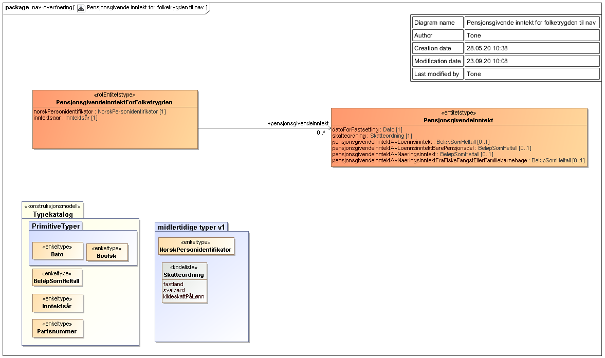

<summary>Tjenesten leverer informasjon om grunnlag for pensjonsopptjening i folketrygden.</summary>

<Tabs underline={true}>
<TabItem headerText="Om tjenesten" itemKey="itemKey-1" default>

For generell informasjon om tjenestene se egne sider om:
* [Bruk av tjenestene](../om/bruk.md)
* [Sikkerhetsmekansimer](../om/sikkerhet.md)
* [Rettighetspakker](../om/rettighetspakker.md) 
* [Feilhåndtering](../om/feil.md)
* [Versjonering](../om/versjoner.md)

## Scope
Følgende scope skal benyttes ved autentisering i Maskinporten: `skatteetaten:pensjonsgivendeinntektforfolketrygden`

## Delegering
Tilgang til denne tjenesten kan delegeres i Altinn, f.eks. dersom leverandør benyttes for den tekniske oppkoblingen. Søk opp følgende tjeneste i Altinn for å delegere tilgangen: `Pensjonsgivende inntekt for folketrygden API - På vegne av`

## Teknisk spesifikasjon

URL har følgede oppbygging:

```bash
GET https://<env>/api/formueinntekt/pensjonsgivendeinntektforfolketrygden/<inntektsaar>/<personidentifikator>
```

* `<env>`: Miljø-spesifikk adresse
* `<inntektsaar>`: Inntektsåret man spør om informasjon for, i formatet YYYY. Tjenesten støtter inntektsår 2017 og utover.
* `<personidentifikator>`: Hvilket fødselsnummer eller D-nummer man spør om informasjon for.

</TabItem>
<TabItem headerText="Eksempler" itemKey="itemKey-2">

## Curl

Her er et eksempel på en spørring med curl mot tjenesten. Du må generere et gyldig [Maskinporten](../om/sikkerhet.md)-token og legge til i header.

```bash
$ curl -v -H "Authorization: Bearer <maskinporten_token>" "https://api-at.sits.no/api/formueinntekt/pensjonsgivendeinntektforfolketrygden/2019/02116049964"
```

## JSON

```json
{
    "norskPersonidentifikator": "02116049964",
    "inntektsaar": 2019,
    "pensjonsgivendeInntekt": [
        {
            "skatteordning": "FASTLAND",
            "datoForFastsetting": "2020-09-27",
            "pensjonsgivendeInntektAvLoennsinntekt": 698219,
            "pensjonsgivendeInntektAvLoennsinntektBarePensjonsdel": null,
            "pensjonsgivendeInntektAvNaeringsinntekt": 150000,
            "pensjonsgivendeInntektAvNaeringsinntektFraFiskeFangstEllerFamiliebarnehage": 85000
        },
        {
            "skatteordning": "SVALBARD",
            "datoForFastsetting": "2020-09-27",
            "pensjonsgivendeInntektAvLoennsinntekt": 492160,
            "pensjonsgivendeInntektAvLoennsinntektBarePensjonsdel": null,
            "pensjonsgivendeInntektAvNaeringsinntekt": 2530000,
            "pensjonsgivendeInntektAvNaeringsinntektFraFiskeFangstEllerFamiliebarnehage": null
        }
    ]
}
```
</TabItem>
<TabItem headerText="Feilkoder" itemKey="itemKey-3">

Se egen side for generell info om [feilhåndtering i tjenestene](../om/feil.md).

Tabellen under viser en oversikt over hvilke spesifikke feilkoder denne applikasjonen kan gi. 

| HTTP status | Feilkode | Feilmelding |
|-------------|----------|-------------|
| 400 | PGIF-005 | Det forespurte inntektsåret er ikke støttet |
| 404 | PGIF-006 | Fant ikke PGI for gitt inntektsår og identifikator |
| 400 | PGIF-007 | Inntektsår har ikke gyldig format |
| 400 | PGIF-008 | Personidentifikator har ikke gyldig format |
| 404 | PGIF-009 | Fant ingen person for gitt identifikator |

</TabItem>
<TabItem headerText="Informasjonsmodell" itemKey="itemKey-4">

JSON-objektet er basert på et XML-dokument med et tilknyttet skjema.

## Rotobjekt

Rotobjektet vil alltid returneres ved en positiv repons.

| Navn på felt | JSON-type | Beskrivelse |
| -------------|-----------|---------------------------------------------------------------|
| personidentifikator | String | Gjeldende personidentifikator for personen det ble søkt på|
| inntektsaar | Number | Inntektsåret det ble søkt på|
| pensjonsgivendeInntekt | Array | En liste med [objekter av pensjonsgivende inntekt](#objekt-i-pensjonsgivendeinntekt-listen) |

## Objekt i pensjonsgivendeInntekt-listen

Definerer objektet som kan ligge i listen pensjonsgivendeInntekt i [rotobjektet](#rotobjekt)

| Navn på felt | JSON-type | Beskrivelse |
| -------------|-----------|----------------------------------------------------------------------------------------------------|
| skatteordning | String | Skatteordningen det leveres data for. Gyldige verdier er: [FASTLAND, SVALBARD, KILDESKATT_PAA_LOENN] |
| datoForFastsetting | String | Dato for fastsetting. Gyldig format [YYYY-MM-DD] (ISO 8601 datoformat) |
| pensjonsgivendeInntektAvLoennsinntekt | Number | Pensjonsgivende lønnsinntekt |
| pensjonsgivendeInntektAvLoennsinntektBarePensjonsdel | Number | Pensjonsgivende lønnsinntekt, bare pensjonsdel |
| pensjonsgivendeInntektAvNaeringsinntekt | Number | Pensjonsgivende inntekt av næringsinntekt |
| pensjonsgivendeInntektAvNaeringsinntektFraFiskeFangstEllerFamiliebarnehage | Number | Pensjonsgivende inntekt av næringsinntekt fra fiske, fangst eller familiebarnehage |

## Informasjonsmodell - skjema

### Oversikt


### XML skjema
[pensjonsgivendeinntektforfolketrygden_nav_overfoering_v1.xsd](../../static/download/pgi-folketrygden/pensjonsgivendeinntektforfolketrygden_nav_overfoering_v1.xsd) 
 
</TabItem>
<TabItem headerText="Test" itemKey="itemKey-5">

## Tenor testdatasøk
Testdata for tjenesten kan finnes i [Tenor](../test/tenor.md) med søket for "Beregnet skatt".
    
</TabItem>
</Tabs>

