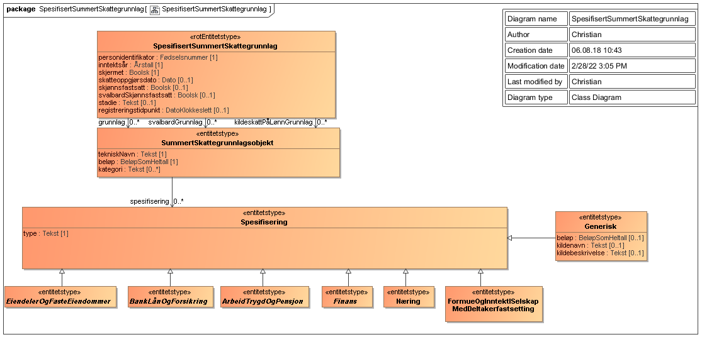
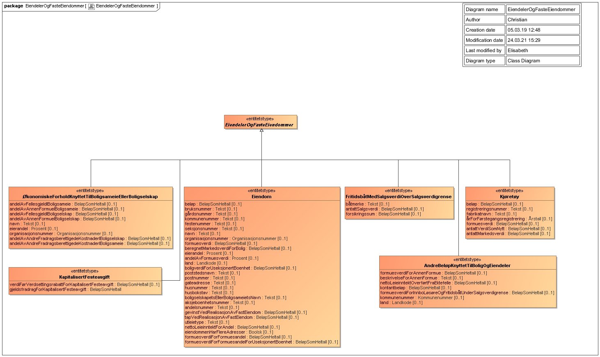
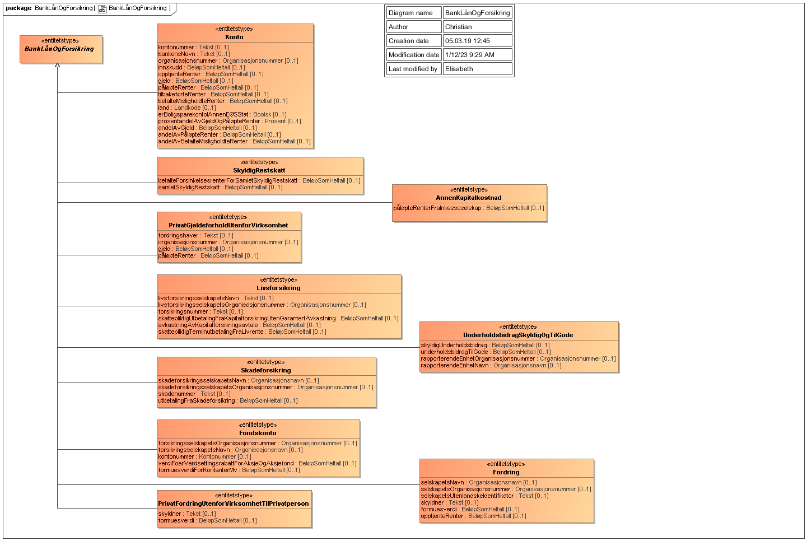
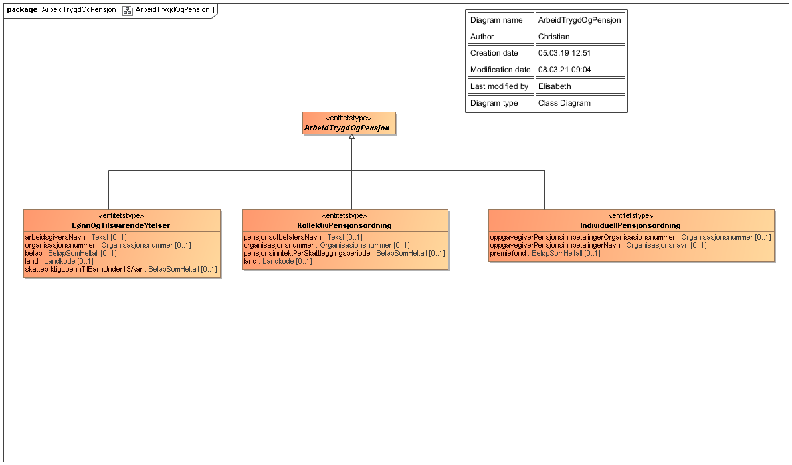
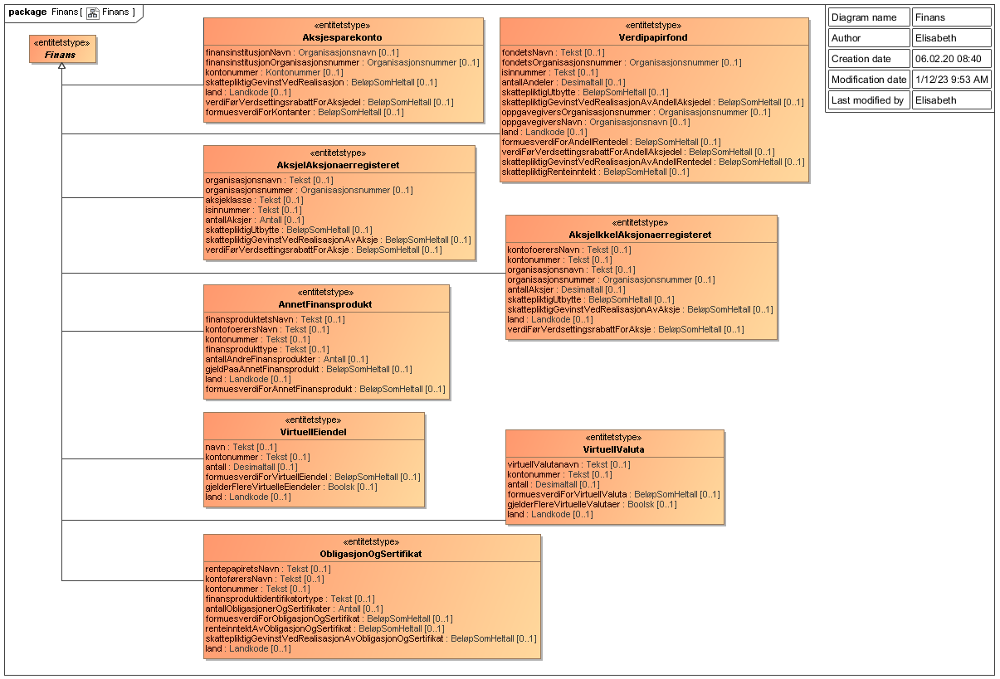
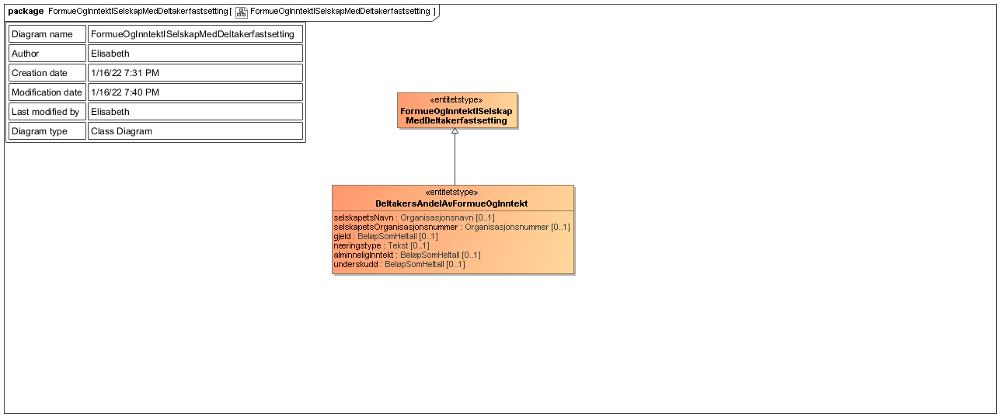

<summary>Tjenesten leverer en oppsummering av formue, gjeld, inntekt og fradrag for en person, inkludert spesifisering av hvilke opplysninger fra skattemeldingen som ligger til grunn.</summary>

<Tabs underline={true}>
<TabItem headerText="Om tjenesten" itemKey="itemKey-1" default>

For generell informasjon om tjenestene se egne sider om:
* [Bruk av tjenestene](../om/bruk.md)
* [Sikkerhetsmekansimer](../om/sikkerhet.md)
* [Rettighetspakker](../om/rettighetspakker.md)
* [Feilhåndtering](../om/feil.md)
* [Versjonering](../om/versjoner.md)

## Scope
Følgende scope skal benyttes ved autentisering i Maskinporten: `skatteetaten:spesifisertsummertskattegrunnlag`

## Delegering
Tilgang til denne tjenesten kan delegeres i Altinn, f.eks. dersom leverandør benyttes for den tekniske oppkoblingen. Søk opp følgende tjeneste i Altinn for å delegere tilgangen: `Spesifisert summert skattegrunnlag API API - På vegne av`

## Teknisk spesifikasjon
[Open API spesifikasjon](https://app.swaggerhub.com/apis/Skatteetaten_Deling/spesifisert-summert-skattegrunnlag-api) ligger på SwaggerHub.

I Open API spesifikasjonen ligger URL'er til tjenesten, beskrivelsen av parameterene, endepunkter osv.
  
Det tilbys to endepunkter for uthenting av spesifisert summert skattegrunnlag, hvor URL har litt ulik oppbygging.
  
```
GET https://{env}/api/formueinntekt/spesifisertsummertskattegrunnlag/{stadie}/{rettighetspakke}/{inntektsaar}/{personidentifikator}
```

I tillegg tilbys et endepunkt uten at stadie spesifiseres. Dette endepunktet vil alltid benytte stadie ‘oppgjoer’. Endepunktet skal utfases og vi ønsker at alle går over til endepunkt hvor stadie spesifiseres.
```
GET https://{env}/api/formueinntekt/spesifisertsummertskattegrunnlag/{rettighetspakke}/{inntektsaar}/{personidentifikator}
```

## Rettighetspakker

| Navn på rettighetspakke |	Stadie | Egenskaper ved rettighetspakke |
|---|---|---|
| husbanken | oppgjoer | Hjemmel |
| navSupplerendeStoenad | oppgjoer og utkast | Hjemmel |
| norgesbank | oppgjoer og utkast | Hjemmel |
| saernamsmann | oppgjoer | Hjemmel |
| sbl | oppgjoer | Krever samtykke |
| sivilrett | oppgjoer, utkast og fastsatt | Hjemmel |
| spkBoliglaan | oppgjoer | Hjemmel |
  
## Samtykke
Tjenesten kan kreve [samtykke](../om/samtykke.md). Datakonsumenter med samtykke har kun lov til å spørre om spesifisert summert skattegrunnlag for siste tilgjengelige inntektsår, og dette kan sjekkes med støttetjenesten [Siste tilgjengelige skatteoppgjør API](./sistetilgjengeligeskatteoppgjoer.md).

| Tjenestekode | Formål | Kommentar |
|---|---|---|
| 4628_210607 | Kreves for rettighetspakke `sbl`| Sanert tjenestekode: 4628_1 |
  
For denne tjenesten er det en  parameter som må følge med:
 
| Parameter | Forklaring | Eksempelverdi |
|---|---|---|
| 4628_210607_inntektsaar | Parameter for Skattegrunnlag | 2017 |
  
## Støttetjenester

### Hendelser
For å følge med på endringer tilbyr vi en [støttetjeneste for hendelsesliste](./hendelser.md): `Skatteoppgjør hendelser API`

### Siste tilgjengelige skatteoppgjør

Virksomheter med samtykke har kun lov til å spørre om summert skattegrunnlag for seneste tilgjengelige *inntektsaar*. [Siste tilgjengelige skatteoppgjør API](./sistetilgjengeligeskatteoppgjoer.md) kan brukes uten samtykke til å sjekke hva som er seneste tilgjengelige inntektsaar for en skattepliktig.
  
## Datakatalog
 
[Datatjenestebeskrivelse](https://data.norge.no/dataservices/8cc670c2-fa13-3f39-ade8-ca21b6ed06e0) i Felles datakatalog.
  
</TabItem>
<TabItem headerText="Eksempler" itemKey="itemKey-2"> 

## Curl
Her er et eksempel på en spørring med curl mot tjenesten. Du må legge sertifikat og nøkkel som parametre til
curl-kommandoen.

```bash
$ curl -v -H "Authorization: Bearer <maskinporten_token>" -H "AltinnSamtykke: <samtykke>" "https://api-test.sits.no/api/formueinntekt/spesifisertsummertskattegrunnlag/sbl/2015/12345678901"
```

## JSON

Her er et eksempel på en respons for inntektsår 2022 uten oppgitt stadie i JSON. Det er lenket til flere eksempler på
responser nedenfor.

```json
{
  "personidentifikator": "12879397780",
  "inntektsaar": "2022",
  "grunnlag": [
    {
      "tekniskNavn": "verdiFoerVerdsettingsrabattForAksjeOgAksjefondIFondskonto",
      "beloep": 30000,
      "spesifisering": [
        {
          "type": "Fondskonto",
          "forsikringsselskapetsNavn": "ACSW",
          "kontonummer": "17",
          "verdiFoerVerdsettingsrabattForAksjeOgAksjefond": 30000,
          "formuesverdiForKontanterMv": 12000
        }
      ],
      "kategori": "formue"
    },
    {
      "tekniskNavn": "formuesverdiForSkogeiendom",
      "beloep": 17888,
      "spesifisering": [
        {
          "type": "Eiendom",
          "bruksnummer": "23",
          "gaardsnummer": "5",
          "kommunenummer": "3813",
          "formuesverdiForFormuesandel": 17888
        }
      ],
      "kategori": "formue"
    },
    {
      "tekniskNavn": "innskudd",
      "beloep": 4000000,
      "kategori": "formue"
    },
    {
      "tekniskNavn": "nettoformue",
      "beloep": 4863814,
      "kategori": "-"
    },
    {
      "tekniskNavn": "bruttoformue",
      "beloep": 5197888,
      "kategori": "-"
    },
    {
      "tekniskNavn": "samletFormuesverdiForOevrigFormue",
      "beloep": 140000,
      "spesifisering": [
        {
          "type": "AndreBeloepKnyttetTilBoligOgEiendeler",
          "formuesverdiForAnnenFormue": 140000,
          "beskrivelseForAnnenFormue": "Opsjoner"
        }
      ],
      "kategori": "formue"
    },
    {
      "tekniskNavn": "verdsettingsrabattForAksjeOgAksjefondIFondskonto",
      "beloep": 7500,
      "kategori": "verdsettingsrabattSomGirGjeldsreduksjon"
    },
    {
      "tekniskNavn": "investeringIOppstartsselskap",
      "beloep": 670000,
      "kategori": "inntektsfradrag"
    },
    {
      "tekniskNavn": "tapOgAnnenKostnadFraVirtuellEiendel",
      "beloep": 20400,
      "kategori": "inntektsfradrag"
    },
    {
      "tekniskNavn": "formuesverdiForVirtuellValuta",
      "beloep": 56000,
      "spesifisering": [
        {
          "type": "VirtuellEiendel",
          "formuesverdiForVirtuellEiendel": 56000,
          "gjelderFlereVirtuelleEiendeler": true
        }
      ],
      "kategori": "formue"
    },
    {
      "tekniskNavn": "gjeldsfradragForKapitalisertFesteavgift",
      "beloep": 66000,
      "spesifisering": [
        {
          "type": "KapitalisertFesteavgift",
          "verdiFoerVerdsettingsrabattForKapitalisertFesteavgift": 66000,
          "gjeldsfradragForKapitalisertFesteavgift": 66000
        }
      ],
      "kategori": "formuesfradrag"
    },
    {
      "tekniskNavn": "oppjustertTilleggTilGevinstVedRealisasjonAvOgUttakFraAksjedelIFondskonto",
      "beloep": 1560,
      "kategori": "oppjusteringAvEierinntekter"
    },
    {
      "tekniskNavn": "formuesverdiForKontanterMvIFondskonto",
      "beloep": 12000,
      "spesifisering": [
        {
          "type": "Fondskonto",
          "forsikringsselskapetsNavn": "ACSW",
          "kontonummer": "17",
          "verdiFoerVerdsettingsrabattForAksjeOgAksjefond": 30000,
          "formuesverdiForKontanterMv": 12000
        }
      ],
      "kategori": "formue"
    },
    {
      "tekniskNavn": "formuesverdiForAnnetFinansprodukt",
      "beloep": 900000,
      "spesifisering": [
        {
          "type": "AnnetFinansprodukt",
          "finansproduktetsNavn": "Hakke peiling",
          "kontofoerersNavn": "Auket",
          "kontonummer": "77",
          "finansprodukttype": "contractForDifference",
          "formuesverdiForAnnetFinansprodukt": 900000
        }
      ],
      "kategori": "formue"
    }
  ],
  "skjermet": false,
  "skatteoppgjoersdato": "2023-02-03",
  "stadie": "oppgjoer",
  "registreringstidpunkt": "2023-02-03T12:53:05Z"
}
```

Eksempel på respons for inntektsår 2018 med oppgitt stadie 'oppgjoer' i JSON.

```json
{
  "personidentifikator": "12345678901",
  "inntektsaar": "2018",
  "grunnlag": [
    {
      "tekniskNavn": "samletFormuesverdiForFastEiendomIUtlandet",
      "beloep": 260000,
      "kategori": "formue"
    },
    {
      "tekniskNavn": "samledePaaloepteRenter",
      "beloep": 25000,
      "spesifisering": [
        {
          "type": "Konto",
          "kontonummer": "12345678903",
          "bankensNavn": "MinEnesteBank",
          "organisasjonsnummer": "123456789",
          "gjeld": 165000,
          "paaloepteRenter": 2500
        },
        {
          "type": "SkyldigRestskatt",
          "betalteForsinkelsesrenterForSamletSkyldigRestskatt": 5000,
          "samletSkyldigRestskatt": 200000
        }
      ],
      "kategori": "inntektsfradrag"
    },
    {
      "tekniskNavn": "kapitalinntektFraSkogbruk",
      "beloep": 15000,
      "kategori": "inntekt"
    },
    {
      "tekniskNavn": "samletLoennsinntektMedTrygdeavgiftspliktOgMedTrekkplikt",
      "beloep": 350000,
      "spesifisering": [
        {
          "type": "LoennOgTilsvarendeYtelser",
          "arbeidsgiversNavn": "Matre Og Inne",
          "organisasjonsnummer": "123456789",
          "beloep": 350000
        }
      ],
      "kategori": "inntekt"
    },
    {
      "tekniskNavn": "utgifterTilPassOgStellAvHjemmevaerendeBarn",
      "beloep": 50000,
      "kategori": "inntektsfradrag"
    },
    {
      "tekniskNavn": "formuesverdiForPrimaerbolig",
      "beloep": 780000,
      "spesifisering": [
        {
          "type": "Eiendom",
          "bruksnummer": "55",
          "gaardsnummer": "39",
          "kommunenummer": "0020",
          "formuesverdi": 780000,
          "beregnetMarkedsverdiForBolig": 5200000,
          "eierandel": 50
        }
      ],
      "kategori": "formue"
    }
  ],
  "skjermet": false,
  "skatteoppgjoersdato": "2019-03-01",
  "stadie": "oppgjoer",
  "registreringstidpunkt": "2019-03-01T16:11:12.985"
}
```

Eksempel på respons for inntektsår 2018 med oppgitt stadie 'oppgjoer' i JSON.

```json
{
  "personidentifikator": "12345678901",
  "inntektsaar": "2018",
  "grunnlag": [
    {
      "tekniskNavn": "samletFormuesverdiForFastEiendomIUtlandet",
      "beloep": 260000,
      "kategori": "formue"
    },
    {
      "tekniskNavn": "samledePaaloepteRenter",
      "beloep": 25000,
      "spesifisering": [
        {
          "type": "Konto",
          "kontonummer": "12345678903",
          "bankensNavn": "MinEnesteBank",
          "organisasjonsnummer": "123456789",
          "gjeld": 165000,
          "paaloepteRenter": 2500
        },
        {
          "type": "SkyldigRestskatt",
          "betalteForsinkelsesrenterForSamletSkyldigRestskatt": 5000,
          "samletSkyldigRestskatt": 200000
        }
      ],
      "kategori": "inntektsfradrag"
    },
    {
      "tekniskNavn": "kapitalinntektFraSkogbruk",
      "beloep": 15000,
      "kategori": "inntekt"
    },
    {
      "tekniskNavn": "samletLoennsinntektMedTrygdeavgiftspliktOgMedTrekkplikt",
      "beloep": 350000,
      "spesifisering": [
        {
          "type": "LoennOgTilsvarendeYtelser",
          "arbeidsgiversNavn": "Matre Og Inne",
          "organisasjonsnummer": "123456789",
          "beloep": 350000
        }
      ],
      "kategori": "inntekt"
    },
    {
      "tekniskNavn": "utgifterTilPassOgStellAvHjemmevaerendeBarn",
      "beloep": 50000,
      "kategori": "inntektsfradrag"
    },
    {
      "tekniskNavn": "formuesverdiForPrimaerbolig",
      "beloep": 780000,
      "spesifisering": [
        {
          "type": "Eiendom",
          "bruksnummer": "55",
          "gaardsnummer": "39",
          "kommunenummer": "0020",
          "formuesverdi": 780000,
          "beregnetMarkedsverdiForBolig": 5200000,
          "eierandel": 50
        }
      ],
      "kategori": "formue"
    }
  ],
  "skjermet": false,
  "skatteoppgjoersdato": "2019-03-01",
  "stadie": "oppgjoer",
  "registreringstidpunkt": "2019-03-01T16:11:12.985"
}
```
[SpesifisertSummertSkattegrunnlag2021.json](../../static/download/spesifisertSummertSkattegrunnlag2021.json)

[SpesifisertSummertSkattegrunnlag2020.json](../../static/download/spesifisertSummertSkattegrunnlag2020.json)

[SpesifisertSummertSkattegrunnlag2018_ordinær.json](../../static/download/spesifisertSummertSkattegrunnlag2018_ordinaer.json)

[SpesifisertSummertSkattegrunnlag2018_pilot.json](../../static/download/spesifisertSummertSkattegrunnlag2018_pilot.json)

[SpesifisertSummertSkattegrunnlag2017.json](../../static/download/spesifisertSummertSkattegrunnlag2017.json)

[SpesifisertSummertSkattegrunnlag2016.json](../../static/download/spesifisertSummertSkattegrunnlag2016.json)

## Samtykke

Gjelder bare brukere som må ha samtykke.

| Tjenestekode | Parametere v/ redirect til Altinn | Eksempel parameter verdi |
|--------------|-----------------------------------|--------------------------|
| 4628_210607 | 4628_210607_inntektsaar | &4628_210607_inntektsaar=2021 |

</TabItem>
<TabItem headerText="Feilkoder" itemKey="itemKey-3">

Se egen side for generell info om [feilhåndtering i tjenestene](../om/feil.md).

Tabellen under viser en oversikt over hvilke spesifikke feilkoder denne applikasjonen kan gi.

| Feilkode | HTTP Statuskode | Feilområde                                                                               |
|----------|-----------------|------------------------------------------------------------------------------------------|
| SSG-001  | 500             | Uventet feil på tjenesten.                                                               |
| SSG-002  | 500             | Uventet feil i et bakenforliggende system.                                               |
| SSG-003  | 404             | Ukjent url benyttet.                                                                     |
| SSG-004  | 401             | Feil i forbindelse med autentisering.                                                    |
| BSA-005  | 403             | Feil i forbindelse med autorisering.                                                     |
| SSG-006  | 400             | Feil i forbindelse med validering av inputdata.                                          |
| SSG-007  | 404             | Ikke treff på oppgitt personidentifikator.                                               |
| SSG-008  | 404             | Ingen spesifisert summert skattegrunnlag funnet for oppgitt identifikator og inntektsår. |
| SSG-009  | 406             | Feil tilknyttet dataformat. Kun json eller xml er støttet.                               |
| SSG-010  | 403             | Feil i forbindelse med samtykketoken.                                                    |
| SSG-011  | 410             | Skattegrunnlag finnes ikke lenger.                                                       | 
  
</TabItem>
<TabItem headerText="Informasjonsmodell" itemKey="itemKey-4">

[Informasjonsmodell](https://data.norge.no/informationmodels/47fa0ecf-eb6f-3e75-a229-643c4d3f52c8) i Felles datakatalog. 

Obs. Hvis modellene på denne siden avviker fra open api spesifikasjonen på Swaggerhub, er det open api spesifikasjonen som er mest oppdatert.

## Årsversjoner

| År | Kodeliste og spesifikasjoner |
|-----------|--------|
| 2016 |  [Summerte skattegrunnlag og spesifikasjoner for 2016](../informasjonsmodeller/spesifisertsummertskattegrunnlag/spesifisertsummertskattegrunnlag2016.md) |
| 2017 |  [Summerte skattegrunnlag og spesifikasjoner for 2017](../informasjonsmodeller/spesifisertsummertskattegrunnlag/spesifisertsummertskattegrunnlag2017.md) |
| 2018 |  [Summerte skattegrunnlag og spesifikasjoner for 2018](../informasjonsmodeller/spesifisertsummertskattegrunnlag/spesifisertsummertskattegrunnlag2018.md) |
| 2019 |  [Summerte skattegrunnlag og spesifikasjoner for 2019](../informasjonsmodeller/spesifisertsummertskattegrunnlag/spesifisertsummertskattegrunnlag2019.md) |
| 2020 |  [Summerte skattegrunnlag og spesifikasjoner for 2020](../informasjonsmodeller/spesifisertsummertskattegrunnlag/spesifisertsummertskattegrunnlag2020.md) |
| 2021 |  [Summerte skattegrunnlag og spesifikasjoner for 2021](../informasjonsmodeller/spesifisertsummertskattegrunnlag/spesifisertsummertskattegrunnlag2021.md) |

## Informasjonsmodell - skjema

### Oversikt


### Eiendeler og faste eiendommer


### Bank, lån og forsikring


### Arbeid, trygd og pensjon 


### Finans 


### Næring 


### Formue og inntekt i selskap med deltakerfastsetting 

  
Tilleggsinformasjon:
* I 2018 komm spesifikasjonene til spesifisert summert skattegrunnlag fra to forskjellige løyper: ordinær og pilot. For
en detaljert beskrivelse av hva dette innebærer, se [Spesifikasjonstyper for spesifisert summert skattegrunnlag 2018](../informasjonsmodeller/spesifisertsummertskattegrunnlag/spesifisertsummertskattegrunnlag2018_spesifikasjoner.md)
* For 2015 og 2016 er Svalbard- og fastlandsinformasjon summert sammen. Fra og med 2017 er Svalbard-data skilt ut i
  svalbardSkjoennsfastsatt og svalbardGrunnlag.
* Fra og med 2018 er feltene skjoennsfastsatt og svalbardSkjoennsfastsatt fjernet.

</TabItem>
<TabItem headerText="Test" itemKey="itemKey-5">

## Tenor testdatasøk
  
Testdata for tjenesten kan finnes i [Tenor](../test/tenor.md) med søket for "Spesifisert summert skattegrunnlag".
  
</TabItem>
</Tabs>


