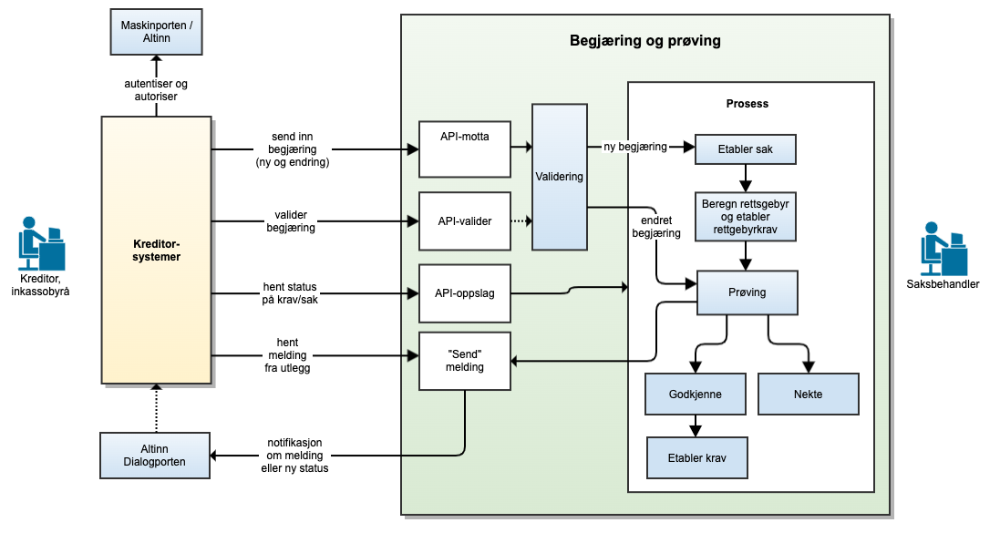
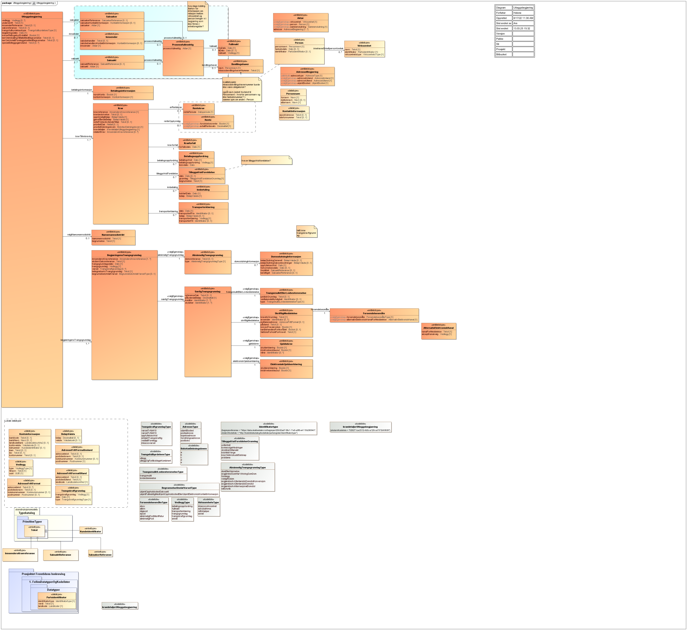

<Summary>English summary for Utleggsbegjaering API.</Summary>

<Tabs underline={true}>
</TabItem>
<TabItem headerText="Syllabus" itemKey="itemKey-2"> 

| Norwegian term | English translation | Description                                                    |
|----------------|---------------------|----------------------------------------------------------------|
| Dialogporten   | The dialogue <br> gateway            | Uventet feil på tjenesten.                                         |
| Maskinporten   | Machine-tomachine <br> gateway      | Uventet feil i et bakenforliggende system.                         |
| Namsmann       | 404             | Ukjent url benyttet.                                               |
| KB-004         | 401             | Feil i forbindelse med autentisering.                              |
| KB-005         | 403             | Feil i forbindelse med samtykketoken.                              |
| KB-006         | 400             | Feil i forbindelse med validering av inputdata.                    |
| KB-007         | 404             | Fant ingen krav/betalinger på angitt identifikator og periode.     |
| KB-008         | 406             | Feil tilknyttet dataformat. Kun json eller xml er støttet.         |
| KB-009         | 404             | Ingen treff på oppgitt identifikator.                              |


<TabItem headerText="About the service" itemKey="itemKey-1" default>
The target audience includes current debt collection systems, municipalities, and other system providers.
If you wish to integrate the Utleggsbegjæring and prøving service into your system, or if you have any related questions, please contact: fremtidensinnkreving@skatteetaten.no.

The diagram below illustrates the overall services the Norwegian Tax Administration will offer for the receipt and assessment of Utleggsbegjæring. Please note that the diagram represents a target state, and not all services shown have been implemented yet. Additional services not included in the diagram may also be introduced in the future


[](../../../../static/download/Utleggsbegjaering_oversikt.png)


For information about the services see:

* [Sikkerhetsmekansimer](../../../../../docs/om/sikkerhet.md)
* [Systembruker](../../../../../docs/om/systembruker.md)
* [Feilhåndtering](../../../../../docs/om/feil.md)
* [Versjonering](../../../../../docs/om/versjoner.md)
* [Teknisk spesifikasjon](../../../../../docs/om/tekniskspesifikasjon.md)

### Altinn Dialogporten
suppliers are not required to integrate with Dialogporten, either during the pilot phase or in full production. It will be sufficient to use only the API endpoints.
However, through Dialogporten, we will offer an event notification service that alerts users when new messages from the Norwegian Tax Administration are available—such as requests to correct a previously submitted enforcement request.
If you choose not to use the notification service, you must regularly check for new messages by polling the agency’s API.

### Follow up and support
During the testing phase, we will provide support to system providers throughout development and testing.
More information will be made available here.

In the meantime, please contact: fremtidensinnkreving@skatteetaten.no.

## Scope

The following scope is to be used when authenticating in Maskinporten: `skatteetaten:utleggsbegjaering`

## Delegering

Tilgang til dette API-et kan delegeres i Altinn, f.eks. dersom leverandør benyttes for den tekniske oppkoblingen. Søk
opp følgende tjeneste i Altinn for å delegere tilgangen: `Utleggstrekkbegjæring API - På vegne av`

## Teknisk spesifikasjon

URL-er til API-et, beskrivelsen av parameterne, endepunkter og respons ligger
i [Open API spesifikasjonen](https://app.swaggerhub.com/apis/skatteetaten/utleggsbegjaering-app) på SwaggerHub.

## Datakatalog

Dette API-et finnes foreløpig ikke i Felles datakatalog.

## Access to the service
Connection to the Tax Administration's test environment is done via Maskinporten. To obtain a token from Maskinporten, the debt collection system must use its enterprise certificate to specify which Organisasjonsnummer it represents. This organisasjonsnummer  must be approved by the Tax Administration.

To use the services for submitting Utleggsbegjæring, the following scope must be specified during authentication with Maskinporten: skatteetaten:utleggsbegjaering
The API supports two authentication methods via Maskinporten, as described below

### Option 1 – System Provider as Submitter
If the system provider only submits utleggsbegjæring on behalf of their own organization, classic authentication via Maskinporten can be used. More information is available here.

### Option 2 – Systembruker
If the system provider wants to offer functionality where another organization (a customer of the system provider) uses the system to submit utleggsbegjæringer, Altinn's new functionality for Systembruker must be used. More information can be found in Altinn System User for SBS and the System User Roadmap.
In order to use Systembruker functionality, the system provider must register in Maskinporten and the Altinn test environment.

[Read about Systembruker here](https://skatteetaten.github.io/api-dokumentasjon/om/systembruker)

### Test setup
Use any fictional organizations from Tenor as the submitter of the utleggsbegjæring.

### Option 1 - Testing with System Provider as Submitter
When the system provider is the submitter, any fictional organizations in Tenor can be used.

### Option 2 - Testing with System User
The selected organization in Tenor (representing a test debt collection company) must approve that its business system is allowed to use the resource/service "Submission and follow-up of enforcement requests" on behalf of the company.
A Systembruker is then created, linking the user, system, provider, and API.

</TabItem>
<TabItem headerText="Eksempler" itemKey="itemKey-2"> 

## Åpne krav

### Eksempel på request URL

```
```

### Eksempel på respons


</TabItem>
<TabItem headerText="Feilkoder" itemKey="itemKey-3">

Se egen side for generell info om [feilhåndtering i tjenestene](../../../docs/om/feil.md).

Tabellen under viser en oversikt over hvilke spesifikke feilkoder denne applikasjonen kan gi. Feilmeldingen vil kunne variere selv om samme feilkode returneres. Dette er for å kunne gi en så presis beskrivelse av feilen som mulig. 

| Feilkode | HTTP Statuskode | Feilområde                                                     |
|----------|-----------------|----------------------------------------------------------------|
| KB-001   | 500             | Uventet feil på tjenesten.                                     |
| KB-002   | 500             | Uventet feil i et bakenforliggende system.                     |
| KB-003   | 404             | Ukjent url benyttet.                                           |
| KB-004   | 401             | Feil i forbindelse med autentisering.                          |
| KB-005   | 403             | Feil i forbindelse med samtykketoken.                          |
| KB-006   | 400             | Feil i forbindelse med validering av inputdata.                |
| KB-007   | 404             | Fant ingen krav/betalinger på angitt identifikator og periode. |
| KB-008   | 406             | Feil tilknyttet dataformat. Kun json eller xml er støttet.     |
| KB-009   | 404             | Ingen treff på oppgitt identifikator.                          |

</TabItem>
<TabItem headerText="Informasjonsmodell" itemKey="itemKey-4">

Her ser du hele informasjonsmodellen for Utleggsbegjæring

[](../../../../static/download/informasjonsmodell-utleggsbegjaering.png)

| Vilkårnavn                   | Gjelder kun ved endring | Tittel                 |Beskrivelse                |Avvikstekst
|------------------------------|-------------------------|------------------------|---------------------------|---------------------|
| DUPLIKAT_INNSENDING          | Nei                     |Duplikat                |Duplikat innsending        |
| KB-002                       | 500                     |                        |
| KB-003                       | 404                     |                                        |
| KB-004                       | 401                     |                           |
| KB-005                       | 403                     | Feil i forbindelse med samtykketoken.                          |
| KB-006                       | 400                     | Feil i forbindelse med validering av inputdata.                |
| KB-007                       | 404                     | Fant ingen krav/betalinger på angitt identifikator og periode. |
| KB-008                       | 406                     | Feil tilknyttet dataformat. Kun json eller xml er støttet.     |
| KB-009                       | 404                     | Ingen treff på oppgitt identifikator.                          |


</TabItem>
<TabItem headerText="Test" itemKey="itemKey-5">

## Testing
### Requirements for trial run
System providers are responsible for conducting their own testing. The focus should be on ensuring that the validation and submission services function as expected. The project team will assist with troubleshooting, error correction (if needed), and follow-up on cases submitted to the test environment.

### Test Environment and Test Data
System providers must use test environments that contain only synthetic data. Test data from Syntetisk Norge must be used and retrieved using Tenor Test Data Search for the messages submitted. Attachments must also contain only synthetic test data. A user guide for Tenor Test Data Search is available. Connection to the Tax Administration's test environment is established via Maskinporten.
An example of an enforcement request that follows the information model is provided under Information Models.

The Tax Administration’s test environment is generally available 24/7, but technical support or environment restarts cannot be expected outside normal business hours (08:00–15:45 on weekdays). The environment may also be unavailable during evenings and weekends due to maintenance.

The URL for the test environment is: https://api-test.sits.no/api/utleggsbegjaering/v1


</TabItem>
</Tabs>
