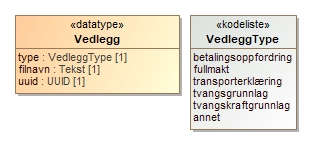
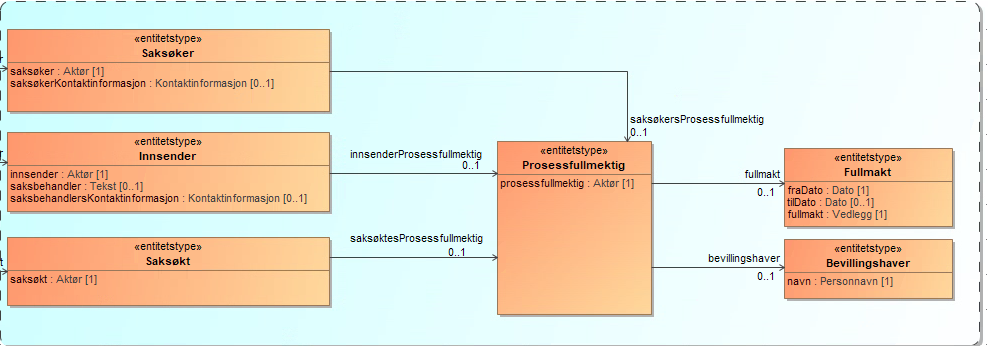
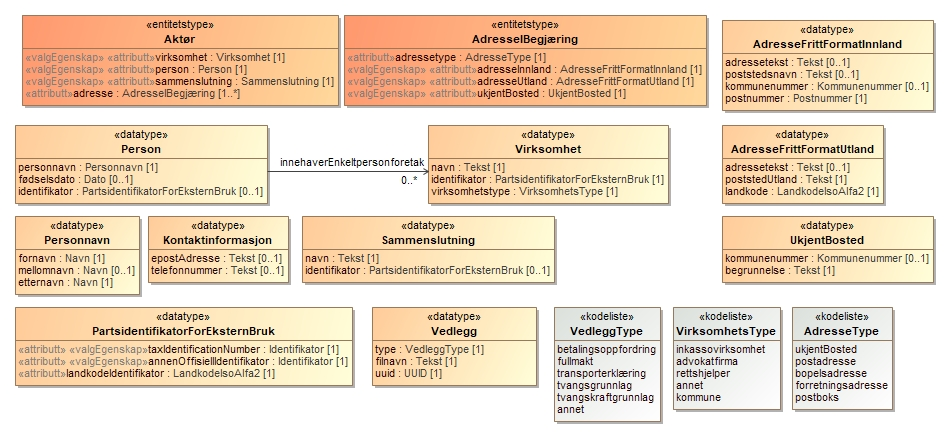

<Summary>English summary for Utleggsbegjaering API.</Summary>

<Tabs underline={true}>
<TabItem headerText="About the service" itemKey="itemKey-1" default>
The target audience includes current debt collection systems, municipalities, and other system providers.
If you wish to integrate the Utleggsbegjæring and prøving service into your system, or if you have any related questions, please contact: fremtidensinnkreving@skatteetaten.no.

The diagram below illustrates the overall services the Norwegian Tax Administration will offer for the receipt and assessment of Utleggsbegjæring. Please note that the diagram represents a target state, and not all services shown have been implemented yet. Additional services not included in the diagram may also be introduced in the future 


[Informasjonsmodell](../../../../../static/download/utleggsbegjaering/Utleggsbegjaering_oversikt.png)


For information about the services see:

* [Sikkerhetsmekansimer](../../../../../docs/om/sikkerhet.md)
* [Systembruker](../../../../../docs/om/systembruker.md)
* [Feilhåndtering](../../../../../docs/om/feil.md)
* [Versjonering](../../../../../docs/om/versjoner.md)
* [Teknisk spesifikasjon](../../../../../docs/om/tekniskspesifikasjon.md)

### Altinn Dialogue gateway
Suppliers are not required to integrate with Dialogporten, either during the pilot phase or in full production. It will be sufficient to use only the API endpoints.
However, through Dialogporten, we will offer an event notification service that alerts users when new messages from the Norwegian Tax Administration are available—such as requests to correct a previously submitted enforcement request.
If you choose not to use the notification service, you must regularly check for new messages by polling the agency’s API.

### Follow up and support
During the testing phase, we will provide support to system providers throughout development and testing.
More information will be made available here.

In the meantime, please contact: fremtidensinnkreving@skatteetaten.no.

## Scope

The following scope is to be used when authenticating in Maskinporten: `skatteetaten:utleggsbegjaering`

## Delegation

Tilgang til dette API-et kan delegeres i Altinn, f.eks. dersom leverandør benyttes for den tekniske oppkoblingen. Søk
opp følgende tjeneste i Altinn for å delegere tilgangen: `Utleggstrekkbegjæring API - På vegne av`

## Technical specification

URL-er til API-et, beskrivelsen av parameterne, endepunkter og respons ligger
i [Open API spesifikasjonen](https://app.swaggerhub.com/apis/skatteetaten/utleggsbegjaering-app) på SwaggerHub.

## Data catalogue

This API is currently not available in the data catalogue
 
## Access to the service
Connection to the Tax Administration's test environment is done via Maskinporten. To obtain a token from Maskinporten, the debt collection system must use its enterprise certificate to specify which Organisasjonsnummer it represents. This organisasjonsnummer  must be approved by the Tax Administration.

To use the services for submitting Utleggsbegjæring, the following scope must be specified during authentication with Maskinporten: skatteetaten:utleggsbegjaering
The API supports two authentication methods via Maskinporten, as described below

### Option 1 – System Provider as Submitter
If the system provider only submits utleggsbegjæring on behalf of their own organization, classic authentication via Maskinporten can be used. More information is available here.

### Option 2 – Systembruker
If the system provider wants to offer functionality where another organization (a customer of the system provider) uses the system to submit utleggsbegjæringer, Altinn's new functionality for Systembruker must be used. More information can be found in Altinn System User for SBS and the System User Roadmap.
In order to use Systembruker functionality, the system provider must register in Maskinporten and the Altinn test environment.

[Read about Systembruker here](https://skatteetaten.github.io/api-dokumentasjon/om/systembruker)

### Test setup
Use any fictional organizations from Tenor as the submitter of the utleggsbegjæring.

### Option 1 - Testing with System Provider as Submitter
When the system provider is the submitter, any fictional organizations in Tenor can be used.

### Option 2 - Testing with System User
The selected organization in Tenor (representing a test debt collection company) must approve that its business system is allowed to use the resource/service "Submission and follow-up of enforcement requests" on behalf of the company.
A Systembruker is then created, linking the user, system, provider, and API.

</TabItem>
<TabItem headerText="Syllabus" itemKey="itemKey-2"> 

| Norwegian term          | English translation      | Description                                                    |
|-------------------------|---------------------------|----------------------------------------------------------------|
| Betjeningskartet        | Routing map               | Betjeningskartet is an API that allows the debt collection agency to ascertain if a Utleggsbegjæring should be sent according to the old or new rules |
| Dialogporten            | The dialogue gateway      | Dialogporten is a national message distribution service in Norway that allows public agencies to send digital messages and notifications to individuals and organizations. It functions as a standardized interface for delivering messages across platforms like Altinn, Digital post to citizens, Digital post to businesses. |
| Maskinporten            | Machine-to-machine gateway | Maskinporten is a secure authentication and authorization mechanism used in Norway for system-to-system (machine-to-machine) communication between public and private sector systems. It issues tokens (OAuth 2.0) that allow systems to authenticate and access APIs on behalf of an organization, without involving a human user.|
| Namsmann                | Enforcement officer       | A public authority responsible for carrying out enforcement of claims, such as collecting unpaid debts or executing court orders. This can include wage garnishment, seizure of assets, evictions and enforcement of judgments. |
| Organisasjonsnummer     | Organisation number       | Nine-digit, information-free number that uniquely identifies entities in the Central Coordinating Register for Legal Entities (Enhetsregisteret). |
| Systembruker            | System user               | System User is a concept for API authentication. The system user is linked to the chosen system/system provider and assigned the necessary rights. |
| SBS                     | End user system           | A software solution used directly by organizations to manage specific business processes. |
| Syntetisk Norge/ Tenor  | Synthetic Norway          | A test data framework used in Norway for developing and testing digital solutions—especially those that interact with public sector systems—without using real personal data. Including a collection of synthetic (fake but realistic) people and organizations, national ID numbers, names, addresses, company info, etc.designed to mimic real-world scenarios while ensuring compliance with privacy regulations (e.g., GDPR). |
| Tvangsgrunnlag          | Base for execution        | Judgment, legal provision, promissory note, or other basis that allows a claim to be enforced. |
| Trekkpålegg             | Witholding order          | A formal order issued by a public authority requiring an employer or other payer to withhold a portion of an individual's income—typically wages or benefits—and transfer it to cover unpaid debts. |
| Trekkpliktig            | Subject to witholding     | An employer or entity that is legally obligated to withhold funds from an individual's salary and transfer it to the relevant authority (e.g., the Tax Administration). |
| Trekkmelding            | Garnishment message       | A trekkmelding is a digital message or data package that contains information about a wage garnishment order or similar withholding instruction. It is typically sent from the Norwegian Tax Administration to employers or their systems (SBS – end-user systems). |
| Utleggsbegjæring        | Request for Enforcement Proceedings | A formal request submitted to the namsmann (Enforcement Officer) to collect a debt by legal means, such as wage garnishment, seizure of assets and freezing of bank accounts. |

</TabItem>

<TabItem headerText="Transitional period" itemKey="itemKey-Overgangsperioden">

## Introduction of the new collection act
During a transitional period (from January 1, 2026 to December 31, 2026), the Enforcement Officer (“namsmannen”) will gradually process new enforcement cases against debtors under the new Collection Act (innkrevingsloven) and the related amendments to the Enforcement Act (tvangsfullbyrdelsesloven).
The authorities may define which debtors are subject to the new enforcement rules based on predefined criteria. These criteria are established in regulations.
Throughout the transition period, these parameters will be gradually adjusted so that an increasing number of debtors fall under the scope of the new rules. Any change in the regulation will be published no later than 14 days before it takes effect. The parameters are set in the delegation decision: Delegation of the King’s authority under the Collection Act § 40 (2) and (3) to the Ministry of Finance. [Delegering av kongens myndighet etter innkrevingsloven § 40 andre og tredje ledd til Finansdepartementet](https://lovdata.no/dokument/DEL/forskrift/2025-06-10-968).

## Transitional period for enforcement requests
During the transition period digital enforcement requests (utleggsbegjæringer) for debtors covered by the new Collection Act must be submitted via the new system ELAN. Enforcement requests for debtors not covered by the new Act must continue to be submitted through the existing system ELSA.
If an enforcement request involves multiple debtors, all debtors must fall under the same legal framework. If that is not the case, the request must be submitted on paper.

## The "Betjeningskartet" service
To determine whether a debtor is subject to the new or old legal framework, collection systems can use the API service “Betjeningskartet”. This API allows a lookup of the applicable framework for one or more debtors based on their personal identificationnumber (fødselsnummer). The service should be called immediately before submitting a new enforcement request via API, ensuring that the request is directed to the correct system (ELSA or ELAN).
API endpoints, parameters, and response definitions are documented in the [Open API specifikaction](https://app.swaggerhub.com/apis/skatteetaten/utleggsbegjaering-app) on SwaggerHub.


If an enforcement request is submitted to the wrong system, it will be rejected with an error message. For ELAN, the response will be an HTTP 422 error with the message:SAKSOEKT_GAMMELT_REGELVERK

</TabItem>

<TabItem headerText="Error codes" itemKey="itemKey-4">

See separate page (Norwegian) for general information concerning [feilhåndtering i tjenestene](../om/feil.md).

The table below provides an overview of various types of validation errors that may occur when submitting or modifying a disbursement request. If the content of the request is syntactically correct but contains semantic errors, the service will return error code 422 along with a list of errors according to the table below.

| Vilkårnavn | Gjelder kun endringer | Tittel | Beskrivelse | Avvikstekst |
| :--- | :--- | :--- | :--- | :--- |
| DUPLIKAT_INNSENDING | Nei | Duplikat | Duplikat innsending | Sak med begjæringsdato %begjæringsdato og referanse %innsenderReferanse er allerede sendt inn |
| DUPLIKAT_SAKSOEKER | Nei | Duplikat saksøker | Det er ikke tillatt med duplikate saksøkere | Det er ikke tillatt med duplikate saksøkere |
| DUPLIKAT_SAKSOEKT | Nei | Duplikat saksøkt | Det er ikke tillatt med duplikate saksøkte | Det er ikke tillatt med duplikate saksøkte |
| GEBYR_ELLER_SAKSKOSTNAD_HAR_ET_RELATERTKRAV_SOM_IKKE_ER_HOVEDSTOL | Nei | Uriktig eller manglende relasjon til hovedstol | Gebyr eller sakskostnad kan kun relateres til hovedstol | Kravet kan kun relateres til et krav av typen hovedstol. |
| HOVEDSTOL_SKAL_IKKE_HA_ET_RELATERT_KRAV | Nei | Hovedstol har et relatert krav | En hovedstol skal ikke ha en relatert krav | Hovedstol har et relatert krav |
| INNSENDER_IKKE_IDENTIFISERBAR | Nei | Ukjent innsender | Begjæringen må angi en innsender som kan identifiseres | Innsender %innsender kan ikke identifiseres |
| INNSENDER_IKKE_ORGANISASJON | Nei | Innsender er ikke en organisasjon | Innsender må være en organisasjon | Innsender %innsender er ikke en organisasjon |
| INNSENDER_MANGLER | Nei | Mangler opplysninger om innsender | Begjæringen må inneholde opplysning om innsender | Begjæringen må inneholde opplysning om innsender |
| INNSENDER_SAMSVARER_IKKE_MED_AUTENTISERING | Nei | Innsender er ikke autentisert korrekt | Innsender må være autentisert | Innsenders organisasjonsnummer %innsenderOrgnr, som angitt i begjæringen, avviker fra pålogget virksomhet, %påloggetOrgnr |
| KAN_BEHANDLES_I_FORLIKSRAADET_PAAKREVET | Nei | Ønskes saken behandlet i Forliksrådet? | Begjæringen skal opplyse om saksøker ønsker behandling i forliksrådet dersom saksøkte reiser innvendinger mot kravet | Må angi hvorvidt saken ønskes behandlet i Forliksrådet |
| KRAV_DUPLIKATE_REFERANSER | Nei | Krav har ikke unike kravreferanser | Begjæringens krav må ha unike kravreferanser | Det foreligger flere krav med kravreferanse %kravreferanse |
| KRAV_IKKE_BENYTTET | Nei | Begjæringen inneholder krav som ikke er dokumentert gjennom tvangsgrunnlag | Alle krav lagt til i begjæringen må dokumenteres | Krav med kravreferanse %kravreferanse er ikke referert til fra begjaeringens tvangsgrunnlag |
| KRAV_I_FLERE_TVANGSGRUNNLAG | Nei | Krav i flere tvangsgrunnlag | Et krav kan ikke inngå i flere tvangsgrunnlag | Et krav kan ikke inngå i flere tvangsgrunnlag |
| MAKS_EN_ADRESSE_AV_HVER_TYPE | Nei | Maks en adresse av hver type | En aktør kan kun ha en adresse av hver type | Man kan kun definere en adresse av type %ukjentBosted, postadresse, bopelsadresse, forretningsadresse, postboks |
| MANGELFULLE_KONTOOPPLYSNINGER | Nei | Kontoopplysninger er mangelfulle | Kontoopplysninger må være gyldige | Konto må inneholde minst en verdi |
| MANGLER_KRAV | Nei | Begjæringen refererer ikke til noen krav | Det må finnes minimum ett krav | Krav mangler |
| MANGLER_OPPLYSNINGER_BEVILLINGSHAVER | Nei | Opplysninger om bevillingshaver mangler | Inkassobyrået må oppgi en bevillingshaver | Inkassobyrået %prosessfullmektig må oppgi bevillingshaver |
| MANGLER_OPPLYSNINGER_OM_SAKSOEKER | Nei | Mangler opplysninger om saksøker | Begjæring må inneholde et minimum av opplysninger for å identifisere saksøker | Saksøker %saksøker må oppgis med en av<br/>- orgnummer og navn<br/>- navn og adresse<br/>- personlig identifikator, etternavn og fornavn<br/>- fødselsdato, etternavn og fornavn |
| MANGLER_OPPLYSNINGER_OM_SAKSOEKT | Nei | Opplysninger om saksøkte mangler | Begjæring må inneholde et minimum av opplysninger for å identifisere saksøkt | Saksøkte %saksøkt må oppgis med en av<br/>- personlig identifikator, minst ett etternavn og fornavn<br/>- fødselsdato, etternavn, fornavn og adresse<br/>- orgnummer og navn |
| MANGLER_OPPLYSNINGER_PROSESSFULLMEKTIG_PERSON | Nei | Opplysninger om prosessfullmektig mangler | Begjæring skal inneholde prosessfullmektigens orgnummer eller navn og adresse dersom kreditoren benytter prosessfullmektig | Prosessfullmektig %prosessfullmektig må oppgis med<br/>- Fullt navn <br/>- Adresse |
| PAASTAND_PAAKREVET | Nei | Påstand må fylles ut | Påstand om resultat klager krever ved evt. dom | Ved utlegg og forliksklage kombinert må påstand være utfylt |
| PARAGRAF_4_18_VARSEL_PAAKREVET | Nei | § 4-18 Varsel må fylles ut | Feltet "Varsel" må fylles ut | For særlige tvangsgrunnlag må varsel etter tvangsfullbyrdelsesloven § 4-18 eller begrunnelse for manglende varsel være utfylt |
| PARAGRAF_4_19_VARSEL_PAAKREVET | Nei | § 4-19 Varsel må fylles ut | Feltet "Varsel" må fylles ut | Varsel etter tvangsfullbyrdelsesloven § 4-19 eller begrunnelse for manglende varsel må være utfylt |
| PRIORITET_MANGLER | Nei | Manglende angivelse av prioritet på kravet | Hvis prioritet er angitt, så må det angis på alle. | Hvis dere har angitt prioritet på en av kravspostene, må det også angis på de øvrige kravspostene |
| PRIORITET_MANGLER_PÅ_RENTEOPPLYSNINGER | Nei | Prioritet angitt på ett krav men mangler på renter frem i tid | Må melde inn prioritet på renter som skal påløpe senere på alle kravlinjer som er rentebærende, når det er satt prioritet på minst et annet krav (ref. regel I7). Kravlinje for kravlinje.  | Hvis dere har angitt prioritet på en av kravspostene så må det også angis prioritet på fremtidige renteposter |
| PRIORITET_MANGLER_PÅ_RETTSGEBYR | Nei | Manglende angivelse av prioritet på kravet | Gebyr: Må angi prioritet på rettsgebyret hvis saksøkte skal betale dette og det er satt prioritet på minst et annet krav (ref. regel I7) | Hvis dere har angitt prioritet på en av kravspostene så må det også angis for rettsgebyret |
| RELATERTE_KRAV_KAN_IKKE_PEKE_PÅ_SEG_SELV | Nei | Relaterte krav kan ikke peke på seg selv | Relaterte krav kan ikke peke på seg selv | Relaterte krav kan ikke peke på seg selv |
| RELATERTE_KRAV_MÅ_FINNES | Nei | Relaterte krav må peke til krav i samme tvangsgrunnlag | Et relatert krav må finnes i samme tvangsgrunnlag | Relaterte krav må finnes i samme tvangsgrunnlag |
| RELATERTE_KRAV_UGYLDIGE_KRAVREFERANSER | Nei | Relaterte krav peker på krav som ikke eksisterer | Kravreferanser må være gyldige | Krav med kravreferanse %hovedkravRef peker på relatert krav med kravreferanse %relatertKravRef som ikke eksisterer |
| RENTEKRAV_KAN_IKKE_HA_RENTEKRAV | Nei | Uriktig relasjon til rentekravet | Rentekrav kan ikke peke på annet rentekrav | Et rentekrav kan ikke være relatert til et annet rentekrav. Oppgi korrekt relasjon til et rentebærende krav. |
| RENTE_MAA_HA_RELATERT_KRAV | Nei | Relasjon til rentebærende krav mangler | Relasjon til rentebærende krav mangler | Et rentekrav må ha et relatert krav slik at det relaterer seg til et annet krav som er rentebærende. |
| SAKSOEKERS_INNENLANDS_ADRESSE_UGYLDIG | Nei | Minimumsadresse innenlands for saksøker | Begjæring må inneholde et minimum av opplysninger for adresser | Saksøker %saksøker sin adresse innenlands må minimum inneholde adressetekst og postnummer |
| SAKSOEKERS_UTENLANDS_ADRESSE_UGYLDIG | Nei | Minimumsadresse utland for saksøker | Begjæring må inneholde et minimum av opplysninger for adresser | Saksøker %saksøker sin adresse utenlands må minimum inneholde poststed og landkode |
| SAKSOEKT_GAMMELT_REGELVERK | Nei | Saksøkt på gammelt regelverk | Begjæringen angir saksøkt som må behandles etter gammelt regelverk | Saksøkt med identifikator %identifikator må behandles etter gammelt regelverk, og må sendes inn via ELSA |
| SAKSØKTES_INNENLANDS_ADRESSE_UGYLDIG | Nei | Minimumsadresse innenlands for saksøkte | Begjæring må inneholde et minimum av opplysninger for adresser | Saksøkte %saksøkt sin adresse innenlands må minimum inneholde adressetekst og postnummer |
| SAKSØKTES_UTENLANDS_ADRESSE_UGYLDIG | Nei | Saksøktes utenlandsadresse er ugyldig | Begjæring må inneholde et minimum av opplysninger for adresser | Saksøkte %saksøkt sin adresse utland må minimum inneholde poststed og landkode |
| SAMME_SAKSOEKT_SOM_SAKSOEKER | Nei | Saksøker kan ikke være saksøkt | Saksøker kan ikke være saksøkt | Saksøker kan ikke være saksøkt |
| TVANGSGRUNNLAG_UGYLDIGE_KRAVREFERANSER | Nei | Begjæringens tvangsgrunnlag peker på krav som ikke eksisterer | Begjæringens tvangsgrunnlag på peke på krav | Begjæringens tvangsgrunnlag med kravreferanse %kravreferanse peker på krav som ikke eksisterer |
| UAVKLART_STATUS | Ja | Endringer på denne begjæringen er for tiden ikke tillatt | For å kunne endre en begjæring må tidligere innsendinger være behandlet | Sak med referanse %eksternSaksreferanse har eksisterende innsendinger som ikke er behandlet. Endringer er for tiden ikke tillatt, prøv igjen senere |
| UGYLDIG_BELOEP | Nei | Ugyldig beløp | Beløp har rett format | Beløp %beløp er ugyldig. Beløp kan ha maks to desimaler og ikke være negativt |
| UGYLDIG_KID | Nei | Ugyldig kid | KID har rett format | Kidnummer %kidnummer er feil |
| UGYLDIG_KONTONR | Nei | Ugyldig kontonummer | Kontonummer har rett format | Mottakers kontonummer %kontonummer er feil |
| UGYLDIG_ORGNR_PROSESSFULLMEKTIG | Nei | Prosessfullmektiges orgnummer er ugyldig | Prosessfullmektig har gyldig orgnummer | Prosessfullmektig %prosessfullmektig må oppgis med gyldig orgnummer for inkassobyrået |
| UGYLDIG_RENTE | Nei | Ugyldig rente | Rente har rett format | Rente %rentesats er ugyldig. Rente kan ha maks to desimaler og ikke være negativt |
| UGYLDIG_STATUS | Ja | Saken har en status der endringer ikke lenger er tillatt | Ugyldig status | Sak med referanse %eksternSaksreferanse har tilstand %tilstand. Endringer er ikke lenger tillatt |
| UGYLDIG_VEDLEGG_BETALINGSOPPFORDRING | Nei | Betalingsoppfordring har vedlegg av feil type | Betalingsoppfordring må ha vedlegg av korrekt type | Vedlegg for betalingsoppfordring med filnavn %filnavn må være av type betalingsoppfordring |
| UGYLDIG_VEDLEGG_FULLMAKT | Nei | Fullmakt har vedlegg av feil type | Fullmakt må ha vedlegg av korrekt type | Vedlegg for fullmakt med filnavn %filnavn må være av type fullmakt |
| UGYLDIG_VEDLEGG_TRANSPORTERKLÆRING | Nei | Transporterklæring har vedlegg av feil type | Transporterklæring må ha vedlegg av korrekt type | Vedlegg for transporterklæring med filnavn %filnavn må være av type transporterklæring |
| UGYLDIG_VEDLEGG_TVANGSGRUNNLAG | Nei | Tvangsgrunnlag har vedlegg av feil type | Begjæringens tvangsgrunnlag må ha vedlegg av korrekt type | Vedlegg for tvangsgrunnlag med betegnelse %betegnelse må være av type tvangsgrunnlag |
| UGYLDIG_VEDLEGG_TVANGSKRAFTGRUNNLAG | Nei | Tvangskraftgrunnlag (varsel) har vedlegg av feil type | Begjæringens tvangskraftgrunnlag (varsel) må ha vedlegg av korrekt type | Vedlegg for tvangskraftgrunnlag med filnavn %filnavn må være av type tvangskraftgrunnlag |
| ULOVLIG_ENDRING_BEGJAERINGSDATO | Ja | Det er ikke tillatt å endre begjæringens dato | Ulovlig endring |  |
| ULOVLIG_ENDRING_INNSENDER | Ja | Det er ikke tillatt å endre innsender | Ulovlig endring |  |
| ULOVLIG_ENDRING_UNDERSKRIFT | Ja | Det er ikke tillatt å endre underskrift | Ulovlig endring |  |
| VEDLEGG_SKAL_HA_REFERANSE_TIL_BEGJAERINGEN | Nei | Vedlegg referert til i begjæringen har er lastet opp med referanse til en annen begjæring | Alle vedlegg knyttet til begjæringen skal ha referanse til begjæringen | Vedlegg '%s' er lagret med referanse til en annen begjæring og kan ikke benyttes i denne begjæringen. Last opp vedlegg pånytt med referanse til '%s' |
| VEDLEGG_SKAL_HA_UUID | Nei | Vedlegg referert til i begjæringen har ikke fylt ut uuid | Alle vedlegg knyttet til begjæringen skal ha utfylt uuid | Vedlegg '%s' mangler uuid |
| VEDLEGG_SKAL_IKKE_HA_FEILET | Nei | Vedlegg referert til i begjæringen har feilet og kan ikke benyttes | Alle vedlegg knyttet til begjæringen skal være uten feil | En av følgende:<br/>- Vedlegg '%s' er er forsøkt validert, men valideringen feilet pga teknisk feil. Vennligst forsøk å laste opp vedlegget på nytt, og hvis problemet vedvarer, kontakt support<br/>- Vedlegg '%s' feilet ved forsøk på konvertering til gyldig pdf.<br/>- Vedlegg '%s' lar seg ikke konvertere til gyldig pdf. |
| VEDLEGG_SKAL_VAERE_TILGJENGELIG | Nei | Vedlegg referert til i begjæringen er ikke tilgjengelig og kan ikke benyttes | Alle vedlegg knyttet til begjæringen skal være tilgjengelig | En av følgende:<br/>- Vedlegg '%s' med id '%s' finnes ikke.<br/>- Vedlegg '%s' er slettet.<br/>- Vedlegg '%s' er kassert.<br/>- Vedlegg '%s' inneholder virus. |
| VEDLEGG_SKAL_VAERE_VIRUSSJEKKET_VALIDERT_OG_KONVERTERT | Nei | Vedlegg referert til i begjæringen er ikke klar til å kunne benyttes enda | Alle vedlegg knyttet til begjæringen skal være virussjekket, validert og konvertert | En av følgende:<br/>- Vedlegg '%s' er ikke virussjekket.<br/>- Vedlegg '%s' er ikke konvertert til gyldig pdf.<br/>- Vedlegg '%s' er ikke validert. |

</TabItem>
<TabItem headerText="Information modell" itemKey="itemKey-5">

 <details>
      <summary>Utleggsbegjæring version 1.0</summary>
      <p>

# Change Log

Overview of changes made in version 1.0 of the Enforcement Request:

1. Removed `saksøkerReferanse` from `Saksøker` and `saksøktReferanse` from `Saksøkt`
2. Changed cardinality of `forpliktet` and `berettiget` in `Domsslutningsinformasjon` from `0..1` to `1..*`
3. Renamed `prosessfullmektig` to `saksøkersProsessfullmektig`, `innsendersProsessfullmektig`, and `saksøktesProsessfullmektig`
4. Removed `inkassobevillingshaverNummer` from `Bevillingshaver`
5. Added code list for `namsmannsdistrikt`
6. Removed `domsreferanse` from `AlminneligTvangsgrunnlag`
7. Removed `referanseSak` from `SærligTvangsgrunnlag`
8. Renamed `alternativElektroniskKanalForMeddelelse` in `Forsendelsemåte` to `alternativElektroniskForesendelsesmåte`
9. Renamed `kravreferanse` in `Krav` to `innsendersKravreferanse`
10. Added new optional element `kravEndring` in `Krav`
11. Changed content in `Rentekrav` and removed relation to `Renteopplysninger`
12. Split code value `ukjentFullmektigMedKjentOppholdsstedEllerUkjentElektroniskKontaktinformasjon` in code list `BegrunnelseUnnlattVarselType` into `ukjentFullmektigMedKjentOppholdssted` and `ukjentElektroniskKontaktinformasjon`
13. Corrected to `skyldnererklæring` in `Gjeldsbrev` and `ElektroniskGjeldserklæring`
14. Corrected to `utleggOgForliksklageKombinert` in `Tvangsfullbyrdelsestype` (removed extra "l")
15. Changed `avtaltRentesats` in `Renteopplysninger` from type `Decimal` to type `Percent`
16. Removed `avsender` from `SkriftligMeddelelse`

# Model Explanation

This guide aims to help both functional and technical resources gain a high-level understanding of the elements and their relationships in the ELAN solution. Individual terms are not explained here; refer to the `documentation` element in Swagger (JSON) for that.

The model consists of a **rotEntitet** (root entity) representing overarching information across the enforcement request.

## a) Root Level – Enforcement Request

The root entity `Utleggsbegjæring` contains core information about the submission, such as general attachments and the signature with the name of the responsible person.

- `innsenderReferanse`: The submitter's unique reference for the case.
- `saksreferanse`: The enforcement authority's unique identifier for the case, used in further communication.

In `tvangsfullbyrdelsestype`, specify whether it's a pure enforcement request or a combined conciliation complaint.

If there is information about a `spesiellUtleggsgjenstand`, it can be included.


#### Data types:




## b) Parties in the Enforcement Request

**Innsender** (sumbitter) is the entity submitting the request. Innsender can both be the legal representative or be represented by a legal representative.

**Saksøker** (claimant) The party that declares someone owes Money. Saksøker may have a legal representative (`saksøkersProsessfullmektig`).

**Saksøkt** (Defendant) The person from whom money is claimed; must have a Norwegian identifier.

**Prosessfullmektig** (Legal Representative) A third party with general or specific authorization to act on behalf of a party. Must be a physical person.

If the representative is a lawyer or debt collection license holder, their name must be provided. Otherwise, a power of attorney must be attached.



#### Data types:



## c) General Elements

These entities apply to the entire enforcement request:

- `KreverRettsgebyrErstattet`: Indicates if the legal fee Connected to submittal should be reimbursed by the defendant.
- `Betalingsinformasjon`: Where, how, and to whom payment should be made.
- `Namsmannsdistrikt`: Used only if the request should be handled by a different enforcement district than the defendant’s general jurisdiction. Must match the code list exactly.


## d) Claim Information

'Krav' (clam) is the smallest object within an enforcement basis and has various types (`kravdetaljer`). Examples include `Hovedkrav`which is the original amount owed and `Rentekrav`which is the accrued interest. Consult 'kodeliste' for a comprehensive overview of all valid types. [kravdetaljerUtleggsbegjaering](https://data.skatteetaten.no/web/datakatalog/kodeliste/029271ca-2512-4b5c-a126-ce7072b60826)

Use `innsendersKravreferanse` to uniquely identify a claim and relate additional claims like `Sakskostnader` or `Rentekrav`. Similarly, a “Rentekrav” (Interest Claim) can be related to “Sakskostnader” (Legal Costs). In practice, the field “relatertKrav” (relatedClaim) is filled in with the origin’s “InnsendersKravreferanse” (Submitter’s Claim Reference).

If one submits a "Rentekrav" (Interest Claim), it is recommended to include the "rentePeriode" (interest period – from and to dates) during which the interest has been calculated, as well as the amount the interest is based on in "renteGrunnlag" (interest basis). This information is entered in the "rentekrav" (interest claim) element. Additionally, it should be specified whether the interest is "beregnetMedForsinkelsesrente" (calculated with late payment interest) or alternatively with an agreed interest rate in "beregnetMedAvtaltRentesats" (calculated with agreed interest rate).

If interest is claimed, `rentebærendeKrav` must be filled.

Payments should be linked to the specific claim with amount and date.

Other adjustments go in `kravEndring`.

If ownership of the claim has changed, use `transporterklæring`. Documentation to this effect must be included.

If `transporterklæring` is provided for a `Hovedkrav`, it need not be repeated for related claims.


## e) Enforcement Basis of the Request

This includes data about the legal basis for the claims. It links to claims via `innsendersKravreferanse` and identifies involved parties.

You may include your own reference (`eksternSaksreferanse`) for each enforcement basis.

If no notice was sent to the debtor, a reason must be provided in `begrunnelseUnnlatvarsel` (not allowed for `SkriftligMeddelelse`).


## Example Test Data

The example below uses test parties from Tenor. Replace synthetic data with your own, including attachments and selected actors (submitter, defendant, claimant, legal representative).

[utleggsbegjaering-v1.json](../../../../../static/download/utleggsbegjaering/begjaering-v1.json)

</p>
</details>

 <details>
      <summary>Previous Information Model for Enforcement Request (Version 0.9)</summary>
      <p>

Here you can see the previous information model for the Enforcement Request (version 0.9).


Documentation for the previous version of the Enforcement Request can be found here:
[Open API spesifikasjonen](https://app.swaggerhub.com/apis/skatteetaten/utleggsbegjaering-app/0.9.2)

</p>
</details>

 <details>
      <summary>Creditor Access to Ongoing Wage Deductions</summary>
<p>

According to the Enforcement Act Regulation § 4, creditors have the right to access information about ongoing wage deductions. The conditions for using the service include:

- The legal representative ("prosessfullmektig") can only receive responses for claims in cases where they are the appointed representative.
- The claims must be part of an established and ongoing deduction.

## Returned Information

| Information Element | What Information Is Returned |
|---------------------|------------------------------|
| a. Total amount of claims in the deduction with higher priority than the claimant's claim | Total amount and estimated interest of claims in the deduction that have a higher priority than the current claim (priority type a is higher than b, b higher than c, etc.) or better chronological priority |
| b. Total amount of claims in the deduction with equal priority as the claimant's claim, and the combined basis for proportional distribution according to the Coverage Act § 2-8 third paragraph | Total amount and estimated interest of claims with the same priority as the current claim. The dividend basis in the deduction (remaining amount for proportional distribution plus accrued interest for proportional distribution) for the claim / other claims' dividend basis |
| c. Amount of the deduction allocated to non-due child support claims | Decided ongoing child support claims in the deduction |
| d. Date of the last executed deduction and the amount deducted | Received and allocated amounts today and one month back in time |
| e. Current decision on the deduction amount and who is obligated to pay | Current and future deduction orders – same as in creditor's case insight |


</p>
</details>

</TabItem>
<TabItem headerText="Test" itemKey="itemKey-6">

## Testing
### Requirements for trial run
System providers are responsible for conducting their own testing. The focus should be on ensuring that the validation and submission services function as expected. The project team will assist with troubleshooting, error correction (if needed), and follow-up on cases submitted to the test environment.

### Test Environment and Test Data
System providers must use test environments that contain only synthetic data. Test data from Syntetisk Norge must be used and retrieved using Tenor Test Data Search for the messages submitted. Attachments must also contain only synthetic test data. A user guide for Tenor Test Data Search is available. Connection to the Tax Administration's test environment is established via Maskinporten.
An example of an enforcement request that follows the information model is provided under Information Models.

The Tax Administration’s test environment is generally available 24/7, but technical support or environment restarts cannot be expected outside normal business hours (08:00–15:45 on weekdays). The environment may also be unavailable during evenings and weekends due to maintenance.

The URL for the test environment is: https://api-test.sits.no/api/utleggsbegjaering/v1


</TabItem>

<TabItem headerText="Checklist" itemKey="itemKey-7">

## Checklist 

Integration between the Norwegian Tax Administration and liable parties/employers for the utleggsbegjaering API

### 1. Preparations 

  * Define internal roles and responsibilities (technical contact, project lead etc.)  
  * Read up on the available information for utleggsbegjaering:  
    * [Github](https://skatteetaten.github.io/api-dokumentasjon/api/utleggsbegjaering?tab=Om+tjenesten)
    * [Skatteettaten.no](https://www.skatteetaten.no/om-skatteetaten/fremtidens-innkreving/systemleverandorer/lonns--og-personalsystem/)
    * [Swaggerhub](https://app.swaggerhub.com/apis/skatteetaten/utleggsbegjaering-app/0.0.4)
    * [Nettside for oppkobling](https://www.skatteetaten.no/samarbeidspartnere/reetablering-altinn/systemleverandor/oppkobling/)

### 2. Access and authorization  

* Procure an enterprise digital certificate (PKI) 6 
* Register your system with [Maskinporten](https://docs.digdir.no/docs/Maskinporten/maskinporten_overordnet)
* [Request access](https://encoded-592c9deb-987b-4562-aa3c-9fa3d37d83e9.uri/mailto%3a%5bfremtidensinnkreving%40skatteetaten.no%5d) to test-scope: ```skatteetaten:trekkpaalegg```. Submit the organisation number for your entity, 9 digits.
* Set up [System user](https://www.skatteetaten.no/samarbeidspartnere/reetablering-altinn/systemleverandor/#testplan-for-systemleverandorer) if you are developing the system on behalf of someone else  
* Test retrival of token with the correct org.nr. through Maskinporten  

### 3. Test environment and test data 

* Establish a test environment with **exclusively** syntethic data  
* Use only synthetic data in appendixes and messages  
* Connect to the tax authorities test environment: ```https://api-test.sits.no```

### 4. Implementation and integration 

* Follow [API-specification on SwaggerHub](https://app.swaggerhub.com/apis/skatteetaten/utleggsbegjaering-app/0.0.4)
* Ensure robust error handling and validation  
* Concider implementing polling or notifications through [Dialogporten](https://docs.digdir.no/docs/dialogporten/) (optional)  

### 5. Testing and verification 

  * Carry out testing including: 
    * Test the entire process: receiving, error handling and validation  
    * Verify that you are receiving the correct responms from the API  
    * Log the testresults and summarize the testing  
    * Document integration and testing  
* Send the summary to the tax authority upon request **You will not be granted access to the production environment unntill testing is completed**

### 6. Production 

  * [Request access](https://encoded-592c9deb-987b-4562-aa3c-9fa3d37d83e9.uri/mailto%3a%5bmailto%3afremtidensinnkreving%40skatteetaten.no%5d) to production scope: ```skatteetaten:utleggsbegjaering```
    * Sign the agreemnet for terms and conditions that is being sent in return 
  * Receive and verify access to production scope in Maskinporten  
  * Switch environment to production  
  * Perform technical verification in the production environment  
  * Prepare processes for handling issues in production  

### 7. Follow up 

  * Subscribe to updates from the tax authority such as changes in scope and attend information meetings 
    * [Tax authority RSS feeds](https://www.skatteetaten.no/rss/)
    * [Tax authority services status page](https://status.skatteetaten.no/)
    * [Contact form for data sharing](https://www.skatteetaten.no/deling/kontakt)
  * Please feel free to give feedback if need be

</TabItem>

</Tabs>
